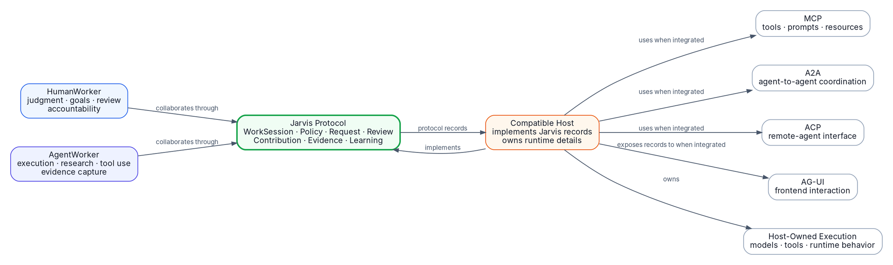
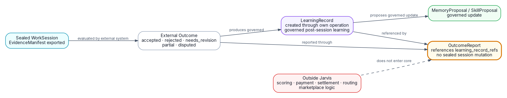
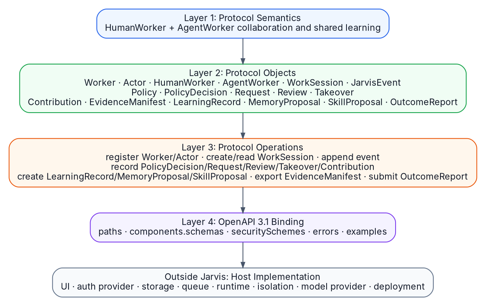
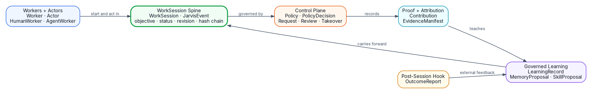
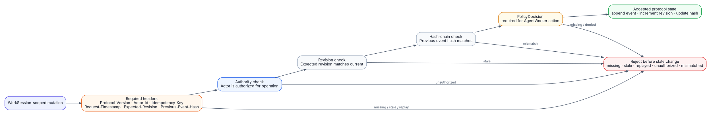

# Jarvis Complete Protocol Reference

Protocol version: v0.1.0
Release status: released Protocol Alpha
Last updated: 2026-07-07
Source branch: `codex/complete-protocol-reference`
Source commit: `e0c4842`

This file is a grounding and onboarding reference. It consolidates the protocol-facing source documents into one self-contained Markdown file while preserving the canonical technical wording and record shapes.

## Document Status

Source files: `README.md`, `CHANGELOG.md`, `docs/README.md`, `docs/releases/`, `docs/protocol/`, `docs/architecture_brief/`, `docs/openapi/`, `docs/conformance/`, `docs/examples/`, `docs/reviews/`, and `docs/planning/`.

The canonical protocol object model appears in the section `Protocol Semantics, Thesis, Positioning, And Boundary` under source `docs/protocol/11-core-protocol-objects.md`. That source is reproduced in full, including every canonical object field shape and invariant.

## Table Of Contents

- [Traceability And Source Coverage](#traceability-and-source-coverage)
- [Consistency Findings](#consistency-findings)
- [Release Status And Top-Level Orientation](#release-status-and-top-level-orientation)
- [Protocol Semantics, Thesis, Positioning, And Boundary](#protocol-semantics-thesis-positioning-and-boundary)
- [Architecture Principles And Architecture Views](#architecture-principles-and-architecture-views)
- [OpenAPI Communication Binding](#openapi-communication-binding)
- [Conformance Requirements](#conformance-requirements)
- [Worked Examples And Evidence Packs](#worked-examples-and-evidence-packs)
- [Readiness And Acceptance Criteria](#readiness-and-acceptance-criteria)
- [Planning And Execution Archive](#planning-and-execution-archive)
- [OpenAPI YAML](#openapi-yaml)
- [Architecture Diagram DOT Sources](#architecture-diagram-dot-sources)
- [Conformance Fixture JSON](#conformance-fixture-json)
- [Example Evidence Pack And Implementation Proof JSON](#example-evidence-pack-and-implementation-proof-json)
- [Planning Sheet CSV](#planning-sheet-csv)
- [Rendered And Binary Source Inventory](#rendered-and-binary-source-inventory)

## Traceability And Source Coverage

| Section | Source files | Inclusion |
| --- | --- | --- |
| Release Status And Top-Level Orientation | `README.md, CHANGELOG.md, docs/README.md, docs/releases/` | Full Markdown text included with source headings. |
| Protocol Semantics, Thesis, Positioning, And Boundary | `docs/protocol/` | Full Markdown text included with source headings. |
| Architecture Principles And Architecture Views | `docs/architecture_brief/` | Full Markdown text included with source headings. |
| OpenAPI Communication Binding | `docs/openapi/README.md and docs/openapi/jarvis-openapi.yaml` | Full Markdown text included with source headings. |
| Conformance Requirements | `docs/conformance/` | Full Markdown text included with source headings. |
| Worked Examples And Evidence Packs | `docs/examples/` | Full Markdown text included with source headings. |
| Readiness And Acceptance Criteria | `docs/reviews/` | Full Markdown text included with source headings. |
| Planning And Execution Archive | `docs/planning/` | Full Markdown text included with source headings. |
| OpenAPI YAML | `docs/openapi/jarvis-openapi.yaml` | Full text included in fenced `yaml` blocks. |
| Architecture Diagram DOT Sources | `docs/architecture_brief/diagrams/evidence_learning_flow.dot`, `docs/architecture_brief/diagrams/future_interoperability.dot`, `docs/architecture_brief/diagrams/interoperability_context.dot`, `docs/architecture_brief/diagrams/outcome_report_hook.dot`, plus 5 more | Full text included in fenced `dot` blocks. |
| Conformance Fixture JSON | `docs/conformance/fixtures/invalid/forbidden-host-private-export-field.json`, `docs/conformance/fixtures/invalid/invalid-approval-scope.json`, `docs/conformance/fixtures/invalid/invalid-evidence-export-state.json`, `docs/conformance/fixtures/invalid/invalid-previous-event-hash.json`, plus 23 more | Full text included in fenced `json` blocks. |
| Example Evidence Pack And Implementation Proof JSON | `docs/examples/evidence-packs/existing-agent-review/events/event-chain.json`, `docs/examples/evidence-packs/existing-agent-review/evidence/evidence-manifest.json`, `docs/examples/evidence-packs/existing-agent-review/headers/00-register-worker-human.json`, `docs/examples/evidence-packs/existing-agent-review/headers/01-register-worker-agent.json`, plus 81 more | Full text included in fenced `json` blocks. |
| Planning Sheet CSV | `docs/planning/sheets/jarvis_roadmap.csv` | Full text included in fenced `csv` blocks. |
| Rendered And Binary Source Inventory | PNG, PDF, XLSX, CSS, and shell render assets under `docs/` | Listed as inventory. Binary/render assets are not embedded as text. |

## Consistency Findings

Source files: `docs/protocol/11-core-protocol-objects.md`, `docs/protocol/12-request-protocol.md`, `docs/architecture_brief/jarvis_protocol_architecture_brief.md`, `docs/conformance/checklist.md`, and `docs/conformance/compatibility-mapping.md`.

No blocking contradiction was found across the included normative protocol sources.

Precision notes:

- `Takeover` appears in two connected places: Review decision values include `takeover`, and the direct-control path is recorded as a separate `Takeover` object with lock epoch and reconciliation refs. This is one Request resolution path with a distinct protocol record for human control.
- The public thesis centers HumanWorker, AgentWorker, and pair learning. The contribution model also preserves `service` and `tool` attribution for protocol-visible system actions. LearningRecord subject type remains `human`, `agent`, or `pair`.
- The architecture brief says `Human, agent, pair, and service contributions`; the canonical object model and conformance docs use `human | agent | service | tool | shared` for `Contribution.contributor_type`. Treat the canonical object model as the field-level source of truth.
- Zero-trust language in public material must say Jarvis verifies required headers, Actor authority, revisions, idempotency, and event-hash links before accepting state changes. Signed export profiles are optional; base v0.1 fixture hashes do not claim signed cryptographic proof.

## Release Status And Top-Level Orientation

Source files: `README.md, CHANGELOG.md, docs/README.md, docs/releases/`.

### Source: `README.md`

### Jarvis

Human-agent collaboration and learning-loop protocol.

Jarvis is the protocol for governed collaboration and shared learning between
human workers and agent workers.

It defines how human workers and agent workers coordinate under shared goals
and human-defined policy, complete work together, review each other, record
contributions, capture evidence, and both improve across WorkSessions.

Jarvis stays focused on the collaboration and learning loop. Hosts and
external systems integrate with Jarvis by implementing its protocol contracts.

Jarvis is the compatibility protocol for any HumanWorker, AgentWorker, host, or
external system that needs to participate in governed human-agent collaboration
and shared learning.

#### Status

Jarvis v0.1.0 is released as Protocol Alpha.
This release does not certify Jarvis or any implementation, designate an
official host, claim production adoption, establish foundation governance, or
create long-term support.

Release materials:

- [CHANGELOG.md](../../CHANGELOG.md)
- [CONTRIBUTING.md](../../CONTRIBUTING.md)
- [SECURITY.md](../../SECURITY.md)
- [docs/releases/v0.1.0.md](../releases/v0.1.0.md)

#### Public Documentation Site

The public documentation site is the first entry point for the protocol,
OpenAPI contract, conformance surface, SDK helper tooling, examples, release
status, and non-normative walkthrough.

Open the live documentation site here:

https://flow-research.github.io/jarvis/

The walkthrough on the site is non-normative public explanation. It is not
protocol proof and it is not a host UI implementation. The page is served
directly by GitHub Pages from this repository.

#### One-Line Definition

Jarvis defines how HumanWorkers and AgentWorkers collaborate under shared goals
and Policy, producing durable WorkSessions, reviewable Requests, attributable
Contributions, governed shared Learning, and portable Evidence.

#### Plain English Definition

Jarvis defines protocol rules for humans and agents to work together under
policy, review, evidence, and shared learning.

The human does not just prompt. The agent does not just answer. They both
participate in the work.

The human gives direction, judgment, context, correction, approval, and
accountability. The AgentWorker contributes planning, research, drafting,
evidence collection, and improvement proposals through host-owned execution
and tool use.

Jarvis defines the rules of that collaboration. Hosts and external systems
implement those rules.

#### Protocol Position

MCP connects agents to tools.
A2A connects agents to agents.
AG-UI connects agents to UI.
Jarvis records how HumanWorkers and AgentWorkers collaborate, produce evidence,
and learn.

Jarvis does not replace those protocols. Jarvis defines the collaboration
record around human-agent work: WorkSession, Policy, PolicyDecision, Request,
Review, Takeover, Contribution, EvidenceManifest, LearningRecord,
MemoryProposal, SkillProposal, and OutcomeReport.

Existing agents participate by preserving native execution and emitting
Jarvis-compatible protocol records. Hosts own UI, storage, auth, execution,
models, tools, memory engines, deployment, monitoring, and workflow.

#### Compatible Implementations

Compatible implementations MUST prove:

- WorkSession-scoped mutations carry the required Jarvis headers.
- Actor authority is verified before accepted protocol state.
- Actor-bearing mutation bodies match `Jarvis-Actor-Id`.
- WorkSession revision and previous event hash are checked before mutation.
- PolicyDecision is recorded before accepted AgentWorker action state.
- Request records blocked or review-required scope.
- Review or Takeover resolves Request.
- ApprovalScope bounds Review-approved continuation.
- Takeover lock epoch and reconciliation refs bind Takeover continuation.
- Contribution records who did what.
- EvidenceManifest exports portable proof without host-private fields.
- LearningRecord records human, agent, or pair learning.
- MemoryProposal and SkillProposal remain governed.
- OutcomeReport carries post-session feedback without sealed-record mutation.

#### Thesis

The winning unit is not the human alone and not the agent alone. The winning
unit is the human-agent team that learns together.

The shift is from isolated agent applications to compatible human-agent
collaboration. The human does not outsource judgment, and the agent does not
remain a passive tool. They form a working pair that gets better through
repeated WorkSessions.

The primitive is not:

```txt
User -> Agent -> Answer
```

The loop is:

```txt
HumanWorker + AgentWorker -> WorkSession -> Review -> Evidence -> Shared Learning
```

Confirmed LearningRecords, MemoryProposals, and SkillProposals give future
WorkSessions portable learning inputs. WorkSession is the durable record of
that collaboration and learning loop.

Jarvis formalizes the loop where:

```txt
human judgment + agent execution + policy + review + evidence + shared learning
```

compound across real work.

The protocol makes this loop portable: different compatible implementations
exchange the same WorkSession, Request, Review, Contribution,
EvidenceManifest, and LearningRecord concepts without sharing the same
infrastructure.

#### Core Loop

```txt
1. Human defines intent.
2. Policy defines boundaries.
3. Agent works inside those boundaries.
4. Agent asks when blocked.
5. Human reviews, answers, approves, denies, narrows, corrects, or takes over.
6. Work continues.
7. Contributions are recorded.
8. Evidence is captured.
9. Learning is proposed.
10. Confirmed learning improves both workers and the next WorkSession.
```

#### Central Record

`WorkSession` is the center of Jarvis.

A WorkSession is not chat history. A WorkSession is the durable record of real
human-agent collaboration around a focused unit of work.

It contains:

- objective
- human worker
- agent worker
- policy
- available capabilities
- context
- events
- requests
- reviews
- tool actions
- artifacts
- contributions
- evidence
- learning proposals
- final outcome

#### First-Class Workers

Jarvis does not model `User + Assistant`.

Jarvis models `HumanWorker + AgentWorker`.

Both are workers. Both are actors. Both contribute to the WorkSession. Both
learn from the loop.

##### HumanWorker

The human is:

- goal setter
- domain expert
- reviewer
- teacher
- quality judge
- policy owner
- accountable actor
- source of taste
- source of world context

##### AgentWorker

The agent is:

- autonomous worker
- executor
- researcher
- context retriever
- tool user
- draft producer
- evidence collector
- learning participant

#### Core Protocol Contracts

Jarvis v0.1 defines these contracts. The canonical object shapes and invariants
are in [docs/protocol/11-core-protocol-objects.md](../protocol/11-core-protocol-objects.md).

```txt
Worker
Actor
HumanWorker
AgentWorker
WorkSession
JarvisEvent
Policy
PolicyDecision
Request
Review
Takeover
Contribution
EvidenceManifest
LearningRecord
MemoryProposal
SkillProposal
OutcomeReport
```

#### Protocol Laws

1. Jarvis defines human-agent collaboration and shared learning.
2. WorkSession is the source of truth.
3. Jarvis does not prescribe infrastructure.
4. Policy governs autonomy.
5. Learning is governed.
6. Evidence is captured during work.
7. Contributions are attributable.
8. Human judgment remains central.
9. Execution is delegable; accountability remains attributable.
10. HumanWorker and AgentWorker both learn.
11. Compatible implementations carry accepted learning into future WorkSessions
    when accepted records are in scope.
12. Jarvis stays protocol-only; hosts and external systems implement or
    integrate with it without becoming it.

#### Boundaries

Jarvis owns:

- collaboration and learning-loop protocol semantics
- interoperability contracts
- conformance rules
- WorkSession lifecycle
- policy-governed autonomy
- request, review, and takeover semantics
- contribution records
- evidence manifests
- governed memory and learning proposals
- skill proposal semantics
- integration boundary contracts

Jarvis does not own host implementation:

- UI
- authentication
- authorization
- storage
- execution
- model providers
- tool execution
- isolation mechanisms
- deployment
- billing
- monitoring
- host-specific workflow

#### SDK Boundary

A Jarvis SDK is a protocol implementation kit.

A Jarvis SDK provides protocol helpers for compatible implementations to create
protocol records, attach required headers, preserve event hash chains, validate
Request/Review/Takeover state, export EvidenceManifest records, run conformance
fixtures, and map example work into Jarvis records.

A Jarvis SDK does not run agents, orchestrate models, execute tools, own memory
engines, provide UI, manage auth, store records, run sandboxes, schedule work,
or become a host adapter.

Existing agents remain first-class. Compatibility requires existing agents and
hosts to produce compatible WorkSession, Request, Review, Contribution,
EvidenceManifest, and LearningRecord records without being rewritten as
Jarvis-owned agents.

#### Docs

- [docs/README.md](../README.md) - docs index.
- [docs/protocol/](../protocol) - protocol definition, architecture,
  object model, policy, memory, evidence, integration boundaries, package
  contracts, v0.1 protocol proof, protocol lock, OpenAPI binding, and
  positioning lock.
- [docs/architecture_brief/](../architecture_brief) - shareable protocol
  architecture brief and PDF.
- [docs/openapi/](../openapi) - OpenAPI 3.1 communication binding.
- [docs/conformance/](../conformance) - compatibility mapping,
  conformance entries, fixtures, validator requirements, and existing-agent
  proof plan.
- [docs/examples/](../examples) - protocol record, existing-agent
  compatibility, compatible-host mapping examples, and evidence packs.
- [packages/](../../packages) - TypeScript, Python, and CLI protocol helper
  packages.
- [docs/reviews/](../reviews) - protocol readiness and acceptance review
  criteria.
- [docs/releases/](../releases) - protocol release notes and validation
  requirements.

#### Local Checks

Every protocol PR MUST run:

```txt
python3 scripts/check_conformance_fixtures.py
python3 scripts/check_openapi_contract.py
python3 scripts/check_markdown_links.py
python3 scripts/check_docs_site.py
python3 scripts/check_example_evidence_packs.py
python3 scripts/check_protocol_wording.py
python3 scripts/check_sdk_boundary.py
git diff --check
```

Jarvis defines `check_conformance_fixtures.py` as fixture-record validation only.
The validator MUST NOT execute host behavior.


### Source: `CHANGELOG.md`

### Changelog

All notable Jarvis protocol changes are recorded here.

#### v0.1.0 - Protocol Alpha

Status: released.

Release date: 2026-07-01.

Jarvis v0.1.0 is the first Protocol Alpha release. This release does not
certify Jarvis or any implementation, designate an official host, claim
production adoption, establish foundation governance, or create long-term
support.

##### Added

- Human-agent collaboration and shared-learning thesis.
- Core protocol object model:
  `Worker`, `Actor`, `HumanWorker`, `AgentWorker`, `WorkSession`,
  `JarvisEvent`, `Policy`, `PolicyDecision`, `Request`, `Review`, `Takeover`,
  `Contribution`, `EvidenceManifest`, `LearningRecord`, `MemoryProposal`,
  `SkillProposal`, and `OutcomeReport`.
- Request, Review, ApprovalScope, and Takeover lifecycle rules.
- Contribution, evidence, governed learning, memory proposal, skill proposal,
  and outcome report contracts.
- OpenAPI 3.1 communication binding.
- Zero-trust mutation headers and protocol error envelope.
- Conformance checklist, golden-path fixture, invalid fixtures, and fixture
  validator.
- Existing-agent compatibility mapping and protocol-record examples.
- Public non-normative simulation.
- v0.1 acceptance review with Gates 1 through 8 accepted and final acceptance
  decision recorded.

##### Boundary

- Hosts own UI, auth, storage, queues, execution, isolation, models, tools,
  billing, monitoring, deployment, and host workflow.
- Jarvis does not include SDK implementation, adapters, wrappers, runtime
  behavior, host UI, model orchestration, tool execution, storage behavior,
  auth behavior, billing behavior, scoring behavior, payment behavior, or
  deployment behavior.

##### Validation

- `python3 scripts/check_conformance_fixtures.py`
- `python3 scripts/check_openapi_contract.py`
- `python3 scripts/check_markdown_links.py`
- `python3 scripts/check_protocol_wording.py`
- `git diff --check`


### Source: `docs/README.md`

### Jarvis Docs

Jarvis docs are organized by use.

#### Complete Reference

- [reference/complete-protocol-reference.md](complete-protocol-reference.md) -
  consolidated v0.1 protocol reference for education and onboarding.

#### Protocol

Protocol docs define what Jarvis is and what compatible implementations keep
stable.

- [00-principles.md](../protocol/00-principles.md)
- [01-architecture.md](../protocol/01-architecture.md)
- [02-memory.md](../protocol/02-memory.md)
- [03-autonomy-policy.md](../protocol/03-autonomy-policy.md)
- [04-work-sessions.md](../protocol/04-work-sessions.md)
- [05-skills-tools.md](../protocol/05-skills-tools.md)
- [06-integration-boundaries.md](../protocol/06-integration-boundaries.md)
- [07-protocol-decisions.md](../protocol/07-protocol-decisions.md)
- [08-package-contracts.md](../protocol/08-package-contracts.md)
- [09-host-integration.md](../protocol/09-host-integration.md)
- [10-protocol-mvp.md](../protocol/10-protocol-mvp.md)
- [11-core-protocol-objects.md](../protocol/11-core-protocol-objects.md)
- [12-request-protocol.md](../protocol/12-request-protocol.md)
- [13-contribution-evidence-learning.md](../protocol/13-contribution-evidence-learning.md)
- [14-protocol-lock.md](../protocol/14-protocol-lock.md)
- [15-openapi-communication-binding.md](../protocol/15-openapi-communication-binding.md)
- [16-positioning-adoption-lock.md](../protocol/16-positioning-adoption-lock.md)

#### Post-v0.1 Work

Post-v0.1 docs record implemented SDK helper tooling and active
implementation-proof work without changing normative protocol rules.

- [post-v0.1-sdk-helper-tooling/README.md](../planning/post-v0.1-sdk-helper-tooling/README.md)
- [examples/implementation-proof/native-coding-agent/README.md](../examples/implementation-proof/native-coding-agent/README.md)
- [examples/implementation-proof/live-agent-frameworks/README.md](../examples/implementation-proof/live-agent-frameworks/README.md)

#### Planning Archive

Planning docs record historical v0.1 release execution and are non-normative.

- [v0.1-acceptance-review/README.md](../planning/v0.1-acceptance-review/README.md)

#### Conformance

Conformance docs define compatibility mapping, proof fixtures, rejection gates,
and existing-agent compatibility proof.

- [conformance/README.md](../conformance/README.md)
- [conformance/compatibility-mapping.md](../conformance/compatibility-mapping.md)
- [conformance/golden-path.md](../conformance/golden-path.md)
- [conformance/failure-modes.md](../conformance/failure-modes.md)
- [conformance/existing-agent-proof-plan.md](../conformance/existing-agent-proof-plan.md)
- [conformance/fixtures/README.md](../conformance/fixtures/README.md)

#### Examples

Examples show protocol records and record-compatibility evidence without
defining host-owned execution.

- [examples/README.md](../examples/README.md)
- [examples/protocol-records.md](../examples/protocol-records.md)
- [examples/existing-agent-compatibility.md](../examples/existing-agent-compatibility.md)
- [examples/compatible-host-mapping.md](../examples/compatible-host-mapping.md)
- [examples/evidence-packs/existing-agent-review/README.md](../examples/evidence-packs/existing-agent-review/README.md)
- [examples/evidence-packs/existing-agent-takeover/README.md](../examples/evidence-packs/existing-agent-takeover/README.md)
- [examples/implementation-proof/native-coding-agent/README.md](../examples/implementation-proof/native-coding-agent/README.md)
- [examples/implementation-proof/live-agent-frameworks/README.md](../examples/implementation-proof/live-agent-frameworks/README.md)

#### OpenAPI

The OpenAPI directory contains the v0.1 machine-readable communication binding.

- [openapi/README.md](../openapi/README.md)
- [openapi/jarvis-openapi.yaml](../openapi/jarvis-openapi.yaml)

#### Architecture Brief

The architecture brief packages the protocol architecture into a shareable PDF.

- [architecture_brief/README.md](../architecture_brief/README.md)
- [architecture_brief/jarvis_protocol_architecture_brief.md](../architecture_brief/jarvis_protocol_architecture_brief.md)
- [architecture_brief/jarvis_protocol_architecture_brief.pdf](../architecture_brief/jarvis_protocol_architecture_brief.pdf)

#### Releases

Release docs record protocol scope, validation requirements, and release
status.

- [releases/README.md](../releases/README.md)
- [releases/v0.1.0.md](../releases/v0.1.0.md)

#### Readiness

Readiness docs lock OpenAPI entry criteria and acceptance criteria without
changing protocol source files.

- [13-protocol-readiness-review.md](../reviews/13-protocol-readiness-review.md)
- [acceptance-criteria.md](../reviews/acceptance-criteria.md)


### Source: `docs/releases/v0.1.0.md`

### Jarvis v0.1.0 Release Notes

Status: released Protocol Alpha.

Jarvis v0.1.0 is Protocol Alpha for governed human-agent collaboration and
shared learning.

This release does not certify Jarvis or any implementation, designate an
official host, claim production adoption, establish foundation governance, or
create long-term support.

#### Protocol Identity

- OpenAPI `info.version: 0.1.0` identifies the OpenAPI artifact.
- OpenAPI `x-jarvis-protocol.version: v0.1` identifies the protocol line.
- Jarvis v0.1.0 is released as Protocol Alpha after
  [acceptance-decision.md](../planning/v0.1-acceptance-review/acceptance-decision.md).

#### Included In v0.1.0

- HumanWorker and AgentWorker collaboration model.
- WorkSession as the durable source of truth.
- Policy-governed AgentWorker action through PolicyDecision.
- Request, Review, ApprovalScope, and Takeover control-plane rules.
- Contribution records.
- EvidenceManifest export rules.
- LearningRecord, MemoryProposal, and SkillProposal governance.
- OutcomeReport feedback ingress.
- OpenAPI 3.1 communication binding.
- Required protocol headers.
- Protocol error envelope.
- Conformance checklist and fixtures.
- Compatible protocol examples.
- Non-normative public simulation.

#### Not Included In v0.1.0

- SDK implementation.
- host runtime.
- adapters or wrappers.
- model orchestration.
- tool execution.
- storage backend.
- auth provider.
- UI implementation.
- billing behavior.
- scoring behavior.
- payment behavior.
- deployment stack.
- certification.
- adopter registry.
- official host status.
- production-adoption claim.
- foundation governance.
- long-term support.

#### Compatibility Claims

A public compatibility claim MUST use the format in
[checklist.md#public-compatibility-claim](../conformance/checklist.md#public-compatibility-claim).

A valid claim MUST name the protocol version, conformance surface, fixture or
checklist basis, verification date, retained evidence for the checks run,
implementation version, and verifier identity or explicit self-attested status.

Jarvis v0.1.0 does not certify implementations. Jarvis defines compatibility
claim requirements; the claiming implementation owns the evidence behind the
claim.

#### Validation

The v0.1.0 release tag MUST pass:

```txt
python3 scripts/check_conformance_fixtures.py
python3 scripts/check_openapi_contract.py
python3 scripts/check_markdown_links.py
python3 scripts/check_protocol_wording.py
git diff --check
```

Demo JavaScript MUST pass:

```txt
node --check demo/assets/app.js
```


### Source: `docs/releases/README.md`

### Releases

Jarvis release notes record protocol scope, validation requirements, and public
status for each protocol tag.

- [v0.1.0.md](../releases/v0.1.0.md) - Protocol Alpha release notes.


## Protocol Semantics, Thesis, Positioning, And Boundary

Source files: `docs/protocol/`.

### Source: `docs/protocol/00-principles.md`

### Principles

#### Official Definition

Jarvis is the human-agent collaboration and learning-loop protocol. It defines
how human workers and agent workers coordinate under shared goals and
human-defined policy, complete work together, review each other, record
contributions, capture evidence, and both improve across WorkSessions.

#### One-Line Definition

Jarvis defines how HumanWorkers and AgentWorkers collaborate under shared goals
and Policy, producing durable WorkSessions, reviewable Requests, attributable
Contributions, governed shared Learning, and portable Evidence.

#### Simple Definition

Jarvis is how humans and agents work together.

The human does not just prompt. The agent does not just answer. Both participate
in the work.

Jarvis is a compatibility protocol, not one user's workflow. Hosts,
human workers, agent workers, and external systems implement the contracts and
participate in the same collaboration loop.

#### Protocol Boundary Law

Jarvis stays protocol-only.

Jarvis does not become host implementation. Execution, UI, auth, storage,
deployment, billing, model calls, tool execution, and isolation remain outside
Jarvis.

Those systems implement Jarvis, integrate with Jarvis, or produce records that
Jarvis captures. They do not become Jarvis.

Jarvis owns the collaboration record: WorkSession, PolicyDecision, Request,
Review, Takeover, Contribution, EvidenceManifest, LearningRecord,
MemoryProposal, SkillProposal, OutcomeReport, protocol errors, security
requirements, extension rules, and conformance expectations.

Everything else stays with the host.

#### Design From Collaboration, Not Chat

Chat is only one interface. Jarvis is the protocol underneath human-agent work.

A real human-agent work loop includes messages, tool calls, files, requests,
reviews, corrections, decisions, artifacts, contributions, evidence, and
learning. Jarvis models the whole loop.

#### HumanWorker And AgentWorker Are First-Class

Jarvis does not model `User + Assistant`.

Jarvis models `HumanWorker + AgentWorker`.

Both are workers. Both are actors. Both contribute to the WorkSession. Both
learn from the loop.

The human is:

- goal setter
- domain expert
- reviewer
- teacher
- quality judge
- policy owner
- accountable actor
- source of taste
- source of world context

The agent is:

- autonomous worker
- executor
- researcher
- context retriever
- tool user
- draft producer
- evidence collector
- learning participant

Jarvis makes the working relationship durable, governed, reviewable, and able
to improve over time.

#### The Winning Unit Is The Team

The winning unit is not the human alone and not the agent alone. The winning
unit is the human-agent team that learns together.

Jarvis exists to formalize the loop where the human improves, the agent
improves, the relationship improves, and completed WorkSessions improve the
next WorkSession.

The protocol makes the loop portable across compatible hosts and external
systems.

#### Jarvis Is About The Shared Learning Loop

The industry usually starts with agent-centric questions:

- how do agents get smarter?
- how do agents become autonomous?
- how do agents use tools?
- how do agents execute tasks?

Jarvis starts from a different loop:

```txt
HumanWorker and AgentWorker collaborate.
HumanWorker reviews, corrects, approves, or takes over.
AgentWorker executes, proposes, adapts, and records evidence.
Both workers learn.
The next WorkSession improves.
```

The WorkSession is central because it is the protocol record of that
collaboration and learning loop.

#### WorkSession Is The Source Of Truth

A WorkSession is not chat history.

A WorkSession is the durable record of real collaboration:

- objective
- human worker
- agent worker
- policy
- available capabilities
- context
- events
- requests
- reviews
- tool actions
- artifacts
- contributions
- evidence
- learning proposals
- final outcome

Every meaningful collaboration happens inside a WorkSession.

#### Autonomy Through Policy

The agent does not need the human to approve every small step.

The human defines policy:

- what the agent inspects
- what the agent executes
- what the agent changes
- what the agent sends externally
- when the agent must ask
- when the human must review

Inside policy, the agent proceeds. Outside policy, it creates a Request.

#### Requests Are The Control Plane

When the agent lacks permission, context, or judgment, it creates a Request.

Requests are structured, scoped deferrals, not vague interruptions, chat, or
notifications. A Request blocks only its declared scope. A human approves,
denies, narrows, corrects, answers, or takes over.

#### Reviews Teach The System

Human review is not only quality control. Human review is teaching material.

Jarvis records reviews as protocol events that become memory proposals,
skill proposals, policy improvements, and better future behavior.

#### Contributions Are Attributable

Jarvis records who did what.

Human, agent, service, tool, and shared contributions must remain
distinguishable. The record must not collapse the work into "the agent did it"
or "the human did it."

#### Accountability Remains Attributable

Execution is delegable. Accountability cannot disappear.

The agent executes, researches, drafts, automates, and collects evidence inside
policy. The human remains an accountable actor for judgment, policy, review,
and final tradeoffs. Jarvis records enough contribution and evidence for
accountability to remain inspectable.

#### Evidence Is Captured During Work

Evidence is produced as collaboration happens:

- commands run
- tool outputs
- sources inspected
- files created
- decisions made
- policy decisions
- requests
- human reviews
- corrections
- final artifacts

Evidence is not reconstructed at the end from memory.

#### Learning Is Governed

Jarvis does not silently mutate durable memory.

Learning must be proposed, reviewed, scoped, and accepted. Jarvis asks:

- what did the human learn?
- what did the agent learn?
- what did the human-agent pair learn?
- what improves next time?

#### Skills Are Procedural Memory

Skills are reusable ways of working. They are more durable than prompts and
more specific than generic instructions.

A SkillProposal captures:

- when to use it
- how to do the work
- required tools
- review checks
- failure cases
- provenance
- review state

#### Infrastructure Is Outside Jarvis

Jarvis protocol semantics do not require any cloud, model provider, isolation
mechanism, storage system, queue, deployment platform, or execution stack.

Hosts decide how to run agents, where to store data, which isolation mechanism
to use, which model to call, and which infrastructure to deploy on. Jarvis
defines the collaboration and learning-loop protocol those systems implement.

#### Protocol Laws

1. Jarvis defines human-agent collaboration and shared learning.
2. Jarvis is a compatibility protocol.
3. WorkSession is the source of truth.
4. Jarvis does not prescribe infrastructure or execution.
5. Policy governs autonomy.
6. Learning is governed.
7. Evidence is captured during work.
8. Contributions are attributable.
9. Human judgment remains central.
10. Execution is delegable; accountability remains attributable.
11. HumanWorker and AgentWorker both learn.
12. Every completed WorkSession improves the next WorkSession.

#### Non-Goals

Jarvis is not:

- a UI
- a model provider
- an isolation implementation
- a storage implementation
- a workflow engine only
- an external identity system
- an external work ownership system

Jarvis integrates with many systems, but it owns the human-agent collaboration
and learning-loop protocol.


### Source: `docs/protocol/01-architecture.md`

### Architecture

Jarvis is the protocol for policy-governed collaboration and shared learning
between human workers and agent workers.

It defines how a human and an agent become a working team: shared goals,
policy, requests, review, takeover, contribution records, evidence, memory,
learning, and skills.

The architectural center is the HumanWorker + AgentWorker learning loop.
WorkSession is the durable record of that loop.

#### Layer Model

```txt
Compatible hosts
  UI, auth, storage, execution, deployment, model calls, tool execution

Jarvis protocol
  actors, workers, WorkSessions, policies, requests, reviews, takeover,
  contributions, evidence, learning records, memory proposals,
  skill proposals

External implementation choices
  models, tools, external protocol servers, isolation, storage, queues,
  clouds, local machines, deployment platforms, interfaces
```

Only the middle layer is Jarvis.

Hosts decide how to execute work. Jarvis defines the protocol records and state
transitions that make the work collaborative, governed, reviewable,
attributable, and portable.

Compatibility is the architecture goal. A HumanWorker, AgentWorker, host, or
external system participates without adopting another system's execution stack
or host model.

#### Core Protocol Contracts

The canonical object definitions are in
[11-core-protocol-objects.md](../protocol/11-core-protocol-objects.md).

Architecture depends on these objects:

```txt
Worker
Actor
HumanWorker
AgentWorker
WorkSession
JarvisEvent
Policy
PolicyDecision
Request
Review
Takeover
Contribution
EvidenceManifest
LearningRecord
MemoryProposal
SkillProposal
OutcomeReport
```

Jarvis defines this architecture: HumanWorker and AgentWorker collaborate
inside a WorkSession. Policy bounds AgentWorker autonomy. Request, Review, and
Takeover record human judgment and resolution. Contribution records
attributable work. EvidenceManifest records portable evidence. LearningRecord,
MemoryProposal, and SkillProposal carry governed learning into future
WorkSessions. OutcomeReport carries post-session feedback without mutating
sealed WorkSession or EvidenceManifest records.

#### Standard Work Flow

```txt
1. HumanWorker defines intent.
2. A compatible host starts or resumes a WorkSession using Jarvis protocol
   records.
3. Policy defines the action boundary.
4. AgentWorker receives context, memory, skills, and available capabilities.
5. AgentWorker plans and executes inside policy.
6. Policy evaluates every meaningful action.
7. Missing permission, context, or judgment becomes a Request.
8. HumanWorker reviews, answers, approves, denies, narrows, corrects, or takes
   over.
9. AgentWorker resumes when allowed.
10. Events, contributions, and evidence are recorded as protocol records.
11. Memory, skill, and learning updates are proposed for the human, agent, and
    pair.
12. HumanWorker confirms or rejects governed learning.
13. EvidenceManifest exports.
14. The HumanWorker, AgentWorker, and next WorkSession start with confirmed
    improvements.
```

#### Ownership Boundary

Jarvis owns:

- protocol contracts
- interoperability semantics
- conformance rules
- actor semantics
- worker semantics
- WorkSession lifecycle
- policy-governed autonomy
- request, review, and takeover semantics
- contribution records
- evidence manifests
- learning records
- memory proposal semantics
- skill proposal semantics
- context manifest semantics
- portable export semantics

Hosts own:

- user interface
- authentication and accounts
- execution context
- model/provider selection
- tool execution
- isolation
- storage
- queues and scheduling
- deployment
- observability
- billing
- organization controls

#### External System Boundary

External systems start WorkSessions, consume EvidenceManifests, route Reviews,
evaluate Contributions, or provide context and skills through Jarvis records.
Jarvis defines the protocol records exchanged with those systems. It does not
define their host architecture.

#### Minimum Developer Entry Point

```txt
create HumanWorker
create AgentWorker
start WorkSession
attach Policy
attach tools, skills, and memory
send objective
observe events, requests, contributions, and evidence
review or take over when needed
complete WorkSession
inspect learning proposals
export EvidenceManifest
```

The developer entry point is protocol-first. Execution, hosting, storage, and
UI are implementation choices outside Jarvis.


### Source: `docs/protocol/02-memory.md`

### Memory

Jarvis defines governed LearningRecord and MemoryProposal semantics. Hosts own
memory engines, transcript stores, vector databases, retrieval, and storage.

Jarvis memory records how the human and agent learn to work together. It is
not a raw transcript dump or only a vector database.

#### Memory Scopes

##### Human Memory

What the system knows about the human:

- profile
- goals
- preferences
- boundaries
- domain expertise
- style
- recurring corrections

##### Agent Memory

What the agent has learned about its own operation:

- strategies that worked
- mistakes to avoid
- tool experience
- planning habits
- failure patterns
- proven heuristics

##### Shared Memory

What the human and agent learned together:

- collaboration patterns
- accepted decisions
- reviewed corrections
- repeated workflow preferences
- trusted sources
- rejected approaches

##### Project Memory

Context attached to a workspace/project:

- files
- docs
- conventions
- domain terms
- prior decisions
- local skills

##### Task Memory

Shorter-lived memory for active work:

- objective
- requirements
- findings
- sources
- intermediate decisions
- unresolved questions
- evidence references

##### Procedural Memory

Reusable work procedures:

- skills
- checklists
- playbooks
- examples
- tool sequences
- review rubrics

#### Memory Authority And Scope Lattice

Memory has authority only inside its scope.

Default scope rules:

- current human instruction outranks all stored memory
- explicit boundary outranks preference
- confirmed human preference outranks pinned non-human memory
- pinned memory outranks ordinary confirmed memory
- project memory applies only inside that project unless promoted
- task memory expires or remains task-scoped unless promoted
- agent observations never outrank human-confirmed memory
- untrusted tool output has no instruction authority

Promotion rules:

- task memory promotes to project/shared only through review
- project memory never crosses to another project by default
- project-specific preferences never become global human preferences without
  confirmation
- global human boundaries flow downward into every project/session
- skill/procedural memory expands future behavior only through skill review
  gates

Conflict rules:

- newer superseding memory suppresses older memory
- negative memory such as "do not use X" must be retrievable even when semantic
  similarity is low
- unresolved conflicts become a request, not a silent model decision by
  the model

#### Memory Types

```txt
fact
preference
boundary
correction
decision
procedure
observation
outcome
source
```

The type affects retrieval and write policy. A preference has different
authority than an observation. A boundary outranks a learned habit.

#### Lifecycle

```txt
observed
  captured but untrusted

pending_review
  proposed by a learning pass or protocol actor

confirmed
  accepted by the human or trusted workflow

pinned
  high-priority confirmed memory

superseded
  replaced by newer memory

expired
  no longer active
```

Agent-discovered memory defaults to `pending_review`, not `confirmed`.

#### Provenance

Every memory needs provenance:

```txt
source actor
source WorkSession
source event/message/tool call
source document/file/url when applicable
created time
last used time
confirmation state
confidence
scope
supersedes/superseded_by
```

Without provenance, memory becomes unsafe. Tool output, web pages, and external
content are untrusted until policy says otherwise.

#### Write Policy

The model never writes durable memory directly.

Memory write flow:

```txt
1. Turn or WorkSession produces events, reviews, tool outputs, and artifacts.
2. Learning pass proposes memory changes.
3. Policy classifies each proposal.
4. Low-risk scoped notes auto-confirm only inside the limits below.
5. High-impact memory needs human review.
6. Confirmed memory becomes retrievable.
```

Human review is required for:

- broad identity claims
- durable preferences
- boundaries
- permission-related memories
- skill changes
- project/global facts extracted from untrusted sources
- claims that affect future external actions

#### Memory Write Policy Matrix

Default v0.1 memory write policy:

| Source | Memory Type | Scope | Auto-confirm? | Notes |
| --- | --- | --- | --- | --- |
| direct human statement | task note | task | yes | Only for current work, non-security. |
| direct human statement | preference | human/shared | review | Durable preferences affect future behavior. |
| direct human statement | boundary | any | review | Boundaries affect autonomy. |
| agent inference | observation | task | no | Remains unconfirmed until reviewed. |
| agent inference | preference/boundary | any | no | Requires human review. |
| tool output | any | any | no | External/tool-derived memory never auto-confirms. |
| web/file content | fact/source | task/project | no | Recorded with provenance and trust label; review controls promotion. |
| review outcome | correction/outcome | WorkSession/task | yes | Stored as WorkSession fact; promotion needs review. |
| skill edit | procedure | procedural | no | Requires skill activation gate. |

Auto-confirmable memory must be:

- non-security
- non-identity
- non-permission
- non-credential
- non-external-action
- non-global
- scoped to the current task/session unless explicitly reviewed

Auto-confirm only means Jarvis records a direct human-authored event or
human-review event without a second approval step. Model-derived memory never
auto-confirms. Tool-derived memory never auto-confirms. Review outcome
auto-confirm stores the event only; derived preferences, boundaries, and skills
still require policy review.

#### Retrieval Policy

Retrieval combines:

- semantic relevance
- scope
- recency
- priority
- confidence
- lifecycle state
- human/agent authority
- active tool/task needs
- recent corrections

Retrieval returns explainable metadata:

```txt
memory id
reason selected
scope
type
confidence
source
priority
```

#### Taint And Trust Labels

Every retrieved item carries a trust label:

```txt
trusted_instruction
trusted_fact
untrusted_data
hostile_suspected
```

The context assembler must fence untrusted content in data-only blocks. The
agent reasons over it as evidence, but it must not treat it as instruction.

The learning pass must not convert instructions found inside tool output, files,
web pages, or connector responses into memory or skills without human review.

Taint propagates into summaries, extracted facts, generated files, evidence,
memory proposals, and skill proposals until a policy transformation or human
review clears it. A tainted source cannot authorize tools, modify memory,
modify skills, or narrow policy.

#### Context Assembly

Context is layered:

```txt
foundation instructions
human profile and boundaries
agent profile and role
active WorkSession state
pinned memory
recent relevant corrections
project/task context
skill inventory
selected supporting memory
```

Hosts own skill body, file, inventory, and summary handling. Jarvis records the
selected memory, skill refs, provenance, and review state that affect a
WorkSession.

#### Corrections

Human corrections create or reference LearningRecord, MemoryProposal, or
SkillProposal records when they change future WorkSession behavior. Jarvis
classifies them:

```txt
one-time fix
preference
boundary
agent failure pattern
project convention
skill update
memory correction
```

The human accepts or modifies this classification.

#### Correction Learning Pipeline

For each correction, the correction pipeline captures:

```txt
original agent action/output
human correction
delta between them
inferred reason
affected memory
affected skill
proposed memory update
proposed skill update
confidence
review state
```

Corrections do not become global rules by default. The first destination is
the current WorkSession. Promotion to shared/project/human memory requires
policy and often review.

#### Evidence Versus Memory

Evidence is the raw append-only record. Memory is curated reusable knowledge
derived from evidence.

Tool transcripts, command output, browser pages, and connector responses
remain evidence unless the learning policy creates a reviewed memory proposal.

#### Agent Memory Outcome Linkage

Agent memory about strategies, habits, and failures links to outcomes:

```txt
used in session
reviewed by
result
evidence refs
superseded_by when behavior changes
```

The agent does not accumulate confident self-created habits without outcome
evidence.

#### External Outcome Feedback

Some outcome evidence arrives after a WorkSession is completed and exported.
Examples include accepted work, rejected work, reviewer feedback, disputed
submissions, and required revisions.

A compatible system records that feedback through an OutcomeReport extension or
an equivalent attributable external feedback record. The completed WorkSession
and EvidenceManifest stay sealed. OutcomeReport links to governed
LearningRecord records through `learning_record_refs`. New LearningRecord,
MemoryProposal, or SkillProposal records are created only through their own
governed protocol operations.

This closes the learning loop without rewriting history.

#### Memory Failure Modes

- prompt injection stored as memory
- stale memory overriding current user intent
- project memory leaking across scopes
- agent self-confirming a bad conclusion
- over-retrieval crowding out relevant context
- unreviewed skill edits changing future behavior

The lifecycle, provenance, and write policy are mandatory controls, not
optional polish.


### Source: `docs/protocol/03-autonomy-policy.md`

### Autonomy And Policy

Jarvis defines policy-governed AgentWorker autonomy.

The HumanWorker defines boundaries. The AgentWorker operates inside them. When
the AgentWorker needs something outside them, it creates a request.

#### Autonomy Levels

```txt
observe_only
  inspect and summarize only

propose_only
  propose plans/actions but do not execute

execute_with_review
  run allowed actions, require review for outputs or external effects

bounded_execute
  complete bounded work using granted tools and scope

full_execute_in_scope
  complete the objective independently within explicit limits
```

Autonomy is set at multiple levels:

- AgentWorker default
- HumanWorker + AgentWorker relationship default
- WorkSession
- project/workspace
- tool
- skill
- risk class

#### Capability Grants

A capability grant gives the AgentWorker permission to act inside a scope.

```txt
grant
  actor
  capability/tool/tool group
  risk class
  scope
  duration
  budget/rate limits
  review requirement
  created_by
  created_at
  revocation state
```

Examples:

- read local project files
- write files under a workspace path
- run host-provided execution tools under policy
- access selected public hosts
- call a read-only MCP tool
- create drafts but not send them

#### Grant Resolution

Every action must bind to an active grant or be denied.

Resolution rules:

- deny by default
- explicit deny beats allow
- expired or revoked grants cannot be used
- scopes are intersected, not unioned
- every action is authorized as a vector
- every risk class, data sensitivity, resource scope, host, credential scope,
  and side-effect class must be covered
- the most restrictive matching grant is selected for each covered dimension
- uncovered dimensions deny the action
- higher sensitivity data raises required review level
- every allow/deny decision records selected grant ids by dimension or denial
  reason

If grants conflict, the resolver denies the action and emits a request with the
conflicting grants, requested action, narrowed safe alternative, and required
approver. The resolver never guesses by model judgment.

#### PolicyDecision Results

Every meaningful AgentWorker action records a PolicyDecision before the action
is accepted as protocol state.

PolicyDecision results are:

```txt
allow
  Action is inside Policy and selected grants.

deny
  Action is outside Policy or explicitly denied. The blocked scope cannot
  continue.

narrow
  Action continues only inside a smaller approved scope.

review_required
  Action is covered only after HumanWorker Review or Takeover.
```

Rules:

- Policy denies by default.
- Explicit deny beats allow.
- Uncovered action dimensions deny execution.
- `allow` never creates authority beyond selected grants.
- `deny` creates or references Request.
- `review_required` creates or references Request.
- `narrow` creates or references Review or Request before narrowed execution.
- Every PolicyDecision records `normalized_action_hash`.
- Request, Review, ApprovalScope, EvidenceManifest, and Contribution records
  reference the PolicyDecision when they depend on that decision.
- Missing PolicyDecision rejects AgentWorker action as
  `missing_policy_decision`.

#### Risk Classes

```txt
read_public
  inspect public/non-sensitive data

read_private
  inspect private workspace, account, or user data

write_local
  change workspace/sandbox state

network_fetch
  contact external hosts without sending private data intentionally

data_export
  move private WorkSession or workspace data outside the approved boundary

execute
  run code or commands

send_external
  send data or messages outside the approved boundary

credentialed
  use secrets, tokens, accounts, or delegated identity

public_publish
  publish, post, submit, merge, deploy, or otherwise expose work publicly

financial
  spend, transfer, purchase, price, or trigger payment-affecting actions

privilege_change
  alter auth, grants, memberships, credentials, or permissions

destructive
  delete, publish, deploy, spend, merge, revoke, or perform irreversible action

background_recurring
  schedule repeated or unattended future work
```

Tools carry one or more risk classes.

#### Request Types

```txt
permission
  agent needs a capability not granted

context
  agent needs missing information

judgment
  agent needs human judgment

correction
  agent needs human correction because direction, evidence, or requirement
  interpretation conflicts

review
  agent completed work that requires inspection

takeover
  agent determines the human must continue directly

escalation
  agent detects risk, ambiguity, policy conflict, or high-impact action
```

#### Request Payload

A Request includes:

```txt
reason
proposed action
risk class
blocking scope
requested scope
expected result
alternatives
default if no response
expiration
work_session_id
evidence/context
```

The policy engine generates canonical request fields. Model-written prose
explains intent only; it never defines risk.

Canonical fields include:

- request_id
- request_version
- canonical_action_hash
- requested_grant_hash
- authorized_approver_ids
- request state
- exact command/API/tool call when known
- files touched
- hosts contacted
- secrets or credentials requested
- data that leaves or is able to leave the approved boundary
- irreversible effects
- requested grant scope and expiry
- narrower alternatives
- default if no response

The human response is one of:

```txt
approve
deny
narrow
correct
takeover
needs_revision
```

Approvals are one-use decisions bound to approver, request version, expiry,
WorkSession, declared blocking scope, and canonical action hash. Request
resolution uses compare-and-set from unresolved state to resolved state. Stale,
replayed, or mismatched approvals are rejected.

Approval does not mutate Policy. Approval creates bounded authority through
ApprovalScope. Durable Policy changes are outside v0.1 mutation semantics unless
they are represented through governed LearningRecord, MemoryProposal, or
SkillProposal records for future work.

#### Request Surface Boundary

Hosts surface Requests through any host-owned interface.

Jarvis owns Request state, Review resolution, Takeover transition, and the
event record. Jarvis does not define a host inbox surface.

Request records carry the protocol fields hosts need to represent a blocker:

- why the agent paused
- what policy blocked it
- what the agent wants to do
- what approving allows
- what the risks are
- what scope/duration is requested
- what alternatives exist

#### Takeover

Takeover means:

```txt
agent pauses or lowers autonomy
human continues the work
human edits artifacts or runs actions
agent observes the correction
the WorkSession records the difference
agent resumes with updated context after reconciliation
```

When Takeover changes future WorkSession behavior, compatible implementations
record that change through LearningRecord, MemoryProposal, or SkillProposal
operations. Takeover does not silently mutate durable learning.

Takeover has protocol locking semantics:

- record the affected WorkSession scope
- increment the WorkSession lock epoch
- reject stale AgentWorker continuation for the affected scope
- record HumanWorker edits as protocol events or artifact refs
- require reconciliation refs before AgentWorker autonomy resumes

Every Takeover creates a WorkSession lock epoch. Compatible implementations
MUST reject AgentWorker continuation from an older lock epoch as
`stale_takeover_epoch`.

Takeover follows the locked state machine in
[12-request-protocol.md](../protocol/12-request-protocol.md).

During `locked` and `human_active`, AgentWorker autonomous continuation for the
affected scope is paused. Resume requires a reconciliation event.

Takeover states map to the protocol state machine in
[12-request-protocol.md](../protocol/12-request-protocol.md). Resume requires
reconciliation refs before AgentWorker autonomy continues.

#### PolicyDecision Points

Jarvis records PolicyDecision before an AgentWorker action is accepted as
protocol state for:

- capability visibility
- tool action
- command action
- resource mutation
- network action
- external effect
- memory write
- skill update
- final or irreversible action

Jarvis records evidence, risk, and learning classifications as protocol state.

#### Tool Policy Records

Hosts own tool wrapping and tool execution. Jarvis records policy state for
tool use that affects a WorkSession.

Jarvis records:

- tool ref
- requested action
- requested scope
- data sensitivity
- risk class
- PolicyDecision
- Request when blocked
- Review when required
- evidence refs
- output trust label

#### External Effect Records

Any AgentWorker action that sends, publishes, submits, deploys, spends, merges,
or exposes data outside the approved WorkSession or host boundary requires
protocol-visible authorization before the action is accepted as protocol state.

Jarvis records:

- external effect type
- payload or artifact ref
- recipient ref when applicable
- tool ref when applicable
- data sensitivity
- risk class
- PolicyDecision
- approval scope when approved
- Review when human judgment is required
- evidence receipt refs

The action remains blocked until the required PolicyDecision, Request, Review,
or Takeover state permits it. Jarvis does not define outbox architecture,
commit tokens, send tokens, delivery mechanisms, or host execution mechanics.

#### Credential Exposure Records

Hosts own secret handling. Jarvis records credential exposure decisions as
protocol state when credentials affect a WorkSession.

Jarvis credential-related records include:

- credential source ref
- requested capability
- requested credential scope
- Actor requesting use
- PolicyDecision
- Review when required
- approval scope
- expiry
- evidence refs
- redaction state

Compatible implementations MUST NOT expose raw credentials in Jarvis protocol
records.

Jarvis does not define secret-handling architecture, token format, process
environment behavior, log redaction implementation, or network enforcement.

#### Execution Context Records

Hosts own execution systems and isolation. Jarvis records the execution
context refs and policy refs that affect a WorkSession:

- execution context ref
- resource scope ref
- network policy ref
- command policy ref
- dependency policy ref
- credential exposure policy ref
- artifact export policy ref

If the AgentWorker needs a blocked host, secret, package, or external action,
it creates a Request.

Jarvis records:

- execution context ref
- resource scope ref
- network policy ref
- command policy ref
- dependency policy ref
- credential exposure policy ref
- artifact export policy ref
- PolicyDecision
- evidence refs

Jarvis does not define host execution or isolation mechanics.

#### Failure Modes

- too many requests causing human fatigue
- over-broad grants
- hidden prompt injection in tool outputs
- unsafe MCP tool metadata
- approval messages that hide real risk
- agent continuing after policy pauses it

Policy decisions must be inspectable: why allowed, why blocked, who approved,
what scope, what evidence.

#### Tamper-Evident Audit

Every policy decision creates a `PolicyDecision` and a corresponding
`JarvisEvent`:

```txt
PolicyDecision
id
work_session_id
actor_id
policy_id
requested_action
normalized_action_hash
risk_class
data_sensitivity
selected_grant_refs
denied_grant_refs
result
reason
request_id
evidence_refs
created_at
```

Events are sequenced and hash-linked in the host's durable record. Hosts that
cannot support hash-linked audit records mark audit integrity as degraded.

Degraded audit integrity automatically denies `credentialed`, `send_external`,
`public_publish`, `financial`, `destructive`, `privilege_change`,
`background_recurring`, and high-autonomy modes. Jarvis allows only
observe-only, propose-only, or scratch-local work until audit integrity is
restored.

#### Policy Profile Records

Jarvis records policy profile refs. Hosts own policy profile implementation.

```txt
observe_only
  observation-only protocol records

research_only
  research actions require declared policy refs

bounded_local_work
  local work actions require declared policy refs

workspace_write
  workspace mutation actions require declared policy refs

host_execution_bounded
  host-owned execution actions require declared policy refs
```

Compatible implementations start with explicit policy refs. Durable Policy
changes are outside v0.1 mutation semantics unless they are represented through
governed LearningRecord, MemoryProposal, or SkillProposal records for future
work.

#### Policy Evolution

Repeated successful reviews inform future Policy changes. v0.1 records that
signal through governed LearningRecord, MemoryProposal, or SkillProposal
records. Hosts own durable Policy storage and evolution outside the protocol
mutation surface.

Jarvis does not silently expand autonomy from derived performance signals.


### Source: `docs/protocol/04-work-sessions.md`

### WorkSession

Jarvis centers serious work around a `WorkSession`.

A WorkSession is the durable collaboration record for a focused unit of work.
It is not tied to any host or external task system.

#### Why WorkSession Exists

Chat history does not represent real collaboration. A collaboration record
contains:

- human intent
- agent plan
- tool calls
- file and artifact references
- policy decisions
- human corrections
- requests and approvals
- evidence
- memory and skill updates
- final outcome

WorkSession gives these a home.

#### Shape

The canonical WorkSession shape is defined in
[11-core-protocol-objects.md](../protocol/11-core-protocol-objects.md). This document
explains how the record behaves during collaboration.

```txt
WorkSession
  id
  protocol_version
  created_by_actor_id
  revision
  last_event_hash
  objective
  source_ref
  human_worker_id
  agent_worker_id
  policy_id
  status
  context_manifest_ref
  event_log_ref
  contribution_ledger_ref
  evidence_manifest_ref
  learning_record_refs
  created_at
  updated_at
```

A WorkSession contains many protocol events. Jarvis records protocol facts, not
host execution objects.

#### Lifecycle States

WorkSession states are:

```txt
active
waiting_on_human
takeover
reconciling
completed
failed
cancelled
closed
```

State meanings:

```txt
active
  WorkSession exists with HumanWorker, AgentWorker, objective, Policy, initial
  accepted revision, initial event hash, and active collaboration state.

waiting_on_human
  One or more declared scopes are blocked on HumanWorker Review, context,
  judgment, or Takeover.

takeover
  HumanWorker has direct control over a declared scope and stale AgentWorker
  continuation is rejected.

reconciling
  HumanWorker takeover output is being reconciled into the WorkSession before
  AgentWorker continuation.

completed
  The WorkSession reached its declared objective.

failed
  The WorkSession cannot reach its declared objective.

cancelled
  An authorized Actor stopped the WorkSession before declared completion.

closed
  The WorkSession is sealed for archival/export state. No further mutation is
  accepted except idempotent replay of the same accepted request.
```

`active`, `waiting_on_human`, `takeover`, and `reconciling` are mutable states.
`completed`, `failed`, and `cancelled` are terminal outcome states. `closed` is
the sealed archival state.

#### Transition Table

Compatible implementations MUST enforce this state machine:

```txt
active -> waiting_on_human
active -> takeover
active -> completed
active -> failed
active -> cancelled

waiting_on_human -> active
waiting_on_human -> takeover
waiting_on_human -> completed
waiting_on_human -> failed
waiting_on_human -> cancelled

takeover -> reconciling
takeover -> failed
takeover -> cancelled

reconciling -> active
reconciling -> waiting_on_human
reconciling -> completed
reconciling -> failed
reconciling -> cancelled

completed -> closed
failed -> closed
cancelled -> closed
```

`closed` has no outgoing transition.

Rejected transitions include:

```txt
active -> closed
waiting_on_human -> closed
takeover -> active
takeover -> completed
takeover -> closed
reconciling -> takeover
completed -> active
completed -> failed
completed -> cancelled
failed -> active
failed -> completed
failed -> cancelled
cancelled -> active
cancelled -> completed
cancelled -> failed
closed -> active
closed -> waiting_on_human
closed -> takeover
closed -> reconciling
closed -> completed
closed -> failed
closed -> cancelled
```

Any transition not listed as allowed is rejected.

#### Transition Events

Every allowed WorkSession state transition uses one canonical event type:

```txt
genesis -> active                  work_session.created

active -> waiting_on_human         work_session.waiting_on_human
active -> takeover                 work_session.takeover
active -> completed                work_session.completed
active -> failed                   work_session.failed
active -> cancelled                work_session.cancelled

waiting_on_human -> active         work_session.activated
waiting_on_human -> takeover       work_session.takeover
waiting_on_human -> completed      work_session.completed
waiting_on_human -> failed         work_session.failed
waiting_on_human -> cancelled      work_session.cancelled

takeover -> reconciling            work_session.reconciling
takeover -> failed                 work_session.failed
takeover -> cancelled              work_session.cancelled

reconciling -> active              work_session.activated
reconciling -> waiting_on_human    work_session.waiting_on_human
reconciling -> completed           work_session.completed
reconciling -> failed              work_session.failed
reconciling -> cancelled           work_session.cancelled

completed -> closed                work_session.closed
failed -> closed                   work_session.closed
cancelled -> closed                work_session.closed
```

Takeover object events remain separate:

```txt
takeover.started
takeover.finished
```

`work_session.takeover` records the WorkSession state transition.
`takeover.started` records the Takeover object and declared
human-controlled scope. Both records reference the same takeover id.

#### Events

Important transitions and work records are evented:

```txt
work_session.created
work_session.activated
work_session.waiting_on_human
work_session.takeover
work_session.reconciling
work_session.completed
work_session.failed
work_session.cancelled
work_session.closed
message.added
plan.proposed
tool.requested
tool.allowed
tool.denied
tool.executed
artifact.created
request.created
request.resolved
request.closed
takeover.started
takeover.finished
review.recorded
memory.proposed
memory.confirmed
skill.proposed
skill.updated
```

The event log records the protocol basis for observability, debugging,
evidence, and learning.

The event log is append-only. Host checkpoints accelerate resume, but
events are the source of truth.

Every WorkSession state change records a JarvisEvent. The event payload records:

```txt
from_status
to_status
reason
previous_revision
next_revision
```

The JarvisEvent envelope records `actor_id`, `previous_hash`, and `event_hash`.
State-change payloads do not duplicate those envelope fields.

State-change events include `blocked_scope_resolution_refs` whenever the
transition leaves `waiting_on_human`. State-change events include
`reconciliation_refs` only when the transition leaves `reconciling`.

`work_session.created` creates the initial `active` state. WorkSession creation
uses expected revision `0` and `Jarvis-Previous-Event-Hash` equal to the
protocol genesis hash. The start event sets `JarvisEvent.previous_hash` to the
same genesis hash. The accepted start event sets `revision` to `1` and
`last_event_hash` to the first event hash.

Every transition from `waiting_on_human` requires every blocked scope to be
accounted for by Review, Takeover, Request closure, or EvidenceManifest
limitation refs. A WorkSession cannot leave `waiting_on_human` by ignoring
unresolved blockers.

The state-change event records this proof in `blocked_scope_resolution_refs`:

```txt
review_refs
takeover_refs
request_closure_refs
evidence_limitation_refs
```

Completion from `waiting_on_human` is rejected while unresolved blockers remain
for `whole_work_session`, `final_submission`, required review, or required
evidence.

`waiting_on_human -> active` requires every blocked scope to be resolved or
closed. `waiting_on_human -> takeover` requires unresolved blocked scopes to be
transferred into the referenced Takeover scope. `waiting_on_human -> failed` and
`waiting_on_human -> cancelled` require unresolved blocked scopes to be recorded
as evidence limitations or request closures.

Every transition out of `reconciling` requires `reconciliation_refs`:

```txt
takeover_id
human_contribution_refs
affected_artifact_refs
evidence_refs
agent_event_refs
context_manifest_refs
learning_record_refs
memory_proposal_refs
skill_proposal_refs
```

This applies to:

```txt
reconciling -> active
reconciling -> waiting_on_human
reconciling -> completed
reconciling -> failed
reconciling -> cancelled
```

Learning, memory, and skill refs are required when reconciliation creates
governed learning. They are omitted only when the reconciliation event records
that no durable learning change was proposed.

#### Revision And Hash Chain

Every mutating operation against a WorkSession requires:

```txt
Jarvis-Expected-WorkSession-Revision
Jarvis-Previous-Event-Hash
Jarvis-Idempotency-Key
Jarvis-Actor-Id
Jarvis-Request-Timestamp
Jarvis-Protocol-Version
```

The protocol accepts a new mutation only when:

```txt
Jarvis-Expected-WorkSession-Revision == WorkSession.revision
Jarvis-Previous-Event-Hash == WorkSession.last_event_hash
Actor has authority for the requested transition or event
AgentWorker mutation has a PolicyDecision recorded and linked before acceptance
Idempotency key is unused
```

If `Jarvis-Idempotency-Key` was already accepted with the same Actor, protocol
version, operation, and canonical payload, the compatible implementation returns
the original accepted result. It MUST NOT append another JarvisEvent, increment
`revision`, or update `last_event_hash`. This replay check happens before stale
revision and previous hash rejection.

If the same idempotency key appears with a different Actor, protocol version,
operation, or canonical payload, the mutation is rejected as
`duplicate_idempotency_key_mismatch`.

For `POST /work-sessions`, the protocol treats the creation request as expected
revision `0` with previous event hash equal to the protocol genesis hash. The
operation still requires actor authority, idempotency, timestamp, and protocol
version. The idempotency key is scoped to the creating Actor, protocol version,
operation, and canonical create payload.

Accepted mutation behavior:

```txt
1. append JarvisEvent
2. increment WorkSession.revision by 1
3. set WorkSession.last_event_hash to JarvisEvent.event_hash
4. update WorkSession.updated_at
5. update WorkSession.status when the event is a state transition
6. link PolicyDecision when the accepted mutation is from AgentWorker
```

Rejected mutation reasons:

```txt
missing_actor
missing_policy
missing_policy_decision
missing_objective
unknown_state
invalid_transition
stale_work_session_revision
invalid_previous_event_hash
missing_idempotency_key
duplicate_idempotency_key_mismatch
missing_jarvis_event
missing_blocked_scope_resolution_refs
missing_reconciliation_refs
mutation_after_closed
invalid_export_state
unauthorized_actor
```

Hosts store checkpoints, projections, or indexes outside Jarvis. Those records never
replace the append-only JarvisEvent log.

Derived metrics such as revision rounds, elapsed time, blocked-action count,
and response latency are computed from events and timestamps. Derived
metrics do not replace source events and do not become required core fields.

#### Contributions

Contribution records make collaboration inspectable:

```txt
Contribution
  work_session_id
  contributor_worker_id
  contributor_actor_id
  contributor_type: human | agent | service | tool | shared
  event refs
  contribution type
  content/artifact refs
  source refs
  review status
  timestamp
```

Contribution types:

```txt
instruction
plan
research
execution
artifact
review
correction
decision
memory_update
skill_update
submission
```

Jarvis is not an accounting system. It captures enough
structure to understand who did what and how the work evolved.

#### Reviews

A review is human judgment over a target:

```txt
Review
  reviewer_worker_id
  reviewer_actor_id
  target event/contribution/artifact
  decision: answer | approve | deny | narrow | correct | takeover |
    needs_revision
  notes
  resulting actions
```

Reviews are teaching moments. They feed memory and skill proposals.

#### Evidence Items

Evidence is gathered during work:

```txt
EvidenceManifest
  source refs
  command transcripts
  tool outputs
  files created
  diffs
  screenshots/traces
  human reviews
  decision log
  final artifacts
  known limitations
```

Evidence is append-only or versioned. The system never silently rewrites what
happened.

Every evidence item is content-addressed:

```txt
EvidenceItem
  sequence
  previous_hash
  content_hash
  producer
  capture_time
  tool_call_id
  policy_decision_id
  mime/type
  byte length
  artifact_ref
  portable opaque ref
  redaction lineage
```

Host storage locations stay host-owned unless represented through a portable,
non-secret opaque ref.

Redacted exports are derived artifacts. They never replace raw immutable
evidence inside the WorkSession record.

#### EvidenceManifest

Evidence is exportable as a manifest:

```txt
EvidenceManifest
  work_session_id
  event-chain root
  artifact refs
  artifact hashes
  evidence item hashes
  command/tool traces
  source refs
  redactions
  human reviews
  policy decisions
  limitations
  generated at
```

The manifest is not accounting. It is the portable proof package of what Jarvis
observed, produced, reviewed, and decided.

#### Memory Snapshot Manifest

When context is assembled for a run, the WorkSession records a context
manifest:

```txt
memory ids
memory versions
retrieval reasons
trust labels
rendered text hash
skill ids/versions
policy profile
tool inventory hash
```

This record preserves the WorkSession resumption basis and the exact context
the agent received for human inspection.

#### Reproducibility References

AgentWorker action events record enough references to reconstruct what the
agent acted on at that point in time:

```txt
model_ref
input_refs
prompt_ref
context_manifest_ref
policy_id
evidence_hashes
```

These references stay inside event payloads and evidence records. Portable
exports MUST exclude provider-private runtime details. Export records MAY use
portable opaque refs or redacted summaries when the evidence needs to point to
host-held material.

#### Learning Pass

After a WorkSession produces reviewable output, compatible implementations
record a protocol-visible learning pass:

```txt
1. inspect conversation, actions, reviews, artifacts, and outcome
2. propose memory changes
3. propose skill changes
4. classify corrections
5. record tool/policy failures
6. mark reusable context
```

The pass produces LearningRecord, MemoryProposal, and SkillProposal records.
Policy decides what becomes durable.

#### Completion, Failure, Cancellation, And Closure

`completed` means the WorkSession reached its declared objective.

`failed` means the WorkSession cannot reach its declared objective. Failure records
the reason, evidence limitations, and remaining unresolved Requests when they
exist.

`cancelled` means an authorized Actor stopped the WorkSession before declared
completion. Cancellation records the Actor, reason, and policy basis. It does
not grant authority to execute blocked work.

After `completed`, `failed`, or `cancelled`, compatible implementations accept
only:

```txt
final EvidenceManifest link or export record
governed LearningRecord, MemoryProposal, or SkillProposal records allowed by
  Policy
transition to closed
idempotent replay of the same accepted request
```

They reject new work events, new AgentWorker actions, new Requests, and
unrelated Contributions.

`closed` seals the WorkSession. After `closed`, compatible implementations MUST
reject every mutating operation except idempotent replay of the same accepted
request.

#### Export Eligibility

Final portable EvidenceManifest export is valid only from:

```txt
completed
failed
cancelled
closed
```

Exports from mutable states are interim host snapshots, not final Jarvis
EvidenceManifest exports.

If final export generation appends or links an EvidenceManifest record, that
mutation happens before transition to `closed`. A `closed` WorkSession only
permits read-only reproduction of an already sealed export.

Every final export records:

```txt
work_session_id
status
revision
event_chain_root
last_event_hash
exported_at
generated_by_actor_id
limitations
```

Final export MUST exclude host-private fields, credentials, secrets, raw
runtime state, host-only database ids, deployment details, billing data, private
scores, and UI state.

#### WorkSession Resumption

A WorkSession is resumable:

- restore objective
- restore current state
- restore pending requests
- restore evidence
- restore relevant memory snapshot
- explain what remains

Protocol records preserve enough context for a host to resume AgentWorker work
after interruption, restart, or human delay.

#### Durability And Recovery

Jarvis durability requires:

- append-only event log as source of truth
- idempotency keys for protocol mutations
- recovery states for interrupted work
- recovery state refs for host-held resume material
- evidence records for interrupted work

Hosts own recovery mechanisms:

- checkpoints for fast resume
- host leases or equivalent guards to prevent duplicate execution
- retry policy for recoverable failures
- external-send outbox for side effects
- request storage and resume tokens

If a run fails mid-tool, Jarvis records whether the tool was never started,
started with unknown result, completed with receipt, or needs human
reconciliation.


### Source: `docs/protocol/05-skills-tools.md`

### Skills And Tools

Jarvis defines protocol-visible skill and tool metadata.

Skills are procedural memory. Tools are host-provided capabilities. Both must
be governed by policy before they affect a WorkSession. Hosts own skill
registries, connector architecture, and execution.

#### Skill Model

A skill includes:

```txt
id
name
description
when_to_use
body_ref
context_refs
tool_refs
example_refs
failure_case_refs
review_checklist_ref
supporting_file_refs
version
provenance
status
```

Skills are readable by humans and usable by agents.

#### Skill Lifecycle

```txt
draft
  created by human or agent

active
  available in inventory

update_requested
  agent requests a change from observed work/correction

review_required
  human inspection is required before the change affects future work

archived
  no longer active
```

Agent-created or agent-edited skills never silently become active when they
change future behavior.

#### Skill Activation Gates

Activating or updating a skill requires:

- diff from previous version
- provenance and author
- affected tools/capabilities
- required grants
- risk class
- supporting file checksums
- examples or regression cases
- last successful use when applicable
- reviewer or policy decision
- rollback version

New or changed skills must not expand tool access without separate grant
review.

#### Skill Retrieval

The agent sees a skill inventory first:

- name
- description
- when to use
- risk/tool requirements

Hosts own skill body and supporting-file handling. Jarvis records the skill
refs, versions, checksums, provenance, grants, and review state that affect a
WorkSession.

#### Tool Model

A tool includes:

```txt
id
name
description
input schema
output schema
risk classes
scope model
credential requirements
policy refs
provenance
evidence refs
```

The agent sees tools through Jarvis policy contracts. Raw host capabilities
stay behind policy.

#### External Tool Protocols

External tool protocols are host-owned connector boundaries. Jarvis records how
their capabilities participate in a WorkSession.

Jarvis treats external tool capabilities as untrusted until classified:

- tool metadata is potentially malicious
- tool descriptions carry prompt-injection risk
- tool lists change over time
- tool outputs include untrusted instructions
- remote servers expose over-broad capabilities

Jarvis records:

- risk classification
- scope mapping
- output trust labels
- per-tool approval rules
- capability inventory refs
- capability inventory hashes
- capability change events
- PolicyDecisions
- Requests and Reviews
- EvidenceManifest refs

#### Host Connector Boundary

Hosts own connector implementation.

Jarvis requires protocol-visible records for:

- capability source ref
- capability name, schema, version, and hash
- risk class
- data sensitivity
- trust label
- policy grant or denial
- human review when required
- evidence refs for tool results and capability changes

External tool metadata remains untrusted protocol input. Jarvis records whether
the host classified it, which PolicyDecision applied, which Actor accepted the
classification when review was required, and which evidence refs preserve the
source metadata.

Jarvis does not define connector architecture.

#### Execution Tools

Execution tools are host-provided capabilities that Jarvis governs and records.

Jarvis records execution tool use through:

- tool ref
- action ref
- capability ref
- credential exposure policy ref
- network policy ref
- artifact ref
- PolicyDecision
- evidence refs

Every execution operation that affects a WorkSession is policy-aware and
evidence-producing.

#### Tool Output Trust

Tool output, files, web pages, and connector content are untrusted by default.

Jarvis marks output with:

```txt
source tool
trust level
scope
timestamp
whether it affects memory
whether it affects tool choice
whether it is sent externally
```

The agent uses untrusted content as data, not as instruction authority.

#### Untrusted Content Taint Rules

All tool outputs, web pages, connector responses, and files from external
sources carry taint until reviewed or transformed by policy.

Taint labels:

```txt
trusted_instruction
trusted_fact
untrusted_data
hostile_suspected
```

Untrusted content:

- cannot modify system/developer/human instructions
- cannot create durable memory automatically
- cannot update skills automatically
- cannot authorize tool use
- must be fenced in context as data

Taint propagates into summaries, extracted facts, generated files, evidence,
memory proposals, and skill proposals until a policy transformation or human
review clears it. A tainted source cannot authorize tools, modify memory,
modify skills, or narrow policy.

#### Tool Failure Handling

Tool failure is structured:

- classify failure reason
- classify retry path
- record evidence
- update tool reliability memory
- request human help if blocked by policy or missing context

Failures create or reference LearningRecord, MemoryProposal, or SkillProposal
records when they change future WorkSession behavior.


### Source: `docs/protocol/06-integration-boundaries.md`

### Integration Boundaries

Jarvis is a compatibility protocol. It does not define how work runs.

Hosts decide where and how execution happens. Jarvis defines the protocol
records those systems produce and consume.

Jarvis defines shared collaboration records for different humans, agents,
hosts, and external systems without requiring shared infrastructure.

#### Jarvis Boundary

Jarvis defines protocol contracts:

```txt
Worker
Actor
HumanWorker
AgentWorker
WorkSession
JarvisEvent
Policy
PolicyDecision
Request
Review
Takeover
Contribution
EvidenceManifest
LearningRecord
MemoryProposal
SkillProposal
OutcomeReport
```

Jarvis defines the meaning of those contracts, the allowed state transitions,
the required provenance, and the evidence that must be produced.

#### Host Boundary

A host implementing Jarvis owns:

- user interface
- account and identity integration
- execution context
- model/provider selection
- tool system
- isolation selection
- storage
- queues and scheduling
- deployment
- billing
- notifications
- organization controls
- connector hosting
- operational monitoring

None of these choices belong to Jarvis.

#### Evaluation Boundary

Evaluation systems consume Jarvis protocol outputs:

- WorkSession references
- Contribution records
- EvidenceManifest exports
- Review records
- policy decisions
- final artifacts
- limitations

Evaluation systems own tasks, rubrics, routing, scoring, acceptance, and
settlement. Jarvis owns the collaboration record that produced the work.

#### Capability Boundary

Capability-preparation systems provide context, skills, checks, and project
setup for a host. They do not define the Jarvis protocol. They feed useful
inputs into a Jarvis-compatible WorkSession.

#### Adjacent Protocol Boundary

MCP, A2A, ACP, and AG-UI are external protocols.

```txt
MCP     agent/app     <-> tools, prompts, resources, and context servers
A2A     agent         <-> agent communication and delegation
ACP     remote agent  <-> standard remote-agent interface
AG-UI   frontend      <-> agent state, UI events, and user interaction
Jarvis  human+agent   <-> collaboration, policy, evidence, and learning
```

Jarvis records policy, attribution, evidence, review, takeover, contribution,
and learning around the use of external protocols. Jarvis does not define their
transport, runtime, tool semantics, UI semantics, or agent-to-agent
coordination semantics.

The locked positioning rules are defined in
[16-positioning-adoption-lock.md](../protocol/16-positioning-adoption-lock.md).

#### Post-Session Outcome Boundary

External systems report what happened after a WorkSession export. That
feedback closes the learning loop without rewriting the completed session.

`OutcomeReport` is a v0.1 extension protocol object:

```txt
OutcomeReport
  id
  work_session_id
  source_ref
  reporter_ref
  accepted_by_actor_id
  outcome: accepted | rejected | needs_revision | disputed | partial
  learning_record_refs
  received_at
  external_system_ref
  reporter_actor_id
  reason
  reviewer_feedback_refs
```

Rules:

- OutcomeReport arrives after a WorkSession is completed, failed, cancelled, or
  closed.
- It does not mutate the sealed WorkSession or EvidenceManifest.
- OutcomeReport MUST reference at least one governed LearningRecord through
  `learning_record_refs`.
- OutcomeReport does not define evaluation, payment, scoring, settlement, or
  marketplace logic.
- `source_ref` is required and identifies the completed, failed, cancelled, or
  closed WorkSession export, external task record, evaluation record, or other
  portable work reference whose outcome is being reported.
- `reporter_ref` identifies the external or protocol reporter that supplied the
  outcome.
- `accepted_by_actor_id` records the protocol Actor with review authority that
  accepted the report into Jarvis records.
- `reporter_actor_id` is present only when the reporter is already represented
  as a protocol Actor.
- OutcomeReport is part of the v0.1 protocol contract as an extension object.
- OutcomeReport stays outside the sealed WorkSession export and does not change
  the WorkSession core object list.

#### Host Contract

A Jarvis-compatible host MUST produce and consume protocol records for:

```txt
start WorkSession
append protocol events
enforce Policy before agent action
create Request when blocked
record Review decisions
record Takeover and reconciliation
record Contribution entries
capture EvidenceManifest entries during work
propose MemoryProposal and SkillProposal records
submit OutcomeReport post-session feedback records
export protocol records without host-private implementation details
```

The host implements this with any infrastructure.

#### Forbidden Coupling

Jarvis protocol documents must not require:

- a specific cloud provider
- a local execution stack
- a specific storage system
- a specific queue
- a specific isolation mechanism
- a specific model provider
- a specific deployment platform
- a specific UI

Host documentation names implementation choices. The Jarvis protocol itself
does not.

#### Conformance

Jarvis conformance is about protocol behavior, not infrastructure.

A conforming implementation proves:

- WorkSession is the source of truth.
- Policy gates autonomous action.
- blocked action creates Request.
- Review answers, approves, denies, narrows, corrects, or takes over.
- Takeover prevents stale autonomous mutation.
- Contributions are attributable.
- Evidence is captured during the work.
- Learning is proposed and governed.
- exported records are portable across compatible hosts.


### Source: `docs/protocol/07-protocol-decisions.md`

### Protocol Decisions

This document records decisions that are fixed for the Jarvis protocol.

#### Settled Decisions

- Jarvis is a protocol, not an execution stack.
- Jarvis does not define cloud providers, local execution, databases, queues,
  sandboxes, deployment, or UI.
- HumanWorker and AgentWorker are first-class participants.
- WorkSession is the source of truth.
- Every serious collaboration creates or resumes a WorkSession.
- Policy governs autonomous agent action.
- Action outside policy creates Request.
- Human Review or Takeover resolves Request.
- Human takeover is a protocol state, not a UI convention.
- Contributions are attributable to human, agent, service, tool, or shared
  work.
- Evidence is captured during work.
- Learning is proposed and governed.
- Memory and skill changes require proposal, provenance, scope, and review
  state.

#### v0.1 Decisions

- Package families are `@jarvis/protocol`, `@jarvis/policy`,
  `@jarvis/memory`, `@jarvis/skills`, `@jarvis/evidence`, and
  `@jarvis/conformance`.
- Package contracts are defined in `08-package-contracts.md`.
- The public protocol starts with WorkSession.
- WorkSession status transitions are protocol-owned.
- Request decisions are protocol-owned.
- Review decisions are protocol-owned.
- EvidenceManifest export shape is protocol-owned.
- Conformance tests verify behavior, not infrastructure.
- OpenAPI 3.1 is the primary host-facing communication binding.
- Every WorkSession-scoped mutating operation requires
  `Jarvis-Protocol-Version`,
  `Jarvis-Actor-Id`, `Jarvis-Idempotency-Key`,
  `Jarvis-Request-Timestamp`, `Jarvis-Expected-WorkSession-Revision`, and
  `Jarvis-Previous-Event-Hash`.
- Non-WorkSession protocol mutations require `Jarvis-Protocol-Version`,
  `Jarvis-Actor-Id`, `Jarvis-Idempotency-Key`, and
  `Jarvis-Request-Timestamp`.
- Worker and Actor registration records protocol references. It does not create
  accounts, authenticate callers, issue credentials, or own identity storage.
- OutcomeReport submission does not mutate sealed WorkSession or
  EvidenceManifest records.
- Security schemes define protocol entry requirements without owning host auth.
- Capability and extension negotiation are protocol-owned.
- Extension fields must be namespaced and cannot override core fields.
- Compatible implementations MUST NOT silently downgrade a request.
- Protocol errors use a structured error envelope.
- WorkSession-scoped and export read operations require protocol version,
  host authentication, and Actor authority. They do not require mutation-only
  idempotency, expected revision, or previous event hash headers.

#### Explicit Non-Decisions

Jarvis does not decide:

- where records are stored
- how events are streamed
- how an agent process runs
- which model is called
- which tool system is used
- which isolation mechanism is used
- which cloud is used
- how a host authenticates users
- how a host displays inboxes or reviews
- how a host bills or operates

Hosts own those decisions.


### Source: `docs/protocol/08-package-contracts.md`

### Protocol Artifact And SDK Contracts

Jarvis v0.1 publishes protocol artifacts.

Future Jarvis SDKs are protocol implementation kits. A Jarvis SDK provides
protocol helpers for compatible implementations to produce, validate, export,
and test Jarvis records. It does not become an agent framework, runtime, host
adapter, wrapper, planner, model orchestrator, tool executor, memory engine, UI
kit, auth provider, storage backend, sandbox, or workflow engine.

OpenAPI 3.1 is the primary machine-readable communication contract. Supporting
artifacts exist only to keep the protocol readable, testable, and
implementable across compatible hosts.

#### Artifact Boundary

Jarvis owns:

- OpenAPI 3.1 communication binding
- protocol object definitions
- protocol operation definitions
- protocol event envelope
- protocol error envelope
- portable EvidenceManifest export shape
- conformance checklists
- conformance fixtures
- examples
- protocol implementation helper packages

Hosts own:

- agent SDKs
- runtime SDKs
- host SDKs
- host clients
- engines
- factories
- storage clients
- model clients
- tool clients
- cloud clients
- isolation libraries
- UI frameworks
- runtime adapters
- deployment packages

Jarvis artifacts and SDKs MUST NOT expose implementation APIs, host service
APIs, storage clients, runtime adapters, model routers, planning loops, memory
engines, or tool executors.

#### SDK Boundary

A Jarvis SDK contains only:

```txt
generated OpenAPI clients
protocol types
event envelope helpers
event hash-chain helpers
idempotency helpers
mutation-header helpers
EvidenceManifest helpers
Request validators
Review validators
Takeover validators
protocol error helpers
conformance fixture runners
example record mappers
```

A Jarvis SDK is rejected when it owns:

```txt
agent runtime
planner
model orchestration
tool execution
memory engine
host adapter
wrapper runtime
UI
auth provider
storage backend
sandbox
workflow engine
billing
deployment
```

Compatible implementations use a Jarvis SDK to implement Jarvis records. They
do not replace existing agents with a Jarvis-owned agent.

#### OpenAPI Contract

The OpenAPI contract defines:

```txt
info
servers
security
tags
paths
components.schemas
components.parameters
components.responses
components.securitySchemes
components.examples
```

The OpenAPI contract is the canonical machine-readable artifact for:

- Worker
- Actor
- HumanWorker
- AgentWorker
- WorkSession
- JarvisEvent
- Policy
- PolicyDecision
- Request
- Review
- Takeover
- Contribution
- EvidenceManifest
- LearningRecord
- MemoryProposal
- SkillProposal
- OutcomeReport
- protocol headers
- protocol errors
- portable exports

Compatible implementations MUST preserve these object meanings, required
fields, state transitions, security headers, and error identifiers.

#### Conformance Artifact

Conformance artifacts verify protocol behavior.

They do not prescribe infrastructure, runtime design, storage design, UI,
model calls, tool execution, isolation, or deployment.

Conformance checks include:

- WorkSession lifecycle
- PolicyDecision before accepted AgentWorker action
- policy-denied action creates Request
- Request resolves through Review or Takeover
- ApprovalScope stays bounded
- Takeover creates a lock epoch
- stale AgentWorker continuation is rejected after Takeover
- Contribution remains attributable
- EvidenceManifest references the WorkSession event chain
- forbidden host-private fields stay out of exports
- LearningRecord remains governed
- MemoryProposal cannot self-confirm from model or tool output
- SkillProposal cannot activate or expand tool access without review
- OutcomeReport references at least one LearningRecord without mutating sealed
  WorkSession or EvidenceManifest
- mutating operations enforce required protocol headers
- read operations enforce protocol version, host authentication, and Actor
  authority
- protocol errors use the required error envelope

#### Example Artifact

Examples demonstrate valid protocol records and flows.

Examples MUST stay protocol-level. They show objects, operations, headers,
events, decisions, errors, and export records.

Examples MUST NOT define host storage tables, runtime APIs, tool clients, model
clients, connector behavior, secret-handling services, isolation rules, UI
screens, or deployment topology.

#### Compatibility Rule

A host is Jarvis-compatible when it produces and consumes Jarvis protocol
records correctly.

Compatibility is proven by protocol behavior:

```txt
HumanWorker + AgentWorker
  -> WorkSession
  -> PolicyDecision
  -> Request when blocked
  -> Review or Takeover
  -> Contribution
  -> EvidenceManifest
  -> governed LearningRecord
```

Host implementation choices stay outside Jarvis.


### Source: `docs/protocol/09-host-integration.md`

### Host Integration

Jarvis is implemented by a host.

A host is any implementation that produces and consumes Jarvis protocol
records. The host owns execution and infrastructure. Jarvis owns the protocol
records the host must produce.

#### Host Responsibilities

A Jarvis-compatible host must:

- create HumanWorker records
- create AgentWorker records
- start and complete WorkSessions
- attach Policy to WorkSessions
- evaluate meaningful agent actions against Policy
- create Requests when action is blocked
- record Reviews from the HumanWorker
- enforce Takeover state
- record Contributions
- capture EvidenceManifest entries during work
- propose LearningRecords, MemoryProposals, and SkillProposals
- export portable Jarvis protocol records

#### Host Freedom

A host owns these choices:

- UI
- auth
- model provider
- tool system
- MCP hosting
- sandbox
- storage
- queue
- cloud
- local execution
- deployment
- monitoring
- billing

None of these choices belong to Jarvis.

#### Minimal Protocol Operation Sequence

A compatible host proves the minimal flow through OpenAPI protocol operations:

```txt
1. registerWorker and registerActor with non-WorkSession mutation headers.
2. createWorkSession with expected revision 0 and
   Jarvis-Previous-Event-Hash set to hash:protocol-genesis.
3. recordPolicyDecision before accepted AgentWorker protocol state.
4. appendJarvisEvent only after Actor authority, expected revision, and
   previous event hash pass.
5. createRequest for denied, blocked, or review-required scope.
6. recordReview or recordTakeover to resolve the Request.
7. recordContribution with attributable contributor refs.
8. exportEvidenceManifest only from a valid terminal WorkSession state.
9. createLearningRecord, MemoryProposal, or SkillProposal only through
   governed protocol records.
10. submitOutcomeReport as a non-WorkSession mutation.
```

This sequence is protocol shape only. Hosts own functions, storage, execution,
identity, UI, and deployment.

#### Export Boundary

A host has private implementation fields. Those fields stay outside the
Jarvis export.

A portable Jarvis export contains:

- protocol_version
- WorkSession
- Workers
- Actors
- JarvisEvents
- PolicyDecisions
- Requests
- Reviews
- Takeovers
- Contributions
- EvidenceManifest
- LearningRecords
- MemoryProposals
- SkillProposals
- limitations

OutcomeReport is outside this sealed WorkSession export. When distributed,
OutcomeReport travels as a separate v0.1 extension record linked by
`work_session_id` and `learning_record_refs`.

#### Compatibility

A host is Jarvis-compatible when it passes the conformance suite and exports
portable protocol records without requiring another host to understand its
private infrastructure.


### Source: `docs/protocol/10-protocol-mvp.md`

### Protocol v0.1

Jarvis v0.1 proves the protocol loop. It does not ship an execution stack.

v0.1 is the OpenAPI 3.1 contract, conformance checks, examples, and protocol
records that define how HumanWorker and AgentWorker collaborate inside a
WorkSession.

#### v0.1 Scope

Jarvis v0.1 includes:

- OpenAPI 3.1 contract
- event envelope
- WorkSession lifecycle
- Policy decision model
- Request model
- Review model
- Takeover model
- Contribution ledger model
- EvidenceManifest model
- LearningRecord model
- MemoryProposal model
- SkillProposal model
- conformance tests
- export format

Jarvis v0.1 excludes:

- execution adapters
- cloud integration
- local execution
- model calls
- sandboxes
- storage implementation
- queues
- deployment
- UI
- authentication
- billing

Hosts own storage, execution, auth, billing, deployment, and UI.

#### Golden Path

```txt
1. Create HumanWorker.
2. Create AgentWorker.
3. Start WorkSession.
4. Attach Policy.
5. Record objective.
6. Record AgentWorker action inside policy.
7. Record blocked action outside policy.
8. Create Request from AgentWorker.
9. Record HumanWorker Review decision.
10. Resume work after approval or correction.
11. Record Contribution entries.
12. Capture EvidenceManifest entries.
13. Create LearningRecord for human, agent, or pair learning.
14. Create MemoryProposal or SkillProposal.
15. Export portable protocol record.
```

#### Required Protocol Records

```txt
Worker
Actor
HumanWorker
AgentWorker
WorkSession
Policy
PolicyDecision
Request
Review
Takeover
Contribution
EvidenceManifest
LearningRecord
MemoryProposal
SkillProposal
JarvisEvent
OutcomeReport
```

#### Event Envelope

Every protocol event includes:

```txt
id
sequence
type
work_session_id
actor_id
timestamp
trace_context
payload
previous_hash
event_hash
```

The event chain makes the collaboration inspectable and exportable.

#### WorkSession Statuses

```txt
active
waiting_on_human
takeover
reconciling
completed
failed
cancelled
closed
```

Jarvis defines valid transitions. Hosts own storage, streaming, and execution.

#### Conformance Tests

The v0.1 conformance suite checks:

- a WorkSession cannot start without HumanWorker, AgentWorker, objective, and
  Policy.
- invalid WorkSession transitions are rejected.
- stale WorkSession revision is rejected.
- stale previous event hash is rejected.
- every transition out of `waiting_on_human` records blocker accounting.
- WorkSession lifecycle rejection ids include `unknown_state`,
  `missing_idempotency_key`, `duplicate_idempotency_key_mismatch`,
  `missing_jarvis_event`, `missing_policy`, `missing_policy_decision`,
  `missing_blocked_scope_resolution_refs`, `missing_reconciliation_refs`,
  `mutation_after_closed`, `invalid_export_state`, and
  `unauthorized_actor`.
- final EvidenceManifest export is valid only from completed, failed,
  cancelled, or closed WorkSession state.
- policy-denied action creates Request.
- review-required action creates Request.
- Request blocks only its declared scope unless scope is whole WorkSession.
- Human resolution of a Request requires Review or Takeover.
- invalid Request transitions are rejected.
- approval narrows scope when the human restricts the request.
- narrowed approval rejects execution outside the approved scope.
- stale, mismatched, expired, or over-broad ApprovalScope rejects execution.
- expired Request applies its safe fallback.
- takeover creates a lock epoch.
- stale autonomous events after takeover are rejected.
- takeover resume requires reconciliation refs.
- duplicate pending Requests are deduplicated or superseded.
- repeated unchanged Requests reject as livelock or supersede without weakening
  policy fields.
- control-plane rejection ids include `invalid_request_transition`,
  `missing_review_resolution`, `missing_takeover_resolution`,
  `invalid_approval_scope`, `approval_scope_expired`,
  `approval_scope_mismatch`, `stale_takeover_epoch`, `request_livelock`, and
  `duplicate_request_mismatch`.
- host notifications do not become blocking Requests without Request event and
  PolicyDecision.
- Contribution entries reference events or artifacts.
- shared Contribution preserves individual contributor refs.
- EvidenceManifest references policy decisions, requests, reviews,
  takeovers, contributions, artifacts, evidence items, and limitations.
- EvidenceManifest final export rejects mutable WorkSession states.
- EvidenceManifest excludes forbidden export fields.
- Request resolution records governed learning proposals when the Review,
  Takeover, or safe fallback changes future WorkSession behavior.
- MemoryProposal and SkillProposal require provenance and review state.
- MemoryProposal rejects model-derived or tool-derived self-confirmation.
- SkillProposal rejects activation without review.
- SkillProposal rejects tool access expansion without policy review.
- LearningRecord describes human learning, agent learning, or pair learning.
- OutcomeReport references at least one LearningRecord without mutating sealed
  WorkSession or EvidenceManifest.
- attribution/evidence/learning rejection ids include
  `missing_contribution_actor`, `invalid_contributor_refs`,
  `shared_contribution_without_individual_refs`, `evidence_after_the_fact`,
  `missing_evidence_event_refs`, `invalid_evidence_export_state`,
  `forbidden_export_field`, `silent_memory_mutation`,
  `silent_skill_activation`, `model_self_confirmed_memory`,
  `tool_self_confirmed_memory`,
  `skill_expands_tool_access_without_policy_review`,
  `sealed_work_session_mutation`, `sealed_evidence_mutation`, and
  `outcome_report_without_learning_record`.
- OutcomeReport source-state rejection id is
  `outcome_report_requires_terminal_source`.
- exported protocol records do not require host-private infrastructure
  fields.
- OpenAPI security entry checks require `HostAuth`; OpenAPI header parameter
  checks require `ActorHeader`, `ProtocolVersionHeader`, `IdempotencyHeader`,
  `RequestTimestampHeader`, `RevisionHeader`, and `PreviousHashHeader`.
- WorkSession-scoped and export read operations require
  `Jarvis-Protocol-Version`, host authentication, and `Jarvis-Actor-Id`, and
  do not require mutation-only idempotency, expected revision, or previous event
  hash headers.
- Worker and Actor registration does not create accounts, authenticate callers,
  issue credentials, or own identity storage.
- unsupported required capabilities reject as `unsupported_capability`.
- invalid extension namespace rejects as `invalid_extension_namespace`.
- extension core field override rejects as `extension_core_field_override`.
- protocol error envelope includes error_id, protocol_version, object_type,
  field, reason, remediation, and trace_id.
- OpenAPI security rejection ids include `missing_protocol_version`,
  `unsupported_protocol_version`, `missing_actor`, `missing_idempotency_key`,
  `missing_request_timestamp`, `stale_request_timestamp`,
  `missing_expected_work_session_revision`, `missing_previous_event_hash`,
  `invalid_extension_namespace`, and `extension_core_field_override`.
- protocol error responses exclude forbidden host-private fields.

#### Success Condition

Jarvis v0.1 acceptance requires a compatible implementation to run a HumanWorker
and AgentWorker through a WorkSession, prove policy-governed autonomy, capture
human judgment, record contribution, export evidence, and carry governed
learning into the next WorkSession without adopting a runtime owned by Jarvis.


### Source: `docs/protocol/11-core-protocol-objects.md`

### Core Protocol Objects

This document is the source of truth for Jarvis v0.1 core protocol objects.

Jarvis defines the compatibility contracts for human-agent collaboration and
the learning loop. A compatible host or external system uses any
infrastructure, but it preserves these object meanings and state transitions.

#### Normative Language

The words `MUST`, `MUST NOT`, `SHOULD`, `SHOULD NOT`, and `MAY` are used as
protocol requirements.

- `MUST` means a compatible implementation is required to do it.
- `MUST NOT` means a compatible implementation is required not to do it.
- `SHOULD` means the behavior is expected unless a documented compatibility
  reason exists.
- `MAY` means the behavior is optional.

#### Object Model

Jarvis models a working relationship:

```txt
HumanWorker + AgentWorker
  -> WorkSession
  -> Policy
  -> Request
  -> Review
  -> Contribution
  -> EvidenceManifest
  -> LearningRecord
  -> MemoryProposal / SkillProposal
```

The protocol does not start from chat. It starts from collaboration between two
workers inside a durable WorkSession.

#### Core Invariants

1. Every WorkSession has one primary HumanWorker, one primary AgentWorker, one
   objective, and one active Policy.
2. HumanWorker and AgentWorker MUST both be workers and actors.
3. Every meaningful protocol event MUST be attributable to an Actor.
4. The AgentWorker MUST act autonomously only inside Policy.
5. Action outside Policy MUST create a Request.
6. Human resolution of a Request MUST use Review or Takeover. Expiry,
   cancellation, and supersession close a Request without granting authority.
7. A Review MUST record human judgment over a protocol target.
8. Takeover MUST create a lock epoch and block stale autonomous continuation.
9. Contribution MUST record who did what.
10. EvidenceManifest MUST record portable proof while the WorkSession happens.
11. LearningRecord MUST record what the human, agent, or pair learned.
12. Durable memory and skill changes MUST remain proposals until governed review
    accepts them.

#### Core Field Lock

The v0.1 field lock defines the portable protocol fields that Week 2 OpenAPI
components must encode.

Field classes:

```txt
required
optional
extension
forbidden
```

Required fields carry protocol meaning and must appear in compatible records.
Optional fields add protocol-visible context without changing required
semantics. Extension fields must be namespaced. Forbidden fields belong to
hosts, identity systems, runtimes, storage systems, cloud platforms, billing
systems, or private execution stacks.

##### Field Class Rules

- Required fields MUST be portable across hosts.
- Required fields MUST NOT depend on host-private infrastructure.
- Optional fields MUST NOT change the meaning of required fields.
- Extension fields MUST be namespaced.
- Extension fields MUST NOT override core field names.
- Portable exports MUST exclude forbidden fields.
- Host-private ids MUST stay outside portable protocol fields. Portable records
  use `source_ref`, `external_system_ref`, evidence refs, or artifact refs as
  opaque references without exposing database ids, runtime ids, deployment ids,
  credentials, billing details, or host-private state.

##### Stable Reference Rules

- `id` identifies the protocol record.
- `worker_id` references a Worker.
- `actor_id` references an Actor.
- `work_session_id` references a WorkSession.
- `policy_id` references a Policy.
- `request_id` references a Request.
- `review_refs`, `event_refs`, `evidence_refs`, `artifact_refs`, and
  `source_event_refs` contain protocol references or opaque external refs.
- `contributor_refs` contains one or more ContributorRef objects:
  `{worker_id, actor_id, contribution_role}`.
- `reporter_ref` identifies an external reporter or protocol reporter without
  requiring Jarvis to own the external system.
- `accepted_by_actor_id` references the Actor that accepted an extension report
  into Jarvis records.
- Opaque external refs MUST NOT require Jarvis to understand the external
  system.
- `extensions` is the only generic extension container.
- Every key in `extensions` MUST be namespaced.
- `extensions` MUST NOT contain credentials, secrets, database ids,
  runtime state, deployment details, billing data, private scores, or UI state.

##### Worker Field Lock

Required fields:

```txt
id
type
role
authority_scope
accountability_scope
```

Required field reason: Worker records identify who or what participates in
protocol-visible work, what role the participant plays, what authority it has,
and where accountability attaches.

Optional fields:

```txt
display_name
capabilities
extensions
```

Forbidden fields:

```txt
password
credential
raw_auth_token
billing_account
provider_secret
database_primary_key
deployment_resource_id
```

##### Actor Field Lock

Required fields:

```txt
id
worker_id
type
event_authority
contribution_scope
created_at
```

Required field reason: Actor records bind protocol events and contributions to
an authorized acting identity without collapsing human, agent, service, and
tool actions.

Optional fields:

```txt
extensions
valid_from
valid_until
```

Forbidden fields:

```txt
credential
raw_auth_token
session_cookie
private_key
database_primary_key
```

##### HumanWorker Field Lock

Required fields:

```txt
worker_id
actor_id
role
policy_authority
review_authority
```

Required field reason: HumanWorker records identify the accountable human,
their acting identity, and the authority used for policy, review, correction,
and takeover decisions.

Optional fields:

```txt
profile_ref
domain_context_refs
preferences
boundaries
known_patterns
```

Forbidden fields:

```txt
password
credential
raw_auth_token
private_profile_data
billing_account
host_account_record
```

##### AgentWorker Field Lock

Required fields:

```txt
worker_id
actor_id
agent_ref
role
capability_refs
autonomy_level
operating_constraints
```

Required field reason: AgentWorker records identify the agent participant, its
acting identity, available protocol-visible capabilities, autonomy level, and
constraints that bound autonomous work.

Optional fields:

```txt
tool_access_profile
memory_access_profile
extensions
```

Forbidden fields:

```txt
model_api_key
provider_secret
raw_prompt_store
runtime_process_id
container_id
database_primary_key
```

##### WorkSession Field Lock

Required fields:

```txt
id
protocol_version
created_by_actor_id
objective
human_worker_id
agent_worker_id
policy_id
status
revision
last_event_hash
event_log_ref
created_at
updated_at
```

Required field reason: WorkSession records bind the human-agent pair, objective,
policy, lifecycle state, protocol version, creating Actor, current revision,
latest event hash, and event log that forms the source of truth.

Optional fields:

```txt
source_ref
context_manifest_ref
contribution_ledger_ref
evidence_manifest_ref
learning_record_refs
```

Forbidden fields:

```txt
database_primary_key
queue_message_id
runtime_session_id
cloud_resource_id
ui_state
credential
raw_auth_token
```

##### JarvisEvent Field Lock

Required fields:

```txt
id
sequence
type
work_session_id
actor_id
timestamp
payload
previous_hash
event_hash
canonicalization
```

Required field reason: JarvisEvent records make WorkSession state attributable,
ordered, append-only, and export-verifiable.

Payload rule: `payload` contains only protocol-defined event fields, portable
refs, or opaque external refs. It MUST NOT contain credentials, secrets,
database ids, runtime state, deployment details, billing data, private scores,
or UI state.

Optional fields:

```txt
trace_context
actor_signature
signing_key_ref
```

Forbidden fields:

```txt
raw_auth_token
credential
private_key
database_primary_key
runtime_trace_secret
provider_secret
```

##### Policy Field Lock

Required fields:

```txt
id
owner_worker_id
created_by_actor_id
autonomy_level
allowed_actions
denied_actions
review_required_actions
risk_classes
escalation_rules
created_at
```

Required field reason: Policy records define the human-owned and attributable
boundary that allows, denies, narrows, or escalates AgentWorker action.

Optional fields:

```txt
tool_grants
memory_grants
external_send_rules
request_limits
extensions
```

Forbidden fields:

```txt
credential
raw_auth_token
provider_secret
billing_rule
cloud_policy_id
database_primary_key
```

##### PolicyDecision Field Lock

Required fields:

```txt
id
work_session_id
actor_id
policy_id
requested_action
normalized_action_hash
risk_class
result
reason
created_at
```

Required field reason: PolicyDecision records why an AgentWorker action was
allowed, denied, narrowed, or sent for human review.

Optional fields:

```txt
data_sensitivity
selected_grant_refs
denied_grant_refs
request_id
  conditionally required when result is deny or review_required
evidence_refs
```

Forbidden fields:

```txt
hidden_policy_trace
credential
provider_secret
database_primary_key
runtime_decision_object
```

##### Request Field Lock

Required fields:

```txt
id
protocol_version
work_session_id
requester_actor_id
requester_worker_id
target_human_worker_id
policy_decision_id
type
blocking_scope
reason_code
reason_summary
requested_action
requested_outcome
risk_class
human_decision_needed
options
default_if_no_response
status
created_at
expires_at
```

Required field reason: Request records the point where AgentWorker work cannot
continue safely without human permission, context, judgment, review, or
takeover. It ties the blocked scope to the PolicyDecision that triggered the
Request and records the safe fallback when the HumanWorker does not respond.

Optional fields:

```txt
missing_permission_or_context
policy_refs
data_sensitivity
recommended_option
safer_alternatives
evidence_refs
artifact_refs
contribution_refs
resolved_at
resolved_by_review_id
resolved_by_takeover_id
closed_by_event_ref
superseded_by_request_id
duplicate_of_request_id
```

Conditionally required fields:

```txt
resolved_at
  required when status is approved, denied, narrowed, answered, needs_revision,
  takeover, expired, cancelled, or superseded

resolved_by_review_id
  required when status is approved, denied, narrowed, answered, or
  needs_revision

resolved_by_takeover_id
  required when status is takeover

closed_by_event_ref
  required when status is expired, cancelled, or superseded

superseded_by_request_id
  required when status is superseded

resolved_at, resolved_by_review_id, resolved_by_takeover_id,
closed_by_event_ref, and superseded_by_request_id
  forbidden when status is pending or acknowledged
```

Forbidden fields:

```txt
private_inbox_id
notification_provider_id
credential
raw_auth_token
database_primary_key
runtime_state
provider_secret
billing_field
deployment_field
ui_state
hidden_policy_trace
unbounded_approval
implicit_authority_grant
```

##### Review Field Lock

Required fields:

```txt
id
work_session_id
reviewer_actor_id
reviewer_worker_id
target_ref
decision
created_at
```

Required field reason: Review records human judgment over a protocol target and
resolves or changes the course of work.

Optional fields:

```txt
comments
required_changes
takeover_id
```

Conditionally required fields:

```txt
approval_scope
  required when decision is approve or narrow
  forbidden when decision is answer, deny, correct, takeover, or needs_revision

takeover_id
  required when decision is takeover
```

Nested component:

```txt
ApprovalScope
  request_id
  review_id
  policy_decision_id
  request_revision
  request_event_hash
  normalized_action_hash
  approved_action
  allowed_scope
  denied_scope
  expires_at
  max_uses
  applies_to_work_session_id
  applies_to_actor_id
```

Forbidden fields:

```txt
private_comment_thread_id
credential
raw_auth_token
database_primary_key
ui_state
unbounded_approval
implicit_authority_grant
```

##### Takeover Field Lock

Required fields:

```txt
id
work_session_id
requested_by_actor_id
controlling_actor_id
affected_scope
reason
lock_epoch
state
created_at
```

Required field reason: Takeover records direct human control, the lock epoch
that blocks stale autonomous continuation, and the state needed for safe
resumption.

Optional fields:

```txt
resumed_by_actor_id
request_id
reconciliation_notes
reconciliation_refs
resolved_at
```

Conditionally required fields:

```txt
reconciliation_refs
  required before state becomes resumed

resumed_by_actor_id and resolved_at
  required when state is resumed

resumed_by_actor_id, reconciliation_refs, and resolved_at
  forbidden when state is requested, locked, or human_active
```

Nested component:

```txt
TakeoverScope
  blocking_scope
  scope_ref
  normalized_action_hash
  artifact_refs
```

Forbidden fields:

```txt
runtime_lock_id
database_primary_key
credential
raw_auth_token
ui_session_id
```

##### Contribution Field Lock

Required fields:

```txt
id
work_session_id
contributor_refs
contributor_type
contribution_type
event_refs
created_at
```

Required field reason: Contribution records who did what and keeps human,
agent, service, tool, and shared work distinguishable. `contributor_refs`
contains one or more `{worker_id, actor_id, contribution_role}` references so
shared contribution preserves individual attribution.

Optional fields:

```txt
artifact_refs
review_refs
evidence_refs
confidence
limitations
```

Conditionally required fields:

```txt
contributor_refs
  MUST contain every individual contributor when contributor_type is shared
```

Forbidden fields:

```txt
payment_account
compensation_rule
private_score
credential
database_primary_key
```

##### EvidenceManifest Field Lock

Required fields:

```txt
id
work_session_id
generated_by_actor_id
objective
event_chain_root
evidence_item_refs
policy_decision_refs
request_refs
review_refs
takeover_refs
contribution_refs
export_profile
generated_at
```

Required field reason: EvidenceManifest records attributable portable proof of
what was requested, reviewed, observed, produced, decided, attributed, and
exported during the WorkSession.

Optional fields:

```txt
artifact_refs
limitation_refs
redaction_refs
```

Nested component:

```txt
EvidenceItemRef
  id
  work_session_id
  source_event_refs
  captured_by_actor_id
  evidence_type
  artifact_ref
  content_hash
  trust_label
  redaction_state
  captured_at
  limitation_refs
```

Forbidden fields:

```txt
credential
raw_auth_token
provider_secret
database_primary_key
cloud_storage_secret
unredacted_secret_value
raw_runtime_state
host_only_database_id
deployment_detail
billing_data
private_score
ui_state
```

##### LearningRecord Field Lock

Required fields:

```txt
id
work_session_id
created_by_actor_id
subject_type
subject_ref
lesson_type
source_event_refs
review_state
scope
created_at
```

Required field reason: LearningRecord records who created the learning record,
what the human, agent, or pair learned, and ties that learning to source events
and governed scope.

Optional fields:

```txt
proposed_change
memory_proposal_refs
skill_proposal_refs
outcome_report_refs
```

Source rule: `source_event_refs` is required for every LearningRecord.
LearningRecord records `outcome_report_refs` when an OutcomeReport references
it. `source_event_refs` continue to reference the WorkSession events that
support the learning. OutcomeReport submission does not append a JarvisEvent to
a sealed WorkSession event log.

Review states:

```txt
proposed
accepted
rejected
superseded
```

Forbidden fields:

```txt
silent_memory_write
unreviewed_skill_activation
credential
raw_auth_token
database_primary_key
```

##### MemoryProposal Field Lock

Required fields:

```txt
id
work_session_id
proposed_by_actor_id
proposed_for: human | agent | pair | project | task
memory_scope
memory_type
content
provenance
confidence
review_required
status
created_at
```

Required field reason: MemoryProposal records a governed memory change for the
human, agent, pair, project, or task with provenance, scope, confidence, and
review state before durable memory changes.

Optional fields:

```txt
source_event_refs
review_refs
expires_at
learning_record_refs
```

Conditionally required fields:

```txt
review_refs
  required when status is accepted
```

Status values:

```txt
proposed
pending_review
accepted
rejected
superseded
expired
```

Forbidden fields:

```txt
silent_memory_write
credential
raw_auth_token
private_embedding_store_id
database_primary_key
```

##### SkillProposal Field Lock

Required fields:

```txt
id
work_session_id
proposed_by_actor_id
proposed_for: human | agent | pair | project | task
skill_scope
skill_name
trigger_conditions
procedure
review_checks
failure_cases
provenance
status
created_at
```

Required field reason: SkillProposal records a reusable way of working, the
human, agent, pair, project, or task scope it improves, and the review checks
required before the skill becomes active.

Optional fields:

```txt
required_tools
source_event_refs
review_refs
learning_record_refs
```

Conditionally required fields:

```txt
review_refs
  required when status is accepted
```

Status values:

```txt
proposed
pending_review
accepted
rejected
superseded
archived
```

Forbidden fields:

```txt
automatic_tool_grant
unreviewed_skill_activation
credential
raw_auth_token
database_primary_key
```

##### OutcomeReport Extension Object Field Lock

`OutcomeReport` is a v0.1 extension protocol object. It is part of the v0.1
OpenAPI contract and conformance surface as post-session feedback ingress. It
stays outside the sealed WorkSession core and does not mutate WorkSession,
EvidenceManifest, or LearningRecord records.

Required fields:

```txt
id
work_session_id
source_ref
reporter_ref
accepted_by_actor_id
outcome
learning_record_refs
received_at
```

Required field reason: OutcomeReport records attributable post-session feedback
and links it to governed LearningRecords without mutating the sealed
WorkSession or EvidenceManifest. `source_ref` identifies the completed, failed,
cancelled, or closed WorkSession export, external task record, evaluation
record, or other portable work reference whose outcome is being reported.
`reporter_ref` identifies the external or protocol reporter.
`accepted_by_actor_id` identifies the protocol Actor with review authority that
accepted the report into Jarvis records.
OutcomeReport does not define evaluation, payment, scoring, settlement, or
marketplace logic.

Optional fields:

```txt
external_system_ref
reporter_actor_id
reason
reviewer_feedback_refs
```

Forbidden fields:

```txt
task_marketplace_score_rule
payment_status
settlement_account
credential
raw_auth_token
database_primary_key
sealed_work_session_mutation
sealed_evidence_mutation
```

#### Worker

`Worker` is the base participant contract.

```txt
Worker
  id
  type: human | agent | service | tool
  role
  display_name
  capabilities
  authority_scope
  accountability_scope
  extensions
```

Requirements:

- A Worker MAY participate in a WorkSession.
- A Worker MAY receive attribution through Contribution.
- A Worker MAY be represented by one or more Actors.
- A service Worker MUST exist only for protocol-visible system behavior, not
  for hiding human or agent responsibility.
- A tool Worker exists only when tool activity needs first-class
  attribution.

#### Actor

`Actor` is the event and attribution identity used inside the protocol log.

```txt
Actor
  id
  worker_id
  type: human | agent | service | tool
  event_authority
  contribution_scope
  extensions
  valid_from
  valid_until
  created_at
```

Requirements:

- Every JarvisEvent MUST have an `actor_id`.
- HumanWorker and AgentWorker MUST each have at least one Actor.
- Service Actors MAY emit system events, policy decisions, and evidence capture
  events.
- Tool Actors MAY emit tool-result and evidence-capture events when the host
  exposes tool identity.
- Actor identity MUST NOT collapse human, agent, service, and tool actions into
  one undifferentiated actor.

#### HumanWorker

`HumanWorker` is the accountable human participant in the collaboration loop.

```txt
HumanWorker
  worker_id
  actor_id
  profile_ref
  role
  policy_authority
  review_authority
  domain_context_refs
  preferences
  boundaries
  known_patterns
```

The HumanWorker supplies:

- goals
- judgment
- domain context
- world context
- taste
- policy authority
- review
- correction
- teaching
- accountability

Rules:

- The HumanWorker is not modeled as a passive user.
- The HumanWorker approves, denies, narrows, corrects, requests revision,
  answers, or takes over.
- Human corrections create or reference LearningRecord, MemoryProposal, or
  SkillProposal records when they change future WorkSession behavior.
- Human accountability remains attributable even when execution is delegated.

#### AgentWorker

`AgentWorker` is the autonomous but policy-bounded agent participant.

```txt
AgentWorker
  worker_id
  actor_id
  agent_ref
  role
  capability_refs
  tool_access_profile
  memory_access_profile
  autonomy_level
  operating_constraints
  extensions
```

The AgentWorker supplies:

- execution
- research
- planning
- drafting
- tool use
- memory retrieval
- evidence collection
- repeated workflow acceleration
- proposed improvements

Rules:

- The AgentWorker is not modeled as a chatbot.
- The AgentWorker acts inside Policy without asking for every small step.
- The AgentWorker creates a Request when it lacks permission, context, or
  judgment.
- `autonomy_level` uses the standard values defined in
  [03-autonomy-policy.md](../protocol/03-autonomy-policy.md): `observe_only`,
  `propose_only`, `execute_with_review`, `bounded_execute`, and
  `full_execute_in_scope`.
- The AgentWorker participates in learning, but it cannot silently confirm
  durable memory or skill changes.

#### WorkSession

`WorkSession` is the source of truth for one collaboration loop.

```txt
WorkSession
  id
  protocol_version
  created_by_actor_id
  revision
  last_event_hash
  objective
  source_ref
  human_worker_id
  agent_worker_id
  policy_id
  status
  context_manifest_ref
  event_log_ref
  contribution_ledger_ref
  evidence_manifest_ref
  learning_record_refs
  created_at
  updated_at
```

Statuses:

```txt
active
waiting_on_human
takeover
reconciling
completed
failed
cancelled
closed
```

Rules:

- A WorkSession is not chat history.
- A WorkSession records the collaboration, not the host execution stack.
- `source_ref` points to the origin of the work, task, host work reference, or
  external system reference. It is opaque to Jarvis and never gives the
  protocol ownership of that external system.
- Events are append-only.
- The event log is the protocol source of truth.
- Allowed WorkSession transitions are defined in
  [04-work-sessions.md](../protocol/04-work-sessions.md).
- Every mutating WorkSession operation MUST include
  `Jarvis-Protocol-Version`, `Jarvis-Actor-Id`, `Jarvis-Idempotency-Key`,
  `Jarvis-Request-Timestamp`, `Jarvis-Expected-WorkSession-Revision`, and
  `Jarvis-Previous-Event-Hash`.
- The operation MUST record the Actor from `Jarvis-Actor-Id` and verify
  authority before applying changes.
- `Jarvis-Expected-WorkSession-Revision` MUST match `WorkSession.revision`.
- `Jarvis-Previous-Event-Hash` MUST match `WorkSession.last_event_hash`.
- Every accepted WorkSession mutation increments `revision` and updates
  `last_event_hash`.
- Missing headers, stale expected revision, or mismatched previous event hash
  reject the mutation.
- Final EvidenceManifest export is valid only from `completed`, `failed`,
  `cancelled`, or `closed`.
- `closed` is sealed and rejects further mutation except idempotent replay of
  the same accepted request.
- Private host fields stay outside portable Jarvis records.

#### JarvisEvent

`JarvisEvent` is the append-only protocol event envelope.

```txt
JarvisEvent
  id
  sequence
  type
  work_session_id
  actor_id
  timestamp
  trace_context
  payload
  previous_hash
  event_hash
  canonicalization
  actor_signature
  signing_key_ref
```

Rules:

- Every meaningful protocol transition creates a JarvisEvent.
- Every JarvisEvent has an Actor.
- Events are ordered inside a WorkSession.
- `previous_hash` links to the prior event hash in the WorkSession event log.
- `event_hash` is computed over canonical event serialization excluding
  `event_hash`, `actor_signature`, and signature metadata fields.
- `canonicalization` records the serialization and hash method used by the
  export profile.
- Jarvis v0.1 canonicalization uses `json-c14n` serialization and `sha256`.
- Export profiles use deterministic JSON canonicalization such as
  [RFC 8785 JCS](https://www.rfc-editor.org/rfc/rfc8785) unless the profile
  declares another method.
- Conformance fixtures use symbolic `hash:` values to prove event-chain
  linkage. They do not claim cryptographic digest recomputation for fixture
  examples.
- `actor_signature` and `signing_key_ref` are optional. Signed export profiles
  use them to prove authorship; unsigned profiles still require Actor
  attribution.
- AgentWorker action events include only portable reproducibility refs:
  `model_ref`, `input_refs`, `prompt_ref`, `context_manifest_ref`, and related
  evidence hashes when the host provides them.
- Payload refs MUST NOT expose host-private execution details, runtime state,
  database ids, credentials, deployment ids, billing data, private scores, or
  UI state.
- Event hashes make the protocol record inspectable and exportable.

#### Policy

`Policy` defines the boundary for autonomous agent action.

```txt
Policy
  id
  owner_worker_id
  created_by_actor_id
  autonomy_level
  allowed_actions
  denied_actions
  review_required_actions
  tool_grants
  memory_grants
  external_send_rules
  risk_classes
  escalation_rules
  request_limits
  extensions
  created_at
```

Rules:

- Policy denies by default.
- Explicit deny beats allow.
- Uncovered action dimensions deny execution.
- `autonomy_level` uses the standard values defined in
  [03-autonomy-policy.md](../protocol/03-autonomy-policy.md): `observe_only`,
  `propose_only`, `execute_with_review`, `bounded_execute`, and
  `full_execute_in_scope`.
- Policy decisions are protocol events.
- Denied action produces a Request with the reason, requested action, risk,
  safer alternatives, and required reviewer.

#### PolicyDecision

`PolicyDecision` records why an action was allowed, denied, narrowed, or sent
for review.

```txt
PolicyDecision
  id
  work_session_id
  actor_id
  policy_id
  requested_action
  normalized_action_hash
  risk_class
  data_sensitivity
  selected_grant_refs
  denied_grant_refs
  result: allow | deny | narrow | review_required
  reason
  request_id
  evidence_refs
  created_at
```

Rules:

- Every meaningful AgentWorker action has a PolicyDecision.
- Denial and review-required decisions create or reference a Request.
- Narrowed decisions create or reference Review or Request before narrowed
  execution.
- Allowed decisions never create authority outside selected grants.
- `normalized_action_hash` binds Request, Review, ApprovalScope,
  Contribution, and EvidenceManifest records that depend on the action.
- PolicyDecision records the protocol reason, not a hidden implementation
  judgment.
- PolicyDecision is included in EvidenceManifest.

#### Request

`Request` is the structured way an AgentWorker asks the HumanWorker for
permission, context, judgment, review, correction, or takeover before safely
continuing a declared scope of work.

```txt
Request
  id
  protocol_version
  work_session_id
  requester_actor_id
  requester_worker_id
  target_human_worker_id
  policy_decision_id
  type: permission | context | judgment | review | correction | takeover |
    escalation
  blocking_scope: action | branch | artifact | tool_call | external_send |
    final_submission | work_session
  reason_code
  reason_summary
  requested_action
  requested_outcome
  missing_permission_or_context
  risk_class
  human_decision_needed
  options
  recommended_option
  safer_alternatives
  default_if_no_response
  status
  created_at
  expires_at
  resolved_at
```

Statuses:

```txt
pending
acknowledged
approved
denied
narrowed
answered
takeover
needs_revision
expired
cancelled
superseded
```

Rules:

- Request is not chat.
- Request is not a notification.
- Request is not authority.
- Request blocks only its declared scope.
- Request means the agent cannot continue safely on that declared scope.
- Human resolution of a Request requires Review or Takeover.
- Resolved Request status records `resolved_by_review_id` or
  `resolved_by_takeover_id`.
- Closed Request status records `closed_by_event_ref`.
- Superseded Request status records `superseded_by_request_id`.
- Approval is narrower than the requested action when the human restricts scope.
- Every Request includes options, risk, and default behavior when the human does
  not respond.
- Duplicate pending Requests are deduplicated or superseded.
- Expired Requests apply `default_if_no_response`; expiry never grants new
  authority.
- Invalid Request transitions reject as `invalid_request_transition`.
- Request livelock rejects as `request_livelock`.
- Deduplication or supersession that changes blocked action hash,
  PolicyDecision, blocking scope, risk, or event refs rejects as
  `duplicate_request_mismatch`.

#### Review

`Review` records human judgment over a Request, action, contribution, artifact,
memory proposal, skill proposal, evidence item, or final outcome.

```txt
Review
  id
  work_session_id
  reviewer_actor_id
  reviewer_worker_id
  target_ref
  decision: answer | approve | deny | narrow | correct | takeover |
    needs_revision
  comments
  required_changes
  approval_scope
  takeover_id
  created_at
```

Rules:

- Review is a protocol object, not only UI feedback.
- Review resolves a Request when the human decision answers, approves, denies,
  narrows, corrects, or requires revision for the blocked scope.
- Takeover resolves a Request when the human assumes direct control of the
  blocked scope.
- Review records authority changes when the decision changes scope.
- Review with decision `approve` or `narrow` defines an ApprovalScope.
- ApprovalScope binds the approved action to scope, expiry, WorkSession, and
  Actor, and to the Request revision, Request event hash, PolicyDecision, and
  normalized action hash.
- Review creates Takeover only when the decision is `takeover`.
- Review with decision `takeover` records `takeover_id`.
- Review does not silently mutate Policy, MemoryProposal, SkillProposal, or
  durable learning.
- Review requires or references separate governed LearningRecord,
  MemoryProposal, or SkillProposal records when it changes future WorkSession
  behavior. Review does not create those records as a side effect.

#### Takeover

`Takeover` records temporary direct human control.

```txt
Takeover
  id
  work_session_id
  requested_by_actor_id
  controlling_actor_id
  request_id
  affected_scope
  reason
  lock_epoch
  state
  resumed_by_actor_id
  reconciliation_notes
  reconciliation_refs
  created_at
  resolved_at
```

States:

```txt
requested
locked
human_active
reconciliation_required
resumed
closed
```

Rules:

- Takeover pauses autonomous continuation for the affected WorkSession scope.
- `affected_scope` declares the blocked WorkSession scope under direct human
  control through `blocking_scope` and `scope_ref`.
- `request_id` links the Takeover to the Request it resolves when the Takeover
  is created from a Request.
- Takeover increments the lock epoch.
- Agent actions from an old lock epoch are stale and rejected.
- Resume requires reconciliation.
- When Takeover changes future WorkSession behavior, compatible implementations
  record that change through LearningRecord, MemoryProposal, or SkillProposal
  operations.
- Takeover does not silently mutate durable learning.
- Allowed Takeover transitions are `requested -> locked`, `requested -> closed`,
  `locked -> human_active`, `locked -> reconciliation_required`,
  `locked -> closed`, `human_active -> reconciliation_required`,
  `human_active -> closed`, `reconciliation_required -> resumed`,
  `reconciliation_required -> closed`, and `resumed -> closed`.
- Takeover resume requires reconciliation refs before AgentWorker autonomy
  continues.
- `reconciliation_refs` is required before Takeover reaches `resumed`.

#### Contribution

`Contribution` records who did what.

```txt
Contribution
  id
  work_session_id
  contributor_refs
  contributor_type: human | agent | service | tool | shared
  contribution_type
  event_refs
  artifact_refs
  review_refs
  evidence_refs
  confidence
  limitations
  created_at
```

Contribution types:

```txt
intent
instruction
plan
research
execution
artifact
review
correction
decision
evidence_capture
memory_proposal
skill_proposal
submission
```

Rules:

- Human, agent, service, tool, and shared contributions remain distinguishable.
- Shared contribution does not erase the individual contributing actors.
- Shared contribution preserves every individual contributor ref.
- Contribution is not compensation. It is the protocol record that external
  systems evaluate.

#### EvidenceManifest

`EvidenceManifest` is the portable proof package for a WorkSession.

```txt
EvidenceManifest
  id
  work_session_id
  generated_by_actor_id
  objective
  event_chain_root
  artifact_refs
  evidence_item_refs
  policy_decision_refs
  request_refs
  review_refs
  takeover_refs
  contribution_refs
  limitation_refs
  export_profile
  generated_at
```

Rules:

- Evidence is captured during work.
- Evidence is not reconstructed from memory after the fact.
- Redacted exports are derived artifacts.
- Redaction never replaces the raw WorkSession evidence record.
- EvidenceManifest is portable across compatible hosts.
- Final EvidenceManifest export is valid only from `completed`, `failed`,
  `cancelled`, or `closed` WorkSession state.
- EvidenceManifest excludes host-private fields, credentials, secrets, raw
  runtime state, host-only database ids, deployment details, billing data,
  private scores, and UI state.

#### LearningRecord

`LearningRecord` records what improved because of the WorkSession.

```txt
LearningRecord
  id
  work_session_id
  created_by_actor_id
  subject_type: human | agent | pair
  subject_ref
  lesson_type
  source_event_refs
  proposed_change
  review_state
  scope
  created_at
```

Rules:

- Learning is not only agent memory.
- Jarvis records human learning, agent learning, and pair learning.
- `review_state` uses `proposed`, `accepted`, `rejected`, or `superseded`.
- A LearningRecord points to MemoryProposal or SkillProposal when learning
  becomes a governed memory or skill change.
- Learning does not become durable memory or active skill behavior without
  governed review.

#### MemoryProposal

`MemoryProposal` is a proposed durable memory change.

```txt
MemoryProposal
  id
  work_session_id
  proposed_by_actor_id
  proposed_for: human | agent | pair | project | task
  memory_scope
  memory_type
  content
  provenance
  confidence
  review_required
  status
  created_at
```

Rules:

- Memory does not silently mutate.
- Model-derived memory cannot confirm itself.
- Tool-derived memory cannot confirm itself.
- Durable preferences, boundaries, permissions, and broad facts require
  review.
- Status uses `proposed`, `pending_review`, `accepted`, `rejected`,
  `superseded`, or `expired`.
- Accepted MemoryProposal creates durable memory only inside its declared
  memory_scope.

#### SkillProposal

`SkillProposal` is a proposed reusable way of working.

```txt
SkillProposal
  id
  work_session_id
  proposed_by_actor_id
  proposed_for: human | agent | pair | project | task
  skill_scope
  skill_name
  trigger_conditions
  procedure
  required_tools
  review_checks
  failure_cases
  provenance
  status
  created_at
```

Rules:

- Skills are procedural memory.
- Skills encode repeated collaboration patterns.
- Unreviewed skill changes do not become active.
- Skill changes cannot expand tool access without separate policy review.
- Status uses `proposed`, `pending_review`, `accepted`, `rejected`,
  `superseded`, or `archived`.
- Accepted SkillProposal creates active skill behavior only inside its declared
  skill_scope.

#### Portable Export

A portable Jarvis export contains:

```txt
protocol_version
WorkSession
Workers
Actors
JarvisEvents
PolicyDecisions
Requests
Reviews
Takeovers
Contributions
EvidenceManifest
LearningRecords
MemoryProposals
SkillProposals
limitations
```

OutcomeReport is outside the sealed WorkSession portable export. When
distributed, OutcomeReport travels as a separate v0.1 extension record linked by
`work_session_id` and `learning_record_refs`. It MUST NOT mutate the sealed
WorkSession export or EvidenceManifest.

The export must not require a receiving system to understand host-private
database ids, cloud resources, execution objects, UI state, credentials, or
deployment details.


### Source: `docs/protocol/12-request-protocol.md`

### Request Protocol

Request is the control-plane object for intelligent deferral.

A Request is a structured, scoped deferral created when an AgentWorker cannot
safely, correctly, or responsibly continue a branch of work without HumanWorker
permission, context, judgment, review, correction, or takeover.

Request is not chat. Request is not a notification. Request is not authority.

Request means one thing:

```txt
AgentWorker cannot continue the declared scope until HumanWorker resolves it or
a terminal protocol transition closes it.
```

The canonical object shape is defined in
[11-core-protocol-objects.md](../protocol/11-core-protocol-objects.md). This document
defines how Request behaves.

#### Research Grounding

Collaborative Gym shows why Request must be more precise than a message. It
models human-agent collaboration as asynchronous, bidirectional interaction
between human, agent, and task environment. Its results show that collaborative
agents outperform fully autonomous agents when collaboration quality holds,
while communication and situational-awareness failures remain major failure
modes.

Jarvis turns that lesson into protocol law:

```txt
communication informs
Request defers blocked work
Review resolves human judgment
Takeover transfers direct control
```

Primary reference:

- Collaborative Gym: https://arxiv.org/abs/2412.15701

#### Request, Notification, Review, And Takeover

Jarvis keeps these concepts separate.

```txt
Notification
  non-blocking information about progress, state, or completion

Request
  scoped blocker requiring HumanWorker resolution

Review
  HumanWorker judgment over a Request or another protocol target

Takeover
  HumanWorker direct control over a declared work scope
```

Notification is not a v0.1 core object. Hosts surface progress messages, inbox
items, or UI notifications outside the v0.1 core protocol. Those records do not
block work unless a Request exists.

Compatible implementations MUST NOT treat ordinary chat, progress updates, or
status notifications as Requests.

#### Request Types

Jarvis defines these Request types:

```txt
permission
  AgentWorker needs authority outside current Policy.

context
  AgentWorker lacks information only the HumanWorker provides.

judgment
  AgentWorker needs human taste, preference, priority, or decision.

review
  AgentWorker needs HumanWorker inspection of a plan, artifact, branch, or
  final output.

correction
  AgentWorker detects conflict, uncertainty, or direction drift and needs
  HumanWorker correction.

takeover
  AgentWorker requests HumanWorker direct control over the declared scope.

escalation
  AgentWorker detects risk, policy conflict, ambiguity, or high-impact action.
```

#### PolicyDecision Binding

Every Request is bound to a PolicyDecision.

PolicyDecision records why the AgentWorker action was allowed, denied,
narrowed, or review-required. Request records what HumanWorker input is needed
before the blocked scope continues.

Compatible implementations MUST enforce:

```txt
PolicyDecision.result == deny creates or references Request.
PolicyDecision.result == review_required creates or references Request.
PolicyDecision.result == narrow creates or references Review or Request.
PolicyDecision.result == allow does not create authority outside selected grants.
Request.policy_decision_id references the denied, review-required, or narrowed
decision that requires HumanWorker input.
```

`missing_policy_decision` rejects AgentWorker Request creation and AgentWorker
mutation acceptance when the required PolicyDecision is absent.

#### Blocking Scope

Request blocks only its declared scope.

```txt
blocking_scope:
  action
  branch
  artifact
  tool_call
  external_send
  final_submission
  work_session
```

Most Requests block one action, branch, artifact, tool call, external send, or
final submission. `work_session` is reserved for cases where safe continuation
of the whole WorkSession is impossible.

AgentWorker continues unrelated safe branches when Policy allows them.

Compatible implementations MUST enforce the declared blocking scope. They MUST
NOT freeze the whole WorkSession unless `blocking_scope` is `work_session` or a
Takeover lock requires it.

#### Required Quality

A valid Request answers six questions:

```txt
1. What is blocked?
2. Why is it blocked?
3. What does the AgentWorker want to do?
4. What are the risks?
5. What options does the HumanWorker have?
6. What happens if the HumanWorker does not respond?
```

The protocol rejects vague Requests.

Invalid:

```txt
Continue?
```

Valid:

```txt
I need network access to fetch package metadata from registry.npmjs.org.
Current Policy denies external network access.
Risk is medium because request metadata leaves the workspace.

Options:
1. Approve access to registry.npmjs.org for this WorkSession.
2. Deny and continue with local package metadata only.
3. Take over dependency inspection manually.

Default if no response:
Continue without network access and record an evidence limitation.
```

#### Required Fields

Every Request records:

```txt
id
protocol_version
work_session_id
requester_actor_id
requester_worker_id
target_human_worker_id
policy_decision_id
type
status
blocking_scope
reason_code
reason_summary
requested_action
requested_outcome
risk_class
human_decision_needed
options
default_if_no_response
created_at
expires_at
```

`policy_decision_id` binds the Request to the PolicyDecision that blocked or
flagged the action.

`default_if_no_response` defines the safe fallback. The fallback never grants
new authority. It continues an unrelated safe branch, continues with limited
evidence, cancels the blocked branch, or keeps the blocked scope stopped.

`expires_at` prevents stale unresolved Requests from becoming hidden workflow
debt.

#### Optional Fields

Request records these optional fields when present:

```txt
policy_refs
data_sensitivity
missing_permission_or_context
recommended_option
safer_alternatives
evidence_refs
artifact_refs
contribution_refs
resolved_at
resolved_by_review_id
resolved_by_takeover_id
closed_by_event_ref
superseded_by_request_id
duplicate_of_request_id
```

Optional fields add protocol-visible context. They do not change the meaning of
required fields.

#### Lifecycle

Request states are:

```txt
pending
acknowledged
approved
denied
narrowed
answered
needs_revision
takeover
expired
cancelled
superseded
```

Every mutating Request, Review, or Takeover operation MUST include:

```txt
Jarvis-Protocol-Version
Jarvis-Actor-Id
Jarvis-Idempotency-Key
Jarvis-Request-Timestamp
Jarvis-Expected-WorkSession-Revision
Jarvis-Previous-Event-Hash
```

Every accepted Request, Review, or Takeover state change records the Actor,
verifies authority, validates `Jarvis-Expected-WorkSession-Revision` against
the current WorkSession revision, and links to the previous event through
`Jarvis-Previous-Event-Hash`.

State meanings:

```txt
pending
  Request exists and blocks its declared scope.

acknowledged
  HumanWorker has seen the Request but has not resolved it.

approved
  HumanWorker grants the requested action exactly as requested.

narrowed
  HumanWorker grants a smaller scope.

denied
  HumanWorker rejects the requested action.

answered
  HumanWorker provides information or judgment without granting new authority.

needs_revision
  HumanWorker requires the AgentWorker to revise the plan, request, or output.

takeover
  HumanWorker takes control of the affected scope.

expired
  HumanWorker did not respond before expiry; safe fallback applies.

cancelled
  Authorized Actor cancels the Request through an append-only protocol event
  because it is no longer relevant. Cancellation does not allow the blocked
  action to proceed.

superseded
  A newer Request replaces this Request while preserving the blocked action
  hash, policy decision, blocking scope, risk, and event references.
  `superseded_by_request_id` identifies the replacement Request.
```

Human resolution of a Request requires Review or Takeover. Expiry,
cancellation, and supersession are terminal protocol transitions. They close
the Request, but they do not grant authority and they do not allow the blocked
action to proceed.

Resolved and closed Requests record the protocol reference that changed state:

```txt
resolved_by_review_id
  required when status is approved, denied, narrowed, answered, or
  needs_revision

resolved_by_takeover_id
  required when status is takeover

closed_by_event_ref
  required when status is expired, cancelled, or superseded

superseded_by_request_id
  required when status is superseded

resolved_at, resolved_by_review_id, resolved_by_takeover_id,
closed_by_event_ref, and superseded_by_request_id
  forbidden when status is pending or acknowledged
```

Missing resolver refs reject with these errors:

```txt
missing_review_resolution
  Request status is approved, denied, narrowed, answered, or needs_revision
  without resolved_by_review_id.

missing_takeover_resolution
  Request status is takeover without resolved_by_takeover_id.

missing_jarvis_event
  Request status is expired, cancelled, or superseded without
  closed_by_event_ref.

missing_superseding_request
  Request status is superseded without superseded_by_request_id.
```

Allowed transitions:

```txt
pending -> acknowledged
pending -> approved | denied | narrowed | answered | needs_revision | takeover
pending -> expired | cancelled | superseded

acknowledged -> approved | denied | narrowed | answered | needs_revision |
  takeover
acknowledged -> expired | cancelled | superseded
```

Terminal states do not transition back to `pending` or `acknowledged`.
Terminal states do not change status again. A later Request references a
terminal Request only through a new protocol record. It never mutates the
original Request.

Rejected transitions include:

```txt
approved -> pending
approved -> acknowledged
denied -> pending
denied -> approved
narrowed -> approved
answered -> approved
needs_revision -> approved
takeover -> approved
expired -> approved
cancelled -> approved
superseded -> approved
```

Any transition not listed as allowed is rejected as
`invalid_request_transition`.

#### Approval Scope

Request does not create authority. Approval creates bounded authority.

A Review with decision `approve` or `narrow` MUST define an ApprovalScope.

```txt
ApprovalScope
  request_id
  review_id
  policy_decision_id
  request_revision
  request_event_hash
  normalized_action_hash
  approved_action
  allowed_scope
  denied_scope
  expires_at
  max_uses
  applies_to_work_session_id
  applies_to_actor_id
```

The AgentWorker resumes only inside the approved scope.

Compatible implementations MUST reject execution outside the ApprovalScope.
They MUST reject stale, replayed, mismatched, or expired approvals.

ApprovalScope validation checks:

```txt
request_id matches the resolved Request
review_id matches the resolving Review
policy_decision_id matches the Request policy_decision_id
request_revision matches the WorkSession revision at the Request state event
request_event_hash matches the JarvisEvent event_hash for the Request state
  event being resolved
normalized_action_hash matches the approved action
allowed_scope is no broader than the resolving Review
allowed_scope is no broader than the requested action
allowed_scope is no broader than the PolicyDecision selected grants
allowed_scope is no broader than the declared blocking scope
applies_to_work_session_id matches the WorkSession
applies_to_actor_id matches the AgentWorker Actor
expires_at has not passed
max_uses is not exhausted
```

Rejections:

```txt
invalid_approval_scope
approval_scope_expired
approval_scope_mismatch
```

ApprovalScope never expands Policy. It grants only the bounded authority
recorded by the Review.

#### Review Effects

Review is append-only human judgment.

Review decisions have these protocol effects:

```txt
answer
  resolves the target Request with HumanWorker information or judgment and does
  not grant new authority.

approve
  resolves the target Request and creates ApprovalScope.

deny
  resolves the target Request and keeps the blocked action denied.

narrow
  resolves the target Request and creates a smaller ApprovalScope.

correct
  records HumanWorker correction. When the Review targets a Request, the
  Request resolves as needs_revision. When the Review targets a non-Request
  protocol object, the target records the correction without changing Request
  status.

takeover
  resolves the target Request by creating or referencing Takeover.
  `takeover_id` records the Takeover that carries the lock epoch.

needs_revision
  resolves the target Request and requires AgentWorker revision before the
  affected scope continues.
```

Review does not silently change durable memory, skill behavior, or Policy.
Review requires or references separate governed LearningRecord, MemoryProposal,
or SkillProposal records when it changes future WorkSession behavior. Review
does not create those records as a side effect.

#### Takeover Lifecycle

Takeover is temporary direct HumanWorker control over a declared scope.
Every Takeover records `affected_scope.blocking_scope` and
`affected_scope.scope_ref`. Takeover records `request_id` when it resolves a
Request.

Takeover states:

```txt
requested
locked
human_active
reconciliation_required
resumed
closed
```

Every Takeover state transition is a mutating control-plane operation and MUST
enforce the required mutation headers, Actor authority, WorkSession revision,
previous event hash, and idempotency rules defined in this document.

Allowed transitions:

```txt
requested -> locked
requested -> closed

locked -> human_active
locked -> reconciliation_required
locked -> closed

human_active -> reconciliation_required
human_active -> closed

reconciliation_required -> resumed
reconciliation_required -> closed

resumed -> closed
```

Every Takeover increments the WorkSession lock epoch. AgentWorker protocol
actions or autonomous continuation from an older lock epoch are rejected as
`stale_takeover_epoch`.

Resume from Takeover requires reconciliation refs. The refs connect human
edits, affected artifacts, evidence, context updates, AgentWorker continuation,
and governed learning proposals when learning is created.

#### Event Chain

Request is event-backed. The sequence below is behavioral, not a new event
taxonomy. Compatible implementations encode it through canonical JarvisEvents
defined for WorkSessions.

```txt
plan.proposed OR tool.requested
policy_decision.recorded
request.created
review.recorded OR takeover.started OR request.closed
request.resolved OR request.closed
continued work inside approved scope
LearningRecord, MemoryProposal, or SkillProposal
```

The event log remains append-only. Host database rows, inbox records, and UI
notifications do not replace JarvisEvents.

#### Anti-Livelock Rules

Jarvis rejects Request spam.

Compatible implementations MUST enforce these rules:

```txt
1. Duplicate pending Requests are deduplicated or superseded without weakening
   `policy_decision_id`, `blocking_scope`, risk, requested action hash, or
   event references.
2. Similar Requests use this similarity key:
   `target_human_worker_id`, `type`, `blocking_scope`, `risk_class`,
   `policy_decision_id`, `normalized_action_hash`, and requested action hash.
3. Similar Requests are batched only when batching preserves every blocked
   action hash, PolicyDecision, risk class, blocking scope, and event ref.
4. Low-risk uncertainty MUST NOT create a Request. Hosts surface it as
   non-blocking communication, but Jarvis does not require a Notification object
   in v0.1.
5. Every Request includes default_if_no_response.
6. Every Request includes expires_at.
7. AgentWorker continues unrelated safe branches.
8. Compatible implementations enforce request_limits for each WorkSession.
9. Rejected Requests cannot be recreated unchanged immediately.
10. Repeated failed Requests escalate to Review or Takeover.
11. Superseded Requests preserve the blocked action hash, policy decision,
    blocking scope, risk, and event references.
12. Host UI notifications never convert into Requests without a PolicyDecision
    and Request event.
```

Each WorkSession resolves request_limits from Policy or protocol defaults:

```txt
max_pending_requests_per_work_session
max_pending_requests_per_blocking_scope
duplicate_request_window
repeated_unchanged_request_limit
similarity_key_fields
```

Protocol defaults:

```txt
max_pending_requests_per_work_session: 20
max_pending_requests_per_blocking_scope: 1
duplicate_request_window: WorkSession lifetime
repeated_unchanged_request_limit: 1
similarity_key_fields:
  target_human_worker_id
  type
  blocking_scope
  risk_class
  policy_decision_id
  normalized_action_hash
  requested_action_hash
```

`request_livelock` rejects repeated Request creation that bypasses these rules.
`duplicate_request_mismatch` rejects a deduplication or supersession attempt
that changes the blocked action hash, PolicyDecision, blocking scope, risk, or
event references.

#### Learning Loop

Every resolved or closed Request is teaching material.

Request resolution or closure creates or references these records when it
changes future WorkSession behavior:

```txt
LearningRecord
MemoryProposal
SkillProposal
```

Examples:

```txt
HumanWorker denies network access.
  Future work prefers local evidence before external access.

HumanWorker narrows approval.
  LearningRecord or SkillProposal records the precise grant pattern for future
  WorkSessions.

HumanWorker corrects final submission.
  SkillProposal records the corrected review process.

HumanWorker takes over.
  The pair records that this branch requires human control.
```

Learning remains governed. Request resolution or closure records a learning
proposal when the resolved branch changes future WorkSession behavior, but it
cannot silently confirm durable memory or skill changes.

#### Conformance Tests

A Jarvis-compatible implementation MUST pass these Request tests:

```txt
1. Policy-denied action creates Request.
2. AgentWorker cannot execute the blocked action before resolution.
3. Human resolution requires Review or Takeover; expiry, cancellation, or
   supersession only closes the Request.
4. Approval supports narrowed authority.
5. Narrowed approval prevents execution outside the approved scope.
6. Expired Request applies default_if_no_response.
7. Takeover creates lock epoch and blocks stale AgentWorker continuation.
8. Duplicate Requests are deduplicated or superseded.
9. Request resolution or closure chain appears in EvidenceManifest, including
   Review, Takeover, or closure event refs as applicable.
10. Request resolution records governed learning proposals when the Review,
    Takeover, or safe fallback changes future WorkSession behavior.
11. Non-blocking host communication does not block WorkSession state.
12. Request blocks only its declared scope unless scope is work_session.
13. Request status transitions reject `invalid_request_transition`.
14. ApprovalScope rejects stale, mismatched, expired, or over-broad execution.
15. Takeover rejects stale AgentWorker continuation from an older lock epoch.
16. Takeover resume requires reconciliation refs.
17. Repeated unchanged Requests reject as `request_livelock` or supersede a
    prior Request without weakening policy fields.
18. Host notifications do not become blocking Requests without Request event
    and PolicyDecision.
```


### Source: `docs/protocol/13-contribution-evidence-learning.md`

### Contribution, Evidence, And Learning

Jarvis records attributable work, portable evidence, and governed learning.

This document locks how Contribution, EvidenceManifest, LearningRecord,
MemoryProposal, SkillProposal, and OutcomeReport behave.

Jarvis does not define payment, scoring, task evaluation, model training,
host analytics, or storage implementation.

#### Contribution

Contribution records who did what inside a WorkSession.

Contribution is not compensation. Contribution is not payment. Contribution is
not score. External systems evaluate Contribution records, but Jarvis does not
own that evaluation.

Every Contribution records:

```txt
id
work_session_id
contributor_refs
contributor_type
contribution_type
event_refs
created_at
```

Optional Contribution fields:

```txt
artifact_refs
review_refs
evidence_refs
confidence
limitations
```

`contributor_refs` contains one or more `{worker_id, actor_id,
contribution_role}` references.

Contributor types:

```txt
human
agent
service
tool
shared
```

Contribution types:

```txt
intent
instruction
plan
research
execution
artifact
review
correction
decision
evidence_capture
memory_proposal
skill_proposal
submission
```

Rules:

- Human, agent, service, tool, and shared contributions remain distinguishable.
- Shared contribution MUST preserve individual contributor refs.
- Contribution MUST reference WorkSession events or artifacts.
- Contribution MUST NOT contain payment, compensation, private score, or
  settlement fields.

Rejections:

```txt
missing_contribution_actor
invalid_contributor_refs
shared_contribution_without_individual_refs
```

#### Evidence Capture

Evidence is captured during work.

Evidence is not reconstructed only at the end.

Evidence item refs record portable proof pointers:

```txt
id
work_session_id
source_event_refs
captured_by_actor_id
evidence_type
artifact_ref
content_hash
trust_label
redaction_state
captured_at
limitation_refs
```

Evidence item refs point to host-held artifacts, source snapshots, command
outputs, tool results, review records, request records, policy decisions, or
export receipts when those evidence sources exist. The refs are portable
protocol pointers, not host-private database ids.

Rules:

- Evidence item refs MUST link to source JarvisEvents.
- Evidence item refs MUST record who captured them.
- Evidence item refs MUST record capture time.
- Evidence item refs MUST NOT expose credentials, secrets, raw runtime state,
  host-only database ids, deployment details, billing data, private scores, or
  UI state.
- Evidence captured after the fact MUST be marked as limitation or
  post-session feedback, not presented as during-work evidence.

Rejections:

```txt
evidence_after_the_fact
missing_evidence_event_refs
forbidden_export_field
```

#### EvidenceManifest

EvidenceManifest is the portable proof package for a WorkSession.

Minimum export shape:

```txt
id
work_session_id
generated_by_actor_id
objective
event_chain_root
evidence_item_refs
policy_decision_refs
request_refs
review_refs
takeover_refs
contribution_refs
export_profile
generated_at
```

Optional export refs:

```txt
artifact_refs
limitation_refs
redaction_refs
```

Rules:

- EvidenceManifest references the WorkSession event chain.
- EvidenceManifest references policy decisions, requests, reviews, takeovers,
  contributions, artifacts, evidence items, and limitations when present.
- Final EvidenceManifest export is valid only from completed, failed,
  cancelled, or closed WorkSession state.
- Redacted exports are derived artifacts.
- Redaction never replaces the source evidence record.
- EvidenceManifest MUST exclude host-private fields, credentials, secrets,
  raw runtime state, host-only database ids, deployment details, billing data,
  private scores, and UI state.

Rejections:

```txt
invalid_evidence_export_state
forbidden_export_field
sealed_evidence_mutation
```

#### LearningRecord

LearningRecord records what improved because of a WorkSession or accepted
OutcomeReport.

LearningRecord subject types:

```txt
human
agent
pair
```

LearningRecord review states:

```txt
proposed
accepted
rejected
superseded
```

Rules:

- Learning is not only agent memory.
- Jarvis records human learning, agent learning, and pair learning.
- LearningRecord references source events. LearningRecord records
  `outcome_report_refs` when an OutcomeReport references it. `source_event_refs`
  continue to reference the WorkSession events that support the learning.
  OutcomeReport submission does not append a JarvisEvent to a sealed WorkSession
  event log.
- LearningRecord references MemoryProposal or SkillProposal when learning
  becomes governed memory or skill change.
- LearningRecord does not create durable memory or active skill behavior by
  itself.

#### MemoryProposal

MemoryProposal records a proposed durable memory change.

MemoryProposal states:

```txt
proposed
pending_review
accepted
rejected
superseded
expired
```

Rules:

- Memory does not silently mutate.
- Model-derived memory cannot confirm itself.
- Tool-derived memory cannot confirm itself.
- Durable preferences, boundaries, permissions, broad facts, and
  cross-session behavior require review.
- Accepted MemoryProposal creates durable memory only inside its declared
  memory_scope.
- Accepted MemoryProposal requires review_refs.
- Rejected, superseded, or expired MemoryProposal does not affect retrieval.

Rejections:

```txt
silent_memory_mutation
model_self_confirmed_memory
tool_self_confirmed_memory
```

#### SkillProposal

SkillProposal records a proposed reusable way of working.

SkillProposal states:

```txt
proposed
pending_review
accepted
rejected
superseded
archived
```

Rules:

- Skills are procedural memory.
- Unreviewed skill changes do not become active.
- Accepted SkillProposal creates active skill behavior only inside its declared
  skill_scope.
- Skill changes cannot expand tool access without separate policy review.
- Accepted SkillProposal requires review_refs.
- Rejected, superseded, or archived SkillProposal does not affect active skill
  behavior.

Rejections:

```txt
silent_skill_activation
skill_expands_tool_access_without_policy_review
```

#### OutcomeReport

OutcomeReport is a v0.1 extension protocol object for post-session feedback.

OutcomeReport records attributable feedback that arrives after a WorkSession
export. It closes the learning loop without rewriting completed work.

Rules:

- OutcomeReport arrives after a WorkSession is completed, failed, cancelled, or
  closed.
- OutcomeReport does not mutate the sealed WorkSession.
- OutcomeReport does not mutate the sealed EvidenceManifest.
- OutcomeReport MUST reference at least one governed LearningRecord through
  `learning_record_refs`.
- OutcomeReport is not an evaluation system.
- OutcomeReport is not payment, scoring, settlement, or marketplace logic.
- OutcomeReport is part of the v0.1 protocol contract as an extension object.
- OutcomeReport stays outside the sealed WorkSession export and does not change
  the WorkSession core object list.

Rejections:

```txt
sealed_work_session_mutation
sealed_evidence_mutation
outcome_report_without_learning_record
outcome_report_requires_terminal_source
```

#### Conformance

A compatible implementation proves:

```txt
Mutating WorkSession-scoped attribution, evidence, learning, and proposal
operations require Jarvis-Protocol-Version, Jarvis-Actor-Id,
Jarvis-Idempotency-Key, Jarvis-Request-Timestamp,
Jarvis-Expected-WorkSession-Revision, and Jarvis-Previous-Event-Hash.
EvidenceManifest export is an export read operation. It requires
Jarvis-Protocol-Version, host authentication, Jarvis-Actor-Id, and Actor read
authority. It does not require mutation-only idempotency, expected revision, or
previous event hash headers.
OutcomeReport submission uses the non-WorkSession mutation header set:
Jarvis-Protocol-Version, Jarvis-Actor-Id, Jarvis-Idempotency-Key, and
Jarvis-Request-Timestamp. It MUST NOT require
Jarvis-Expected-WorkSession-Revision or Jarvis-Previous-Event-Hash.
Contribution preserves contributor refs.
Shared Contribution preserves individual contributors.
Evidence item refs link to source JarvisEvents.
EvidenceManifest export only happens from valid WorkSession states.
EvidenceManifest excludes forbidden export fields.
LearningRecord subject_type is human, agent, or pair.
MemoryProposal cannot self-confirm from model or tool output.
SkillProposal cannot activate without review.
SkillProposal cannot expand tool access without policy review.
OutcomeReport references at least one LearningRecord.
OutcomeReport does not mutate sealed WorkSession or EvidenceManifest.
```


### Source: `docs/protocol/14-protocol-lock.md`

### Protocol Lock

Jarvis is the human-agent collaboration and learning-loop protocol.

It defines how a HumanWorker and an AgentWorker work together under shared
goals and human-defined policy. The protocol records the work, requests,
reviews, takeovers, contributions, evidence, and learning that happen inside a
WorkSession.

This is the v0.1 protocol lock. Week 2 converted this lock into the OpenAPI
3.1 contract and conformance entry. Week 3 built protocol compatibility
mapping and conformance fixtures on top of that contract.

#### Locked Status

`locked-for-v0.1-openapi-contract`

Locked now:

- thesis
- boundary
- vocabulary
- core field classes
- lifecycle
- object relationships
- core states
- conformance expectations
- portable export shape
- version negotiation
- capability negotiation
- extension namespace rules
- protocol error ids
- OpenAPI security entry requirements
- positioning and adoption boundary

Week 2 completed:

- exact OpenAPI component syntax
- exact OpenAPI path syntax
- OpenAPI examples
- conformance entry documents

Week 3 used this contract for:

- protocol compatibility mapping
- conformance fixtures

#### Definition

Jarvis is the protocol for governed human-agent collaboration and shared
learning.

The HumanWorker brings goals, judgment, context, correction, review, taste, and
accountability.

The AgentWorker brings execution, research, planning, drafting, tool use,
memory retrieval, evidence capture, and workflow acceleration.

Jarvis records how both workers collaborate and improve across WorkSessions.

#### Thesis

The valuable unit is the human-agent team.

Not the human alone.
Not the agent alone.
Not a chatbot.
Not a runtime.
Not a host workspace.

The HumanWorker improves.
The AgentWorker improves.
The pair improves.
The next WorkSession carries confirmed learning forward.

#### Boundary

Jarvis owns:

- protocol vocabulary
- object semantics
- WorkSession lifecycle
- event envelope
- policy decision semantics
- request, review, and takeover semantics
- contribution semantics
- evidence export semantics
- governed learning semantics
- OpenAPI communication binding requirements
- positioning against adjacent protocols and host-owned execution
- conformance expectations

Jarvis does not own:

- agent runtime
- model provider
- cloud provider
- sandbox implementation
- database implementation
- queue implementation
- UI
- authentication
- billing
- task marketplace
- payment or settlement
- organization workspace implementation details
- local execution stack

A host implements Jarvis. A host is not Jarvis.

#### Vocabulary

The v0.1 vocabulary is:

```txt
Worker
Actor
HumanWorker
AgentWorker
WorkSession
JarvisEvent
Policy
PolicyDecision
Request
Review
Takeover
Contribution
EvidenceManifest
LearningRecord
MemoryProposal
SkillProposal
OutcomeReport
```

These names are stable for the v0.1 OpenAPI contract.

#### Relationship Model

Jarvis models this:

```txt
HumanWorker + AgentWorker
  collaborate inside WorkSession
  under Policy
  through JarvisEvents
  using Requests, Reviews, and Takeovers
  producing Contributions and EvidenceManifest
  generating LearningRecords, MemoryProposals, and SkillProposals
```

Jarvis does not model this:

```txt
User -> Assistant -> Answer
```

Chat is an interface. The protocol is the collaboration record.

#### Lifecycle

The v0.1 lifecycle is:

```txt
1. create Worker records
2. create Actor records
3. create HumanWorker
4. create AgentWorker
5. start WorkSession
6. attach Policy
7. record objective
8. assemble context and available capabilities
9. AgentWorker proposes or performs action
10. Policy produces PolicyDecision
11. allowed action records JarvisEvent and evidence
12. denied or review-required action creates Request
13. HumanWorker responds through Review or Takeover
14. approved work resumes inside confirmed or narrowed Policy
15. Contribution records who did what
16. EvidenceManifest records portable proof
17. LearningRecord captures human, agent, or pair learning
18. MemoryProposal and SkillProposal stay governed until reviewed
19. WorkSession completes, fails, or closes
20. portable export is produced
```

Hosts add implementation steps. The external Jarvis lifecycle stays intact.

#### WorkSession

WorkSession is the source of truth.

States:

```txt
active
waiting_on_human
takeover
reconciling
completed
failed
cancelled
closed
```

Rules:

- WorkSession starts with HumanWorker, AgentWorker, objective, and Policy.
- WorkSession keeps an append-only JarvisEvent log.
- WorkSession state changes follow the transition table in
  [04-work-sessions.md](../protocol/04-work-sessions.md).
- Every mutating request that affects a WorkSession MUST include
  `Jarvis-Protocol-Version`, `Jarvis-Actor-Id`, `Jarvis-Idempotency-Key`,
  `Jarvis-Request-Timestamp`, `Jarvis-Expected-WorkSession-Revision`, and
  `Jarvis-Previous-Event-Hash`.
- Accepted mutations record the Actor from `Jarvis-Actor-Id`, verify authority,
  enforce `Jarvis-Expected-WorkSession-Revision`, and enforce
  `Jarvis-Previous-Event-Hash`.
- Every accepted mutation increments `revision` and updates `last_event_hash`.
- Missing headers, stale expected revision, or mismatched previous event hash
  reject the mutation.
- WorkSession owns Requests, Reviews, Takeovers, Contributions,
  EvidenceManifest, and LearningRecords.
- Final EvidenceManifest export is valid only from `completed`, `failed`,
  `cancelled`, or `closed`.
- `closed` rejects further mutation except idempotent replay of the same
  accepted request.
- WorkSession export stays free of host-private infrastructure fields.

#### PolicyDecision

PolicyDecision gates AgentWorker autonomy.

Results:

```txt
allow
deny
narrow
review_required
```

Rules:

- Every meaningful AgentWorker action records PolicyDecision before acceptance
  as protocol state.
- Policy denies by default.
- Explicit deny beats allow.
- `allow` never creates authority outside selected grants.
- `deny` creates or references Request.
- `review_required` creates or references Request.
- `narrow` creates or references Review or Request before narrowed execution.
- PolicyDecision records `normalized_action_hash`.
- Request, Review, ApprovalScope, Contribution, and EvidenceManifest records
  reference PolicyDecision when they depend on the action.

#### Request

Request is structured, scoped deferral from AgentWorker to HumanWorker.

Request is not chat. Request is not a notification. Request is not authority.
Request blocks only its declared scope. Human resolution requires Review or
Takeover. Expiry, cancellation, and supersession close a Request without
granting authority.

States:

```txt
pending
acknowledged
approved
denied
narrowed
answered
takeover
needs_revision
expired
cancelled
superseded
```

Rules:

- Request belongs to one WorkSession.
- Request identifies requester worker and requester actor.
- Request identifies target HumanWorker.
- Request states type, blocking scope, reason, requested action or missing
  context, risk class, options, default behavior when the human does not
  respond, status, creation time, and expiry.
- Human-resolved Request states require Review or Takeover.
- Closed Request states require an append-only JarvisEvent reference.
- Request blocks only its declared scope unless scope is whole WorkSession.
- Expiry applies the safe fallback and never grants new authority.
- Duplicate pending Requests are deduplicated or superseded.
- Invalid Request transitions reject as `invalid_request_transition`.
- Request livelock rejects as `request_livelock`.
- Supersession preserves blocked action hash, PolicyDecision, blocking scope,
  risk, and event references.

#### Review

Review records human judgment.

Decisions:

```txt
approve
deny
narrow
correct
takeover
needs_revision
```

Rules:

- Review identifies reviewer worker and reviewer actor.
- Review targets a Request, action, contribution, artifact, memory proposal,
  skill proposal, evidence item, or final outcome.
- Review resolves a Request when the human decision answers, approves, denies,
  narrows, corrects, or requires revision for the blocked scope.
- Takeover resolves a Request when the human assumes direct control of the
  blocked scope.
- Review with decision `approve` or `narrow` defines ApprovalScope.
- ApprovalScope binds action hash, approved scope, expiry, WorkSession, Actor,
  Request revision, Request event hash, PolicyDecision, and max uses.
- Review does not silently mutate Policy, memory, skill behavior, or durable
  learning.

#### Takeover

Takeover is temporary direct human control.

States:

```txt
requested
locked
human_active
reconciliation_required
resumed
closed
```

Rules:

- Takeover creates or increments a lock epoch.
- AgentWorker actions from an old lock epoch reject as `stale_takeover_epoch`.
- Resume requires reconciliation refs.
- When Takeover changes future WorkSession behavior, compatible implementations
  record that change through LearningRecord, MemoryProposal, or SkillProposal
  operations.
- Takeover does not silently mutate durable learning.
- During locked and human_active states, AgentWorker autonomous continuation for
  the affected scope is paused.

#### Contribution

Contribution answers who did what.

Contribution types:

```txt
intent
instruction
plan
research
execution
artifact
review
correction
decision
evidence_capture
memory_proposal
skill_proposal
submission
```

Contributor types:

```txt
human
agent
service
tool
shared
```

Rules:

- Human, agent, service, tool, and shared contributions stay distinguishable.
- Shared contribution does not erase individual actors.
- Shared contribution preserves individual contributor refs.
- Contribution is attribution, not payment or accounting.
- Downstream systems evaluate Contribution records.

#### Evidence

EvidenceManifest is the portable proof package for a WorkSession.

It references:

- WorkSession
- event chain root
- artifacts
- evidence items
- policy decisions
- requests
- reviews
- takeovers
- contributions
- limitations
- export profile

Rules:

- Evidence is captured during work.
- Evidence is not reconstructed only at the end.
- Redacted exports stay derived from the same event chain.
- EvidenceManifest is portable across compatible hosts.
- Final EvidenceManifest export is valid only from `completed`, `failed`,
  `cancelled`, or `closed`.
- EvidenceManifest excludes host-private fields, credentials, secrets, raw
  runtime state, host-only database ids, deployment details, billing data,
  private scores, and UI state.

#### Learning

LearningRecord captures what improved because of the WorkSession.

Subject types:

```txt
human
agent
pair
```

Rules:

- Learning is not only agent memory.
- Jarvis records human learning, agent learning, and pair learning.
- LearningRecord review states are `proposed`, `accepted`, `rejected`, and
  `superseded`.
- LearningRecord points to MemoryProposal or SkillProposal when learning becomes
  a governed memory or skill change.
- Durable memory and active skill behavior require governed review.
- MemoryProposal states are `proposed`, `pending_review`, `accepted`,
  `rejected`, `superseded`, and `expired`.
- SkillProposal states are `proposed`, `pending_review`, `accepted`,
  `rejected`, `superseded`, and `archived`.
- OutcomeReport is a v0.1 extension protocol object that references governed
  LearningRecord records without mutating sealed WorkSession or
  EvidenceManifest.

#### Compatibility

Compatible implementations preserve host-owned execution.

Compatible hosts map human-agent work into Jarvis records. They do not replace
host execution.

Compatible hosts and external systems map existing work into Jarvis protocol
records. Jarvis does not own adapter code.

```txt
human participant                -> HumanWorker + Actor
agent participant                -> AgentWorker + Actor
agent action affecting session   -> PolicyDecision + JarvisEvent
tool/action authorization        -> PolicyDecision
blocked action                   -> Request
human approval/correction        -> Review
human direct control             -> Takeover
work performed                   -> Contribution
trace/artifact/source/output     -> EvidenceManifest entry
confirmed improvement            -> LearningRecord / MemoryProposal / SkillProposal
```

If a host cannot expose a native concept, it records the closest valid Jarvis
object with explicit limitations or marks the capability unsupported.

#### Conformance

A v0.1-compatible host proves:

- WorkSession is the source of truth.
- HumanWorker and AgentWorker both exist.
- Every meaningful JarvisEvent has an Actor.
- WorkSession invalid transitions are rejected.
- WorkSession stale revision and previous hash mismatches are rejected.
- Policy gates autonomous AgentWorker action.
- Policy-denied or review-required action creates Request.
- Human-resolved Request states are backed by Review or Takeover.
- Expired, cancelled, and superseded states are backed by closure events and
  never grant authority.
- Invalid Request transitions are rejected.
- ApprovalScope rejects stale, mismatched, expired, or over-broad execution.
- Repeated unchanged Requests reject as livelock or supersede without weakening
  policy fields.
- Review decisions are explicit.
- Takeover blocks stale autonomous continuation.
- Takeover resume requires reconciliation refs.
- Contributions are attributable.
- EvidenceManifest is captured during work and exportable.
- Learning is governed.
- MemoryProposal and SkillProposal do not silently become durable behavior.
- OutcomeReport does not mutate sealed WorkSession or EvidenceManifest.
- Portable export contains no host-private infrastructure requirement.

#### Portable Export

A v0.1 portable export contains:

```txt
protocol_version
WorkSession
Workers
Actors
JarvisEvents
PolicyDecisions
Requests
Reviews
Takeovers
Contributions
EvidenceManifest
LearningRecords
MemoryProposals
SkillProposals
limitations
```

OutcomeReport is outside the sealed WorkSession portable export. When
distributed, OutcomeReport travels as a separate v0.1 extension record linked by
`work_session_id` and `learning_record_refs`. It MUST NOT mutate the sealed
WorkSession export or EvidenceManifest.

Extension fields are namespaced. Extensions do not change the meaning of core
protocol fields.

#### OpenAPI Contract Status

Week 2 converted this protocol lock into:

1. OpenAPI 3.1 component syntax.
2. OpenAPI 3.1 path syntax.
3. security scheme and header parameter encoding from
   [15-openapi-communication-binding.md](../protocol/15-openapi-communication-binding.md).
4. required and optional fields per object.
5. canonical WorkSession export example.
6. golden-path and failure-mode conformance entry documents.
7. examples for WorkSession, Request, Review, Takeover, Contribution,
   EvidenceManifest, LearningRecord, MemoryProposal, SkillProposal, and
   OutcomeReport.

Week 3 built protocol compatibility mapping and conformance fixtures on this
contract.

The thesis is locked. The object model is locked. The lifecycle is locked. The
control plane is locked. Evidence and learning are locked. OpenAPI security
entry is locked. Positioning is locked.


### Source: `docs/protocol/15-openapi-communication-binding.md`

### OpenAPI Communication Binding

Jarvis uses OpenAPI 3.1 as the primary machine-readable communication
contract.

Jarvis is a protocol. A protocol needs shared objects, shared operations, and a
shared communication binding. OpenAPI gives Jarvis the HTTP contract that hosts
and external systems implement.

#### Decision

Jarvis v0.1 uses this structure:

```txt
Layer 1: Protocol semantics
  HumanWorker + AgentWorker collaboration and learning loop

Layer 2: Protocol objects
  Worker, Actor, HumanWorker, AgentWorker, WorkSession, JarvisEvent,
  Policy, PolicyDecision, Request, Review, Takeover, Contribution,
  EvidenceManifest, LearningRecord, MemoryProposal, SkillProposal,
  OutcomeReport

Layer 3: Protocol operations
  register Worker, register Actor, create WorkSession, read WorkSession,
  append event, record PolicyDecision, create Request, record Review,
  record Takeover, record Contribution, create LearningRecord,
  create MemoryProposal, create SkillProposal, export EvidenceManifest,
  submit OutcomeReport

Layer 4: OpenAPI 3.1 communication binding
  HTTP paths, operations, parameters, request bodies, response bodies,
  component schemas, security scheme, header parameters, errors, examples

Outside Jarvis: Host implementation
  UI, auth, storage, execution, deployment, model calls, and tool execution
```

OpenAPI 3.1 is the contract. Separate schema-file packages are not the primary
contract.

#### Research Grounding

MCP uses JSON-RPC for message encoding across stdio and Streamable HTTP. That
fits tool invocation and bidirectional client-server sessions. Jarvis records
human-agent collaboration and evidence. Jarvis does not copy MCP's JSON-RPC
shape.

A2A separates the protocol into data model, operations, and bindings. Its
specification includes JSON-RPC, gRPC, and HTTP+JSON/REST bindings. Jarvis
keeps the same discipline: semantics first, operations second, binding third.

AGNTCY Agent Connect Protocol specifies a standard remote-agent interface with
OpenAPI. It exposes agents, descriptors, runs, threads, interrupts, output
retrieval, and errors through a REST-based OpenAPI contract. Jarvis uses that
lesson for its host-facing communication binding.

OpenAPI 3.1 defines a standard interface description for HTTP APIs that humans
and computers discover and implement without reading source code. OpenAPI 3.1
provides the discoverable HTTP contract that compatible implementations use
without reading source code.

Primary references:

- OpenAPI 3.1.1: https://spec.openapis.org/oas/v3.1.1.html
- MCP transports: https://modelcontextprotocol.io/specification/2025-11-25/basic/transports
- A2A specification: https://a2a-protocol.org/latest/specification/
- AGNTCY ACP specification: https://spec.acp.agntcy.org/

#### OpenAPI Contract Shape

The v0.1 OpenAPI document owns:

```txt
info
servers
security
tags
paths
components.schemas
components.parameters
components.responses
components.securitySchemes
components.examples
```

The `components.schemas` section defines the protocol objects. The `paths`
section defines how hosts exchange those objects.

OpenAPI authors MUST NOT add host implementation fields, auth-provider fields,
database ids, runtime ids, billing fields, UI state, or deployment
details to core protocol schemas.

#### Core Operations

The first OpenAPI binding defines these operations:

```txt
PUT  /workers/{worker_id}
PUT  /actors/{actor_id}
POST /work-sessions
GET  /work-sessions/{work_session_id}
POST /work-sessions/{work_session_id}/events
POST /work-sessions/{work_session_id}/policy-decisions
POST /work-sessions/{work_session_id}/requests
POST /work-sessions/{work_session_id}/reviews
POST /work-sessions/{work_session_id}/takeovers
POST /work-sessions/{work_session_id}/contributions
POST /work-sessions/{work_session_id}/learning-records
POST /work-sessions/{work_session_id}/memory-proposals
POST /work-sessions/{work_session_id}/skill-proposals
GET  /work-sessions/{work_session_id}/export
POST /outcome-reports
```

Worker and Actor operations register protocol references. They do not create
accounts, authenticate users, issue credentials, or own identity storage.

Worker and Actor registration rules:

```txt
Worker registration records protocol participant refs.
Actor registration records protocol authority refs.
Registration does not create host accounts.
Registration does not authenticate callers.
Registration does not issue credentials.
Registration does not define identity storage.
```

HumanWorker, AgentWorker, and Policy are v0.1 protocol records referenced by
WorkSession state, events, evidence, and exports. Jarvis v0.1 does not define
separate top-level registration resources for those records. Compatible
implementations MUST preserve and dereference those records when they create,
read, validate, or export WorkSession protocol state.

The operations are protocol operations. They do not define how the host runs the
agent, stores records, authenticates users, bills customers, renders UI, or
deploys infrastructure.

Path/body identity rule:

```txt
PUT /workers/{worker_id} requires body.id to equal worker_id.
PUT /actors/{actor_id} requires body.id to equal actor_id.
WorkSession-scoped mutations require body.work_session_id to equal
work_session_id.
Mismatched path and body ids reject as path_body_id_mismatch.
```

#### Security Model

Jarvis OpenAPI starts from zero trust.

The contract defines:

```txt
authenticated caller
authorized actor
idempotency key
protocol version header
capability declaration
policy decision requirement
request/review resolution rules
takeover lock epoch
event hash chain
portable export boundary
forbidden host-private fields
```

Every WorkSession-scoped mutating operation requires:

```txt
Jarvis-Protocol-Version
Jarvis-Actor-Id
Jarvis-Idempotency-Key
Jarvis-Request-Timestamp
Jarvis-Expected-WorkSession-Revision
Jarvis-Previous-Event-Hash
```

Required WorkSession-scoped mutating header semantics:

```txt
Jarvis-Protocol-Version
  selects the Jarvis protocol version used by the request

Jarvis-Actor-Id
  identifies the protocol Actor whose authority is checked and recorded

Jarvis-Idempotency-Key
  protects mutation replay for the same Actor, operation, protocol version, and
  canonical payload

Jarvis-Request-Timestamp
  rejects stale or replayed requests outside protocol timestamp tolerance

Jarvis-Expected-WorkSession-Revision
  protects WorkSession optimistic concurrency

Jarvis-Previous-Event-Hash
  links the accepted mutation to the current WorkSession event chain
```

Missing or invalid mutating headers reject the request before protocol state
changes.

Actor binding rules:

```txt
Jarvis-Actor-Id MUST identify the Actor that performs the protocol mutation.
Mutating operations with an actor-bearing request body MUST bind
Jarvis-Actor-Id to the operation-specific actor field.
Actor/body mismatch rejects as actor_body_id_mismatch.
```

Non-WorkSession protocol mutations MUST include:

```txt
Jarvis-Protocol-Version
Jarvis-Actor-Id
Jarvis-Idempotency-Key
Jarvis-Request-Timestamp
```

Worker registration, Actor registration, and OutcomeReport submission are
non-WorkSession protocol mutations. They MUST verify Actor authority,
idempotency, protocol version, and timestamp before state changes. They MUST
NOT require fake WorkSession revision or previous event hash values.

Jarvis timestamp tolerance is five minutes in the past and sixty seconds in the
future. Hosts MAY be stricter. Hosts MUST NOT be looser. Requests outside
tolerance reject as `stale_request_timestamp`.

Operation header matrix:

```txt
WorkSession-scoped mutation
  requires HostAuth
  requires Jarvis-Protocol-Version
  requires Jarvis-Actor-Id
  requires Jarvis-Idempotency-Key
  requires Jarvis-Request-Timestamp
  requires Jarvis-Expected-WorkSession-Revision
  requires Jarvis-Previous-Event-Hash

Genesis WorkSession mutation
  requires HostAuth
  requires Jarvis-Protocol-Version
  requires Jarvis-Actor-Id
  requires Jarvis-Idempotency-Key
  requires Jarvis-Request-Timestamp
  requires Jarvis-Expected-WorkSession-Revision set to 0
  requires Jarvis-Previous-Event-Hash set to protocol genesis hash
  accepts the first WorkSession snapshot as active at revision 1
  records the first event as work_session.created

Worker or Actor registration
  requires HostAuth
  requires Jarvis-Protocol-Version
  requires Jarvis-Actor-Id
  requires Jarvis-Idempotency-Key
  requires Jarvis-Request-Timestamp
  does not require Jarvis-Expected-WorkSession-Revision
  does not require Jarvis-Previous-Event-Hash

OutcomeReport submission
  requires HostAuth
  requires Jarvis-Protocol-Version
  requires Jarvis-Actor-Id
  requires Jarvis-Idempotency-Key
  requires Jarvis-Request-Timestamp
  does not require Jarvis-Expected-WorkSession-Revision
  does not require Jarvis-Previous-Event-Hash

WorkSession-scoped or export read
  requires HostAuth
  requires Jarvis-Protocol-Version
  requires Jarvis-Actor-Id
  does not require Jarvis-Idempotency-Key
  does not require Jarvis-Expected-WorkSession-Revision
  does not require Jarvis-Previous-Event-Hash
```

Read operations that return WorkSession-scoped records or portable exports MUST
include host authentication and:

```txt
Jarvis-Protocol-Version
Jarvis-Actor-Id
```

Compatible implementations MUST verify that `Jarvis-Actor-Id` has authority to
read the requested protocol record.

Read operations MAY include:

```txt
Jarvis-Required-Capabilities
Jarvis-Extensions
```

Read operations MUST NOT require mutation-only idempotency, expected revision,
or previous event hash headers.

Every accepted WorkSession-scoped state change records the Actor, verifies
authority, checks the current WorkSession revision, and links to the previous
event hash. Every AgentWorker action that affects a WorkSession also records a
PolicyDecision before the action is accepted as protocol state.

Jarvis defines `POST /work-sessions` as the genesis WorkSession mutation.
Compatible implementations MUST use expected revision `0` and the protocol
genesis hash as `Jarvis-Previous-Event-Hash`. They MUST require actor
authority, idempotency, timestamp, and protocol version before accepting the
creation event.

Every export excludes host-private fields, credentials, secrets, raw runtime
state, database ids that only the host understands, deployment details, billing
data, private scores, and UI state.

Forbidden export fields include:

```txt
host-private fields
credentials
secrets
raw runtime state
host-only database ids
deployment details
billing data
private scores
UI state
raw auth tokens
provider secrets
session cookies
private keys
```

#### Security Scheme And Header Parameters

Jarvis OpenAPI MUST define the host authentication security scheme without
owning identity. Jarvis protocol headers MUST be reusable OpenAPI parameters,
not OpenAPI security schemes.

Required security scheme:

```txt
HostAuth
  records that the host authenticated the caller without prescribing credential
  format, auth provider, token type, session store, or account system
```

Required header parameters:

```txt
ActorHeader
  binds the request to `Jarvis-Actor-Id`

ProtocolVersionHeader
  binds the request to `Jarvis-Protocol-Version`

IdempotencyHeader
  binds the request to `Jarvis-Idempotency-Key`

RequestTimestampHeader
  binds the request to `Jarvis-Request-Timestamp`

RevisionHeader
  binds the request to `Jarvis-Expected-WorkSession-Revision`

PreviousHashHeader
  binds the request to `Jarvis-Previous-Event-Hash`
```

Optional negotiation header parameters:

```txt
RequiredCapabilitiesHeader
  binds the request to `Jarvis-Required-Capabilities`

ExtensionsHeader
  binds the request to `Jarvis-Extensions`
```

Authentication proves caller identity to the host. Authorization verifies that
`Jarvis-Actor-Id` has authority for the requested protocol operation. Jarvis
records the Actor and authority check result. Jarvis does not own the host
identity provider, auth backend, session store, or account system.

#### Version And Capability Negotiation

OpenAPI defines the static contract. Protocol compatibility still uses explicit
version, capability, and extension fields.

Jarvis v0.1 request negotiation uses:

```txt
Jarvis-Protocol-Version
Jarvis-Required-Capabilities
Jarvis-Extensions
```

Version negotiation rules:

```txt
Unsupported Jarvis-Protocol-Version rejects the request.
Compatible minor version proceeds only when required capabilities match.
Compatible implementations MUST NOT silently downgrade a request.
A caller requests an older supported version only by explicitly setting
Jarvis-Protocol-Version to that version.
```

Capability negotiation rules:

```txt
Operations that list Jarvis-Required-Capabilities MAY accept that header.
Operations that list Jarvis-Extensions MAY accept that header.
Unsupported required capability rejects as unsupported_capability.
Unknown optional capability is ignored unless it changes a core field meaning.
```

Every protocol response declares `Jarvis-Protocol-Version`.
Every protocol response component declares `Jarvis-Host-Capabilities`.
Compatible implementations use that header only to advertise host-declared
optional capabilities. The header does not change core protocol semantics.

Extension rules:

```txt
Jarvis-Extensions declares extension namespaces.
Extension fields MUST be namespaced.
Extension fields MUST NOT override core field names.
Extension fields MUST NOT change the meaning of core fields.
Extension fields MUST NOT contain forbidden export fields.
Invalid extension namespace rejects as invalid_extension_namespace.
Extension core field override rejects as extension_core_field_override.
```

#### Error Model

Jarvis OpenAPI defines protocol errors for:

```txt
invalid_transition
unknown_state
missing_protocol_version
unsupported_protocol_version
missing_request_timestamp
stale_request_timestamp
missing_expected_work_session_revision
missing_previous_event_hash
stale_work_session_revision
missing_idempotency_key
missing_actor
path_body_id_mismatch
actor_body_id_mismatch
invalid_extension_namespace
extension_core_field_override
missing_policy
missing_policy_decision
missing_objective
policy_denied
request_unresolved
review_required
invalid_request_transition
missing_review_resolution
missing_takeover_resolution
missing_superseding_request
invalid_approval_scope
approval_scope_expired
approval_scope_mismatch
stale_takeover_epoch
invalid_event_hash
invalid_previous_event_hash
duplicate_idempotency_key_mismatch
request_livelock
duplicate_request_mismatch
missing_jarvis_event
missing_blocked_scope_resolution_refs
missing_reconciliation_refs
mutation_after_closed
unauthorized_actor
invalid_export
invalid_export_state
invalid_evidence_export_state
missing_contribution_actor
invalid_contributor_refs
shared_contribution_without_individual_refs
duplicate_contributor_ref
evidence_after_the_fact
missing_evidence_event_refs
duplicate_evidence_item_ref
forbidden_export_field
silent_memory_mutation
silent_skill_activation
model_self_confirmed_memory
tool_self_confirmed_memory
skill_expands_tool_access_without_policy_review
sealed_work_session_mutation
sealed_evidence_mutation
outcome_report_without_learning_record
outcome_report_requires_terminal_source
unsupported_capability
forbidden_host_private_field
```

Errors are structured.

Every protocol error response MUST include:

```txt
error_id
protocol_version
object_type
field
reason
remediation
trace_id
```

When `Jarvis-Protocol-Version` is missing, `protocol_version` records the
server-selected error contract version. When `Jarvis-Protocol-Version` is
unsupported, `protocol_version` records the rejected version and remediation
points to supported versions.

Error responses MUST NOT include credentials, secrets, raw runtime state,
host-only database ids, deployment details, billing data, private scores,
UI state, raw auth tokens, provider secrets, session cookies, or
private keys.

#### Contract Sequence

The OpenAPI contract is locked in this sequence:

```txt
1. OpenAPI 3.1 is the v0.1 machine-readable contract.
2. components.schemas contains protocol objects.
3. paths contains protocol operations.
4. securitySchemes and headers define zero-trust host requirements.
5. examples and conformance fixtures come after the OpenAPI shape is locked.
6. Host implementations stay outside the protocol contract.
```


### Source: `docs/protocol/16-positioning-adoption-lock.md`

### Positioning And Adoption Lock

Jarvis is the human-agent collaboration and learning-loop protocol.

Jarvis defines the protocol record that makes human-agent work reviewable,
attributable, portable, and able to improve across WorkSessions.

#### One-Paragraph Definition

Jarvis is the protocol for governed human-agent collaboration and shared
learning. It defines how a HumanWorker and an AgentWorker coordinate inside a
WorkSession under shared goals and human-defined Policy, create Requests when
the AgentWorker is blocked, record Reviews and Takeovers from human judgment,
preserve attributable Contributions, export portable EvidenceManifest records,
and carry governed LearningRecords, MemoryProposals, and SkillProposals into
future WorkSessions.

#### The Category

Jarvis is not an agent protocol in the narrow sense.

Jarvis is the human-agent collaboration and learning-loop protocol.

The primitive is:

```txt
HumanWorker + AgentWorker + WorkSession + Policy + Evidence + Learning
```

The primitive is not:

```txt
User -> Assistant -> Answer
```

Jarvis exists because useful work requires more than agent execution. Useful
work needs human judgment, policy, review, takeover, attribution, evidence, and
learning that survives the current task.

#### Adjacent Protocols

MCP standardizes how LLM applications connect to tools, prompts, resources, and
context servers. MCP uses JSON-RPC messages over transports such as Streamable
HTTP, where clients send JSON-RPC messages to an MCP endpoint and servers use
SSE for streaming when that transport is active. Jarvis records tool and resource use as WorkSession
events, PolicyDecisions, Contributions, and Evidence when MCP is used. Jarvis
does not define MCP transports, MCP tools, MCP resources, MCP prompts, or MCP
server behavior.

A2A standardizes communication and interoperability between independent agent
systems. A2A separates data model, abstract operations, and protocol bindings,
including JSON-RPC, gRPC, and HTTP+JSON/REST. Jarvis records agent delegation
or agent-to-agent coordination as WorkSession events, Contributions, and
Evidence when A2A is used. Jarvis does not define A2A discovery, tasks,
messages, artifacts, agent cards, or A2A protocol bindings.

AGNTCY ACP defines a standard remote-agent interface and publishes an OpenAPI
contract. Jarvis uses the same discipline of a discoverable host-facing
contract. Jarvis does not define remote-agent execution, thread execution,
interrupt delivery, output retrieval, or ACP agent interfaces.

AG-UI standardizes how AI agents connect to user-facing applications through an
open, lightweight, event-based protocol. AG-UI focuses on agent state, UI
intents, user interactions, frontend tools, streaming, and interactive
frontends. When a host chooses AG-UI integration, host-owned code maps
WorkSession state, Requests, Reviews, Takeovers, Contributions, Evidence, and
Learning to AG-UI clients. Jarvis does not require AG-UI integration and does
not define frontend events, rendering, UI state, or user-interface transport.

#### Host Boundary

Hosts provide UI, auth, storage, execution, connectors, notifications,
monitoring, support, and deployment. Jarvis defines the records that hosts
exchange. Jarvis does not become the host.

#### SDK Boundary

A Jarvis SDK is a protocol implementation kit.

A Jarvis SDK provides protocol helpers for compatible implementations to create,
validate, export, and test Jarvis records. It does not run agents, orchestrate
models, execute tools, own memory engines, provide UI, manage auth, store
records, run sandboxes, schedule work, or become a host adapter.

SDK support does not change the category. Jarvis remains the human-agent
collaboration and learning-loop protocol.

#### Non-Replacement Rule

Compatible implementations MUST NOT require developers to abandon their
existing execution systems, UI, model providers, isolation mechanisms, storage,
or deployment.

Compatible implementations map existing work into Jarvis records:

```txt
human participant -> HumanWorker + Actor
agent participant -> AgentWorker + Actor
agent action affecting a WorkSession -> PolicyDecision + JarvisEvent
blocked action -> Request
human judgment -> Review or Takeover
work performed -> Contribution
trace/artifact/source/output -> EvidenceManifest evidence_item_refs
confirmed improvement -> LearningRecord
memory update proposal -> MemoryProposal
reusable process proposal -> SkillProposal
```

Host mappings preserve host-owned execution. Protocol records remain complete.

#### Adoption Argument

Jarvis adoption centers on:

```txt
policy
requests
reviews and takeovers
contribution attribution
evidence
governed learning
memory and skill proposals
```

Jarvis answers these protocol accountability questions:

```txt
What work happened?
Who acted?
What did policy allow?
Where did the agent ask for help?
What did the human review or take over?
What evidence proves the work?
What contribution belongs to the human, agent, pair, or service?
What learning carries into the next WorkSession?
What memory or skill change was proposed, reviewed, accepted, rejected, or
carried forward?
```

Those questions require the Jarvis collaboration record.

#### Compatibility Rule

Compatible implementations preserve host-owned execution while recording
Jarvis protocol semantics around it. Jarvis records the collaboration loop that
makes the work governed, reviewable, attributable, evidence-backed, and able to
improve.

#### Source References

- MCP specification: https://modelcontextprotocol.io/specification/
- A2A specification: https://a2a-protocol.org/latest/specification/
- AGNTCY ACP specification: https://spec.acp.agntcy.org/
- AG-UI documentation: https://docs.ag-ui.com/
- OpenAPI 3.1.1: https://spec.openapis.org/oas/v3.1.1.html


## Architecture Principles And Architecture Views

Source files: `docs/architecture_brief/`.

### Source: `docs/architecture_brief/README.md`

### Jarvis Protocol Architecture Brief

This folder contains the shareable Jarvis protocol architecture brief.

- Source: [jarvis_protocol_architecture_brief.md](../architecture_brief/jarvis_protocol_architecture_brief.md)
- PDF: [jarvis_protocol_architecture_brief.pdf](../architecture_brief/jarvis_protocol_architecture_brief.pdf)
- Render script: [render_pdf.sh](../architecture_brief/render_pdf.sh)
- Diagram sources: [diagrams/](../architecture_brief/diagrams)

The brief packages the v0.1 first-30-days protocol architecture into a PDF the
team reviewed during v0.1 acceptance. It records the OpenAPI contract, examples,
conformance entry, and host-owned adapter boundary.

#### Render

```bash
docs/architecture_brief/render_pdf.sh
```

The script renders Graphviz diagram assets into `images/` and then produces
`jarvis_protocol_architecture_brief.pdf`.


### Source: `docs/architecture_brief/jarvis_protocol_architecture_brief.md`

<section class="cover">

### Jarvis Protocol Architecture Brief

<div class="line"></div>

<p class="subtitle">Human-agent collaboration and learning-loop protocol</p>

Jarvis defines protocol records for governed, reviewable, attributable,
evidence-backed, portable human-agent work that improves across WorkSessions.

Jarvis is a protocol. Hosts own implementation.

<p class="meta">Scope: v0.1.0 Protocol Alpha, with future interoperability context.</p>

</section>

<div class="page-break"></div>

#### Executive Summary

Jarvis is the protocol for governed human-agent collaboration and shared
learning. It defines how a HumanWorker and an AgentWorker coordinate inside a
WorkSession under shared goals and human-defined Policy, create Requests when
the AgentWorker is blocked, record Reviews and Takeovers from human judgment,
preserve attributable Contributions, export portable EvidenceManifest records,
and carry governed LearningRecords, MemoryProposals, and SkillProposals into
future WorkSessions.

The architecture is protocol architecture. It describes stable records,
operations, boundaries, and conformance expectations. It does not describe a
deployment architecture.

<div class="callout">
v0.1 locks the protocol contract, examples, conformance entry, and
compatibility boundary. Host implementation work stays outside the v0.1 core.
</div>

#### Architecture Principles

| Principle | Meaning |
| --- | --- |
| Protocol-only | Jarvis defines portable collaboration records. Hosts own execution. |
| Human-agent team | The valuable unit is the HumanWorker and AgentWorker working together. |
| Policy-governed autonomy | AgentWorker action becomes protocol state only after PolicyDecision. |
| Human judgment central | Requests, Reviews, and Takeovers preserve human authority. |
| Evidence during work | EvidenceManifest references work evidence captured during the WorkSession. |
| Attributable contribution | Human, agent, pair, and service contributions remain distinguishable. |
| Governed learning | LearningRecords, MemoryProposals, and SkillProposals do not silently mutate durable state. |
| Runtime agnostic | Hosts keep their execution systems. Jarvis records collaboration. |

##### Research Grounding

Co-Gym reinforces the Jarvis thesis: human-agent collaboration needs dual
control, bidirectional communication, and non-turn-taking coordination. It also
shows why v0.1 must be strict about Requests and situational awareness without
turning every coordination idea into a core object.

Jarvis applies that lesson directly:

```txt
v0.1 defines the spine.
Future versions expand the coordination layer.
```

The v0.1 spine prevents wrong implementation of policy, Request, Review,
Takeover, Contribution, Evidence, and Learning. Notification protocols,
collaboration metrics, observation visibility, and richer coordination acts are
future extensions.

<div class="page-break"></div>

#### C1: Protocol Ecosystem Context

The context view shows Jarvis as the protocol record between HumanWorkers,
AgentWorkers, hosts, and adjacent protocols.

<div class="diagram">
  
</div>

##### What This Means

- HumanWorkers and AgentWorkers collaborate through WorkSessions.
- Hosts implement Jarvis records.
- Host-owned execution remains outside Jarvis.
- MCP, A2A, ACP, and AG-UI remain external protocols.
- Jarvis does not own frontend rendering, agent runtime, remote-agent execution,
  tool protocol semantics, storage, auth provider, isolation, or deployment.

<div class="page-break"></div>

#### C2: Protocol Layer View

Jarvis separates protocol semantics, protocol objects, protocol operations, and
OpenAPI communication binding. Host implementation stays outside Jarvis.

<div class="diagram">
  
</div>

##### Layer Responsibilities

| Layer | Responsibility |
| --- | --- |
| Protocol semantics | HumanWorker and AgentWorker collaboration and shared learning. |
| Protocol objects | Worker, Actor, HumanWorker, AgentWorker, WorkSession, JarvisEvent, Policy, PolicyDecision, Request, Review, Takeover, Contribution, EvidenceManifest, LearningRecord, MemoryProposal, SkillProposal, and OutcomeReport. |
| Protocol operations | Register Worker, register Actor, create WorkSession, read WorkSession, append event, record PolicyDecision, create Request, record Review, record Takeover, record Contribution, create LearningRecord, create MemoryProposal, create SkillProposal, export EvidenceManifest, submit OutcomeReport. |
| OpenAPI binding | HTTP paths, schemas, security scheme, header parameters, errors, examples, and conformance entry. |
| Host implementation | UI, auth provider, storage, queue, runtime, isolation mechanism, model provider, deployment, and host workflow. |

<div class="page-break"></div>

<section class="landscape">

#### WorkSession Control Flow

The control flow shows how agent autonomy, policy, human judgment, evidence,
and learning connect inside one WorkSession.

<div class="diagram wide">
  
</div>

</section>

##### Control Flow Invariants

- WorkSession is the source of truth.
- AgentWorker action that affects a WorkSession records PolicyDecision before
  acceptance as protocol state.
- Action inside Policy records JarvisEvent and evidence.
- Action outside Policy creates a scoped Request.
- Request is not chat, notification, or authority.
- Human resolution requires Review or Takeover.
- Review decisions are answer, approve, deny, narrow, correct, takeover, and
  needs_revision.
- Takeover creates a lock epoch and rejects stale autonomous continuation.

<div class="page-break"></div>

#### Zero-Trust Mutation Gate

Jarvis starts from zero trust. Compatible implementations reject unsafe
mutations before protocol state changes.

<div class="diagram flow">
  
</div>

##### Required WorkSession-Scoped Mutation Headers

```txt
Jarvis-Protocol-Version
Jarvis-Actor-Id
Jarvis-Idempotency-Key
Jarvis-Request-Timestamp
Jarvis-Expected-WorkSession-Revision
Jarvis-Previous-Event-Hash
```

Non-WorkSession protocol mutations use the non-WorkSession mutation header set:

```txt
Jarvis-Protocol-Version
Jarvis-Actor-Id
Jarvis-Idempotency-Key
Jarvis-Request-Timestamp
```

Worker registration, Actor registration, and OutcomeReport submission do not
require fake WorkSession revision or previous event hash values.

<div class="page-break"></div>

#### Evidence And Learning Flow

Evidence and learning are not afterthoughts. They are part of the collaboration
record.

<div class="diagram">
  
</div>

##### Evidence And Learning Invariants

- Contribution records who did what.
- EvidenceManifest references events, policy decisions, requests, reviews,
  takeovers, contributions, artifacts, evidence items, and limitations.
- Evidence is captured during work.
- LearningRecord captures what the human, agent, or pair learned.
- MemoryProposal and SkillProposal require governed review state.
- Unreviewed model or tool output cannot silently become durable memory or
  active skill.

<div class="page-break"></div>

#### Adjacent Protocol Boundary

Jarvis integrates with adjacent protocols without replacing them.

| Adjacent system | What it owns | What Jarvis records |
| --- | --- | --- |
| MCP | Tools, prompts, resources, and context servers. | Tool/resource use as PolicyDecisions, JarvisEvents, Contributions, and Evidence. |
| A2A | Agent-to-agent communication and delegation. | Delegation evidence, participating AgentWorker refs, Contributions, and outcomes. |
| AGNTCY ACP | Remote agent interface and OpenAPI access. | Collaboration record around remote agent participation. |
| AG-UI | Agent-to-frontend event interaction and UI state. | WorkSession records that a host exposes to a frontend when frontend integration exists. |
| Agent execution systems | Model calls, tool calls, tracing, handoffs, runtime behavior. | Policy, review, contribution, evidence, and learning around execution. |
| Developer execution systems | Terminal, editor, repository, and command execution workflows. | WorkSession evidence, human reviews, takeovers, and learning. |
| Host-owned interfaces | The user-facing or service-facing interface around work. | Protocol semantics for governed HumanWorker and AgentWorker collaboration. |

<div class="boundary">
Jarvis adoption fails if it requires a developer to abandon existing execution
systems, UI, model providers, isolation mechanisms, storage, or deployment.
Jarvis adoption succeeds when different hosts produce the same protocol
semantics.
</div>

<div class="page-break"></div>

#### v0.1.0 First 30 Days

The first 30 days produced a usable protocol contract.

| Area | v0.1 Work |
| --- | --- |
| `components.schemas` | Encode Worker, Actor, HumanWorker, AgentWorker, WorkSession, JarvisEvent, Policy, PolicyDecision, Request, Review, Takeover, Contribution, EvidenceManifest, LearningRecord, MemoryProposal, SkillProposal, and OutcomeReport. |
| `paths` | Encode register Worker, register Actor, create WorkSession, read WorkSession, append event, record PolicyDecision, create Request, record Review, record Takeover, record Contribution, create LearningRecord, create MemoryProposal, create SkillProposal, export EvidenceManifest, and submit OutcomeReport. |
| `securitySchemes` + `parameters` | Encode `HostAuth` as the security scheme and encode ActorHeader, ProtocolVersionHeader, IdempotencyHeader, RequestTimestampHeader, RevisionHeader, and PreviousHashHeader as header parameters. |
| Errors | Encode protocol error ids and required error envelope. |
| Examples | Provide first examples for WorkSession, Request, Review, and EvidenceManifest export. |
| Conformance | Define golden-path and failure-mode checklists that reject fake implementations. |

v0.1 encodes the locked protocol. It does not redesign the thesis, object
model, lifecycle, control plane, evidence model, learning model, security
entry, or positioning boundary.

##### v0.1 Spine

v0.1 includes the minimum protocol objects required to prove the collaboration
loop:

<div class="diagram">
  
</div>

```txt
Worker
Actor
HumanWorker
AgentWorker
WorkSession
JarvisEvent
Policy
PolicyDecision
Request
Review
Takeover
Contribution
EvidenceManifest
LearningRecord
MemoryProposal
SkillProposal
OutcomeReport
```

v0.1 includes the core protocol operations:

```txt
register Worker
register Actor
create WorkSession
read WorkSession
append event
record PolicyDecision
create Request
record Review
record Takeover
record Contribution
create LearningRecord
create MemoryProposal
create SkillProposal
export EvidenceManifest
submit OutcomeReport
```

##### Request Correctness

Request is the v0.1 control-plane object that prevents fake collaboration.

<div class="diagram">
  
</div>

The Request schema must preserve:

```txt
type
blocking_scope
reason
requested_action
risk_class
policy_decision_id
options
recommended_option
default_if_no_response
expires_at
resolution_ref
```

Request conformance must prove:

```txt
Policy-denied action creates Request.
AgentWorker cannot execute blocked action before resolution.
Request cannot resolve without Review or Takeover.
Narrowed approval prevents execution outside approved scope.
Takeover rejects stale AgentWorker continuation.
Expired Request follows safe fallback.
Request appears in EvidenceManifest.
```

##### OutcomeReport Hook

OutcomeReport is the v0.1 external feedback ingress. It carries post-session
outcome information into governed learning without turning Jarvis into
external evaluation, payment, settlement, routing, or marketplace logic.

<div class="diagram">
  
</div>

Minimal example:

```txt
External task reviewer rejects submission
  -> governed LearningRecord exists or is created through its own operation
  -> OutcomeReport submitted with learning_record_refs
  -> MemoryProposal or SkillProposal proposed through governed review
```

##### Protocol Error Entry

The OpenAPI error model must include the protocol errors that protect the v0.1
spine. These include:

```txt
missing_policy
missing_policy_decision
request_unresolved
missing_review_resolution
missing_takeover_resolution
invalid_approval_scope
stale_takeover_epoch
invalid_previous_event_hash
duplicate_idempotency_key_mismatch
unauthorized_actor
missing_evidence_event_refs
silent_memory_mutation
silent_skill_activation
outcome_report_without_learning_record
```

<div class="page-break"></div>

#### Future Interoperability Direction

Future work expands around the protocol without moving execution ownership into
Jarvis.

<div class="diagram">
  
</div>

| Future area | Direction | Boundary |
| --- | --- | --- |
| Compatibility boundaries | Map command-line, local execution, hosted execution, and tool-use flows into Jarvis records. | Hosts preserve their own execution systems. |
| Host conformance | Provide golden-path and failure-mode fixtures that prove protocol behavior. | Conformance checks behavior, not infrastructure. |
| Compatibility rules | Map host work into Jarvis WorkSessions and EvidenceManifest exports. | The host remains the host; Jarvis remains the protocol. |
| External protocol bridges | Record MCP, A2A, ACP, and AG-UI participation as Jarvis evidence and contribution records. | Jarvis does not redefine those protocols. |
| Evaluation feedback | Use OutcomeReport to reference governed LearningRecord records through `learning_record_refs`. | Jarvis does not own task routing, scoring, payment, settlement, or marketplace logic. |
| Public protocol package | Maintain the OpenAPI contract, examples, conformance checklist, and protocol architecture brief. | Adoption does not require a runtime owned by Jarvis. |

##### Deferred From v0.1

The following ideas are important but stay outside the v0.1 core:

```txt
Notification object
CoordinationAct object
ProgressUpdate
Observation visibility model
CollaborationMetrics
InitiativeBalance
TeachingSignal
HumanGrowthRecord
SimulatedHumanWorker
host-owned adapter examples
full external outcome feedback loop
additional bridge/adopter compatibility examples
MCP/A2A/ACP/AG-UI bridges
multi-agent reviewer protocol
```

These remain future extension contracts, host-owned examples, or conformance
fixtures. They do not enter the v0.1 object spine.

#### Scope Boundary

Jarvis does not own:

- UI
- authentication provider
- authorization backend
- storage
- queues
- model provider
- tool execution
- isolation mechanism
- local execution
- cloud provider
- deployment
- billing
- host-specific workflow
- host execution
- host UI
- host storage
- external evaluation logic

Jarvis owns the protocol records that compatible hosts implement.

#### References

- Collaborative Gym: https://arxiv.org/abs/2412.15701
- MCP specification: https://modelcontextprotocol.io/specification/
- A2A specification: https://a2a-protocol.org/latest/specification/
- AGNTCY ACP specification: https://spec.acp.agntcy.org/
- AG-UI documentation: https://docs.ag-ui.com/
- OpenAPI 3.1.1: https://spec.openapis.org/oas/v3.1.1.html

#### Closing

Jarvis v0.1 succeeds when a compatible implementation runs a HumanWorker and
AgentWorker through a WorkSession, proves policy-governed autonomy, captures
human judgment, records contribution, exports evidence, and carries governed
learning into the next WorkSession without adopting a runtime owned by Jarvis.


## OpenAPI Communication Binding

Source files: `docs/openapi/README.md and docs/openapi/jarvis-openapi.yaml`.

### Source: `docs/openapi/README.md`

### Jarvis OpenAPI Contract

This directory contains the machine-readable OpenAPI 3.1 communication binding
for Jarvis v0.1.

Jarvis is the human-agent collaboration and learning-loop protocol. OpenAPI
defines how compatible hosts exchange Jarvis protocol records.

OpenAPI defines Jarvis protocol record exchange only.

#### Files

- [jarvis-openapi.yaml](../openapi/jarvis-openapi.yaml) - v0.1 OpenAPI entry point.

#### Contract Surface

The v0.1 OpenAPI contract defines:

- protocol object schemas
- protocol operations
- required Jarvis header parameters
- HostAuth placeholder security scheme
- protocol error envelope
- examples used by the conformance docs

Executable conformance fixtures live under
[../conformance/fixtures/](../conformance/fixtures). Validate them with:

```txt
python3 scripts/check_conformance_fixtures.py
python3 scripts/check_openapi_contract.py
```

#### Boundary

Compatible hosts publish their own server URLs. Jarvis defines protocol records
and conformance requirements only.


## Conformance Requirements

Source files: `docs/conformance/`.

### Source: `docs/conformance/README.md`

### Jarvis Conformance

This directory contains the Jarvis v0.1 conformance entry documents.

Conformance proves that compatible implementations preserve the protocol
contract for governed human-agent collaboration and shared learning.

#### Files

- Start with [checklist.md](../conformance/checklist.md). It is the public compatibility
  checklist for implementers.
- [compatibility-mapping.md](../conformance/compatibility-mapping.md) - required mapping
  from existing human-agent work into Jarvis protocol records.
- [golden-path.md](../conformance/golden-path.md) - required compatible success path.
- [failure-modes.md](../conformance/failure-modes.md) - required rejection paths.
- [fixtures/](../conformance/fixtures) - machine-readable fixture records for conformance
  proof.
- [existing-agent-proof-plan.md](../conformance/existing-agent-proof-plan.md) - proof plan
  for mapping existing human-agent work into equivalent Jarvis records across
  allowed host shapes.

Jarvis conformance records protocol behavior. Hosts own behavior outside the
protocol contract.


### Source: `docs/conformance/checklist.md`

### Public Conformance Checklist

This checklist defines what a Jarvis v0.1 compatible implementation proves.

Jarvis conformance proves protocol behavior. It does not certify host runtime,
UI, storage, auth backend, model calls, tool execution, billing, scoring,
payment, deployment, adapters, wrappers, or SDK implementation.

Compatible implementations preserve host-owned execution and record the Jarvis
human-agent collaboration and learning loop around it.

#### How To Use This Checklist

Use this checklist in three passes:

```txt
1. Prove the golden path.
2. Prove every fixture-backed rejection gate.
3. Prove unsupported or non-fixture-backed protocol errors without claiming
   fixture coverage.
```

The machine-readable fixture entry is:

- [fixtures/README.md](../conformance/fixtures/README.md)

The current valid fixtures are:

- [valid/golden-path.json](../conformance/fixtures/valid/golden-path.json)
- [valid/takeover-path.json](../conformance/fixtures/valid/takeover-path.json)

The current invalid fixtures are listed in the fixture-backed rejection table
below.

#### Compatibility Boundary

Compatible implementations MUST preserve these boundaries:

- Jarvis records protocol state.
- Hosts own native execution.
- Jarvis records HumanWorker and AgentWorker collaboration.
- Hosts own UI, auth, storage, model calls, tool execution, runtime behavior,
  deployment, billing, scoring, payment, adapters, wrappers, and workflow
  implementation.
- Portable protocol records MUST NOT contain credentials, secrets, host-only
  database ids, raw runtime state, deployment details, billing data, private
  scores, UI state, raw auth tokens, provider secrets, session cookies, or
  private keys.

#### Golden-Path Proof

A compatible implementation MUST prove the golden path.

Fixture:

- [golden-path.json](../conformance/fixtures/valid/golden-path.json)

Golden-path conformance proves:

- HumanWorker and AgentWorker are represented by Worker records.
- HumanWorker and AgentWorker are represented by Actor records.
- WorkSession records objective, Policy, revision, and event hash state.
- WorkSession-scoped mutations include the required mutation headers.
- Accepted WorkSession-scoped state changes record the Actor.
- Actor-bearing mutation bodies match `Jarvis-Actor-Id`.
- Accepted WorkSession-scoped state changes verify Actor authority.
- Accepted WorkSession-scoped state changes check
  `Jarvis-Expected-WorkSession-Revision`.
- Accepted WorkSession-scoped state changes link
  `Jarvis-Previous-Event-Hash`.
- AgentWorker action records PolicyDecision before accepted protocol state.
- Policy-denied action creates scoped Request.
- Request resolves only through Review or Takeover.
- Review approve or narrow produces bounded ApprovalScope.
- Stale Takeover rejection is covered by
  [stale-takeover-continuation.json](../conformance/fixtures/invalid/stale-takeover-continuation.json).
- Contribution records attributable human, agent, shared, service, or tool
  work.
- EvidenceManifest exports portable proof.
- LearningRecord captures human, agent, or pair learning.
- MemoryProposal and SkillProposal keep durable learning governed.
- OutcomeReport references LearningRecord without mutating sealed records.

#### Required Header Gates

WorkSession-scoped mutating operations MUST include:

```txt
host authentication
Jarvis-Protocol-Version
Jarvis-Actor-Id
Jarvis-Idempotency-Key
Jarvis-Request-Timestamp
Jarvis-Expected-WorkSession-Revision
Jarvis-Previous-Event-Hash
```

The protocol rejects missing or invalid WorkSession-scoped mutation headers
before state changes.

Non-WorkSession protocol mutations MUST include:

```txt
host authentication
Jarvis-Protocol-Version
Jarvis-Actor-Id
Jarvis-Idempotency-Key
Jarvis-Request-Timestamp
```

Worker registration, Actor registration, and OutcomeReport submission are
non-WorkSession protocol mutations. They MUST NOT require fake
`Jarvis-Expected-WorkSession-Revision` or `Jarvis-Previous-Event-Hash` values.
They MUST verify Actor authority, idempotency, protocol version, and timestamp
before state changes.

WorkSession-scoped reads and export reads MUST include:

```txt
host authentication
Jarvis-Protocol-Version
Jarvis-Actor-Id
```

Read operations MUST NOT require mutation-only idempotency, request timestamp,
expected revision, or previous event hash headers.
Read operations MUST verify that `Jarvis-Actor-Id` has authority to read the
requested WorkSession-scoped record or export.

#### Required Compatibility Gates

##### Participant Gate

Compatible implementations MUST prove:

- Worker records identify protocol-visible participants.
- Actor records bind protocol-visible events to authorized acting identities.
- HumanWorker has policy, review, correction, and takeover authority.
- AgentWorker acts autonomously only inside Policy.
- Worker and Actor registration does not create accounts, authenticate
  callers, issue credentials, or own identity storage.

The protocol rejects:

- missing Actor header as `missing_actor`
- unauthorized Actor authority as `unauthorized_actor`
- missing protocol version as `missing_protocol_version`
- unsupported protocol version as `unsupported_protocol_version`

##### WorkSession Gate

Compatible implementations MUST prove:

- WorkSession is the source of truth.
- WorkSession starts with objective, HumanWorker, AgentWorker, and Policy.
- WorkSession records revision and event hash state.
- Accepted WorkSession-scoped mutations increment revision.
- Accepted WorkSession-scoped mutations link to the previous event hash.
- Closed or sealed WorkSession records reject further mutation except
  idempotent replay of the same accepted request.

The protocol rejects:

- missing objective as `missing_objective`
- missing Policy as `missing_policy`
- stale WorkSession revision as `stale_work_session_revision`
- missing expected WorkSession revision as
  `missing_expected_work_session_revision`
- missing previous event hash as `missing_previous_event_hash`
- invalid previous event hash as `invalid_previous_event_hash`
- sealed WorkSession mutation as `sealed_work_session_mutation`
- mutation after closed WorkSession as `mutation_after_closed`

##### PolicyDecision Gate

Compatible implementations MUST prove:

- Every AgentWorker action that affects a WorkSession records PolicyDecision
  before accepted protocol state.
- `allow` creates no authority outside selected grants.
- `deny` creates or references Request.
- `review_required` creates or references Request.
- `narrow` creates or references Review or Request before narrowed execution.

The protocol rejects:

- missing PolicyDecision as `missing_policy_decision`
- AgentWorker state mutation without PolicyDecision as
  `missing_policy_decision`
- policy-denied action without valid blocked handling as `policy_denied`

##### Request Gate

Compatible implementations MUST prove:

- Request is structured, scoped deferral.
- Request is not chat, notification, or authority.
- Request blocks only its declared scope.
- Request records reason, risk, options, requested action, and safe fallback.
- Duplicate or unchanged rejected Requests do not create livelock.
- Expired Request applies safe fallback without granting new authority.

The protocol rejects:

- unresolved Request in terminal WorkSession state as `request_unresolved`
- invalid Request transitions as `invalid_request_transition`
- Request resolution without Review as `missing_review_resolution`
- Request resolution without Takeover as `missing_takeover_resolution`
- missing blocked scope resolution refs as
  `missing_blocked_scope_resolution_refs`
- repeated unchanged Request livelock as `request_livelock`
- duplicate Request mismatch as `duplicate_request_mismatch`

##### Review And ApprovalScope Gate

Compatible implementations MUST prove:

- Review records HumanWorker judgment over a Request or protocol target.
- Review resolves Request only when it carries valid human judgment.
- Review approve or narrow creates bounded ApprovalScope.
- ApprovalScope binds request id, review id, PolicyDecision, action hash,
  allowed scope, denied scope, expiry, max uses, WorkSession, and Actor.
- Narrowed approval prevents execution outside approved scope.

The protocol rejects:

- missing Review resolution as `missing_review_resolution`
- invalid ApprovalScope as `invalid_approval_scope`
- expired ApprovalScope as `approval_scope_expired`
- mismatched ApprovalScope as `approval_scope_mismatch`

##### Takeover Gate

Compatible implementations MUST prove:

- Takeover records HumanWorker direct control over a declared work scope.
- Takeover creates lock epoch.
- Takeover blocks stale AgentWorker continuation.
- Takeover resume requires reconciliation refs.
- Takeover resolution does not erase the Request, Review, or Contribution
  record.

The protocol rejects:

- missing Takeover resolution as `missing_takeover_resolution`
- stale Takeover epoch as `stale_takeover_epoch`
- missing reconciliation refs as `missing_reconciliation_refs`
- stale AgentWorker continuation after Takeover as `stale_takeover_epoch`

##### Contribution Gate

Compatible implementations MUST prove:

- Contribution records who did what.
- Human, agent, shared, service, and tool contributions remain
  distinguishable.
- Shared Contribution preserves individual contributor refs.
- Contribution references WorkSession events or artifacts.
- Contribution does not contain payment, compensation, private score, or
  settlement fields.

The protocol rejects:

- missing Contribution actor as `missing_contribution_actor`
- invalid contributor refs as `invalid_contributor_refs`
- shared Contribution without individual contributor refs as
  `shared_contribution_without_individual_refs`
- duplicate contributor refs as `duplicate_contributor_ref`

##### EvidenceManifest Gate

Compatible implementations MUST prove:

- Evidence is captured during work.
- Evidence item refs link to source JarvisEvents.
- Evidence item refs record who captured evidence and when.
- EvidenceManifest references the WorkSession event chain.
- EvidenceManifest references policy decisions, requests, reviews, takeovers,
  contributions, artifacts, evidence items, limitations, and export profile
  when present.
- EvidenceManifest export is valid only from completed, failed, cancelled, or
  closed WorkSession state.
- Redacted exports remain derived artifacts.
- Redaction never replaces the source evidence record.
- Portable exports exclude host-private fields.

The protocol rejects:

- invalid export as `invalid_export`
- invalid export state as `invalid_export_state`
- EvidenceManifest export from invalid WorkSession state as
  `invalid_evidence_export_state`
- sealed EvidenceManifest mutation as `sealed_evidence_mutation`
- evidence after the fact presented as during-work evidence as
  `evidence_after_the_fact`
- missing evidence event refs as `missing_evidence_event_refs`
- duplicate evidence item refs as `duplicate_evidence_item_ref`
- forbidden host-private export field as `forbidden_host_private_field`
- forbidden export field as `forbidden_export_field`

##### Learning Gate

Compatible implementations MUST prove:

- LearningRecord records human, agent, or pair learning.
- LearningRecord references source events.
- LearningRecord does not directly create durable memory or active skill
  behavior.
- LearningRecord referenced by OutcomeReport records `outcome_report_refs` and
  WorkSession source events that support the learning.

The protocol rejects:

- learning mutation without governed source refs as `silent_memory_mutation` or
  `silent_skill_activation`
- OutcomeReport without LearningRecord as
  `outcome_report_without_learning_record`

##### MemoryProposal Gate

Compatible implementations MUST prove:

- MemoryProposal records a proposed durable memory change.
- Durable memory does not silently mutate.
- Model-derived memory cannot confirm itself.
- Tool-derived memory cannot confirm itself.
- Accepted MemoryProposal requires review refs.
- Rejected, superseded, or expired MemoryProposal does not affect retrieval.

The protocol rejects:

- silent memory mutation as `silent_memory_mutation`
- model self-confirmed memory as `model_self_confirmed_memory`
- tool self-confirmed memory as `tool_self_confirmed_memory`

##### SkillProposal Gate

Compatible implementations MUST prove:

- SkillProposal records a proposed reusable way of working.
- SkillProposal does not activate without review.
- SkillProposal does not expand tool access without policy review.
- Rejected, superseded, or archived SkillProposal does not affect future work.

The protocol rejects:

- silent skill activation as `silent_skill_activation`
- skill expansion without policy review as
  `skill_expands_tool_access_without_policy_review`

##### OutcomeReport Gate

Compatible implementations MUST prove:

- OutcomeReport arrives after WorkSession completion.
- OutcomeReport does not mutate sealed WorkSession or sealed
  EvidenceManifest.
- OutcomeReport identifies the report source.
- OutcomeReport records the accepting Actor.
- OutcomeReport references at least one LearningRecord.
- OutcomeReport submission uses the non-WorkSession mutation header set.

The protocol rejects:

- OutcomeReport without LearningRecord as
  `outcome_report_without_learning_record`
- OutcomeReport without terminal WorkSession source as
  `outcome_report_requires_terminal_source`
- sealed WorkSession mutation from OutcomeReport as
  `sealed_work_session_mutation`
- sealed EvidenceManifest mutation from OutcomeReport as
  `sealed_evidence_mutation`

##### Capability And Extension Gate

Compatible implementations MUST prove:

- Unsupported required capabilities reject as `unsupported_capability`.
- Extension fields are namespaced.
- Extension fields do not override core field names.
- Extension fields do not contain credentials, secrets, host database ids,
  runtime state, deployment details, billing data, private scores, or UI
  state.

The protocol rejects:

- unsupported capability as `unsupported_capability`
- invalid extension namespace as `invalid_extension_namespace`
- extension core field override as `extension_core_field_override`

#### Fixture-Backed Rejection Gates

These rejection gates have current invalid fixtures.

| Gate | Error id | Fixture |
| --- | --- | --- |
| protocol version header is missing | `missing_protocol_version` | [missing-protocol-version.json](../conformance/fixtures/invalid/missing-protocol-version.json) |
| Actor header is missing | `missing_actor` | [missing-actor.json](../conformance/fixtures/invalid/missing-actor.json) |
| Actor lacks authority | `unauthorized_actor` | [unauthorized-actor.json](../conformance/fixtures/invalid/unauthorized-actor.json) |
| idempotency key is missing | `missing_idempotency_key` | [missing-idempotency-key.json](../conformance/fixtures/invalid/missing-idempotency-key.json) |
| request timestamp is missing | `missing_request_timestamp` | [missing-request-timestamp.json](../conformance/fixtures/invalid/missing-request-timestamp.json) |
| request timestamp is stale | `stale_request_timestamp` | [stale-request-timestamp.json](../conformance/fixtures/invalid/stale-request-timestamp.json) |
| expected WorkSession revision is missing | `missing_expected_work_session_revision` | [missing-expected-work-session-revision.json](../conformance/fixtures/invalid/missing-expected-work-session-revision.json) |
| WorkSession revision is stale | `stale_work_session_revision` | [stale-work-session-revision.json](../conformance/fixtures/invalid/stale-work-session-revision.json) |
| previous event hash is missing | `missing_previous_event_hash` | [missing-previous-event-hash.json](../conformance/fixtures/invalid/missing-previous-event-hash.json) |
| previous event hash is invalid | `invalid_previous_event_hash` | [invalid-previous-event-hash.json](../conformance/fixtures/invalid/invalid-previous-event-hash.json) |
| Policy is missing | `missing_policy` | [missing-policy.json](../conformance/fixtures/invalid/missing-policy.json) |
| PolicyDecision is missing | `missing_policy_decision` | [missing-policy-decision.json](../conformance/fixtures/invalid/missing-policy-decision.json) |
| Request is unresolved | `request_unresolved` | [unresolved-request.json](../conformance/fixtures/invalid/unresolved-request.json) |
| Review resolution is missing | `missing_review_resolution` | [missing-review-resolution.json](../conformance/fixtures/invalid/missing-review-resolution.json) |
| Takeover resolution is missing | `missing_takeover_resolution` | [missing-takeover-resolution.json](../conformance/fixtures/invalid/missing-takeover-resolution.json) |
| ApprovalScope is invalid | `invalid_approval_scope` | [invalid-approval-scope.json](../conformance/fixtures/invalid/invalid-approval-scope.json) |
| Takeover epoch is stale | `stale_takeover_epoch` | [stale-takeover-continuation.json](../conformance/fixtures/invalid/stale-takeover-continuation.json) |
| EvidenceManifest export state is invalid | `invalid_evidence_export_state` | [invalid-evidence-export-state.json](../conformance/fixtures/invalid/invalid-evidence-export-state.json) |
| WorkSession is sealed | `sealed_work_session_mutation` | [sealed-work-session-mutation.json](../conformance/fixtures/invalid/sealed-work-session-mutation.json) |
| EvidenceManifest is sealed | `sealed_evidence_mutation` | [sealed-evidence-mutation.json](../conformance/fixtures/invalid/sealed-evidence-mutation.json) |
| export contains host-private field | `forbidden_host_private_field` | [forbidden-host-private-export-field.json](../conformance/fixtures/invalid/forbidden-host-private-export-field.json) |
| memory mutates silently | `silent_memory_mutation` | [silent-memory-mutation.json](../conformance/fixtures/invalid/silent-memory-mutation.json) |
| skill activates silently | `silent_skill_activation` | [silent-skill-activation.json](../conformance/fixtures/invalid/silent-skill-activation.json) |
| OutcomeReport lacks LearningRecord | `outcome_report_without_learning_record` | [outcome-report-without-learning-record.json](../conformance/fixtures/invalid/outcome-report-without-learning-record.json) |
| OutcomeReport source is not terminal | `outcome_report_requires_terminal_source` | [outcome-report-requires-terminal-source.json](../conformance/fixtures/invalid/outcome-report-requires-terminal-source.json) |

#### Non-Fixture-Backed Protocol Error Ids

These `ProtocolErrorId` values exist in the OpenAPI contract but do not have
dedicated invalid fixtures in the current v0.1 fixture set.

Compatible implementations MUST still reject these errors when the relevant
condition appears. Public conformance reports MUST NOT claim fixture coverage
for these ids unless fixtures are added.

```txt
invalid_transition
unknown_state
unsupported_protocol_version
path_body_id_mismatch
actor_body_id_mismatch
missing_objective
policy_denied
review_required
invalid_request_transition
missing_superseding_request
approval_scope_expired
approval_scope_mismatch
invalid_event_hash
duplicate_idempotency_key_mismatch
request_livelock
duplicate_request_mismatch
missing_jarvis_event
missing_blocked_scope_resolution_refs
missing_reconciliation_refs
mutation_after_closed
invalid_export
invalid_export_state
missing_contribution_actor
invalid_contributor_refs
shared_contribution_without_individual_refs
duplicate_contributor_ref
evidence_after_the_fact
missing_evidence_event_refs
duplicate_evidence_item_ref
forbidden_export_field
model_self_confirmed_memory
tool_self_confirmed_memory
skill_expands_tool_access_without_policy_review
unsupported_capability
invalid_extension_namespace
extension_core_field_override
```

#### Required Error Envelope

Compatible implementations MUST return protocol errors with:

```txt
error_id
protocol_version
object_type
field
reason
remediation
trace_id
```

Protocol error responses MUST exclude host-private fields.

#### Public Compatibility Claim

A product, host, SDK helper, or external system MUST NOT claim Jarvis
compatibility because it has chat, approval buttons, logs, agent runs, or
memory.

Public compatibility claims MUST use this exact structure:

```txt
Implementation: <name> <implementation-version>
Protocol compatibility: Jarvis <protocol-version>
Conformance surface: <conformance-surface>
Verification date: <date>
Verifier: <verifier-or-self-attested-status>
Evidence: <evidence-ref>
```

The claim MUST name:

- protocol version
- conformance surface
- fixture or checklist basis
- verification date
- retained evidence reference or artifact hash
- implementation version
- verifier identity or explicit self-attested status

Claims without independent verification MUST say `self-attested`.

Jarvis compatibility requires this proof:

```txt
PolicyDecision before accepted AgentWorker protocol state.
Request for blocked scope.
Review or Takeover resolution.
Takeover stale-continuation rejection.
Contribution attribution.
EvidenceManifest portable export boundary.
LearningRecord for human, agent, or pair learning.
Governed MemoryProposal and SkillProposal.
OutcomeReport references governed LearningRecord records.
Actor/body binding.
Required mutation headers.
Event hash chain.
Event hash chain conformance verifies previous-hash linkage with symbolic
`hash:` fixture values. It does not claim digest recomputation for fixture
examples.
Protocol error envelope.
Forbidden host-private export rejection.
```

Jarvis conformance protects the protocol record that makes human-agent work
governed, reviewable, attributable, evidence-backed, portable, and able to
improve across WorkSessions.


### Source: `docs/conformance/compatibility-mapping.md`

### Compatibility Mapping

Jarvis v0.1 compatibility mapping defines how existing human-agent work becomes
Jarvis protocol records.

Jarvis records protocol state. Hosts own native execution.

#### Boundary

Compatibility mapping does not add integration code, runtime behavior, UI,
storage, authentication backend, model calls, tool execution, billing, scoring,
payment, or deployment behavior.

Compatible implementations preserve native execution and record the
human-agent collaboration contract around it.

The protocol record MUST stay portable. It MUST NOT contain host-private
fields, credentials, secrets, raw runtime state, host-only database ids,
deployment details, billing data, private scores, UI state, raw auth tokens,
provider secrets, session cookies, or private keys.

#### Host Shape Reference

Every compatibility fixture includes `host_shape_ref`.

Allowed v0.1 fixture shape refs:

```txt
command_line_host_boundary
local_execution_host_boundary
hosted_execution_host_boundary
tool_use_protocol_boundary
```

Rules:

- `host_shape_ref` is fixture metadata only.
- `host_shape_ref` identifies the native execution boundary used by the
  fixture.
- `host_shape_ref` never records host-private behavior.
- `host_shape_ref` never changes the meaning of a Jarvis protocol object.
- `host_shape_ref` MUST NOT appear inside records, operation bodies,
  JarvisEvents, EvidenceManifest, or portable export payloads.
- Two different `host_shape_ref` values prove compatibility only when they
  produce equivalent Jarvis records for the same collaboration loop.

Shape meanings:

```txt
command_line_host_boundary
  records a human-agent loop whose native boundary is a command-line
  interaction

local_execution_host_boundary
  records a human-agent loop whose native boundary is a local workspace or local
  process

hosted_execution_host_boundary
  records a human-agent loop whose native boundary is a hosted service

tool_use_protocol_boundary
  records a human-agent loop whose native boundary includes tool request and
  result protocol records
```

`host_shape_ref` changes no Jarvis record, operation, header, assertion, error
id, or export field.

#### Required Mapping

Compatible implementations MUST map this surface:

| Native human-agent surface | Jarvis target | Required protocol proof |
| --- | --- | --- |
| human participant | `Worker`, `HumanWorker`, `Actor` | HumanWorker has Worker ref; Actor records protocol authority |
| agent participant | `Worker`, `AgentWorker`, `Actor` | AgentWorker has Worker ref; Actor records protocol authority |
| work objective | `WorkSession.objective` | WorkSession starts with objective, Policy, revision, and event hash state |
| policy boundary | `Policy` | Policy records allowed, denied, review-required, and request limit rules |
| agent action affecting WorkSession | `PolicyDecision`, `JarvisEvent` | PolicyDecision exists before action becomes accepted protocol state |
| policy-allowed action | `PolicyDecision.result == allow`, `JarvisEvent` | accepted event references actor, revision, and previous event hash |
| policy-denied action | `PolicyDecision.result == deny`, `Request` | Request references PolicyDecision and blocks declared scope |
| review-required action | `PolicyDecision.result == review_required`, `Request` | Request captures reason, risk, options, fallback, expiry, and scope |
| narrowed action | `PolicyDecision.result == narrow`, `Request` or `Review` | narrowed execution stays inside ApprovalScope |
| blocked action | `Request` | Request is scoped deferral, not chat, notification, or authority |
| human approval | `Review`, `ApprovalScope` | Review resolves Request; ApprovalScope binds request id, review id, PolicyDecision, Request revision, Request event hash, action hash, approved action, allowed scope, denied scope, expiry, max uses, WorkSession, and Actor |
| human correction | `Review` | Review records corrected direction and target refs |
| human direct control | `Takeover` | Takeover records lock epoch, blocks stale AgentWorker continuation, and requires reconciliation refs before resume |
| work performed | `Contribution` | Contribution preserves human, agent, shared, service, or tool attribution |
| source, artifact, trace, output | `EvidenceManifest` evidence refs | EvidenceManifest records event chain root, evidence items, PolicyDecisions, Requests, Reviews, Takeovers, Contributions, limitations, export profile, and terminal export state |
| confirmed improvement | `LearningRecord` | LearningRecord subject is human, agent, or pair and references source events |
| memory update proposal | `MemoryProposal` | durable memory stays proposed until governed review accepts it |
| reusable process proposal | `SkillProposal` | active skill behavior stays proposed until governed review accepts it |
| post-session feedback | `OutcomeReport`, `LearningRecord` | OutcomeReport references at least one LearningRecord and does not mutate sealed records |
| unsupported native concept | `limitations` or `unsupported_capability` | portable record states the missing capability or evidence limitation |

#### Mapping Order

Compatible implementations MUST create mapped records in this order:

```txt
1. Register Worker records.
2. Register Actor records.
3. Create HumanWorker and AgentWorker records.
4. Start WorkSession with objective, Policy, revision, and event hash state.
5. Record PolicyDecision before AgentWorker action affects protocol state.
6. Append JarvisEvent for accepted protocol state.
7. Create Request for denied, review-required, or blocked scope.
8. Record Review or Takeover for human resolution.
9. Record Contribution for performed work.
10. Capture evidence refs during work from source events and portable artifacts.
11. Record LearningRecord for confirmed human, agent, or pair learning.
12. Record MemoryProposal or SkillProposal when learning changes future work.
13. Submit OutcomeReport only as post-session feedback ingress.
```

The order protects the zero-trust contract. A later record never backfills a
missing PolicyDecision, Request resolution, Contribution actor, evidence event
ref, or governed learning review.

#### Object-To-Operation Mapping

Fixtures MUST use OpenAPI operation ids from the v0.1 contract.

Policy, HumanWorker, and AgentWorker are protocol records in v0.1. They are
not separate top-level registration resources. Compatible implementations MUST
dereference them when creating WorkSession state, preserving evidence, and
exporting portable records. Fixtures MUST include them as protocol records and
MUST NOT invent registration operations for them.

Accepted mutation operations that create protocol state record
`expected_event_ref` with the id of the JarvisEvent produced by that operation.
Fixtures MUST NOT duplicate that produced event with a separate
`appendJarvisEvent` operation. `appendJarvisEvent` maps direct event append
operations whose request body is a JarvisEvent.

```txt
Worker            -> registerWorker
Actor             -> registerActor
WorkSession       -> createWorkSession
JarvisEvent       -> appendJarvisEvent
PolicyDecision    -> recordPolicyDecision
Request           -> createRequest
Review            -> recordReview
Takeover          -> recordTakeover
Contribution      -> recordContribution
LearningRecord    -> createLearningRecord
MemoryProposal    -> createMemoryProposal
SkillProposal     -> createSkillProposal
EvidenceManifest  -> exportEvidenceManifest
OutcomeReport     -> submitOutcomeReport
```

#### Mutation Header Mapping

WorkSession-scoped mutating operations MUST include:

```txt
Jarvis-Protocol-Version
Jarvis-Actor-Id
Jarvis-Idempotency-Key
Jarvis-Request-Timestamp
Jarvis-Expected-WorkSession-Revision
Jarvis-Previous-Event-Hash
```

`POST /work-sessions` is the genesis WorkSession mutation. It MUST use
`Jarvis-Expected-WorkSession-Revision` set to `0` and
`Jarvis-Previous-Event-Hash` set to the protocol genesis hash.

Non-WorkSession protocol mutations MUST include:

```txt
Jarvis-Protocol-Version
Jarvis-Actor-Id
Jarvis-Idempotency-Key
Jarvis-Request-Timestamp
```

Worker registration, Actor registration, and OutcomeReport submission are
non-WorkSession protocol mutations. They do not require
`Jarvis-Expected-WorkSession-Revision` or `Jarvis-Previous-Event-Hash`.
They MUST verify Actor authority, idempotency, protocol version, and timestamp
before state changes.

WorkSession-scoped reads and export reads require `Jarvis-Protocol-Version`,
`Jarvis-Actor-Id`, and valid Actor authority. They do not require
mutation-only headers.

#### Unsupported Native Concepts

Compatible implementations MUST NOT invent evidence, authority, contribution,
learning, or review state when source records lack portable proof.

When a native concept has no valid Jarvis mapping, the implementation records
one of these outcomes:

```txt
limitations
unsupported_capability
```

`limitations` records missing or weakened portable proof in the
EvidenceManifest when the limitation concerns evidence export, or in the
protocol record that carries the unsupported mapping.

`unsupported_capability` rejects a required capability that the implementation
does not support.

Unsupported native concepts never weaken required protocol gates. A missing
native trace does not remove PolicyDecision, Request, Review, Takeover,
Contribution, EvidenceManifest, or LearningRecord requirements.

#### Compatibility Assertions

Compatibility fixtures MUST assert:

```txt
host_shape_ref is present
host_shape_ref uses an allowed v0.1 value
host_shape_ref does not contain host-private behavior
all required native surfaces map to Jarvis protocol targets
AgentWorker action affecting WorkSession has PolicyDecision before accepted state
PolicyDecision.result deny or review_required includes request_id
Request.policy_decision_id matches the blocking PolicyDecision
blocked scope creates Request
human resolution uses Review or Takeover
resolved Request states include the required resolver ref
Review approve or narrow includes bounded ApprovalScope
ApprovalScope binds request, review, PolicyDecision, action hash, actor, WorkSession, expiry, and max uses
Takeover rejects stale AgentWorker continuation
Takeover resume requires reconciliation refs
Contribution preserves actor attribution
Contribution contributor_refs point to valid Worker and Actor records
evidence refs are captured during work
EvidenceManifest records event chain root, evidence items, PolicyDecisions, Requests, Reviews, Takeovers, Contributions, limitations, export profile, and terminal export state
Every EvidenceItemRef has nonempty source_event_refs
LearningRecord captures human, agent, or pair learning
unsupported native concept maps to limitations or unsupported_capability
unsupported_capability applies only to unsupported required capabilities
missing optional proof records limitations
portable export excludes forbidden host-private fields
```

#### Rejection Mapping

Compatibility fixtures use these rejection ids when mapping fails:

```txt
missing_actor
missing_protocol_version
missing_idempotency_key
missing_request_timestamp
stale_request_timestamp
missing_expected_work_session_revision
missing_previous_event_hash
unauthorized_actor
missing_objective
missing_policy
missing_policy_decision
request_unresolved
missing_review_resolution
missing_takeover_resolution
invalid_approval_scope
stale_work_session_revision
invalid_previous_event_hash
stale_takeover_epoch
missing_reconciliation_refs
missing_contribution_actor
invalid_contributor_refs
shared_contribution_without_individual_refs
duplicate_contributor_ref
evidence_after_the_fact
missing_evidence_event_refs
duplicate_evidence_item_ref
invalid_evidence_export_state
forbidden_host_private_field
silent_memory_mutation
silent_skill_activation
sealed_work_session_mutation
sealed_evidence_mutation
outcome_report_without_learning_record
outcome_report_requires_terminal_source
unsupported_capability
```

The fixture uses one primary rejection id per invalid case.

#### Compatibility Conditions

Compatibility mapping requires:

- every required native surface has a Jarvis protocol target
- every unsupported native concept records `limitations` or rejects as
  `unsupported_capability`
- host-owned execution remains outside portable protocol records
- fixture `host_shape_ref` values stay host-private-free
- valid and invalid compatibility fixtures use this mapping as their source


### Source: `docs/conformance/existing-agent-proof-plan.md`

### Existing-Agent Compatibility Proof Plan

Jarvis v0.1 compatibility proof shows that existing human-agent work maps into
Jarvis protocol records without replacing the native host.

Jarvis records the collaboration contract. Hosts own native execution.

#### Boundary

This proof plan defines protocol mapping only.

It does not define adapter code, wrapper code, integration code, runtime
behavior, UI, storage, authentication backend, model calls, tool execution,
billing, scoring, payment, deployment behavior, or host-specific workflow.

Compatible implementations MUST preserve host-owned execution and record only
Jarvis protocol state.

A Jarvis SDK, when used, acts only as a protocol implementation kit. It helps
the host create, validate, export, and test Jarvis records. It does not run the
agent, replace the native agent, orchestrate models, execute tools, own memory,
provide UI, manage auth, store records, or become the host adapter.

The proof rejects compatibility claims that require rewriting an existing agent
as a Jarvis-owned agent.

#### Proof Inputs

Existing-agent compatibility proof starts from these protocol records:

```txt
Worker
Actor
HumanWorker
AgentWorker
WorkSession
JarvisEvent
Policy
PolicyDecision
Request
Review
Takeover
Contribution
EvidenceManifest
LearningRecord
MemoryProposal
SkillProposal
OutcomeReport
```

Proof uses these allowed `host_shape_ref` values:

```txt
command_line_host_boundary
local_execution_host_boundary
hosted_execution_host_boundary
tool_use_protocol_boundary
```

`host_shape_ref` is fixture metadata only. It MUST NOT appear inside protocol
records, operation bodies, JarvisEvents, EvidenceManifest records, or portable
export payloads.

#### Required Compatibility Claim

A public compatibility claim for this proof MUST use this format:

```txt
Implementation: <name> <implementation-version>
Protocol compatibility: Jarvis v0.1
Conformance surface: existing-agent proof plan, public conformance checklist,
and v0.1 golden-path and failure-mode fixtures
Verification date: <verification-date>
Verifier: <verifier-or-self-attested-status>
Evidence: <evidence-ref>
```

The proof behind that claim is:

```txt
Different native host shapes produce equivalent Jarvis records for the same
human-agent collaboration loop.
```

Equivalent Jarvis records preserve:

```txt
same object sequence and lifecycle state transitions
same HumanWorker role
same AgentWorker role
same WorkSession objective
same Policy boundary
same PolicyDecision before accepted AgentWorker state
same normalized_action_hash binding across affected records
same Request for blocked scope
same Review or Takeover resolution
same Contribution attribution
same EvidenceManifest proof
same LearningRecord and governed MemoryProposal or SkillProposal loop when
  learning changes future work
same forbidden host-private export boundary
```

Host-owned runtime details are outside compatibility comparison.

#### Proof Pair

The compatibility proof locks this v0.1 proof pair:

```txt
command_line_host_boundary
local_execution_host_boundary
```

Both host shapes MUST map the same collaboration loop into equivalent Jarvis
records.

The command-line host shape represents a native boundary where the human and
agent coordinate through a command-line interaction.

The local execution host shape represents a native boundary where the human and
agent coordinate through a local workspace or local process.

Both shapes produce the same protocol proof. The native interface does not
change the Jarvis record.

#### Proof Cases

The proof pair MUST cover Review resolution and Takeover resolution.

Jarvis publishes protocol-record evidence packs for both paths:

```txt
docs/examples/evidence-packs/existing-agent-review
docs/examples/evidence-packs/existing-agent-takeover
```

These packs prove record compatibility only. They do not certify an
implementation, define adapter code, define wrapper code, or move host-owned
execution into Jarvis.

##### Review Resolution Equivalence

Review resolution proof MUST map this sequence for both host shapes:

```txt
1. Register Worker records.
2. Register Actor records.
3. Represent the human as HumanWorker.
4. Represent the agent as AgentWorker.
5. Create WorkSession with Policy, revision, and event hash state.
6. AgentWorker attempts denied or review-required work.
7. Record PolicyDecision before accepted protocol state.
8. Create scoped Request.
9. HumanWorker resolves Request through Review.
10. Review approve or narrow creates bounded ApprovalScope.
11. AgentWorker resumes only inside ApprovalScope.
12. Record Contribution.
13. Capture EvidenceItemRef records from source events.
14. Export EvidenceManifest.
15. Record LearningRecord when the session changes future work.
16. Record MemoryProposal or SkillProposal when learning changes future work.
```

The Review proof MUST preserve `resolved_by_review_id` on the resolved Request
and MUST bind ApprovalScope to request, review, PolicyDecision,
request_revision, request_event_hash, `normalized_action_hash`,
approved_action, allowed_scope, denied_scope, Actor, WorkSession, expiry, and
max uses.

##### Takeover Resolution Equivalence

Takeover resolution proof MUST map this sequence for both host shapes:

```txt
1. AgentWorker reaches blocked scope.
2. Record PolicyDecision before accepted protocol state.
3. Create scoped Request.
4. HumanWorker resolves Request through Takeover.
5. Takeover records lock_epoch.
6. Stale AgentWorker continuation rejects.
7. Resume requires reconciliation_refs.
8. Record human, agent, or shared Contribution.
9. Capture EvidenceItemRef records from source events.
10. Export EvidenceManifest.
```

The Takeover proof MUST preserve `resolved_by_takeover_id` on the resolved
Request, reject stale `lock_epoch` continuation, and require
`reconciliation_refs` before AgentWorker continuation resumes. It MUST bind
Takeover.request_id to the resolved Request and bind affected_scope to
blocking_scope, scope_ref, and `normalized_action_hash`.

#### Universal Collaboration Loop

The proof pair uses this loop:

```txt
1. HumanWorker defines the work objective.
2. Host registers Worker and Actor records.
3. Host represents the human as HumanWorker.
4. Host represents the agent as AgentWorker.
5. Host starts a WorkSession with Policy.
6. AgentWorker attempts work that affects WorkSession state.
7. PolicyDecision records the policy result before accepted protocol state.
8. Allowed action records JarvisEvent.
9. Denied, blocked, or review-required action creates Request.
10. HumanWorker resolves the Request through Review or Takeover.
11. Work resumes inside approved or narrowed scope.
12. Contribution records who performed the work.
13. EvidenceManifest records portable proof from source events.
14. LearningRecord captures human, agent, or pair learning.
15. MemoryProposal or SkillProposal records governed future-work change.
16. OutcomeReport records post-session feedback without mutating sealed records.
```

The proof rejects any later record that backfills a missing PolicyDecision,
Request resolution, Contribution actor, evidence event ref, or governed
learning review.

#### Equivalence Matrix

| Native surface | Command-line host proof | Local execution host proof | Required Jarvis equivalence |
| --- | --- | --- | --- |
| human participant | maps to Worker, HumanWorker, Actor | maps to Worker, HumanWorker, Actor | same human protocol role and authority |
| agent participant | maps to Worker, AgentWorker, Actor | maps to Worker, AgentWorker, Actor | same agent protocol role and authority |
| work objective | maps to WorkSession.objective | maps to WorkSession.objective | same WorkSession.objective |
| policy boundary | maps to Policy | maps to Policy | same allowed, denied, review-required, and request-limit rules |
| agent action | maps to PolicyDecision and JarvisEvent | maps to PolicyDecision and JarvisEvent | PolicyDecision exists before accepted state |
| blocked scope | maps to Request | maps to Request | same Request type, blocking_scope, reason, risk, options, fallback, expiry |
| human judgment | maps to Review or Takeover | maps to Review or Takeover | same resolution authority and target refs |
| narrowed authority | maps to ApprovalScope | maps to ApprovalScope | same bounded action, scope, expiry, max uses, Actor, and WorkSession |
| performed work | maps to Contribution | maps to Contribution | same contributor refs and contribution type |
| artifacts and sources | maps to EvidenceManifest evidence refs | maps to EvidenceManifest evidence refs | source_event_refs exist and export excludes host-private fields |
| confirmed improvement | maps to LearningRecord, MemoryProposal, or SkillProposal | maps to LearningRecord, MemoryProposal, or SkillProposal | learning subject is human, agent, or pair and future-work change stays governed |
| unsupported native concept | maps to limitations or rejects as unsupported_capability | maps to limitations or rejects as unsupported_capability | missing native proof never weakens required protocol gates |

#### Normalized Record Graph

Compatibility compares the normalized Jarvis record graph.

It does not compare native host behavior.

Equivalent record graphs MUST preserve:

```txt
object sequence
lifecycle state transitions
WorkSession revision state
WorkSession event hash state
JarvisEvent chain
PolicyDecision before accepted AgentWorker state
normalized_action_hash across PolicyDecision, Request, Review, ApprovalScope,
  Contribution, and evidence refs
Request type, blocking_scope, risk_class, status, and resolver refs
resolved_by_review_id or resolved_by_takeover_id
ApprovalScope bounds for approve or narrow Review decisions
Takeover lock_epoch and reconciliation_refs when Takeover resolves the Request
contributor refs through valid Worker and Actor records
EvidenceManifest refs, event_chain_root, limitations, and export_profile
LearningRecord, MemoryProposal, and SkillProposal review state
```

#### Host-Private Exclusion

The proof MUST exclude these host-owned fields from portable records:

```txt
credentials
secrets
raw runtime state
host-only database ids
deployment details
billing data
private scores
UI state
raw auth tokens
provider secrets
provider keys
session cookies
private keys
```

Host-private fields remain outside Worker, Actor, HumanWorker, AgentWorker,
WorkSession, Policy, JarvisEvent, PolicyDecision, Request, Review, Takeover,
Contribution, EvidenceManifest, LearningRecord, MemoryProposal, SkillProposal,
and OutcomeReport records.

#### Zero-Trust Gates

Every WorkSession-scoped mutation in the proof MUST require the `HostAuth`
security scheme and these Jarvis protocol headers:

```txt
Jarvis-Protocol-Version
Jarvis-Actor-Id
Jarvis-Idempotency-Key
Jarvis-Request-Timestamp
Jarvis-Expected-WorkSession-Revision
Jarvis-Previous-Event-Hash
```

The genesis WorkSession mutation MUST set `Jarvis-Expected-WorkSession-Revision`
to `0` and `Jarvis-Previous-Event-Hash` to the protocol genesis hash.

Every non-WorkSession protocol mutation in the proof MUST require the
`HostAuth` security scheme and these Jarvis protocol headers:

```txt
Jarvis-Protocol-Version
Jarvis-Actor-Id
Jarvis-Idempotency-Key
Jarvis-Request-Timestamp
```

Worker registration, Actor registration, and OutcomeReport submission are
non-WorkSession protocol mutations. They MUST NOT use fake WorkSession revision
or previous event hash values.

WorkSession-scoped reads and export reads MUST require the `HostAuth` security
scheme and these Jarvis protocol headers:

```txt
Jarvis-Protocol-Version
Jarvis-Actor-Id
```

WorkSession-scoped reads and export reads MUST NOT require mutation-only
idempotency, expected revision, or previous event hash headers.

Every accepted WorkSession-scoped state change MUST:

```txt
record the Actor
verify Actor authority
validate Jarvis-Expected-WorkSession-Revision
validate Jarvis-Previous-Event-Hash
append or reference the resulting JarvisEvent
advance WorkSession revision and event hash state
```

#### Evidence And Learning Gates

Evidence proof MUST include:

```txt
event_chain_root
evidence item refs
source_event_refs
PolicyDecision refs
Request refs
Review refs
Takeover refs when takeover happens
Contribution refs
limitations
export_profile
terminal export state
```

Evidence proof MUST come from source events captured during the WorkSession.
The protocol rejects evidence reconstructed without source event refs.

Learning proof MUST include:

```txt
LearningRecord subject_type as human, agent, or pair
source_event_refs
review_state
scope
MemoryProposal when durable memory changes future work
SkillProposal when reusable procedure changes future work
```

MemoryProposal and SkillProposal MUST stay proposed until governed review
accepts them.

#### Rejection Gates

The existing-agent proof MUST reject these compatibility failures:

```txt
missing_protocol_version
unsupported_protocol_version
missing_actor
unauthorized_actor
missing_idempotency_key
duplicate_idempotency_key_mismatch
missing_request_timestamp
stale_request_timestamp
missing_expected_work_session_revision
missing_previous_event_hash
missing_objective
missing_policy
missing_policy_decision
request_unresolved
missing_review_resolution
missing_takeover_resolution
invalid_approval_scope
stale_work_session_revision
invalid_previous_event_hash
invalid_event_hash
stale_takeover_epoch
missing_reconciliation_refs
invalid_evidence_export_state
sealed_work_session_mutation
sealed_evidence_mutation
missing_contribution_actor
invalid_contributor_refs
shared_contribution_without_individual_refs
duplicate_contributor_ref
evidence_after_the_fact
missing_evidence_event_refs
duplicate_evidence_item_ref
forbidden_host_private_field
silent_memory_mutation
silent_skill_activation
outcome_report_without_learning_record
unsupported_capability
```

Unsupported native concepts MUST record `limitations` or reject as
`unsupported_capability`. They MUST NOT remove required PolicyDecision,
Request, Review, Takeover, Contribution, EvidenceManifest, or LearningRecord
gates.

#### Compatible Examples Entry Gate

Compatible examples MUST start from this proof plan and the conformance
fixtures.

Compatible examples MUST NOT start from adapter behavior, host runtime behavior,
UI behavior, model behavior, tool execution, storage behavior, authentication
backend behavior, billing, scoring, payment, or deployment behavior.

Before a compatible example starts, the example MUST identify:

```txt
host_shape_ref
WorkSession objective
HumanWorker mapping
AgentWorker mapping
Policy mapping
Request/Review/Takeover mapping
Contribution mapping
EvidenceManifest mapping
LearningRecord mapping
unsupported native concepts
forbidden host-private fields
required rejection gates
```

#### Compatibility Conditions

Existing-agent compatibility proof requires:

- two allowed host shapes map the same collaboration loop into equivalent
  Jarvis records
- host-owned execution stays outside portable protocol records
- the proof preserves zero-trust mutation headers and event hash linkage
- the proof preserves PolicyDecision before accepted AgentWorker state
- blocked or review-required scope creates Request
- Request resolves only through Review or Takeover
- Contribution preserves actor attribution
- EvidenceManifest exports portable proof without host-private fields
- LearningRecord captures human, agent, or pair learning
- MemoryProposal and SkillProposal stay governed until review
- unsupported native concepts record `limitations` or reject as
  `unsupported_capability`
- compatible examples remain behind the conformance gate


### Source: `docs/conformance/failure-modes.md`

### Failure-Mode Conformance Entry

Jarvis v0.1 failure-mode conformance proves that compatible implementations
reject unsafe or incomplete protocol records.

#### Required Rejections

A compatible implementation MUST reject:

```txt
missing protocol version
missing Actor header
invalid Actor authority
missing idempotency key
missing request timestamp
stale request timestamp
missing expected WorkSession revision
missing previous event hash
missing Policy
missing PolicyDecision before AgentWorker state change
Request resolved without Review or Takeover
terminal state with unresolved Request
approval without bounded ApprovalScope
stale WorkSession revision
previous event hash mismatch
stale Takeover continuation
EvidenceManifest export from invalid WorkSession state
sealed WorkSession mutation
sealed EvidenceManifest mutation
host-private export field
silent memory mutation
silent skill activation
OutcomeReport without LearningRecord
OutcomeReport with non-terminal source WorkSession
```

#### Required Rejection Ids

The failure-mode conformance entry MUST include these protocol error ids:

```txt
missing_protocol_version
missing_actor
unauthorized_actor
missing_idempotency_key
missing_request_timestamp
stale_request_timestamp
missing_expected_work_session_revision
missing_previous_event_hash
missing_policy
missing_policy_decision
missing_review_resolution
missing_takeover_resolution
request_unresolved
invalid_approval_scope
stale_work_session_revision
invalid_previous_event_hash
stale_takeover_epoch
invalid_evidence_export_state
sealed_work_session_mutation
sealed_evidence_mutation
forbidden_host_private_field
silent_memory_mutation
silent_skill_activation
outcome_report_without_learning_record
outcome_report_requires_terminal_source
```

#### Required Failure Boundaries

The protocol rejects a record when:

```txt
AgentWorker action changes WorkSession state without PolicyDecision.
WorkSession starts or mutates without required Policy.
Request reaches human-resolved state without Review or Takeover.
Review approval lacks bounded ApprovalScope.
Mutation headers are missing or invalid.
Actor authority is missing or invalid.
WorkSession revision is stale.
Previous event hash does not match current WorkSession state.
Takeover lock epoch is stale.
EvidenceManifest export occurs before a valid export state.
Sealed WorkSession is mutated.
Sealed EvidenceManifest is mutated.
Export contains forbidden host-private fields.
Memory changes without governed proposal and review state.
Skill changes without governed proposal and review state.
OutcomeReport lacks LearningRecord reference.
OutcomeReport source WorkSession is not terminal.
```

Failure-mode conformance protects the human-agent collaboration and learning
loop from fake compatibility.


### Source: `docs/conformance/golden-path.md`

### Golden-Path Conformance Entry

Jarvis v0.1 golden-path conformance proves that a compatible implementation
records governed human-agent collaboration inside the protocol contract.

#### Required Proof

A compatible implementation MUST prove:

```txt
HumanWorker and AgentWorker are represented by Worker records.
HumanWorker and AgentWorker are represented by Actor records.
WorkSession records objective, policy, revision, and event hash state.
Every WorkSession-scoped mutation validates Jarvis-Protocol-Version.
Every WorkSession-scoped mutation validates Jarvis-Actor-Id.
Every WorkSession-scoped mutation validates Jarvis-Idempotency-Key.
Every WorkSession-scoped mutation validates Jarvis-Request-Timestamp.
Every WorkSession-scoped mutation validates Jarvis-Expected-WorkSession-Revision.
Every WorkSession-scoped mutation validates Jarvis-Previous-Event-Hash.
Every accepted WorkSession-scoped state change records the Actor.
Every actor-bearing mutation body matches Jarvis-Actor-Id.
Every accepted WorkSession-scoped state change verifies Actor authority.
Every accepted WorkSession-scoped state change checks Jarvis-Expected-WorkSession-Revision.
Every accepted WorkSession-scoped state change links Jarvis-Previous-Event-Hash.
AgentWorker action records PolicyDecision before accepted protocol state.
Policy-denied action creates scoped Request.
Request resolves only through Review or Takeover.
Review approve or narrow produces bounded ApprovalScope.
Stale Takeover rejection is covered by the stale Takeover fixture.
Contribution records attributable human, agent, shared, service, or tool work.
EvidenceManifest exports portable proof.
LearningRecord captures human, agent, or pair learning.
MemoryProposal and SkillProposal keep durable learning governed.
OutcomeReport references LearningRecord without mutating sealed records.
```

#### Required Object Path

The golden path includes these protocol records:

```txt
Worker
Actor
HumanWorker
AgentWorker
WorkSession
JarvisEvent
PolicyDecision
Request
Review
ApprovalScope
Contribution
EvidenceManifest
LearningRecord
MemoryProposal
SkillProposal
OutcomeReport
```

#### Required Export Boundary

EvidenceManifest export MUST exclude:

```txt
credentials
secrets
raw auth tokens
session cookies
provider keys
raw runtime state
host-only database ids
deployment details
billing data
private scores
UI state
private keys
```

Jarvis conformance records the protocol proof. Hosts own behavior outside the
protocol contract.


### Source: `docs/conformance/fixtures/README.md`

### Conformance Fixtures

This directory contains Jarvis v0.1 conformance fixtures.

Fixtures are protocol proof records. They do not execute host behavior,
runtime behavior, model calls, tool calls, UI, storage, auth backend, billing,
scoring, payment, or deployment behavior.

#### Layout

```txt
valid/
  golden-path.json
  takeover-path.json

invalid/
  forbidden-host-private-export-field.json
  invalid-approval-scope.json
  invalid-evidence-export-state.json
  invalid-previous-event-hash.json
  missing-actor.json
  missing-expected-work-session-revision.json
  missing-idempotency-key.json
  missing-policy-decision.json
  missing-policy.json
  missing-previous-event-hash.json
  missing-protocol-version.json
  missing-request-timestamp.json
  missing-review-resolution.json
  missing-takeover-resolution.json
  outcome-report-requires-terminal-source.json
  outcome-report-without-learning-record.json
  sealed-evidence-mutation.json
  sealed-work-session-mutation.json
  silent-memory-mutation.json
  silent-skill-activation.json
  stale-request-timestamp.json
  stale-takeover-continuation.json
  stale-work-session-revision.json
  unauthorized-actor.json
  unresolved-request.json
```

#### Fixture Envelope

Every fixture uses this envelope:

```txt
fixture_id
protocol_version
kind
title
description
source_contract_refs
host_shape_ref
records
operations
assertions
expected_result
expected_error_id
expected_error_field
```

Valid fixtures omit `expected_error_id` and `expected_error_field`.
Invalid fixtures include one primary `expected_error_id`.

`host_shape_ref` is fixture metadata only. It MUST NOT appear inside records,
operation bodies, JarvisEvents, EvidenceManifest, or portable export payloads.

#### Records

`records` contains protocol records only.

Fixture precondition records represent protocol authority that exists before
the operation sequence starts. They remain protocol records and do not define
host setup.

When a protocol object changes state during the fixture, records use named
snapshots:

```txt
genesis_request
active
pending
approved
completed
```

Named snapshots do not create host state. They preserve the protocol state that
operations and assertions reference.

#### Operations

`operations` use OpenAPI operation ids from
`docs/openapi/jarvis-openapi.yaml`.

Operation entries record the OpenAPI `HostAuth` placeholder, Jarvis protocol
headers, and expected protocol outcomes. They do not define auth backend
behavior and do not execute host code.

Accepted mutation operations that produce a JarvisEvent record use
`expected_event_ref` with the produced JarvisEvent id. Fixtures MUST NOT
duplicate that produced event with a separate `appendJarvisEvent` operation.
`appendJarvisEvent` appears only when the operation under test directly appends
a JarvisEvent request body.

#### Assertions

`assertions` record the protocol gates that a compatible implementation proves
or rejects.

Assertion classes come from the public conformance gates in
`docs/conformance/checklist.md` and the allowed validator set in
`scripts/check_conformance_fixtures.py`.

#### Validator

Jarvis defines this validator command for conformance fixtures:

```txt
python3 scripts/check_conformance_fixtures.py
```

Conformance fixture records MUST satisfy fixture envelope fields, operation
binding, required headers, assertion refs, source_contract_refs, OpenAPI
component refs, required invalid-fixture coverage, global assertion-class
coverage, golden-path semantic coverage, invalid rejection semantics,
WorkSession revision and previous-hash binding, host-private export boundaries,
and expected protocol outcomes.

The validator MUST NOT execute host behavior. It validates only Jarvis protocol
fixture records.


## Worked Examples And Evidence Packs

Source files: `docs/examples/`.

### Source: `docs/examples/README.md`

### Jarvis Examples

Jarvis examples show protocol records only.

They do not define runtime behavior, host UI, storage, auth, model calls, tool
execution, billing, scoring, payment, deployment, monitoring, host integration,
adapters, wrappers, SDK implementation, or host workflow.

#### Public Examples

- [protocol-records.md](../examples/protocol-records.md) - concrete v0.1 protocol record
  examples for one human-agent collaboration loop.
- [existing-agent-compatibility.md](../examples/existing-agent-compatibility.md) - how an
  existing native agent participates through Jarvis records without being
  rewritten as a Jarvis-owned agent.
- [compatible-host-mapping.md](../examples/compatible-host-mapping.md) - how hosts map
  native collaboration events into Jarvis protocol records while keeping
  implementation private.
- [evidence-packs/existing-agent-review/README.md](../examples/evidence-packs/existing-agent-review/README.md)
  machine-checkable protocol-record evidence pack for the existing-agent
  review-resolution loop.
- [evidence-packs/existing-agent-takeover/README.md](../examples/evidence-packs/existing-agent-takeover/README.md)
  machine-checkable protocol-record evidence pack for the existing-agent
  takeover-resolution loop.
- [implementation-proof/native-coding-agent/README.md](../examples/implementation-proof/native-coding-agent/README.md)
  SDK-helper generated implementation proof for one native coding-agent
  collaboration loop.
- [implementation-proof/live-agent-frameworks/README.md](../examples/implementation-proof/live-agent-frameworks/README.md)
  live external-host proof for LangGraph, DeepAgents, and AgentScope mapped
  into Jarvis protocol records.

#### Validation

Validate evidence packs from the repository root:

```bash
python3 scripts/check_example_evidence_packs.py
```

Validate the implementation proof from the repository root:

```bash
python3 scripts/check_implementation_proof.py
```

Evidence packs and implementation proofs validate protocol records only. They
do not certify an implementation and do not claim production adoption.


### Source: `docs/examples/compatible-host-mapping.md`

### Compatible Host Mapping Example

Two different native host shapes produce equivalent Jarvis records for the same
human-agent collaboration loop.

Jarvis records protocol state. Hosts own native execution.

#### Boundary

Jarvis compatibility mapping covers protocol records only.

Hosts own host code, adapter code, wrapper code, runtime behavior, UI, model
calls, tool execution, storage, auth, billing, scoring, payment, deployment,
and host-specific SDK integration.

`host_shape_ref` records the host boundary shape as metadata only. It MUST NOT
select behavior, change required records, change conformance results, enter
protocol records, or imply a Jarvis-owned host adapter or runtime.

Allowed `host_shape_ref` values in this example:

```txt
command_line_host_boundary
local_execution_host_boundary
```

#### Native Work

A HumanWorker and AgentWorker work on one evidence-backed research task.

The human defines the objective and policy. The agent collects permitted local
evidence, reaches a blocked external-source action, creates a Request, receives
human Review with narrowed approval, resumes inside the approved scope, records
Contribution and EvidenceManifest records, and creates governed LearningRecord,
MemoryProposal, SkillProposal, and OutcomeReport records.

The same work also includes one high-risk branch where the human takes direct
control through Takeover. The Takeover branch proves lock epoch, stale
continuation rejection, and reconciliation refs.

#### Host Shapes

| Host shape metadata | Native boundary | Jarvis requirement |
| --- | --- | --- |
| `command_line_host_boundary` | Human and agent coordinate through a command-line interaction. | The command-line surface maps native actions into Jarvis records without exposing terminal state. |
| `local_execution_host_boundary` | Human and agent coordinate through a local workspace or local process. | The local surface maps native actions into the same Jarvis records without exposing local process state. |

Both host shapes produce the same normalized Jarvis record graph.

#### Protocol Actors

| Native role | Jarvis records | Stable ids used in this example |
| --- | --- | --- |
| human operator | `Worker`, `HumanWorker`, `Actor` | `worker-human-researcher`, `human-worker-researcher`, `actor-human-reviewer` |
| native agent | `Worker`, `AgentWorker`, `Actor` | `worker-agent-research`, `agent-worker-research`, `actor-agent-worker` |
| host service | `Actor` for accepted protocol operations only | `actor-host-protocol` |

The host service Actor records accepted protocol mutations. The host service
Actor does not own execution, model calls, tool calls, memory, UI, auth,
storage, billing, scoring, payment, or deployment.

#### Shared Protocol Baseline

Both host shapes create the same baseline records:

```txt
WorkSession.id = work-session-research-001
WorkSession.objective = Prepare an evidence-backed answer for a bounded research task.
WorkSession.human_worker_id = worker-human-researcher
WorkSession.agent_worker_id = worker-agent-research
WorkSession.policy_id = policy-research-001
WorkSession.status = active
WorkSession.revision = 1
WorkSession.last_event_hash = hash:event-worksession-created

Policy.id = policy-research-001
Policy.allowed_actions = inspect_local_context, summarize_local_evidence, draft_artifact
Policy.denied_actions = send_external_message, access_credentials
Policy.review_required_actions = fetch_external_source, final_submission
Policy.request_limits = max_pending_requests: 3
```

The native host stores execution details privately. Jarvis records only the
portable protocol state.

#### Operation Header Classes

WorkSession-scoped mutations in this example require:

```txt
Jarvis-Protocol-Version
Jarvis-Actor-Id
Jarvis-Idempotency-Key
Jarvis-Request-Timestamp
Jarvis-Expected-WorkSession-Revision
Jarvis-Previous-Event-Hash
```

Non-WorkSession protocol mutations require:

```txt
Jarvis-Protocol-Version
Jarvis-Actor-Id
Jarvis-Idempotency-Key
Jarvis-Request-Timestamp
```

Worker registration, Actor registration, and OutcomeReport submission are
non-WorkSession protocol mutations. They do not require fake WorkSession
revision or previous event hash values.

Every accepted WorkSession-scoped state change verifies Actor authority,
checks expected WorkSession revision, links previous event hash, and records
the Actor.

#### Native-To-Jarvis Mapping

| Native surface | Command-line host mapping | Local execution host mapping | Equivalent Jarvis record |
| --- | --- | --- | --- |
| human starts work | CLI command starts task | local workspace action starts task | `WorkSession` with objective, Policy, revision, and event hash state |
| human authority | CLI operator identity | local workspace user identity | `HumanWorker` and `Actor` |
| agent authority | native agent process identity | local agent process identity | `AgentWorker` and `Actor` |
| local context read | terminal output stays host-owned | local file/process trace stays host-owned | `JarvisEvent` with portable evidence refs only |
| allowed agent action | allowed command step | allowed local step | `PolicyDecision.result = allow` before accepted event |
| external source blocked | CLI step pauses | local process branch pauses | `PolicyDecision.result = review_required` and scoped `Request` |
| connector-backed source result | CLI host owns connector execution | local host owns connector execution | `Review` grants bounded scope and `EvidenceItemRef` records source event refs, artifact ref, content hash, trust label, and limitations |
| human narrowed approval | CLI response narrows scope | local workspace response narrows scope | `Review.decision = narrow` and bounded `ApprovalScope` |
| high-risk branch | human pauses CLI branch | human locks local branch | `Takeover` with `lock_epoch` and `reconciliation_refs` |
| performed work | command transcript summary | local trace summary | `Contribution` with contributor refs |
| evidence export | portable refs from events | portable refs from events | `EvidenceManifest` without host-private fields |
| confirmed improvement | human confirms lesson | human confirms lesson | `LearningRecord` with human, agent, or pair subject |
| future memory | reviewed durable note | reviewed durable note | `MemoryProposal` |
| future procedure | reviewed repeatable procedure | reviewed repeatable procedure | `SkillProposal` |
| post-session result | external feedback ref | external feedback ref | `OutcomeReport` referencing LearningRecord |

#### Review Resolution Branch

This branch proves a scoped Request resolved through Review.

| Step | Native event | Jarvis operation | Required protocol proof |
| --- | --- | --- | --- |
| 1 | Host registers human and agent participants. | `registerWorker`, `registerActor` | non-WorkSession mutation headers and Actor authority verification |
| 2 | Human starts the task. | `createWorkSession` | expected revision `0`, genesis previous event hash, objective, Policy, HumanWorker, AgentWorker |
| 3 | Agent inspects local context. | `recordPolicyDecision`, `appendJarvisEvent` | PolicyDecision exists before accepted AgentWorker state |
| 4 | Agent reaches external-source action. | `recordPolicyDecision` | result `review_required`, `request_id = request-external-source-001` |
| 5 | Agent asks for human decision. | `createRequest` | scoped blocker, risk, options, fallback, expiry, PolicyDecision ref |
| 6 | Human narrows authority. | `recordReview` | Review resolves Request and creates ApprovalScope |
| 7 | Agent resumes inside bounds. | `appendJarvisEvent` | action hash matches ApprovalScope and previous event hash links the chain |
| 8 | Work is recorded. | `recordContribution` | contributor refs identify human, agent, or shared contribution |
| 9 | Evidence exports. | `exportEvidenceManifest` | source event refs, event chain root, limitations, export profile |
| 10 | Learning records. | `createLearningRecord`, `createMemoryProposal`, `createSkillProposal` | governed future-work change remains review-scoped |
| 11 | Outcome enters. | `submitOutcomeReport` | OutcomeReport references LearningRecord and does not mutate sealed records |

Review branch ids:

```txt
policy_decision_id = policy-decision-external-source-001
request_id = request-external-source-001
review_id = review-external-source-001
approval_scope.request_id = request-external-source-001
approval_scope.review_id = review-external-source-001
approval_scope.policy_decision_id = policy-decision-external-source-001
approval_scope.request_revision = 5
approval_scope.request_event_hash = hash:event-request-external-source-001
approval_scope.normalized_action_hash = hash:action-fetch-approved-source
approval_scope.approved_action.action = fetch_external_source
approval_scope.allowed_scope.scope_ref = scope:approved-source-family
approval_scope.denied_scope.scope_ref = scope:all-other-external-sends-and-credentials
approval_scope.expires_at = 2026-06-12T19:06:00Z
approval_scope.max_uses = 1
approval_scope.applies_to_work_session_id = work-session-research-001
approval_scope.applies_to_actor_id = actor-agent-worker
```

The Review decision is `narrow`. The allowed scope limits the agent to the
approved source family for the current WorkSession, with expiry and max-use
bounds. The denied scope preserves all other external sends and credential
access as denied.

#### Takeover Resolution Branch

This branch proves a scoped Request resolved through Takeover.

| Step | Native event | Jarvis operation | Required protocol proof |
| --- | --- | --- | --- |
| 1 | Agent reaches high-risk final-submission branch. | `recordPolicyDecision` | result `review_required`, Request required before accepted action |
| 2 | Agent creates scoped Request. | `createRequest` | `blocking_scope = final_submission`, risk and fallback recorded |
| 3 | Human assumes direct control. | `recordTakeover` | Takeover links Request, affected scope, normalized action hash, and `lock_epoch` |
| 4 | Stale agent continuation appears. | rejection gate | stale continuation rejects through stale Takeover epoch |
| 5 | Human reconciles branch. | `recordTakeover` resumed state | `reconciliation_refs`, `resumed_by_actor_id`, and `resolved_at` are required |
| 6 | Final contribution records. | `recordContribution` | human, agent, or shared contribution remains attributable |
| 7 | Evidence exports. | `exportEvidenceManifest` | Takeover refs and reconciliation refs are included in portable proof |

Takeover branch ids:

```txt
policy_decision_id = policy-decision-final-submit-001
request_id = request-final-submit-001
takeover_id = takeover-final-submit-001
takeover.request_id = request-final-submit-001
takeover.lock_epoch = 2
takeover.state = resumed
takeover.affected_scope.blocking_scope = final_submission
takeover.affected_scope.scope_ref = scope:final-submission
takeover.affected_scope.normalized_action_hash = hash:action-final-submit
takeover.reconciliation_refs = ref:takeover-reconciliation-final-submit
takeover.resumed_by_actor_id = actor-human-reviewer
takeover.resolved_at = 2026-06-12T18:50:00Z
```

The stale continuation rejection maps to `stale_takeover_epoch`. Resume
requires `reconciliation_refs`.

#### Evidence And Learning Records

Referenced policy, event, and contribution records:

```txt
PolicyDecision.id = policy-decision-local-001
PolicyDecision.result = allow
PolicyDecision.target_action = inspect_local_context

JarvisEvent.id = event-review-external-source-001
JarvisEvent.object_ref = review-external-source-001
JarvisEvent.event_hash = hash:event-review-external-source

JarvisEvent.id = event-evidence-captured-001
JarvisEvent.object_ref = evidence-item-approved-source-001
JarvisEvent.event_hash = hash:event-evidence-captured

Contribution.id = contribution-research-001
Contribution.contributor_refs = worker-human-researcher, worker-agent-research
Contribution.contribution_type = shared
Contribution.event_refs = event-review-external-source-001, event-evidence-captured-001
```

Both host shapes export the same portable proof:

```txt
EvidenceManifest.id = evidence-manifest-research-001
EvidenceManifest.work_session_id = work-session-research-001
EvidenceManifest.event_chain_root = hash:event-final
EvidenceManifest.policy_decision_refs = policy-decision-local-001, policy-decision-external-source-001, policy-decision-final-submit-001
EvidenceManifest.request_refs = request-external-source-001, request-final-submit-001
EvidenceManifest.review_refs = review-external-source-001
EvidenceManifest.takeover_refs = takeover-final-submit-001
EvidenceManifest.contribution_refs = contribution-research-001
EvidenceManifest.export_profile.profile = portable-v0.1
```

Evidence item refs point to source JarvisEvents. They do not expose raw
terminal state, local process state, raw connector responses, credentials, raw
auth tokens, provider secrets, host-only database ids, billing data, private
scores, UI state, deployment details, private keys, or raw runtime state.

Learning records preserve the human-agent learning loop:

```txt
LearningRecord.id = learning-record-research-001
LearningRecord.subject_type = pair
LearningRecord.subject_ref = ref:pair:worker-human-researcher:worker-agent-research
LearningRecord.source_event_refs = event-review-external-source-001, event-evidence-captured-001
LearningRecord.review_state = accepted

MemoryProposal.id = memory-proposal-source-boundary-001
MemoryProposal.proposed_for = pair
MemoryProposal.review_required = true
MemoryProposal.status = proposed

SkillProposal.id = skill-proposal-source-review-001
SkillProposal.proposed_for = pair
SkillProposal.status = proposed
```

MemoryProposal and SkillProposal records do not silently mutate durable memory
or active skill behavior.

OutcomeReport stays post-session:

```txt
OutcomeReport.id = outcome-report-research-001
OutcomeReport.work_session_id = work-session-research-001
OutcomeReport.source_ref = ref:external-evaluation:research-task
OutcomeReport.reporter_ref = ref:reviewer:external
OutcomeReport.accepted_by_actor_id = actor-human-reviewer
OutcomeReport.outcome = accepted
OutcomeReport.learning_record_refs = learning-record-research-001
```

OutcomeReport does not mutate the sealed WorkSession or EvidenceManifest.

#### Public Questions Answered

What happened?

```txt
A human and existing agent completed one evidence-backed WorkSession under
Policy, with one Review-resolution branch and one Takeover-resolution branch.
```

Who acted?

```txt
HumanWorker, AgentWorker, and protocol service Actor records identify every
accepted protocol mutation and Contribution.
```

What did policy allow or block?

```txt
Policy allowed local inspection and drafting, required Review for external
source access and final submission, and denied credential access and external
sends outside approved scope.
```

Where did the agent request human help?

```txt
Request `request-external-source-001` blocked external source access.
Request `request-final-submit-001` blocked final submission until Takeover.
```

What did the human review or take over?

```txt
Review `review-external-source-001` narrowed external source authority.
Takeover `takeover-final-submit-001` transferred direct control over final
submission scope.
```

What evidence proves the work?

```txt
EvidenceManifest `evidence-manifest-research-001` references source events,
PolicyDecisions, Requests, Review, Takeover, Contributions, limitations, and
export profile.
```

What learning carries forward?

```txt
LearningRecord `learning-record-research-001` records pair learning.
MemoryProposal and SkillProposal preserve governed future-work changes.
```

What stays host-owned?

```txt
Native execution, model calls, tool calls, local files, terminal state, process
state, storage, auth, UI, billing, scoring, payment, deployment, and monitoring
stay outside Jarvis records.
```

#### Conformance Links

This example is governed by:

- [Compatibility mapping](../conformance/compatibility-mapping.md)
- [Existing-agent compatibility proof plan](../conformance/existing-agent-proof-plan.md)
- [Golden-path conformance entry](../conformance/golden-path.md)
- [Fixture documentation](../conformance/fixtures/README.md)

#### Example Conditions

This mapping is valid only when:

- both host shapes produce equivalent Jarvis records
- `host_shape_ref` stays metadata only
- WorkSession-scoped mutations show required headers, Actor authority,
  expected revision, and previous event hash linkage
- AgentWorker actions record PolicyDecision before accepted protocol state
- Request resolves only through Review or Takeover
- Takeover resume requires reconciliation refs
- Contribution remains attributable
- connector execution stays host-owned and EvidenceManifest records only
  protocol-visible evidence refs
- EvidenceManifest excludes forbidden host-private fields
- LearningRecord, MemoryProposal, and SkillProposal stay governed
- OutcomeReport remains post-session feedback without sealed-record mutation


### Source: `docs/examples/existing-agent-compatibility.md`

### Existing-Agent Compatibility Example

An existing native agent participates in Jarvis by producing Jarvis protocol
records around the human-agent collaboration loop.

Jarvis records protocol state. The existing agent keeps its native runtime.

#### Boundary

Existing-agent compatibility covers protocol records only.

Hosts own the native agent runtime, model calls, tool calls, memory, skills,
tracing, session handling, execution flow, UI, storage, auth, billing, scoring,
payment, deployment, adapters, wrappers, and host-specific SDK integration.

Jarvis owns the portable collaboration record:

```txt
HumanWorker
AgentWorker
WorkSession
Policy
PolicyDecision
Request
Review
Takeover
Contribution
EvidenceManifest
LearningRecord
MemoryProposal
SkillProposal
OutcomeReport
```

A Jarvis SDK is a protocol implementation kit. It creates, validates, hashes,
exports, and tests Jarvis records. It MUST NOT run the agent, plan the task,
route the model, execute tools, own native memory, own UI, own auth, own
storage, or become the host adapter.

#### Example Scope

This example demonstrates this protocol record shape:

```txt
An existing native agent completes work in its own environment while Jarvis
records the human-agent collaboration contract around that work.
```

A public compatibility claim using this example MUST use this format:

```txt
Implementation: <name> <implementation-version>
Protocol compatibility: Jarvis v0.1
Conformance surface: existing-agent compatibility example, existing-agent proof
plan, public conformance checklist, and v0.1 golden-path and failure-mode
fixtures
Verification date: <verification-date>
Verifier: <verifier-or-self-attested-status>
Evidence: <evidence-ref>
```

The existing agent remains native. Jarvis records how the HumanWorker and
AgentWorker coordinate, request help, receive human judgment, transfer control,
record contribution, produce evidence, and carry governed learning into future
WorkSessions.

#### Native Agent Scenario

A human uses an existing agent to complete one evidence-backed research and
drafting task.

The native agent already owns:

```txt
native session state
native model loop
native tool execution
native memory retrieval
native scratchpad
native traces
native retry behavior
native output formatting
```

Jarvis records only the collaboration contract around that native work:

```txt
objective
policy
allowed action
review-required action
scoped Request
human Review
bounded ApprovalScope
Takeover branch
Contribution
EvidenceManifest
LearningRecord
MemoryProposal
SkillProposal
OutcomeReport
```

#### Protocol Actors

| Native role | Jarvis records | Stable ids used in this example |
| --- | --- | --- |
| human operator | `Worker`, `HumanWorker`, `Actor` | `worker-human-existing-agent`, `human-worker-existing-agent`, `actor-human-existing-agent` |
| existing native agent | `Worker`, `AgentWorker`, `Actor` | `worker-native-agent`, `agent-worker-native-agent`, `actor-native-agent` |
| host protocol service | `Actor` for accepted protocol operations only | `actor-host-protocol` |

The host protocol service Actor records accepted protocol mutations. It does
not own native execution, model calls, tool calls, memory, UI, auth, storage,
billing, scoring, payment, or deployment.

#### Operation Header Classes

WorkSession-scoped mutations require:

```txt
Jarvis-Protocol-Version
Jarvis-Actor-Id
Jarvis-Idempotency-Key
Jarvis-Request-Timestamp
Jarvis-Expected-WorkSession-Revision
Jarvis-Previous-Event-Hash
```

Non-WorkSession protocol mutations require:

```txt
Jarvis-Protocol-Version
Jarvis-Actor-Id
Jarvis-Idempotency-Key
Jarvis-Request-Timestamp
```

Worker registration, Actor registration, and OutcomeReport submission are
non-WorkSession protocol mutations. They verify Actor authority, idempotency,
protocol version, and timestamp. They do not require fake WorkSession revision
or previous event hash values.

Every accepted WorkSession-scoped state change records the Actor, verifies
Actor authority, checks expected WorkSession revision, and links previous event
hash.

#### Protocol Baseline

The compatible host creates these records:

```txt
WorkSession.id = work-session-existing-agent-001
WorkSession.objective = Produce an evidence-backed draft with reviewed external-source use.
WorkSession.human_worker_id = worker-human-existing-agent
WorkSession.agent_worker_id = worker-native-agent
WorkSession.policy_id = policy-existing-agent-001
WorkSession.status = active
WorkSession.revision = 1
WorkSession.last_event_hash = hash:event-worksession-created

Policy.id = policy-existing-agent-001
Policy.allowed_actions = inspect_local_context, summarize_local_evidence, draft_artifact
Policy.denied_actions = access_credentials, send_external_message
Policy.review_required_actions = fetch_external_source, final_submission
Policy.request_limits = max_pending_requests: 3
```

The native agent stores execution details privately. Jarvis records only
portable protocol state.

#### Native-To-Jarvis Mapping

| Native agent surface | Host-owned native behavior | Jarvis protocol record |
| --- | --- | --- |
| native agent session | host owns session handling | `AgentWorker` + `Actor` |
| human operator identity | host owns identity provider and auth backend | `HumanWorker` + `Actor` |
| task instruction | host owns prompt transport | `WorkSession.objective` |
| native policy settings | host owns policy UI and storage | `Policy` record |
| native tool step allowed by policy | host owns tool execution | `PolicyDecision.result = allow` before accepted state |
| native tool step requiring human judgment | host pauses affected branch | `PolicyDecision.result = review_required` + `Request` |
| connector-backed source result | host owns connector execution and raw connector response | `Review` grants bounded scope and `EvidenceItemRef` records source event refs, artifact ref, content hash, trust label, and limitations |
| human narrows action | host owns UI or command surface | `Review.decision = narrow` + `ApprovalScope` |
| human takes over final submission | host owns direct control surface | `Takeover` with `lock_epoch` and `reconciliation_refs` |
| native agent output | host owns raw traces and formatting | `Contribution` + evidence refs |
| reviewed lesson | host owns memory engine | `LearningRecord` + governed proposal |
| future memory change | host owns memory storage | `MemoryProposal` |
| future procedure change | host owns skill storage or prompt library | `SkillProposal` |
| external result | external system owns evaluation source | `OutcomeReport` |

Native memory, traces, prompts, tool logs, connector responses, and scratchpads
never enter portable records unless they are converted into permitted evidence
refs without host-private fields.

#### Review Resolution Branch

This branch proves that the existing native agent continues inside a bounded
approval after human Review.

| Step | Native event | Jarvis operation | Required protocol proof |
| --- | --- | --- | --- |
| 1 | Host registers human and native agent participants. | `registerWorker`, `registerActor` | non-WorkSession headers and Actor authority verification |
| 2 | Human starts the task. | `createWorkSession` | expected revision `0`, genesis previous hash, objective, Policy, HumanWorker, AgentWorker |
| 3 | Native agent inspects permitted local context. | `recordPolicyDecision`, `appendJarvisEvent` | PolicyDecision exists before accepted AgentWorker state |
| 4 | Native agent reaches external-source action. | `recordPolicyDecision` | result `review_required`, `request_id = request-native-source-001` |
| 5 | Native agent defers the branch to the human. | `createRequest` | Request records scope, reason, risk, options, fallback, expiry, and PolicyDecision ref |
| 6 | Human narrows authority. | `recordReview` | Review resolves Request and creates bounded ApprovalScope |
| 7 | Native agent resumes inside approved scope. | `appendJarvisEvent` | action hash matches ApprovalScope and previous event hash links the chain |
| 8 | Work contribution records. | `recordContribution` | contributor refs identify human and native agent participation |
| 9 | Evidence exports. | `exportEvidenceManifest` | source events, PolicyDecision, Request, Review, Contribution, limitations, and export profile are present |
| 10 | Learning records. | `createLearningRecord`, `createMemoryProposal`, `createSkillProposal` | future-work changes remain governed |

Review branch records:

```txt
PolicyDecision.id = policy-decision-native-local-001
PolicyDecision.result = allow
PolicyDecision.target_action = inspect_local_context

PolicyDecision.id = policy-decision-native-source-001
PolicyDecision.result = review_required
PolicyDecision.request_id = request-native-source-001
PolicyDecision.normalized_action_hash = hash:action-fetch-native-source

Request.id = request-native-source-001
Request.policy_decision_id = policy-decision-native-source-001
Request.type = permission
Request.blocking_scope = tool_call
Request.reason_code = review_required_external_source
Request.risk_class = medium
Request.default_if_no_response = continue_without_external_source
Request.status = narrowed
Request.resolved_by_review_id = review-native-source-001
Request.resolved_at = 2026-06-12T18:36:00Z

Review.id = review-native-source-001
Review.work_session_id = work-session-existing-agent-001
Review.reviewer_actor_id = actor-human-existing-agent
Review.reviewer_worker_id = worker-human-existing-agent
Review.decision = narrow
Review.target_ref = request-native-source-001
Review.created_at = 2026-06-12T18:36:00Z
Review.approval_scope.request_id = request-native-source-001
Review.approval_scope.review_id = review-native-source-001
Review.approval_scope.policy_decision_id = policy-decision-native-source-001
Review.approval_scope.request_revision = 5
Review.approval_scope.request_event_hash = hash:event-request-native-source-001
Review.approval_scope.normalized_action_hash = hash:action-fetch-native-source
Review.approval_scope.approved_action.action = fetch_external_source
Review.approval_scope.allowed_scope.scope_ref = scope:approved-source-family
Review.approval_scope.denied_scope.scope_ref = scope:credentials-and-external-sends
Review.approval_scope.expires_at = 2026-06-12T19:06:00Z
Review.approval_scope.max_uses = 1
Review.approval_scope.applies_to_work_session_id = work-session-existing-agent-001
Review.approval_scope.applies_to_actor_id = actor-native-agent
```

The Review decision narrows the native agent. The native agent resumes only
inside `ApprovalScope`.

#### Takeover Resolution Branch

This branch proves that human direct control resolves a high-risk scope without
turning Jarvis into the execution surface.

| Step | Native event | Jarvis operation | Required protocol proof |
| --- | --- | --- | --- |
| 1 | Native agent reaches final submission branch. | `recordPolicyDecision` | result `review_required`, Request required before accepted final submission |
| 2 | Native agent creates scoped Request. | `createRequest` | `blocking_scope = final_submission`, risk and fallback are recorded |
| 3 | Human assumes direct control in the host. | `recordTakeover` | Takeover links Request, affected scope, action hash, and `lock_epoch` |
| 4 | Native agent attempts stale continuation. | rejection gate | stale continuation rejects through stale Takeover epoch |
| 5 | Human reconciles the branch. | `recordTakeover` resumed state | `reconciliation_refs`, `resumed_by_actor_id`, and `resolved_at` are required |
| 6 | Contribution records final work. | `recordContribution` | human, agent, or shared attribution remains explicit |
| 7 | Evidence exports. | `exportEvidenceManifest` | Takeover refs and reconciliation refs appear in portable proof |

Takeover branch records:

```txt
PolicyDecision.id = policy-decision-native-final-001
PolicyDecision.result = review_required
PolicyDecision.request_id = request-native-final-001
PolicyDecision.normalized_action_hash = hash:action-native-final-submit

Request.id = request-native-final-001
Request.policy_decision_id = policy-decision-native-final-001
Request.type = takeover
Request.blocking_scope = final_submission
Request.reason_code = high_risk_final_submission
Request.risk_class = high
Request.default_if_no_response = do_not_submit
Request.status = takeover
Request.resolved_by_takeover_id = takeover-native-final-001
Request.resolved_at = 2026-06-12T18:50:00Z

Takeover.id = takeover-native-final-001
Takeover.work_session_id = work-session-existing-agent-001
Takeover.requested_by_actor_id = actor-native-agent
Takeover.controlling_actor_id = actor-human-existing-agent
Takeover.request_id = request-native-final-001
Takeover.lock_epoch = 2
Takeover.state = resumed
Takeover.affected_scope.blocking_scope = final_submission
Takeover.affected_scope.scope_ref = scope:final-submission
Takeover.affected_scope.normalized_action_hash = hash:action-native-final-submit
Takeover.reason = high_risk_final_submission
Takeover.created_at = 2026-06-12T18:48:00Z
Takeover.reconciliation_refs = ref:takeover-reconciliation-native-final
Takeover.resumed_by_actor_id = actor-human-existing-agent
Takeover.resolved_at = 2026-06-12T18:50:00Z
```

The stale continuation rejection maps to `stale_takeover_epoch`. Resume
requires `reconciliation_refs`.

#### Evidence, Contribution, And Learning Records

Referenced event and contribution records:

```txt
JarvisEvent.id = event-native-local-context-001
JarvisEvent.object_ref = policy-decision-native-local-001
JarvisEvent.event_hash = hash:event-native-local-context

JarvisEvent.id = event-request-native-source-001
JarvisEvent.object_ref = request-native-source-001
JarvisEvent.event_hash = hash:event-request-native-source

JarvisEvent.id = event-review-native-source-001
JarvisEvent.object_ref = review-native-source-001
JarvisEvent.event_hash = hash:event-review-native-source

JarvisEvent.id = event-takeover-native-final-001
JarvisEvent.object_ref = takeover-native-final-001
JarvisEvent.event_hash = hash:event-takeover-native-final

JarvisEvent.id = event-evidence-native-captured-001
JarvisEvent.object_ref = evidence-item-native-approved-source-001
JarvisEvent.event_hash = hash:event-evidence-native-captured

JarvisEvent.id = event-native-final-001
JarvisEvent.object_ref = contribution-native-agent-001
JarvisEvent.event_hash = hash:event-native-final

Contribution.id = contribution-native-agent-001
Contribution.work_session_id = work-session-existing-agent-001
Contribution.contributor_refs[0].worker_id = worker-human-existing-agent
Contribution.contributor_refs[0].actor_id = actor-human-existing-agent
Contribution.contributor_refs[0].contribution_role = human
Contribution.contributor_refs[1].worker_id = worker-native-agent
Contribution.contributor_refs[1].actor_id = actor-native-agent
Contribution.contributor_refs[1].contribution_role = agent
Contribution.contributor_type = shared
Contribution.contribution_type = artifact
Contribution.event_refs = event-review-native-source-001, event-takeover-native-final-001, event-evidence-native-captured-001, event-native-final-001
```

Both Review and Takeover branches export one portable proof:

```txt
EvidenceItemRef.id = evidence-item-native-summary-001
EvidenceItemRef.work_session_id = work-session-existing-agent-001
EvidenceItemRef.source_event_refs = event-review-native-source-001, event-takeover-native-final-001, event-native-final-001
EvidenceItemRef.captured_by_actor_id = actor-native-agent
EvidenceItemRef.evidence_type = reviewed_native_agent_summary
EvidenceItemRef.artifact_ref = artifact:native-agent-reviewed-summary
EvidenceItemRef.content_hash = hash:native-agent-reviewed-summary
EvidenceItemRef.trust_label = reviewed
EvidenceItemRef.redaction_state = redacted
EvidenceItemRef.captured_at = 2026-06-12T18:52:00Z
EvidenceItemRef.limitation_refs = limitation:raw-native-traces-excluded

EvidenceManifest.id = evidence-manifest-native-agent-001
EvidenceManifest.work_session_id = work-session-existing-agent-001
EvidenceManifest.generated_by_actor_id = actor-human-existing-agent
EvidenceManifest.objective = Produce an evidence-backed draft with reviewed external-source use.
EvidenceManifest.event_chain_root = hash:event-native-final
EvidenceManifest.evidence_item_refs = evidence-item-native-summary-001
EvidenceManifest.policy_decision_refs = policy-decision-native-local-001, policy-decision-native-source-001, policy-decision-native-final-001
EvidenceManifest.request_refs = request-native-source-001, request-native-final-001
EvidenceManifest.review_refs = review-native-source-001
EvidenceManifest.takeover_refs = takeover-native-final-001
EvidenceManifest.contribution_refs = contribution-native-agent-001
EvidenceManifest.limitations = raw native traces excluded, native memory excluded
EvidenceManifest.export_profile.profile = portable-v0.1
EvidenceManifest.generated_at = 2026-06-12T18:52:00Z
```

Evidence refs point to JarvisEvents captured during work. EvidenceManifest
MUST NOT contain credentials, secrets, raw runtime state, host-only database
ids, deployment details, billing data, private scores, UI state, raw auth
tokens, provider secrets, session cookies, private keys, raw native traces, or
native memory state.

Learning records capture the team improvement:

```txt
LearningRecord.id = learning-record-native-agent-001
LearningRecord.work_session_id = work-session-existing-agent-001
LearningRecord.created_by_actor_id = actor-human-existing-agent
LearningRecord.subject_type = pair
LearningRecord.subject_ref = ref:pair:worker-human-existing-agent:worker-native-agent
LearningRecord.lesson_type = native_agent_bounded_source_review
LearningRecord.source_event_refs = event-review-native-source-001, event-takeover-native-final-001, event-evidence-native-captured-001
LearningRecord.review_state = accepted
LearningRecord.scope = scope:native-agent-source-review
LearningRecord.created_at = 2026-06-12T18:53:00Z
LearningRecord.memory_proposal_refs = memory-proposal-native-source-boundary-001
LearningRecord.skill_proposal_refs = skill-proposal-native-review-flow-001

MemoryProposal.id = memory-proposal-native-source-boundary-001
MemoryProposal.proposed_for = pair
MemoryProposal.learning_record_refs = learning-record-native-agent-001
MemoryProposal.review_required = true
MemoryProposal.status = proposed

SkillProposal.id = skill-proposal-native-review-flow-001
SkillProposal.proposed_for = pair
SkillProposal.learning_record_refs = learning-record-native-agent-001
SkillProposal.status = proposed
```

MemoryProposal and SkillProposal records do not silently mutate native memory
or active native skills. Governed review controls future-work changes.

OutcomeReport stays post-session:

```txt
OutcomeReport.id = outcome-report-native-agent-001
OutcomeReport.work_session_id = work-session-existing-agent-001
OutcomeReport.source_ref = ref:external-outcome:native-agent-task
OutcomeReport.reporter_ref = ref:external-reviewer
OutcomeReport.accepted_by_actor_id = actor-human-existing-agent
OutcomeReport.outcome = accepted
OutcomeReport.learning_record_refs = learning-record-native-agent-001
```

OutcomeReport does not mutate the sealed WorkSession or EvidenceManifest.

#### SDK Boundary Proof

Allowed Jarvis SDK responsibilities:

```txt
create protocol records
validate protocol records
attach required headers
compute event hashes
preserve previous event hash linkage
validate WorkSession revision expectations
export EvidenceManifest
run conformance checks
map native ids to protocol ids outside portable records
```

Rejected Jarvis SDK responsibilities:

```txt
run the native agent
replace the native agent
plan the task
route model calls
execute tools
store native memory
own host UI
own host auth
own host storage
own host adapter
own workflow execution
```

The SDK boundary preserves the protocol claim: Jarvis records collaboration;
the host owns implementation.

#### Rejection Gates

The protocol rejects these compatibility failures:

```txt
missing_protocol_version
missing_actor
unauthorized_actor
missing_idempotency_key
missing_request_timestamp
missing_expected_work_session_revision
missing_previous_event_hash
missing_policy
missing_policy_decision
request_unresolved
missing_review_resolution
missing_takeover_resolution
invalid_approval_scope
stale_work_session_revision
invalid_previous_event_hash
stale_takeover_epoch
missing_reconciliation_refs
missing_contribution_actor
invalid_contributor_refs
evidence_after_the_fact
missing_evidence_event_refs
forbidden_host_private_field
silent_memory_mutation
silent_skill_activation
outcome_report_without_learning_record
unsupported_capability
```

Unsupported native concepts record `limitations` or reject as
`unsupported_capability`. They never weaken PolicyDecision, Request, Review,
Takeover, Contribution, EvidenceManifest, or LearningRecord gates.

#### Public Questions Answered

What does Jarvis record beyond native agent logs?

```txt
Native agents perform work, but native logs and outputs do not create the
portable collaboration record compatible implementations need. Jarvis records
policy authority, blocked Requests, human Review or Takeover decisions,
attributable Contributions, EvidenceManifest refs, and governed LearningRecords
so the work remains reviewable, portable, and usable in future WorkSessions.
```

What stays native?

```txt
Runtime, model loop, tool execution, memory, traces, retries, prompt handling,
UI, auth, storage, billing, deployment, adapters, and workflow execution stay
host-owned.
```

What becomes portable?

```txt
The protocol record of how the HumanWorker and AgentWorker worked together,
what policy governed the work, what was blocked, how the human resolved it, who
contributed, what evidence exists, and what learning carries forward.
```

What proof does this example show?

```txt
The existing native agent produces the same required Jarvis records without
being rewritten as a Jarvis agent.
```

#### Conformance Links

- [Compatibility mapping](../conformance/compatibility-mapping.md)
- [Existing-agent compatibility proof plan](../conformance/existing-agent-proof-plan.md)
- [Compatible host mapping example](../examples/compatible-host-mapping.md)
- [Golden-path conformance entry](../conformance/golden-path.md)
- [Fixture documentation](../conformance/fixtures/README.md)

#### Example Conditions

This example is valid only when:

- the existing native agent remains native
- Jarvis records collaboration only
- WorkSession-scoped mutations include required headers, Actor authority,
  expected revision, and previous event hash linkage
- non-WorkSession mutations use only non-WorkSession protocol headers
- every AgentWorker action that affects protocol state records PolicyDecision
  before accepted state
- Request resolves only through Review or Takeover
- ApprovalScope bounds narrowed authority
- Takeover resume requires reconciliation refs
- Contribution remains attributable
- connector execution stays host-owned and EvidenceManifest records only
  protocol-visible evidence refs
- EvidenceManifest excludes forbidden host-private fields
- LearningRecord, MemoryProposal, and SkillProposal stay governed
- OutcomeReport remains post-session feedback without sealed-record mutation
- SDK language stays limited to protocol implementation helpers


### Source: `docs/examples/protocol-records.md`

### Protocol Record Examples

This file gives concrete Jarvis v0.1 protocol record examples for one
human-agent collaboration loop.

Jarvis records protocol state. Hosts own native execution.

These examples are public protocol examples. They do not define runtime
behavior, host UI, storage, auth, model calls, tool execution, billing,
scoring, payment, deployment, adapters, wrappers, SDK implementation, or host
workflow.

#### Conformance Links

These records map to the public conformance checklist:

- [Participant Gate](../conformance/checklist.md#participant-gate)
- [WorkSession Gate](../conformance/checklist.md#worksession-gate)
- [PolicyDecision Gate](../conformance/checklist.md#policydecision-gate)
- [Request Gate](../conformance/checklist.md#request-gate)
- [Review And ApprovalScope Gate](../conformance/checklist.md#review-and-approvalscope-gate)
- [Takeover Gate](../conformance/checklist.md#takeover-gate)
- [Contribution Gate](../conformance/checklist.md#contribution-gate)
- [EvidenceManifest Gate](../conformance/checklist.md#evidencemanifest-gate)
- [Learning Gate](../conformance/checklist.md#learning-gate)
- [MemoryProposal Gate](../conformance/checklist.md#memoryproposal-gate)
- [SkillProposal Gate](../conformance/checklist.md#skillproposal-gate)
- [OutcomeReport Gate](../conformance/checklist.md#outcomereport-gate)

#### Example Loop

One HumanWorker and one AgentWorker complete an evidence-backed research task.

The HumanWorker defines the goal and policy. The AgentWorker inspects allowed
local context, reaches a review-required external-source action, creates a
scoped Request, receives a HumanWorker Review with narrowed ApprovalScope,
continues inside that scope, records Contribution and EvidenceManifest records,
records governed LearningRecord, and proposes governed MemoryProposal and
SkillProposal records. A later OutcomeReport carries post-session feedback
into learning.

#### Operation Header Examples

Worker and Actor registration are non-WorkSession protocol mutations.

```txt
Authorization: HostAuth fixture
Jarvis-Protocol-Version: v0.1
Jarvis-Actor-Id: actor-host-protocol
Jarvis-Idempotency-Key: idem-register-worker-human-001
Jarvis-Request-Timestamp: 2026-06-24T09:00:00Z
```

WorkSession-scoped mutations require revision and previous event hash.

```txt
Authorization: HostAuth fixture
Jarvis-Protocol-Version: v0.1
Jarvis-Actor-Id: actor-agent-research
Jarvis-Idempotency-Key: idem-policy-decision-source-001
Jarvis-Request-Timestamp: 2026-06-24T09:08:00Z
Jarvis-Expected-WorkSession-Revision: 2
Jarvis-Previous-Event-Hash: hash:event-local-context-read-001
```

OutcomeReport submission is a non-WorkSession protocol mutation.

```txt
Authorization: HostAuth fixture
Jarvis-Protocol-Version: v0.1
Jarvis-Actor-Id: actor-human-reviewer
Jarvis-Idempotency-Key: idem-outcome-report-001
Jarvis-Request-Timestamp: 2026-06-24T10:30:00Z
```

#### Worker

Conformance gate:
[Participant Gate](../conformance/checklist.md#participant-gate)

```json
{
  "id": "worker-human-researcher",
  "type": "human",
  "role": "research_reviewer",
  "authority_scope": {
    "grants": [
      "policy.author",
      "request.review",
      "takeover.control",
      "learning.review"
    ]
  },
  "accountability_scope": {
    "accountable_for": [
      "objective",
      "final_judgment",
      "accepted_learning"
    ]
  },
  "display_name": "Human Researcher"
}
```

```json
{
  "id": "worker-agent-research",
  "type": "agent",
  "role": "research_executor",
  "authority_scope": {
    "grants": [
      "policy.bounded_execute",
      "request.create",
      "evidence.capture",
      "learning.propose"
    ]
  },
  "accountability_scope": {
    "accountable_for": [
      "draft_work",
      "evidence_refs",
      "proposal_accuracy"
    ]
  },
  "capabilities": [
    {
      "ref": "capability:local-context-read",
      "capability_type": "context_read",
      "required": true
    }
  ]
}
```

#### Actor

Conformance gate:
[Participant Gate](../conformance/checklist.md#participant-gate)

```json
{
  "id": "actor-human-reviewer",
  "worker_id": "worker-human-researcher",
  "type": "human",
  "event_authority": {
    "can_append_events": true,
    "allowed_event_types": [
      "review.recorded",
      "takeover.recorded",
      "learning.reviewed",
      "outcome_report.accepted",
      "work_session.completed"
    ]
  },
  "contribution_scope": {
    "contribution_roles": [
      "human",
      "shared"
    ]
  },
  "created_at": "2026-06-24T09:00:00Z"
}
```

```json
{
  "id": "actor-agent-research",
  "worker_id": "worker-agent-research",
  "type": "agent",
  "event_authority": {
    "can_append_events": true,
    "allowed_event_types": [
      "policy_decision.recorded",
      "agent.action.accepted",
      "request.created",
      "contribution.recorded",
      "evidence.captured",
      "learning.proposed"
    ]
  },
  "contribution_scope": {
    "contribution_roles": [
      "agent",
      "shared"
    ]
  },
  "created_at": "2026-06-24T09:00:00Z"
}
```

#### HumanWorker

Conformance gate:
[Participant Gate](../conformance/checklist.md#participant-gate)

```json
{
  "worker_id": "worker-human-researcher",
  "actor_id": "actor-human-reviewer",
  "role": "policy_owner_and_reviewer",
  "policy_authority": {
    "grants": [
      "policy.author",
      "policy.narrow"
    ]
  },
  "review_authority": {
    "grants": [
      "request.approve",
      "request.deny",
      "request.narrow",
      "takeover.start",
      "learning.accept"
    ]
  },
  "domain_context_refs": [
    "ref:research-task-context"
  ],
  "known_patterns": [
    "prefers direct protocol wording",
    "requires evidence-backed claims"
  ]
}
```

#### AgentWorker

Conformance gate:
[Participant Gate](../conformance/checklist.md#participant-gate)

```json
{
  "worker_id": "worker-agent-research",
  "actor_id": "actor-agent-research",
  "agent_ref": "agent:existing-research-agent",
  "role": "bounded_research_executor",
  "capability_refs": [
    {
      "ref": "capability:local-context-read",
      "capability_type": "context_read",
      "required": true
    },
    {
      "ref": "capability:evidence-capture",
      "capability_type": "evidence_capture",
      "required": true
    },
    {
      "ref": "capability:reviewed-connector-source-read",
      "capability_type": "connector_source_read",
      "required": false
    }
  ],
  "autonomy_level": "bounded_execute",
  "operating_constraints": [
    "act only inside Policy",
    "create Request for review-required connector-backed external source use",
    "propose learning without silently mutating memory"
  ],
  "tool_access_profile": "profile:local-context-and-reviewed-connector",
  "memory_access_profile": "profile:proposal-only"
}
```

#### Policy

Conformance gates:
[WorkSession Gate](../conformance/checklist.md#worksession-gate),
[PolicyDecision Gate](../conformance/checklist.md#policydecision-gate)

```json
{
  "id": "policy-research-001",
  "owner_worker_id": "worker-human-researcher",
  "created_by_actor_id": "actor-human-reviewer",
  "autonomy_level": "bounded_execute",
  "allowed_actions": [
    {
      "action": "inspect_local_context",
      "scope_ref": "scope:local-protocol-docs",
      "grant_refs": [
        "grant:local-read"
      ]
    },
    {
      "action": "draft_artifact",
      "scope_ref": "scope:worksession-draft"
    }
  ],
  "denied_actions": [
    {
      "action": "access_credentials",
      "scope_ref": "scope:any"
    },
    {
      "action": "send_external_message",
      "scope_ref": "scope:any"
    }
  ],
  "review_required_actions": [
    {
      "action": "fetch_external_source",
      "scope_ref": "scope:external-source"
    },
    {
      "action": "final_submission",
      "scope_ref": "scope:final-output"
    }
  ],
  "risk_classes": [
    "low",
    "medium",
    "high"
  ],
  "escalation_rules": [
    {
      "trigger": "high_risk_or_policy_conflict",
      "risk_class": "high",
      "required_action": "create_request",
      "reviewer_ref": "worker-human-researcher",
      "reason": "Human judgment required before high-risk continuation."
    }
  ],
  "created_at": "2026-06-24T09:01:00Z",
  "request_limits": {
    "max_pending_requests": 3,
    "max_repeated_denials": 1,
    "default_expiry_seconds": 1800
  }
}
```

#### WorkSession

Conformance gate:
[WorkSession Gate](../conformance/checklist.md#worksession-gate)

```json
{
  "id": "work-session-research-001",
  "protocol_version": "v0.1",
  "created_by_actor_id": "actor-human-reviewer",
  "objective": "Produce an evidence-backed protocol comparison note.",
  "human_worker_id": "worker-human-researcher",
  "agent_worker_id": "worker-agent-research",
  "policy_id": "policy-research-001",
  "status": "active",
  "revision": 1,
  "last_event_hash": "hash:event-worksession-created",
  "event_log_ref": "event-log:work-session-research-001",
  "created_at": "2026-06-24T09:02:00Z",
  "updated_at": "2026-06-24T09:02:00Z",
  "context_manifest_ref": "context:research-note-inputs"
}
```

Terminal WorkSession snapshot before EvidenceManifest export:

```json
{
  "id": "work-session-research-001",
  "protocol_version": "v0.1",
  "created_by_actor_id": "actor-human-reviewer",
  "objective": "Produce an evidence-backed protocol comparison note.",
  "human_worker_id": "worker-human-researcher",
  "agent_worker_id": "worker-agent-research",
  "policy_id": "policy-research-001",
  "status": "completed",
  "revision": 15,
  "last_event_hash": "hash:event-work-session-completed-001",
  "event_log_ref": "event-log:work-session-research-001",
  "created_at": "2026-06-24T09:02:00Z",
  "updated_at": "2026-06-24T09:44:00Z",
  "context_manifest_ref": "context:research-note-inputs",
  "contribution_ledger_ref": "contribution-ledger:work-session-research-001",
  "learning_record_refs": [
    "learning-record-pair-001"
  ]
}
```

#### JarvisEvent

Conformance gates:
[WorkSession Gate](../conformance/checklist.md#worksession-gate),
[EvidenceManifest Gate](../conformance/checklist.md#evidencemanifest-gate)

This file expands the initial WorkSession creation event, the first
PolicyDecision event, and the first accepted AgentWorker action event. Later
event refs identify records in the same append-only event chain.

```json
{
  "id": "event-worksession-created",
  "sequence": 1,
  "type": "work_session.created",
  "work_session_id": "work-session-research-001",
  "actor_id": "actor-human-reviewer",
  "timestamp": "2026-06-24T09:02:00Z",
  "payload": {
    "object_type": "work_session",
    "object_id": "work-session-research-001",
    "action": "create_work_session",
    "field_refs": [
      "worker:worker-human-researcher",
      "worker:worker-agent-research",
      "policy:policy-research-001"
    ],
    "summary": "WorkSession accepted as active at revision 1."
  },
  "previous_hash": "hash:protocol-genesis",
  "event_hash": "hash:event-worksession-created",
  "canonicalization": {
    "serialization": "json-c14n",
    "hash_method": "sha256",
    "profile_ref": "canonicalization:jarvis-v01"
  }
}
```

```json
{
  "id": "event-policy-decision-local-context-001",
  "sequence": 2,
  "type": "policy_decision.recorded",
  "work_session_id": "work-session-research-001",
  "actor_id": "actor-agent-research",
  "timestamp": "2026-06-24T09:04:00Z",
  "payload": {
    "object_type": "policy_decision",
    "object_id": "policy-decision-local-context-001",
    "action": "record_policy_decision",
    "field_refs": [
      "policy:policy-research-001",
      "work_session:work-session-research-001"
    ],
    "summary": "PolicyDecision recorded allow result for local context inspection."
  },
  "previous_hash": "hash:event-worksession-created",
  "event_hash": "hash:event-policy-decision-local-context-001",
  "canonicalization": {
    "serialization": "json-c14n",
    "hash_method": "sha256",
    "profile_ref": "canonicalization:jarvis-v01"
  }
}
```

```json
{
  "id": "event-local-context-read-001",
  "sequence": 3,
  "type": "agent.action.accepted",
  "work_session_id": "work-session-research-001",
  "actor_id": "actor-agent-research",
  "timestamp": "2026-06-24T09:05:00Z",
  "payload": {
    "object_type": "jarvis_event",
    "object_id": "event-local-context-read-001",
    "action": "inspect_local_context",
    "field_refs": [
      "policy_decision:policy-decision-local-context-001",
      "work_session.objective",
      "policy.allowed_actions"
    ],
    "evidence_refs": [
      "evidence-item-local-context-001"
    ],
    "summary": "AgentWorker inspected allowed local protocol context."
  },
  "previous_hash": "hash:event-policy-decision-local-context-001",
  "event_hash": "hash:event-local-context-read-001",
  "canonicalization": {
    "serialization": "json-c14n",
    "hash_method": "sha256",
    "profile_ref": "canonicalization:jarvis-v01"
  }
}
```

Event chain index:

| Sequence | Revision After Event | Event Ref | Previous Hash | Event Hash | Protocol Record |
| --- | ---: | --- | --- | --- | --- |
| 1 | 1 | `event-worksession-created` | `hash:protocol-genesis` | `hash:event-worksession-created` | `work-session-research-001` |
| 2 | 2 | `event-policy-decision-local-context-001` | `hash:event-worksession-created` | `hash:event-policy-decision-local-context-001` | `policy-decision-local-context-001` |
| 3 | 3 | `event-local-context-read-001` | `hash:event-policy-decision-local-context-001` | `hash:event-local-context-read-001` | `agent.action.accepted` |
| 4 | 4 | `event-policy-decision-external-source-001` | `hash:event-local-context-read-001` | `hash:event-policy-decision-external-source-001` | `policy-decision-external-source-001` |
| 5 | 5 | `event-request-external-source-001` | `hash:event-policy-decision-external-source-001` | `hash:event-request-external-source-001` | `request-external-source-001` |
| 6 | 6 | `event-review-external-source-001` | `hash:event-request-external-source-001` | `hash:event-review-external-source-001` | `review-external-source-001` |
| 7 | 7 | `event-approved-source-fetch-001` | `hash:event-review-external-source-001` | `hash:event-approved-source-fetch-001` | `agent.action.accepted` |
| 8 | 8 | `event-policy-decision-final-submission-001` | `hash:event-approved-source-fetch-001` | `hash:event-policy-decision-final-submission-001` | `policy-decision-final-submission-001` |
| 9 | 9 | `event-request-final-submission-001` | `hash:event-policy-decision-final-submission-001` | `hash:event-request-final-submission-001` | `request-final-submission-001` |
| 10 | 10 | `event-takeover-final-submission-001` | `hash:event-request-final-submission-001` | `hash:event-takeover-final-submission-001` | `takeover-final-submission-001` |
| 11 | 11 | `event-contribution-shared-research-note-001` | `hash:event-takeover-final-submission-001` | `hash:event-contribution-shared-research-note-001` | `contribution-shared-research-note-001` |
| 12 | 12 | `event-learning-record-pair-001` | `hash:event-contribution-shared-research-note-001` | `hash:event-learning-record-pair-001` | `learning-record-pair-001` |
| 13 | 13 | `event-memory-proposal-source-scope-001` | `hash:event-learning-record-pair-001` | `hash:event-memory-proposal-source-scope-001` | `memory-proposal-source-scope-001` |
| 14 | 14 | `event-skill-proposal-protocol-comparison-001` | `hash:event-memory-proposal-source-scope-001` | `hash:event-skill-proposal-protocol-comparison-001` | `skill-proposal-protocol-comparison-001` |
| 15 | 15 | `event-work-session-completed-001` | `hash:event-skill-proposal-protocol-comparison-001` | `hash:event-work-session-completed-001` | `work_session.completed` |

OutcomeReport submission happens after export through the non-WorkSession
mutation surface. It does not append to the sealed WorkSession event log and it
does not mutate the sealed WorkSession or EvidenceManifest.

#### PolicyDecision

Conformance gate:
[PolicyDecision Gate](../conformance/checklist.md#policydecision-gate)

Allowed action:

```json
{
  "id": "policy-decision-local-context-001",
  "work_session_id": "work-session-research-001",
  "actor_id": "actor-agent-research",
  "policy_id": "policy-research-001",
  "requested_action": {
    "action": "inspect_local_context",
    "target_ref": "context:research-note-inputs",
    "scope_ref": "scope:local-protocol-docs"
  },
  "normalized_action_hash": "hash:action-inspect-local-context",
  "risk_class": "low",
  "result": "allow",
  "reason": "Local context inspection is allowed by Policy.",
  "created_at": "2026-06-24T09:04:00Z",
  "selected_grant_refs": [
    "grant:local-read"
  ]
}
```

Review-required action:

```json
{
  "id": "policy-decision-external-source-001",
  "work_session_id": "work-session-research-001",
  "actor_id": "actor-agent-research",
  "policy_id": "policy-research-001",
  "requested_action": {
    "action": "fetch_external_source",
    "target_ref": "source:external-protocol-reference",
    "scope_ref": "scope:external-source"
  },
  "normalized_action_hash": "hash:action-fetch-external-source",
  "risk_class": "medium",
  "result": "review_required",
  "reason": "External source access requires HumanWorker review.",
  "created_at": "2026-06-24T09:08:00Z",
  "request_id": "request-external-source-001"
}
```

Final-submission review-required action:

```json
{
  "id": "policy-decision-final-submission-001",
  "work_session_id": "work-session-research-001",
  "actor_id": "actor-agent-research",
  "policy_id": "policy-research-001",
  "requested_action": {
    "action": "final_submission",
    "target_ref": "artifact:draft-protocol-comparison",
    "scope_ref": "scope:final-output"
  },
  "normalized_action_hash": "hash:action-final-submission",
  "risk_class": "high",
  "result": "review_required",
  "reason": "Final submission requires HumanWorker judgment.",
  "created_at": "2026-06-24T09:24:00Z",
  "request_id": "request-final-submission-001"
}
```

#### Request

Conformance gate:
[Request Gate](../conformance/checklist.md#request-gate)

```json
{
  "id": "request-external-source-001",
  "protocol_version": "v0.1",
  "work_session_id": "work-session-research-001",
  "requester_actor_id": "actor-agent-research",
  "requester_worker_id": "worker-agent-research",
  "target_human_worker_id": "worker-human-researcher",
  "policy_decision_id": "policy-decision-external-source-001",
  "type": "permission",
  "blocking_scope": "tool_call",
  "reason_code": "review_required_external_source",
  "reason_summary": "External source access requires HumanWorker review.",
  "requested_action": {
    "action": "fetch_external_source",
    "target_ref": "source:external-protocol-reference",
    "scope_ref": "scope:external-source"
  },
  "requested_outcome": "Approve one external source fetch for this WorkSession.",
  "risk_class": "medium",
  "human_decision_needed": "Choose whether to approve, narrow, deny, or take over the source review.",
  "options": [
    {
      "id": "option-approve-source",
      "label": "Approve one source fetch",
      "effect": "AgentWorker fetches only the referenced source.",
      "risk_class": "medium",
      "scope_ref": "scope:external-source"
    },
    {
      "id": "option-deny-source",
      "label": "Deny external source fetch",
      "effect": "AgentWorker continues with local evidence only.",
      "risk_class": "low",
      "scope_ref": "scope:local-protocol-docs"
    }
  ],
  "default_if_no_response": {
    "action": "continue_with_limited_evidence",
    "reason": "No new authority is granted without HumanWorker review.",
    "limitation_ref": "limitation:no-external-source-review"
  },
  "status": "narrowed",
  "created_at": "2026-06-24T09:08:30Z",
  "expires_at": "2026-06-24T09:38:30Z",
  "recommended_option": "option-approve-source",
  "resolved_at": "2026-06-24T09:12:00Z",
  "resolved_by_review_id": "review-external-source-001"
}
```

Final-submission Request resolved through Takeover:

```json
{
  "id": "request-final-submission-001",
  "protocol_version": "v0.1",
  "work_session_id": "work-session-research-001",
  "requester_actor_id": "actor-agent-research",
  "requester_worker_id": "worker-agent-research",
  "target_human_worker_id": "worker-human-researcher",
  "policy_decision_id": "policy-decision-final-submission-001",
  "type": "takeover",
  "blocking_scope": "final_submission",
  "reason_code": "final_submission_requires_human_judgment",
  "reason_summary": "Final submission requires HumanWorker judgment.",
  "requested_action": {
    "action": "final_submission",
    "target_ref": "artifact:draft-protocol-comparison",
    "scope_ref": "scope:final-output"
  },
  "requested_outcome": "HumanWorker takes direct control of final submission judgment.",
  "risk_class": "high",
  "human_decision_needed": "Take over final submission or return the branch for revision.",
  "options": [
    {
      "id": "option-takeover-final-submission",
      "label": "Take over final submission",
      "effect": "HumanWorker controls final submission scope.",
      "risk_class": "high",
      "scope_ref": "scope:final-output"
    },
    {
      "id": "option-return-for-revision",
      "label": "Return for revision",
      "effect": "AgentWorker keeps final submission blocked and revises draft.",
      "risk_class": "medium",
      "scope_ref": "scope:final-output"
    }
  ],
  "default_if_no_response": {
    "action": "keep_blocked_scope_stopped",
    "reason": "Final submission requires HumanWorker judgment.",
    "limitation_ref": "limitation:final-submission-not-reviewed"
  },
  "status": "takeover",
  "created_at": "2026-06-24T09:24:30Z",
  "expires_at": "2026-06-24T09:54:30Z",
  "resolved_at": "2026-06-24T09:25:00Z",
  "resolved_by_takeover_id": "takeover-final-submission-001"
}
```

#### Review And ApprovalScope

Conformance gate:
[Review And ApprovalScope Gate](../conformance/checklist.md#review-and-approvalscope-gate)

```json
{
  "id": "review-external-source-001",
  "work_session_id": "work-session-research-001",
  "reviewer_actor_id": "actor-human-reviewer",
  "reviewer_worker_id": "worker-human-researcher",
  "target_ref": "request:request-external-source-001",
  "decision": "narrow",
  "created_at": "2026-06-24T09:12:00Z",
  "comments": "Approved for the referenced source only.",
  "approval_scope": {
    "request_id": "request-external-source-001",
    "review_id": "review-external-source-001",
    "policy_decision_id": "policy-decision-external-source-001",
    "request_revision": 5,
    "request_event_hash": "hash:event-request-external-source-001",
    "normalized_action_hash": "hash:action-fetch-external-source",
    "approved_action": {
      "action": "fetch_external_source",
      "target_ref": "source:external-protocol-reference",
      "scope_ref": "scope:external-source"
    },
    "allowed_scope": {
      "scope_ref": "scope:single-approved-source",
      "grant_refs": [
        "grant:external-source-single-use"
      ],
      "constraint_refs": [
        "constraint:no-credential-access"
      ]
    },
    "denied_scope": {
      "scope_ref": "scope:all-other-external-sends",
      "grant_refs": [],
      "constraint_refs": [
        "constraint:deny-credentials",
        "constraint:deny-unapproved-domains"
      ]
    },
    "expires_at": "2026-06-24T09:42:00Z",
    "max_uses": 1,
    "applies_to_work_session_id": "work-session-research-001",
    "applies_to_actor_id": "actor-agent-research"
  }
}
```

#### Takeover

Conformance gate:
[Takeover Gate](../conformance/checklist.md#takeover-gate)

The Takeover resolves request-final-submission-001.

```json
{
  "id": "takeover-final-submission-001",
  "work_session_id": "work-session-research-001",
  "requested_by_actor_id": "actor-agent-research",
  "controlling_actor_id": "actor-human-reviewer",
  "request_id": "request-final-submission-001",
  "affected_scope": {
    "blocking_scope": "final_submission",
    "scope_ref": "scope:final-output",
    "normalized_action_hash": "hash:action-final-submission",
    "artifact_refs": [
      "artifact:draft-protocol-comparison"
    ]
  },
  "reason": "HumanWorker takes direct control over final submission judgment.",
  "lock_epoch": 2,
  "state": "resumed",
  "created_at": "2026-06-24T09:25:00Z",
  "resumed_by_actor_id": "actor-human-reviewer",
  "reconciliation_notes": "HumanWorker revised final claim and returned formatting to AgentWorker.",
  "reconciliation_refs": [
    "ref:takeover-final-submission-reconciliation"
  ],
  "resolved_at": "2026-06-24T09:32:00Z"
}
```

#### Contribution

Conformance gate:
[Contribution Gate](../conformance/checklist.md#contribution-gate)

```json
{
  "id": "contribution-shared-research-note-001",
  "work_session_id": "work-session-research-001",
  "contributor_refs": [
    {
      "worker_id": "worker-human-researcher",
      "actor_id": "actor-human-reviewer",
      "contribution_role": "human"
    },
    {
      "worker_id": "worker-agent-research",
      "actor_id": "actor-agent-research",
      "contribution_role": "agent"
    }
  ],
  "contributor_type": "shared",
  "contribution_type": "artifact",
  "event_refs": [
    "event-worksession-created",
    "event-policy-decision-local-context-001",
    "event-local-context-read-001",
    "event-policy-decision-external-source-001",
    "event-request-external-source-001",
    "event-review-external-source-001",
    "event-approved-source-fetch-001",
    "event-policy-decision-final-submission-001",
    "event-request-final-submission-001",
    "event-takeover-final-submission-001"
  ],
  "created_at": "2026-06-24T09:40:00Z",
  "artifact_refs": [
    "artifact:protocol-comparison-note"
  ],
  "review_refs": [
    "review-external-source-001"
  ],
  "evidence_refs": [
    "evidence-item-local-context-001",
    "evidence-item-approved-source-001"
  ],
  "confidence": 0.92,
  "limitations": [
    "limitation:no-unapproved-external-sources"
  ]
}
```

#### EvidenceManifest

Conformance gate:
[EvidenceManifest Gate](../conformance/checklist.md#evidencemanifest-gate)

EvidenceManifest export happens after terminal WorkSession state.
The approved external source item represents connector-backed evidence. Hosts
own connector execution and raw connector responses. Jarvis records only source
event refs, redacted artifact refs, hashes, trust labels, and limitations.

```json
{
  "id": "evidence-manifest-research-001",
  "work_session_id": "work-session-research-001",
  "generated_by_actor_id": "actor-human-reviewer",
  "objective": "Produce an evidence-backed protocol comparison note.",
  "event_chain_root": "hash:event-chain-root-research-001",
  "evidence_item_refs": [
    {
      "id": "evidence-item-local-context-001",
      "work_session_id": "work-session-research-001",
      "source_event_refs": [
        "event-local-context-read-001"
      ],
      "captured_by_actor_id": "actor-agent-research",
      "evidence_type": "local_context_summary",
      "artifact_ref": "artifact:local-context-summary",
      "content_hash": "hash:evidence-local-context",
      "trust_label": "self_attested_protocol_ref",
      "redaction_state": "redacted",
      "captured_at": "2026-06-24T09:05:30Z",
      "limitation_refs": []
    },
    {
      "id": "evidence-item-approved-source-001",
      "work_session_id": "work-session-research-001",
      "source_event_refs": [
        "event-approved-source-fetch-001"
      ],
      "captured_by_actor_id": "actor-agent-research",
      "evidence_type": "approved_connector_source_summary",
      "artifact_ref": "artifact:approved-connector-source-summary",
      "content_hash": "hash:evidence-approved-connector-source",
      "trust_label": "human_reviewed_connector_source",
      "redaction_state": "redacted",
      "captured_at": "2026-06-24T09:16:00Z",
      "limitation_refs": [
        "limitation:single-source-scope"
      ]
    }
  ],
  "policy_decision_refs": [
    "policy-decision-local-context-001",
    "policy-decision-external-source-001",
    "policy-decision-final-submission-001"
  ],
  "request_refs": [
    "request-external-source-001",
    "request-final-submission-001"
  ],
  "review_refs": [
    "review-external-source-001"
  ],
  "takeover_refs": [
    "takeover-final-submission-001"
  ],
  "contribution_refs": [
    "contribution-shared-research-note-001"
  ],
  "export_profile": {
    "profile": "portable-redacted-v01",
    "version": "v0.1",
    "redaction_profile_ref": "redaction:public-safe"
  },
  "generated_at": "2026-06-24T09:45:00Z",
  "artifact_refs": [
    "artifact:protocol-comparison-note"
  ],
  "limitation_refs": [
    "limitation:single-source-scope"
  ],
  "redaction_refs": [
    "redaction:public-safe"
  ]
}
```

#### LearningRecord

Conformance gate:
[Learning Gate](../conformance/checklist.md#learning-gate)

```json
{
  "id": "learning-record-pair-001",
  "work_session_id": "work-session-research-001",
  "created_by_actor_id": "actor-human-reviewer",
  "subject_type": "pair",
  "subject_ref": "pair:human-researcher-agent-research",
  "lesson_type": "collaboration_pattern",
  "source_event_refs": [
    "event-review-external-source-001",
    "event-takeover-final-submission-001",
    "event-approved-source-fetch-001"
  ],
  "review_state": "accepted",
  "scope": "scope:future-protocol-comparison-work",
  "created_at": "2026-06-24T09:41:00Z",
  "proposed_change": {
    "summary": "Start future comparison tasks by defining source scope and final-submission review boundaries."
  },
  "memory_proposal_refs": [
    "memory-proposal-source-scope-001"
  ],
  "skill_proposal_refs": [
    "skill-proposal-protocol-comparison-001"
  ]
}
```

#### MemoryProposal

Conformance gate:
[MemoryProposal Gate](../conformance/checklist.md#memoryproposal-gate)

```json
{
  "id": "memory-proposal-source-scope-001",
  "work_session_id": "work-session-research-001",
  "proposed_by_actor_id": "actor-agent-research",
  "proposed_for": "pair",
  "memory_scope": "scope:future-protocol-comparison-work",
  "memory_type": "human_preference",
  "content": {
    "preference": "Ask for source scope before external-source research."
  },
  "provenance": [
    "event-review-external-source-001",
    "learning-record-pair-001"
  ],
  "confidence": 0.87,
  "review_required": true,
  "status": "pending_review",
  "created_at": "2026-06-24T09:42:00Z",
  "source_event_refs": [
    "event-review-external-source-001"
  ],
  "learning_record_refs": [
    "learning-record-pair-001"
  ]
}
```

#### SkillProposal

Conformance gate:
[SkillProposal Gate](../conformance/checklist.md#skillproposal-gate)

```json
{
  "id": "skill-proposal-protocol-comparison-001",
  "work_session_id": "work-session-research-001",
  "proposed_by_actor_id": "actor-agent-research",
  "proposed_for": "pair",
  "skill_scope": "scope:future-protocol-comparison-work",
  "skill_name": "protocol_comparison_workflow",
  "trigger_conditions": [
    "WorkSession objective asks for protocol comparison",
    "HumanWorker requires evidence-backed boundary analysis"
  ],
  "procedure": [
    "List the compared protocol purpose.",
    "Map its objects and operations.",
    "Separate Jarvis-owned records from host-owned behavior.",
    "Create Request before any review-required external-source use.",
    "Record EvidenceManifest and LearningRecord before closure."
  ],
  "review_checks": [
    "No host runtime behavior becomes Jarvis-owned.",
    "Every claim links to evidence refs.",
    "Learning stays governed through proposals."
  ],
  "failure_cases": [
    "Protocol comparison turns into product comparison.",
    "External source use lacks Request and Review.",
    "Skill attempts to expand tool access without policy review."
  ],
  "provenance": [
    "event-review-external-source-001",
    "learning-record-pair-001"
  ],
  "status": "pending_review",
  "created_at": "2026-06-24T09:43:00Z",
  "required_tools": [
    "capability:local-context-read",
    "capability:reviewed-connector-source-read"
  ],
  "source_event_refs": [
    "event-review-external-source-001",
    "event-takeover-final-submission-001"
  ],
  "learning_record_refs": [
    "learning-record-pair-001"
  ]
}
```

#### OutcomeReport

Conformance gate:
[OutcomeReport Gate](../conformance/checklist.md#outcomereport-gate)

```json
{
  "id": "outcome-report-review-001",
  "work_session_id": "work-session-research-001",
  "source_ref": "source:post-session-review",
  "reporter_ref": "reporter:human-reviewer",
  "accepted_by_actor_id": "actor-human-reviewer",
  "outcome": "needs_revision",
  "learning_record_refs": [
    "learning-record-pair-001"
  ],
  "received_at": "2026-06-24T10:30:00Z",
  "external_system_ref": "system:review-channel",
  "reporter_actor_id": "actor-human-reviewer",
  "reason": "Future WorkSessions need source-scope review before external research.",
  "reviewer_feedback_refs": [
    "feedback:source-scope-before-research"
  ]
}
```

OutcomeReport does not mutate the sealed WorkSession or EvidenceManifest. It
references governed LearningRecord records so future WorkSessions inherit
governed learning.

Post-session LearningRecord creation uses its own governed learning operation:

```json
{
  "id": "learning-record-outcome-001",
  "work_session_id": "work-session-research-001",
  "created_by_actor_id": "actor-human-reviewer",
  "subject_type": "pair",
  "subject_ref": "pair:human-researcher-agent-research",
  "lesson_type": "post_session_feedback",
  "source_event_refs": [
    "event-work-session-completed-001"
  ],
  "review_state": "accepted",
  "scope": "scope:future-protocol-comparison-work",
  "created_at": "2026-06-24T10:31:00Z",
  "proposed_change": {
    "summary": "Carry post-session feedback into the next comparison WorkSession."
  },
  "outcome_report_refs": [
    "outcome-report-review-001"
  ]
}
```

#### Required Record Order

Compatible implementations MUST preserve this order:

```txt
1. Worker records MUST exist before Actor records.
2. Actor records MUST exist before HumanWorker and AgentWorker records bind Worker to Actor.
3. HumanWorker and AgentWorker records MUST bind valid Worker and Actor refs.
4. Policy MUST exist before WorkSession starts.
5. WorkSession MUST start with objective, Policy, revision, and event hash state.
6. AgentWorker action MUST record PolicyDecision before accepted protocol state.
7. Blocked action MUST create Request.
8. Review or Takeover MUST resolve blocked scope.
9. ApprovalScope MUST bound narrowed authority.
10. Contribution MUST record who did what.
11. EvidenceManifest MUST export portable proof only after terminal WorkSession state.
12. LearningRecord MUST record human, agent, or pair learning.
13. MemoryProposal and SkillProposal MUST remain governed.
14. OutcomeReport MUST carry post-session feedback without sealed record mutation.
15. Post-session LearningRecord creation MUST use a governed learning operation.
```

The protocol defines record examples only. Hosts own execution architecture,
including UI, storage, model provider, tool runner, connector implementation,
memory engine, and deployment choices.


### Source: `docs/examples/evidence-packs/existing-agent-review/README.md`

### Existing-Agent Review Evidence Pack

This evidence pack shows one existing-agent collaboration loop as Jarvis v0.1
protocol records.

Jarvis records protocol state. Hosts own native execution.

#### Boundary

This pack does not define adapter code, wrapper code, host runtime behavior,
host UI, model calls, tool execution, storage, auth, billing, scoring, payment,
deployment, monitoring, host integration, or host workflow.

The pack uses
[docs/conformance/fixtures/valid/golden-path.json](../conformance/fixtures/valid/golden-path.json)
as its source fixture and extracts a public record bundle from it. The records
show:

- HumanWorker and AgentWorker participant records
- WorkSession and Policy records
- PolicyDecision before accepted AgentWorker state
- scoped Request
- HumanWorker Review with bounded ApprovalScope
- Contribution attribution
- EvidenceManifest export from a terminal WorkSession
- governed LearningRecord, MemoryProposal, and SkillProposal
- OutcomeReport from a terminal source WorkSession
- operation headers for mutation and read surfaces
- JarvisEvent hash-chain validation

#### Files

```txt
manifest.json
records/
evidence/evidence-manifest.json
events/event-chain.json
headers/
```

`manifest.json` defines the source fixture refs, record files, context refs,
EvidenceManifest source, event chain, and operation header checks.

Record files use the helper-compatible envelope:

```json
{
  "object_type": "Request",
  "record": {}
}
```

Records that require protocol context include only the minimum protocol context
needed for validation. Context does not add host runtime state.

#### Validation

Validate all evidence packs from the repository root:

```bash
python3 scripts/check_example_evidence_packs.py
```

Validate one record with the CLI:

```bash
node packages/cli/src/index.js validate record docs/examples/evidence-packs/existing-agent-review/records/request-approved.json
```

Validate the EvidenceManifest export:

```bash
node packages/cli/src/index.js validate evidence-manifest docs/examples/evidence-packs/existing-agent-review/evidence/evidence-manifest.json
```

Validate the event hash chain:

```bash
node packages/cli/src/index.js check hash-chain docs/examples/evidence-packs/existing-agent-review/events/event-chain.json
```

The evidence pack proves record compatibility only. It does not certify an
implementation, does not claim production adoption, and does not define host
execution.


### Source: `docs/examples/evidence-packs/existing-agent-takeover/README.md`

### Existing-Agent Takeover Evidence Pack

This evidence pack shows one existing-agent collaboration loop where a Request
resolves through HumanWorker Takeover and reconciliation before AgentWorker
continuation.

Jarvis records protocol state. Hosts own native execution.

#### Boundary

This pack does not define adapter code, wrapper code, host runtime behavior,
host UI, model calls, tool execution, storage, auth, billing, scoring, payment,
deployment, monitoring, host integration, or host workflow.

The pack uses
[docs/conformance/fixtures/valid/takeover-path.json](../conformance/fixtures/valid/takeover-path.json)
as its source fixture and extracts a public record bundle from it. The records
show:

- HumanWorker and AgentWorker participant records
- WorkSession and Policy records
- PolicyDecision before accepted AgentWorker state
- scoped Request resolved by Takeover
- HumanWorker Takeover with lock_epoch
- Takeover reconciliation_required before resumed state
- Takeover resume with reconciliation_refs
- Contribution attribution
- EvidenceManifest export from a terminal WorkSession with takeover_refs
- governed LearningRecord, MemoryProposal, and SkillProposal
- OutcomeReport from a terminal source WorkSession
- operation headers for mutation and read surfaces
- JarvisEvent hash-chain validation

#### Files

```txt
manifest.json
records/
evidence/evidence-manifest.json
events/event-chain.json
headers/
```

`manifest.json` defines the source fixture refs, record files, context refs,
EvidenceManifest source, event chain, and operation header checks.

Record files use the helper-compatible envelope:

```json
{
  "object_type": "Takeover",
  "context": {
    "work_session": {},
    "request": {}
  },
  "record": {}
}
```

Records that require protocol context include only the minimum protocol context
needed for validation. Context does not add host runtime state.

#### Validation

Validate all evidence packs from the repository root:

```bash
python3 scripts/check_example_evidence_packs.py
```

Validate the Takeover record with the CLI:

```bash
node packages/cli/src/index.js validate record docs/examples/evidence-packs/existing-agent-takeover/records/takeover-resumed.json
```

Validate the EvidenceManifest export:

```bash
node packages/cli/src/index.js validate evidence-manifest docs/examples/evidence-packs/existing-agent-takeover/evidence/evidence-manifest.json
```

Validate the event hash chain:

```bash
node packages/cli/src/index.js check hash-chain docs/examples/evidence-packs/existing-agent-takeover/events/event-chain.json
```

The evidence pack proves record compatibility only. It does not certify an
implementation, does not claim production adoption, and does not define host
execution.


### Source: `docs/examples/implementation-proof/live-agent-frameworks/README.md`

### Live Agent Framework Proof

This proof records live framework runs from external host code.

Jarvis records protocol state. Hosts own framework execution and model calls.

#### What This Proves

The proof records three external host runs:

- LangGraph `StateGraph.compile.invoke`
- DeepAgents `create_deep_agent.invoke`
- AgentScope `OpenAIChatModel.__call__`

Each run used OpenAI `gpt-5.5`, produced a native framework trace, produced a
Jarvis protocol export, and passed Jarvis validation for:

- JarvisEvent hash chain
- EvidenceManifest export
- trace hash linkage
- live model-call marker
- host boundary flags
- secret-free committed artifacts

Each run keeps a distinct WorkSession, JarvisEvent, EvidenceManifest, and trace
hash namespace. The committed traces remove raw provider response metadata and
keep only portable proof evidence.

#### Files

- [langgraph_trace.json](../examples/implementation-proof/live-agent-frameworks/langgraph_trace.json)
- [langgraph_protocol_export.json](../examples/implementation-proof/live-agent-frameworks/langgraph_protocol_export.json)
- [deepagents_trace.json](../examples/implementation-proof/live-agent-frameworks/deepagents_trace.json)
- [deepagents_protocol_export.json](../examples/implementation-proof/live-agent-frameworks/deepagents_protocol_export.json)
- [agentscope_trace.json](../examples/implementation-proof/live-agent-frameworks/agentscope_trace.json)
- [agentscope_protocol_export.json](../examples/implementation-proof/live-agent-frameworks/agentscope_protocol_export.json)

#### Boundary

This proof does not add runtime behavior to Jarvis.

This proof does not add adapters, wrappers, host UI, storage, auth, model
execution, tool execution, billing, scoring, payment, deployment, monitoring,
host integration, or host workflow to Jarvis.

The live harness stays outside this repository. The committed artifacts contain
only sanitized traces and Jarvis protocol exports.

#### Validation

Validate this proof from the repository root:

```bash
python3 scripts/check_implementation_proof.py
```

Run the full protocol check:

```bash
npm run check:protocol
```


### Source: `docs/examples/implementation-proof/native-coding-agent/README.md`

### Native Coding-Agent Implementation Proof

This proof shows one existing LangGraph StateGraph coding-agent loop
participating in Jarvis through SDK-generated protocol records.

Jarvis records the collaboration contract. The host owns native execution.

#### What This Proves

The proof records:

- a real LangGraph StateGraph execution trace
- HumanWorker and AgentWorker registration
- WorkSession creation
- Policy and PolicyDecision capture
- scoped Request creation when the AgentWorker is blocked
- HumanWorker Review resolution
- Contribution attribution
- EvidenceManifest export from terminal WorkSession state
- LearningRecord, MemoryProposal, and SkillProposal creation
- OutcomeReport feedback ingress after WorkSession completion

The committed [proof.json](../examples/implementation-proof/native-coding-agent/proof.json) is generated by
[scripts/generate_implementation_proof.py](../../scripts/generate_implementation_proof.py)
through the Python SDK helper surface.

The committed [langgraph_trace.json](../examples/implementation-proof/native-coding-agent/langgraph_trace.json) is an external
host-produced trace from a real LangGraph `StateGraph` run. The trace records
native graph nodes, edges, initial state, final state, and the Jarvis record ids
that represent the same collaboration loop.

The checker rebuilds the proof from SDK helpers, compares it to the committed
JSON, validates every protocol record, validates operation headers, validates
the JarvisEvent hash chain, validates the EvidenceManifest export, validates
the OutcomeReport terminal-source rule, validates the LangGraph trace hash and
mapping, and validates the full fixture-shaped proof through
`jarvis_protocol.validate_fixture`.

#### Boundary

This proof does not make Jarvis run LangGraph. It does not define runtime
behavior, adapter code, wrapper code, host UI, storage, auth, model calls, tool
execution, billing, scoring, payment, deployment, monitoring, host integration,
or host workflow.

LangGraph keeps native execution. Jarvis records protocol state around that
work.

#### Validation

Validate the proof:

```bash
python3 scripts/check_implementation_proof.py
```

Regenerate the proof:

```bash
python3 scripts/generate_implementation_proof.py
```

Run the full protocol check:

```bash
npm run check:protocol
```


## Readiness And Acceptance Criteria

Source files: `docs/reviews/`.

### Source: `docs/reviews/13-protocol-readiness-review.md`

### Protocol Readiness Lock

Jarvis moved from design into the OpenAPI 3.1 contract, examples, and
conformance entry.

#### Baseline

Jarvis is the human-agent collaboration and learning-loop protocol. It defines
how a HumanWorker and AgentWorker coordinate under shared goals and policy,
produce reviewable Requests and Reviews, record Contributions, export
EvidenceManifest records, and govern LearningRecords, MemoryProposals, and
SkillProposals.

Jarvis is not a runtime, agent framework, host workspace, model provider,
task marketplace, or cloud stack.

#### Protocol Habits We Use

Jarvis follows proven protocol habits from existing standards:

- HTTP separates semantics from implementation and deployment.
- OAuth separates actors, grants, authorization, and resource access.
- Language Server Protocol uses initialization, capability negotiation, typed
  messages, and extension points.
- OpenAPI gives implementers machine-readable contracts.
- MCP standardizes tool, resource, and prompt connectivity for LLM
  applications through JSON-RPC message encoding.
- A2A standardizes agent-to-agent discovery, tasks, messages, and artifacts.
- A2A separates canonical model, abstract operations, and protocol bindings.
- AGNTCY ACP specifies a REST-based remote-agent interface with OpenAPI.
- AG-UI standardizes agent-to-frontend event streams.

References:

- HTTP Semantics: https://www.rfc-editor.org/rfc/rfc9110
- OAuth 2.0: https://www.rfc-editor.org/rfc/rfc6749
- Language Server Protocol: https://microsoft.github.io/language-server-protocol/
- OpenAPI Specification: https://spec.openapis.org/oas/latest.html
- MCP: https://modelcontextprotocol.io/specification/
- A2A: https://a2a-protocol.org/latest/
- AGNTCY ACP: https://spec.acp.agntcy.org/
- AG-UI: https://docs.ag-ui.com/

#### Protocol Disciplines

Jarvis uses these protocol disciplines:

- explicit actors and roles
- lifecycle states
- versioned records
- capability negotiation
- typed events
- request and response resolution rules
- portable export format
- extension points
- conformance tests
- compatibility language
- strict separation from implementation infrastructure

#### Communication Binding Decision

Jarvis uses OpenAPI 3.1 as the primary machine-readable communication
contract.

Jarvis does not use JSON-RPC as its default host-facing binding. JSON-RPC fits
tool sessions and bidirectional method calls. Jarvis needs a host-facing
contract for WorkSessions, Requests, Reviews, Takeovers, Contributions,
EvidenceManifest exports, LearningRecords, and OutcomeReports.

Jarvis follows the A2A discipline: protocol semantics, operations, and
bindings stay separate. Jarvis follows the ACP lesson: an agent-facing protocol
benefits from a discoverable REST/OpenAPI contract.

#### Boundaries We Keep

Jarvis does not become:

- MCP for tools
- A2A for agent-to-agent communication
- AG-UI for frontend streaming
- OpenAPI for generic HTTP APIs
- OAuth for identity and authorization
- an agent SDK runtime
- a host-specific workflow engine

Jarvis integrates with all of these. It owns the collaboration and learning
record they do not define.

#### Current Alignment

The repo is aligned on the main thesis:

- HumanWorker and AgentWorker are first-class.
- WorkSession is the source of truth.
- Policy bounds autonomous action.
- blocked action becomes Request.
- human judgment is captured through Review and Takeover.
- Contribution keeps attribution visible.
- EvidenceManifest provides portable proof.
- LearningRecord captures human, agent, and pair learning.
- MemoryProposal and SkillProposal prevent silent learning mutation.
- hosts own execution, storage, UI, deployment, and model choice.

#### Locked Before OpenAPI Contract

The docs locked these points before Week 2 converted them into the OpenAPI
contract:

- README uses one direct protocol definition.
- roadmap uses one object vocabulary.
- policy docs keep Jarvis out of runtime ownership.
- host integration keeps actor ids and worker ids separate.
- WorkSession evidence terms stay consistent.
- roadmap wording stays independent from external systems.
- core object spec uses protocol-style normative language.

#### Week 1 Closeout State

Week 1 locked the OpenAPI entry decisions that Week 2 encoded:

1. Version negotiation uses `Jarvis-Protocol-Version`.
2. Capability negotiation uses `Jarvis-Host-Capabilities` and
   `Jarvis-Required-Capabilities`.
3. Extensions are namespaced and cannot override core fields.
4. Protocol errors use structured error ids and a required error envelope.
5. WorkSession-scoped mutations require protocol version, Actor id,
   idempotency key, timestamp, expected WorkSession revision, and previous
   event hash.
6. Worker registration, Actor registration, and OutcomeReport submission use
   the non-WorkSession mutation header set.
7. WorkSession-scoped and export reads require protocol version, caller
   authentication, and Actor authority.
8. Portable exports and error responses exclude forbidden host-private fields.
9. Positioning is locked: Jarvis records collaboration around host-owned
   execution and external protocol participation without replacing them.

Week 2 converted these locked decisions into OpenAPI component syntax, path
syntax, examples, and conformance entry documents.

#### Readiness State

The protocol thesis is stable. The boundaries are stable. The object set,
lifecycle, control plane, evidence model, learning model, OpenAPI security
entry, and positioning boundary are encoded in the OpenAPI contract and
conformance entry.

Compatible examples start only after the OpenAPI contract and conformance
entry rules are stable.


### Source: `docs/reviews/acceptance-criteria.md`

### Design Acceptance Criteria

Jarvis architecture is accepted only when these criteria hold.

#### Scope

- Jarvis is defined as the human-agent collaboration and learning-loop
  protocol.
- [11-core-protocol-objects.md](../protocol/11-core-protocol-objects.md) is
  the source of truth for v0.1 object definitions.
- Jarvis is a compatibility protocol for multiple humans, agents, hosts, and
  external systems.
- Jarvis does not define execution stack, cloud, database, queue, sandbox,
  deployment, model provider, authentication, billing, or UI.
- external systems integrate with Jarvis through protocol contracts.

#### Human-Agent Collaboration

- HumanWorker is an active contributor, reviewer, teacher, and accountable
  actor.
- AgentWorker is an autonomous but policy-bounded contributor.
- HumanWorker and AgentWorker are both actors in the protocol.
- HumanWorker and AgentWorker both learn from completed WorkSessions.
- HumanWorker answers, approves, denies, narrows, corrects, requests revision,
  or takes over.
- Corrections create or reference LearningRecord, MemoryProposal, or
  SkillProposal records when they change future WorkSession behavior.

#### WorkSession

- WorkSession is the source of truth.
- WorkSession captures goals, events, requests, reviews, takeovers,
  contributions, evidence, artifacts, learning, and final outcome.
- WorkSession is not reduced to chat history.

#### Policy

- Policy defines what the AgentWorker does.
- Action outside policy creates Request.
- Request is reviewable and attributable.
- Review decisions are explicit.
- Takeover prevents stale autonomous continuation.

#### Memory And Skills

- Memory scopes are explicit.
- Memory has lifecycle and provenance.
- Durable memory changes require MemoryProposal and review state.
- Skills are procedural memory.
- Skill changes require SkillProposal and review state.

#### Evidence And Contribution

- Contributions distinguish human, agent, service, tool, and shared work.
- Evidence is captured during work.
- EvidenceManifest includes policy decisions, requests, reviews,
  contributions, artifacts, and limitations.
- EvidenceManifest is portable across compatible hosts.

#### v0.1 Protocol Acceptance

The first protocol release passes these checks:

```txt
register Worker and Actor protocol refs
provide HumanWorker and AgentWorker records
start WorkSession
provide Policy record
record objective
record allowed AgentWorker action
record policy-denied AgentWorker action
create Request
record HumanWorker Review
resume work after approval or correction
record Contribution
record EvidenceManifest item
record LearningRecord for human, agent, or pair learning
create MemoryProposal or SkillProposal
export protocol record
```

Expected result:

- all records validate against the OpenAPI 3.1 contract
- WorkSession status transitions are valid
- invalid WorkSession transitions are rejected
- stale WorkSession revision is rejected
- stale previous event hash is rejected
- every accepted WorkSession state change records Actor, verifies authority,
  checks current WorkSession revision, and links to previous event hash
- every AgentWorker action that affects a WorkSession records a PolicyDecision
  before the action is accepted as protocol state
- every transition out of `waiting_on_human` records blocker accounting
- WorkSession lifecycle rejection ids include `unknown_state`,
  `missing_idempotency_key`, `duplicate_idempotency_key_mismatch`,
  `missing_jarvis_event`, `missing_policy`, `missing_policy_decision`,
  `missing_blocked_scope_resolution_refs`, `missing_reconciliation_refs`,
  `mutation_after_closed`, `invalid_export_state`, and `unauthorized_actor`
- final EvidenceManifest export is valid only from completed, failed,
  cancelled, or closed WorkSession state
- Request cannot reach human-resolved state without Review or Takeover
- Review supports answer, approve, deny, narrow, correct, takeover, and
  needs_revision
- Request blocks only its declared scope unless scope is whole WorkSession
- invalid Request transitions are rejected
- ApprovalScope rejects stale, mismatched, expired, or over-broad execution
- repeated unchanged Requests reject as livelock or supersede without weakening
  policy fields
- control-plane rejection ids include `invalid_request_transition`,
  `missing_review_resolution`, `missing_takeover_resolution`,
  `invalid_approval_scope`, `approval_scope_expired`,
  `approval_scope_mismatch`, `stale_takeover_epoch`, `request_livelock`, and
  `duplicate_request_mismatch`
- Takeover creates lock state
- Takeover rejects stale AgentWorker continuation
- Takeover resume requires reconciliation refs
- mutating WorkSession-scoped attribution, evidence, learning, and proposal
  operations require `Jarvis-Protocol-Version`, `Jarvis-Actor-Id`,
  `Jarvis-Idempotency-Key`, `Jarvis-Request-Timestamp`,
  `Jarvis-Expected-WorkSession-Revision`, and
  `Jarvis-Previous-Event-Hash`
- EvidenceManifest export is an export read operation. It requires
  `Jarvis-Protocol-Version`, host authentication, `Jarvis-Actor-Id`, and Actor
  read authority. It does not require mutation-only idempotency, expected
  revision, or previous event hash headers.
- OutcomeReport submission uses the non-WorkSession mutation header set:
  `Jarvis-Protocol-Version`, `Jarvis-Actor-Id`, `Jarvis-Idempotency-Key`, and
  `Jarvis-Request-Timestamp`; it does not require
  `Jarvis-Expected-WorkSession-Revision` or `Jarvis-Previous-Event-Hash`
- Contribution references events or artifacts
- shared Contribution preserves individual contributor refs
- EvidenceManifest references the WorkSession event chain
- EvidenceManifest references policy decisions, requests, reviews, takeovers,
  contributions, artifacts, evidence items, and limitations
- EvidenceManifest excludes forbidden export fields
- MemoryProposal rejects model-derived or tool-derived self-confirmation
- SkillProposal rejects activation without review and rejects tool access
  expansion without policy review
- OutcomeReport references at least one LearningRecord without mutating sealed
  WorkSession or EvidenceManifest
- attribution/evidence/learning rejection ids include
  `missing_contribution_actor`, `invalid_contributor_refs`,
  `shared_contribution_without_individual_refs`, `evidence_after_the_fact`,
  `missing_evidence_event_refs`, `invalid_evidence_export_state`,
  `forbidden_export_field`, `silent_memory_mutation`,
  `silent_skill_activation`, `model_self_confirmed_memory`,
  `tool_self_confirmed_memory`,
  `skill_expands_tool_access_without_policy_review`,
  `sealed_work_session_mutation`, `sealed_evidence_mutation`,
  `outcome_report_without_learning_record`,
  `outcome_report_requires_terminal_source`, and
  `forbidden_host_private_field`
- exported records contain no host-private infrastructure requirement
- OpenAPI security entry checks require `HostAuth`; OpenAPI header parameter
  checks require `ActorHeader`, `ProtocolVersionHeader`, `IdempotencyHeader`,
  `RequestTimestampHeader`, `RevisionHeader`, and `PreviousHashHeader`
- Worker registration, Actor registration, and OutcomeReport submission do not
  require `Jarvis-Expected-WorkSession-Revision` or
  `Jarvis-Previous-Event-Hash`
- OpenAPI path/body identity checks reject mismatched ids as
  `path_body_id_mismatch`
- OpenAPI actor/body identity checks reject actor-bearing mutation body mismatch
  with `Jarvis-Actor-Id` as `actor_body_id_mismatch`
- WorkSession-scoped and export read operations require
  `Jarvis-Protocol-Version`, host authentication, and `Jarvis-Actor-Id`, and
  do not require mutation-only idempotency, expected revision, or previous event
  hash headers
- Worker and Actor registration does not create accounts, authenticate callers,
  issue credentials, or own identity storage
- unsupported required capabilities reject as `unsupported_capability`
- invalid extension namespace rejects as `invalid_extension_namespace`
- extension core field override rejects as `extension_core_field_override`
- protocol error envelope includes error_id, protocol_version, object_type,
  field, reason, remediation, and trace_id
- OpenAPI security rejection ids include `missing_protocol_version`,
  `unsupported_protocol_version`, `missing_actor`, `missing_idempotency_key`,
  `missing_request_timestamp`, `stale_request_timestamp`,
  `missing_expected_work_session_revision`, `missing_previous_event_hash`,
  `invalid_extension_namespace`, and `extension_core_field_override`
- protocol error responses exclude forbidden host-private fields
- public version labels agree across README, OpenAPI metadata, conformance
  fixtures, architecture brief, roadmap, demo text, and acceptance decision
- OpenAPI `info.version: 0.1.0` is treated as the OpenAPI artifact version, and
  OpenAPI `x-jarvis-protocol.version: v0.1` is treated as the protocol line
- public conformance claims include protocol version, conformance surface,
  fixture or checklist basis, and verification date
- public docs reject vague compliance, unverified certification, and official
  host claims before governance defines those claims
- release-readiness gaps classify changelog, contributing guide, security
  policy, citation metadata, license clarity, issue templates, PR template, CI
  workflows, governance process, website, release notes, known-limit coverage,
  and conformance report format
- v0.1 docs do not claim v1.0 stability, long-term support, foundation
  governance, production adoption, or certification

#### Conformance Acceptance

A compatible implementation proves:

- WorkSession is the source of truth.
- Policy gates autonomous action.
- blocked action creates Request.
- Review or Takeover resolves Request.
- Request and non-blocking host communication remain separate.
- Takeover prevents stale continuation.
- Contributions are attributable.
- EvidenceManifest is portable.
- Learning is governed.

Conformance does not require any specific execution stack, cloud provider,
database, sandbox, queue, deployment platform, or UI.


## Planning And Execution Archive

Source files: `docs/planning/`.

### Source: `docs/planning/12-30-day-roadmap.md`

### 30-Day Roadmap

Status: complete.

This is a historical v0.1 planning record. Current normative protocol rules
live in [docs/protocol](../protocol), [docs/openapi](../openapi), and
[docs/conformance](../conformance).

This roadmap turned Jarvis from design into a credible protocol proof.

Jarvis is the human-agent collaboration and learning-loop protocol. The first
30-day proof showed that existing human-agent work maps into Jarvis protocol
records without moving host implementation into Jarvis.

#### Thesis

The world already has agent runtimes, tools, UI protocols, and agent-to-agent
protocols. Jarvis must not compete with them.

Jarvis wins by defining the missing standard record for:

- HumanWorker and AgentWorker collaboration
- policy-governed autonomy
- Requests when the agent is blocked
- Reviews and Takeovers from the human
- attributable Contributions
- portable EvidenceManifest
- governed LearningRecords
- MemoryProposal and SkillProposal loops

The practical proof is simple: a human and an existing agent complete real
work through a WorkSession, produce evidence, record who did what, and leave
behind learning that improves the next WorkSession.

Jarvis protocol implementation helpers, including SDKs, exist only to help
compatible implementations produce, validate, export, and test Jarvis records.
Jarvis SDKs do not become agent frameworks, runtimes, planners, model
orchestrators, tool executors, memory engines, host adapters, UI kits, auth
providers, storage backends, sandboxes, or workflow engines.

#### Current Protocol Landscape

Jarvis sits beside existing standards:

- MCP standardizes how LLM apps connect to external tools, resources, and
  prompts. Jarvis records MCP tool use as protocol evidence, but Jarvis is
  not MCP.
- A2A standardizes agent-to-agent communication and delegation. Jarvis records
  A2A delegation inside a WorkSession, but Jarvis is not A2A.
- AG-UI standardizes event-based frontend interaction. When a host already
  uses AG-UI, host-owned code maps Jarvis WorkSession state to AG-UI clients.
  Jarvis does not require AG-UI integration and does not define frontend
  events, frontend rendering, user interface state, or UI transport.
- Existing execution systems provide runtimes, tools, sessions, handoffs, and
  tracing. Compatible hosts map that work into
  collaboration records instead of replacing those systems.

Protocol grounding:

- MCP: https://modelcontextprotocol.io/specification/
- A2A: https://a2a-protocol.org/latest/
- AGNTCY ACP: https://spec.acp.agntcy.org/
- AG-UI: https://docs.ag-ui.com/
- OpenAPI 3.1.1: https://spec.openapis.org/oas/v3.1.1.html
- RFC 8785 JSON Canonicalization Scheme:
  https://www.rfc-editor.org/rfc/rfc8785
- W3C PROV provenance model: https://www.w3.org/TR/prov-overview/

#### North Star For The 30 Days

By the end of 30 days, we show:

```txt
Jarvis OpenAPI 3.1 contract
  -> protocol objects
  -> protocol operations
  -> zero-trust security requirements
  -> portable export
  -> conformance fixtures
  -> compatibility contract
  -> compatible example readiness
```

Compatible examples start after the protocol semantics, OpenAPI contract,
and conformance entry rules are stable.

#### Week 1: Protocol Lock And Research Grounding

Status: complete.

Goal: freeze the core protocol vocabulary, communication strategy, and security
boundary.

Deliverables:

- finalize `11-core-protocol-objects.md`
- lock OpenAPI 3.1 as the machine-readable communication contract
- define required fields for each core object
- define WorkSession state transitions
- define Request, Review, and Takeover lifecycle
- define PolicyDecision semantics
- define EvidenceManifest minimum export shape
- define LearningRecord, MemoryProposal, and SkillProposal review states
- define OutcomeReport as an optional post-session feedback extension
- write the protocol positioning note against MCP, A2A, ACP, AG-UI, and agent
  SDKs
- define zero-trust OpenAPI headers, security scheme, and forbidden export
  fields

Done when:

- every document uses the same core object names
- no document describes Jarvis as a runtime, host implementation, agent framework, or
  agent application
- every core object has a reason to exist
- OpenAPI 3.1 is the machine-readable communication contract
- host implementation work was not part of Week 1 active work
- Jarvis is explained in one paragraph without mentioning any host application
  or external evaluation

#### Week 2: OpenAPI Contract And Conformance Entry

Status: complete.

Goal: produce the first OpenAPI 3.1 contract shape and conformance entry rules.

Deliverables:

- OpenAPI 3.1 document skeleton
- `components.schemas` for core protocol objects
- path layout for core protocol operations
- event envelope component
- portable export component
- security scheme and required protocol headers
- protocol error model
- golden-path conformance checklist
- failure-mode conformance checklist
- first OpenAPI examples for WorkSession, Request, Review, and export

OpenAPI contract must answer:

- how a host creates a WorkSession
- how a host appends JarvisEvent records
- how AgentWorker actions record PolicyDecision
- how blocked action creates Request
- how HumanWorker response records Review or Takeover
- how Contribution and EvidenceManifest records are exported
- how OutcomeReport references governed LearningRecord records through
  `learning_record_refs`

Done when:

- a developer reads the OpenAPI contract and implements a minimal
  Jarvis-compatible host
- conformance rejects a fake implementation that skips policy, review,
  evidence, or learning
- host implementation work is still out of scope

#### Week 3: Protocol Compatibility Mapping And Conformance Fixtures

Status: complete.

Goal: prove the OpenAPI contract through protocol compatibility mapping and
conformance fixtures.

Deliverables:

- protocol compatibility mapping for existing agents into Jarvis protocol records
- valid and invalid conformance fixtures
- golden-path fixture
- stale takeover fixture
- missing policy fixture
- unresolved Request fixture
- forbidden host-private export fixture
- existing-agent compatibility proof plan

Done when:

- two host shapes produce equivalent Jarvis protocol records on paper
- conformance fixtures catch unsafe or incomplete implementations
- compatibility proof does not require rewriting the agent runtime
- compatible examples start only after the conformance gate

#### Week 4: Compatible Examples And Public Story

Status: complete.

Goal: prepare compatible examples after the protocol contract and
conformance gate are credible.

Deliverables:

- compatible host mapping example
- existing-agent compatibility example
- public conformance checklist
- protocol record examples for WorkSession, Request, Review, Takeover,
  Contribution, EvidenceManifest, LearningRecord, MemoryProposal,
  SkillProposal, and OutcomeReport
- public README tightened around protocol positioning
- Jarvis SDK boundary note: protocol implementation kit, not agent framework
- GitHub Pages simulation kept as non-normative public explanation
- short public narrative: why Jarvis exists and what it does not replace

Completed Compatibility Targets:

- command-line host boundary
- local execution host boundary
- existing native agent boundary

Done:

- at least two different compatible implementation shapes map to the same
  OpenAPI contract
- a compatible host example maps real work into Jarvis records without becoming the
  protocol itself
- the team shares one URL and one README that explain the point clearly
- the protocol is discussed as a standard, not a host-specific app feature

#### Daily Operating Rhythm

Every day produces one visible artifact:

- spec page
- OpenAPI section
- OpenAPI example
- conformance test/checklist
- compatibility note
- security note
- protocol diagram or conformance output
- public docs update

Daily checks:

1. Did we strengthen the protocol or drift into building a runtime?
2. Does this work with an existing agent without rewriting the agent?
3. Did we capture human judgment, agent action, contribution, evidence, and
   learning?
4. Does a compatible implementation use this without host-specific assumptions?
5. Does this improve the next WorkSession?

#### Non-Negotiables

- Jarvis remains protocol-only.
- Compatible examples stay outside the protocol core.
- Existing agents remain first-class.
- Jarvis SDKs implement protocol helpers only.
- HumanWorker and AgentWorker are both actors.
- Learning belongs to the human, agent, and pair.
- Evidence is captured during work.
- Contributions remain attributable.
- Memory and skills do not silently mutate.
- Compatibility matters more than owning the runtime.

#### v0.1 Acceptance Review

The 30-day proof completed
[v0.1 acceptance review](../planning/v0.1-acceptance-review/README.md).

Acceptance review audited the full protocol contract, OpenAPI binding,
conformance surface, public examples, README, non-normative simulation
boundary, and protocol-publication discipline before v0.1 was accepted as
Protocol Alpha.

The acceptance gates are defined in
[acceptance-spec.md](../planning/v0.1-acceptance-review/acceptance-spec.md).

The protocol-publication discipline review is recorded in
[protocol-publication-discipline.md](../planning/v0.1-acceptance-review/protocol-publication-discipline.md).
It strengthens release, versioning, conformance-claim, extension, and
governance-gap discipline without changing Jarvis protocol semantics.

The acceptance decision is recorded in
[acceptance-decision.md](../planning/v0.1-acceptance-review/acceptance-decision.md).

#### First 72 Hours

1. Freeze the object model in `11-core-protocol-objects.md`.
2. Lock OpenAPI 3.1 as the communication contract.
3. Define core operations and zero-trust headers.
4. Define OpenAPI component layout.
5. Define conformance entry rules.

Once these are clear, the rest of the 30 days becomes execution rather than
debate.


### Source: `docs/planning/ROADMAP.md`

### Jarvis Roadmap

Jarvis is the open-source human-agent collaboration and learning-loop
compatibility protocol.

This roadmap records the completed v0.1.0 Protocol Alpha work and defines
next-phase protocol targets. It does not create an execution stack.

For the immediate execution plan, see
[12-30-day-roadmap.md](../planning/12-30-day-roadmap.md).

For the OpenAPI entry gate, see
[14-protocol-lock.md](../protocol/14-protocol-lock.md).

For the post-v0.1 SDK helper tooling plan, see
[post-v0.1-sdk-helper-tooling/README.md](../planning/post-v0.1-sdk-helper-tooling/README.md).

#### Current Status

Week 1 protocol lock is complete.

Current protocol status: Jarvis v0.1.0 is released as Protocol Alpha.

Current active work: existing-agent implementation proof and public docs site
maintenance.

Release-readiness work for the v0.1.0 tag is complete:

- changelog
- contribution rules
- security policy
- citation metadata
- issue templates
- PR template
- validation CI
- release notes

Week 2 completed the OpenAPI 3.1 component syntax, path syntax, security scheme
encoding, protocol examples, and conformance entry rules from the locked Week 1
protocol decisions.

Week 3 completed protocol compatibility mapping, conformance fixtures, fixture
validation, and existing-agent compatibility proof. Jarvis does not add or own
adapters, runtimes, wrappers, host behavior, or integration code.

Week 4 completed compatible examples, public README tightening, published
conformance checklist, protocol record examples, and public story.

Post-v0.1 SDK helper tooling is implemented. TypeScript, Python, and CLI helper
surfaces stay limited to protocol implementation helpers.

The v0.1 acceptance review now includes protocol-publication discipline:
version consistency, precise conformance-claim language, release-readiness gap
logging, extension boundary checks, and governance-gap classification.

Jarvis v0.1.0 is released as Protocol Alpha. This release does not certify
Jarvis or any implementation, designate an official host, claim production
adoption, establish foundation governance, or create long-term support.

#### Roadmap Contract

Jarvis owns:

- Worker
- Actor
- HumanWorker
- AgentWorker
- WorkSession
- JarvisEvent
- Policy
- PolicyDecision
- Request
- Review
- Takeover
- Contribution
- EvidenceManifest
- LearningRecord
- MemoryProposal
- SkillProposal
- OutcomeReport
- protocol event envelope
- protocol export format
- OpenAPI 3.1 communication binding
- protocol compatibility mapping
- compatibility conformance expectations
- version negotiation rules
- capability negotiation rules
- conformance tests
- interoperability rules
- protocol implementation helper rules

Jarvis does not own:

- UI
- authentication
- host implementation details
- task/evaluation implementation details
- host/tool/environment implementation details
- model providers
- tool execution
- MCP hosting
- sandboxes
- databases
- queues
- cloud providers
- deployment
- local execution
- operational monitoring

Hosts own those responsibilities.

Jarvis SDKs are protocol implementation kits. They help compatible
implementations create, validate, export, and test Jarvis records. They do not
run agents, orchestrate models, execute tools, own memory engines, provide UI,
manage auth, store records, run sandboxes, schedule work, or become host
adapters.

#### Protocol Version Targets

```txt
v0.1 accepted: Protocol Alpha
  locked vocabulary, OpenAPI 3.1 contract, event envelope, and golden-path
  conformance

v0.2 target: Evidence And Learning Beta
  stronger EvidenceManifest, Contribution, MemoryProposal, and SkillProposal
  contracts

v0.3 target: Ecosystem Conformance
  host conformance suite, examples, and compatibility-mapping records

v1.0 target: Stable Protocol
  stable public protocol, compatibility rules, export format, and migration
  policy
```

Rows after v0.1 are roadmap targets. These rows are not release, tag,
certification, long-term-support, governance, or adoption claims.

#### v0.1 Protocol Alpha

Goal: prove the smallest complete human-agent collaboration loop.

The alpha proves that the loop is portable, not tied to a single host or
execution stack.

The protocol must express:

```txt
HumanWorker defines intent
Policy defines boundaries
AgentWorker acts inside policy
blocked action becomes Request
HumanWorker reviews or takes over
AgentWorker resumes when allowed
Contribution records who did what
EvidenceManifest captures proof during work
LearningRecord captures what the human, agent, and pair learned
MemoryProposal and SkillProposal remain governed
```

##### v0.1 Must-Have Slice

- OpenAPI 3.1 contract for all core contracts
- event envelope
- WorkSession status transitions
- Policy decision model
- Request and Review lifecycle
- Takeover lifecycle
- Contribution ledger shape
- EvidenceManifest shape
- LearningRecord shape
- MemoryProposal shape
- SkillProposal shape
- portable export profile
- conformance tests for the golden path
- interoperability checklist
- protocol compatibility mapping
- one real existing-agent compatibility proof
- valid and invalid conformance fixtures
- version and capability negotiation
- non-normative public simulation boundary
- compatible implementation guide
- protocol implementation helper boundary
- protocol-publication discipline gate

##### v0.1 Excludes

- execution packages
- agent framework packages
- cloud implementation
- local execution implementation
- model calls
- sandbox execution
- persistent storage implementation
- queues and scheduling
- hosted UI
- auth
- billing
- task routing
- host implementation

#### Milestone 0: Protocol Lock

Status: complete.

Owner: Architecture

Output:

- official definition is frozen
- core terms are frozen
- system boundaries are frozen
- non-goals are frozen

Done when:

- README, Principles, Architecture, Package Contracts, Protocol v0.1, and
  Acceptance Criteria all agree.
- no Jarvis document assigns execution, cloud, database, sandbox, or deployment
  ownership to Jarvis.

#### Milestone 1: OpenAPI Contract

Status: complete.

Owner: Protocol

Output:

- OpenAPI 3.1 document
- component schemas for Worker, Actor, HumanWorker, AgentWorker, WorkSession,
  JarvisEvent, Policy, PolicyDecision, Request, Review, Takeover,
  Contribution, EvidenceManifest, LearningRecord, MemoryProposal,
  SkillProposal, and OutcomeReport
- paths for core protocol operations
- security scheme and required protocol headers
- protocol error responses
- examples for WorkSession, Request, Review, and export

Done when:

- every component matches `11-core-protocol-objects.md`
- OpenAPI describes the HTTP communication binding
- required fields are explicit
- status values are enumerated
- references are typed
- no component or path requires implementation-private fields

#### Milestone 2: WorkSession Lifecycle

Status: complete.

Owner: Protocol

Output:

- WorkSession status transition table
- event ordering rules
- event hash-chain rules
- objective recording rules
- completion rules
- failure and close rules

Done when:

- invalid transitions fail conformance tests
- every WorkSession has HumanWorker, AgentWorker, Policy, and objective
- events remain attributable to an Actor

#### Milestone 3: Policy, Request, Review, Takeover

Status: complete.

Owner: Safety

Output:

- policy decision shape
- grant and denial shape
- Request creation rules
- Review decision rules
- approval narrowing rules
- takeover lock rules
- reconciliation rules

Done when:

- policy-denied action creates Request
- Request cannot reach human-resolved state without Review or Takeover
- Request blocks only its declared scope
- Review approves, denies, narrows, corrects, takes over, or requests revision
- takeover rejects stale autonomous continuation

#### Milestone 4: Contribution And Evidence

Status: complete.

Owner: Evidence

Output:

- Contribution record
- EvidenceItem record
- EvidenceManifest record
- artifact reference shape
- limitation shape
- export profile

Done when:

- human, agent, service, and shared contributions are distinguishable
- EvidenceManifest references policy decisions, requests, reviews,
  contributions, artifacts, and limitations
- evidence is captured during work, not reconstructed after completion

#### Milestone 5: Governed Learning

Status: complete.

Owner: Learning

Output:

- LearningRecord
- MemoryProposal
- SkillProposal
- provenance rules
- review-state rules
- scope rules

Done when:

- learning is attributed to human, agent, or pair
- HumanWorker and AgentWorker both improve from the same WorkSession
- memory changes require proposal and review state
- skill changes require proposal and review state
- unreviewed learning cannot become durable protocol memory

#### Milestone 6: Conformance Suite

Status: complete.

Owner: Developer Experience

Output:

- golden-path conformance tests
- failure-mode conformance tests
- export conformance tests
- integration checklist

Done when a host proves:

- WorkSession is the source of truth
- Policy gates autonomous action
- blocked action creates Request
- Review or Takeover resolves Request
- Takeover prevents stale continuation
- Contributions are attributable
- EvidenceManifest is portable
- learning is governed

#### Milestone 7: Examples And Public Docs

Status: complete.

Owner: Developer Experience

Output:

- protocol README
- glossary
- protocol diagrams
- OpenAPI examples
- compatible implementation guide
- EvidenceManifest consumption rules
- compatible host boundary note
- non-normative public simulation boundary

Done when:

- a team understands Jarvis without knowing any specific host
- a host implements Jarvis without inheriting execution assumptions
- the public simulation, when present, stays non-normative and protocol-aligned

#### v0.1 Acceptance

Status: complete.

v0.1 is accepted because:

- OpenAPI contract passes the v0.1 acceptance review
- conformance tests cover the golden path
- no protocol contract names a cloud, database, sandbox, or deployment
  platform
- public docs describe Jarvis as protocol only
- live simulation, when present, describes Jarvis as protocol only
- any Jarvis SDK surface is limited to protocol implementation helpers
- public version labels, conformance claims, release-readiness gaps, and
  extension rules pass protocol-publication discipline review

#### Post-v0.1 SDK Helper Tooling

Status: implemented.

Owner: Developer Experience

Issue scope:

- #64 SDK boundary and package plan
- #65 TypeScript protocol types and validators
- #66 Python protocol types and validators
- #67 conformance runner and protocol helper CLI

Output:

- SDK boundary document
- package plan
- TypeScript helper package plan
- Python helper package plan
- conformance runner and CLI plan
- conformance runner and protocol helper CLI package
- validator and fixture reuse plan

Done when:

- SDK helper surfaces stay limited to protocol implementation helpers
- TypeScript and Python helper scopes match the OpenAPI contract
- conformance runner scope matches the fixture contract
- package plans reject runtime, adapter, wrapper, model orchestration, tool
  execution, auth, storage, UI, billing, scoring, payment, and deployment
  behavior, monitoring, observability, host integration, and host workflow
- local validation passes

#### Public Documentation Site Foundation

Status: complete.

Owner: Documentation

Output:

- public documentation entry point
- protocol overview
- OpenAPI and specification links
- conformance entry links
- SDK helper tooling links
- non-normative interactive walkthrough

Done when:

- public site introduces Jarvis as protocol-only
- public site links to the OpenAPI contract, conformance docs, examples,
  package docs, and release notes
- walkthrough stays non-normative and does not claim host UI implementation or
  protocol proof
- GitHub Pages workflow validates docs-site JavaScript
- local validation passes

#### Protocol Record Compatibility Evidence Packs

Status: implemented.

Owner: Developer Experience

Output:

- machine-checkable existing-agent evidence pack
- Review-resolution proof pack
- Takeover-resolution proof pack
- protocol record envelopes
- EvidenceManifest export envelope
- JarvisEvent hash-chain envelope
- operation header envelopes
- evidence-pack validator

Done when:

- Review evidence pack derives from the canonical v0.1 golden-path fixture
- Takeover evidence pack derives from the valid v0.1 Takeover fixture
- evidence packs link to the existing-agent proof plan, protocol record
  examples, conformance checklist, OpenAPI binding, and OpenAPI schemas
- record files validate through protocol helper validators
- EvidenceManifest export validates only from a terminal WorkSession source
- OutcomeReport validates only from a terminal WorkSession source
- event hash chain validates through JarvisEvent previous-hash and event-hash
  rules
- operation headers validate through the v0.1 header gate
- evidence packs do not define adapter code, wrapper code, runtime behavior,
  host UI, model calls, tool execution, storage, auth, billing, scoring,
  payment, deployment, monitoring, host integration, or host workflow
  behavior
- local validation passes

#### Existing-Agent Implementation Proof

Status: implemented.

Owner: Developer Experience

Output:

- SDK-helper generated native coding-agent proof
- proof generator
- proof validator
- protocol record fixture-shaped proof envelope
- EvidenceManifest export record
- OutcomeReport terminal-source record

Done when:

- proof records are generated through SDK helper surfaces
- checker rejects stale generated proof output
- HumanWorker and AgentWorker records are present
- WorkSession, Policy, PolicyDecision, Request, Review, Contribution,
  EvidenceManifest, LearningRecord, MemoryProposal, SkillProposal, and
  OutcomeReport records validate
- JarvisEvent hash chain validates
- operation headers validate through the v0.1 header gate
- EvidenceManifest validates only from a terminal WorkSession source
- OutcomeReport validates only from a terminal WorkSession source
- proof records do not define runtime behavior, host UI, model calls, tool
  execution, storage, auth, billing, scoring, payment, deployment, monitoring,
  host integration, adapters, wrappers, or host workflow
- local validation passes

#### v0.2 Evidence And Learning Beta

Goal: strengthen the compounding loop.

Output:

- richer contribution taxonomy
- stronger evidence export profiles
- limitation and uncertainty records
- LearningRecord, MemoryProposal, and SkillProposal review-state rules
- memory scope compatibility rules
- skill proposal compatibility rules

Done when:

- external reviewers and systems consume Jarvis EvidenceManifest records
- implementations expose review, learning, and contribution history without
  changing protocol semantics
- external systems export compatible EvidenceManifest records

#### v0.3 Ecosystem Conformance

Goal: make Jarvis implementable across independent hosts.

Output:

- host conformance suite
- compatibility evidence labels
- version negotiation rules
- migration examples
- public implementation checklist

Done when:

- two independent host shapes pass the same protocol conformance tests
- protocol records remain portable across compatible hosts
- implementation-private fields stay outside portable Jarvis records
- compatible hosts exchange WorkSession evidence without sharing
  infrastructure

#### v1.0 Target: Stable Protocol

Goal: freeze the protocol surface.

Output:

- stable OpenAPI contract
- stable event envelope
- stable EvidenceManifest export format
- stable conformance suite
- compatibility policy
- migration policy

Done when:

- future compatible implementations read v1.0 records
- host implementations do not need to adopt any Jarvis-owned execution stack
- Jarvis remains protocol-only

#### Risk Register

##### Execution Creep

Risk: Jarvis starts defining how agents run.

Control: every execution, cloud, isolation, storage, queue, and deployment
choice belongs to hosts.

##### Host Implementation Creep

Risk: Jarvis becomes a host workspace.

Control: hosts implement Jarvis; Jarvis does not inherit UI,
identity, operations, or enterprise controls.

##### Task-System Creep

Risk: Jarvis becomes a task or evaluation system.

Control: task systems own tasks, rubrics, evaluation, and settlement. Jarvis
owns the collaboration record that external reviewers and systems evaluate.

##### Weak Evidence

Risk: Evidence is reconstructed after work and loses trust.

Control: EvidenceManifest entries are captured during the WorkSession.

##### Silent Learning

Risk: agent memory mutates without human review.

Control: learning becomes MemoryProposal or SkillProposal until reviewed.

##### SDK Creep

Risk: Jarvis SDK work becomes an agent framework, runtime, planner, model
orchestrator, tool executor, memory engine, host adapter, UI kit, auth
provider, storage backend, sandbox, or workflow engine.

Control: Jarvis SDK work stays limited to protocol types, OpenAPI clients,
event helpers, hash-chain helpers, header helpers, validation helpers,
EvidenceManifest helpers, conformance fixture runners, protocol error helpers,
and example record mappers.

#### Immediate Next Actions

1. Keep the repository protocol-only.
2. Keep execution and cloud ownership outside the protocol.
3. Use `11-core-protocol-objects.md`, `jarvis-openapi.yaml`, and
   `docs/conformance/` with the accepted v0.1 decision record.
4. Keep v0.1.0 release materials aligned with the tag.
5. Run local validation and GitHub validation CI before every protocol change.
6. Keep adapter code, wrappers, host behavior, and integration code outside
   Jarvis.
7. Keep every Jarvis SDK discussion limited to protocol implementation helpers.
8. Continue public documentation site work inside protocol-owned scope.
9. Start compatibility evidence only through Jarvis protocol records, not host
   runtime ownership.


### Source: `docs/planning/post-v0.1-sdk-helper-tooling/README.md`

### Post-v0.1 SDK Helper Tooling Plan

Status: implemented.

Jarvis v0.1.0 is released as Protocol Alpha. Post-v0.1 SDK helper tooling
starts after the protocol contract, OpenAPI binding, conformance fixtures,
examples, and release boundary are locked.

This plan covers GitHub issues #64 through #67.

Jarvis SDK work is protocol implementation helper work. It is not runtime
work, adapter work, wrapper work, host UI work, model orchestration work, tool
execution work, storage work, auth work, billing work, scoring work, payment
work, or deployment work.

#### Goal

Make Jarvis v0.1.0 easier to implement without weakening the protocol
boundary.

SDK helper tooling must help compatible implementations:

- create protocol records
- validate protocol records
- prepare required protocol headers
- verify event envelope and hash-chain rules
- export EvidenceManifest records
- validate Request, Review, Takeover, LearningRecord, MemoryProposal, and
  SkillProposal records
- run conformance fixtures
- produce precise protocol errors

#### Inputs

SDK helper tooling starts from:

- [../../openapi/jarvis-openapi.yaml](../openapi/jarvis-openapi.yaml)
- [../../protocol/11-core-protocol-objects.md](../protocol/11-core-protocol-objects.md)
- [../../protocol/12-request-protocol.md](../protocol/12-request-protocol.md)
- [../../protocol/13-contribution-evidence-learning.md](../protocol/13-contribution-evidence-learning.md)
- [../../protocol/14-protocol-lock.md](../protocol/14-protocol-lock.md)
- [../../protocol/15-openapi-communication-binding.md](../protocol/15-openapi-communication-binding.md)
- [../../conformance/checklist.md](../conformance/checklist.md)
- [../../conformance/fixtures/README.md](../conformance/fixtures/README.md)
- [../../releases/v0.1.0.md](../releases/v0.1.0.md)

#### Issue Mapping

| Issue | Chunk | Purpose |
| --- | --- | --- |
| #64 | [chunk-1-sdk-boundary-package-plan.md](../planning/post-v0.1-sdk-helper-tooling/chunk-1-sdk-boundary-package-plan.md) | Lock SDK boundary, package shape, generator policy, and release gates. |
| #65 | [chunk-2-typescript-types-validators.md](../planning/post-v0.1-sdk-helper-tooling/chunk-2-typescript-types-validators.md) | Define TypeScript protocol types, validators, helpers, and tests. |
| #66 | [chunk-3-python-types-validators.md](../planning/post-v0.1-sdk-helper-tooling/chunk-3-python-types-validators.md) | Define Python protocol models, validators, helpers, and tests. |
| #67 | [chunk-4-conformance-runner-cli.md](../planning/post-v0.1-sdk-helper-tooling/chunk-4-conformance-runner-cli.md) | Define conformance runner and protocol helper CLI. |

#### Chunk Order

SDK helper tooling proceeds in this order:

```txt
1. SDK boundary and package plan
2. TypeScript protocol types and validators
3. Python protocol types and validators
4. conformance runner and protocol helper CLI
```

Chunk 1 must land before implementation work starts.

Chunks 2 and 3 start only after Chunk 1 locks the package boundary.

Chunk 4 starts after at least one validator surface proves the shared
validation shape.

#### Review Lanes

Every SDK helper tooling chunk requires:

```txt
protocol-boundary review
OpenAPI contract review
conformance review
security and zero-trust review
developer-experience review
test review
wording review
```

The protocol-boundary review verifies that helper tooling does not become an
agent framework, runtime, adapter, wrapper, host SDK, model router, tool
executor, memory engine, UI kit, auth provider, storage backend, sandbox, or
workflow engine.

The OpenAPI contract review verifies exact alignment with
`docs/openapi/jarvis-openapi.yaml`.

The conformance review verifies fixture compatibility and rejection ids.

The security and zero-trust review verifies mutation headers, Actor headers,
Actor authority, WorkSession revision, previous event hash, idempotency,
timestamp, the PolicyDecision precondition for every AgentWorker action that
affects a WorkSession, and host-private field rejection.

The developer-experience review verifies that helpers are small, direct, and
usable by compatible implementations.

The test review verifies that valid and invalid protocol records are covered.

The wording review verifies direct protocol language.

#### Required Checks

Every SDK helper tooling PR runs:

```txt
python3 scripts/check_conformance_fixtures.py
python3 scripts/check_openapi_contract.py
python3 scripts/check_markdown_links.py
python3 scripts/check_protocol_wording.py
python3 scripts/check_sdk_boundary.py
git diff --check
```

SDK package work also runs the package test command introduced by that package
before PR ready.

#### Done State

SDK helper tooling implementation is complete when:

- Chunk 1 locks allowed and rejected SDK surfaces.
- Chunk 2 defines TypeScript helper scope without runtime behavior.
- Chunk 3 defines Python helper scope without runtime behavior.
- Chunk 4 defines the conformance runner and helper CLI without host mutation.
- Roadmap entries point contributors to this plan.
- Local validation passes.

#### Boundary

Jarvis owns protocol helper contracts, validation helpers, conformance runners,
protocol error helpers, EvidenceManifest helpers, event envelope helpers, and
hash-chain helpers.

Hosts own execution, storage, auth, UI, model calls, tool execution, memory
engines, queues, billing, monitoring, deployment, and host workflow.

Existing agents participate through protocol records without being rewritten as
Jarvis agents.


### Source: `docs/planning/post-v0.1-sdk-helper-tooling/chunk-1-sdk-boundary-package-plan.md`

### Chunk 1: SDK Boundary And Package Plan

Issue: #64.

Chunk 1 locks the SDK helper boundary before TypeScript, Python, or CLI
implementation starts.

#### Scope

This chunk defines:

- SDK purpose
- SDK non-goals
- allowed helper surfaces
- rejected helper surfaces
- TypeScript package scope
- Python package scope
- OpenAPI generation policy
- validator policy
- conformance runner policy
- versioning policy
- release checklist

This chunk does not create SDK implementation code.

#### Required Output

Chunk 1 produces:

```txt
SDK boundary document
package plan
versioning plan
release checklist
implementation chunk gates
```

The output becomes the entry gate for #65, #66, and #67.

#### SDK Purpose

A Jarvis SDK is a protocol implementation kit.

It helps compatible implementations create, validate, hash, export, and test
Jarvis protocol records.

#### Accepted SDK Surfaces

SDK work is accepted only for:

- generated OpenAPI clients
- protocol types
- protocol record validators
- event envelope helpers
- event hash-chain helpers
- idempotency helpers
- mutation-header helpers
- read-header helpers
- EvidenceManifest helpers
- Request validators
- Review validators
- Takeover validators
- LearningRecord validators
- MemoryProposal validators
- SkillProposal validators
- conformance fixture runners
- protocol error helpers
- example record mappers

#### Rejected SDK Surfaces

SDK work is rejected when it adds:

- agent runtime
- agent planner
- model router
- model orchestration
- tool executor
- memory engine
- host adapter
- wrapper
- host UI kit
- auth provider
- storage backend
- queue backend
- sandbox
- billing system
- scoring system
- payment system
- deployment system
- workflow engine

#### Package Plan Requirements

The package plan MUST define:

- package names
- source layout
- generated-code policy
- hand-written helper policy
- test layout
- fixture import strategy
- release artifact names
- version labels
- compatibility statement
- deprecation policy

#### Locked Package Decisions

Initial package names:

```txt
TypeScript package: @jarvis-protocol/sdk
Python package: jarvis-protocol
CLI package: @jarvis-protocol/cli
CLI command: jarvis
```

Initial source layout:

```txt
packages/typescript/src/generated
packages/typescript/src/validators
packages/typescript/src/headers
packages/typescript/src/events
packages/typescript/src/evidence
packages/typescript/tests
packages/typescript/fixtures/v0.1
packages/python/src/jarvis_protocol/generated
packages/python/src/jarvis_protocol/validators
packages/python/src/jarvis_protocol/headers
packages/python/src/jarvis_protocol/events
packages/python/src/jarvis_protocol/evidence
packages/python/tests
packages/python/fixtures/v0.1
packages/cli/src
packages/cli/tests
packages/cli/fixtures/v0.1
```

Generated-code policy:

- generated OpenAPI output lives only under `generated`
- generated files are not hand-edited
- hand-written helpers import generated types or models
- generator output changes require OpenAPI contract validation
- helper changes require package tests

Fixture import strategy:

- package tests read canonical fixtures from `docs/conformance/fixtures`
- release packages include fixture snapshots under `fixtures/v0.1`
- fixture snapshots preserve source refs to the canonical repository fixtures
- fixture updates require `python3 scripts/check_conformance_fixtures.py`

Release artifact names:

```txt
NPM: @jarvis-protocol/sdk
NPM: @jarvis-protocol/cli
PyPI: jarvis-protocol
CLI binary: jarvis
```

Version labels:

```txt
package release line: 0.1.x
supported protocol line: v0.1
supported OpenAPI artifact version: 0.1.0
supported fixture set: v0.1
release status: Protocol Alpha helper tooling
```

#### Versioning Rules

SDK package versions MUST identify:

```txt
package version
supported Jarvis protocol version
supported OpenAPI artifact version
fixture set version
```

The first helper packages target:

```txt
Jarvis protocol line: v0.1
OpenAPI artifact version: 0.1.0
release status: Protocol Alpha
```

#### Compatibility Statement

SDK helper packages target one explicit protocol line and one explicit OpenAPI
artifact version at a time.

Each package manifest MUST identify:

```txt
package version
supported Jarvis protocol version
supported OpenAPI artifact version
supported fixture set version
package status
```

Jarvis v0.1 helper packages target:

```txt
supported Jarvis protocol version: v0.1
supported OpenAPI artifact version: 0.1.0
supported fixture set version: v0.1
package status: Protocol Alpha helper tooling
```

Compatible implementations use these labels to verify that a helper package,
OpenAPI binding, and fixture set belong to the same protocol line.

#### Deprecation Policy

Deprecation does not weaken protocol validation.

Deprecation does not remove required headers, Actor authority checks,
PolicyDecision preconditions, Request/Review/Takeover rules, contribution
attribution, EvidenceManifest export rules, LearningRecord governance, or
host-private field rejection.

Every deprecation MUST include:

```txt
deprecated helper or command
replacement helper or command
affected protocol version
affected OpenAPI artifact version
affected fixture set
conformance impact
release note
```

Removal waits for a later package line unless the helper violates the locked
Jarvis protocol boundary or contradicts the OpenAPI contract.

#### Repository Foundation

Chunk 1 creates package foundation files without SDK implementation code:

```txt
package.json
packages/README.md
packages/typescript/package.json
packages/typescript/README.md
packages/python/pyproject.toml
packages/python/README.md
packages/python/src/jarvis_protocol/__init__.py
packages/cli/package.json
packages/cli/README.md
packages/*/fixtures/v0.1
scripts/check_sdk_boundary.py
```

The repository foundation MUST pass `python3 scripts/check_sdk_boundary.py`.

#### Acceptance Criteria

Chunk 1 is complete when:

- SDK non-goals are explicit.
- accepted helper surfaces are explicit.
- rejected helper surfaces are explicit.
- TypeScript package scope is ready for #65.
- Python package scope is ready for #66.
- conformance runner scope is ready for #67.
- package versioning ties helpers to Jarvis v0.1 and OpenAPI 0.1.0.
- package foundation paths pass `python3 scripts/check_sdk_boundary.py`.
- local validation passes.
- review lanes have no valid unresolved findings.

#### Boundary

The SDK plan strengthens protocol implementation only.

The SDK plan does not authorize runtime, adapter, wrapper, host behavior,
model calls, tool execution, memory engines, UI, auth, storage, queues,
billing, scoring, payment, deployment, monitoring, observability, host
integration, or host workflow work inside Jarvis.


### Source: `docs/planning/post-v0.1-sdk-helper-tooling/chunk-2-typescript-types-validators.md`

### Chunk 2: TypeScript Protocol Types And Validators

Issue: #65.

Chunk 2 defines the TypeScript helper package for Jarvis v0.1 protocol records.

#### Scope

This chunk creates TypeScript helper tooling for protocol records only.

It includes:

- generated or maintained protocol types
- protocol error types
- mutation header helpers
- read header helpers
- WorkSession event envelope validator
- event hash-chain helpers
- Request validator
- Review validator
- Takeover validator
- Contribution validator
- EvidenceManifest validator
- LearningRecord validator
- MemoryProposal validator
- SkillProposal validator
- OutcomeReport validator
- fixture-backed tests

It does not create an agent runtime, model router, tool executor, host adapter,
wrapper, UI kit, auth provider, storage backend, queue backend, memory engine,
sandbox, billing system, scoring system, payment system, deployment system, or
workflow engine.

#### Required Inputs

Chunk 2 starts after Chunk 1 locks the SDK boundary.

Required inputs:

- [chunk-1-sdk-boundary-package-plan.md](../planning/post-v0.1-sdk-helper-tooling/chunk-1-sdk-boundary-package-plan.md)
- [../../openapi/jarvis-openapi.yaml](../openapi/jarvis-openapi.yaml)
- [../../conformance/fixtures/valid/golden-path.json](../conformance/fixtures/valid/golden-path.json)
- [../../conformance/fixtures/invalid/](../conformance/fixtures/invalid)
- [../../protocol/15-openapi-communication-binding.md](../protocol/15-openapi-communication-binding.md)

#### Type Surface

The TypeScript package MUST expose every OpenAPI component schema from
`docs/openapi/jarvis-openapi.yaml`.

The v0.1.0 type surface includes:

- AccountabilityScope
- Actor
- ActorType
- Worker
- WorkerType
- HumanWorker
- AgentWorker
- ApprovalBoundary
- ApprovalScope
- AuthorityScope
- AutonomyLevel
- BlockingScope
- CanonicalizationProfile
- CapabilityRef
- ContributionRole
- ContributionScope
- ContributionType
- ContributorRef
- ContributorType
- DataSensitivity
- EscalationRule
- EventAuthority
- EvidenceItemRef
- ExportProfile
- WorkSession
- WorkSessionStatus
- JarvisEvent
- JarvisEventPayload
- JarvisId
- Policy
- PolicyActionRequest
- PolicyActionRule
- PolicyConstraint
- PolicyDecision
- PolicyDecisionResult
- PolicyRequestLimits
- Request
- RequestOption
- RequestStatus
- RequestType
- Review
- ReviewDecision
- RiskClass
- SafeFallback
- Takeover
- TakeoverScope
- TakeoverState
- Contribution
- EvidenceManifest
- LearningRecord
- LearningReviewState
- LearningSubjectType
- MemoryProposal
- MemoryProposalStatus
- NamespacedExtensions
- OpaqueRef
- SkillProposal
- SkillProposalStatus
- OutcomeReport
- PortableValue
- ProposalTargetType
- ProtocolError
- ProtocolErrorId
- ProtocolTraceContext
- Timestamp
- protocol error envelope
- mutation headers
- read headers

#### Validator Surface

Validators MUST reject:

- missing required fields
- invalid protocol version
- missing Actor identity
- unauthorized Actor
- missing idempotency key on mutation
- stale request timestamp
- missing expected WorkSession revision on WorkSession-scoped mutation
- missing previous event hash on WorkSession-scoped mutation
- actor mismatch between body and `Jarvis-Actor-Id`
- missing PolicyDecision before accepted AgentWorker action state
- Request resolution without Review or Takeover
- invalid ApprovalScope
- stale Takeover continuation
- forbidden host-private export fields
- sealed WorkSession mutation
- sealed EvidenceManifest mutation
- silent memory mutation
- silent skill activation
- OutcomeReport without LearningRecord reference
- OutcomeReport without terminal source

#### Test Requirements

Chunk 2 tests MUST include:

- valid golden-path fixture
- invalid fixture set
- header helper tests
- event hash-chain tests
- EvidenceManifest export tests
- Request/Review/Takeover tests
- LearningRecord, MemoryProposal, and SkillProposal governance tests
- protocol error helper tests

#### Acceptance Criteria

Chunk 2 is complete when:

- TypeScript types match the OpenAPI contract.
- TypeScript validators reject every required v0.1 fixture failure class.
- package docs state Protocol Alpha support.
- package docs state SDK boundary and non-goals.
- local protocol validation passes.
- package tests pass.
- review lanes have no valid unresolved findings.

#### Boundary

The TypeScript package helps compatible implementations create and validate
Jarvis records.

The TypeScript package does not run agents, call models, execute tools, store
records, authenticate users, render host UI, route work, or deploy hosts.


### Source: `docs/planning/post-v0.1-sdk-helper-tooling/chunk-3-python-types-validators.md`

### Chunk 3: Python Protocol Types And Validators

Issue: #66.

Chunk 3 defines the Python helper package for Jarvis v0.1 protocol records.

#### Scope

This chunk creates Python helper tooling for protocol records only.

It includes:

- protocol models
- protocol error models
- mutation header helpers
- read header helpers
- WorkSession event envelope validator
- event hash-chain helpers
- Request validator
- Review validator
- Takeover validator
- Contribution validator
- EvidenceManifest validator
- LearningRecord validator
- MemoryProposal validator
- SkillProposal validator
- OutcomeReport validator
- fixture-backed tests

It does not create an agent runtime, model router, tool executor, host adapter,
wrapper, UI kit, auth provider, storage backend, queue backend, memory engine,
sandbox, billing system, scoring system, payment system, deployment system, or
workflow engine.

#### Required Inputs

Chunk 3 starts after Chunk 1 locks the SDK boundary.

Required inputs:

- [chunk-1-sdk-boundary-package-plan.md](../planning/post-v0.1-sdk-helper-tooling/chunk-1-sdk-boundary-package-plan.md)
- [../../openapi/jarvis-openapi.yaml](../openapi/jarvis-openapi.yaml)
- [../../conformance/fixtures/valid/golden-path.json](../conformance/fixtures/valid/golden-path.json)
- [../../conformance/fixtures/invalid/](../conformance/fixtures/invalid)
- [../../protocol/15-openapi-communication-binding.md](../protocol/15-openapi-communication-binding.md)

#### Model Surface

The Python package MUST expose every OpenAPI component schema from
`docs/openapi/jarvis-openapi.yaml`.

The v0.1.0 model surface includes:

- AccountabilityScope
- Actor
- ActorType
- Worker
- WorkerType
- HumanWorker
- AgentWorker
- ApprovalBoundary
- ApprovalScope
- AuthorityScope
- AutonomyLevel
- BlockingScope
- CanonicalizationProfile
- CapabilityRef
- ContributionRole
- ContributionScope
- ContributionType
- ContributorRef
- ContributorType
- DataSensitivity
- EscalationRule
- EventAuthority
- EvidenceItemRef
- ExportProfile
- WorkSession
- WorkSessionStatus
- JarvisEvent
- JarvisEventPayload
- JarvisId
- Policy
- PolicyActionRequest
- PolicyActionRule
- PolicyConstraint
- PolicyDecision
- PolicyDecisionResult
- PolicyRequestLimits
- Request
- RequestOption
- RequestStatus
- RequestType
- Review
- ReviewDecision
- RiskClass
- SafeFallback
- Takeover
- TakeoverScope
- TakeoverState
- Contribution
- EvidenceManifest
- LearningRecord
- LearningReviewState
- LearningSubjectType
- MemoryProposal
- MemoryProposalStatus
- NamespacedExtensions
- OpaqueRef
- SkillProposal
- SkillProposalStatus
- OutcomeReport
- PortableValue
- ProposalTargetType
- ProtocolError
- ProtocolErrorId
- ProtocolTraceContext
- Timestamp
- protocol error envelope
- mutation headers
- read headers

#### Validator Surface

Validators MUST reject:

- missing required fields
- invalid protocol version
- missing Actor identity
- unauthorized Actor
- missing idempotency key on mutation
- stale request timestamp
- missing expected WorkSession revision on WorkSession-scoped mutation
- missing previous event hash on WorkSession-scoped mutation
- actor mismatch between body and `Jarvis-Actor-Id`
- missing PolicyDecision before accepted AgentWorker action state
- Request resolution without Review or Takeover
- invalid ApprovalScope
- stale Takeover continuation
- forbidden host-private export fields
- sealed WorkSession mutation
- sealed EvidenceManifest mutation
- silent memory mutation
- silent skill activation
- OutcomeReport without LearningRecord reference
- OutcomeReport without terminal source

#### Test Requirements

Chunk 3 tests MUST include:

- valid golden-path fixture
- invalid fixture set
- header helper tests
- event hash-chain tests
- EvidenceManifest export tests
- Request/Review/Takeover tests
- LearningRecord, MemoryProposal, and SkillProposal governance tests
- protocol error helper tests

#### Acceptance Criteria

Chunk 3 is complete when:

- Python models match the OpenAPI contract.
- Python validators reject every required v0.1 fixture failure class.
- package docs state Protocol Alpha support.
- package docs state SDK boundary and non-goals.
- local protocol validation passes.
- package tests pass.
- review lanes have no valid unresolved findings.

#### Boundary

The Python package helps compatible implementations create and validate Jarvis
records.

The Python package does not run agents, call models, execute tools, store
records, authenticate users, render host UI, route work, or deploy hosts.


### Source: `docs/planning/post-v0.1-sdk-helper-tooling/chunk-4-conformance-runner-cli.md`

### Chunk 4: Conformance Runner And Protocol Helper CLI

Issue: #67.

Status: implemented.

Chunk 4 defines the conformance runner and protocol helper CLI.

#### Scope

This chunk creates a command-line helper for protocol record validation and
fixture execution.

It includes commands for:

- validating one fixture file
- validating a directory of fixtures
- validating one protocol record file
- validating an EvidenceManifest export
- checking required mutation headers
- checking required read headers
- checking event hash-chain continuity
- listing v0.1 rejection ids
- printing a public compatibility claim template

It does not connect to host storage, mutate host state, call models, run
agents, execute tools, own auth, render UI, schedule work, score work, route
payments, deploy services, or certify implementations.

#### Required Inputs

Chunk 4 starts after Chunk 1 locks the SDK boundary and after at least one
validator package proves the shared validation shape.

Required inputs:

- [chunk-1-sdk-boundary-package-plan.md](../planning/post-v0.1-sdk-helper-tooling/chunk-1-sdk-boundary-package-plan.md)
- [../../conformance/checklist.md](../conformance/checklist.md)
- [../../conformance/fixtures/README.md](../conformance/fixtures/README.md)
- [../../conformance/fixtures/valid/golden-path.json](../conformance/fixtures/valid/golden-path.json)
- [../../conformance/fixtures/invalid/](../conformance/fixtures/invalid)
- [../../openapi/jarvis-openapi.yaml](../openapi/jarvis-openapi.yaml)

#### Command Surface

The CLI MUST expose:

```txt
jarvis validate fixture <file>
jarvis validate fixtures <directory>
jarvis validate record <file>
jarvis validate evidence-manifest <file>
jarvis check headers <file> --operation-id <operation_id>
jarvis check headers <file> --operation-class <operation_class>
jarvis check hash-chain <file>
jarvis list rejection-ids
jarvis print compatibility-claim
```

Command names are normative for this plan and change only through a follow-up
doc update.

#### Header Check Input

`jarvis check headers` requires operation context because Jarvis header
requirements differ by operation class.

The command MUST receive either:

```txt
--operation-id <operation_id>
```

or:

```txt
--operation-class <operation_class>
```

Accepted operation classes:

```txt
worksession_scoped_mutation
worksession_genesis_mutation
non_worksession_mutation
worksession_scoped_read
export_read
```

Header input files MUST contain:

```txt
headers
body_ref or body
operation_id or operation_class
```

The CLI maps operation id to header requirements through
`docs/openapi/jarvis-openapi.yaml` and
`docs/protocol/15-openapi-communication-binding.md`.

#### Error Surface

CLI errors MUST include:

- error id
- protocol version
- object type
- field
- reason
- remediation
- trace id

The CLI MUST NOT expose credentials, provider secrets, raw auth tokens, session
cookies, private keys, deployment details, billing data, private scores, host
database ids, raw runtime state, or UI state.

#### Test Requirements

Chunk 4 tests MUST include:

- valid fixture run
- invalid fixture run
- WorkSession genesis mutation header check
- missing mutation header
- missing read header
- unauthorized Actor
- previous event hash mismatch
- stale WorkSession revision
- forbidden host-private export field
- sealed WorkSession mutation
- sealed EvidenceManifest export rejection
- compatibility claim output
- machine-readable error output

#### Acceptance Criteria

Chunk 4 is complete when:

- CLI runs against the existing fixture set.
- CLI returns stable machine-readable protocol errors.
- CLI emits non-zero exit status for invalid records.
- CLI emits zero exit status for valid records.
- CLI docs include command examples and exit status rules.
- CLI docs state that the CLI does not certify implementations.
- local protocol validation passes.
- CLI tests pass.
- review lanes have no valid unresolved findings.

#### Boundary

The CLI validates Jarvis protocol records.

The CLI does not implement host behavior, certify implementations, run agents,
call models, execute tools, store records, authenticate callers, render host UI,
route tasks, score work, route payments, or deploy services.


### Source: `docs/planning/v0.1-acceptance-review/README.md`

### v0.1 Acceptance Review

Status: complete; Jarvis v0.1 is accepted as Protocol Alpha.

This review accepts Jarvis v0.1 as Protocol Alpha.

The review started after Week 4 closeout. It audited the full protocol
contract, OpenAPI binding, conformance surface, public examples, README, and
non-normative simulation boundary before the v0.1 acceptance decision.

Jarvis records protocol proof. Hosts own native execution.

#### Goal

Prove that Jarvis v0.1 is internally consistent, implementable by compatible
hosts, safe under zero-trust mutation rules, clear to public readers, and still
strictly protocol-only.

#### Non-Goals

This review does not create:

```txt
SDK implementation
adapter implementation
wrapper implementation
host runtime behavior
host UI behavior
model orchestration
tool execution
storage behavior
auth behavior
billing behavior
scoring behavior
payment behavior
deployment behavior
```

#### Required Inputs

The acceptance review starts from:

- [../../protocol/00-principles.md](../protocol/00-principles.md)
- [../../protocol/01-architecture.md](../protocol/01-architecture.md)
- [../../protocol/11-core-protocol-objects.md](../protocol/11-core-protocol-objects.md)
- [../../protocol/12-request-protocol.md](../protocol/12-request-protocol.md)
- [../../protocol/13-contribution-evidence-learning.md](../protocol/13-contribution-evidence-learning.md)
- [../../protocol/14-protocol-lock.md](../protocol/14-protocol-lock.md)
- [../../protocol/15-openapi-communication-binding.md](../protocol/15-openapi-communication-binding.md)
- [../../protocol/16-positioning-adoption-lock.md](../protocol/16-positioning-adoption-lock.md)
- [../../openapi/jarvis-openapi.yaml](../openapi/jarvis-openapi.yaml)
- [../../conformance/checklist.md](../conformance/checklist.md)
- [../../conformance/fixtures/README.md](../conformance/fixtures/README.md)
- [../../conformance/fixtures/valid/golden-path.json](../conformance/fixtures/valid/golden-path.json)
- [../../conformance/fixtures/invalid/](../conformance/fixtures/invalid)
- [../../examples/compatible-host-mapping.md](../examples/compatible-host-mapping.md)
- [../../examples/existing-agent-compatibility.md](../examples/existing-agent-compatibility.md)
- [../../examples/protocol-records.md](../examples/protocol-records.md)
- [protocol-publication-discipline.md](../planning/v0.1-acceptance-review/protocol-publication-discipline.md)
- [acceptance-decision.md](../planning/v0.1-acceptance-review/acceptance-decision.md)
- [../../../README.md](../../README.md)
- [../../../demo/index.html](../../demo/index.html)
- [../../../demo/assets/app.js](../../demo/assets/app.js)
- [../../../demo/assets/styles.css](../../demo/assets/styles.css)
- [../week-4/closeout.md](../planning/week-4/closeout.md)

The demo files are non-normative public explanation. They are not protocol
proof and they do not block v0.1 unless they misrepresent Jarvis as a product,
runtime, framework, host UI, or host implementation.

#### Review Units

The v0.1 acceptance review has nine units:

```txt
1. protocol contract audit
2. OpenAPI binding audit
3. conformance surface audit
4. public examples audit
5. README and non-normative simulation boundary audit
6. boundary and wording audit
7. local validation audit
8. protocol publication discipline audit
9. acceptance decision record
```

Each unit records findings, blockers, decisions, and required fixes before the
acceptance decision.

Protocol publication discipline uses
[protocol-publication-discipline.md](../planning/v0.1-acceptance-review/protocol-publication-discipline.md).
The review adopts release, versioning, conformance-claim, extension, and
governance-gap discipline only. It does not change Jarvis semantics or add host
implementation scope.

#### Acceptance Rule

v0.1 is accepted because every acceptance gate in
[acceptance-spec.md](../planning/v0.1-acceptance-review/acceptance-spec.md) passed.

The acceptance decision is recorded in
[acceptance-decision.md](../planning/v0.1-acceptance-review/acceptance-decision.md).

#### Review Output

The review produces:

```txt
acceptance findings
blocker list
resolved-finding log
acceptance decision record
next-phase entry notes
```

The acceptance decision record marks Jarvis v0.1 accepted as Protocol Alpha.
The acceptance decision itself did not release or tag v0.1. The v0.1.0 release
status is recorded in [v0.1.0.md](../releases/v0.1.0.md).

The release does not certify Jarvis or any implementation, designate an
official host, claim production adoption, establish foundation governance, or
create long-term support.

The review rejects any attempt to turn Jarvis into an agent framework, runtime,
host product, adapter layer, tool executor, UI surface, auth system, storage
system, billing system, scoring system, or deployment stack.


### Source: `docs/planning/v0.1-acceptance-review/acceptance-decision.md`

### v0.1 Acceptance Decision Record

Status: accepted Protocol Alpha.

Decision date: 2026-06-30.

Current decision state: accepted Protocol Alpha.

Jarvis v0.1 is accepted as Protocol Alpha. This decision record did not release
or tag v0.1. The v0.1.0 release status is recorded in
[v0.1.0.md](../releases/v0.1.0.md).

The release does not certify Jarvis or any implementation, designate an
official host, claim production adoption, establish foundation governance, or
create long-term support.

The final acceptance decision records this result because every acceptance gate
passed, every blocker is resolved, and every accepted gate links evidence.

#### Accepted Gates

| Gate | Status | Evidence |
| --- | --- | --- |
| Gate 1: Protocol Contract | accepted | [gate-1-protocol-contract-audit.md](../planning/v0.1-acceptance-review/gate-1-protocol-contract-audit.md) |
| Gate 2: OpenAPI Binding | accepted | [gate-2-openapi-binding-audit.md](../planning/v0.1-acceptance-review/gate-2-openapi-binding-audit.md) |
| Gate 3: Conformance Surface | accepted | [gate-3-conformance-surface-audit.md](../planning/v0.1-acceptance-review/gate-3-conformance-surface-audit.md) |
| Gate 4: Compatibility Examples | accepted | [gate-4-compatibility-examples-audit.md](../planning/v0.1-acceptance-review/gate-4-compatibility-examples-audit.md) |
| Gate 5: Public README And Non-Normative Simulation | accepted | [gate-5-public-readme-simulation-audit.md](../planning/v0.1-acceptance-review/gate-5-public-readme-simulation-audit.md) |
| Gate 6: Boundary And Wording | accepted | [gate-6-boundary-wording-audit.md](../planning/v0.1-acceptance-review/gate-6-boundary-wording-audit.md) |
| Gate 7: Local Validation | accepted | [gate-7-local-validation-audit.md](../planning/v0.1-acceptance-review/gate-7-local-validation-audit.md) |
| Gate 8: Protocol Publication Discipline | accepted | [gate-8-protocol-publication-discipline-audit.md](../planning/v0.1-acceptance-review/gate-8-protocol-publication-discipline-audit.md) |

#### Resolved Blockers

| Gate | Resolved blockers |
| --- | --- |
| Gate 1 | G1-B1, G1-B2, G1-B3, G1-B4, G1-B5, G1-B6 |
| Gate 2 | G2-B1, G2-B2, G2-B3 |
| Gate 3 | G3-B1, G3-B2, G3-B3, G3-B4, G3-B5, G3-B6, G3-B7 |
| Gate 4 | G4-B1, G4-B2, G4-B3, G4-B4 |
| Gate 5 | G5-B1, G5-B2, G5-B3, G5-B4, G5-B5, G5-B6, G5-B7 |
| Gate 6 | G6-B1, G6-B2, G6-B3, G6-B4, G6-B5, G6-B6, G6-B7, G6-B8 |
| Gate 7 | none |
| Gate 8 | G8-B1, G8-B2, G8-B3, G8-B4, G8-B5, G8-B6, G8-B7 |

No acceptance-gate blocker remains.

#### Release And Next-Phase Items Outside Acceptance Gates

These items stay outside v0.1 acceptance. Completed release-preparation items
support the v0.1.0 release and do not change acceptance semantics. Governance
and next-phase items remain outside v0.1.0.

- `CHANGELOG.md`: complete.
- `CONTRIBUTING.md`: complete.
- `SECURITY.md`: complete.
- citation metadata: complete.
- issue templates: complete.
- PR template: complete.
- validation CI for local protocol checks: complete.
- release notes: complete in [v0.1.0.md](../releases/v0.1.0.md).
- governance before certification, adopter registry, official-host status,
  foundation-governance, production-adoption, or long-term-support claims:
  outside v0.1.0.
- next-phase protocol specification: future.

#### Remaining Risks

No protocol-acceptance risk remains inside the v0.1 acceptance gates.

Remaining risks are outside the acceptance gates:

- Execution creep: Hosts own execution, cloud, isolation, storage, queues, and
  deployment.
- Host implementation creep: Hosts implement Jarvis. Jarvis does not own UI,
  identity, operations, or enterprise controls.
- Task-system creep: Task systems own tasks, rubrics, evaluation, and
  settlement. Jarvis owns the collaboration record that external reviewers and
  systems evaluate.
- Weak evidence: EvidenceManifest entries are captured during the WorkSession.
- Silent learning: learning becomes MemoryProposal or SkillProposal until
  reviewed.
- SDK creep: Jarvis SDK work stays limited to protocol implementation helpers.
- Release-status drift: v0.1.0 release notes record known limits and reject
  certification, official host status, production adoption, governance, or
  long-term support claims.
- Foundation-governance drift: governance claims are rejected until governance
  exists.

#### Release Notes Recorded For Tag

The v0.1.0 release notes record:

- Jarvis v0.1.0 is Protocol Alpha for governed human-agent collaboration and
  shared learning.
- OpenAPI `info.version: 0.1.0` identifies the OpenAPI artifact.
- OpenAPI `x-jarvis-protocol.version: v0.1` identifies the protocol line.
- Gates 1 through 8 passed and all recorded blockers are resolved.
- compatibility claims require protocol version, conformance surface, fixture
  or checklist basis, and verification date.
- Hosts own UI, auth, storage, queues, execution, isolation, models, tools,
  billing, monitoring, deployment, and host workflow.
- Jarvis v0.1.0 does not include SDK implementation, adapters, wrappers, runtime
  behavior, host UI, model orchestration, tool execution, storage behavior,
  auth behavior, billing behavior, scoring behavior, payment behavior,
  deployment behavior, certification, adopter registry, official host status,
  long-term support, or production adoption claims.
- Release-preparation items are complete; governance deferrals remain visible.

#### Next-Phase Entry Scope

Next-phase work starts only after preserving the v0.1 protocol boundary.

Allowed next-phase entry:

- v0.2 Evidence And Learning Beta: richer Contribution taxonomy, stronger
  EvidenceManifest export profiles, limitation and uncertainty records,
  LearningRecord, MemoryProposal, and SkillProposal review-state rules, memory
  scope compatibility rules, and skill proposal compatibility rules
- governance-gap tracking and no-claim rules before any external governance,
  certification, adopter registry, or official-status claim exists outside
  Jarvis
- protocol implementation helper boundary: SDK work remains limited to
  protocol types, OpenAPI clients, event helpers, hash-chain helpers, header
  helpers, validation helpers, EvidenceManifest helpers, conformance fixture
  runners, protocol error helpers, and example record mappers

Rejected next-phase entry:

- host runtime implementation
- agent framework implementation
- model orchestration
- tool execution
- storage backend
- auth provider
- billing system
- scoring system
- deployment stack
- adapter or wrapper code in this repository

#### Decision

Jarvis v0.1 is accepted as Protocol Alpha.

Jarvis remains the human-agent collaboration and learning-loop protocol.
Hosts own implementation.

#### Reviewer Evidence

| Reviewer | Focus | Initial finding | Resolution | Final status |
| --- | --- | --- | --- | --- |
| Goodall | gate evidence and blocker status | acceptance-decision record needed final accepted state and required Decision Rule fields | final record now includes accepted gates, resolved blockers, deferrals, risks, recorded release notes, next-phase scope, and evidence links | no findings |
| Harvey | public status consistency | public status surfaces needed direct accepted Protocol Alpha language | final acceptance surfaces separated acceptance from release and tag status; v0.1.0 release status is recorded in release notes | no findings |
| Peirce | release, tag, certification, public-status boundary | no-claim language omitted official host, foundation governance, and long-term support | final acceptance surfaces separated acceptance from release and tag status; release notes reject certification, official host, production adoption, foundation governance, and long-term support claims | no findings |
| Aquinas | future-work deferrals, remaining risks, release notes, next-phase scope | no final acceptance blocker; provided concrete entries | decision record includes deferrals, risks, recorded release notes, and next-phase entry scope | no findings |

#### Command Evidence

Commands run for the final acceptance decision:

| Command | Exit status | Output summary |
| --- | --- | --- |
| `python3 scripts/check_conformance_fixtures.py` | 0 | `conformance fixtures ok` |
| `python3 scripts/check_openapi_contract.py` | 0 | `openapi contract ok` |
| `python3 scripts/check_markdown_links.py` | 0 | `markdown links ok` |
| `python3 scripts/check_protocol_wording.py` | 0 | `protocol wording ok` |
| `git diff --check` | 0 | no output |
| `node --check demo/assets/app.js` | 0 | no output |


### Source: `docs/planning/v0.1-acceptance-review/acceptance-spec.md`

### v0.1 Acceptance Review Spec

This spec defines the gates for accepting Jarvis v0.1 as Protocol Alpha.

The review accepts v0.1 only after every gate passes. A failed gate creates a
blocker. Blockers require a fix and linked evidence before acceptance.
Deferrals apply only to non-blocking future work outside the v0.1 acceptance
gates.

Jarvis remains protocol-only throughout the review.

#### Gate 1: Protocol Contract

The protocol contract passes when:

```txt
README, AGENTS.md, protocol docs, planning docs, and examples all define
Jarvis as the human-agent collaboration and learning-loop protocol.
```

Required proof:

- core object names match across all public docs
- `WorkSession` remains the central record
- `HumanWorker` and `AgentWorker` remain first-class workers and actors
- `PolicyDecision` exists before accepted AgentWorker protocol state
- `Request` remains scoped deferral, not chat, notification, or authority
- `Review` and `Takeover` remain the only human-resolution paths for Request
- `Contribution` records who did what
- `EvidenceManifest` exports portable proof without host-private fields
- `LearningRecord`, `MemoryProposal`, and `SkillProposal` preserve governed
  learning
- `OutcomeReport` carries post-session feedback without sealed-record mutation
- protocol event envelope remains append-only and attributable
- portable export format excludes forbidden host-private fields
- version negotiation and capability negotiation remain protocol-owned
- extension rules require namespaced extensions and reject core-field override
- protocol error ids and error envelope remain public and portable
- conformance expectations remain protocol-owned and host-implementation neutral

The gate fails when any protocol source assigns host implementation ownership
to Jarvis.

#### Gate 2: OpenAPI Binding

The OpenAPI binding passes when:

```txt
docs/openapi/jarvis-openapi.yaml encodes the v0.1 protocol objects,
operations, security headers, error envelope, and examples without
host-private fields.
```

Required proof:

- all core schemas exist
- required fields match `11-core-protocol-objects.md`
- core operations exist for WorkSession, event, PolicyDecision, Request,
  Review, Takeover, Contribution, LearningRecord, MemoryProposal,
  SkillProposal, EvidenceManifest export, Worker, Actor, and OutcomeReport
- mutating operations require OpenAPI security through host authentication
- WorkSession-scoped mutations require the six Jarvis mutation headers
- non-WorkSession mutations require the four Jarvis mutation headers
- Worker registration, Actor registration, and OutcomeReport submission do not
  require fake WorkSession revision or previous event hash values
- WorkSession-scoped reads and export reads require host authentication,
  `Jarvis-Protocol-Version`, and `Jarvis-Actor-Id`
- WorkSession-scoped reads and export reads verify Actor read authority
- protocol errors expose public error fields only

The gate fails when OpenAPI allows unauthenticated mutation, unauthorized read,
or portable protocol records that require runtime ids, database ids, UI state,
credentials, deployment details, billing data, private scores, or provider
secrets.

#### Gate 3: Conformance Surface

The conformance surface passes when:

```txt
docs/conformance/checklist.md, fixtures, and validator checks prove the golden
path and required rejection gates.
```

Required proof:

- golden-path fixture validates
- invalid fixtures validate
- fixture-backed rejection ids match the checklist
- unsupported non-fixture rejection ids remain documented without claiming
  fixture coverage
- validator checks required headers, expected revision, previous event hash,
  Actor authority, PolicyDecision ordering, Request resolution, Takeover epoch,
  forbidden host-private fields, and sealed-record mutation
- public checklist covers ApprovalScope bounds
- public checklist covers Contribution attribution
- public checklist covers EvidenceManifest export completeness and capture
  timing
- public checklist covers MemoryProposal and SkillProposal governance
- public checklist covers OutcomeReport references to governed LearningRecords
- public checklist covers protocol error envelope
- public checklist covers capability negotiation and extension rejection

The gate fails when an implementation claims compatibility while skipping
policy, review, evidence, learning, or mutation-header enforcement.

#### Gate 4: Compatibility Examples

Compatibility examples pass when:

```txt
examples show existing human-agent work mapping into Jarvis records without
rewriting the agent or moving host behavior into Jarvis.
```

Required proof:

- compatible host mapping includes at least two host shapes
- existing-agent compatibility preserves native execution
- examples map permissions into Policy, PolicyDecision, Request, Review,
  ApprovalScope, and Takeover
- examples map connectors and tools into host-owned execution with
  protocol-visible evidence refs
- examples map completed work into Contribution, EvidenceManifest,
  LearningRecord, MemoryProposal, SkillProposal, and OutcomeReport
- examples do not define adapters, wrappers, host runtime behavior, host UI
  behavior, model calls, tool execution, storage, auth, billing, scoring,
  payment, or deployment

The gate fails when an example makes Jarvis own host-product behavior, native
agent runtime behavior, external task-system behavior, or connector
execution.

#### Gate 5: Public README And Non-Normative Simulation

Public docs pass when:

```txt
README explains Jarvis as protocol-only. The non-normative simulation, when
present, stays aligned with the protocol boundary and does not become protocol
proof.
```

Required proof:

- README one-line definition matches protocol docs
- README positions Jarvis beside MCP, A2A, and AG-UI without replacing them
- README states that hosts own UI, storage, auth, execution, models, tools,
  memory engines, deployment, monitoring, and workflow
- simulation is treated as public explanation only
- simulation remains static explanation, not host UI implementation
- simulation does not define additional protocol objects, operations, or
  conformance rules

The gate fails when public docs make Jarvis sound like a personal agent,
runtime, product workspace, model provider, cloud stack, UI framework, or
agent framework.

#### Gate 6: Boundary And Wording

Boundary and wording pass when:

```txt
all changed markdown uses direct protocol language and passes the wording
guard.
```

Required proof:

- protocol statements use direct ownership language
- host-owned responsibilities stay outside Jarvis
- SDK language stays limited to protocol implementation helpers
- docs do not use soft wording for locked protocol rules
- `python3 scripts/check_protocol_wording.py` passes

The gate fails when a document weakens locked decisions or describes Jarvis as
advisory material, product strategy, host implementation, or third-party
review.

#### Gate 7: Local Validation

Local validation passes when this command set passes:

```txt
python3 scripts/check_markdown_links.py
python3 scripts/check_protocol_wording.py
python3 scripts/check_openapi_contract.py
python3 scripts/check_conformance_fixtures.py
git diff --check
```

The gate fails when any required protocol local check fails.

The non-normative demo has a separate public-readiness check while the demo
files remain in the repo:

```txt
node --check demo/assets/app.js
```

Demo syntax failure creates a public-readiness finding. It does not fail the
protocol acceptance gate unless the demo misrepresents Jarvis as a product,
runtime, framework, host UI, or host implementation.

#### Gate 8: Protocol Publication Discipline

Protocol publication discipline passes when:

```txt
public protocol materials use consistent v0.1 status language, precise
conformance claim language, visible release-readiness gaps, and consistent
version labels.
```

Required proof:

- README, OpenAPI metadata, architecture brief, conformance docs, examples,
  roadmap, demo text, and acceptance decision record use consistent v0.1
  status language
- OpenAPI `info.version`, OpenAPI `x-jarvis-protocol.version`, fixture
  `protocol_version`, README status, and acceptance decision status do not
  conflict
- OpenAPI `info.version: 0.1.0` identifies the OpenAPI artifact version, and
  OpenAPI `x-jarvis-protocol.version: v0.1` identifies the protocol line
- public conformance wording uses exact proof language instead of vague
  compliance language
- compatibility claims include protocol version, conformance surface, fixture
  or checklist basis, and verification date
- public docs reject `certified`, `official host`, and unverified
  compatibility claims unless a future governance process defines them
- extension text preserves namespaced extensions and rejects core-field
  override
- prose docs, OpenAPI, examples, fixtures, and validator checks agree on the
  same contract
- release-readiness gap log classifies changelog, contributing guide, security
  policy, citation metadata, license clarity, issue templates, PR template, CI
  workflows, governance process, website, release notes, known-limit coverage,
  and conformance report format
- v0.1 public docs do not claim v1.0 stability, long-term support, foundation
  governance, production adoption, or certification
- research lessons stay scoped to publication discipline and do not add host
  implementation to Jarvis

The gate fails when public materials contain version drift, vague conformance
claims, unverified certification language, missing release-readiness
classification, or non-Jarvis copying that changes Jarvis semantics.

#### Decision Rule

The v0.1 acceptance decision MUST record:

```txt
accepted gates
resolved blockers
future-work deferrals outside acceptance gates
remaining risks
release notes recorded for tag
next-phase entry scope
```

The decision MUST NOT mark v0.1 accepted until all gates pass, all blockers are
resolved, and the decision record links the evidence for each accepted gate.
Future-work deferrals MUST stay outside the v0.1 acceptance gates.


### Source: `docs/planning/v0.1-acceptance-review/gate-1-protocol-contract-audit.md`

### Gate 1 Protocol Contract Audit

Status: pass.

Review date: 2026-06-27.

This is a historical Gate 1 audit record. It preserves acceptance evidence from
that gate and is not current normative protocol text.

Branch: `codex/v0.1-gate-1-protocol-contract-audit`.

Base commit audited: `34db97a`.

Working-tree audit state: Gate 1 diff on top of `34db97a`.

Decision: Gate 1 passes. Every required proof row passes and no blocker remains.

#### Scope

Audited sources:

- [README.md](../../README.md)
- [AGENTS.md](../../AGENTS.md)
- [protocol docs](../protocol)
- [v0.1 acceptance review spec](../planning/v0.1-acceptance-review/acceptance-spec.md)
- [planning roadmap](../planning/12-30-day-roadmap.md)
- [examples](../examples)
- [conformance docs](../conformance)
- [OpenAPI contract](../openapi/jarvis-openapi.yaml)

#### Source Coverage

| Source group | Covered paths | Gate 1 check | Result |
| --- | --- | --- | --- |
| Repository source of truth | `README.md`, `AGENTS.md` | Thesis, boundary, object list, SDK boundary, zero-trust rules, direct wording | pass |
| Protocol semantics | `docs/protocol/00-principles.md`, `docs/protocol/01-architecture.md`, `docs/protocol/02-memory.md`, `docs/protocol/03-autonomy-policy.md`, `docs/protocol/04-work-sessions.md`, `docs/protocol/05-skills-tools.md`, `docs/protocol/06-integration-boundaries.md`, `docs/protocol/07-protocol-decisions.md`, `docs/protocol/08-package-contracts.md`, `docs/protocol/09-host-integration.md`, `docs/protocol/10-protocol-mvp.md`, `docs/protocol/11-core-protocol-objects.md`, `docs/protocol/12-request-protocol.md`, `docs/protocol/13-contribution-evidence-learning.md`, `docs/protocol/14-protocol-lock.md`, `docs/protocol/15-openapi-communication-binding.md`, `docs/protocol/16-positioning-adoption-lock.md` | Object vocabulary, lifecycle rules, mutation headers, export boundary, OutcomeReport boundary, host-neutral language | pass |
| Machine contract | `docs/openapi/jarvis-openapi.yaml` | Operation paths, component schemas, security schemes, protocol headers, error model | pass |
| Conformance surface | `docs/conformance/README.md`, `docs/conformance/checklist.md`, `docs/conformance/compatibility-mapping.md`, `docs/conformance/existing-agent-proof-plan.md`, `docs/conformance/failure-modes.md`, `docs/conformance/fixtures/README.md`, `docs/conformance/fixtures/valid/*.json`, `docs/conformance/fixtures/invalid/*.json` | Golden path, failure fixtures, error ids, existing-agent compatibility proof, OutcomeReport rejection rule | pass |
| Public examples | `docs/examples/compatible-host-mapping.md`, `docs/examples/existing-agent-compatibility.md`, `docs/examples/protocol-records.md` | Protocol-only examples, existing-agent record mapping, OutcomeReport example, EvidenceManifest export shape | pass |
| Planning and acceptance | `docs/planning/12-30-day-roadmap.md`, `docs/planning/ROADMAP.md`, `docs/planning/sheets/jarvis_roadmap.*`, `docs/planning/v0.1-acceptance-review/*.md`, `docs/planning/week-1/`, `docs/planning/week-2/`, `docs/planning/week-3/`, `docs/planning/week-4/` | Public roadmap alignment, v0.1 acceptance scope, historical planning drift, stale OutcomeReport wording | pass |
| Review criteria | `docs/reviews/acceptance-criteria.md`, `docs/reviews/13-protocol-readiness-review.md` | Acceptance criteria alignment, direct protocol boundary, non-WorkSession mutation header carve-outs | pass |

Every changed file belongs to a coverage row:

| Changed file | Coverage row |
| --- | --- |
| `AGENTS.md` | Repository source of truth |
| `README.md` | Repository source of truth |
| `docs/conformance/checklist.md` | Conformance surface |
| `docs/conformance/compatibility-mapping.md` | Conformance surface |
| `docs/conformance/fixtures/invalid/outcome-report-without-learning-record.json` | Conformance surface |
| `docs/examples/existing-agent-compatibility.md` | Public examples |
| `docs/examples/protocol-records.md` | Public examples |
| `docs/openapi/jarvis-openapi.yaml` | Machine contract |
| `docs/planning/sheets/jarvis_roadmap.csv` | Planning and acceptance |
| `docs/planning/sheets/jarvis_roadmap.xlsx` | Planning and acceptance |
| `docs/planning/v0.1-acceptance-review/acceptance-spec.md` | Planning and acceptance |
| `docs/planning/v0.1-acceptance-review/gate-1-protocol-contract-audit.md` | Planning and acceptance |
| `docs/planning/week-1/chunk-4-evidence-learning-lock.md` | Planning and acceptance |
| `docs/protocol/00-principles.md` | Protocol semantics |
| `docs/protocol/01-architecture.md` | Protocol semantics |
| `docs/protocol/02-memory.md` | Protocol semantics |
| `docs/protocol/03-autonomy-policy.md` | Protocol semantics |
| `docs/protocol/04-work-sessions.md` | Protocol semantics |
| `docs/protocol/05-skills-tools.md` | Protocol semantics |
| `docs/protocol/06-integration-boundaries.md` | Protocol semantics |
| `docs/protocol/08-package-contracts.md` | Protocol semantics |
| `docs/protocol/09-host-integration.md` | Protocol semantics |
| `docs/protocol/10-protocol-mvp.md` | Protocol semantics |
| `docs/protocol/11-core-protocol-objects.md` | Protocol semantics |
| `docs/protocol/13-contribution-evidence-learning.md` | Protocol semantics |
| `docs/protocol/14-protocol-lock.md` | Protocol semantics |
| `docs/protocol/15-openapi-communication-binding.md` | Protocol semantics |
| `docs/protocol/16-positioning-adoption-lock.md` | Protocol semantics |
| `docs/reviews/acceptance-criteria.md` | Review criteria |

Out of scope:

```txt
host execution
host UI
auth backend
storage backend
model calls
tool execution
billing
deployment
runtime behavior
adapter implementation
wrapper implementation
```

#### Required Proof Matrix

| ID | Required proof | Evidence | Result |
| --- | --- | --- | --- |
| G1-01 | Core object names match across public docs. | `README.md:59-62`, `AGENTS.md:31-57`, `docs/protocol/01-architecture.md:44-64`, `docs/protocol/10-protocol-mvp.md:64-84`, `docs/openapi/jarvis-openapi.yaml:714-742`, `docs/planning/sheets/jarvis_roadmap.csv:2` | pass |
| G1-02 | WorkSession remains the central record. | `README.md:227-239`, `docs/protocol/00-principles.md:120-145`, `docs/protocol/14-protocol-lock.md:187-228` | pass |
| G1-03 | HumanWorker and AgentWorker remain first-class workers and actors. | `AGENTS.md:31-49`, `docs/protocol/00-principles.md:54-61`, `docs/conformance/checklist.md:57-61` | pass |
| G1-04 | PolicyDecision exists before accepted AgentWorker protocol state. | `AGENTS.md:200-205`, `docs/protocol/12-request-protocol.md:98-118`, `docs/conformance/checklist.md:69-70` | pass |
| G1-05 | Request remains scoped deferral, not chat, notification, or authority. | `docs/protocol/12-request-protocol.md:3-20`, `docs/protocol/12-request-protocol.md:44-68`, `docs/conformance/compatibility-mapping.md:81-85` | pass |
| G1-06 | Review and Takeover remain the only human-resolution paths for Request. | `docs/protocol/11-core-protocol-objects.md:45-50`, `docs/protocol/12-request-protocol.md:318-321`, `docs/protocol/12-request-protocol.md:457-486`, `docs/conformance/checklist.md:70-72` | pass |
| G1-07 | Contribution records who did what. | `README.md:79-80`, `docs/protocol/13-contribution-evidence-learning.md:11-79`, `docs/conformance/compatibility-mapping.md:88-89` | pass |
| G1-08 | EvidenceManifest exports portable proof without host-private fields. | `README.md:80-81`, `AGENTS.md:207-209`, `docs/protocol/13-contribution-evidence-learning.md:88-183`, `docs/protocol/14-protocol-lock.md:412-422` | pass |
| G1-09 | LearningRecord, MemoryProposal, and SkillProposal preserve governed learning. | `README.md:81-84`, `docs/protocol/13-contribution-evidence-learning.md:185-286`, `docs/conformance/checklist.md:301-347` | pass |
| G1-10 | OutcomeReport carries post-session feedback without sealed-record mutation. | `README.md:83-84`, `docs/protocol/06-integration-boundaries.md:104-141`, `docs/protocol/13-contribution-evidence-learning.md:288-339`, `docs/openapi/jarvis-openapi.yaml:326-344`, `docs/openapi/jarvis-openapi.yaml:2341-2400` | pass |
| G1-11 | Protocol event envelope remains append-only and attributable. | `docs/protocol/11-core-protocol-objects.md:1197-1240`, `docs/protocol/14-protocol-lock.md:207-228`, `docs/protocol/15-openapi-communication-binding.md:273-282` | pass |
| G1-12 | Portable export format excludes forbidden host-private fields. | `AGENTS.md:207-209`, `docs/protocol/11-core-protocol-objects.md:1661-1692`, `docs/protocol/14-protocol-lock.md:506-532`, `docs/protocol/15-openapi-communication-binding.md:284-304` | pass |
| G1-13 | Version negotiation and capability negotiation remain protocol-owned. | `AGENTS.md:31-57`, `docs/protocol/14-protocol-lock.md:28-33`, `docs/protocol/15-openapi-communication-binding.md:160-202`, `docs/conformance/checklist.md:370-379` | pass |
| G1-14 | Extension rules require namespaced extensions and reject core-field override. | `docs/protocol/11-core-protocol-objects.md:77-89`, `docs/protocol/11-core-protocol-objects.md:106-111`, `docs/protocol/15-openapi-communication-binding.md:450-452`, `docs/conformance/checklist.md:370-379` | pass |
| G1-15 | Protocol error ids and error envelope remain public and portable. | `docs/protocol/15-openapi-communication-binding.md:450-477`, `docs/conformance/checklist.md:463-477`, `docs/openapi/jarvis-openapi.yaml:2401-2477` | pass |
| G1-16 | Conformance expectations remain protocol-owned and host-neutral. | `docs/conformance/checklist.md:1-11`, `docs/conformance/checklist.md:34-47`, `docs/conformance/checklist.md:479-505`, `docs/conformance/compatibility-mapping.md:1-20` | pass |

#### Source Findings

| Finding ID | Blocker ID | Severity | Source | Gate proof affected | Finding | Resolution | Status |
| --- | --- | --- | --- | --- | --- | --- | --- |
| G1-F1 | G1-B2 | blocker | `README.md`, `docs/protocol/16-positioning-adoption-lock.md`, `docs/planning/sheets/jarvis_roadmap.*` | G1-01 | Some definition and roadmap lines named collaboration without shared learning or omitted v0.1 contract objects. | Updated definitions and roadmap sheet object list to include governed shared learning and full v0.1 contract objects. | resolved |
| G1-F2 | G1-B1 | blocker | `docs/protocol/06-integration-boundaries.md`, `docs/protocol/11-core-protocol-objects.md`, `docs/protocol/13-contribution-evidence-learning.md`, `docs/protocol/14-protocol-lock.md`, `docs/protocol/09-host-integration.md`, `docs/examples/protocol-records.md` | G1-10, G1-11, G1-12 | OutcomeReport classification, acceptance-event wording, and export boundary were ambiguous. | Locked OutcomeReport as a v0.1 extension protocol object, outside sealed WorkSession export, submitted through non-WorkSession mutation, with LearningRecord references linked through `learning_record_refs`, `outcome_report_refs`, and WorkSession source events. OutcomeReport references governed LearningRecord records and does not create them by side effect. | resolved |
| G1-F3 | G1-B2 | blocker | `docs/protocol/01-architecture.md`, `docs/protocol/10-protocol-mvp.md`, `AGENTS.md`, `docs/protocol/15-openapi-communication-binding.md` | G1-01 | Several full object lists omitted `OutcomeReport`, `PolicyDecision`, `JarvisEvent`, Worker, Actor, HumanWorker, or AgentWorker. | Updated object lists to match the v0.1 protocol contract. | resolved |
| G1-F4 | G1-B4 | blocker | `docs/conformance/checklist.md` | G1-09 | SkillProposal conformance used stale `expired` state. | Replaced with locked `archived` state. | resolved |
| G1-F5 | G1-B5 | blocker | `README.md`, `AGENTS.md`, `docs/protocol/00-principles.md`, `docs/protocol/02-memory.md`, `docs/protocol/03-autonomy-policy.md`, `docs/protocol/04-work-sessions.md`, `docs/protocol/05-skills-tools.md`, `docs/protocol/08-package-contracts.md`, `docs/protocol/10-protocol-mvp.md`, `docs/protocol/15-openapi-communication-binding.md`, `docs/protocol/16-positioning-adoption-lock.md`, `docs/examples/existing-agent-compatibility.md`, `docs/planning/v0.1-acceptance-review/acceptance-spec.md` | G1-01, G1-06, G1-16 | Several lines used advisory, colloquial, product-facing, or host-workflow phrasing. | Replaced with direct protocol ownership, compatibility, and acceptance language. | resolved |
| G1-F6 | none | non-blocker | `docs/protocol/03-autonomy-policy.md`, `docs/protocol/04-work-sessions.md` | G1-01 | Headings used spaced display names for object concepts. | Renamed headings to `WorkSession`, `EvidenceManifest`, and `PolicyDecision`. | resolved |
| G1-F7 | G1-B3 | blocker | `docs/protocol/09-host-integration.md`, `docs/protocol/11-core-protocol-objects.md`, `docs/protocol/14-protocol-lock.md` | G1-12 | Portable export lists used stale names or inconsistent ordering. | Aligned export lists to `protocol_version`, `WorkSession`, `Workers`, `Actors`, `JarvisEvents`, `PolicyDecisions`, `Requests`, `Reviews`, `Takeovers`, `Contributions`, `EvidenceManifest`, `LearningRecords`, `MemoryProposals`, `SkillProposals`, and `limitations`. | resolved |
| G1-F8 | G1-B1 | blocker | `docs/conformance/compatibility-mapping.md`, `docs/conformance/fixtures/invalid/outcome-report-without-learning-record.json`, `docs/reviews/acceptance-criteria.md`, `docs/planning/week-1/chunk-4-evidence-learning-lock.md` | G1-10, G1-16 | Conformance and review sources still said OutcomeReport creates or references LearningRecord. | Replaced with the locked rule: OutcomeReport references at least one LearningRecord and rejects missing `learning_record_refs`. | resolved |
| G1-F9 | G1-B6 | blocker | `docs/planning/v0.1-acceptance-review/gate-1-protocol-contract-audit.md` | G1-16 | The audit artifact needed explicit changed-file coverage, command exit-status evidence, working-tree provenance, reviewer evidence, and one blocker ledger. | Added changed-file coverage, command table, working-tree status, diff stat, diff name-only evidence, reviewer evidence table, and one blocker ledger. | resolved |
| G1-F10 | G1-B5 | blocker | `docs/protocol/01-architecture.md` | G1-01, G1-16 | The architecture summary used soft phrasing for human judgment and future WorkSession improvement. | Replaced it with direct protocol architecture language: Jarvis defines the collaboration architecture, Policy bounds AgentWorker autonomy, and protocol records carry governed learning. | resolved |
| G1-F11 | G1-B1 | blocker | `docs/protocol/02-memory.md`, `docs/examples/protocol-records.md` | G1-10, G1-16 | Memory and example text implied OutcomeReport produced learning records by side effect, and the example referenced a future LearningRecord from OutcomeReport. | Locked OutcomeReport to existing governed LearningRecord refs, moved later post-session LearningRecord creation into its own governed operation, and fixed example record order. | resolved |

#### Blocker List

No blocker remains.

| Blocker ID | Source | Gate proof failed | Resolution evidence | Status |
| --- | --- | --- | --- | --- |
| G1-B1 | OutcomeReport docs, examples, conformance, and review criteria | G1-10, G1-11, G1-12, G1-16 | `docs/protocol/06-integration-boundaries.md:128`, `docs/protocol/13-contribution-evidence-learning.md:302`, `docs/protocol/14-protocol-lock.md:449`, `docs/conformance/checklist.md:358`, `docs/conformance/compatibility-mapping.md:93`, `docs/examples/protocol-records.md:1019`, `docs/examples/protocol-records.md:1023` | resolved |
| G1-B2 | Object-list docs | G1-01 | `AGENTS.md:31`, `docs/protocol/01-architecture.md:44`, `docs/protocol/10-protocol-mvp.md:64`, `docs/protocol/15-openapi-communication-binding.md:18` | resolved |
| G1-B3 | Portable export docs | G1-12 | `docs/protocol/09-host-integration.md:117`, `docs/protocol/11-core-protocol-objects.md:1666`, `docs/protocol/14-protocol-lock.md:509` | resolved |
| G1-B4 | SkillProposal conformance docs | G1-09 | `docs/conformance/checklist.md:344` | resolved |
| G1-B5 | Direct protocol wording | G1-01, G1-06, G1-16 | `README.md:16`, `AGENTS.md:170`, `docs/protocol/01-architecture.md:66`, `docs/protocol/02-memory.md:6`, `docs/protocol/04-work-sessions.md:555`, `docs/protocol/15-openapi-communication-binding.md:369` | resolved |
| G1-B6 | Gate 1 audit artifact evidence | G1-16 | `docs/planning/v0.1-acceptance-review/gate-1-protocol-contract-audit.md:28`, `docs/planning/v0.1-acceptance-review/gate-1-protocol-contract-audit.md:111`, `docs/planning/v0.1-acceptance-review/gate-1-protocol-contract-audit.md:127`, `docs/planning/v0.1-acceptance-review/gate-1-protocol-contract-audit.md:140`, `docs/planning/v0.1-acceptance-review/gate-1-protocol-contract-audit.md:152`, `docs/planning/v0.1-acceptance-review/gate-1-protocol-contract-audit.md:163`, `docs/planning/v0.1-acceptance-review/gate-1-protocol-contract-audit.md:197`, `docs/planning/v0.1-acceptance-review/gate-1-protocol-contract-audit.md:231` | resolved |

#### Reviewer Evidence

| Reviewer | Scope | Findings raised | Blocker mapping | Resolution evidence | Remaining blocker status |
| --- | --- | --- | --- | --- | --- |
| Curie | object-name consistency and semantic drift | OutcomeReport missing from integration-boundary contract list; host export list used stale names; pass decision was premature while those blockers remained | G1-B1, G1-B2, G1-B3 | `docs/protocol/06-integration-boundaries.md:30`, `docs/protocol/06-integration-boundaries.md:128`, `docs/protocol/09-host-integration.md:117` | resolved |
| Pauli | protocol boundary drift | no boundary blocker | none | Host-owned execution, UI, auth, storage, model calls, adapters, and runtime remain outside Jarvis | none |
| Maxwell | direct wording | `AGENTS.md` used adoption-test phrasing instead of protocol compatibility phrasing | G1-B5 | `AGENTS.md:170` | resolved |
| Kepler | acceptance artifact evidence structure | OutcomeReport/LearningRecord contradiction; missing source coverage; missing command and working-tree provenance | G1-B1, G1-B6 | `docs/conformance/compatibility-mapping.md:93`, `docs/planning/v0.1-acceptance-review/gate-1-protocol-contract-audit.md:28`, `docs/planning/v0.1-acceptance-review/gate-1-protocol-contract-audit.md:152`, `docs/planning/v0.1-acceptance-review/gate-1-protocol-contract-audit.md:163` | resolved |
| Banach | acceptance artifact evidence structure | one blocker ledger, changed-file coverage, command table, working-tree provenance, reviewer evidence table | G1-B6 | `docs/planning/v0.1-acceptance-review/gate-1-protocol-contract-audit.md:28`, `docs/planning/v0.1-acceptance-review/gate-1-protocol-contract-audit.md:111`, `docs/planning/v0.1-acceptance-review/gate-1-protocol-contract-audit.md:127`, `docs/planning/v0.1-acceptance-review/gate-1-protocol-contract-audit.md:140`, `docs/planning/v0.1-acceptance-review/gate-1-protocol-contract-audit.md:152`, `docs/planning/v0.1-acceptance-review/gate-1-protocol-contract-audit.md:163`, `docs/planning/v0.1-acceptance-review/gate-1-protocol-contract-audit.md:197`, `docs/planning/v0.1-acceptance-review/gate-1-protocol-contract-audit.md:231` | resolved |
| Sagan | direct wording | architecture summary used soft phrasing | G1-B5 | `docs/protocol/01-architecture.md:66` | resolved |
| Avicenna | object consistency and OutcomeReport semantics | memory text implied OutcomeReport creates learning records; example referenced a future LearningRecord from OutcomeReport | G1-B1 | `docs/protocol/02-memory.md:368`, `docs/examples/protocol-records.md:1019`, `docs/examples/protocol-records.md:1023` | resolved |

#### Command Evidence

| Command | Exit status | Output summary |
| --- | --- | --- |
| `python3 scripts/check_openapi_contract.py` | 0 | `openapi contract ok` |
| `python3 scripts/check_protocol_wording.py` | 0 | `protocol wording ok` |
| `python3 scripts/check_conformance_fixtures.py` | 0 | `conformance fixtures ok` |
| `python3 scripts/check_markdown_links.py` | 0 | `markdown links ok` |
| `git diff --check` | 0 | no output |
| `node --check demo/assets/app.js` | 0 | no output |

Working-tree state at audit time:

```txt
 M AGENTS.md
 M README.md
 M docs/conformance/checklist.md
 M docs/conformance/compatibility-mapping.md
 M docs/conformance/fixtures/invalid/outcome-report-without-learning-record.json
 M docs/examples/existing-agent-compatibility.md
 M docs/examples/protocol-records.md
 M docs/openapi/jarvis-openapi.yaml
 M docs/planning/sheets/jarvis_roadmap.csv
 M docs/planning/sheets/jarvis_roadmap.xlsx
 M docs/planning/v0.1-acceptance-review/acceptance-spec.md
 M docs/planning/week-1/chunk-4-evidence-learning-lock.md
 M docs/protocol/00-principles.md
 M docs/protocol/01-architecture.md
 M docs/protocol/02-memory.md
 M docs/protocol/03-autonomy-policy.md
 M docs/protocol/04-work-sessions.md
 M docs/protocol/05-skills-tools.md
 M docs/protocol/06-integration-boundaries.md
 M docs/protocol/08-package-contracts.md
 M docs/protocol/09-host-integration.md
 M docs/protocol/10-protocol-mvp.md
 M docs/protocol/11-core-protocol-objects.md
 M docs/protocol/13-contribution-evidence-learning.md
 M docs/protocol/14-protocol-lock.md
 M docs/protocol/15-openapi-communication-binding.md
 M docs/protocol/16-positioning-adoption-lock.md
 M docs/reviews/acceptance-criteria.md
?? docs/planning/v0.1-acceptance-review/gate-1-protocol-contract-audit.md
```

Diff stat at audit time:

```txt
 AGENTS.md                                          |  12 ++--
 README.md                                          |  28 +++++-----
 docs/conformance/checklist.md                      |   8 +--
 docs/conformance/compatibility-mapping.md          |   2 +-
 .../outcome-report-without-learning-record.json    |   4 +-
 docs/examples/existing-agent-compatibility.md      |   2 +-
 docs/examples/protocol-records.md                  |  62 +++++++++++----------
 docs/openapi/jarvis-openapi.yaml                   |   3 +-
 docs/planning/sheets/jarvis_roadmap.csv            |   2 +-
 docs/planning/sheets/jarvis_roadmap.xlsx           | Bin 8570 -> 8594 bytes
 .../v0.1-acceptance-review/acceptance-spec.md      |   4 +-
 .../week-1/chunk-4-evidence-learning-lock.md       |   2 +-
 docs/protocol/00-principles.md                     |   7 +--
 docs/protocol/01-architecture.md                   |  13 +++--
 docs/protocol/02-memory.md                         |  14 +++--
 docs/protocol/03-autonomy-policy.md                |   4 +-
 docs/protocol/04-work-sessions.md                  |  16 +++---
 docs/protocol/05-skills-tools.md                   |   5 +-
 docs/protocol/06-integration-boundaries.md         |  17 ++++--
 docs/protocol/08-package-contracts.md              |  12 ++--
 docs/protocol/09-host-integration.md               |  11 +++-
 docs/protocol/10-protocol-mvp.md                   |   9 +--
 docs/protocol/11-core-protocol-objects.md          |  22 +++++---
 docs/protocol/13-contribution-evidence-learning.md |  21 ++++---
 docs/protocol/14-protocol-lock.md                  |  10 +++-
 docs/protocol/15-openapi-communication-binding.md  |  16 +++---
 docs/protocol/16-positioning-adoption-lock.md      |  12 ++--
 docs/reviews/acceptance-criteria.md                |   2 +-
 28 files changed, 181 insertions(+), 139 deletions(-)
```

Diff name-only at audit time:

```txt
AGENTS.md
README.md
docs/conformance/checklist.md
docs/conformance/compatibility-mapping.md
docs/conformance/fixtures/invalid/outcome-report-without-learning-record.json
docs/examples/existing-agent-compatibility.md
docs/examples/protocol-records.md
docs/openapi/jarvis-openapi.yaml
docs/planning/sheets/jarvis_roadmap.csv
docs/planning/sheets/jarvis_roadmap.xlsx
docs/planning/v0.1-acceptance-review/acceptance-spec.md
docs/planning/week-1/chunk-4-evidence-learning-lock.md
docs/protocol/00-principles.md
docs/protocol/01-architecture.md
docs/protocol/02-memory.md
docs/protocol/03-autonomy-policy.md
docs/protocol/04-work-sessions.md
docs/protocol/05-skills-tools.md
docs/protocol/06-integration-boundaries.md
docs/protocol/08-package-contracts.md
docs/protocol/09-host-integration.md
docs/protocol/10-protocol-mvp.md
docs/protocol/11-core-protocol-objects.md
docs/protocol/13-contribution-evidence-learning.md
docs/protocol/14-protocol-lock.md
docs/protocol/15-openapi-communication-binding.md
docs/protocol/16-positioning-adoption-lock.md
docs/reviews/acceptance-criteria.md
```

#### Gate 1 Decision

Gate 1 status: pass.

Accepted proof rows: G1-01 through G1-16.

Resolved blockers: G1-B1, G1-B2, G1-B3, G1-B4, G1-B5, and G1-B6.

Remaining blockers: none.

Decision rationale:

```txt
Jarvis v0.1 protocol sources now agree on the human-agent collaboration and
learning-loop thesis, object vocabulary, WorkSession centrality, zero-trust
PolicyDecision and mutation rules, scoped Request semantics, Review/Takeover
resolution, Contribution attribution, EvidenceManifest export boundary,
governed learning, OutcomeReport extension boundary, append-only event envelope,
portable error model, extension rules, and host-neutral conformance surface.
```


### Source: `docs/planning/v0.1-acceptance-review/gate-2-openapi-binding-audit.md`

### Gate 2 OpenAPI Binding Audit

Status: pass.

Review date: 2026-06-30.

This is a historical Gate 2 audit record. It preserves acceptance evidence from
that gate and is not current normative protocol text.

Branch: `codex/v0.1-gate-2-openapi-binding-audit`.

Base commit audited: `35fd13f`.

Working-tree audit state: Gate 2 diff on top of `35fd13f`.

Decision: Gate 2 passes. Every required proof row passes and no blocker
remains.

#### Scope

Audited sources:

- [../../openapi/jarvis-openapi.yaml](../openapi/jarvis-openapi.yaml)
- [../../../scripts/check_openapi_contract.py](../../scripts/check_openapi_contract.py)
- [../../protocol/11-core-protocol-objects.md](../protocol/11-core-protocol-objects.md)
- [../../protocol/15-openapi-communication-binding.md](../protocol/15-openapi-communication-binding.md)
- [../../conformance/checklist.md](../conformance/checklist.md)
- [../../conformance/golden-path.md](../conformance/golden-path.md)
- [../../conformance/failure-modes.md](../conformance/failure-modes.md)
- [../../examples/protocol-records.md](../examples/protocol-records.md)

Out of scope:

```txt
SDK implementation
adapter implementation
wrapper implementation
host runtime behavior
host UI behavior
model orchestration
tool execution
storage behavior
auth behavior
billing behavior
scoring behavior
payment behavior
deployment behavior
```

#### Source Coverage

| Source group | Covered paths | Gate 2 check | Result |
| --- | --- | --- | --- |
| Machine contract | `docs/openapi/jarvis-openapi.yaml` | OpenAPI 3.1 version, metadata, paths, schemas, parameters, request bodies, responses, security scheme, examples, operation descriptions, operation classes | pass |
| Validator | `scripts/check_openapi_contract.py` | Required schemas, required fields, enum values, forbidden fields, invariants, operation header classes, request bodies, success responses, error responses, examples, conformance entry refs | pass |
| Protocol source | `docs/protocol/11-core-protocol-objects.md`, `docs/protocol/15-openapi-communication-binding.md` | Object field lock, operation list, header matrix, security model, error model, forbidden export fields | pass |
| Conformance source | `docs/conformance/checklist.md`, `docs/conformance/golden-path.md`, `docs/conformance/failure-modes.md` | OpenAPI-backed rejection ids, mutation headers, read authority, evidence export, learning governance | pass |
| Example source | `docs/examples/protocol-records.md` | Example object shape alignment, OutcomeReport learning refs, EvidenceManifest export refs | pass |
| Acceptance audit artifact | `docs/planning/v0.1-acceptance-review/gate-2-openapi-binding-audit.md` | Gate proof matrix, blocker ledger, command evidence, changed-file coverage | pass |

Every changed file belongs to a coverage row:

| Changed file | Coverage row |
| --- | --- |
| `docs/openapi/jarvis-openapi.yaml` | Machine contract |
| `scripts/check_openapi_contract.py` | Validator |
| `docs/planning/v0.1-acceptance-review/gate-2-openapi-binding-audit.md` | Acceptance audit artifact |

#### Required Proof Matrix

| ID | Required proof | Evidence | Result |
| --- | --- | --- | --- |
| G2-01 | all core schemas exist | `scripts/check_openapi_contract.py:46`, `docs/openapi/jarvis-openapi.yaml:1232`, `docs/openapi/jarvis-openapi.yaml:2467` | pass |
| G2-02 | required fields match core object field locks | `scripts/check_openapi_contract.py:453`, `scripts/check_openapi_contract.py:1862` | pass |
| G2-03 | core operations exist for Worker, Actor, WorkSession, event, PolicyDecision, Request, Review, Takeover, Contribution, LearningRecord, MemoryProposal, SkillProposal, EvidenceManifest export, and OutcomeReport | `scripts/check_openapi_contract.py:300`, `docs/openapi/jarvis-openapi.yaml:37`, `docs/openapi/jarvis-openapi.yaml:438` | pass |
| G2-04 | every mutating operation requires HostAuth | `scripts/check_openapi_contract.py:2323`, `docs/openapi/jarvis-openapi.yaml:50`, `docs/openapi/jarvis-openapi.yaml:452` | pass |
| G2-05 | WorkSession-scoped mutations require six Jarvis mutation headers | `scripts/check_openapi_contract.py:279`, `scripts/check_openapi_contract.py:2325`, `docs/openapi/jarvis-openapi.yaml:162` | pass |
| G2-06 | non-WorkSession mutations require four Jarvis mutation headers and do not require fake WorkSession revision or previous hash | `scripts/check_openapi_contract.py:288`, `scripts/check_openapi_contract.py:2304`, `docs/openapi/jarvis-openapi.yaml:46`, `docs/openapi/jarvis-openapi.yaml:448` | pass |
| G2-07 | WorkSession-scoped reads and export reads require HostAuth, protocol version, Actor, and Actor read authority | `scripts/check_openapi_contract.py:295`, `scripts/check_openapi_contract.py:2296`, `docs/openapi/jarvis-openapi.yaml:128`, `docs/openapi/jarvis-openapi.yaml:130`, `docs/openapi/jarvis-openapi.yaml:132`, `docs/openapi/jarvis-openapi.yaml:418`, `docs/openapi/jarvis-openapi.yaml:419`, `docs/openapi/jarvis-openapi.yaml:422` | pass |
| G2-08 | Worker registration, Actor registration, and OutcomeReport submission stay non-WorkSession mutations | `docs/openapi/jarvis-openapi.yaml:46`, `docs/openapi/jarvis-openapi.yaml:75`, `docs/openapi/jarvis-openapi.yaml:448`, `scripts/check_openapi_contract.py:303`, `scripts/check_openapi_contract.py:313`, `scripts/check_openapi_contract.py:443` | pass |
| G2-09 | protocol errors expose public error fields only | `docs/openapi/jarvis-openapi.yaml:2528`, `docs/openapi/jarvis-openapi.yaml:2559`, `scripts/check_openapi_contract.py:693`, `scripts/check_openapi_contract.py:1271` | pass |
| G2-10 | portable protocol records reject host-private fields | `scripts/check_openapi_contract.py:1185`, `scripts/check_openapi_contract.py:1881`, `scripts/check_openapi_contract.py:1888`, `docs/openapi/jarvis-openapi.yaml:1153`, `docs/openapi/jarvis-openapi.yaml:2196` | pass |
| G2-11 | examples exist and avoid host-private fields | `scripts/check_openapi_contract.py:1771`, `scripts/check_openapi_contract.py:1789`, `scripts/check_openapi_contract.py:1796`, `docs/openapi/jarvis-openapi.yaml:2828` | pass |
| G2-12 | operation descriptions make the spec implementable without guessing authority or header class | `docs/openapi/jarvis-openapi.yaml:39`, `docs/openapi/jarvis-openapi.yaml:46`, `docs/openapi/jarvis-openapi.yaml:127`, `docs/openapi/jarvis-openapi.yaml:132`, `docs/openapi/jarvis-openapi.yaml:440`, `docs/openapi/jarvis-openapi.yaml:448`, `scripts/check_openapi_contract.py:2279`, `scripts/check_openapi_contract.py:2287` | pass |

#### Source Findings

| Finding ID | Blocker ID | Severity | Source | Gate proof affected | Finding | Resolution | Status |
| --- | --- | --- | --- | --- | --- | --- | --- |
| G2-F1 | G2-B1 | blocker | `docs/openapi/jarvis-openapi.yaml`, `scripts/check_openapi_contract.py` | G2-03, G2-05, G2-06, G2-07, G2-12 | OpenAPI operations had correct parameters and responses, but no summaries, descriptions, or operation-class metadata. A developer reading the OpenAPI had to infer authority semantics and mutation/read class from parameter lists. | Added operation summaries, direct descriptions, and `x-jarvis-operation-class` to every operation. Updated `check_openapi_contract.py` to require operation summaries, descriptions, operation class, read-authority wording, non-WorkSession mutation exclusions, and genesis revision wording. | resolved |
| G2-F2 | G2-B2 | blocker | `docs/openapi/jarvis-openapi.yaml`, `scripts/check_openapi_contract.py` | G2-05, G2-11 | `WorkSessionCreateExample` represented an accepted WorkSession response with revision `0` and `last_event_hash: hash:genesis`, which conflicted with the WorkSession hash-chain rule. | Changed the accepted example to revision `1` and `last_event_hash: hash:event-worksession-created`. Updated `check_openapi_contract.py` to require those accepted response values and require the create operation description to name `hash:protocol-genesis` for the genesis request header. | resolved |
| G2-F3 | G2-B3 | blocker | `docs/openapi/jarvis-openapi.yaml`, `scripts/check_openapi_contract.py` | G2-10 | Export-related forbidden-field metadata omitted `session_cookie` and `private_key` even though the locked OpenAPI binding forbids session cookies and private keys in exports. | Added `session_cookie` and `private_key` to `ExportProfile`, `EvidenceItemRef`, and `EvidenceManifest` forbidden-field metadata and to validator-required forbidden metadata. | resolved |

#### Blocker List

No blocker remains.

| Blocker ID | Source | Gate proof failed | Resolution evidence | Status |
| --- | --- | --- | --- | --- |
| G2-B1 | OpenAPI operation semantics | G2-03, G2-05, G2-06, G2-07, G2-12 | `docs/openapi/jarvis-openapi.yaml:39`, `docs/openapi/jarvis-openapi.yaml:46`, `docs/openapi/jarvis-openapi.yaml:127`, `docs/openapi/jarvis-openapi.yaml:132`, `docs/openapi/jarvis-openapi.yaml:440`, `docs/openapi/jarvis-openapi.yaml:448`, `scripts/check_openapi_contract.py:2279`, `scripts/check_openapi_contract.py:2287` | resolved |
| G2-B2 | WorkSession creation example | G2-05, G2-11 | `docs/openapi/jarvis-openapi.yaml:102`, `docs/openapi/jarvis-openapi.yaml:2836`, `docs/openapi/jarvis-openapi.yaml:2837`, `scripts/check_openapi_contract.py:256`, `scripts/check_openapi_contract.py:257`, `scripts/check_openapi_contract.py:2317` | resolved |
| G2-B3 | Export forbidden-field metadata | G2-10 | `docs/openapi/jarvis-openapi.yaml:1157`, `docs/openapi/jarvis-openapi.yaml:1221`, `docs/openapi/jarvis-openapi.yaml:2200`, `scripts/check_openapi_contract.py:1185` | resolved |

#### Command Evidence

Commands run after Gate 2 fixes:

| Command | Exit status | Output summary |
| --- | --- | --- |
| `python3 scripts/check_openapi_contract.py` | 0 | `openapi contract ok` |
| `python3 scripts/check_protocol_wording.py` | 0 | `protocol wording ok` |
| `python3 scripts/check_markdown_links.py` | 0 | `markdown links ok` |
| `python3 scripts/check_conformance_fixtures.py` | 0 | `conformance fixtures ok` |
| `git diff --check` | 0 | no output |
| `node --check demo/assets/app.js` | 0 | no output |

Pre-stage working-tree state at audit time:

```txt
 M docs/openapi/jarvis-openapi.yaml
 M scripts/check_openapi_contract.py
?? docs/planning/v0.1-acceptance-review/gate-2-openapi-binding-audit.md
```

Tracked diff stat before staging:

```txt
 docs/openapi/jarvis-openapi.yaml  | 130 +++++++++++++++++++++++++++++++++++++-
 scripts/check_openapi_contract.py |  67 ++++++++++++++++++++
 2 files changed, 195 insertions(+), 2 deletions(-)
```

Tracked diff name-only before staging:

```txt
docs/openapi/jarvis-openapi.yaml
scripts/check_openapi_contract.py
```

#### Gate 2 Decision

Gate 2 status: pass.

Accepted proof rows: G2-01 through G2-12.

Resolved blockers: G2-B1, G2-B2, G2-B3.

Remaining blockers: none.

Decision rationale:

```txt
Jarvis v0.1 OpenAPI now carries the machine-readable schema contract, operation
contract, security header contract, error contract, forbidden-field boundary,
examples, operation class metadata, and operation descriptions required for a
compatible implementation to implement protocol record exchange without
guessing Jarvis-owned semantics or adopting host-owned runtime behavior.
```


### Source: `docs/planning/v0.1-acceptance-review/gate-3-conformance-surface-audit.md`

### Gate 3 Conformance Surface Audit

Status: pass.

Review date: 2026-06-30.

This is a historical Gate 3 audit record. It preserves acceptance evidence from
that gate and is not current normative protocol text.

Branch: `codex/v0.1-gate-3-conformance-surface-audit`.

Base commit audited: `b093337`.

Working-tree audit state: Gate 3 diff on top of `b093337`.

Decision: Gate 3 passes. Every required proof row passes and no blocker
remains.

#### Scope

Audited sources:

- [../../conformance/checklist.md](../conformance/checklist.md)
- [../../conformance/golden-path.md](../conformance/golden-path.md)
- [../../conformance/failure-modes.md](../conformance/failure-modes.md)
- [../../conformance/fixtures/README.md](../conformance/fixtures/README.md)
- [../../conformance/fixtures/valid/golden-path.json](../conformance/fixtures/valid/golden-path.json)
- [../../conformance/fixtures/invalid/](../conformance/fixtures/invalid)
- [../../../scripts/check_conformance_fixtures.py](../../scripts/check_conformance_fixtures.py)
- [../../openapi/jarvis-openapi.yaml](../openapi/jarvis-openapi.yaml)

Out of scope:

```txt
SDK implementation
adapter implementation
wrapper implementation
host runtime behavior
host UI behavior
model orchestration
tool execution
storage behavior
auth behavior
billing behavior
scoring behavior
payment behavior
deployment behavior
```

#### Source Coverage

| Source group | Covered paths | Gate 3 check | Result |
| --- | --- | --- | --- |
| Public checklist | `docs/conformance/checklist.md` | Golden path, required headers, compatibility gates, fixture-backed rejection ids, non-fixture-backed error ids, error envelope, public compatibility claim | pass |
| Fixture entry | `docs/conformance/fixtures/README.md` | Fixture layout, envelope, operations, assertions, validator contract, host boundary | pass |
| Fixture records | `docs/conformance/fixtures/valid/golden-path.json`, `docs/conformance/fixtures/invalid/*.json` | Golden path and 24 invalid rejection fixtures | pass |
| Validator | `scripts/check_conformance_fixtures.py` | Required fixture set, OpenAPI operation binding, headers, revision/hash binding, forbidden export fields, event chain, golden-path semantics, invalid rejection semantics, assertion coverage | pass |
| OpenAPI source | `docs/openapi/jarvis-openapi.yaml` | Operation ids, protocol error ids, schema refs used by fixtures | pass |
| Acceptance audit artifact | `docs/planning/v0.1-acceptance-review/gate-3-conformance-surface-audit.md` | Gate proof matrix, blocker ledger, command evidence, changed-file coverage | pass |

Every changed file belongs to a coverage row:

| Changed file | Coverage row |
| --- | --- |
| `docs/conformance/fixtures/README.md` | Fixture entry |
| `docs/conformance/fixtures/valid/golden-path.json` | Fixture records |
| `docs/conformance/fixtures/invalid/*.json` | Fixture records |
| `scripts/check_conformance_fixtures.py` | Validator |
| `docs/planning/v0.1-acceptance-review/gate-3-conformance-surface-audit.md` | Acceptance audit artifact |

#### Required Proof Matrix

| ID | Required proof | Evidence | Result |
| --- | --- | --- | --- |
| G3-01 | golden-path fixture validates | `docs/conformance/fixtures/valid/golden-path.json`, `scripts/check_conformance_fixtures.py:1034`, `scripts/check_conformance_fixtures.py:1639` | pass |
| G3-02 | invalid fixtures validate | `docs/conformance/fixtures/invalid/`, `scripts/check_conformance_fixtures.py:99`, `scripts/check_conformance_fixtures.py:1643` | pass |
| G3-03 | fixture-backed rejection ids match checklist | `docs/conformance/checklist.md:387`, `scripts/check_conformance_fixtures.py:99`, `scripts/check_conformance_fixtures.py:1651` | pass |
| G3-04 | unsupported non-fixture rejection ids remain documented without claiming fixture coverage | `docs/conformance/checklist.md:418`, `docs/conformance/checklist.md:423` | pass |
| G3-05 | validator checks required headers | `scripts/check_conformance_fixtures.py:130`, `scripts/check_conformance_fixtures.py:140`, `scripts/check_conformance_fixtures.py:148`, `scripts/check_conformance_fixtures.py:765` | pass |
| G3-06 | validator checks expected revision and previous event hash | `scripts/check_conformance_fixtures.py:424`, `scripts/check_conformance_fixtures.py:915`, `scripts/check_conformance_fixtures.py:1007` | pass |
| G3-07 | validator checks Actor authority fixture semantics | `scripts/check_conformance_fixtures.py:369`, `scripts/check_conformance_fixtures.py:1481` | pass |
| G3-08 | validator checks PolicyDecision ordering semantics | `scripts/check_conformance_fixtures.py:1080`, `scripts/check_conformance_fixtures.py:1249` | pass |
| G3-09 | validator checks Request resolution semantics | `scripts/check_conformance_fixtures.py:1088`, `scripts/check_conformance_fixtures.py:1266`, `scripts/check_conformance_fixtures.py:1290` | pass |
| G3-10 | validator checks Takeover epoch semantics | `scripts/check_conformance_fixtures.py:1377`, `scripts/check_conformance_fixtures.py:1394`, `docs/conformance/checklist.md:230` | pass |
| G3-11 | validator checks forbidden host-private export fields | `scripts/check_conformance_fixtures.py:172`, `scripts/check_conformance_fixtures.py:549`, `docs/conformance/checklist.md:44` | pass |
| G3-12 | validator checks sealed WorkSession and sealed EvidenceManifest mutation | `scripts/check_conformance_fixtures.py:1434`, `scripts/check_conformance_fixtures.py:1447`, `docs/conformance/checklist.md:157`, `docs/conformance/checklist.md:291` | pass |
| G3-13 | public checklist covers ApprovalScope bounds | `docs/conformance/checklist.md:212`, `docs/conformance/checklist.md:219` | pass |
| G3-14 | public checklist covers Contribution attribution | `docs/conformance/checklist.md:248`, `docs/conformance/checklist.md:252` | pass |
| G3-15 | public checklist covers EvidenceManifest completeness and capture timing | `docs/conformance/checklist.md:268`, `docs/conformance/checklist.md:272`, `docs/conformance/checklist.md:275` | pass |
| G3-16 | public checklist covers MemoryProposal and SkillProposal governance | `docs/conformance/checklist.md:317`, `docs/conformance/checklist.md:334` | pass |
| G3-17 | public checklist covers OutcomeReport references to governed LearningRecords | `docs/conformance/checklist.md:349`, `docs/conformance/checklist.md:358` | pass |
| G3-18 | public checklist covers protocol error envelope | `docs/conformance/checklist.md:463`, `docs/conformance/checklist.md:465` | pass |
| G3-19 | public checklist covers capability negotiation and extension rejection | `docs/conformance/checklist.md:370`, `docs/conformance/checklist.md:374`, `docs/conformance/checklist.md:381` | pass |
| G3-20 | validator checks global assertion-class coverage | `scripts/check_conformance_fixtures.py:90`, `scripts/check_conformance_fixtures.py:1526`, `scripts/check_conformance_fixtures.py:1691` | pass |

#### Source Findings

| Finding ID | Blocker ID | Severity | Source | Gate proof affected | Finding | Resolution | Status |
| --- | --- | --- | --- | --- | --- | --- | --- |
| G3-F1 | G3-B1 | blocker | `scripts/check_conformance_fixtures.py` | G3-07, G3-08, G3-09, G3-10, G3-12, G3-20 | The validator checked fixture envelopes, operation binding, header classes, event hash shape, and assertion labels, but it did not prove several semantic rejection shapes. A fixture label alone did not prove invalid Request, PolicyDecision, Takeover, sealed mutation, or learning-governance rejection state. | Added golden-path semantic checks, invalid rejection semantic checks, and global assertion-class coverage checks. The validator now rejects fake semantic fixtures for Actor authority, missing Policy, missing PolicyDecision, Request resolution, ApprovalScope, Takeover epoch, evidence export state, sealed WorkSession mutation, sealed EvidenceManifest mutation, silent memory mutation, silent skill activation, OutcomeReport learning refs, and golden-path proof. | resolved |
| G3-F2 | G3-B2 | blocker | `docs/conformance/fixtures/README.md` | G3-03, G3-20 | The fixture README described envelope, operation, header, and host-private validation but did not state the full semantic validator contract. | Updated the fixture README to name global assertion-class coverage, golden-path semantic coverage, invalid rejection semantics, WorkSession revision and previous-hash binding, and host-private export boundaries. | resolved |
| G3-F3 | G3-B3 | blocker | `scripts/check_conformance_fixtures.py` | G3-01, G3-09, G3-13, G3-15, G3-17 | Golden-path checks proved object presence but did not bind `PolicyDecision -> Request -> Review -> ApprovalScope -> EvidenceManifest -> LearningRecord -> OutcomeReport` by protocol ids. | Added cross-object golden-path binding for PolicyDecision, Request, Review, ApprovalScope, Contribution, EvidenceManifest, LearningRecord, MemoryProposal, SkillProposal, and OutcomeReport. | resolved |
| G3-F4 | G3-B4 | blocker | `scripts/check_conformance_fixtures.py` | G3-09, G3-10, G3-12 | Several invalid fixture checks accepted unrelated records instead of the rejecting operation body, Actor, WorkSession, and scope. | Bound `request_unresolved`, `stale_takeover_epoch`, `invalid_evidence_export_state`, `sealed_work_session_mutation`, and `sealed_evidence_mutation` to the rejecting operation and target WorkSession. | resolved |
| G3-F5 | G3-B5 | blocker | `scripts/check_conformance_fixtures.py` | G3-05 | `stale_request_timestamp` checked timestamp format but did not prove stale time. | Added timestamp comparison between `Jarvis-Request-Timestamp` and the submitted protocol body timestamp. | resolved |
| G3-F6 | G3-B6 | blocker | `scripts/check_conformance_fixtures.py` | G3-09 | Request review-resolution status coverage omitted `needs_revision`. | Added `needs_revision` to review-resolved Request status validation. | resolved |
| G3-F7 | G3-B7 | blocker | `docs/conformance/fixtures/README.md`, `docs/conformance/fixtures/**/*.json` | G3-03, G3-15 | Public fixture docs and fixture source refs contained week-planning references, and the invalid EvidenceManifest fixture used stale `externally_submitted` wording. | Replaced planning references with stable conformance, protocol, and validator sources, and changed final export wording to `completed`, `failed`, `cancelled`, or `closed`. | resolved |

#### Blocker List

No blocker remains.

| Blocker ID | Source | Gate proof failed | Resolution evidence | Status |
| --- | --- | --- | --- | --- |
| G3-B1 | Conformance validator semantic coverage | G3-07, G3-08, G3-09, G3-10, G3-12, G3-20 | `scripts/check_conformance_fixtures.py:1034`, `scripts/check_conformance_fixtures.py:1227`, `scripts/check_conformance_fixtures.py:1526`, `scripts/check_conformance_fixtures.py:1639` | resolved |
| G3-B2 | Fixture README validator contract | G3-03, G3-20 | `docs/conformance/fixtures/README.md:121` | resolved |
| G3-B3 | Golden-path cross-object binding | G3-01, G3-09, G3-13, G3-15, G3-17 | `scripts/check_conformance_fixtures.py:1080`, `scripts/check_conformance_fixtures.py:1088`, `scripts/check_conformance_fixtures.py:1104`, `scripts/check_conformance_fixtures.py:1175`, `scripts/check_conformance_fixtures.py:1210` | resolved |
| G3-B4 | Invalid fixture rejecting-operation binding | G3-09, G3-10, G3-12 | `scripts/check_conformance_fixtures.py:1301`, `scripts/check_conformance_fixtures.py:1377`, `scripts/check_conformance_fixtures.py:1417`, `scripts/check_conformance_fixtures.py:1434`, `scripts/check_conformance_fixtures.py:1447` | resolved |
| G3-B5 | Stale request timestamp proof | G3-05 | `scripts/check_conformance_fixtures.py:97`, `scripts/check_conformance_fixtures.py:1236` | resolved |
| G3-B6 | Request `needs_revision` resolution coverage | G3-09 | `scripts/check_conformance_fixtures.py:89`, `scripts/check_conformance_fixtures.py:1277` | resolved |
| G3-B7 | Public fixture source wording | G3-03, G3-15 | `docs/conformance/fixtures/README.md:110`, `docs/conformance/fixtures/valid/golden-path.json:10`, `docs/conformance/fixtures/invalid/invalid-evidence-export-state.json:254` | resolved |

#### Command Evidence

Commands run after Gate 3 fixes:

| Command | Exit status | Output summary |
| --- | --- | --- |
| `python3 scripts/check_conformance_fixtures.py` | 0 | `conformance fixtures ok` |
| `python3 scripts/check_protocol_wording.py` | 0 | `protocol wording ok` |
| `python3 scripts/check_markdown_links.py` | 0 | `markdown links ok` |
| `python3 scripts/check_openapi_contract.py` | 0 | `openapi contract ok` |
| `git diff --check` | 0 | no output |
| `node --check demo/assets/app.js` | 0 | no output |

Pre-stage working-tree state at audit time:

```txt
 M docs/conformance/fixtures/README.md
 M docs/conformance/fixtures/invalid/forbidden-host-private-export-field.json
 M docs/conformance/fixtures/invalid/invalid-approval-scope.json
 M docs/conformance/fixtures/invalid/invalid-evidence-export-state.json
 M docs/conformance/fixtures/invalid/invalid-previous-event-hash.json
 M docs/conformance/fixtures/invalid/missing-actor.json
 M docs/conformance/fixtures/invalid/missing-expected-work-session-revision.json
 M docs/conformance/fixtures/invalid/missing-idempotency-key.json
 M docs/conformance/fixtures/invalid/missing-policy-decision.json
 M docs/conformance/fixtures/invalid/missing-policy.json
 M docs/conformance/fixtures/invalid/missing-previous-event-hash.json
 M docs/conformance/fixtures/invalid/missing-protocol-version.json
 M docs/conformance/fixtures/invalid/missing-request-timestamp.json
 M docs/conformance/fixtures/invalid/missing-review-resolution.json
 M docs/conformance/fixtures/invalid/missing-takeover-resolution.json
 M docs/conformance/fixtures/invalid/outcome-report-without-learning-record.json
 M docs/conformance/fixtures/invalid/sealed-evidence-mutation.json
 M docs/conformance/fixtures/invalid/sealed-work-session-mutation.json
 M docs/conformance/fixtures/invalid/silent-memory-mutation.json
 M docs/conformance/fixtures/invalid/silent-skill-activation.json
 M docs/conformance/fixtures/invalid/stale-request-timestamp.json
 M docs/conformance/fixtures/invalid/stale-takeover-continuation.json
 M docs/conformance/fixtures/invalid/stale-work-session-revision.json
 M docs/conformance/fixtures/invalid/unauthorized-actor.json
 M docs/conformance/fixtures/invalid/unresolved-request.json
 M docs/conformance/fixtures/valid/golden-path.json
 M scripts/check_conformance_fixtures.py
?? docs/planning/v0.1-acceptance-review/gate-3-conformance-surface-audit.md
```

Tracked diff stat before staging:

```txt
 docs/conformance/fixtures/README.md                |  11 +-
 .../forbidden-host-private-export-field.json       |   4 +-
 .../fixtures/invalid/invalid-approval-scope.json   |   4 +-
 .../invalid/invalid-evidence-export-state.json     |   6 +-
 .../invalid/invalid-previous-event-hash.json       |   4 +-
 .../fixtures/invalid/missing-actor.json            |   4 +-
 .../missing-expected-work-session-revision.json    |   4 +-
 .../fixtures/invalid/missing-idempotency-key.json  |   4 +-
 .../fixtures/invalid/missing-policy-decision.json  |   4 +-
 .../fixtures/invalid/missing-policy.json           |   4 +-
 .../invalid/missing-previous-event-hash.json       |   4 +-
 .../fixtures/invalid/missing-protocol-version.json |   4 +-
 .../invalid/missing-request-timestamp.json         |   4 +-
 .../invalid/missing-review-resolution.json         |   4 +-
 .../invalid/missing-takeover-resolution.json       |   4 +-
 .../outcome-report-without-learning-record.json    |   4 +-
 .../fixtures/invalid/sealed-evidence-mutation.json |   4 +-
 .../invalid/sealed-work-session-mutation.json      |   4 +-
 .../fixtures/invalid/silent-memory-mutation.json   |   4 +-
 .../fixtures/invalid/silent-skill-activation.json  |   4 +-
 .../fixtures/invalid/stale-request-timestamp.json  |   4 +-
 .../invalid/stale-takeover-continuation.json       |   5 +-
 .../invalid/stale-work-session-revision.json       |   4 +-
 .../fixtures/invalid/unauthorized-actor.json       |   4 +-
 .../fixtures/invalid/unresolved-request.json       |   4 +-
 docs/conformance/fixtures/valid/golden-path.json   |   2 +-
 scripts/check_conformance_fixtures.py              | 721 ++++++++++++++++++++-
 27 files changed, 775 insertions(+), 58 deletions(-)
```

Tracked diff name-only before staging:

```txt
docs/conformance/fixtures/README.md
docs/conformance/fixtures/invalid/forbidden-host-private-export-field.json
docs/conformance/fixtures/invalid/invalid-approval-scope.json
docs/conformance/fixtures/invalid/invalid-evidence-export-state.json
docs/conformance/fixtures/invalid/invalid-previous-event-hash.json
docs/conformance/fixtures/invalid/missing-actor.json
docs/conformance/fixtures/invalid/missing-expected-work-session-revision.json
docs/conformance/fixtures/invalid/missing-idempotency-key.json
docs/conformance/fixtures/invalid/missing-policy-decision.json
docs/conformance/fixtures/invalid/missing-policy.json
docs/conformance/fixtures/invalid/missing-previous-event-hash.json
docs/conformance/fixtures/invalid/missing-protocol-version.json
docs/conformance/fixtures/invalid/missing-request-timestamp.json
docs/conformance/fixtures/invalid/missing-review-resolution.json
docs/conformance/fixtures/invalid/missing-takeover-resolution.json
docs/conformance/fixtures/invalid/outcome-report-without-learning-record.json
docs/conformance/fixtures/invalid/sealed-evidence-mutation.json
docs/conformance/fixtures/invalid/sealed-work-session-mutation.json
docs/conformance/fixtures/invalid/silent-memory-mutation.json
docs/conformance/fixtures/invalid/silent-skill-activation.json
docs/conformance/fixtures/invalid/stale-request-timestamp.json
docs/conformance/fixtures/invalid/stale-takeover-continuation.json
docs/conformance/fixtures/invalid/stale-work-session-revision.json
docs/conformance/fixtures/invalid/unauthorized-actor.json
docs/conformance/fixtures/invalid/unresolved-request.json
docs/conformance/fixtures/valid/golden-path.json
scripts/check_conformance_fixtures.py
```

#### Gate 3 Decision

Gate 3 status: pass.

Accepted proof rows: G3-01 through G3-20.

Resolved blockers: G3-B1, G3-B2, G3-B3, G3-B4, G3-B5, G3-B6, G3-B7.

Remaining blockers: none.

Decision rationale:

```txt
Jarvis v0.1 conformance now has public checklist coverage, fixture-backed
golden-path and invalid rejection proof, OpenAPI-bound operation validation,
zero-trust header checks, revision and previous-hash checks, cross-object
protocol id binding, rejecting-operation semantic checks, host-private export
rejection, sealed-record mutation rejection, stale timestamp rejection,
learning-governance checks, and global assertion-class coverage without
executing host-owned runtime behavior.
```


### Source: `docs/planning/v0.1-acceptance-review/gate-4-compatibility-examples-audit.md`

### Gate 4 Compatibility Examples Audit

Status: pass.

Review date: 2026-06-30.

This is a historical Gate 4 audit record. It preserves acceptance evidence from
that gate and is not current normative protocol text.

Branch: `codex/v0.1-gate-4-compatibility-examples`.

Base commit audited: `fd360db`.

Working-tree audit state: Gate 4 diff on top of `fd360db`.

Decision: Gate 4 passes. Every required proof row passes and no blocker
remains.

#### Scope

Audited sources:

- [../../examples/compatible-host-mapping.md](../examples/compatible-host-mapping.md)
- [../../examples/existing-agent-compatibility.md](../examples/existing-agent-compatibility.md)
- [../../examples/protocol-records.md](../examples/protocol-records.md)
- [../../conformance/compatibility-mapping.md](../conformance/compatibility-mapping.md)
- [../../conformance/existing-agent-proof-plan.md](../conformance/existing-agent-proof-plan.md)
- [../../conformance/golden-path.md](../conformance/golden-path.md)
- [../../conformance/fixtures/README.md](../conformance/fixtures/README.md)
- [../../conformance/fixtures/valid/golden-path.json](../conformance/fixtures/valid/golden-path.json)
- [../../../scripts/check_conformance_fixtures.py](../../scripts/check_conformance_fixtures.py)

Out of scope:

```txt
SDK implementation
adapter implementation
wrapper implementation
host runtime behavior
host UI behavior
model orchestration
tool execution
storage behavior
auth behavior
billing behavior
scoring behavior
payment behavior
deployment behavior
```

#### Source Coverage

| Source group | Covered paths | Gate 4 check | Result |
| --- | --- | --- | --- |
| Host compatibility example | `docs/examples/compatible-host-mapping.md` | Two host shapes, equivalent record graph, PolicyDecision, Request, Review, ApprovalScope, Takeover, Contribution, EvidenceManifest, LearningRecord, MemoryProposal, SkillProposal, OutcomeReport | pass |
| Existing-agent example | `docs/examples/existing-agent-compatibility.md` | Existing native agent keeps native runtime; Jarvis records only portable protocol state | pass |
| Protocol record example | `docs/examples/protocol-records.md` | Full record order, OpenAPI operation alignment, event chain, connector-backed evidence refs, EvidenceManifest export, governed learning, post-session OutcomeReport | pass |
| Compatibility conformance source | `docs/conformance/compatibility-mapping.md`, `docs/conformance/existing-agent-proof-plan.md` | Stable mapping rules, host shape metadata boundary, unsupported native concepts, rejection gates, example entry gate | pass |
| Conformance proof source | `docs/conformance/golden-path.md`, `docs/conformance/fixtures/README.md` | Fixture-backed golden path and invalid rejection proof used by examples | pass |
| Post-merge Gate 3 conformance follow-up | `docs/conformance/fixtures/valid/golden-path.json`, `scripts/check_conformance_fixtures.py` | PR 48 CodeRabbit findings: fixture source trace, rejecting-operation error ids, ApprovalScope timestamp guard, stale Takeover epoch strictness, structural-before-semantic validation order | pass |
| Acceptance audit artifact | `docs/planning/v0.1-acceptance-review/gate-4-compatibility-examples-audit.md` | Gate proof matrix, blocker ledger, command evidence, changed-file coverage | pass |

Every changed file belongs to a coverage row:

| Changed file | Coverage row |
| --- | --- |
| `docs/conformance/compatibility-mapping.md` | Compatibility conformance source |
| `docs/conformance/existing-agent-proof-plan.md` | Compatibility conformance source |
| `docs/conformance/fixtures/valid/golden-path.json` | Post-merge Gate 3 conformance follow-up |
| `docs/examples/compatible-host-mapping.md` | Host compatibility example |
| `docs/examples/existing-agent-compatibility.md` | Existing-agent example |
| `docs/examples/protocol-records.md` | Protocol record example |
| `docs/planning/v0.1-acceptance-review/gate-4-compatibility-examples-audit.md` | Acceptance audit artifact |
| `scripts/check_conformance_fixtures.py` | Post-merge Gate 3 conformance follow-up |

#### Required Proof Matrix

| ID | Required proof | Evidence | Result |
| --- | --- | --- | --- |
| G4-01 | Compatible host mapping includes at least two host shapes. | `docs/examples/compatible-host-mapping.md`, `docs/conformance/compatibility-mapping.md` | pass |
| G4-02 | Existing-agent compatibility preserves native execution. | `docs/examples/existing-agent-compatibility.md` | pass |
| G4-03 | Examples map permissions into Policy, PolicyDecision, Request, Review, ApprovalScope, and Takeover. | `docs/examples/compatible-host-mapping.md`, `docs/examples/existing-agent-compatibility.md`, `docs/examples/protocol-records.md` | pass |
| G4-04 | Examples map connectors and tools into host-owned execution with protocol-visible evidence refs. | `docs/examples/compatible-host-mapping.md`, `docs/examples/existing-agent-compatibility.md`, `docs/examples/protocol-records.md` | pass |
| G4-05 | Examples map completed work into Contribution, EvidenceManifest, LearningRecord, MemoryProposal, SkillProposal, and OutcomeReport. | `docs/examples/compatible-host-mapping.md`, `docs/examples/existing-agent-compatibility.md`, `docs/examples/protocol-records.md` | pass |
| G4-06 | Examples do not define adapters, wrappers, host runtime behavior, host UI behavior, model calls, tool execution, storage, auth, billing, scoring, payment, or deployment. | `docs/examples/compatible-host-mapping.md`, `docs/examples/existing-agent-compatibility.md`, `docs/examples/protocol-records.md` | pass |
| G4-07 | Compatibility-facing docs use stable protocol and conformance language instead of stale week or chunk references. | `docs/conformance/compatibility-mapping.md`, `docs/conformance/existing-agent-proof-plan.md`, `docs/examples/compatible-host-mapping.md`, `docs/examples/existing-agent-compatibility.md` | pass |
| G4-08 | Unsupported native concepts map to `limitations` or `unsupported_capability` without weakening protocol gates. | `docs/conformance/compatibility-mapping.md`, `docs/conformance/existing-agent-proof-plan.md`, `docs/examples/existing-agent-compatibility.md` | pass |

#### Source Findings

| Finding ID | Blocker ID | Severity | Source | Gate proof affected | Finding | Resolution | Status |
| --- | --- | --- | --- | --- | --- | --- | --- |
| G4-F1 | G4-B1 | blocker | `docs/conformance/compatibility-mapping.md`, `docs/conformance/existing-agent-proof-plan.md`, `docs/examples/compatible-host-mapping.md`, `docs/examples/existing-agent-compatibility.md` | G4-07 | Compatibility-facing docs carried stale week and chunk wording. Public examples read like old planning artifacts instead of durable protocol examples. | Replaced week and chunk wording with stable compatibility fixture, conformance, and Gate 4 language. Removed planning chunk links from public example conformance links. | resolved |
| G4-F2 | G4-B2 | blocker | `docs/examples/compatible-host-mapping.md`, `docs/examples/existing-agent-compatibility.md`, `docs/examples/protocol-records.md` | G4-04 | Gate 4 required connector and tool mapping, but the examples only showed tool and native source surfaces. | Added connector-backed source mapping. Hosts own connector execution and raw connector responses. Jarvis records only Review-bounded scope, EvidenceItemRef source event refs, artifact refs, content hashes, trust labels, limitations, and EvidenceManifest refs. | resolved |
| G4-F3 | G4-B3 | blocker | `docs/conformance/compatibility-mapping.md`, `docs/conformance/existing-agent-proof-plan.md`, `docs/examples/compatible-host-mapping.md`, `docs/examples/existing-agent-compatibility.md` | G4-07 | Public examples and conformance docs used old completion headings and project-planning phrasing instead of protocol conformance language. | Replaced those sections with `Compatibility Conditions` and direct compatibility requirement language. | resolved |
| G4-F4 | G4-B4 | blocker | `docs/conformance/fixtures/valid/golden-path.json`, `scripts/check_conformance_fixtures.py` | post-merge G3 conformance follow-up | PR 48 CodeRabbit identified validator over-acceptance and stability gaps after Gate 3 merged. Rejecting operations allowed missing fixture error ids, ApprovalScope comparison crashed on missing review timestamp, stale Takeover epoch accepted any different epoch, semantic validators ran before operation/assertion checks, and the golden fixture lacked the OpenAPI binding source ref. | Required fixture-level error ids for every rejecting operation, guarded ApprovalScope timestamps, required attempted Takeover epoch to be nonnegative and strictly older than nonnegative active lock epoch, moved semantic validation after operation/assertion validation, and added `docs/protocol/15-openapi-communication-binding.md` to golden-path `source_contract_refs`. | resolved |

#### Blocker List

No blocker remains.

| Blocker ID | Source | Gate proof failed | Resolution evidence | Status |
| --- | --- | --- | --- | --- |
| G4-B1 | Compatibility-facing stale planning wording | G4-07 | `docs/conformance/compatibility-mapping.md`, `docs/conformance/existing-agent-proof-plan.md`, `docs/examples/compatible-host-mapping.md`, `docs/examples/existing-agent-compatibility.md` | resolved |
| G4-B2 | Missing connector example proof | G4-04 | `docs/examples/compatible-host-mapping.md`, `docs/examples/existing-agent-compatibility.md`, `docs/examples/protocol-records.md` | resolved |
| G4-B3 | Completion phrasing in public compatibility docs | G4-07 | `docs/conformance/compatibility-mapping.md`, `docs/conformance/existing-agent-proof-plan.md`, `docs/examples/compatible-host-mapping.md`, `docs/examples/existing-agent-compatibility.md` | resolved |
| G4-B4 | PR 48 post-merge conformance validator findings | post-merge G3 conformance follow-up | `docs/conformance/fixtures/valid/golden-path.json`, `scripts/check_conformance_fixtures.py` | resolved |

#### Reviewer Evidence

| Reviewer | Focus | Initial finding | Resolution | Final status |
| --- | --- | --- | --- | --- |
| Plato | protocol boundary drift | no blocker | no change required | no findings |
| Hubble | conformance proof and audit evidence | missing connector proof; stale diff-stat evidence | added connector-backed evidence mapping and refreshed audit evidence | no findings |
| Planck | existing-agent and SDK/runtime boundary | no blocker | no change required | no findings |
| Sagan | public protocol wording | planning-style completion wording; missing connector proof | replaced completion wording with compatibility conditions and added connector-backed evidence mapping | no findings |
| Jason | PR 48 CodeRabbit fix verification | no blocker | no change required | no findings |
| Russell | conformance validator stability | stale Takeover epoch accepted negative epochs | required nonnegative attempted and active lock epochs before strict stale comparison | no findings |

#### Command Evidence

Commands run after Gate 4 fixes:

| Command | Exit status | Output summary |
| --- | --- | --- |
| `python3 scripts/check_conformance_fixtures.py` | 0 | `conformance fixtures ok` |
| `python3 scripts/check_openapi_contract.py` | 0 | `openapi contract ok` |
| `python3 scripts/check_markdown_links.py` | 0 | `markdown links ok` |
| `python3 scripts/check_protocol_wording.py` | 0 | `protocol wording ok` |
| `git diff --check` | 0 | no output |
| `node --check demo/assets/app.js` | 0 | no output |

Pre-stage working-tree state at audit time:

```txt
 M docs/conformance/compatibility-mapping.md
 M docs/conformance/existing-agent-proof-plan.md
 M docs/conformance/fixtures/valid/golden-path.json
 M docs/examples/compatible-host-mapping.md
 M docs/examples/existing-agent-compatibility.md
 M docs/examples/protocol-records.md
 M scripts/check_conformance_fixtures.py
?? docs/planning/v0.1-acceptance-review/gate-4-compatibility-examples-audit.md
```

Final branch diff stat against `main`:

```txt
 docs/conformance/compatibility-mapping.md          |  10 +-
 docs/conformance/existing-agent-proof-plan.md      |  10 +-
 docs/conformance/fixtures/valid/golden-path.json   |   1 +
 docs/examples/compatible-host-mapping.md           |  14 +-
 docs/examples/existing-agent-compatibility.md      |  14 +-
 docs/examples/protocol-records.md                  |  27 ++-
 .../gate-4-compatibility-examples-audit.md         | 192 +++++++++++++++++++++
 scripts/check_conformance_fixtures.py              |  27 ++-
 8 files changed, 258 insertions(+), 37 deletions(-)
```

Final branch diff name-only against `main`:

```txt
docs/conformance/compatibility-mapping.md
docs/conformance/existing-agent-proof-plan.md
docs/conformance/fixtures/valid/golden-path.json
docs/examples/compatible-host-mapping.md
docs/examples/existing-agent-compatibility.md
docs/examples/protocol-records.md
docs/planning/v0.1-acceptance-review/gate-4-compatibility-examples-audit.md
scripts/check_conformance_fixtures.py
```

#### Gate 4 Decision

Gate 4 status: pass.

Accepted proof rows: G4-01 through G4-08.

Resolved blockers: G4-B1, G4-B2, G4-B3, G4-B4.

Remaining blockers: none.

Decision rationale:

```txt
Jarvis v0.1 compatibility examples now prove that different host shapes and an
existing native agent produce portable Jarvis records without rewriting the
agent, defining adapters, executing tools, owning connector execution, owning
UI, owning storage, owning runtime behavior, or moving host implementation into
the protocol. The examples map policy-governed work, scoped Requests, human
Review, Takeover, connector-backed evidence refs, attributable Contribution,
portable EvidenceManifest records, governed LearningRecord records,
MemoryProposal, SkillProposal, and OutcomeReport into the v0.1 protocol
contract.
```


### Source: `docs/planning/v0.1-acceptance-review/gate-5-public-readme-simulation-audit.md`

### Gate 5 Public README And Non-Normative Simulation Audit

Status: pass.

Review date: 2026-06-30.

This is a historical Gate 5 audit record. It preserves acceptance evidence from
that gate and is not current normative protocol text.

Branch: `codex/v0.1-gate-5-public-readme-simulation-audit`.

Base commit audited: `3b62951`.

Working-tree audit state: Gate 5 diff on top of `3b62951`.

Decision: Gate 5 passes. Every required proof row passes and no blocker
remains.

#### Scope

Audited sources:

- [../../../README.md](../../README.md)
- [../../../demo/index.html](../../demo/index.html)
- [../../../demo/assets/app.js](../../demo/assets/app.js)
- [../../../demo/assets/styles.css](../../demo/assets/styles.css)
- [acceptance-spec.md](../planning/v0.1-acceptance-review/acceptance-spec.md)

Out of scope:

```txt
SDK implementation
adapter implementation
wrapper implementation
host runtime behavior
host UI behavior
model orchestration
tool execution
storage behavior
auth behavior
billing behavior
scoring behavior
payment behavior
deployment behavior
```

#### Source Coverage

| Source group | Covered paths | Gate 5 check | Result |
| --- | --- | --- | --- |
| Public README | `README.md` | Protocol-only definition, MCP/A2A/AG-UI positioning, host-owned responsibilities, compatible implementation proof language | pass |
| Demo HTML | `demo/index.html` | Visible non-normative boundary, walkthrough labels, no host UI claim, no extra protocol object or operation names | pass |
| Demo script | `demo/assets/app.js` | Canonical OpenAPI operation naming, host-auth fixture wording, protocol record sequence, no conformance-proof claim | pass |
| Demo styles | `demo/assets/styles.css` | Presentation only, no protocol rule or host behavior | pass |
| Acceptance spec | `docs/planning/v0.1-acceptance-review/acceptance-spec.md` | Gate 5 proof rows and failure conditions | pass |
| Acceptance audit artifact | `docs/planning/v0.1-acceptance-review/gate-5-public-readme-simulation-audit.md` | Gate proof matrix, blocker ledger, command evidence, changed-file coverage | pass |

Every changed file belongs to a coverage row:

| Changed file | Coverage row |
| --- | --- |
| `README.md` | Public README |
| `demo/assets/app.js` | Demo script |
| `demo/assets/styles.css` | Demo styles |
| `demo/index.html` | Demo HTML |
| `docs/planning/v0.1-acceptance-review/gate-5-public-readme-simulation-audit.md` | Acceptance audit artifact |

#### Required Proof Matrix

| ID | Required proof | Evidence | Result |
| --- | --- | --- | --- |
| G5-01 | README one-line definition matches protocol docs. | `README.md`, `docs/protocol/14-protocol-lock.md`, `docs/protocol/16-positioning-adoption-lock.md` | pass |
| G5-02 | README positions Jarvis beside MCP, A2A, and AG-UI without replacing them. | `README.md` | pass |
| G5-03 | README states that hosts own UI, storage, auth, execution, models, tools, memory engines, deployment, monitoring, and workflow. | `README.md` | pass |
| G5-04 | Simulation is treated as public explanation only. | `README.md`, `demo/index.html` | pass |
| G5-05 | Simulation remains static public explanation, not host UI implementation. | `README.md`, `demo/index.html`, `demo/assets/app.js`, `demo/assets/styles.css` | pass |
| G5-06 | Simulation does not define additional protocol objects, operations, or conformance rules. | `demo/index.html`, `demo/assets/app.js`, `docs/openapi/jarvis-openapi.yaml` | pass |

#### Source Findings

| Finding ID | Blocker ID | Severity | Source | Gate proof affected | Finding | Resolution | Status |
| --- | --- | --- | --- | --- | --- | --- | --- |
| G5-F1 | G5-B1 | blocker | `docs/planning/v0.1-acceptance-review/` | G5-04, G5-05, G5-06 | Gate 5 had no dedicated audit artifact. The acceptance review requires a gate-level evidence record before a gate is accepted. | Added this Gate 5 audit artifact with source coverage, proof matrix, blocker ledger, reviewer evidence, command evidence, changed-file coverage, and decision. | resolved |
| G5-F2 | G5-B2 | blocker | `demo/assets/app.js` | G5-06 | The demo used `work_session.create`, which looked like an added operation name and did not match the OpenAPI `createWorkSession` operation id. | Replaced the phrase with `createWorkSession`. | resolved |
| G5-F3 | G5-B3 | blocker | `demo/index.html` | G5-04, G5-05 | The public demo page lacked a visible non-normative boundary even though README carried one. A direct page visitor had no page-level boundary separating the walkthrough from protocol proof or host UI. | Added a visible boundary statement: non-normative walkthrough, not protocol proof, not a host UI implementation. | resolved |
| G5-F4 | G5-B4 | blocker | `demo/index.html`, `demo/assets/app.js` | G5-04, G5-05 | Demo labels used `Launch WorkSession`, `Live mission state`, `operating simulation`, `Operating surface`, `State rails`, `Proof plane`, `Evidence ledger`, and `WorkSession is the surface`, which made the public page read closer to host UI or conformance evidence. | Replaced those labels with walkthrough, record, EvidenceManifest, and protocol-record wording. | resolved |
| G5-F5 | G5-B5 | blocker | `README.md`, `demo/index.html`, `demo/assets/app.js` | G5-03, G5-05 | Public wording described agent execution and tool use without immediately preserving the host-owned execution boundary. | Tightened README and demo wording so AgentWorker contribution is expressed through protocol records and host-owned execution/tool use remains explicit. | resolved |
| G5-F6 | G5-B6 | blocker | `demo/assets/app.js` | G5-05 | The demo used `Authorization: Bearer host-auth-ref`, which implied a credential format that Jarvis does not define. | Replaced it with `Authorization: HostAuth fixture`. | resolved |
| G5-F7 | G5-B7 | blocker | `demo/assets/app.js` | G5-05 | OutcomeReport wording implied post-session feedback directly creates or mutates learning state. | Reworded OutcomeReport as feedback linked to governed LearningRecord state without rewriting sealed WorkSession or EvidenceManifest records. | resolved |

#### Blocker List

No blocker remains.

| Blocker ID | Source | Gate proof failed | Resolution evidence | Status |
| --- | --- | --- | --- | --- |
| G5-B1 | Missing Gate 5 audit artifact | G5-04, G5-05, G5-06 | `docs/planning/v0.1-acceptance-review/gate-5-public-readme-simulation-audit.md` | resolved |
| G5-B2 | Noncanonical operation-shaped demo wording | G5-06 | `demo/assets/app.js` | resolved |
| G5-B3 | Missing visible demo boundary | G5-04, G5-05 | `demo/index.html` | resolved |
| G5-B4 | Demo labels read like host UI or proof surface | G5-04, G5-05 | `demo/index.html`, `demo/assets/app.js` | resolved |
| G5-B5 | README and demo execution wording needed sharper host boundary | G5-03, G5-05 | `README.md`, `demo/index.html`, `demo/assets/app.js` | resolved |
| G5-B6 | Demo auth wording implied a credential format | G5-05 | `demo/assets/app.js` | resolved |
| G5-B7 | OutcomeReport demo wording implied learning mutation | G5-05 | `demo/assets/app.js` | resolved |

#### Reviewer Evidence

| Reviewer | Focus | Initial finding | Resolution | Final status |
| --- | --- | --- | --- | --- |
| Chandrasekhar | acceptance artifact and demo proof boundary | missing Gate 5 artifact; demo proof terminology needed explicit review | added Gate 5 artifact and replaced demo proof/ledger labels with EvidenceManifest and evidence-record wording | no findings |
| Socrates | README/simulation boundary and canonical operation naming | missing Gate 5 artifact; demo used noncanonical `work_session.create`; visible demo boundary missing | added Gate 5 artifact, changed operation text to `createWorkSession`, and added visible demo boundary | no findings |
| Mencius | public README and protocol-boundary drift | README plain-English section and demo proof terms were clarity risks | tightened README host-owned execution language and replaced demo proof terms | no findings |
| Boole | demo object accuracy and non-normative boundary | auth fixture implied bearer credential format; `Context plane` sounded like a new layer | changed auth wording to `HostAuth fixture` and changed label to `Record context` | no findings |

#### Command Evidence

Commands run after Gate 5 fixes:

| Command | Exit status | Output summary |
| --- | --- | --- |
| `python3 scripts/check_conformance_fixtures.py` | 0 | `conformance fixtures ok` |
| `python3 scripts/check_openapi_contract.py` | 0 | `openapi contract ok` |
| `python3 scripts/check_markdown_links.py` | 0 | `markdown links ok` |
| `python3 scripts/check_protocol_wording.py` | 0 | `protocol wording ok` |
| `git diff --check` | 0 | no output |
| `node --check demo/assets/app.js` | 0 | no output |

Pre-stage working-tree state at audit time:

```txt
 M README.md
 M demo/assets/app.js
 M demo/assets/styles.css
 M demo/index.html
?? docs/planning/v0.1-acceptance-review/gate-5-public-readme-simulation-audit.md
```

Final branch diff stat against `main`:

```txt
 README.md                                          |   8 +-
 demo/assets/app.js                                 |  10 +-
 demo/assets/styles.css                             |  10 ++
 demo/index.html                                    |  32 ++--
 .../gate-5-public-readme-simulation-audit.md       | 176 +++++++++++++++++++++
 5 files changed, 214 insertions(+), 22 deletions(-)
```

Final branch diff name-only against `main`:

```txt
README.md
demo/assets/app.js
demo/assets/styles.css
demo/index.html
docs/planning/v0.1-acceptance-review/gate-5-public-readme-simulation-audit.md
```

#### Gate 5 Decision

Gate 5 status: pass.

Accepted proof rows: G5-01 through G5-06.

Resolved blockers: G5-B1, G5-B2, G5-B3, G5-B4, G5-B5, G5-B6, G5-B7.

Remaining blockers: none.

Decision rationale:

```txt
Jarvis v0.1 public README and non-normative demo now preserve the protocol
boundary. README defines Jarvis as the human-agent collaboration and
learning-loop protocol, positions Jarvis beside MCP, A2A, and AG-UI without
replacing them, and states that hosts own implementation. The demo is a static
public walkthrough of protocol records. It does not define host UI behavior,
runtime behavior, model execution, tool execution, adapter behavior,
additional protocol operations, additional protocol objects, or conformance
proof.
```


### Source: `docs/planning/v0.1-acceptance-review/gate-6-boundary-wording-audit.md`

### Gate 6 Boundary And Wording Audit

Status: pass.

Review date: 2026-06-30.

This is a historical Gate 6 audit record. It preserves acceptance evidence from
that gate and is not current normative protocol text.

Branch: `codex/v0.1-gate-6-boundary-wording-audit`.

Base commit audited: `e4cbcad`.

Working-tree audit state: Gate 6 diff on top of `e4cbcad`.

Decision: Gate 6 passes. Every required proof row passes and no blocker
remains.

#### Scope

Audited sources:

- [../../../README.md](../../README.md)
- [../../../AGENTS.md](../../AGENTS.md)
- [../../protocol/](../protocol)
- [../../examples/](../examples)
- [../../conformance/](../conformance)
- [../../reviews/](../reviews)
- [../../planning/](../planning)
- [../../architecture_brief/jarvis_protocol_architecture_brief.md](../architecture_brief/jarvis_protocol_architecture_brief.md)
- [../../../scripts/check_protocol_wording.py](../../scripts/check_protocol_wording.py)

Out of scope:

```txt
SDK implementation
adapter implementation
wrapper implementation
host runtime behavior
host UI behavior
model orchestration
tool execution
storage behavior
auth behavior
billing behavior
scoring behavior
payment behavior
deployment behavior
```

#### Source Coverage

| Source group | Covered paths | Gate 6 check | Result |
| --- | --- | --- | --- |
| Wording guard | `scripts/check_protocol_wording.py` | Blocks soft protocol wording, advisory drift, stale host-implementation phrasing, and forbidden protocol ownership phrases | pass |
| Protocol docs | `docs/protocol/04-work-sessions.md`, `docs/protocol/13-contribution-evidence-learning.md`, `docs/protocol/16-positioning-adoption-lock.md` | Direct WorkSession state wording, export-read classification, optional host-owned AG-UI mapping | pass |
| Public examples | `docs/examples/protocol-records.md` | Host authentication examples do not prescribe token type or credential format | pass |
| Acceptance and review docs | `docs/planning/v0.1-acceptance-review/acceptance-spec.md`, `docs/reviews/acceptance-criteria.md` | Gate wording uses protocol-owned and host-owned language; export read header rule matches OpenAPI | pass |
| Planning docs | `docs/planning/12-30-day-roadmap.md`, `docs/planning/week-1/README.md`, `docs/planning/week-1/chunk-6-positioning-adoption-lock.md` | Older planning text preserves host-owned AG-UI mapping and avoids stale implementation-scope phrasing | pass |
| Architecture brief | `docs/architecture_brief/jarvis_protocol_architecture_brief.md` | Future work stays outside v0.1 object spine and preserves host-owned adapter boundary | pass |
| Acceptance audit artifact | `docs/planning/v0.1-acceptance-review/gate-6-boundary-wording-audit.md` | Gate proof matrix, blocker ledger, command evidence, changed-file coverage | pass |

Every changed file belongs to a coverage row:

| Changed file | Coverage row |
| --- | --- |
| `docs/architecture_brief/jarvis_protocol_architecture_brief.md` | Architecture brief |
| `docs/examples/protocol-records.md` | Public examples |
| `docs/planning/12-30-day-roadmap.md` | Planning docs |
| `docs/planning/v0.1-acceptance-review/acceptance-spec.md` | Acceptance and review docs |
| `docs/planning/v0.1-acceptance-review/gate-4-compatibility-examples-audit.md` | Acceptance and review docs |
| `docs/planning/week-1/README.md` | Planning docs |
| `docs/planning/week-1/chunk-6-positioning-adoption-lock.md` | Planning docs |
| `docs/protocol/04-work-sessions.md` | Protocol docs |
| `docs/protocol/13-contribution-evidence-learning.md` | Protocol docs |
| `docs/protocol/16-positioning-adoption-lock.md` | Protocol docs |
| `docs/reviews/acceptance-criteria.md` | Acceptance and review docs |
| `scripts/check_protocol_wording.py` | Wording guard |
| `docs/planning/v0.1-acceptance-review/gate-6-boundary-wording-audit.md` | Acceptance audit artifact |

#### Required Proof Matrix

| ID | Required proof | Evidence | Result |
| --- | --- | --- | --- |
| G6-01 | Protocol statements use direct ownership language. | `README.md`, `AGENTS.md`, `docs/protocol/`, `docs/planning/v0.1-acceptance-review/acceptance-spec.md` | pass |
| G6-02 | Host-owned responsibilities stay outside Jarvis. | `docs/protocol/16-positioning-adoption-lock.md`, `docs/planning/12-30-day-roadmap.md`, `docs/planning/week-1/chunk-6-positioning-adoption-lock.md` | pass |
| G6-03 | SDK language stays limited to protocol implementation helpers. | `README.md`, `AGENTS.md`, `docs/protocol/08-package-contracts.md`, `docs/protocol/16-positioning-adoption-lock.md`, `docs/examples/existing-agent-compatibility.md`, `docs/conformance/existing-agent-proof-plan.md` | pass |
| G6-04 | Docs do not use soft wording for locked protocol rules. | `scripts/check_protocol_wording.py`, `python3 scripts/check_protocol_wording.py` | pass |
| G6-05 | Host authentication examples do not prescribe credential format or token type. | `docs/examples/protocol-records.md`, `docs/protocol/15-openapi-communication-binding.md` | pass |
| G6-06 | EvidenceManifest export remains an export read operation, not a six-header mutation. | `docs/protocol/13-contribution-evidence-learning.md`, `docs/reviews/acceptance-criteria.md`, `docs/conformance/checklist.md`, `docs/openapi/jarvis-openapi.yaml` | pass |

#### Source Findings

| Finding ID | Blocker ID | Severity | Source | Gate proof affected | Finding | Resolution | Status |
| --- | --- | --- | --- | --- | --- | --- | --- |
| G6-F1 | G6-B1 | blocker | `docs/examples/protocol-records.md` | G6-02, G6-05 | Public protocol examples used `Authorization: Bearer host-auth-ref`, which prescribed a token type even though Jarvis does not own credential format. | Replaced public header examples with `Authorization: HostAuth fixture`. | resolved |
| G6-F2 | G6-B2 | blocker | `docs/protocol/16-positioning-adoption-lock.md`, `docs/planning/12-30-day-roadmap.md`, `docs/planning/week-1/chunk-6-positioning-adoption-lock.md` | G6-02 | AG-UI positioning made compatible hosts appear to expose Jarvis records to AG-UI clients as a required integration surface. | Rewrote AG-UI language so host-owned code maps Jarvis records only when the host chooses AG-UI integration. Jarvis does not require or define AG-UI integration. | resolved |
| G6-F3 | G6-B3 | blocker | `docs/reviews/acceptance-criteria.md`, `docs/protocol/13-contribution-evidence-learning.md` | G6-06 | EvidenceManifest export was grouped with six-header mutating WorkSession-scoped operations. OpenAPI defines export as an export read. | Split state-changing attribution, evidence, learning, and proposal operations from EvidenceManifest export. Export read now requires host authentication, protocol version, Actor id, and Actor read authority only. | resolved |
| G6-F4 | G6-B4 | blocker | `docs/planning/v0.1-acceptance-review/acceptance-spec.md` | G6-01, G6-02 | Acceptance spec used product-shaped wording in a Gate 4 failure rule and used advisory wording in the Gate 6 failure rule. | Replaced the product-shaped phrase with `host-product behavior` and replaced advisory-language wording with direct protocol failure language. | resolved |
| G6-F5 | G6-B5 | blocker | `scripts/check_protocol_wording.py`, `docs/architecture_brief/jarvis_protocol_architecture_brief.md` | G6-04 | The wording guard missed an advisory drift term, and the architecture brief used that term in a future-area label. | Added the advisory drift term to the wording guard and changed the architecture brief label to `Compatibility rules`. | resolved |
| G6-F6 | G6-B6 | blocker | `docs/protocol/04-work-sessions.md`, `docs/planning/week-1/README.md` | G6-01, G6-04 | WorkSession state text used softer `intended outcome` wording, explanatory `supports` wording, and old implementation-concern phrasing. | Replaced those lines with declared objective, declared completion, protocol basis, preserved resumption basis, and host implementation scope wording. | resolved |
| G6-F7 | G6-B7 | blocker | `docs/architecture_brief/jarvis_protocol_architecture_brief.md` | G6-02, G6-03 | Future work listed `full host adapters` and grouped future work as adapters. | Replaced with host-owned adapter examples and future extension contracts or conformance fixtures. | resolved |
| G6-F8 | G6-B8 | blocker | `docs/planning/v0.1-acceptance-review/gate-4-compatibility-examples-audit.md` | G6-01 | Gate 4 blocker bookkeeping omitted `G4-B4` from the final resolved-blocker list. | Added `G4-B4` to the final resolved-blocker list. | resolved |

#### Blocker List

No blocker remains.

| Blocker ID | Source | Gate proof failed | Resolution evidence | Status |
| --- | --- | --- | --- | --- |
| G6-B1 | Host auth examples prescribed Bearer token format | G6-02, G6-05 | `docs/examples/protocol-records.md` | resolved |
| G6-B2 | AG-UI wording implied required host UI integration | G6-02 | `docs/protocol/16-positioning-adoption-lock.md`, `docs/planning/12-30-day-roadmap.md`, `docs/planning/week-1/chunk-6-positioning-adoption-lock.md` | resolved |
| G6-B3 | Export read misclassified as six-header mutation | G6-06 | `docs/reviews/acceptance-criteria.md`, `docs/protocol/13-contribution-evidence-learning.md` | resolved |
| G6-B4 | Acceptance spec carried product-shaped and advisory wording | G6-01, G6-02 | `docs/planning/v0.1-acceptance-review/acceptance-spec.md` | resolved |
| G6-B5 | Wording guard missed advisory drift term | G6-04 | `scripts/check_protocol_wording.py`, `docs/architecture_brief/jarvis_protocol_architecture_brief.md` | resolved |
| G6-B6 | WorkSession and old planning wording needed direct state language | G6-01, G6-04 | `docs/protocol/04-work-sessions.md`, `docs/planning/week-1/README.md` | resolved |
| G6-B7 | Future work wording blurred host-owned adapter boundary | G6-02, G6-03 | `docs/architecture_brief/jarvis_protocol_architecture_brief.md` | resolved |
| G6-B8 | Gate 4 final blocker list missed resolved blocker | G6-01 | `docs/planning/v0.1-acceptance-review/gate-4-compatibility-examples-audit.md` | resolved |

#### Reviewer Evidence

| Reviewer | Focus | Initial finding | Resolution | Final status |
| --- | --- | --- | --- | --- |
| Godel | protocol boundary drift | public examples prescribed Bearer auth format | replaced examples with `Authorization: HostAuth fixture` | no findings |
| Boyle | direct wording and soft language | architecture brief label, WorkSession wording, and old planning phrase needed direct protocol language | added guard coverage and replaced wording with direct state language | no findings |
| Pasteur | SDK/helper and adoption boundary | AG-UI wording implied required host-owned UI integration surface | made AG-UI mapping conditional and host-owned across protocol and planning docs | no findings |
| Linnaeus | OpenAPI, conformance, and review consistency | EvidenceManifest export was misclassified as six-header mutation; Gate 4 blocker bookkeeping missed `G4-B4` | separated export read headers from mutation headers and corrected Gate 4 resolved-blocker list | no findings |

#### Command Evidence

Commands run after Gate 6 fixes:

| Command | Exit status | Output summary |
| --- | --- | --- |
| `python3 scripts/check_conformance_fixtures.py` | 0 | `conformance fixtures ok` |
| `python3 scripts/check_openapi_contract.py` | 0 | `openapi contract ok` |
| `python3 scripts/check_markdown_links.py` | 0 | `markdown links ok` |
| `python3 scripts/check_protocol_wording.py` | 0 | `protocol wording ok` |
| `git diff --check` | 0 | no output |
| `node --check demo/assets/app.js` | 0 | no output |

Pre-stage working-tree state at audit time:

```txt
 M docs/architecture_brief/jarvis_protocol_architecture_brief.md
 M docs/examples/protocol-records.md
 M docs/planning/12-30-day-roadmap.md
 M docs/planning/v0.1-acceptance-review/acceptance-spec.md
 M docs/planning/week-1/README.md
 M docs/planning/week-1/chunk-6-positioning-adoption-lock.md
 M docs/protocol/04-work-sessions.md
 M docs/protocol/13-contribution-evidence-learning.md
 M docs/protocol/16-positioning-adoption-lock.md
 M docs/reviews/acceptance-criteria.md
 M scripts/check_protocol_wording.py
?? docs/planning/v0.1-acceptance-review/gate-6-boundary-wording-audit.md
```

Final branch diff stat against `main`:

```txt
 .../jarvis_protocol_architecture_brief.md          |   8 +-
 docs/examples/protocol-records.md                  |   6 +-
 docs/planning/12-30-day-roadmap.md                 |   7 +-
 .../v0.1-acceptance-review/acceptance-spec.md      |   7 +-
 .../gate-4-compatibility-examples-audit.md         |   2 +-
 .../gate-6-boundary-wording-audit.md               | 213 +++++++++++++++++++++
 docs/planning/week-1/README.md                     |   4 +-
 .../week-1/chunk-6-positioning-adoption-lock.md    |   9 +-
 docs/protocol/04-work-sessions.md                  |  19 ++-
 docs/protocol/13-contribution-evidence-learning.md |   8 +-
 docs/protocol/16-positioning-adoption-lock.md      |   8 +-
 docs/reviews/acceptance-criteria.md                |   8 +-
 scripts/check_protocol_wording.py                  |   1 +
 13 files changed, 263 insertions(+), 37 deletions(-)
```

Final branch diff name-only against `main`:

```txt
docs/architecture_brief/jarvis_protocol_architecture_brief.md
docs/examples/protocol-records.md
docs/planning/12-30-day-roadmap.md
docs/planning/v0.1-acceptance-review/acceptance-spec.md
docs/planning/v0.1-acceptance-review/gate-4-compatibility-examples-audit.md
docs/planning/v0.1-acceptance-review/gate-6-boundary-wording-audit.md
docs/planning/week-1/README.md
docs/planning/week-1/chunk-6-positioning-adoption-lock.md
docs/protocol/04-work-sessions.md
docs/protocol/13-contribution-evidence-learning.md
docs/protocol/16-positioning-adoption-lock.md
docs/reviews/acceptance-criteria.md
scripts/check_protocol_wording.py
```

#### Gate 6 Decision

Gate 6 status: pass.

Accepted proof rows: G6-01 through G6-06.

Resolved blockers: G6-B1, G6-B2, G6-B3, G6-B4, G6-B5, G6-B6, G6-B7, G6-B8.

Remaining blockers: none.

Decision rationale:

```txt
Jarvis v0.1 boundary and wording now preserve direct protocol ownership.
Protocol docs, public examples, planning docs, review docs, and the
architecture brief keep host implementation outside Jarvis. SDK language stays
limited to protocol implementation helpers. Host authentication examples do not
prescribe credential format. AG-UI mapping is optional and host-owned.
EvidenceManifest export remains an export read operation. The wording guard
blocks soft protocol wording and advisory drift terms.
```


### Source: `docs/planning/v0.1-acceptance-review/gate-7-local-validation-audit.md`

### Gate 7 Local Validation Audit

Status: pass.

Review date: 2026-06-30.

This is a historical Gate 7 audit record. It preserves acceptance evidence from
that gate and is not current normative protocol text.

Branch: `codex/v0.1-gate-7-local-validation-audit`.

Base commit audited: `6f768d7`.

Working-tree audit state: Gate 7 audit artifact on top of `6f768d7`.

Decision: Gate 7 passes. Every required local validation command exits cleanly
and no blocker remains.

#### Scope

Audited sources:

- [acceptance-spec.md](../planning/v0.1-acceptance-review/acceptance-spec.md)
- [../../../AGENTS.md](../../AGENTS.md)
- [../../../scripts/check_markdown_links.py](../../scripts/check_markdown_links.py)
- [../../../scripts/check_protocol_wording.py](../../scripts/check_protocol_wording.py)
- [../../../scripts/check_openapi_contract.py](../../scripts/check_openapi_contract.py)
- [../../../scripts/check_conformance_fixtures.py](../../scripts/check_conformance_fixtures.py)
- [../../../demo/assets/app.js](../../demo/assets/app.js)

Out of scope:

```txt
SDK implementation
adapter implementation
wrapper implementation
host runtime behavior
host UI behavior
model orchestration
tool execution
storage behavior
auth behavior
billing behavior
scoring behavior
payment behavior
deployment behavior
```

#### Source Coverage

| Source group | Covered paths | Gate 7 check | Result |
| --- | --- | --- | --- |
| Acceptance rule | `docs/planning/v0.1-acceptance-review/acceptance-spec.md` | Gate 7 command set and demo public-readiness check | pass |
| Maintainer rule | `AGENTS.md` | Required local check commands for protocol PRs | pass |
| Markdown link validation | `scripts/check_markdown_links.py` | Repository markdown links resolve | pass |
| Protocol wording validation | `scripts/check_protocol_wording.py` | Soft protocol wording and boundary drift terms reject | pass |
| OpenAPI validation | `scripts/check_openapi_contract.py` | OpenAPI contract, schemas, operations, headers, security, examples, and error envelope validate | pass |
| Conformance fixture validation | `scripts/check_conformance_fixtures.py` | Golden-path and invalid fixtures validate against protocol conformance rules | pass |
| Demo public-readiness syntax | `demo/assets/app.js` | Non-normative demo script parses cleanly | pass |
| Git whitespace validation | Git working tree diff | Branch diff contains no whitespace errors | pass |
| Acceptance audit artifact | `docs/planning/v0.1-acceptance-review/gate-7-local-validation-audit.md` | Gate proof matrix, blocker ledger, command evidence, changed-file coverage | pass |

Every changed file belongs to a coverage row:

| Changed file | Coverage row |
| --- | --- |
| `docs/planning/v0.1-acceptance-review/gate-7-local-validation-audit.md` | Acceptance audit artifact |

#### Required Proof Matrix

| ID | Required proof | Evidence | Result |
| --- | --- | --- | --- |
| G7-01 | Markdown link check passes. | `python3 scripts/check_markdown_links.py` | pass |
| G7-02 | Protocol wording check passes. | `python3 scripts/check_protocol_wording.py` | pass |
| G7-03 | OpenAPI contract check passes. | `python3 scripts/check_openapi_contract.py` | pass |
| G7-04 | Conformance fixture check passes. | `python3 scripts/check_conformance_fixtures.py` | pass |
| G7-05 | Git whitespace check passes. | `git diff --check` | pass |
| G7-06 | Demo public-readiness syntax check passes as supplemental evidence. | `node --check demo/assets/app.js` | pass |
| G7-07 | Local validation scripts do not execute host behavior. | `scripts/check_conformance_fixtures.py`, `scripts/check_openapi_contract.py`, `scripts/check_markdown_links.py`, `scripts/check_protocol_wording.py` | pass |

#### Source Findings

No blocker finding remains.

| Finding ID | Blocker ID | Severity | Source | Gate proof affected | Finding | Resolution | Status |
| --- | --- | --- | --- | --- | --- | --- | --- |
| G7-F1 | none | note | Gate 7 command run | G7-01 through G7-06 | Required commands passed on clean `main` state after Gate 6 merge. | Recorded command evidence in this audit. | closed |

#### Blocker List

No blocker remains.

| Blocker ID | Source | Gate proof failed | Resolution evidence | Status |
| --- | --- | --- | --- | --- |
| none | none | none | command evidence | closed |

#### Non-Blocking Future Hardening

These items do not block Gate 7. They improve future validation strictness
without changing v0.1 acceptance commands:

- Future `check_openapi_contract.py` hardening rejects unexpected extra OpenAPI
  paths/operations after the v0.1 path set is fully frozen.
- Future `check_conformance_fixtures.py` hardening enforces repository
  containment for local `source_contract_refs`.
- Future `check_markdown_links.py` hardening enforces repository containment
  for local markdown link targets.
- Future `check_protocol_wording.py` hardening extends wording coverage beyond
  markdown when future public artifacts become protocol text.

#### Reviewer Evidence

| Reviewer | Focus | Initial finding | Resolution | Final status |
| --- | --- | --- | --- | --- |
| Darwin | command coverage | no blocker; required Gate 7 command set complete | no change required | no findings |
| Bernoulli | script protocol boundary | no blocker; validators stay local and artifact-focused | recorded future hardening notes as non-blocking | no findings |
| Erdos | audit structure | reviewer evidence and branch diff placeholders needed finalization | replaced placeholder reviewer rows and final diff evidence before staging | no findings |
| Dirac | demo public-readiness check | no blocker; demo syntax check is correct supplemental evidence and no demo misrepresentation found | clarified supplemental public-readiness role | no findings |

#### Command Evidence

Commands run for Gate 7:

| Command | Exit status | Output summary |
| --- | --- | --- |
| `python3 scripts/check_markdown_links.py` | 0 | `markdown links ok` |
| `python3 scripts/check_protocol_wording.py` | 0 | `protocol wording ok` |
| `python3 scripts/check_openapi_contract.py` | 0 | `openapi contract ok` |
| `python3 scripts/check_conformance_fixtures.py` | 0 | `conformance fixtures ok` |
| `git diff --check` | 0 | no output |
| `node --check demo/assets/app.js` | 0 | no output |

Pre-stage working-tree state at audit time:

```txt
?? docs/planning/v0.1-acceptance-review/gate-7-local-validation-audit.md
```

Final branch diff stat against `main`:

```txt
 .../gate-7-local-validation-audit.md               | 171 +++++++++++++++++++++
 1 file changed, 171 insertions(+)
```

Final branch diff name-only against `main`:

```txt
docs/planning/v0.1-acceptance-review/gate-7-local-validation-audit.md
```

#### Gate 7 Decision

Gate 7 status: pass.

Accepted proof rows: G7-01 through G7-05.

Supplemental public-readiness and script-boundary rows: G7-06 and G7-07.

Resolved blockers: none.

Remaining blockers: none.

Decision rationale:

```txt
Jarvis v0.1 local validation passes the required protocol command set.
Markdown links, protocol wording, OpenAPI contract checks, conformance
fixtures, Git whitespace checks, and non-normative demo syntax all pass. The
validation commands inspect protocol, documentation, fixtures, OpenAPI records,
and demo syntax only. They do not execute host behavior, runtime behavior,
model calls, tool calls, storage behavior, auth behavior, billing behavior, or
deployment behavior.
```


### Source: `docs/planning/v0.1-acceptance-review/gate-8-protocol-publication-discipline-audit.md`

### Gate 8 Protocol Publication Discipline Audit

Status: pass.

Review date: 2026-06-30.

Branch: `codex/v0.1-gate-8-publication-discipline-audit`.

Base commit audited: `5fc2651`.

This is a historical Gate 8 audit record. It preserves the publication
discipline state before the final acceptance decision and before v0.1.0 release
preparation. Current release status is recorded in
[v0.1.0.md](../releases/v0.1.0.md).

Working-tree audit state: Gate 8 audit artifact and publication-discipline
tightening on top of `5fc2651`.

Decision: Gate 8 passes. Public protocol materials use consistent v0.1 status
language, precise conformance claim language, visible release-readiness gaps,
and consistent version labels.

#### Scope

Audited sources:

- [acceptance-spec.md](../planning/v0.1-acceptance-review/acceptance-spec.md)
- [protocol-publication-discipline.md](../planning/v0.1-acceptance-review/protocol-publication-discipline.md)
- [../../../README.md](../../README.md)
- [../../openapi/jarvis-openapi.yaml](../openapi/jarvis-openapi.yaml)
- [../../architecture_brief/jarvis_protocol_architecture_brief.md](../architecture_brief/jarvis_protocol_architecture_brief.md)
- [../../architecture_brief/README.md](../architecture_brief/README.md)
- [../../conformance/README.md](../conformance/README.md)
- [../../conformance/checklist.md](../conformance/checklist.md)
- [../../conformance/fixtures/README.md](../conformance/fixtures/README.md)
- [../../conformance/fixtures/valid/golden-path.json](../conformance/fixtures/valid/golden-path.json)
- [../../examples/compatible-host-mapping.md](../examples/compatible-host-mapping.md)
- [../../examples/existing-agent-compatibility.md](../examples/existing-agent-compatibility.md)
- [../../examples/protocol-records.md](../examples/protocol-records.md)
- [../ROADMAP.md](../planning/ROADMAP.md)
- [../12-30-day-roadmap.md](../planning/12-30-day-roadmap.md)
- [acceptance-decision.md](../planning/v0.1-acceptance-review/acceptance-decision.md)
- [../../../demo/index.html](../../demo/index.html)
- [../../../demo/assets/app.js](../../demo/assets/app.js)

Out of scope:

```txt
SDK implementation
adapter implementation
wrapper implementation
host runtime behavior
host UI behavior
model orchestration
tool execution
storage behavior
auth behavior
billing behavior
scoring behavior
payment behavior
deployment behavior
certification program
governance program
public adopter registry
```

#### Source Coverage

| Source group | Covered paths | Gate 8 check | Result |
| --- | --- | --- | --- |
| Acceptance rule | `docs/planning/v0.1-acceptance-review/acceptance-spec.md` | Gate 8 proof list and failure rule | pass |
| Publication input | `docs/planning/v0.1-acceptance-review/protocol-publication-discipline.md` | version, claim, release-gap, extension, and contract cross-check rules | pass |
| Public README | `README.md` | v0.1 acceptance status, protocol-only boundary, compatible implementation proof | pass |
| OpenAPI metadata | `docs/openapi/jarvis-openapi.yaml` | `info.version: 0.1.0`, `x-jarvis-protocol.version: v0.1`, OpenAPI binding scope | pass |
| Architecture brief | `docs/architecture_brief/` | v0.1 first-30-days status and future interoperability boundary | pass |
| Conformance docs | `docs/conformance/` | exact proof language, fixture/checklist basis, public compatibility claim structure | pass |
| Examples | `docs/examples/` | examples remain examples and do not make unverified compatibility claims | pass |
| Roadmap | `docs/planning/ROADMAP.md`, `docs/planning/12-30-day-roadmap.md` | current status, roadmap-target labels, release-readiness gap entry | pass |
| Acceptance decision status | `docs/planning/v0.1-acceptance-review/acceptance-decision.md` | historical placeholder before final acceptance decision | pass |
| Demo text | `demo/index.html`, `demo/assets/app.js` | v0.1 walkthrough label and non-normative boundary | pass |
| OpenAPI checker | `scripts/check_openapi_contract.py` | version, optional negotiation headers, extension schema, required path/header contract | pass |
| Acceptance audit artifact | `docs/planning/v0.1-acceptance-review/gate-8-protocol-publication-discipline-audit.md` | proof matrix, gap log, blocker ledger, reviewer evidence | pass |

Every changed file belongs to a coverage row:

| Changed file | Coverage row |
| --- | --- |
| `docs/architecture_brief/README.md` | Architecture brief |
| `docs/conformance/checklist.md` | Conformance docs |
| `docs/conformance/existing-agent-proof-plan.md` | Conformance docs |
| `docs/examples/compatible-host-mapping.md` | Examples |
| `docs/examples/existing-agent-compatibility.md` | Examples |
| `docs/openapi/jarvis-openapi.yaml` | OpenAPI metadata |
| `docs/planning/ROADMAP.md` | Roadmap |
| `docs/planning/v0.1-acceptance-review/README.md` | Acceptance decision status |
| `docs/planning/v0.1-acceptance-review/acceptance-decision.md` | Acceptance decision status |
| `docs/planning/v0.1-acceptance-review/gate-8-protocol-publication-discipline-audit.md` | Acceptance audit artifact |
| `docs/protocol/15-openapi-communication-binding.md` | Publication input |
| `scripts/check_openapi_contract.py` | OpenAPI checker |

#### Required Proof Matrix

| ID | Required proof | Evidence | Result |
| --- | --- | --- | --- |
| G8-01 | README, OpenAPI metadata, architecture brief, conformance docs, examples, roadmap, demo text, and acceptance decision record use consistent v0.1 status language. | `README.md`, `docs/openapi/jarvis-openapi.yaml`, `docs/architecture_brief/`, `docs/conformance/`, `docs/examples/`, `docs/planning/ROADMAP.md`, `docs/planning/12-30-day-roadmap.md`, `docs/planning/v0.1-acceptance-review/acceptance-decision.md`, `demo/` | pass |
| G8-02 | OpenAPI `info.version`, OpenAPI `x-jarvis-protocol.version`, fixture `protocol_version`, README status, and acceptance decision status do not conflict. | `info.version: 0.1.0`, `x-jarvis-protocol.version: v0.1`, fixture `protocol_version: v0.1`, README release status | pass |
| G8-03 | OpenAPI `info.version: 0.1.0` identifies the OpenAPI artifact version and `x-jarvis-protocol.version: v0.1` identifies the protocol line. | `docs/openapi/jarvis-openapi.yaml` | pass |
| G8-04 | Public conformance wording uses exact proof language instead of vague compliance language. | `docs/conformance/checklist.md` | pass |
| G8-05 | Compatibility claims include protocol version, conformance surface, fixture or checklist basis, and verification date. | `docs/conformance/checklist.md#public-compatibility-claim` | pass |
| G8-06 | Public docs reject `certified`, `official host`, and unverified compatibility claims before future governance defines them. | `docs/planning/v0.1-acceptance-review/protocol-publication-discipline.md`, `docs/reviews/acceptance-criteria.md`, `docs/conformance/checklist.md` | pass |
| G8-07 | Extension text preserves namespaced extensions and rejects core-field override. | `docs/protocol/15-openapi-communication-binding.md`, `docs/openapi/jarvis-openapi.yaml`, `scripts/check_openapi_contract.py`, `docs/conformance/checklist.md` | pass |
| G8-08 | Prose docs, OpenAPI, examples, fixtures, and validator checks agree on the same contract without claiming fixture coverage for non-fixture-backed extension and capability errors. | `docs/protocol/`, `docs/openapi/jarvis-openapi.yaml`, `docs/examples/`, `docs/conformance/fixtures/`, `docs/conformance/checklist.md#non-fixture-backed-protocol-error-ids`, `scripts/check_openapi_contract.py`, `scripts/check_conformance_fixtures.py` | pass |
| G8-09 | Release-readiness gap log classifies required publication infrastructure. | Release-readiness gap log in this audit | pass |
| G8-10 | v0.1 public docs do not claim v1.0 stability, long-term support, foundation governance, production adoption, or certification. | public-claim scan and roadmap target wording | pass |
| G8-11 | Research lessons stay scoped to publication discipline and do not add host implementation to Jarvis. | `protocol-publication-discipline.md`, this audit scope | pass |

#### Version And Status Ledger

| Surface | Version or status | Gate 8 decision |
| --- | --- | --- |
| README status | historical Gate 8 status was active acceptance review; current release status is recorded in [v0.1.0.md](../releases/v0.1.0.md) | pass |
| OpenAPI artifact version | `info.version: 0.1.0` | pass |
| OpenAPI protocol line | `x-jarvis-protocol.version: v0.1` | pass |
| Fixtures | `protocol_version: v0.1` | pass |
| Architecture brief | `Scope: v0.1.0 Protocol Alpha` | pass |
| Roadmap | historical Gate 8 roadmap used active acceptance review status and future release target rows | pass |
| Demo | `Jarvis v0.1` walkthrough with non-normative boundary | pass |
| Acceptance decision | historical placeholder before final acceptance decision record | pass |

#### Release-Readiness Gap Log

| Item | Current state | Classification | Reason |
| --- | --- | --- | --- |
| CHANGELOG | complete after Gate 8 | completed release material | release notes and changelog now cover the first public release record. |
| CONTRIBUTING guide | complete after Gate 8 | completed release material | contribution workflow is documented and does not change protocol semantics. |
| SECURITY policy | complete after Gate 8 | completed release material | disclosure process is documented and does not change protocol semantics. |
| CITATION metadata | complete after Gate 8 | completed release material | citation metadata improves public research use and does not change protocol semantics. |
| license clarity | `LICENSE` present | not applicable for v0.1 | no missing license gap exists in v0.1 acceptance review. |
| issue templates | complete after Gate 8 | completed release material | public triage templates are repository operations and do not change protocol semantics. |
| PR template | complete after Gate 8 | completed release material | PR template improves maintainer workflow and does not change protocol semantics. |
| CI workflows | validation CI complete after Gate 8 | completed release material | validation CI runs protocol checks and does not change protocol semantics. |
| governance process | outside v0.1.0 | next-phase deferral | governance is required before certification, adopter registry, or official status claims. |
| public website | GitHub Pages simulation present | not applicable for v0.1 | public website gap is not present for v0.1 acceptance; the demo remains non-normative explanation and not protocol proof. |
| release notes | complete after Gate 8 | completed release material | release notes record v0.1.0 scope, limits, and validation requirements. |
| known-limit coverage | present in acceptance review and roadmap boundaries | not applicable for v0.1 | known-limit coverage gap is not present; v0.1 excludes host implementation, runtime, adapters, governance, certification, and release claims. |
| conformance report format | public claim structure added to conformance checklist | not applicable for v0.1 | conformance report format gap is not present; claims name protocol version, conformance surface, fixture or checklist basis, and verification date. |

#### Source Findings

No blocker finding remains.

| Finding ID | Blocker ID | Severity | Source | Gate proof affected | Finding | Resolution | Status |
| --- | --- | --- | --- | --- | --- | --- | --- |
| G8-F1 | G8-B1 | blocker | `docs/conformance/checklist.md` | G8-04, G8-05 | Public compatibility claim structure was not present in the public conformance checklist. | Added exact claim structure requiring protocol version, conformance surface, fixture or checklist basis, and verification date. | resolved |
| G8-F2 | G8-B2 | blocker | `docs/planning/ROADMAP.md` | G8-10 | Future release labels used milestone names that read as release claims without an explicit target boundary. | Reworded release strategy rows as roadmap targets and added a sentence rejecting release, tag, certification, long-term-support, governance, and adoption claims. | resolved |
| G8-F3 | none | note | `docs/architecture_brief/README.md` | G8-01 | Architecture brief README used stale in-progress wording for developed artifacts. | Reworded the brief as v0.1 acceptance material and preserved the host-owned adapter boundary. | closed |
| G8-F4 | G8-B3 | blocker | acceptance decision status | G8-01, G8-02 | Gate 8 required an acceptance decision status surface before the final decision record existed. | Added a historical placeholder acceptance decision record for the pre-acceptance state. The final acceptance decision record now owns current acceptance status. | resolved |
| G8-F5 | G8-B4 | blocker | `docs/conformance/existing-agent-proof-plan.md`, `docs/examples/existing-agent-compatibility.md`, `docs/examples/compatible-host-mapping.md` | G8-04, G8-05 | Compatibility-facing docs used claim-shaped wording without protocol version, conformance surface, fixture or checklist basis, and verification date. | Added exact public compatibility claim formats and changed example condition headings from compatibility claims to example validity conditions. | resolved |
| G8-F6 | G8-B5 | blocker | `gate-8-protocol-publication-discipline-audit.md` | G8-09 | Release-readiness rows used `pass`, which is not an allowed publication-discipline classification. | Reclassified existing non-gaps as `not applicable for v0.1` and kept missing publication infrastructure as `next-phase deferral`. | resolved |
| G8-F7 | G8-B6 | blocker | `docs/protocol/15-openapi-communication-binding.md`, `docs/openapi/jarvis-openapi.yaml` | G8-07, G8-08 | Capability and extension request headers were present in prose but not encoded as OpenAPI parameters. | Added optional `RequiredCapabilitiesHeader` and `ExtensionsHeader` OpenAPI parameters to WorkSession read and export read operations, and updated the OpenAPI checker to enforce them. | resolved |
| G8-F8 | G8-B7 | blocker | Gate 8 proof wording | G8-08 | The audit row overclaimed fixture-backed proof for extension and capability rejection even though those errors are non-fixture-backed in v0.1. | Clarified Gate 8 proof so extension and capability errors are checklist/OpenAPI-backed and not claimed as fixture-backed. | resolved |

#### Blocker List

No blocker remains.

| Blocker ID | Source | Gate proof failed | Resolution evidence | Status |
| --- | --- | --- | --- | --- |
| G8-B1 | missing public compatibility claim structure | G8-04, G8-05 | `docs/conformance/checklist.md#public-compatibility-claim` | resolved |
| G8-B2 | ambiguous future release target wording | G8-10 | `docs/planning/ROADMAP.md#release-strategy` | resolved |
| G8-B3 | missing acceptance decision status surface | G8-01, G8-02 | `docs/planning/v0.1-acceptance-review/acceptance-decision.md` | resolved |
| G8-B4 | claim-shaped compatibility examples missing Gate 8 claim fields | G8-04, G8-05 | `docs/conformance/existing-agent-proof-plan.md`, `docs/examples/existing-agent-compatibility.md`, `docs/examples/compatible-host-mapping.md` | resolved |
| G8-B5 | invalid release-readiness gap classifications | G8-09 | `docs/planning/v0.1-acceptance-review/gate-8-protocol-publication-discipline-audit.md#release-readiness-gap-log` | resolved |
| G8-B6 | prose/OpenAPI negotiation header mismatch | G8-07, G8-08 | `docs/openapi/jarvis-openapi.yaml`, `scripts/check_openapi_contract.py` | resolved |
| G8-B7 | overclaimed fixture-backed extension proof | G8-08 | `docs/planning/v0.1-acceptance-review/gate-8-protocol-publication-discipline-audit.md#required-proof-matrix` | resolved |

#### Non-Blocking Future Work

At Gate 8, these items stayed outside v0.1 acceptance gates. They are now
completed release materials unless marked outside v0.1.0:

- `CHANGELOG.md`: completed after Gate 8.
- `CONTRIBUTING.md`: completed after Gate 8.
- `SECURITY.md`: completed after Gate 8.
- citation metadata: completed after Gate 8.
- issue templates: completed after Gate 8.
- PR template: completed after Gate 8.
- validation CI for local protocol checks: completed after Gate 8.
- release notes: completed after Gate 8.
- governance before certification, adopter registry, or official status claims:
  outside v0.1.0.

#### Reviewer Evidence

| Reviewer | Focus | Initial finding | Resolution | Final status |
| --- | --- | --- | --- | --- |
| Locke | status and version consistency | no blocker; version labels and acceptance status were consistent | kept roadmap target wording because it strengthens public status clarity | no findings |
| Popper | conformance and compatibility claim wording | compatibility proof and examples used claim-shaped language without Gate 8 claim fields | added exact public compatibility claim format and changed example conditions to validity conditions | no findings |
| Poincare | release-readiness gaps and forbidden claims | pre-finalization acceptance record, reviewer evidence, command evidence, and gap-log classifications needed completion | completed decision record, replaced placeholders, and recorded current release-material status | no findings |
| Faraday | prose, OpenAPI, fixture, and extension consistency | unresolved audit evidence, missing optional negotiation headers in OpenAPI, and overclaimed fixture-backed extension proof | added optional negotiation header parameters to OpenAPI and checker, completed evidence rows, and narrowed extension proof wording to checklist/OpenAPI-backed coverage | no findings |

#### Command Evidence

Commands run for Gate 8:

| Command | Exit status | Output summary |
| --- | --- | --- |
| `python3 scripts/check_protocol_wording.py` | 0 | `protocol wording ok` |
| `python3 scripts/check_conformance_fixtures.py` | 0 | `conformance fixtures ok` |
| `python3 scripts/check_openapi_contract.py` | 0 | `openapi contract ok` |
| `python3 scripts/check_markdown_links.py` | 0 | `markdown links ok` |
| `git diff --check` | 0 | no output |
| `node --check demo/assets/app.js` | 0 | no output |

#### Gate 8 Decision

Gate 8 status: pass.

Accepted proof rows: G8-01 through G8-11.

Resolved blockers: G8-B1 through G8-B7.

Remaining blockers: none.

Decision rationale:

```txt
Jarvis v0.1 publication discipline now records version consistency, exact
compatibility claim structure, release-readiness gap classification,
extension-boundary preservation, and non-normative simulation status. Public
materials kept v0.1 in active acceptance review until the final acceptance
decision. The roadmap used future targets without claiming release, tag,
certification, long-term support, governance, adoption, or production status.
Jarvis remains protocol-only.
```


### Source: `docs/planning/v0.1-acceptance-review/protocol-publication-discipline.md`

### Protocol Publication Discipline

Status: adopted input.

Review date: 2026-06-30.

This review records Jarvis-owned publication rules for v0.1 acceptance.
Research inputs stay outside this repository.
Jarvis records only the discipline it adopts.

This review does not change Jarvis semantics.
This review does not add host execution, adapters, UI, auth, storage, model
routing, tool execution, runtime behavior, or product workflow.

#### Adopted Publication Rules

Jarvis v0.1 acceptance includes these protocol-publication rules:

```txt
public version labels MUST stay consistent
conformance claims MUST use a precise claim format
conformance proof MUST name the tested suite or fixture set
extension rules MUST preserve the rigid core
public release notes MUST record known limits
security disclosure and governance gaps MUST stay visible
machine-readable contracts and prose contracts MUST cross-check each other
public examples MUST stay separate from protocol claims
```

These rules strengthen Jarvis as a protocol.
They do not add host-owned implementation scope to Jarvis.

#### v0.1 Acceptance Additions

Jarvis v0.1 acceptance includes a protocol-publication discipline gate.

The gate checks:

- `README.md`, `docs/openapi/jarvis-openapi.yaml`, architecture brief,
  conformance docs, examples, demo text, and roadmap use consistent v0.1
  status language.
- Public conformance wording names exact proof instead of vague compliance.
- Compatibility claims include protocol version, conformance surface, fixture
  or checklist basis, and verification date.
- Public docs reject `certified` language unless a governance process creates
  certification later.
- Extension and capability text preserves namespaced extensions and rejects
  core-field override.
- Release-readiness notes record missing or deferred governance, changelog,
  citation, security, license, issue-template, PR-template, CI, release-note,
  known-limit, website, and conformance-report work.
- Jarvis v0.1 does not claim long-term stable support language before v1.0.
- The non-normative simulation remains public explanation, not conformance
  proof.

#### Adopted Shape

Jarvis keeps the current v0.1 protocol contract and adds publication discipline
around it.

```txt
Protocol contract
  -> OpenAPI 3.1 binding
  -> conformance fixtures
  -> compatibility examples
  -> public README and simulation boundary
  -> protocol-publication discipline
  -> acceptance decision
```

#### Deferred From v0.1

These repo-shape items remain outside v0.1 acceptance unless they block public
correctness:

- installable SDK packages
- adapter packages
- bridge packages
- public adopter registry
- full governance process
- trademark process
- foundation transition process
- paid or third-party certification
- long-term support commitments
- multi-year standards-body roadmap
- production reference implementation packages

The acceptance decision records these as next-phase work when they remain
missing.
Their absence does not block v0.1 Protocol Alpha unless public docs claim they
exist.

#### Conformance Claims

Jarvis compatibility claims MUST use a precise format:

```txt
Implementation: <name> <implementation-version>
Protocol compatibility: Jarvis <protocol-version>
Conformance surface: <conformance-surface>
Verification date: <date>
Verifier: <verifier-or-self-attested-status>
Evidence: <evidence-ref>
```

Example:

```txt
Implementation: ExampleHost 0.1.0
Protocol compatibility: Jarvis v0.1
Conformance surface: v0.1 golden-path and failure-mode fixtures
Verification date: 2026-07-03
Verifier: self-attested
Evidence: artifact:examplehost-fixture-run-20260703
```

Jarvis rejects vague claims:

```txt
Jarvis compliant
Jarvis certified
fully Jarvis ready
official Jarvis host
```

#### Version Consistency

Jarvis v0.1 acceptance MUST verify public version consistency.

The check covers:

```txt
README status
OpenAPI info.version
OpenAPI x-jarvis-protocol.version
architecture brief status
conformance fixture protocol_version
roadmap status
demo text
acceptance decision record
release notes when present
citation metadata when present
```

OpenAPI `info.version: 0.1.0` identifies the OpenAPI artifact version.
OpenAPI `x-jarvis-protocol.version: v0.1` identifies the Jarvis protocol line.
Those labels do not conflict when each public document preserves that mapping.

Version drift is an acceptance blocker.

#### Rigid Core And Extensions

Jarvis keeps a rigid v0.1 core.

Extensions use namespaced extension fields.
Extensions MUST NOT override core object fields, core lifecycle meanings,
required headers, event-chain rules, conformance gates, or forbidden export
fields.

The protocol rejects extension core-field override through
`extension_core_field_override`.

#### Prose And Machine Contract Cross-Check

Jarvis treats prose docs and OpenAPI as one contract with two views.

The acceptance review checks that:

```txt
prose object fields match OpenAPI schema fields
prose operation rules match OpenAPI path requirements
prose security rules match OpenAPI security requirements
prose error ids match OpenAPI error examples
fixtures exercise the same contract
```

When prose and OpenAPI conflict, acceptance fails until the contradiction is
resolved.

#### Release-Readiness Gap Log

Jarvis v0.1 acceptance MUST record a release-readiness gap log.

The gap log covers:

```txt
CHANGELOG status
CONTRIBUTING status
SECURITY policy status
CITATION metadata status
license clarity
issue template status
PR template status
CI workflow status
governance process status
public website status
release notes status
known-limit coverage
conformance report format status
```

Missing publication infrastructure becomes either:

```txt
acceptance blocker
next-phase deferral
not applicable for v0.1
```

Each classification MUST record a reason.

#### Not Adopted Into Jarvis v0.1

Jarvis does not adopt non-Jarvis:

- domain vocabulary
- producer/subscriber model
- transport-neutral event stream model
- conformance level names
- subscription handshake
- confirmation reply tokens
- reference producer packages
- reference subscriber packages
- bridge packages
- domain extension examples

Jarvis has its own primitive:

```txt
HumanWorker + AgentWorker + WorkSession + Policy + Request + Review +
Contribution + EvidenceManifest + LearningRecord
```

Research inputs inform publication discipline only.
Jarvis remains the human-agent collaboration and learning-loop protocol.

#### Acceptance Impact

This review creates Gate 8 in
[acceptance-spec.md](../planning/v0.1-acceptance-review/acceptance-spec.md): Protocol Publication Discipline.

Gate 8 must pass before v0.1 is accepted as Protocol Alpha.


### Source: `docs/planning/week-1/README.md`

### Week 1 Execution Spec

Status: complete.

This is a historical v0.1 planning record. Current normative protocol rules
live in [../../protocol](../protocol), [../../openapi](../openapi), and
[../../conformance](../conformance).

Week 1 locked the Jarvis protocol before Week 2 encoded the OpenAPI contract.

Week 1 did not build a host implementation, runtime features, adapters, UI, or
demo flows. Week 1 locked the protocol meaning, lifecycle, zero-trust security
boundary, and positioning needed for Week 2 OpenAPI work.

#### Week 1 Goal

Freeze the core protocol vocabulary, communication strategy, and security
boundary.

Week 1 is complete when:

- every protocol object has a clear reason to exist
- every core lifecycle transition is named
- PolicyDecision semantics are locked
- Request, Review, and Takeover lifecycle rules are locked
- EvidenceManifest, Contribution, LearningRecord, MemoryProposal,
  SkillProposal, and OutcomeReport semantics are locked
- OpenAPI 3.1 remains the machine-readable communication contract
- zero-trust headers, security scheme, and forbidden export fields are locked
- Jarvis is explained without relying on a host application, external evaluation, any
  runtime, or any compatible example
- no document describes Jarvis as a runtime, host implementation, agent
  framework, or agent application

#### Chunk Gate

Every Week 1 chunk follows this gate.

```txt
1. Create or update the chunk spec.
2. Implement the document changes for that chunk.
3. Run deterministic local checks.
4. Spawn at least four reviewer agents.
5. Give every reviewer the repo docs, changed files, and chunk spec.
6. Wait for all reviewer reports.
7. Integrate valid findings.
8. Record rejected findings with concrete reasons.
9. Run final checks.
10. Open a PR for the chunk.
```

A chunk is not complete without the Zero-Trust Security Reviewer plus at least
three other completed reviewer reports.

The reviewer pool is:

```txt
Protocol Thesis Reviewer
  Checks that Jarvis stays the human-agent collaboration and learning-loop
  protocol.

Zero-Trust Security Reviewer
  Checks replay protection through `Jarvis-Idempotency-Key` and
  `Jarvis-Request-Timestamp`, actor authority through `Jarvis-Actor-Id`,
  WorkSession revision safety through `Jarvis-Expected-WorkSession-Revision`,
  event hash linkage through `Jarvis-Previous-Event-Hash`, export boundaries,
  and forbidden host-private fields.

Chief Engineer Reviewer
  Checks architecture, naming, object boundaries, maintainability, and
  implementation readiness.

Conformance And Interop Reviewer
  Checks that existing agents, hosts, and external systems map into Jarvis
  without runtime rewrites or host-specific assumptions.

Human Workflow Reviewer
  Checks that Requests, Reviews, Takeovers, Contributions, Evidence,
  LearningRecords, MemoryProposals, and SkillProposals preserve human
  judgment, agent autonomy, pair learning, and understandable work handoff.
```

Every chunk must include the Zero-Trust Security Reviewer plus at least three
other reviewer lanes. Five lanes are required for high-risk chunks.

#### Required Reviewer Context

Every reviewer receives:

- [AGENTS.md](../../AGENTS.md)
- [README.md](../../README.md)
- [docs/protocol/04-work-sessions.md](../protocol/04-work-sessions.md)
- [docs/protocol/11-core-protocol-objects.md](../protocol/11-core-protocol-objects.md)
- [docs/protocol/14-protocol-lock.md](../protocol/14-protocol-lock.md)
- [docs/protocol/15-openapi-communication-binding.md](../protocol/15-openapi-communication-binding.md)
- [docs/reviews/13-protocol-readiness-review.md](../reviews/13-protocol-readiness-review.md)
- [docs/planning/12-30-day-roadmap.md](../planning/12-30-day-roadmap.md)
- the current chunk spec
- the changed files

#### Local Checks

Every chunk that changes protocol semantics, OpenAPI strategy, lifecycle rules,
portable export, or conformance rules also runs a zero-trust invariant scan for
the required headers, actor authority, revision safety, previous event hash,
PolicyDecision requirement, and forbidden export fields.

Every chunk runs:

```txt
git diff --check
python3 scripts/check_markdown_links.py
python3 scripts/check_protocol_wording.py
```

If those scripts do not exist in the branch, the chunk adds them before the PR.

Week 1 chunks do not touch demo assets. Demo checks belong to a later
compatible-example or simulation update, not this protocol-lock gate.

Chunks that touch roadmap sheets also run:

```txt
CSV sanity check
XLSX sanity check
```

#### Stale Wording Scan

The scan rejects wording that violates the boundaries in `AGENTS.md`, turns
Jarvis into host implementation scope, makes compatible example active before
the conformance gate, or makes locked protocol decisions sound optional.

#### Week 1 Chunks

##### Chunk 0: Execution Gate

Purpose: lock the Week 1 working method.

Outputs:

- Week 1 chunk spec directory
- reviewer lanes
- required reviewer context
- local checks
- stale wording scan
- completion rules

Done when:

- the chunk gate exists in docs
- Zero-Trust Security Reviewer plus at least three other reviewers validate the
  gate
- findings are integrated or rejected with reasons
- PR is opened

##### Chunk 1: Core Object And Extension Field Lock

Purpose: define required fields and reason-to-exist for every core object and
the OutcomeReport extension.

Spec: [chunk-1-core-object-field-lock.md](../planning/week-1/chunk-1-core-object-field-lock.md)

Core objects:

```txt
Worker
Actor
HumanWorker
AgentWorker
WorkSession
JarvisEvent
Policy
PolicyDecision
Request
Review
Takeover
Contribution
EvidenceManifest
LearningRecord
MemoryProposal
SkillProposal
```

Extension object:

```txt
OutcomeReport
```

Outputs:

- required fields
- optional fields
- forbidden fields
- stable ids and references
- ownership boundary for every field
- host-private field exclusion rules

Done when:

- every object has a reason to exist
- every required field has a protocol reason
- no object owns host implementation details
- every object maps into OpenAPI `components.schemas`

##### Chunk 2: WorkSession Lifecycle Lock

Purpose: lock WorkSession states and transitions.

Spec: [chunk-2-worksession-lifecycle-lock.md](../planning/week-1/chunk-2-worksession-lifecycle-lock.md)

Outputs:

- WorkSession state list
- allowed transitions
- rejected transitions
- revision rules
- event hash-chain rules
- close, fail, cancel, and export rules

Done when:

- a host knows exactly when WorkSession state changes
- stale writes are rejected
- event order is verifiable
- export is only valid from a permitted lifecycle state

##### Chunk 3: Policy, Request, Review, And Takeover Lock

Purpose: lock the human judgment and control plane.

Spec: [chunk-3-control-plane-lock.md](../planning/week-1/chunk-3-control-plane-lock.md)

Outputs:

- PolicyDecision semantics
- Request lifecycle
- Request blocking scope
- Request and non-blocking communication boundary
- anti-livelock Request rules
- Review lifecycle
- Takeover lifecycle
- escalation rules
- review-required action rules
- denied action rules
- takeover lock epoch rules

Done when:

- AgentWorker actions outside policy create Requests
- Requests block only their declared scope
- HumanWorker judgment records Reviews or Takeovers
- approval is scoped and bounded
- Takeover races are rejected
- AgentWorker resumes only after allowed protocol state

##### Chunk 4: Contribution, Evidence, And Learning Lock

Purpose: lock attribution, proof, and shared learning.

Spec: [chunk-4-evidence-learning-lock.md](../planning/week-1/chunk-4-evidence-learning-lock.md)

Outputs:

- Contribution ledger minimum shape
- EvidenceManifest minimum export shape
- evidence capture timing rules
- LearningRecord semantics
- MemoryProposal review rules
- SkillProposal review rules
- OutcomeReport semantics

Done when:

- human, agent, pair, and service contributions are distinguishable
- evidence is captured during work
- learning is governed
- memory and skill updates do not silently mutate durable state
- OutcomeReport does not turn Jarvis into an evaluation system

##### Chunk 5: OpenAPI Security Entry Lock

Purpose: lock the OpenAPI inputs that Week 2 encoded.

Spec: [chunk-5-openapi-security-entry-lock.md](../planning/week-1/chunk-5-openapi-security-entry-lock.md)

Outputs:

- required headers
- security scheme and header parameter requirements
- protocol error model
- version negotiation rules
- capability negotiation rules
- extension namespace rules
- forbidden export fields

Done when:

- OpenAPI contract authors have exact inputs
- every WorkSession-scoped mutating operation requires `Jarvis-Protocol-Version`,
  `Jarvis-Actor-Id`, `Jarvis-Idempotency-Key`, `Jarvis-Request-Timestamp`,
  `Jarvis-Expected-WorkSession-Revision`, and
  `Jarvis-Previous-Event-Hash`
- Worker registration, Actor registration, and OutcomeReport submission use
  the non-WorkSession mutation header set
- Worker and Actor reference registration does not become identity ownership
- OpenAPI 3.1 remains the default host-facing binding

##### Chunk 6: Positioning And Adoption Lock

Purpose: lock why Jarvis exists beside existing agents and protocols.

Spec: [chunk-6-positioning-adoption-lock.md](../planning/week-1/chunk-6-positioning-adoption-lock.md)

Outputs:

- positioning against MCP
- positioning against A2A
- positioning against ACP
- positioning against AG-UI
- positioning against agent SDKs
- positioning against host-owned execution and interfaces
- one-paragraph Jarvis explanation

Done when:

- Jarvis is clearly not another agent
- Jarvis is clearly not another runtime
- existing agents remain first-class
- adoption argument centers on policy, Requests, Reviews, Takeovers,
  Contributions, Evidence, LearningRecords, MemoryProposals, and
  SkillProposals

#### Chunk Review Record

Each chunk PR must include:

```txt
Reviewer lanes completed:
- Protocol Thesis Reviewer
- Zero-Trust Security Reviewer
- Chief Engineer Reviewer
- Conformance And Interop Reviewer
- Human Workflow Reviewer

Zero-trust decision:
- replay protection:
- actor authority:
- WorkSession revision safety:
- event hash linkage:
- PolicyDecision requirement:
- export boundary:
- forbidden host-private fields:

Findings integrated:
- ...

Findings rejected:
- finding
- reason

Checks:
- ...
```

No chunk is complete without this review record.


### Source: `docs/planning/week-1/chunk-1-core-object-field-lock.md`

### Chunk 1: Core Object And Extension Field Lock

Chunk 1 locks the fields that Week 2 OpenAPI components encode.

This chunk does not create the OpenAPI document. It defines the protocol field
contract that the OpenAPI document must preserve.

#### Scope

Core objects:

```txt
Worker
Actor
HumanWorker
AgentWorker
WorkSession
JarvisEvent
Policy
PolicyDecision
Request
Review
Takeover
Contribution
EvidenceManifest
LearningRecord
MemoryProposal
SkillProposal
```

Extension object:

```txt
OutcomeReport
```

#### Outputs

- required fields for every core object
- optional fields for every core object
- forbidden field classes for every core object
- protocol reason for every required field group
- stable id and reference rules
- OutcomeReport extension field lock
- Request blocking scope, safe fallback, and expiry fields
- OpenAPI component mapping notes

#### Non-Goals

Chunk 1 does not:

- write the OpenAPI document
- define HTTP paths
- build a runtime
- build a compatible example
- start host implementation work
- implement adapters
- create conformance fixtures
- add host-private fields

#### Field Rules

Every field must fall into one category:

```txt
required
optional
extension
forbidden
```

Required fields define portable protocol meaning.

Optional fields add protocol-visible context without changing required
semantics.

Extension fields must be namespaced and must not change the meaning of core
fields.

Forbidden fields belong to hosts, identity systems, runtimes,
databases, cloud platforms, billing systems, or private execution stacks.

#### OpenAPI Component Mapping Notes

Week 2 maps this field lock into OpenAPI 3.1 components as follows:

- required field blocks become OpenAPI `required` arrays
- optional field blocks become OpenAPI properties outside `required`
- forbidden field blocks become conformance rejection cases
- `extensions` uses namespaced keys only
- nested reference shapes such as `contributor_refs` become named components
- opaque refs stay strings or typed ref objects without host-private structure
- portable exports exclude forbidden fields

#### Review Requirements

Chunk 1 requires:

- Zero-Trust Security Reviewer
- Protocol Thesis Reviewer
- Chief Engineer Reviewer
- Conformance And Interop Reviewer
- Human Workflow Reviewer

All five lanes are required because this chunk defines the contract surface
that Week 2 OpenAPI work encodes.

#### Zero-Trust Checks

Reviewers must verify:

- every state-changing object remains attributable to an Actor
- every WorkSession-scoped object references `work_session_id`
- every autonomous AgentWorker action is traceable to PolicyDecision
- WorkSession records expose revision and latest event hash values needed for
  Week 2 replay, stale-write, and previous-hash checks
- optional fields do not create a path for credentials, secrets, raw auth
  tokens, storage details, deployment details, runtime details, or
  host-private state
- event hash fields remain portable and verifiable
- OutcomeReport records required `source_ref`, `reporter_ref`,
  `accepted_by_actor_id`, required `learning_record_refs`, and cannot mutate
  sealed WorkSession or EvidenceManifest records

#### Done Criteria

Chunk 1 is complete when:

- `11-core-protocol-objects.md` contains the field lock
- `OutcomeReport` is locked as an extension, not a v0.1 core object
- every core object has required, optional, and forbidden field classes
- every required field group has a protocol reason
- local checks pass
- all five reviewer lanes complete
- findings are integrated or rejected with concrete reasons
- PR is opened


### Source: `docs/planning/week-1/chunk-2-worksession-lifecycle-lock.md`

### Chunk 2: WorkSession Lifecycle Lock

Chunk 2 locks the WorkSession state machine that Week 2 OpenAPI operations
encode.

This chunk does not create the OpenAPI document. It defines the protocol
lifecycle rules, state transitions, revision requirements, hash-chain
requirements, and export eligibility that OpenAPI must preserve.

#### Scope

Chunk 2 locks:

```txt
WorkSession states
allowed transitions
rejected transitions
state-change event requirements
waiting_on_human blocker accounting
revision rules
event hash-chain rules
stale-write rejection
completion, failure, cancellation, and closure rules
export eligibility
```

#### Non-Goals

Chunk 2 does not:

- define runtime execution
- define host storage
- define host workflow
- define host implementation behavior
- define queue behavior
- define model calls
- define billing, deployment, or monitoring
- change Request, Review, Takeover, Contribution, Evidence, or Learning
  semantics except where WorkSession lifecycle references them

#### WorkSession States

Chunk 2 locks these WorkSession states:

```txt
active
waiting_on_human
takeover
reconciling
completed
failed
cancelled
closed
```

`active`, `waiting_on_human`, `takeover`, and `reconciling` are mutable states.
The genesis `createWorkSession` operation starts a WorkSession in active state
at accepted revision `1`.

`completed`, `failed`, and `cancelled` are terminal outcome states.

`closed` is the sealed archival state. It never transitions to another state.

#### Required Transition Rules

Compatible implementations MUST enforce the transition table in
[04-work-sessions.md](../protocol/04-work-sessions.md).

Every state change requires:

```txt
Jarvis-Protocol-Version
Jarvis-Actor-Id
Jarvis-Idempotency-Key
Jarvis-Request-Timestamp
Jarvis-Expected-WorkSession-Revision
Jarvis-Previous-Event-Hash
```

Every accepted state change records a JarvisEvent, increments `revision`, and
sets `last_event_hash` to the new event hash.

WorkSession creation starts from expected revision `0` and
`Jarvis-Previous-Event-Hash` equal to the protocol genesis hash. The start event
sets `JarvisEvent.previous_hash` to the same genesis hash.

Every transition out of `waiting_on_human` records
`blocked_scope_resolution_refs`. The refs prove that each blocked scope was
resolved, closed, transferred into Takeover, or recorded as an evidence
limitation.

#### Rejection Rules

Compatible implementations reject:

```txt
missing_actor
missing_policy
missing_policy_decision
missing_objective
unknown_state
invalid_transition
stale_work_session_revision
invalid_previous_event_hash
missing_idempotency_key
duplicate_idempotency_key_mismatch
missing_jarvis_event
missing_blocked_scope_resolution_refs
missing_reconciliation_refs
mutation_after_closed
invalid_export_state
unauthorized_actor
```

#### Export Rules

Final portable export is valid only from:

```txt
completed
failed
cancelled
closed
```

Export from `active`, `waiting_on_human`, `takeover`, or `reconciling` is an
interim host snapshot, not a final Jarvis EvidenceManifest export.

Export never includes host-private fields, credentials, secrets, raw runtime
state, host-only database ids, deployment details, billing data, private scores,
or UI state.

#### Reviewer Focus

Reviewers must verify:

- WorkSession states are named once and used consistently
- transition rules do not create hidden runtime ownership
- stale writes are rejected by revision and previous event hash
- every transition out of `waiting_on_human` accounts for blocked scopes
- `closed` is sealed
- terminal outcome states do not grant new authority
- export is only valid from permitted states
- the lifecycle supports human-agent collaboration without becoming UI

#### Done Criteria

Chunk 2 is complete when:

- [04-work-sessions.md](../protocol/04-work-sessions.md) contains the locked
  state machine
- [11-core-protocol-objects.md](../protocol/11-core-protocol-objects.md)
  lists the same WorkSession states
- [14-protocol-lock.md](../protocol/14-protocol-lock.md) states the same
  lifecycle rules
- conformance and v0.1 docs mention invalid transition, stale revision, previous
  hash, and export eligibility checks
- local checks pass
- Zero-Trust Security Reviewer plus at least three other reviewer lanes pass
- valid findings are integrated
- rejected findings are recorded with concrete reasons
- PR is opened


### Source: `docs/planning/week-1/chunk-3-control-plane-lock.md`

### Chunk 3: Policy, Request, Review, And Takeover Lock

Chunk 3 locks the Jarvis control plane for human judgment and agent autonomy.

This chunk defines how PolicyDecision, Request, Review, ApprovalScope, and
Takeover work together when AgentWorker action is allowed, denied,
review-required, narrowed, or transferred to HumanWorker control.

This chunk does not create UI, inbox UI, runtime behavior, model calls,
tool execution, queue behavior, host implementation behavior, or host storage behavior.

#### Scope

Chunk 3 locks:

```txt
PolicyDecision result semantics
Request lifecycle
Request blocking scope
Request versus non-blocking communication boundary
anti-livelock Request rules
Review decisions and effects
ApprovalScope requirements
Takeover lifecycle
takeover lock epoch rules
stale AgentWorker continuation rejection
escalation rules
review-required action rules
denied action rules
control-plane conformance checks
```

#### Non-Goals

Chunk 3 does not:

- define host inbox UI
- define chat UI
- define notification transport
- define runtime execution
- define sandbox behavior
- define model behavior
- define host implementation behavior
- define external evaluation behavior
- define payment, scoring, or evaluation behavior

#### Control-Plane Thesis

Policy governs AgentWorker autonomy.

Every AgentWorker action that affects a WorkSession MUST record a
PolicyDecision before the action is accepted as protocol state. Only then does
the AgentWorker action continue as protocol state.

AgentWorker action outside Policy MUST record a PolicyDecision before the
blocked action is accepted as protocol state. The denied, review-required, or
narrowed decision creates or references Request or Review before the affected
scope continues.

HumanWorker judgment enters through Review or Takeover.

Review resolves, narrows, corrects, denies, or requires revision.

Takeover transfers direct control over a declared scope to HumanWorker and
rejects stale AgentWorker continuation until reconciliation.

#### Locked Invariants

Compatible implementations MUST enforce these invariants:

```txt
Every meaningful AgentWorker action records PolicyDecision before acceptance as protocol state.
Policy denies by default.
Explicit deny beats allow.
Denied or review-required PolicyDecision creates or references Request.
Request is not chat.
Request is not notification.
Request is not authority.
Request blocks only its declared scope.
Human-resolved Request states require Review or Takeover.
Approval creates bounded authority through ApprovalScope.
ApprovalScope binds action hash, scope, actor, WorkSession, expiry, and request revision.
Takeover increments lock epoch.
AgentWorker continuation from a stale lock epoch is rejected.
Resume after Takeover requires reconciliation.
Request resolution and Takeover produce evidence.
Request resolution and Takeover produce governed learning when they change future WorkSession behavior.
```

#### Required State Machines

Request states:

```txt
pending
acknowledged
approved
denied
narrowed
answered
needs_revision
takeover
expired
cancelled
superseded
```

Takeover states:

```txt
requested
locked
human_active
reconciliation_required
resumed
closed
```

Review is append-only human judgment. Review does not need a mutable status
machine. Its decision determines the protocol effect.

Every mutating Request, Review, or Takeover operation MUST include:

```txt
Jarvis-Protocol-Version
Jarvis-Actor-Id
Jarvis-Idempotency-Key
Jarvis-Request-Timestamp
Jarvis-Expected-WorkSession-Revision
Jarvis-Previous-Event-Hash
```

Every accepted control-plane state change records the Actor, verifies
authority, validates `Jarvis-Expected-WorkSession-Revision` against the current
WorkSession revision, and links to the previous event through
`Jarvis-Previous-Event-Hash`.

#### Required Rejection Reasons

Compatible implementations reject:

```txt
missing_policy_decision
policy_denied
review_required
request_unresolved
invalid_request_transition
missing_review_resolution
missing_takeover_resolution
invalid_approval_scope
approval_scope_expired
approval_scope_mismatch
stale_takeover_epoch
missing_reconciliation_refs
request_livelock
duplicate_request_mismatch
```

#### Reviewer Focus

Reviewers must verify:

- the control plane keeps Jarvis protocol-only
- PolicyDecision gates AgentWorker action
- Request stays separate from chat and notification
- Request blocks scope, not the whole WorkSession by default
- Review and Takeover are the only human resolution paths
- approval is bounded and replay-resistant
- Takeover rejects stale AgentWorker continuation
- anti-livelock rules prevent Request spam
- learning is governed and not silently durable

#### Done Criteria

Chunk 3 is complete when:

- [12-request-protocol.md](../protocol/12-request-protocol.md) locks Request
  lifecycle, blocking scope, approval scope, anti-livelock rules, and
  conformance checks
- [03-autonomy-policy.md](../protocol/03-autonomy-policy.md) locks
  PolicyDecision, approval, and Takeover policy semantics
- [11-core-protocol-objects.md](../protocol/11-core-protocol-objects.md)
  matches the locked control-plane semantics
- [14-protocol-lock.md](../protocol/14-protocol-lock.md) states the same
  control-plane invariants
- conformance and package docs mention Request, Review, Takeover, stale epoch,
  approval scope, and anti-livelock checks
- local checks pass
- Zero-Trust Security Reviewer plus at least three other reviewer lanes pass
- valid findings are integrated
- rejected findings are recorded with concrete reasons
- PR is opened


### Source: `docs/planning/week-1/chunk-4-evidence-learning-lock.md`

### Chunk 4: Contribution, Evidence, And Learning Lock

Chunk 4 locks attribution, portable proof, and governed learning.

This chunk defines how Jarvis records who contributed, what evidence was
captured, what the human-agent pair learned, and how memory or skill changes
become governed proposals instead of silent durable behavior.

This chunk does not define payment, scoring, task evaluation, external evaluation
behavior, model training, host analytics, storage implementation, or host
implementation behavior.

#### Scope

Chunk 4 locks:

```txt
Contribution minimum shape
Contribution ledger rules
EvidenceManifest minimum export shape
evidence capture timing rules
evidence item reference rules
LearningRecord semantics
MemoryProposal review states
SkillProposal review states
OutcomeReport extension semantics
post-session feedback learning boundary
forbidden export fields
conformance checks for attribution, evidence, and governed learning
```

#### Non-Goals

Chunk 4 does not:

- define compensation
- define marketplace scoring
- define reviewer payout
- define external evaluation
- define host analytics
- define model fine-tuning
- define vector database behavior
- define storage tables
- define host implementation behavior

#### Attribution Thesis

Jarvis records work as attributable collaboration.

HumanWorker, AgentWorker, service, tool, and shared contributions remain
distinguishable.

Shared contribution never erases the individual contributing actors.

Contribution is not payment. Contribution is the protocol record external
systems inspect.

#### Evidence Thesis

Evidence is captured during work.

Evidence is not reconstructed only at the end.

EvidenceManifest is the portable proof package for a WorkSession. It references
the event chain, policy decisions, requests, reviews, takeovers, contributions,
artifacts, evidence item refs, limitations, and export profile.

#### Learning Thesis

Learning belongs to the human, the agent, and the pair.

LearningRecord records what improved.

MemoryProposal and SkillProposal record proposed durable changes.

Durable memory and active skill behavior require governed review.

OutcomeReport closes the post-session feedback loop without mutating the sealed
WorkSession or EvidenceManifest.

#### Locked Invariants

Compatible implementations MUST enforce these invariants:

```txt
Every Contribution references WorkSession and contributing actor or worker refs.
Contribution with contributor_type shared preserves individual contributor refs.
Contribution is not compensation, payment, score, or settlement.
Evidence is captured during work and linked to JarvisEvents.
EvidenceManifest exports only from completed, failed, cancelled, or closed WorkSession.
EvidenceManifest excludes host-private fields and secrets.
Redaction creates derived export artifacts and never replaces source evidence.
LearningRecord subject_type is human, agent, or pair.
MemoryProposal and SkillProposal start as proposed or pending review states.
Model-derived memory cannot confirm itself.
Tool-derived memory cannot confirm itself.
Unreviewed skill changes do not become active behavior.
Skill changes cannot expand tool access without separate policy review.
OutcomeReport does not mutate sealed WorkSession or EvidenceManifest.
OutcomeReport references governed LearningRecord.
```

#### Required Review States

LearningRecord review states:

```txt
proposed
accepted
rejected
superseded
```

MemoryProposal states:

```txt
proposed
pending_review
accepted
rejected
superseded
expired
```

SkillProposal states:

```txt
proposed
pending_review
accepted
rejected
superseded
archived
```

Accepted MemoryProposal creates durable memory only inside its declared scope.

Accepted SkillProposal creates active skill behavior only inside its declared
scope and only when required policy review has also approved needed tool access.

#### Required Rejection Reasons

Compatible implementations reject:

```txt
missing_contribution_actor
invalid_contributor_refs
shared_contribution_without_individual_refs
evidence_after_the_fact
missing_evidence_event_refs
invalid_evidence_export_state
forbidden_export_field
silent_memory_mutation
silent_skill_activation
model_self_confirmed_memory
tool_self_confirmed_memory
skill_expands_tool_access_without_policy_review
sealed_work_session_mutation
sealed_evidence_mutation
outcome_report_without_learning_record
```

#### Reviewer Focus

Reviewers must verify:

- Contribution distinguishes human, agent, service, tool, and shared work
- EvidenceManifest is portable proof, not host analytics
- evidence is captured during work
- learning records human, agent, and pair improvement
- memory and skill proposals cannot silently mutate durable behavior
- OutcomeReport remains an extension and does not become evaluation ownership
- export boundaries exclude host-private and secret fields

#### Done Criteria

Chunk 4 is complete when:

- [13-contribution-evidence-learning.md](../protocol/13-contribution-evidence-learning.md)
  locks attribution, evidence, and governed learning semantics
- [11-core-protocol-objects.md](../protocol/11-core-protocol-objects.md)
  matches the locked Contribution, EvidenceManifest, LearningRecord,
  MemoryProposal, SkillProposal, and OutcomeReport states
- [14-protocol-lock.md](../protocol/14-protocol-lock.md) states the same
  attribution, evidence, and learning invariants
- conformance and package docs mention contribution attribution, evidence
  timing, export state, proposal review states, and OutcomeReport boundaries
- local checks pass
- Zero-Trust Security Reviewer plus at least three other reviewer lanes pass
- valid findings are integrated
- rejected findings are recorded with concrete reasons
- PR is opened


### Source: `docs/planning/week-1/chunk-5-openapi-security-entry-lock.md`

### Chunk 5: OpenAPI Security Entry Lock

Chunk 5 locks the OpenAPI security and negotiation inputs that Week 2 encoded
in the OpenAPI contract.

This chunk did not create the OpenAPI YAML document. It defined the required
headers, security scheme and header parameter requirements, protocol error model, version
negotiation rules, capability negotiation rules, extension namespace rules, and
forbidden export fields that the Week 2 OpenAPI contract encoded.

#### Scope

Chunk 5 locks:

```txt
required mutating headers
read-operation header requirements
security scheme and header parameter requirements
Actor authority requirements
Worker and Actor registration boundary
idempotency and replay requirements
WorkSession revision checks
previous event hash checks
PolicyDecision requirement
version negotiation
capability negotiation
extension namespace rules
protocol error envelope
protocol error ids
forbidden export fields
```

#### Non-Goals

Chunk 5 does not:

- create OpenAPI YAML
- define auth provider implementation
- define identity storage
- define host account creation
- define host database schema
- define runtime execution
- define host implementation behavior
- define client SDK code

#### Required Mutating Headers

Every WorkSession-scoped mutating protocol operation MUST include:

```txt
Jarvis-Protocol-Version
Jarvis-Actor-Id
Jarvis-Idempotency-Key
Jarvis-Request-Timestamp
Jarvis-Expected-WorkSession-Revision
Jarvis-Previous-Event-Hash
```

Compatible implementations MUST reject a WorkSession-scoped mutating request
when any required header is missing, invalid, stale, mismatched, replayed with
a different canonical payload, or outside timestamp tolerance.

Non-WorkSession protocol mutations MUST include:

```txt
Jarvis-Protocol-Version
Jarvis-Actor-Id
Jarvis-Idempotency-Key
Jarvis-Request-Timestamp
```

Worker registration, Actor registration, and OutcomeReport submission are
non-WorkSession protocol mutations. They MUST verify Actor authority,
idempotency, protocol version, and timestamp before state changes. They MUST
NOT require fake WorkSession revision or previous event hash values.

Jarvis timestamp tolerance is five minutes in the past and sixty seconds in the
future. Hosts MAY be stricter. Hosts MUST NOT be looser. Requests outside
tolerance reject as `stale_request_timestamp`.

Operation header matrix:

```txt
WorkSession-scoped mutation
  HostAuth
  Jarvis-Protocol-Version
  Jarvis-Actor-Id
  Jarvis-Idempotency-Key
  Jarvis-Request-Timestamp
  Jarvis-Expected-WorkSession-Revision
  Jarvis-Previous-Event-Hash

Genesis WorkSession mutation
  HostAuth
  Jarvis-Protocol-Version
  Jarvis-Actor-Id
  Jarvis-Idempotency-Key
  Jarvis-Request-Timestamp
  Jarvis-Expected-WorkSession-Revision set to 0
  Jarvis-Previous-Event-Hash set to protocol genesis hash

Worker or Actor registration
  HostAuth
  Jarvis-Protocol-Version
  Jarvis-Actor-Id
  Jarvis-Idempotency-Key
  Jarvis-Request-Timestamp

OutcomeReport submission
  HostAuth
  Jarvis-Protocol-Version
  Jarvis-Actor-Id
  Jarvis-Idempotency-Key
  Jarvis-Request-Timestamp

WorkSession-scoped or export read
  HostAuth
  Jarvis-Protocol-Version
  Jarvis-Actor-Id
```

#### Security Scheme And Header Parameters

Jarvis OpenAPI MUST define the host authentication security scheme without
owning identity. Jarvis protocol headers MUST be reusable OpenAPI parameters,
not OpenAPI security schemes.

Required security scheme:

```txt
HostAuth
  records that the host authenticated the caller without prescribing credential
  format, auth provider, token type, session store, or account system
```

Required header parameters:

```txt
ActorHeader
  identifies the protocol Actor for attribution and authority checks

ProtocolVersionHeader
  selects the Jarvis protocol version

IdempotencyHeader
  protects mutation replay

RequestTimestampHeader
  rejects stale mutation requests

RevisionHeader
  protects WorkSession optimistic concurrency

PreviousHashHeader
  protects event-chain continuity
```

Authentication proves caller identity to the host. Authorization verifies that
`Jarvis-Actor-Id` has authority for the protocol operation. Jarvis records the
Actor. Jarvis does not own the host identity provider.

#### Negotiation Rules

Version negotiation uses:

```txt
Jarvis-Protocol-Version
```

Capability negotiation uses:

```txt
Jarvis-Host-Capabilities
Jarvis-Required-Capabilities
```

Extension negotiation uses:

```txt
Jarvis-Extensions
```

Unsupported required capability rejects as `unsupported_capability`.

Unknown optional capability is ignored unless it changes a core field meaning.

Extensions MUST be namespaced and MUST NOT override core fields.
Invalid extension namespace rejects as `invalid_extension_namespace`. Extension
core field override rejects as `extension_core_field_override`.

#### Read Operation Headers

Read operations that return WorkSession-scoped records or portable exports MUST
include caller authentication and:

```txt
Jarvis-Protocol-Version
Jarvis-Actor-Id
```

Compatible implementations MUST verify that `Jarvis-Actor-Id` has authority to
read the requested protocol record.

Read operations MAY include:

```txt
Jarvis-Required-Capabilities
Jarvis-Extensions
```

Read operations MUST NOT require mutation-only idempotency, expected revision,
or previous event hash headers.

#### Protocol Error Envelope

Every protocol error response MUST include:

```txt
error_id
protocol_version
object_type
field
reason
remediation
trace_id
```

When `Jarvis-Protocol-Version` is missing, `protocol_version` records the
server-selected error contract version. When `Jarvis-Protocol-Version` is
unsupported, `protocol_version` records the rejected version and remediation
points to supported versions.

The error response MUST NOT include credentials, secrets, raw runtime state,
host-only database ids, deployment details, billing data, private scores, or
UI state, raw auth tokens, provider secrets, session cookies, or
private keys.

#### Forbidden Export Fields

Portable protocol export MUST exclude:

```txt
host-private fields
credentials
secrets
raw runtime state
host-only database ids
deployment details
billing data
private scores
UI state
raw auth tokens
provider secrets
session cookies
private keys
```

#### Done Criteria

Chunk 5 is complete when:

- [15-openapi-communication-binding.md](../protocol/15-openapi-communication-binding.md)
  locks headers, security scheme, header parameters, negotiation, error envelope, and forbidden
  export fields
- [08-package-contracts.md](../protocol/08-package-contracts.md) includes
  release tests for required headers, security scheme, header parameters, negotiation,
  extension namespace rules, protocol errors, and forbidden export fields
- [10-protocol-mvp.md](../protocol/10-protocol-mvp.md) includes
  conformance checks for OpenAPI security entry rules
- [docs/reviews/acceptance-criteria.md](../reviews/acceptance-criteria.md)
  includes acceptance checks for the same rules
- local checks pass
- Zero-Trust Security Reviewer plus at least three other reviewer lanes pass
- valid findings are integrated
- rejected findings are recorded with concrete reasons
- PR is opened


### Source: `docs/planning/week-1/chunk-6-positioning-adoption-lock.md`

### Chunk 6: Positioning And Adoption Lock

Chunk 6 closes Week 1 by locking why Jarvis exists as a human-agent
collaboration and learning-loop protocol.

This chunk does not create adapters, OpenAPI YAML, conformance fixtures,
runtime code, UI, or host implementation behavior. It locks the adoption
argument that the OpenAPI contract preserves.

#### Scope

Chunk 6 locks:

```txt
one-paragraph Jarvis explanation
positioning against MCP
positioning against A2A
positioning against AGNTCY ACP
positioning against AG-UI
host boundary rule
non-replacement rule
Week 1 closeout state
```

#### Non-Goals

Chunk 6 does not:

- create an adapter
- create OpenAPI YAML
- create conformance fixtures
- define runtime execution
- define UI
- define host implementation behavior
- define task marketplace behavior
- define auth provider behavior
- replace MCP, A2A, ACP, AG-UI, host execution, UI, storage, or deployment

#### Locked Position

Jarvis is the human-agent collaboration and learning-loop protocol.

Jarvis defines how HumanWorkers and AgentWorkers collaborate inside
WorkSessions under policy, ask for help through Requests, capture human
judgment through Reviews and Takeovers, record attributable Contributions,
export portable EvidenceManifest records, and carry governed LearningRecords,
MemoryProposals, and SkillProposals into future work.

Jarvis does not run the agent. Jarvis records the collaboration.

#### One-Paragraph Explanation

Jarvis is the protocol for governed human-agent collaboration and shared
learning. It defines how a HumanWorker and an AgentWorker coordinate inside a
WorkSession under shared goals and human-defined Policy, create Requests when
the AgentWorker is blocked, record Reviews and Takeovers from human judgment,
preserve attributable Contributions, export portable EvidenceManifest records,
and carry governed LearningRecords, MemoryProposals, and SkillProposals into
future WorkSessions.

#### Adjacent Protocol Positioning

MCP standardizes how agent applications connect to tools, prompts, resources,
and context servers. Jarvis records MCP use inside WorkSessions when MCP is
used. Jarvis does not define MCP transports, MCP tools, MCP resources, or MCP
server behavior.

A2A standardizes communication and interoperability between independent agent
systems. Jarvis records agent delegation or agent-to-agent coordination as
WorkSession events, Contributions, and Evidence when A2A is used. Jarvis does
not define A2A discovery, tasks, messages, artifacts, or protocol bindings.

AGNTCY ACP defines a remote-agent interface with an OpenAPI contract. Jarvis
uses the OpenAPI lesson for its own host-facing communication binding. Jarvis
does not define remote-agent run execution, thread execution, output retrieval,
or ACP agent interfaces.

AG-UI standardizes how agents connect to user-facing applications through
event-based frontend interaction. When a host already uses AG-UI, host-owned
code maps Jarvis WorkSession state, Requests, Reviews, Takeovers,
Contributions, and Evidence to AG-UI clients. Jarvis does not require AG-UI
integration and does not define frontend events, frontend rendering, user
interface state, or UI transport.

#### Host Boundary

Hosts provide UI, auth, storage, execution, connectors, notifications,
monitoring, support, and deployment. Jarvis defines the records that hosts
exchange. Jarvis does not become the host.

#### Adoption Rule

Existing agents remain first-class.

A compatible host maps existing human-agent work into Jarvis records without
rewriting host-owned execution. The mapping records who acted, what Policy
allowed, what was blocked, what the human reviewed, what evidence was captured,
what contribution was made, and what learning was accepted.

Adoption fails if the implementation requires a developer to abandon host-owned
execution, UI, model providers, isolation mechanisms, storage, or deployment.

Adoption succeeds when different compatible implementations produce the same
WorkSession, Request, Review, Takeover, Contribution, EvidenceManifest,
LearningRecord, MemoryProposal, and SkillProposal semantics.

#### Why Jarvis Exists

Existing systems answer different questions:

```txt
MCP answers: how does an agent use tools and resources?
A2A answers: how do agents communicate and delegate?
ACP answers: how does a remote agent expose a standard interface?
AG-UI answers: how does an agent interact with a frontend?
Jarvis answers: how do a human and an agent collaborate, produce evidence,
record contribution, and learn together across WorkSessions?
```

That is the adoption point.

#### Done Criteria

Chunk 6 is complete when:

- [16-positioning-adoption-lock.md](../protocol/16-positioning-adoption-lock.md)
  locks the positioning argument
- [14-protocol-lock.md](../protocol/14-protocol-lock.md) no longer carries
  stale Week 1 lock status
- [week-1/README.md](../planning/week-1/README.md) uses the final Week 1 header and positioning
  wording
- README and docs index point to the positioning lock
- local checks pass
- at least four reviewer lanes pass, including the Protocol Thesis Reviewer and
  Conformance And Interop Reviewer
- valid findings are integrated
- rejected findings are recorded with concrete reasons
- PR is opened


### Source: `docs/planning/week-2/README.md`

### Week 2: OpenAPI Contract And Conformance Entry

Status: complete.

This is a historical v0.1 planning record. Current normative protocol rules
live in [../../protocol](../protocol), [../../openapi](../openapi), and
[../../conformance](../conformance).

Week 2 turned the locked protocol into the first OpenAPI 3.1 contract shape and
conformance entry.

Week 2 locked the OpenAPI protocol contract and conformance entry only.

#### Chunks

1. [chunk-1-openapi-skeleton.md](../planning/week-2/chunk-1-openapi-skeleton.md)
   Lock the OpenAPI entry point, required buckets, tag taxonomy, and skeleton validation.
2. [chunk-2-participant-schemas.md](../planning/week-2/chunk-2-participant-schemas.md)
   Lock shared schema primitives, Worker, Actor, HumanWorker, and AgentWorker.
3. [chunk-3-worksession-policy-schemas.md](../planning/week-2/chunk-3-worksession-policy-schemas.md)
   Lock WorkSession, JarvisEvent, Policy, and PolicyDecision schemas.
4. [chunk-4-control-plane-schemas.md](../planning/week-2/chunk-4-control-plane-schemas.md)
   Lock Request, Review, ApprovalScope, and Takeover schemas.
5. [chunk-5-evidence-learning-schemas.md](../planning/week-2/chunk-5-evidence-learning-schemas.md)
   Lock Contribution, EvidenceManifest, LearningRecord, MemoryProposal,
   SkillProposal, and OutcomeReport schemas.
6. [chunk-6-path-security-binding.md](../planning/week-2/chunk-6-path-security-binding.md)
   Lock path operations, protocol header parameters, request bodies, responses,
   HostAuth security binding, and ProtocolError.
7. [chunk-7-examples-conformance-entry.md](../planning/week-2/chunk-7-examples-conformance-entry.md)
   Lock OpenAPI examples and conformance entry documents.

#### Week 2 Done State

Status: complete.

Week 2 completed these checks. The OpenAPI contract answers:

```txt
how a host creates a WorkSession
how a host appends JarvisEvent records
how AgentWorker actions record PolicyDecision
how blocked action creates Request
how HumanWorker response records Review or Takeover
how Contribution and EvidenceManifest records are exported
how OutcomeReport references governed LearningRecord records through
learning_record_refs
```

The contract remains protocol-only. Hosts own implementation.

For closeout, see [closeout.md](../planning/week-2/closeout.md).


### Source: `docs/planning/week-2/chunk-1-openapi-skeleton.md`

### Week 2 Chunk 1: OpenAPI Skeleton

#### Goal

Create the v0.1 OpenAPI 3.1 entry point without reopening protocol semantics.

#### Scope

This chunk locks:

- OpenAPI 3.1.1 document entry
- v0.1 protocol metadata
- top-level OpenAPI buckets
- tag taxonomy
- global HostAuth baseline
- source document references
- host-owned server boundary
- skeleton validation script

This chunk does not define:

- component field schemas
- path operation request bodies
- path operation response bodies
- operation-specific security requirements
- examples
- conformance fixtures
- adapter behavior
- host implementation behavior
- runtime execution

#### Files

- [../../openapi/jarvis-openapi.yaml](../openapi/jarvis-openapi.yaml)
- [../../openapi/README.md](../openapi/README.md)
- [../../../scripts/check_openapi_contract.py](../../scripts/check_openapi_contract.py)

#### Acceptance

Chunk 1 is complete when:

- the OpenAPI file parses as YAML
- `openapi` is `3.1.1`
- `info.version` is `0.1.0`
- `x-jarvis-protocol.version` is `v0.1`
- required OpenAPI buckets exist
- required tags exist
- global security requires `HostAuth`
- `HostAuth` is defined without making Jarvis an identity provider
- the document states that hosts own server URLs and implementation details
- local validation passes

#### Boundary

Jarvis owns the OpenAPI communication binding. Hosts own implementation.


### Source: `docs/planning/week-2/chunk-2-participant-schemas.md`

### Week 2 Chunk 2: Participant Schemas

#### Goal

Encode the first OpenAPI `components.schemas` slice from the locked core object
field list.

#### Scope

This chunk locks:

- shared schema primitives
- `Worker`
- `Actor`
- `HumanWorker`
- `AgentWorker`
- forbidden-field metadata for those participant schemas
- schema validation for the locked required fields

This chunk does not define:

- WorkSession schema
- JarvisEvent schema
- Policy or PolicyDecision schema
- Request, Review, or Takeover schema
- Contribution schema
- EvidenceManifest schema
- LearningRecord, MemoryProposal, or SkillProposal schema
- OutcomeReport schema
- path operation bodies
- operation-specific security requirements
- examples
- conformance fixtures
- runtime execution
- host implementation behavior

#### Files

- [../../openapi/jarvis-openapi.yaml](../openapi/jarvis-openapi.yaml)
- [../../openapi/README.md](../openapi/README.md)
- [../../../scripts/check_openapi_contract.py](../../scripts/check_openapi_contract.py)

#### Acceptance

Chunk 2 is complete when:

- the OpenAPI file parses as YAML
- participant schemas exist under `components.schemas`
- participant schemas encode the required fields from
  [../../protocol/11-core-protocol-objects.md](../protocol/11-core-protocol-objects.md)
- participant schemas reject unspecified top-level fields with
  `additionalProperties: false`
- participant schemas list forbidden host-private fields in
  `x-jarvis-forbidden-fields`
- `Worker` and `Actor` keep human, agent, service, and tool participation
  distinguishable
- `HumanWorker` and `AgentWorker` reference their Worker and Actor records
- no schema includes credentials, secrets, database ids, runtime ids, billing
  fields, or UI state as protocol properties
- local validation passes

#### Boundary

Participant schemas identify protocol workers and actors. They do not create
accounts, authenticate callers, issue credentials, choose model providers, run
agents, or define UI.


### Source: `docs/planning/week-2/chunk-3-worksession-policy-schemas.md`

### Week 2 Chunk 3: WorkSession And Policy Schemas

#### Goal

Encode the OpenAPI schema spine that carries WorkSession state, append-only
events, Policy boundaries, and PolicyDecision records.

#### Scope

This chunk locks:

- `WorkSession`
- `JarvisEvent`
- `Policy`
- `PolicyDecision`
- WorkSession status enum
- PolicyDecision result enum
- risk and data sensitivity enums
- canonicalization profile schema
- policy action request and rule schemas
- forbidden-field metadata for the new schemas
- schema validation for locked required fields

This chunk does not define:

- Request schema
- Review schema
- Takeover schema
- Contribution schema
- EvidenceManifest schema
- LearningRecord, MemoryProposal, or SkillProposal schema
- OutcomeReport schema
- path operation bodies
- operation-specific security requirements
- examples
- conformance fixtures
- runtime execution
- host implementation behavior

#### Files

- [../../openapi/jarvis-openapi.yaml](../openapi/jarvis-openapi.yaml)
- [../../openapi/README.md](../openapi/README.md)
- [../../../scripts/check_openapi_contract.py](../../scripts/check_openapi_contract.py)

#### Acceptance

Chunk 3 is complete when:

- the OpenAPI file parses as YAML
- `WorkSession`, `JarvisEvent`, `Policy`, and `PolicyDecision` exist under
  `components.schemas`
- the new schemas encode the required fields from
  [../../protocol/11-core-protocol-objects.md](../protocol/11-core-protocol-objects.md)
- the new schemas reject unspecified top-level fields with
  `additionalProperties: false`
- the new schemas list forbidden host-private fields in
  `x-jarvis-forbidden-fields`
- `WorkSession` carries protocol version, lifecycle status, revision, previous
  event hash state, event log reference, and the HumanWorker/AgentWorker pair
- `JarvisEvent` carries ordered append-only event attribution, payload,
  previous hash, event hash, and canonicalization profile
- `Policy` carries the human-defined boundary for agent action
- `PolicyDecision` records the required precondition for every AgentWorker
  action that affects WorkSession state
- no schema includes credentials, secrets, database ids, runtime ids, billing
  fields, deployment ids, or UI state as protocol properties
- local validation passes

#### Boundary

These schemas record protocol state. They do not evaluate policy, execute
actions, store events, authenticate callers, choose tools, run agents, or define
host workflow.


### Source: `docs/planning/week-2/chunk-4-control-plane-schemas.md`

### Week 2 Chunk 4: Control-Plane Schemas

#### Goal

Encode the OpenAPI schemas that make blocked work, human judgment, bounded
approval, and human takeover explicit protocol records.

#### Scope

This chunk locks:

- `Request`
- `Review`
- `ApprovalScope`
- `Takeover`
- Request type enum
- Request status enum
- blocking scope enum
- Review decision enum
- Takeover state enum
- request option schema
- safe fallback schema
- approval boundary schema
- forbidden-field metadata for the new schemas
- schema validation for locked required fields
- conditional validation for Request, Review, and Takeover lifecycle rules

This chunk does not define:

- Contribution schema
- EvidenceManifest schema
- LearningRecord, MemoryProposal, or SkillProposal schema
- OutcomeReport schema
- path operation bodies
- operation-specific security requirements
- examples
- conformance fixtures
- runtime execution
- host implementation behavior

#### Files

- [../../openapi/jarvis-openapi.yaml](../openapi/jarvis-openapi.yaml)
- [../../openapi/README.md](../openapi/README.md)
- [../../../scripts/check_openapi_contract.py](../../scripts/check_openapi_contract.py)

#### Acceptance

Chunk 4 is complete when:

- the OpenAPI file parses as YAML
- `Request`, `Review`, `ApprovalScope`, and `Takeover` exist under
  `components.schemas`
- the new schemas encode the required fields from
  [../../protocol/11-core-protocol-objects.md](../protocol/11-core-protocol-objects.md)
- the new schemas reject unspecified top-level fields with
  `additionalProperties: false`
- the new schemas list forbidden host-private fields in
  `x-jarvis-forbidden-fields`
- resolved Request statuses require resolver or closing refs
- pending and acknowledged Requests reject resolver and closing refs
- superseded Requests require `superseded_by_request_id`
- Review decisions `approve` and `narrow` require `ApprovalScope`
- Review decisions `deny`, `correct`, `takeover`, and `needs_revision` reject
  `ApprovalScope`
- Review decision `takeover` requires `takeover_id`
- Takeover records `affected_scope.blocking_scope` and `affected_scope.scope_ref`
- Takeover state `resumed` requires reconciliation refs
- Takeover states `requested`, `locked`, and `human_active` reject resume refs
- no schema includes credentials, secrets, database ids, runtime ids, billing
  fields, deployment ids, notification provider ids, inbox ids, unbounded
  approval, implicit authority grants, or UI state as protocol properties
- local validation passes

#### Boundary

These schemas record the control plane for human-agent collaboration. They do
not deliver notifications, render inboxes, execute approvals, lock runtime
processes, store events, authenticate callers, or define host workflow.


### Source: `docs/planning/week-2/chunk-5-evidence-learning-schemas.md`

### Week 2 Chunk 5: Evidence And Learning Schemas

#### Goal

Encode the OpenAPI schemas that make attribution, portable evidence, governed
learning, memory proposals, skill proposals, and post-session feedback explicit
protocol records.

#### Scope

This chunk locks:

- `Contribution`
- `ContributorRef`
- `EvidenceItemRef`
- `EvidenceManifest`
- `ExportProfile`
- `LearningRecord`
- `MemoryProposal`
- `SkillProposal`
- `OutcomeReport`
- contribution type enum
- contributor type enum
- learning subject type enum
- learning review state enum
- proposal target type enum
- memory proposal status enum
- skill proposal status enum
- forbidden-field metadata for the new schemas
- invariant metadata for sealed evidence, governed memory, governed skills, and
  OutcomeReport boundaries
- schema validation for locked required fields
- conditional validation for shared Contribution attribution
- conditional validation for accepted MemoryProposal and SkillProposal review
  refs

This chunk does not define:

- path operation bodies
- operation-specific security requirements
- examples
- conformance fixtures
- runtime execution
- host implementation behavior
- payment, compensation, scoring, settlement, or marketplace logic

#### Files

- [../../openapi/jarvis-openapi.yaml](../openapi/jarvis-openapi.yaml)
- [../../openapi/README.md](../openapi/README.md)
- [../../../scripts/check_openapi_contract.py](../../scripts/check_openapi_contract.py)

#### Acceptance

Chunk 5 is complete when:

- the OpenAPI file parses as YAML
- `Contribution`, `ContributorRef`, `EvidenceItemRef`, `EvidenceManifest`,
  `ExportProfile`, `LearningRecord`, `MemoryProposal`, `SkillProposal`, and
  `OutcomeReport` exist under `components.schemas`
- the new schemas encode the required fields from
  [../../protocol/11-core-protocol-objects.md](../protocol/11-core-protocol-objects.md)
- the new schemas reject unspecified top-level fields with
  `additionalProperties: false`
- the new schemas list forbidden host-private fields in
  `x-jarvis-forbidden-fields`
- shared Contribution requires multiple contributor refs
- Contribution contributor refs declare identity uniqueness by `worker_id` and
  `actor_id`
- EvidenceItemRef requires at least one source event ref
- EvidenceManifest requires evidence item refs and contribution refs
- EvidenceManifest evidence item refs declare identity uniqueness by `id`
- LearningRecord requires at least one source event ref
- accepted MemoryProposal requires review refs
- accepted SkillProposal requires review refs
- OutcomeReport requires at least one LearningRecord ref
- EvidenceManifest declares terminal-state export, sealed mutation rejection,
  and redaction-source preservation invariants
- MemoryProposal declares review and self-confirmation rejection invariants
- SkillProposal declares review, tool-access policy review, and unreviewed
  activation rejection invariants
- OutcomeReport declares terminal-source, sealed WorkSession, sealed
  EvidenceManifest, and learning-record invariants
- no schema includes credentials, secrets, database ids, raw runtime state,
  billing fields, deployment details, payment fields, settlement fields,
  private scores, unreviewed memory writes, unreviewed skill activation, or UI
  state as protocol properties
- local validation passes

#### Boundary

These schemas record attribution, evidence, learning, proposal, and feedback
contracts for human-agent collaboration. They do not store files, execute
work, activate memory, activate skills, evaluate tasks, calculate scores,
settle payments, authenticate callers, or define host workflow.


### Source: `docs/planning/week-2/chunk-6-path-security-binding.md`

### Week 2 Chunk 6: Path And Security Binding

#### Goal

Encode the OpenAPI path layout, operation buckets, required protocol headers,
security scheme, and header parameters that make Jarvis v0.1 exchangeable
between compatible hosts.

#### Scope

This chunk locks:

- `components.parameters`
- `components.headers`
- `components.requestBodies`
- `components.responses`
- `components.securitySchemes` for caller authentication
- WorkSession-scoped mutation header requirements
- genesis WorkSession mutation header requirements
- non-WorkSession mutation header requirements
- WorkSession-scoped read and export header requirements
- operation path layout for the v0.1 core operations
- request body schemas for the v0.1 core operations
- success response schema refs for the v0.1 core operations
- `ProtocolError` response schema
- protocol error rejection ids required by the security and operation binding
- validator checks for the path/header/security matrix

This chunk defines these operations:

```txt
PUT  /workers/{worker_id}
PUT  /actors/{actor_id}
POST /work-sessions
GET  /work-sessions/{work_session_id}
POST /work-sessions/{work_session_id}/events
POST /work-sessions/{work_session_id}/policy-decisions
POST /work-sessions/{work_session_id}/requests
POST /work-sessions/{work_session_id}/reviews
POST /work-sessions/{work_session_id}/takeovers
POST /work-sessions/{work_session_id}/contributions
POST /work-sessions/{work_session_id}/learning-records
POST /work-sessions/{work_session_id}/memory-proposals
POST /work-sessions/{work_session_id}/skill-proposals
GET  /work-sessions/{work_session_id}/export
POST /outcome-reports
```

This chunk does not define behavior outside the path and security binding.
Chunk 7 locked examples and conformance entry. Week 3 handled protocol
compatibility mapping and conformance fixtures.

#### Header Classes

WorkSession-scoped mutating operations require:

```txt
HostAuth
Jarvis-Protocol-Version
Jarvis-Actor-Id
Jarvis-Idempotency-Key
Jarvis-Request-Timestamp
Jarvis-Expected-WorkSession-Revision
Jarvis-Previous-Event-Hash
```

Genesis WorkSession mutation is `POST /work-sessions`. It requires the same
headers as WorkSession-scoped mutations. `Jarvis-Expected-WorkSession-Revision`
is `0`. `Jarvis-Previous-Event-Hash` is the protocol genesis hash.

Non-WorkSession mutations require:

```txt
HostAuth
Jarvis-Protocol-Version
Jarvis-Actor-Id
Jarvis-Idempotency-Key
Jarvis-Request-Timestamp
```

Worker registration, Actor registration, and OutcomeReport submission are
non-WorkSession mutations. They do not require
`Jarvis-Expected-WorkSession-Revision` or `Jarvis-Previous-Event-Hash`.

WorkSession-scoped reads and export reads require:

```txt
HostAuth
Jarvis-Protocol-Version
Jarvis-Actor-Id
```

Reads do not require `Jarvis-Idempotency-Key`,
`Jarvis-Expected-WorkSession-Revision`, or `Jarvis-Previous-Event-Hash`.

#### Files

- [../../openapi/jarvis-openapi.yaml](../openapi/jarvis-openapi.yaml)
- [../../openapi/README.md](../openapi/README.md)
- [../../../scripts/check_openapi_contract.py](../../scripts/check_openapi_contract.py)

#### Acceptance

Chunk 6 is complete when:

- every v0.1 operation path exists in `paths`
- every operation has a stable `operationId`
- every operation has the correct tag
- every operation uses `HostAuth`
- `components.securitySchemes` defines `HostAuth`
- `components.parameters` defines `ActorHeader`, `ProtocolVersionHeader`,
  `IdempotencyHeader`, `RequestTimestampHeader`, `RevisionHeader`, and
  `PreviousHashHeader`
- WorkSession-scoped mutations require all six Jarvis protocol headers
- WorkSession-scoped mutation operations use `HostAuth` and all required
  protocol header parameters
- `POST /work-sessions` requires expected revision `0` and protocol genesis
  hash semantics through header descriptions
- Worker registration, Actor registration, and OutcomeReport submission require
  only the non-WorkSession mutation header set
- non-WorkSession mutation operations omit `RevisionHeader` and
  `PreviousHashHeader`
- WorkSession-scoped reads and export reads require only caller auth,
  `Jarvis-Protocol-Version`, and `Jarvis-Actor-Id`
- read and export operations use `HostAuth`, `ProtocolVersionHeader`, and
  `ActorHeader`
- mutation-only headers are absent from read operations
- WorkSession revision and previous event hash headers are absent from
  non-WorkSession mutations
- request bodies reference the locked protocol object schemas
- success responses reference the locked protocol object schemas
- protocol errors use the locked `ProtocolError` envelope
- protocol security rejection ids include `missing_protocol_version`,
  `unsupported_protocol_version`, `missing_actor`, `missing_idempotency_key`,
  `missing_request_timestamp`, `stale_request_timestamp`,
  `missing_expected_work_session_revision`, `stale_work_session_revision`,
  `missing_previous_event_hash`, `invalid_previous_event_hash`,
  `invalid_event_hash`, `duplicate_idempotency_key_mismatch`, and
  `unauthorized_actor`
- protocol error responses exclude forbidden host-private fields
- local validation passes

#### Boundary

This chunk defines how compatible hosts exchange Jarvis protocol records over
HTTP. It does not define how hosts authenticate callers, store records, execute
agents, run tools, manage queues, render UI, bill usage, deploy services, or
score outcomes.


### Source: `docs/planning/week-2/chunk-7-examples-conformance-entry.md`

### Week 2 Chunk 7: Examples And Conformance Entry

Chunk 7 locks the first protocol examples and conformance entry checks for the
Jarvis v0.1 OpenAPI contract.

This chunk turns the schema and path contract into readable protocol proof
records.

This chunk adds protocol examples and conformance entry checks only. It does
not add behavior outside the Jarvis contract.

#### Scope

This chunk adds:

```txt
components.examples.WorkSessionCreateExample
components.examples.PolicyDecisionDeniedExample
components.examples.RequestBlockedActionExample
components.examples.ReviewApproveRequestExample
components.examples.EvidenceManifestExportExample
components.examples.ProtocolErrorExample
docs/conformance/golden-path.md
docs/conformance/failure-modes.md
validator checks for required examples and conformance documents
```

#### Example Rules

OpenAPI examples MUST be portable protocol records.

Examples MUST NOT contain:

```txt
host database ids
credentials
secrets
raw auth tokens
session cookies
provider keys
runtime state
container ids
deployment details
billing data
private scores
UI state
model provider internals
tool execution internals
```

Each example MUST demonstrate one protocol fact:

```txt
WorkSessionCreateExample
  HumanWorker and AgentWorker enter a WorkSession under policy.

PolicyDecisionDeniedExample
  AgentWorker action outside policy records PolicyDecision before Request.

RequestBlockedActionExample
  blocked action creates a scoped Request, not chat or notification.

ReviewApproveRequestExample
  HumanWorker judgment resolves Request through Review and bounded approval.

EvidenceManifestExportExample
  completed work exports portable evidence with policy, request, review,
  contribution, evidence item, and limitation refs.

ProtocolErrorExample
  rejection uses the protocol error envelope and a typed error id.
```

#### Required Example Fields

The validator checks structural and protocol-specific example requirements. It
does not perform full JSON Schema validation in Chunk 7.

Required fields:

```txt
WorkSessionCreateExample
  id
  protocol_version
  created_by_actor_id
  objective
  human_worker_id
  agent_worker_id
  policy_id
  status
  revision
  last_event_hash
  event_log_ref
  created_at
  updated_at

PolicyDecisionDeniedExample
  id
  work_session_id
  actor_id
  policy_id
  requested_action
  normalized_action_hash
  risk_class
  result
  reason
  created_at

RequestBlockedActionExample
  id
  protocol_version
  work_session_id
  requester_actor_id
  requester_worker_id
  target_human_worker_id
  policy_decision_id
  type
  blocking_scope
  reason_code
  reason_summary
  requested_action
  requested_outcome
  risk_class
  human_decision_needed
  options
  default_if_no_response
  status
  created_at
  expires_at

ReviewApproveRequestExample
  id
  work_session_id
  reviewer_actor_id
  reviewer_worker_id
  target_ref
  decision
  approval_scope
  created_at

EvidenceManifestExportExample
  id
  work_session_id
  generated_by_actor_id
  objective
  event_chain_root
  evidence_item_refs
  policy_decision_refs
  request_refs
  review_refs
  takeover_refs
  contribution_refs
  export_profile
  generated_at

ProtocolErrorExample
  error_id
  protocol_version
  object_type
  field
  reason
  remediation
  trace_id
```

Required semantic checks:

```txt
PolicyDecisionDeniedExample.result == deny
RequestBlockedActionExample.status == pending
RequestBlockedActionExample.blocking_scope is not empty
ReviewApproveRequestExample.decision == approve
ReviewApproveRequestExample.approval_scope exists
EvidenceManifestExportExample.evidence_item_refs is not empty
EvidenceManifestExportExample.policy_decision_refs is not empty
EvidenceManifestExportExample.request_refs is not empty
EvidenceManifestExportExample.review_refs is not empty
EvidenceManifestExportExample.contribution_refs is not empty
ProtocolErrorExample.error_id exists in ProtocolErrorId enum
```

#### Conformance Entry Rules

The golden-path conformance entry MUST prove:

```txt
HumanWorker and AgentWorker are represented by Worker and Actor records.
WorkSession is created with objective, policy, revision, and event hash state.
WorkSession-scoped mutations validate Jarvis-Protocol-Version.
WorkSession-scoped mutations validate Jarvis-Actor-Id.
WorkSession-scoped mutations validate Jarvis-Idempotency-Key.
WorkSession-scoped mutations validate Jarvis-Request-Timestamp.
WorkSession-scoped mutations validate Jarvis-Expected-WorkSession-Revision.
WorkSession-scoped mutations validate Jarvis-Previous-Event-Hash.
Every accepted WorkSession-scoped state change records the Actor, verifies
authority, checks Jarvis-Expected-WorkSession-Revision, and links
Jarvis-Previous-Event-Hash.
AgentWorker action records PolicyDecision before accepted protocol state.
Policy-denied action creates scoped Request.
Request is resolved only by Review or Takeover.
Approved Request produces bounded ApprovalScope.
Contribution records attributable work.
EvidenceManifest exports portable proof.
LearningRecord, MemoryProposal, or SkillProposal carries governed learning.
```

The failure-mode conformance entry MUST reject:

```txt
missing protocol version
missing Actor header
invalid Actor authority
missing idempotency key
missing request timestamp
stale request timestamp
missing expected WorkSession revision
missing previous event hash
missing PolicyDecision before AgentWorker state change
Request resolved without Review or Takeover
approval without bounded ApprovalScope
stale WorkSession revision
previous event hash mismatch
stale Takeover continuation
EvidenceManifest export from invalid WorkSession state
sealed WorkSession mutation
sealed EvidenceManifest mutation
host-private export field
silent memory mutation
silent skill activation
OutcomeReport without LearningRecord
```

#### Validator Rules

The OpenAPI validator MUST enforce:

```txt
required examples exist in components.examples
each required example uses summary and value
each required example value is an object
required examples contain the expected fields
required examples avoid forbidden host-private keys
golden-path conformance document exists
failure-mode conformance document exists
conformance documents include zero-trust header rejection ids
conformance documents include Actor authority rejection ids
conformance documents include revision and event-hash rejection ids
conformance documents include forbidden host-private export rejection ids
```

The failure-mode conformance document MUST include these rejection ids:

```txt
missing_protocol_version
missing_actor
unauthorized_actor
missing_idempotency_key
missing_request_timestamp
stale_request_timestamp
missing_expected_work_session_revision
missing_previous_event_hash
missing_policy
missing_policy_decision
missing_review_resolution
missing_takeover_resolution
invalid_approval_scope
stale_work_session_revision
invalid_previous_event_hash
stale_takeover_epoch
invalid_evidence_export_state
sealed_work_session_mutation
sealed_evidence_mutation
forbidden_host_private_field
silent_memory_mutation
silent_skill_activation
outcome_report_without_learning_record
```

#### Out Of Scope

This chunk does not add executable implementation work.

It locks:

```txt
portable protocol examples
conformance entry documents
validator checks for examples and conformance entry
```

Executable proof work starts after the conformance entry is stable.

#### Done State

Chunk 7 is complete when:

```txt
OpenAPI contains the required protocol examples.
The examples are portable protocol records.
The conformance entry documents exist.
The validator rejects missing examples and missing conformance entry docs.
The wording guard passes.
The markdown link checker passes.
The OpenAPI validator passes.
Reviewer agents approve protocol boundary, security, OpenAPI shape, and wording.
```


### Source: `docs/planning/week-2/closeout.md`

### Week 2 Closeout

Week 2 is complete.

Week 2 locked the OpenAPI 3.1 contract and conformance entry for Jarvis v0.1.

#### Completed Scope

Week 2 completed:

```txt
OpenAPI 3.1 document skeleton
shared schema primitives
Worker, Actor, HumanWorker, AgentWorker schemas
WorkSession, JarvisEvent, Policy, PolicyDecision schemas
Request, Review, ApprovalScope, Takeover schemas
Contribution, EvidenceManifest, LearningRecord, MemoryProposal, SkillProposal,
OutcomeReport schemas
path operation layout
protocol header parameters
request bodies
success responses
HostAuth security binding
ProtocolError
OpenAPI examples
golden-path conformance entry
failure-mode conformance entry
validator checks for schemas, paths, examples, and conformance entry
```

#### Locked Outcome

The OpenAPI contract now answers:

```txt
how a compatible implementation creates a WorkSession
how a compatible implementation appends JarvisEvent records
how AgentWorker actions record PolicyDecision
how blocked action creates Request
how HumanWorker response records Review or Takeover
how Contribution and EvidenceManifest records are exported
how OutcomeReport references governed LearningRecord records through
learning_record_refs
```

#### Week 3 Result

Week 3 started from this contract.

Week 3 proved the contract through protocol compatibility mapping and
conformance fixtures.

Jarvis does not add or own adapters, runtimes, wrappers, host behavior, or
integration code.

Week 3 did not reopen Week 1 protocol locks or Week 2 OpenAPI structure.


### Source: `docs/planning/week-3/README.md`

### Week 3: Protocol Compatibility Mapping And Conformance Fixtures

Status: complete.

This is a historical v0.1 planning record. Current normative protocol rules
live in [../../protocol](../protocol), [../../openapi](../openapi), and
[../../conformance](../conformance).

Week 3 proved the Week 2 OpenAPI contract through protocol compatibility
mapping and conformance fixtures.

Week 3 does not build adapters, wrappers, host runtimes, UI, model calls, tool
execution, storage, auth, billing, scoring, payment, or deployment behavior.

Jarvis records the protocol proof. Hosts provide the implementation.

#### Goal

Prove that existing human-agent work maps into Jarvis protocol records without
rewriting the agent runtime or moving host behavior into Jarvis.

#### Inputs

Week 3 started from:

- [../../openapi/jarvis-openapi.yaml](../openapi/jarvis-openapi.yaml)
- [../../conformance/golden-path.md](../conformance/golden-path.md)
- [../../conformance/failure-modes.md](../conformance/failure-modes.md)
- [../week-2/closeout.md](../planning/week-2/closeout.md)
- [../../protocol/14-protocol-lock.md](../protocol/14-protocol-lock.md)
- [../../protocol/15-openapi-communication-binding.md](../protocol/15-openapi-communication-binding.md)

#### Week 3 Outputs

Week 3 produced:

- protocol compatibility mapping rules
- fixture architecture
- valid conformance fixtures
- invalid conformance fixtures
- fixture validator checks
- existing-agent compatibility proof plan
- Week 3 closeout

#### Chunk Plan

1. [chunk-1-fixture-architecture.md](../planning/week-3/chunk-1-fixture-architecture.md)
   Define Week 3 execution, fixture architecture, fixture envelope, assertion
   classes, and validator scope.
2. [chunk-2-compatibility-mapping.md](../planning/week-3/chunk-2-compatibility-mapping.md)
   Define how existing human-agent work maps into Jarvis protocol records.
3. [chunk-3-golden-path-fixture.md](../planning/week-3/chunk-3-golden-path-fixture.md)
   Add the valid golden-path fixture.
4. [chunk-4-failure-fixtures.md](../planning/week-3/chunk-4-failure-fixtures.md)
   Add invalid fixtures for required rejection paths.
5. [chunk-5-fixture-validator.md](../planning/week-3/chunk-5-fixture-validator.md)
   Add validator checks for fixture structure and expected protocol outcomes.
6. [chunk-6-existing-agent-proof-plan.md](../planning/week-3/chunk-6-existing-agent-proof-plan.md)
   Define the existing-agent compatibility proof plan without adapter code.
7. [chunk-7-closeout.md](../planning/week-3/chunk-7-closeout.md)
   Close Week 3 and define readiness for compatible examples.

For closeout, see [closeout.md](../planning/week-3/closeout.md).

#### Done State

Week 3 is complete when:

- valid fixtures prove the golden path
- invalid fixtures prove required rejection ids
- compatibility mapping preserves host-owned execution
- fixture validation runs locally
- two host shapes map to equivalent Jarvis records on paper
- compatible examples stay behind the conformance gate

#### Boundary

Jarvis owns protocol records and conformance expectations.

Hosts own execution, storage, identity, UI, runtime behavior, model calls, tool
execution, billing, monitoring, and workflow.

Week 3 strengthens Jarvis only when a change improves compatibility mapping,
fixture correctness, conformance rejection, portable evidence, or governed
learning.


### Source: `docs/planning/week-3/chunk-1-fixture-architecture.md`

### Chunk 1: Fixture Architecture

Chunk 1 defines the Week 3 conformance fixture architecture.

This chunk does not create valid or invalid fixture files. Later chunks add
fixtures after this architecture is locked.

#### Purpose

Conformance fixtures turn the OpenAPI contract into executable protocol proof.

Fixtures prove:

- a compatible implementation records the golden human-agent collaboration loop
- unsafe or incomplete records reject with the required protocol error id
- host-owned implementation details stay outside portable Jarvis records
- existing agent work maps into protocol objects without runtime ownership

#### Fixture Directory

Week 3 fixture work uses this directory shape:

```txt
docs/conformance/fixtures/
  README.md
  valid/
    golden-path.json
  invalid/
    missing-protocol-version.json
    missing-actor.json
    unauthorized-actor.json
    missing-idempotency-key.json
    missing-request-timestamp.json
    stale-request-timestamp.json
    missing-expected-work-session-revision.json
    missing-previous-event-hash.json
    missing-policy.json
    missing-policy-decision.json
    missing-review-resolution.json
    missing-takeover-resolution.json
    invalid-approval-scope.json
    stale-work-session-revision.json
    invalid-previous-event-hash.json
    stale-takeover-continuation.json
    invalid-evidence-export-state.json
    sealed-work-session-mutation.json
    sealed-evidence-mutation.json
    forbidden-host-private-export-field.json
    silent-memory-mutation.json
    silent-skill-activation.json
    outcome-report-without-learning-record.json
    unresolved-request.json
```

Chunk 3 opens `valid/`.
Chunk 4 opens `invalid/`.
Chunk 5 adds validator checks.

#### Fixture Envelope

Every fixture uses one envelope:

```txt
fixture_id
protocol_version
kind
title
description
source_contract_refs
host_shape_ref
records
operations
assertions
expected_result
expected_error_id
expected_error_field
```

Rules:

- `fixture_id` is stable.
- `protocol_version` is `v0.1`.
- `kind` is `valid` or `invalid`.
- `source_contract_refs` points to the protocol docs or OpenAPI components that
  define the behavior under test.
- `host_shape_ref` identifies the implementation shape used for compatibility
  mapping.
- `records` contains protocol records only.
- `operations` contains protocol operation attempts and required headers.
- `assertions` contains the expected protocol checks.
- `expected_result` is `pass` or `reject`.
- `expected_error_id` is present only when `expected_result` is `reject`.
- `expected_error_field` is present when the rejection belongs to a specific
  field.
- `host_shape_ref` never records host-private behavior.

#### Operation Entry

Every operation entry records:

```txt
operation_id
method
path
headers
body_ref
actor_id
work_session_id
expected_status
expected_event_ref
expected_error_id
```

Rules:

- `operation_id`, `method`, `path`, `headers`, `actor_id`, and
  `expected_status` are required.
- `work_session_id` is present only for WorkSession-scoped operations.
- `body_ref` is present only when the operation has a request body.
- `expected_event_ref` is present only when an accepted operation creates or
  appends a JarvisEvent, and it contains the produced JarvisEvent id.
- Fixtures do not duplicate an accepted operation's produced event with a
  separate `appendJarvisEvent` operation.
- `expected_error_id` is present only when the operation rejects.
- WorkSession-scoped mutations include all six zero-trust headers.
- Non-WorkSession mutations include the non-WorkSession mutation headers.
- Read operations include protocol version, actor id, and host authentication.
- Accepted WorkSession-scoped mutations link to the previous event hash.
- Rejected operations record the protocol error id.

#### Assertion Classes

Fixtures use these assertion classes:

```txt
header_gate
actor_authority_gate
event_chain_gate
policy_decision_gate
request_resolution_gate
approval_scope_gate
takeover_epoch_gate
contribution_attribution_gate
evidence_export_gate
learning_governance_gate
host_private_boundary_gate
```

Each assertion records:

```txt
assertion_id
class
target_ref
required_state
expected_result
expected_error_id
```

Rules:

- `assertion_id`, `class`, `target_ref`, `required_state`, and
  `expected_result` are required.
- `expected_error_id` is present only when `expected_result` is `reject`.
- `target_ref` resolves to an operation, record, event, export item, or
  assertion dependency in the fixture.

#### Valid Fixture Requirements

The golden-path fixture proves:

- HumanWorker and AgentWorker exist as Worker records
- HumanWorker and AgentWorker exist as Actor records
- WorkSession starts with objective, policy, revision, and event hash state
- AgentWorker action records PolicyDecision before accepted protocol state
- Policy-denied action creates scoped Request
- Review approval or narrowing resolves the golden-path Request
- Review approval or narrowing creates bounded ApprovalScope
- Takeover lock epoch rejection is covered by the stale Takeover fixture
- Contribution records attributable work
- EvidenceManifest exports portable proof
- LearningRecord captures human, agent, or pair learning
- MemoryProposal and SkillProposal keep durable learning governed
- OutcomeReport references LearningRecord without mutating sealed records

#### Invalid Fixture Requirements

Invalid fixtures prove every required failure-mode rejection id:

- missing protocol version
- missing Actor header
- invalid Actor authority
- missing idempotency key
- missing request timestamp
- stale request timestamp
- missing expected WorkSession revision
- missing previous event hash
- missing Policy
- missing PolicyDecision before AgentWorker state change
- missing Review resolution
- missing Takeover resolution
- invalid ApprovalScope
- stale WorkSession revision
- previous event hash mismatch
- stale Takeover continuation
- invalid EvidenceManifest export state
- sealed WorkSession mutation
- sealed EvidenceManifest mutation
- forbidden host-private export field
- silent memory mutation
- silent skill activation
- OutcomeReport without LearningRecord

Invalid fixtures also include an OpenAPI-backed unresolved Request fixture.

Each invalid fixture maps to one primary protocol error id.

#### Validator Scope

The Week 3 validator checks:

- fixture envelope fields
- fixture ids
- protocol version
- operation headers
- operation entry field rules
- required records
- required assertions
- assertion entry field rules
- assertion target refs
- expected result
- expected error id
- required failure-mode coverage
- forbidden host-private export fields
- OpenAPI component names referenced by fixtures

The validator does not execute host behavior. It validates protocol fixture
shape, compatibility shape reference, and expected protocol outcome.

#### Done Criteria

Chunk 1 is complete when:

- Week 3 execution spec exists
- all Week 3 chunks are named
- fixture directory shape is defined
- fixture envelope is defined
- assertion classes are defined
- validator scope is defined
- host-owned implementation remains outside the fixture architecture


### Source: `docs/planning/week-3/chunk-2-compatibility-mapping.md`

### Chunk 2: Compatibility Mapping Rules

Chunk 2 defines how existing human-agent work maps into Jarvis protocol
records.

#### Scope

This chunk defines protocol mapping rules only.

It does not add adapter code, wrapper code, runtime behavior, host workflow, UI,
storage, authentication backend, model calls, or tool execution.

#### Output

Chunk 2 creates:

```txt
docs/conformance/compatibility-mapping.md
```

The conformance mapping document is the source for Week 3 fixture mapping.

#### Required Mapping Surface

Chunk 2 maps:

```txt
human participant              -> HumanWorker + Actor
agent participant              -> AgentWorker + Actor
work objective                 -> WorkSession.objective
agent action                   -> PolicyDecision + JarvisEvent
blocked action                 -> Request
human approval or correction   -> Review
human direct control           -> Takeover
work performed                 -> Contribution
source, artifact, output       -> EvidenceManifest item
confirmed improvement          -> LearningRecord / MemoryProposal / SkillProposal
post-session feedback          -> OutcomeReport
```

#### Host Shape References

Chunk 2 locks these fixture shape refs:

```txt
command_line_host_boundary
local_execution_host_boundary
hosted_execution_host_boundary
tool_use_protocol_boundary
```

Each `host_shape_ref` identifies the native execution boundary only. It never
records host-private behavior and never changes a Jarvis object meaning.

#### Required Protocol Gates

Compatibility mapping MUST preserve these gates:

- WorkSession-scoped mutations MUST carry all six zero-trust headers
- non-WorkSession protocol mutations MUST carry the non-WorkSession mutation
  headers
- Worker registration, Actor registration, and OutcomeReport submission MUST NOT
  require fake WorkSession revision or previous event hash values
- AgentWorker action affecting WorkSession MUST record PolicyDecision before
  accepted protocol state
- Request MUST be scoped deferral, not chat, notification, or authority
- Review or Takeover MUST resolve human-resolved Request states
- Contribution MUST record actor attribution
- EvidenceManifest MUST exclude forbidden host-private fields
- LearningRecord MUST capture human, agent, or pair learning
- MemoryProposal and SkillProposal MUST stay governed until review

#### Done Criteria

Chunk 2 is complete when:

- every required mapping has a protocol object target
- every unsupported native concept records `limitations` or rejects as
  `unsupported_capability`
- host-owned execution remains outside Jarvis records
- fixture `host_shape_ref` values are locked
- mapping rules support the Week 3 fixtures


### Source: `docs/planning/week-3/chunk-3-golden-path-fixture.md`

### Chunk 3: Golden-Path Fixture

Chunk 3 adds the valid golden-path fixture.

#### Scope

This chunk creates the fixture files required for a passing WorkSession proof.

It does not build a host, adapter, runtime, UI, model integration, or tool
integration.

#### Required Fixture

Chunk 3 adds:

```txt
docs/conformance/fixtures/README.md
docs/conformance/fixtures/valid/golden-path.json
```

#### Required Proof

The golden-path fixture records:

- Worker and Actor records for HumanWorker and AgentWorker
- WorkSession creation with genesis revision and event hash
- PolicyDecision before AgentWorker action
- Request for blocked work
- Review approval or narrowing resolving Request
- ApprovalScope for approved or narrowed authority
- Contribution records
- EvidenceManifest export
- LearningRecord
- MemoryProposal or SkillProposal
- OutcomeReport hook

The golden-path fixture resolves the Request through Review approval or
narrowing. The stale Takeover fixture proves Takeover lock epoch rejection. A
valid Takeover path requires a separate fixture or an explicit golden-path
branch with reconciliation refs before AgentWorker continuation.

#### Done Criteria

Chunk 3 is complete when:

- the valid fixture follows the Chunk 1 envelope
- the fixture references OpenAPI components by name
- the fixture proves the golden-path conformance entry
- local checks pass


### Source: `docs/planning/week-3/chunk-4-failure-fixtures.md`

### Chunk 4: Failure Fixtures

Chunk 4 adds invalid fixtures for required rejection paths.

#### Scope

This chunk creates protocol fixture files that the protocol MUST reject.

It does not simulate host behavior or execute runtime code.

#### Required Fixtures

Chunk 4 adds required failure-mode fixtures with these file names and expected
error ids:

```txt
missing-protocol-version.json                  -> missing_protocol_version
missing-actor.json                             -> missing_actor
unauthorized-actor.json                        -> unauthorized_actor
missing-idempotency-key.json                   -> missing_idempotency_key
missing-request-timestamp.json                 -> missing_request_timestamp
stale-request-timestamp.json                   -> stale_request_timestamp
missing-expected-work-session-revision.json    -> missing_expected_work_session_revision
missing-previous-event-hash.json               -> missing_previous_event_hash
missing-policy.json                            -> missing_policy
missing-policy-decision.json                   -> missing_policy_decision
missing-review-resolution.json                 -> missing_review_resolution
missing-takeover-resolution.json               -> missing_takeover_resolution
invalid-approval-scope.json                    -> invalid_approval_scope
stale-work-session-revision.json               -> stale_work_session_revision
invalid-previous-event-hash.json               -> invalid_previous_event_hash
stale-takeover-continuation.json               -> stale_takeover_epoch
invalid-evidence-export-state.json             -> invalid_evidence_export_state
sealed-work-session-mutation.json              -> sealed_work_session_mutation
sealed-evidence-mutation.json                  -> sealed_evidence_mutation
forbidden-host-private-export-field.json       -> forbidden_host_private_field
silent-memory-mutation.json                    -> silent_memory_mutation
silent-skill-activation.json                   -> silent_skill_activation
outcome-report-without-learning-record.json    -> outcome_report_without_learning_record
```

Chunk 4 also adds this OpenAPI-backed fixture:

```txt
unresolved-request.json                        -> request_unresolved
```

`missing-policy.json` proves that `WorkSession.policy_id` MUST reference a
Policy record. WorkSession creation or AgentWorker state mutation without the
required Policy rejects as `missing_policy`.

#### Done Criteria

Chunk 4 is complete when:

- every invalid fixture has one primary expected error id
- every invalid fixture follows the Chunk 1 envelope
- required failure-mode rejection ids are covered
- rejection ids match the OpenAPI ProtocolError model
- local checks pass


### Source: `docs/planning/week-3/chunk-5-fixture-validator.md`

### Chunk 5: Fixture Validator

Chunk 5 locks local validator checks for conformance fixtures.

#### Scope

This chunk validates fixture structure and expected protocol outcomes.

The validator MUST NOT execute host behavior, runtime behavior, model calls,
tool calls, or adapter code.

#### Validator Requirements

Conformance fixtures MUST satisfy:

- fixture envelope fields
- fixture id format
- protocol version
- valid versus invalid fixture kind
- expected result
- expected error id for invalid fixtures
- required operation headers
- required assertion classes
- forbidden host-private export fields
- OpenAPI component references

Compatible implementations MUST run:

```txt
python3 scripts/check_conformance_fixtures.py
```

Jarvis defines the validator inputs as:

```txt
docs/openapi/jarvis-openapi.yaml
docs/conformance/fixtures/valid/*.json
docs/conformance/fixtures/invalid/*.json
```

The protocol rejects fixtures that do not satisfy:

```txt
valid fixtures MUST pass
invalid fixtures MUST reject with their locked expected_error_id
fixture operations MUST use OpenAPI operation ids, methods, paths, and statuses
fixture path ids MUST bind to operation ids and request body ids
mutation operations MUST carry the required Jarvis protocol headers
missing-header fixtures MUST omit the exact missing header
WorkSession mutation headers MUST bind to represented WorkSession revision and
  event hash state
read operations MUST exclude mutation-only headers
source_contract_refs MUST resolve to existing docs or OpenAPI components
host_shape_ref MUST stay fixture metadata only
EvidenceManifest records MUST exclude host-private export fields unless the
  fixture is the forbidden_host_private_field rejection case
JarvisEvent previous_hash values MUST point to represented event-chain state
accepted operation expected_event_ref values MUST bind to the operation previous
  hash
```

The validator MUST NOT execute host behavior, runtime behavior, model calls,
tool calls, adapter code, auth backend, storage, billing, scoring, payment, or
deployment behavior.

#### Local Check Sequence

Every conformance-fixture change MUST run:

```txt
python3 scripts/check_conformance_fixtures.py
python3 scripts/check_openapi_contract.py
python3 scripts/check_markdown_links.py
python3 scripts/check_protocol_wording.py
git diff --check
```

#### Done Criteria

Chunk 5 is complete when:

- validator script exists
- valid fixture passes
- invalid fixtures fail for their expected protocol error ids
- validator runs in the local check sequence


### Source: `docs/planning/week-3/chunk-6-existing-agent-proof-plan.md`

### Chunk 6: Existing-Agent Compatibility Proof Plan

Chunk 6 defines the existing-agent compatibility proof plan.

#### Scope

This chunk proves protocol mapping on paper.

It does not add adapter code, wrapper code, integration code, runtime behavior,
model calls, tool execution, UI, storage, authentication backend, billing,
scoring, payment, or deployment behavior.

#### Output

Chunk 6 creates:

```txt
docs/conformance/existing-agent-proof-plan.md
```

The proof plan is the source for Week 4 compatible examples.

#### Required Proof

Chunk 6 proves:

```txt
existing human-agent interaction maps to Worker and Actor records
agent actions map to PolicyDecision and JarvisEvent records
PolicyDecision exists before accepted AgentWorker protocol state
blocked action maps to Request
human resolution maps to Review or Takeover
performed work maps to Contribution
artifacts and sources map to EvidenceManifest records with source_event_refs
confirmed improvement maps to LearningRecord, MemoryProposal, or SkillProposal
unsupported native concepts map to limitations or reject as unsupported_capability
two allowed host shapes produce equivalent Jarvis records
host-private fields stay outside portable protocol records
Review resolution equivalence is proven
Takeover resolution equivalence is proven
normalized Jarvis record graph equivalence is proven
```

#### Proof Pair

Chunk 6 locks this v0.1 proof pair:

```txt
command_line_host_boundary
local_execution_host_boundary
```

Both host shapes MUST map the same collaboration loop into equivalent Jarvis
records.

#### Required Gates

Existing-agent compatibility proof MUST preserve:

- WorkSession-scoped mutation headers
- non-WorkSession mutation headers
- WorkSession-scoped read and export read headers
- Actor authority checks
- WorkSession revision checks
- previous event hash linkage
- genesis WorkSession revision and genesis hash rules
- PolicyDecision before accepted AgentWorker state
- Request for blocked, denied, or review-required scope
- Review or Takeover for Request resolution
- bounded ApprovalScope for approve or narrow Review decisions
- Takeover lock_epoch and reconciliation_refs
- Contribution actor attribution
- EvidenceManifest event-chain refs and source_event_refs
- forbidden host-private export boundary
- governed LearningRecord, MemoryProposal, and SkillProposal states
- `limitations` or `unsupported_capability` for unsupported native concepts

#### Done Criteria

Chunk 6 is complete when:

- two host shapes map to equivalent Jarvis records on paper
- neither host shape moves runtime behavior into Jarvis
- proof plan rejects host-private fields from portable records
- proof plan preserves zero-trust mutation gates
- proof plan preserves read and export header gates
- proof plan proves Review and Takeover resolution equivalence
- proof plan preserves evidence and governed learning gates
- local validation passes
- compatibility proof supports Week 4 compatible examples

#### Local Check Sequence

Every Chunk 6 change MUST run:

```txt
python3 scripts/check_conformance_fixtures.py
python3 scripts/check_openapi_contract.py
python3 scripts/check_markdown_links.py
python3 scripts/check_protocol_wording.py
git diff --check
```


### Source: `docs/planning/week-3/chunk-7-closeout.md`

### Chunk 7: Week 3 Closeout

Chunk 7 closes Week 3 and defines readiness for compatible examples.

#### Scope

This chunk records the Week 3 result.

It does not start compatible examples. Compatible examples stay behind the
conformance gate.

#### Required Closeout

Chunk 7 records:

- completed compatibility mapping
- completed fixture architecture
- completed valid fixture
- completed invalid fixtures
- completed validator checks
- completed existing-agent proof plan
- remaining protocol gaps
- Week 4 entry conditions

#### Output

Chunk 7 creates:

```txt
docs/planning/week-3/closeout.md
```

#### Week 4 Entry Conditions

Week 4 starts only when Week 3 records:

- completed fixture architecture
- completed compatibility mapping
- passing golden-path fixture
- invalid fixtures for required rejection ids
- validator checks for fixture envelope, operations, assertions, and error ids
- existing-agent compatibility proof plan
- unresolved protocol gaps, if any

Week 4 compatible examples start from these records. They do not start from
unvalidated implementation assumptions.

#### Done Criteria

Chunk 7 is complete when:

- Week 3 outputs are linked from the closeout
- local checks pass
- automated and human review have no actionable comments
- Week 4 work starts from conformance evidence, not speculation


### Source: `docs/planning/week-3/closeout.md`

### Week 3 Closeout

Week 3 is complete.

Week 3 proved the Week 2 OpenAPI contract through protocol compatibility
mapping and conformance fixtures.

Jarvis records protocol proof. Hosts own native execution.

#### Completed Scope

Week 3 completed:

```txt
fixture architecture
compatibility mapping
golden-path fixture
invalid rejection fixtures
fixture validator
existing-agent compatibility proof plan
Week 4 entry gate
```

#### Completed Outputs

Week 3 produced these source records:

- [README.md](../planning/week-3/README.md) - Week 3 plan and completion state.
- [chunk-1-fixture-architecture.md](../planning/week-3/chunk-1-fixture-architecture.md) -
  fixture envelope, operation entry, assertion classes, validator scope, and
  fixture directory shape.
- [chunk-2-compatibility-mapping.md](../planning/week-3/chunk-2-compatibility-mapping.md) -
  required mapping from existing human-agent work into Jarvis protocol records.
- [chunk-3-golden-path-fixture.md](../planning/week-3/chunk-3-golden-path-fixture.md) -
  valid golden-path fixture scope.
- [chunk-4-failure-fixtures.md](../planning/week-3/chunk-4-failure-fixtures.md) - invalid
  fixture scope and required rejection ids.
- [chunk-5-fixture-validator.md](../planning/week-3/chunk-5-fixture-validator.md) - local
  validator requirements.
- [chunk-6-existing-agent-proof-plan.md](../planning/week-3/chunk-6-existing-agent-proof-plan.md)
  - existing-agent compatibility proof plan scope.
- [chunk-7-closeout.md](../planning/week-3/chunk-7-closeout.md) - closeout requirements.
- [../../conformance/compatibility-mapping.md](../conformance/compatibility-mapping.md)
  - protocol compatibility mapping source.
- [../../conformance/golden-path.md](../conformance/golden-path.md) -
  golden-path conformance entry.
- [../../conformance/failure-modes.md](../conformance/failure-modes.md) -
  failure-mode conformance entry.
- [../../conformance/fixtures/README.md](../conformance/fixtures/README.md)
  - fixture format and validator requirements.
- [../../conformance/fixtures/valid/golden-path.json](../conformance/fixtures/valid/golden-path.json)
  - valid conformance fixture.
- [../../conformance/fixtures/invalid/](../conformance/fixtures/invalid) -
  invalid conformance fixtures for required rejection gates.
- [../../conformance/existing-agent-proof-plan.md](../conformance/existing-agent-proof-plan.md)
  - two-host-shape compatibility proof plan.
- [../../../scripts/check_conformance_fixtures.py](../../scripts/check_conformance_fixtures.py)
  - local fixture validator.

#### Locked Outcome

Week 3 now proves:

```txt
existing human-agent work maps into Jarvis records
host_shape_ref stays fixture metadata only
two allowed host shapes map to equivalent Jarvis records on paper
PolicyDecision exists before accepted AgentWorker protocol state
blocked or review-required work creates Request
Request resolves only through Review or Takeover
Review approve or narrow creates bounded ApprovalScope
Takeover records lock_epoch and requires reconciliation_refs before resume
Contribution preserves actor attribution
EvidenceManifest exports portable proof from source events
LearningRecord captures human, agent, or pair learning
MemoryProposal and SkillProposal stay governed until review
unsupported native concepts record limitations or reject as unsupported_capability
portable records exclude host-private fields
```

#### Rejection Coverage

Week 3 machine-readable invalid fixtures cover these 24 failure-mode rejection
ids:

```txt
missing_protocol_version
missing_actor
unauthorized_actor
missing_idempotency_key
missing_request_timestamp
stale_request_timestamp
missing_expected_work_session_revision
missing_previous_event_hash
missing_policy
missing_policy_decision
request_unresolved
missing_review_resolution
missing_takeover_resolution
invalid_approval_scope
stale_work_session_revision
invalid_previous_event_hash
stale_takeover_epoch
invalid_evidence_export_state
sealed_work_session_mutation
sealed_evidence_mutation
forbidden_host_private_field
silent_memory_mutation
silent_skill_activation
outcome_report_without_learning_record
```

The fixture set is locked as:

```txt
valid/golden-path.json
24 invalid fixtures under invalid/
```

The validator enforces fixture envelope fields, expected results, locked invalid
`expected_error_id` values, rejecting operations, OpenAPI operation and status
binding, required headers, assertion refs, source refs, host-shape metadata
boundaries, event-chain linkage, and forbidden host-private export fields.

The existing-agent compatibility proof plan preserves the broader compatibility
rejection gate set:

```txt
missing_protocol_version
unsupported_protocol_version
missing_actor
unauthorized_actor
missing_idempotency_key
duplicate_idempotency_key_mismatch
missing_request_timestamp
stale_request_timestamp
missing_expected_work_session_revision
missing_previous_event_hash
missing_objective
missing_policy
missing_policy_decision
request_unresolved
missing_review_resolution
missing_takeover_resolution
invalid_approval_scope
stale_work_session_revision
invalid_previous_event_hash
invalid_event_hash
stale_takeover_epoch
missing_reconciliation_refs
invalid_evidence_export_state
sealed_work_session_mutation
sealed_evidence_mutation
missing_contribution_actor
invalid_contributor_refs
shared_contribution_without_individual_refs
duplicate_contributor_ref
evidence_after_the_fact
missing_evidence_event_refs
duplicate_evidence_item_ref
forbidden_host_private_field
silent_memory_mutation
silent_skill_activation
outcome_report_without_learning_record
unsupported_capability
```

The broader proof-plan rejection gates do not imply a JSON fixture exists for
each gate. They define the Week 4 compatibility proof boundary.

#### Validation

Week 3 closeout requires this local check sequence:

```txt
python3 scripts/check_conformance_fixtures.py
python3 scripts/check_openapi_contract.py
python3 scripts/check_markdown_links.py
python3 scripts/check_protocol_wording.py
git diff --check
```

This closeout ran the sequence and passed:

```txt
conformance fixtures ok
openapi contract ok
markdown links ok
protocol wording ok
git diff --check produced no output
```

#### Review Status

Chunk 7 review status:

```txt
protocol-boundary review completed
roadmap/status review completed
conformance-readiness review completed
wording review completed
valid blocker feedback resolved before PR
```

#### Week 4 Entry

Week 4 starts from conformance evidence.

Week 4 work starts only from:

```txt
OpenAPI v0.1 contract
protocol lock
compatibility mapping
golden-path conformance fixture
invalid rejection fixtures
fixture validator
existing-agent compatibility proof plan
```

Week 4 does not start from adapter behavior, host runtime behavior, UI
behavior, model behavior, tool execution, storage behavior, authentication
backend behavior, billing, scoring, payment, deployment behavior, or
host-specific workflow.

#### Remaining Protocol Gaps

Week 3 records no protocol-blocking gaps for Week 4 entry.

Week 4 work MUST preserve the protocol-only boundary and use conformance
evidence before adding public examples, public story updates, or simulation
updates.


### Source: `docs/planning/week-4/README.md`

### Week 4: Compatible Examples And Public Story

Status: complete.

This is a historical v0.1 planning record. Current normative protocol rules
live in [../../protocol](../protocol), [../../openapi](../openapi), and
[../../conformance](../conformance).

Week 4 turned the locked protocol, OpenAPI contract, conformance fixtures, and
existing-agent proof plan into public compatibility artifacts.

Week 4 did not build adapters, wrappers, host runtimes, UI, model calls, tool
execution, storage, auth, billing, scoring, payment, deployment behavior, or
SDK implementation.

Jarvis records the protocol proof. Hosts provide the implementation.

#### Goal

Prove that existing human-agent work maps into Jarvis protocol records in a
way that developers understand, verify, and adopt without rewriting their
agents or moving host behavior into Jarvis.

#### Inputs

Week 4 started from:

- [../../openapi/jarvis-openapi.yaml](../openapi/jarvis-openapi.yaml)
- [../../conformance/compatibility-mapping.md](../conformance/compatibility-mapping.md)
- [../../conformance/existing-agent-proof-plan.md](../conformance/existing-agent-proof-plan.md)
- [../../conformance/fixtures/README.md](../conformance/fixtures/README.md)
- [../week-3/closeout.md](../planning/week-3/closeout.md)
- [../../protocol/08-package-contracts.md](../protocol/08-package-contracts.md)
- [../../protocol/14-protocol-lock.md](../protocol/14-protocol-lock.md)
- [../../protocol/15-openapi-communication-binding.md](../protocol/15-openapi-communication-binding.md)
- [../../protocol/16-positioning-adoption-lock.md](../protocol/16-positioning-adoption-lock.md)

#### Week 4 Outputs

Week 4 produces:

- compatible host mapping example
- existing-agent compatibility example
- public conformance checklist
- protocol record examples
- public README tightening
- public story note
- simulation OpenAPI proof-path update
- Week 4 closeout

#### Chunk Plan

1. [chunk-1-execution-spec.md](../planning/week-4/chunk-1-execution-spec.md)
   Lock Week 4 scope, gates, chunks, review lanes, and done state.
2. [chunk-2-compatible-host-mapping.md](../planning/week-4/chunk-2-compatible-host-mapping.md)
   Define the host-shape mapping example from native human-agent work into
   Jarvis records.
3. [chunk-3-existing-agent-example.md](../planning/week-4/chunk-3-existing-agent-example.md)
   Define the existing-agent compatibility example without adapter code or
   runtime ownership.
4. [chunk-4-public-conformance-checklist.md](../planning/week-4/chunk-4-public-conformance-checklist.md)
   Publish the readable conformance checklist from the Week 3 fixtures and
   rejection gates.
5. [chunk-5-protocol-record-examples.md](../planning/week-4/chunk-5-protocol-record-examples.md)
   Add concrete protocol record examples for the core collaboration loop.
6. [chunk-6-public-story-simulation.md](../planning/week-4/chunk-6-public-story-simulation.md)
   Tighten public README language, public story, and simulation proof path.
7. [chunk-7-closeout.md](../planning/week-4/chunk-7-closeout.md)
   Close Week 4 after checks, review, CodeRabbit, and public readiness pass.

#### Done State

Week 4 is complete when:

- at least two host shapes map to equivalent Jarvis records
- one existing-agent example preserves native execution
- public conformance checklist links to fixture rejection gates
- protocol examples show WorkSession, Request, Review, Takeover, Contribution,
  EvidenceManifest, LearningRecord, MemoryProposal, SkillProposal, and
  OutcomeReport
- README explains Jarvis as protocol only
- simulation shows the OpenAPI proof path
- SDK language stays limited to protocol implementation helpers
- local checks pass
- automated and human review have no actionable comments

#### Boundary

Jarvis owns protocol records, examples, conformance expectations, and public
protocol explanation.

Hosts own execution, storage, identity, UI, runtime behavior, model calls, tool
execution, billing, monitoring, workflow, adapters, wrappers, and deployment.

Week 4 strengthens Jarvis only when a change improves public protocol clarity,
compatibility proof, conformance readability, portable evidence, governed
learning, existing-agent adoption, or SDK boundary discipline.


### Source: `docs/planning/week-4/chunk-1-execution-spec.md`

### Chunk 1: Week 4 Execution Spec

Chunk 1 locks the Week 4 working method before compatibility examples and
public docs start.

#### Scope

This chunk defines:

- Week 4 goal
- Week 4 chunk sequence
- artifact ownership
- review lanes
- done gates
- local validation
- CodeRabbit gate

This chunk does not create compatibility examples, public checklist content,
record examples, README edits, simulation edits, adapter code, SDK code, or
runtime behavior.

#### Required Artifacts

Chunk 1 creates:

```txt
docs/planning/week-4/README.md
docs/planning/week-4/chunk-1-execution-spec.md
docs/planning/week-4/chunk-2-compatible-host-mapping.md
docs/planning/week-4/chunk-3-existing-agent-example.md
docs/planning/week-4/chunk-4-public-conformance-checklist.md
docs/planning/week-4/chunk-5-protocol-record-examples.md
docs/planning/week-4/chunk-6-public-story-simulation.md
docs/planning/week-4/chunk-7-closeout.md
```

#### Review Lanes

Every Week 4 implementation chunk requires these review lanes before PR ready:

```txt
protocol-boundary review
zero-trust security review
conformance and fixture review
existing-agent compatibility review
public-readability review
wording review
```

The protocol-boundary review verifies that Jarvis stays protocol-only.

The zero-trust security review verifies required headers, Actor authority,
WorkSession revision, previous event hash, forbidden export fields, and
host-private exclusion.

The conformance and fixture review verifies that examples match the OpenAPI
contract and the Week 3 fixture gates.

The existing-agent compatibility review verifies that examples preserve native
agent execution and never require a Jarvis-owned agent.

The public-readability review verifies that the public story explains Jarvis
without product-specific or host-specific assumptions.

The wording review verifies direct protocol language.

#### Required Checks

Every Week 4 PR runs:

```txt
python3 scripts/check_conformance_fixtures.py
python3 scripts/check_openapi_contract.py
python3 scripts/check_markdown_links.py
python3 scripts/check_protocol_wording.py
git diff --check
```

Fixture or OpenAPI changes also require the relevant targeted validation from
the changed area.

#### Week 4 Chunk Order

Week 4 work proceeds in this order:

```txt
1. execution spec
2. compatible host mapping
3. existing-agent example
4. public conformance checklist
5. protocol record examples
6. public story and simulation
7. closeout
```

Later chunks use earlier chunks as inputs. A chunk does not reopen previous
protocol locks unless a concrete contradiction blocks compatibility proof.

#### Acceptance Gate

Chunk 1 is complete when:

- Week 4 directory exists
- all Week 4 chunk files exist
- each chunk has scope, output, boundary, review, and done criteria
- local checks pass
- internal reviewer lanes have no valid unresolved findings
- CodeRabbit has no valid unresolved findings


### Source: `docs/planning/week-4/chunk-2-compatible-host-mapping.md`

### Chunk 2: Compatible Host Mapping Example

Chunk 2 creates the first public-compatible host mapping example.

#### Scope

This chunk maps one native human-agent workflow into Jarvis records.

The example starts from the Week 3 proof plan and includes `host_shape_ref`
as descriptive metadata only. `host_shape_ref` names the host boundary shape; it
MUST NOT select behavior, change required records, change conformance results,
or imply a Jarvis-owned host adapter or runtime.

Allowed `host_shape_ref` values for this example are:

```txt
command_line_host_boundary
local_execution_host_boundary
```

This chunk does not build a host, adapter, wrapper, runtime, UI, model
integration, tool integration, storage backend, auth backend, SDK package, or
deployment path.

#### Required Output

Chunk 2 creates or updates:

```txt
docs/examples/compatible-host-mapping.md
```

The mapping example records:

```txt
native human participant -> HumanWorker + Actor
native agent participant -> AgentWorker + Actor
native work objective -> WorkSession.objective
native policy boundary -> Policy
native agent action -> PolicyDecision + JarvisEvent
blocked native action -> Request
human judgment -> Review or Takeover
approved or narrowed authority -> ApprovalScope
performed work -> Contribution
source events and artifacts -> EvidenceManifest evidence refs
confirmed improvement -> LearningRecord
durable memory update -> MemoryProposal
reusable procedure update -> SkillProposal
post-session feedback -> OutcomeReport
```

#### Required Invariants

The example preserves:

- WorkSession-scoped mutation headers: `Jarvis-Protocol-Version`,
  `Jarvis-Actor-Id`, `Jarvis-Idempotency-Key`,
  `Jarvis-Request-Timestamp`, `Jarvis-Expected-WorkSession-Revision`, and
  `Jarvis-Previous-Event-Hash`
- non-WorkSession protocol mutation headers: `Jarvis-Protocol-Version`,
  `Jarvis-Actor-Id`, `Jarvis-Idempotency-Key`, and
  `Jarvis-Request-Timestamp` only
- Actor authority verification before accepted protocol state
- WorkSession revision check for every WorkSession-scoped mutation
- previous event hash linkage for every WorkSession-scoped mutation
- PolicyDecision before accepted AgentWorker state
- Request for denied, blocked, or review-required scope
- Review or Takeover as the only human resolution path
- ApprovalScope bounds for approve or narrow Review decisions
- Takeover lock epoch and reconciliation refs
- attributable Contribution records
- EvidenceManifest source event refs
- forbidden host-private export exclusion
- governed LearningRecord, MemoryProposal, and SkillProposal records
- OutcomeReport as post-session feedback without sealed-record mutation

#### Public Explanation

The example must answer:

```txt
What happened?
Who acted?
What did policy allow or block?
Where did the agent request human help?
What did the human review or take over?
What evidence proves the work?
What learning carries forward?
What stays host-owned?
```

#### Review Focus

Review verifies:

- mapping uses protocol objects only
- host-owned execution stays outside records
- example fields exist in the OpenAPI contract
- example references Week 3 conformance gates
- wording stays direct and public-readable

#### Done Criteria

Chunk 2 is complete when:

- compatible host mapping doc exists
- both host shapes map to equivalent Jarvis records
- no adapter or runtime behavior enters Jarvis
- all required invariants are represented
- local checks pass
- internal reviewer lanes have no valid unresolved findings
- CodeRabbit has no valid unresolved findings


### Source: `docs/planning/week-4/chunk-3-existing-agent-example.md`

### Chunk 3: Existing-Agent Compatibility Example

Chunk 3 proves that an existing agent participates in Jarvis without becoming a
Jarvis-owned agent.

#### Scope

This chunk defines a public example for an existing native agent boundary.
When the example mentions a Jarvis SDK, the SDK is only a protocol
implementation helper around that native agent.

The native agent keeps its own runtime, model calls, tool calls, memory,
skills, tracing, session handling, and execution flow. Jarvis records the
human-agent collaboration loop around that native work.

This chunk does not build adapter code, wrapper code, SDK code, integration
code, runtime behavior, host workflow, UI, model routing, tool execution,
storage, auth, billing, scoring, payment, or deployment behavior.

#### Required Output

Chunk 3 creates or updates:

```txt
docs/examples/existing-agent-compatibility.md
```

The example records:

```txt
WorkSession-scoped mutation headers -> Jarvis-Protocol-Version, Jarvis-Actor-Id, Jarvis-Idempotency-Key, Jarvis-Request-Timestamp, Jarvis-Expected-WorkSession-Revision, Jarvis-Previous-Event-Hash
non-WorkSession protocol mutation headers -> Jarvis-Protocol-Version, Jarvis-Actor-Id, Jarvis-Idempotency-Key, Jarvis-Request-Timestamp only
Actor authority verification -> before accepted protocol state
WorkSession revision check -> every WorkSession-scoped mutation
previous event hash linkage -> every WorkSession-scoped mutation
existing agent identity -> AgentWorker + Actor
human operator -> HumanWorker + Actor
task intent -> WorkSession
agent action affecting protocol state -> PolicyDecision
blocked action -> Request
human resolution -> Review or Takeover
agent continuation -> JarvisEvent inside approved scope
work performed -> Contribution
evidence captured during work -> EvidenceManifest
confirmed learning -> LearningRecord
future behavior change -> MemoryProposal or SkillProposal
external result -> OutcomeReport
```

#### Non-Rewrite Rule

The example rejects compatibility claims that require:

- rewriting the existing agent as a Jarvis agent
- moving native runtime behavior into Jarvis
- moving model orchestration into Jarvis
- moving tool execution into Jarvis
- moving native memory into Jarvis
- making Jarvis own host storage, auth, UI, or deployment

#### SDK Boundary

The example treats a Jarvis SDK as a protocol implementation kit only.

Allowed SDK use:

```txt
create protocol records
validate records
attach required headers
preserve event hash chain
export EvidenceManifest
run conformance checks
map example records
```

Rejected SDK use:

```txt
run agent
plan task
route model
execute tool
own memory
own host adapter
own UI
own auth
own storage
```

#### Review Focus

Review verifies:

- existing agent remains native
- Jarvis records collaboration only
- compatibility proof references Week 3 gates
- SDK boundary stays protocol-only
- public wording explains why existing agents still need Jarvis records

#### Done Criteria

Chunk 3 is complete when:

- existing-agent compatibility doc exists
- the example preserves native execution
- the example maps the full collaboration loop into protocol records
- SDK language stays limited to protocol implementation helpers
- local checks pass
- internal reviewer lanes have no valid unresolved findings
- required automated-review comments have no valid unresolved findings


### Source: `docs/planning/week-4/chunk-4-public-conformance-checklist.md`

### Chunk 4: Public Conformance Checklist

Chunk 4 turns Week 3 fixtures and rejection gates into a readable public
conformance checklist.

#### Scope

This chunk publishes the compatibility rules a developer uses to understand
whether an implementation follows Jarvis.

This chunk does not add new protocol objects, new OpenAPI paths, new fixture
classes, runtime behavior, adapter code, SDK code, host behavior, UI, storage,
auth, billing, scoring, payment, or deployment behavior.

#### Required Output

Chunk 4 creates or updates:

```txt
docs/conformance/checklist.md
```

The checklist covers:

```txt
participant records
WorkSession source of truth
PolicyDecision before accepted AgentWorker state
Request for blocked scope
Review and Takeover resolution
ApprovalScope bounds
Takeover stale-continuation rejection
Contribution attribution
EvidenceManifest source refs
forbidden host-private export fields
governed LearningRecord
MemoryProposal review state
SkillProposal review state
OutcomeReport feedback hook
mutation headers
event hash chain
protocol error envelope
unsupported capability behavior
```

#### Required Rejection Coverage

The checklist covers these Week 3 rejection classes and links fixture-backed
classes to the current valid and invalid fixtures:

```txt
missing protocol version
missing Actor
unauthorized Actor
missing idempotency key
missing request timestamp
stale request timestamp
missing expected WorkSession revision
stale WorkSession revision
missing previous event hash
invalid previous event hash
missing policy
missing PolicyDecision
unresolved Request
missing Review resolution
missing Takeover resolution
invalid ApprovalScope
stale Takeover epoch
missing reconciliation refs
invalid EvidenceManifest export state
sealed WorkSession mutation
sealed EvidenceManifest mutation
missing Contribution actor
invalid contributor refs
shared Contribution without individual refs
evidence after the fact
missing evidence event refs
forbidden host-private field
silent memory mutation
silent skill activation
OutcomeReport without LearningRecord
```

The checklist names additional `ProtocolErrorId` values separately as
non-fixture-backed rejection ids. It MUST NOT describe those ids as fixture
links unless fixtures are added.

```txt
unsupported protocol version
duplicate idempotency mismatch
invalid event hash
missing objective
duplicate contributor ref
duplicate evidence item ref
unsupported capability
```

#### Public Format

The checklist uses direct conformance language:

```txt
Compatible implementations MUST...
The protocol rejects...
The export excludes...
The record preserves...
```

#### Review Focus

Review verifies:

- checklist matches current fixtures
- rejection ids match OpenAPI error ids
- no host behavior becomes protocol behavior
- checklist is readable by public implementers
- wording remains direct

#### Done Criteria

Chunk 4 is complete when:

- public checklist exists
- checklist references valid and invalid fixtures
- every Week 3 rejection class appears
- local checks pass
- internal reviewer lanes have no valid unresolved findings
- CodeRabbit has no valid unresolved findings


### Source: `docs/planning/week-4/chunk-5-protocol-record-examples.md`

### Chunk 5: Protocol Record Examples

Chunk 5 adds concrete protocol record examples for the core collaboration
loop.

#### Scope

This chunk creates public examples for the protocol records developers need to
understand first.

This chunk does not create a runtime, host, adapter, SDK package, UI, model
integration, tool integration, database, auth system, billing system, scoring
system, payment system, or deployment path.

#### Required Output

Chunk 5 creates or updates:

```txt
docs/examples/protocol-records.md
```

The examples cover:

```txt
Worker
Actor
HumanWorker
AgentWorker
WorkSession
JarvisEvent
Policy
PolicyDecision
Request
Review
Takeover
ApprovalScope
Contribution
EvidenceManifest
LearningRecord
MemoryProposal
SkillProposal
OutcomeReport
```

#### Example Requirements

Every example record:

- uses fields from the OpenAPI contract
- avoids host-private fields
- uses stable ids and refs
- preserves event ordering where relevant
- includes required mutation headers when the example describes a mutation
- links to the conformance gate it demonstrates
- stays small enough for public readers

#### Required Narrative Flow

The examples follow one loop:

```txt
1. HumanWorker and AgentWorker exist.
2. WorkSession starts under Policy.
3. AgentWorker action records PolicyDecision before accepted protocol state.
4. Blocked action creates Request.
5. HumanWorker resolves Request through Review or Takeover.
6. Review approve or narrow creates bounded ApprovalScope.
7. Takeover records lock epoch and resumed Takeover requires reconciliation refs.
8. Work creates Contribution.
9. EvidenceManifest exports proof.
10. LearningRecord captures pair learning.
11. MemoryProposal or SkillProposal stays governed.
12. OutcomeReport carries post-session feedback.
```

#### Review Focus

Review verifies:

- examples match OpenAPI field names
- references are coherent
- required gates remain visible
- examples do not invent host behavior
- examples teach protocol records without becoming implementation docs

#### Done Criteria

Chunk 5 is complete when:

- protocol record examples exist
- examples cover the required records
- examples link to conformance expectations
- local checks pass
- internal reviewer lanes have no valid unresolved findings
- CodeRabbit has no valid unresolved findings


### Source: `docs/planning/week-4/chunk-6-public-story-simulation.md`

### Chunk 6: Public Story And Simulation Proof Path

Chunk 6 tightens the public story and updates the simulation to show the
OpenAPI proof path.

#### Scope

This chunk updates public-facing explanation and the existing GitHub Pages
simulation.

This chunk does not build product UI, host UI, runtime behavior, adapter code,
SDK code, model orchestration, tool execution, storage, auth, billing, scoring,
payment, or deployment behavior.

#### Required Output

Chunk 6 updates:

```txt
README.md
demo/index.html
demo/assets/*
```

Only simulation assets that already belong to the public demo are in scope.

#### Public Story

The public story states:

```txt
MCP connects agents to tools.
A2A connects agents to agents.
AG-UI connects agents to UI.
Jarvis records how humans and agents collaborate, produce evidence, and learn.
```

The README explains:

```txt
what Jarvis is
why Jarvis exists
what Jarvis does not replace
how existing agents participate
what compatible implementations prove
what SDK helpers are allowed to do
```

#### Simulation Proof Path

The simulation shows:

```txt
WorkSession-scoped mutation carries required headers
Actor authority verified
WorkSession revision checked
previous event hash linked
WorkSession created
Policy attached
AgentWorker action checked
PolicyDecision recorded before accepted action
Request created for blocked or review-required scope
Review or Takeover resolves Request
ApprovalScope bounds Review-approved continuation
Takeover lock epoch and reconciliation refs bound Takeover continuation
Contribution recorded
EvidenceManifest exported without host-private fields
LearningRecord operation recorded
MemoryProposal or SkillProposal remains governed
OutcomeReport enters post-session feedback without sealed-record mutation
```

The simulation must not present Jarvis as a workspace product, runtime,
personal agent, agent framework, scheduler, router, or host UI.

#### Review Focus

Review verifies:

- public wording stays protocol-only
- simulation matches protocol objects and OpenAPI proof path
- visual copy avoids product-specific claims
- no new host behavior enters the repo
- README and simulation tell the same story

#### Done Criteria

Chunk 6 is complete when:

- README public story is tighter
- simulation shows the OpenAPI proof path
- demo assets render locally or as static files
- local checks pass
- internal reviewer lanes have no valid unresolved findings
- CodeRabbit has no valid unresolved findings


### Source: `docs/planning/week-4/chunk-7-closeout.md`

### Chunk 7: Week 4 Closeout

Chunk 7 closes Week 4 after compatibility examples, public conformance
checklist, protocol record examples, README updates, and simulation updates are
complete.

#### Scope

This chunk records the Week 4 result.

It does not start SDK implementation, adapter implementation, host
implementation, runtime work, model orchestration, tool execution, UI work,
storage work, auth work, billing work, scoring work, payment work, or
deployment work.

#### Required Closeout

Chunk 7 records:

- completed compatible host mapping example
- completed existing-agent compatibility example
- completed public conformance checklist
- completed protocol record examples
- completed public README tightening
- completed simulation proof-path update
- local validation output
- internal reviewer lane results
- CodeRabbit result
- remaining public-readiness gaps
- v0.1 acceptance status

#### Required Output

Chunk 7 creates:

```txt
docs/planning/week-4/closeout.md
```

#### v0.1 Readiness Gate

Week 4 closeout verifies:

- Jarvis remains protocol-only
- compatible examples preserve host-owned execution
- existing agents remain first-class
- SDK language stays limited to protocol implementation helpers
- required mutation headers remain visible by operation class
- accepted WorkSession-scoped state changes verify Actor authority
- WorkSession-scoped mutations check expected revision and previous event hash
- AgentWorker actions record PolicyDecision before accepted protocol state
- Requests resolve only through Review or Takeover
- Takeover resume requires reconciliation refs
- EvidenceManifest export excludes forbidden host-private fields
- public conformance checklist matches fixtures
- examples match OpenAPI field names
- README explains Jarvis without product-specific dependency
- simulation shows protocol proof path
- local checks pass
- automated and human review have no valid unresolved findings

#### Done Criteria

Chunk 7 is complete when:

- Week 4 outputs are linked from the closeout
- v0.1 readiness gaps are explicit
- local checks pass
- internal reviewer lanes have no valid unresolved findings
- CodeRabbit has no valid unresolved findings
- roadmap status is ready for the next phase only after review approves it


### Source: `docs/planning/week-4/closeout.md`

### Week 4 Closeout

Week 4 is complete.

Week 4 turned the locked protocol, OpenAPI contract, conformance fixtures, and
existing-agent proof plan into public compatibility artifacts.

Jarvis records protocol proof. Hosts own native execution.

#### Completed Scope

Week 4 completed:

```txt
compatible host mapping example
existing-agent compatibility example
public conformance checklist
protocol record examples
public README tightening
public story note
simulation OpenAPI proof-path update
Week 4 closeout
```

Week 4 did not create SDK implementation, adapter implementation, wrapper
implementation, host runtime behavior, host UI behavior, model orchestration,
tool execution, storage behavior, auth behavior, billing, scoring, payment, or
deployment behavior.

#### Completed Outputs

Week 4 produced these source records:

- [README.md](../planning/week-4/README.md) - Week 4 plan and completion state.
- [chunk-1-execution-spec.md](../planning/week-4/chunk-1-execution-spec.md) - scope, gates,
  review lanes, and done state.
- [chunk-2-compatible-host-mapping.md](../planning/week-4/chunk-2-compatible-host-mapping.md) -
  compatible host-shape mapping requirements.
- [chunk-3-existing-agent-example.md](../planning/week-4/chunk-3-existing-agent-example.md) -
  existing-agent compatibility example requirements.
- [chunk-4-public-conformance-checklist.md](../planning/week-4/chunk-4-public-conformance-checklist.md)
  - public conformance checklist requirements.
- [chunk-5-protocol-record-examples.md](../planning/week-4/chunk-5-protocol-record-examples.md)
  - protocol record example requirements.
- [chunk-6-public-story-simulation.md](../planning/week-4/chunk-6-public-story-simulation.md) -
  README and simulation proof-path requirements.
- [chunk-7-closeout.md](../planning/week-4/chunk-7-closeout.md) - closeout requirements.
- [../../examples/compatible-host-mapping.md](../examples/compatible-host-mapping.md)
  - two host shapes mapped into equivalent Jarvis records.
- [../../examples/existing-agent-compatibility.md](../examples/existing-agent-compatibility.md)
  - existing native agent participation without runtime replacement.
- [../../conformance/checklist.md](../conformance/checklist.md) - public
  conformance gates and fixture-backed rejection coverage.
- [../../examples/protocol-records.md](../examples/protocol-records.md) -
  concrete records for the core collaboration loop.
- [../../../README.md](../../README.md) - public protocol positioning,
  compatible implementation proof, and simulation entry.
- [../../../demo/index.html](../../demo/index.html) - public simulation
  shell.
- [../../../demo/assets/app.js](../../demo/assets/app.js) - simulation
  proof-path steps.
- [../../../demo/assets/styles.css](../../demo/assets/styles.css) -
  simulation presentation.

#### Locked Outcome

Week 4 now proves:

```txt
two host shapes map to equivalent Jarvis records
existing native agents preserve native execution
Jarvis records the collaboration contract around existing agents
public conformance checklist links to fixture rejection gates
protocol examples cover WorkSession, Request, Review, Takeover, Contribution,
EvidenceManifest, LearningRecord, MemoryProposal, SkillProposal, and
OutcomeReport
README explains Jarvis as protocol only
public story positions Jarvis beside MCP, A2A, and AG-UI without replacing them
simulation shows the OpenAPI record path
SDK language stays limited to protocol implementation helpers
host-owned execution stays outside Jarvis
```

#### v0.1 Readiness Gate

Week 4 verifies:

```txt
Jarvis remains protocol-only
compatible examples preserve host-owned execution
existing agents remain first-class
SDK language stays limited to protocol implementation helpers
required mutation headers remain visible by operation class
accepted WorkSession-scoped state changes verify Actor authority
WorkSession-scoped mutations check expected revision and previous event hash
AgentWorker actions record PolicyDecision before accepted protocol state
Requests resolve only through Review or Takeover
Takeover resume requires reconciliation refs
EvidenceManifest export excludes forbidden host-private fields
public conformance checklist matches fixtures
examples match OpenAPI field names
README explains Jarvis without product-specific dependency
simulation shows protocol proof path
```

#### Validation

Week 4 closeout requires this local check sequence:

```txt
python3 scripts/check_markdown_links.py
python3 scripts/check_protocol_wording.py
python3 scripts/check_openapi_contract.py
python3 scripts/check_conformance_fixtures.py
node --check demo/assets/app.js
git diff --check
```

This closeout ran the sequence and passed:

```txt
markdown links ok
protocol wording ok
openapi contract ok
conformance fixtures ok
node --check demo/assets/app.js produced no output
git diff --check produced no output
```

#### Review Status

Week 4 chunk review status:

```txt
protocol-boundary review completed
compatibility mapping review completed
existing-agent boundary review completed
public conformance review completed
protocol example review completed
public story and simulation review completed
wording review completed
valid blocker feedback resolved before merge
```

Week 4 CodeRabbit status:

```txt
chunk 1 PR completed with no valid unresolved findings
chunk 2 PR completed with no valid unresolved findings
chunk 3 PR completed with no valid unresolved findings
chunk 4 PR completed with no valid unresolved findings
chunk 5 PR completed with no valid unresolved findings
chunk 6 PR completed with no valid unresolved findings
chunk 7 PR requires no valid unresolved findings before merge
```

#### Remaining Public-Readiness Gaps

Week 4 records no protocol-blocking public-readiness gaps for the v0.1
compatibility artifact set.

Next-phase work stays outside this closeout:

```txt
v0.1 acceptance review
protocol implementation helper specification
additional public examples
additional conformance fixtures
release packaging decision
```

These items do not reopen the Week 4 protocol boundary.

#### v0.1 Acceptance Status

Week 4 moves Jarvis to v0.1 acceptance review.

v0.1 acceptance review starts from:

```txt
locked protocol vocabulary
OpenAPI 3.1 communication binding
zero-trust mutation requirements
protocol compatibility mapping
valid and invalid conformance fixtures
existing-agent compatibility proof plan
compatible host mapping example
existing-agent compatibility example
public conformance checklist
protocol record examples
public README
simulation proof path
```

This closeout did not accept v0.1 by itself. The later v0.1 acceptance review
accepted the full protocol contract, OpenAPI binding, conformance surface,
examples, and public story.


## OpenAPI YAML

Source files:

- `docs/openapi/jarvis-openapi.yaml`

### Source: `docs/openapi/jarvis-openapi.yaml`

```yaml
openapi: 3.1.1
jsonSchemaDialect: https://json-schema.org/draft/2020-12/schema
info:
  title: Jarvis Human-Agent Collaboration Protocol
  summary: Human-agent collaboration and learning-loop protocol.
  description: |
    Jarvis defines the protocol records and operations for governed
    collaboration and shared learning between HumanWorkers and AgentWorkers.

    Jarvis defines protocol records and operations only.
  version: 0.1.0
servers:
  - url: https://jarvis.example.invalid
    description: OpenAPI placeholder only. Jarvis does not operate this server; compatible hosts publish their own URLs.
security:
  - HostAuth: []
tags:
  - name: Workers
    description: Worker and Actor protocol reference operations.
  - name: WorkSessions
    description: WorkSession lifecycle and event operations.
  - name: ControlPlane
    description: PolicyDecision, Request, Review, and Takeover operations.
  - name: Attribution
    description: Contribution operations.
  - name: Learning
    description: LearningRecord, MemoryProposal, and SkillProposal operations.
  - name: Evidence
    description: EvidenceManifest export operations.
  - name: Feedback
    description: OutcomeReport operations.
  - name: Conformance
    description: Compatibility and conformance entry operations.
paths:
  /workers/{worker_id}:
    put:
      operationId: registerWorker
      summary: Register Worker protocol reference.
      description: |
        Records a Worker protocol reference. Hosts own account creation,
        authentication, identity storage, and credentials. Compatible
        implementations MUST verify Actor authority, HostAuth,
        Jarvis-Protocol-Version, Jarvis-Actor-Id, Jarvis-Idempotency-Key, and
        Jarvis-Request-Timestamp. This non-WorkSession mutation does not
        require WorkSession revision or previous event hash.
      x-jarvis-operation-class: non_worksession_mutation
      x-jarvis-path-body-id-match:
        path_parameter: worker_id
        body_field: id
        rejection_id: path_body_id_mismatch
      tags:
        - Workers
      security:
        - HostAuth: []
      parameters:
        - $ref: "#/components/parameters/WorkerIdPath"
        - $ref: "#/components/parameters/ProtocolVersionHeader"
        - $ref: "#/components/parameters/ActorHeader"
        - $ref: "#/components/parameters/IdempotencyHeader"
        - $ref: "#/components/parameters/RequestTimestampHeader"
      requestBody:
        $ref: "#/components/requestBodies/WorkerBody"
      responses:
        "200":
          $ref: "#/components/responses/WorkerResponse"
        "400":
          $ref: "#/components/responses/ProtocolErrorResponse"
  /actors/{actor_id}:
    put:
      operationId: registerActor
      summary: Register Actor protocol authority reference.
      description: |
        Records an Actor protocol authority reference for an existing Worker.
        Hosts own identity proof, credentials, sessions, and account storage.
        Compatible implementations MUST verify Actor authority, HostAuth,
        Jarvis-Protocol-Version, Jarvis-Actor-Id, Jarvis-Idempotency-Key, and
        Jarvis-Request-Timestamp. This non-WorkSession mutation does not
        require WorkSession revision or previous event hash.
      x-jarvis-operation-class: non_worksession_mutation
      x-jarvis-path-body-id-match:
        path_parameter: actor_id
        body_field: id
        rejection_id: path_body_id_mismatch
      tags:
        - Workers
      security:
        - HostAuth: []
      parameters:
        - $ref: "#/components/parameters/ActorIdPath"
        - $ref: "#/components/parameters/ProtocolVersionHeader"
        - $ref: "#/components/parameters/ActorHeader"
        - $ref: "#/components/parameters/IdempotencyHeader"
        - $ref: "#/components/parameters/RequestTimestampHeader"
      requestBody:
        $ref: "#/components/requestBodies/ActorBody"
      responses:
        "200":
          $ref: "#/components/responses/ActorResponse"
        "400":
          $ref: "#/components/responses/ProtocolErrorResponse"
  /work-sessions:
    post:
      operationId: createWorkSession
      summary: Create WorkSession genesis record.
      description: |
        Creates the genesis WorkSession protocol record for one governed
        HumanWorker and AgentWorker collaboration loop. Compatible
        implementations MUST verify Actor authority, HostAuth, all six Jarvis
        mutation headers, expected revision `0`, and
        `Jarvis-Previous-Event-Hash` equal to `hash:protocol-genesis` before
        accepting the WorkSession creation state. The accepted WorkSession
        snapshot starts as `active` at revision `1` with first event type
        `work_session.created`.
      x-jarvis-operation-class: worksession_genesis_mutation
      x-jarvis-actor-body-id-match:
        header: Jarvis-Actor-Id
        body_field: created_by_actor_id
        rejection_id: actor_body_id_mismatch
      x-jarvis-genesis-state:
        expected_revision_header: 0
        previous_event_hash_header: hash:protocol-genesis
        accepted_status: active
        accepted_revision: 1
        accepted_event_type: work_session.created
      tags:
        - WorkSessions
      security:
        - HostAuth: []
      parameters:
        - $ref: "#/components/parameters/ProtocolVersionHeader"
        - $ref: "#/components/parameters/ActorHeader"
        - $ref: "#/components/parameters/IdempotencyHeader"
        - $ref: "#/components/parameters/RequestTimestampHeader"
        - $ref: "#/components/parameters/RevisionHeader"
        - $ref: "#/components/parameters/PreviousHashHeader"
      requestBody:
        $ref: "#/components/requestBodies/WorkSessionBody"
      responses:
        "201":
          $ref: "#/components/responses/WorkSessionResponse"
        "400":
          $ref: "#/components/responses/ProtocolErrorResponse"
  /work-sessions/{work_session_id}:
    get:
      operationId: getWorkSession
      summary: Read WorkSession protocol record.
      description: |
        Returns a WorkSession protocol record. Compatible implementations MUST
        verify HostAuth, Jarvis-Protocol-Version, Jarvis-Actor-Id, and Actor
        read authority. Read operations MAY include
        Jarvis-Required-Capabilities and Jarvis-Extensions. Read operations
        MUST NOT require mutation-only idempotency, expected revision, or
        previous event hash headers.
      x-jarvis-operation-class: worksession_scoped_read
      tags:
        - WorkSessions
      security:
        - HostAuth: []
      parameters:
        - $ref: "#/components/parameters/WorkSessionIdPath"
        - $ref: "#/components/parameters/ProtocolVersionHeader"
        - $ref: "#/components/parameters/ActorHeader"
        - $ref: "#/components/parameters/RequiredCapabilitiesHeader"
        - $ref: "#/components/parameters/ExtensionsHeader"
      responses:
        "200":
          $ref: "#/components/responses/WorkSessionResponse"
        "400":
          $ref: "#/components/responses/ProtocolErrorResponse"
  /work-sessions/{work_session_id}/events:
    post:
      operationId: appendJarvisEvent
      summary: Append JarvisEvent to WorkSession.
      description: |
        Appends an attributable JarvisEvent to the WorkSession event chain.
        Compatible implementations MUST verify Actor authority, HostAuth, all
        six Jarvis mutation headers, current WorkSession revision, and previous
        event hash before accepting protocol state.
      x-jarvis-operation-class: worksession_scoped_mutation
      x-jarvis-path-body-id-match:
        path_parameter: work_session_id
        body_field: work_session_id
        rejection_id: path_body_id_mismatch
      x-jarvis-actor-body-id-match:
        header: Jarvis-Actor-Id
        body_field: actor_id
        rejection_id: actor_body_id_mismatch
      tags:
        - WorkSessions
      security:
        - HostAuth: []
      parameters:
        - $ref: "#/components/parameters/WorkSessionIdPath"
        - $ref: "#/components/parameters/ProtocolVersionHeader"
        - $ref: "#/components/parameters/ActorHeader"
        - $ref: "#/components/parameters/IdempotencyHeader"
        - $ref: "#/components/parameters/RequestTimestampHeader"
        - $ref: "#/components/parameters/RevisionHeader"
        - $ref: "#/components/parameters/PreviousHashHeader"
      requestBody:
        $ref: "#/components/requestBodies/JarvisEventBody"
      responses:
        "201":
          $ref: "#/components/responses/JarvisEventResponse"
        "400":
          $ref: "#/components/responses/ProtocolErrorResponse"
  /work-sessions/{work_session_id}/policy-decisions:
    post:
      operationId: recordPolicyDecision
      summary: Record PolicyDecision before accepted AgentWorker action.
      description: |
        Records a PolicyDecision for an AgentWorker action before that action
        becomes accepted protocol state. Compatible implementations MUST verify
        Actor authority, HostAuth, all six Jarvis mutation headers, current
        WorkSession revision, and previous event hash.
      x-jarvis-operation-class: worksession_scoped_mutation
      x-jarvis-path-body-id-match:
        path_parameter: work_session_id
        body_field: work_session_id
        rejection_id: path_body_id_mismatch
      x-jarvis-actor-body-id-match:
        header: Jarvis-Actor-Id
        body_field: actor_id
        rejection_id: actor_body_id_mismatch
      tags:
        - ControlPlane
      security:
        - HostAuth: []
      parameters:
        - $ref: "#/components/parameters/WorkSessionIdPath"
        - $ref: "#/components/parameters/ProtocolVersionHeader"
        - $ref: "#/components/parameters/ActorHeader"
        - $ref: "#/components/parameters/IdempotencyHeader"
        - $ref: "#/components/parameters/RequestTimestampHeader"
        - $ref: "#/components/parameters/RevisionHeader"
        - $ref: "#/components/parameters/PreviousHashHeader"
      requestBody:
        $ref: "#/components/requestBodies/PolicyDecisionBody"
      responses:
        "201":
          $ref: "#/components/responses/PolicyDecisionResponse"
        "400":
          $ref: "#/components/responses/ProtocolErrorResponse"
  /work-sessions/{work_session_id}/requests:
    post:
      operationId: createRequest
      summary: Create scoped Request for blocked work.
      description: |
        Creates a scoped Request when AgentWorker cannot continue a declared
        work scope safely without HumanWorker permission, context, judgment,
        review, correction, or Takeover. Compatible implementations MUST verify
        Actor authority, HostAuth, all six Jarvis mutation headers, current
        WorkSession revision, and previous event hash.
      x-jarvis-operation-class: worksession_scoped_mutation
      x-jarvis-path-body-id-match:
        path_parameter: work_session_id
        body_field: work_session_id
        rejection_id: path_body_id_mismatch
      x-jarvis-actor-body-id-match:
        header: Jarvis-Actor-Id
        body_field: requester_actor_id
        rejection_id: actor_body_id_mismatch
      tags:
        - ControlPlane
      security:
        - HostAuth: []
      parameters:
        - $ref: "#/components/parameters/WorkSessionIdPath"
        - $ref: "#/components/parameters/ProtocolVersionHeader"
        - $ref: "#/components/parameters/ActorHeader"
        - $ref: "#/components/parameters/IdempotencyHeader"
        - $ref: "#/components/parameters/RequestTimestampHeader"
        - $ref: "#/components/parameters/RevisionHeader"
        - $ref: "#/components/parameters/PreviousHashHeader"
      requestBody:
        $ref: "#/components/requestBodies/RequestBody"
      responses:
        "201":
          $ref: "#/components/responses/RequestResponse"
        "400":
          $ref: "#/components/responses/ProtocolErrorResponse"
  /work-sessions/{work_session_id}/reviews:
    post:
      operationId: recordReview
      summary: Record HumanWorker Review.
      description: |
        Records HumanWorker judgment over a Request or protocol target.
        Review resolves Request scopes through answer, approve, deny, narrow,
        correct, takeover, or needs_revision decisions. Compatible
        implementations MUST verify Actor authority, HostAuth, all six Jarvis
        mutation headers, current WorkSession revision, and previous event
        hash.
      x-jarvis-operation-class: worksession_scoped_mutation
      x-jarvis-path-body-id-match:
        path_parameter: work_session_id
        body_field: work_session_id
        rejection_id: path_body_id_mismatch
      x-jarvis-actor-body-id-match:
        header: Jarvis-Actor-Id
        body_field: reviewer_actor_id
        rejection_id: actor_body_id_mismatch
      tags:
        - ControlPlane
      security:
        - HostAuth: []
      parameters:
        - $ref: "#/components/parameters/WorkSessionIdPath"
        - $ref: "#/components/parameters/ProtocolVersionHeader"
        - $ref: "#/components/parameters/ActorHeader"
        - $ref: "#/components/parameters/IdempotencyHeader"
        - $ref: "#/components/parameters/RequestTimestampHeader"
        - $ref: "#/components/parameters/RevisionHeader"
        - $ref: "#/components/parameters/PreviousHashHeader"
      requestBody:
        $ref: "#/components/requestBodies/ReviewBody"
      responses:
        "201":
          $ref: "#/components/responses/ReviewResponse"
        "400":
          $ref: "#/components/responses/ProtocolErrorResponse"
  /work-sessions/{work_session_id}/takeovers:
    post:
      operationId: recordTakeover
      summary: Record Takeover and reconciliation state.
      description: |
        Records HumanWorker direct-control state for a declared WorkSession
        scope and prevents stale AgentWorker continuation. Compatible
        implementations MUST verify Actor authority, HostAuth, all six Jarvis
        mutation headers, current WorkSession revision, previous event hash,
        and Takeover lock epoch rules.
      x-jarvis-operation-class: worksession_scoped_mutation
      x-jarvis-path-body-id-match:
        path_parameter: work_session_id
        body_field: work_session_id
        rejection_id: path_body_id_mismatch
      x-jarvis-actor-body-id-match:
        header: Jarvis-Actor-Id
        body_field: controlling_actor_id
        rejection_id: actor_body_id_mismatch
      tags:
        - ControlPlane
      security:
        - HostAuth: []
      parameters:
        - $ref: "#/components/parameters/WorkSessionIdPath"
        - $ref: "#/components/parameters/ProtocolVersionHeader"
        - $ref: "#/components/parameters/ActorHeader"
        - $ref: "#/components/parameters/IdempotencyHeader"
        - $ref: "#/components/parameters/RequestTimestampHeader"
        - $ref: "#/components/parameters/RevisionHeader"
        - $ref: "#/components/parameters/PreviousHashHeader"
      requestBody:
        $ref: "#/components/requestBodies/TakeoverBody"
      responses:
        "201":
          $ref: "#/components/responses/TakeoverResponse"
        "400":
          $ref: "#/components/responses/ProtocolErrorResponse"
  /work-sessions/{work_session_id}/contributions:
    post:
      operationId: recordContribution
      summary: Record attributable Contribution.
      description: |
        Records who contributed work, which Actor represented the contributor,
        and which events or artifacts support the contribution. Compatible
        implementations MUST verify Actor authority, HostAuth, all six Jarvis
        mutation headers, current WorkSession revision, and previous event
        hash.
      x-jarvis-operation-class: worksession_scoped_mutation
      x-jarvis-path-body-id-match:
        path_parameter: work_session_id
        body_field: work_session_id
        rejection_id: path_body_id_mismatch
      tags:
        - Attribution
      security:
        - HostAuth: []
      parameters:
        - $ref: "#/components/parameters/WorkSessionIdPath"
        - $ref: "#/components/parameters/ProtocolVersionHeader"
        - $ref: "#/components/parameters/ActorHeader"
        - $ref: "#/components/parameters/IdempotencyHeader"
        - $ref: "#/components/parameters/RequestTimestampHeader"
        - $ref: "#/components/parameters/RevisionHeader"
        - $ref: "#/components/parameters/PreviousHashHeader"
      requestBody:
        $ref: "#/components/requestBodies/ContributionBody"
      responses:
        "201":
          $ref: "#/components/responses/ContributionResponse"
        "400":
          $ref: "#/components/responses/ProtocolErrorResponse"
  /work-sessions/{work_session_id}/learning-records:
    post:
      operationId: createLearningRecord
      summary: Create governed LearningRecord.
      description: |
        Creates a governed LearningRecord for human, agent, or pair learning
        supported by WorkSession source events. Compatible implementations MUST
        verify Actor authority, HostAuth, all six Jarvis mutation headers,
        current WorkSession revision, and previous event hash.
      x-jarvis-operation-class: worksession_scoped_mutation
      x-jarvis-path-body-id-match:
        path_parameter: work_session_id
        body_field: work_session_id
        rejection_id: path_body_id_mismatch
      x-jarvis-actor-body-id-match:
        header: Jarvis-Actor-Id
        body_field: created_by_actor_id
        rejection_id: actor_body_id_mismatch
      tags:
        - Learning
      security:
        - HostAuth: []
      parameters:
        - $ref: "#/components/parameters/WorkSessionIdPath"
        - $ref: "#/components/parameters/ProtocolVersionHeader"
        - $ref: "#/components/parameters/ActorHeader"
        - $ref: "#/components/parameters/IdempotencyHeader"
        - $ref: "#/components/parameters/RequestTimestampHeader"
        - $ref: "#/components/parameters/RevisionHeader"
        - $ref: "#/components/parameters/PreviousHashHeader"
      requestBody:
        $ref: "#/components/requestBodies/LearningRecordBody"
      responses:
        "201":
          $ref: "#/components/responses/LearningRecordResponse"
        "400":
          $ref: "#/components/responses/ProtocolErrorResponse"
  /work-sessions/{work_session_id}/memory-proposals:
    post:
      operationId: createMemoryProposal
      summary: Create governed MemoryProposal.
      description: |
        Creates a MemoryProposal that remains governed until reviewed.
        Compatible implementations MUST verify Actor authority, HostAuth, all
        six Jarvis mutation headers, current WorkSession revision, previous
        event hash, provenance, and review-required state.
      x-jarvis-operation-class: worksession_scoped_mutation
      x-jarvis-path-body-id-match:
        path_parameter: work_session_id
        body_field: work_session_id
        rejection_id: path_body_id_mismatch
      x-jarvis-actor-body-id-match:
        header: Jarvis-Actor-Id
        body_field: proposed_by_actor_id
        rejection_id: actor_body_id_mismatch
      tags:
        - Learning
      security:
        - HostAuth: []
      parameters:
        - $ref: "#/components/parameters/WorkSessionIdPath"
        - $ref: "#/components/parameters/ProtocolVersionHeader"
        - $ref: "#/components/parameters/ActorHeader"
        - $ref: "#/components/parameters/IdempotencyHeader"
        - $ref: "#/components/parameters/RequestTimestampHeader"
        - $ref: "#/components/parameters/RevisionHeader"
        - $ref: "#/components/parameters/PreviousHashHeader"
      requestBody:
        $ref: "#/components/requestBodies/MemoryProposalBody"
      responses:
        "201":
          $ref: "#/components/responses/MemoryProposalResponse"
        "400":
          $ref: "#/components/responses/ProtocolErrorResponse"
  /work-sessions/{work_session_id}/skill-proposals:
    post:
      operationId: createSkillProposal
      summary: Create governed SkillProposal.
      description: |
        Creates a SkillProposal that remains governed until reviewed and cannot
        expand tool access without policy review. Compatible implementations
        MUST verify Actor authority, HostAuth, all six Jarvis mutation headers,
        current WorkSession revision, previous event hash, provenance, and
        review-required state.
      x-jarvis-operation-class: worksession_scoped_mutation
      x-jarvis-path-body-id-match:
        path_parameter: work_session_id
        body_field: work_session_id
        rejection_id: path_body_id_mismatch
      x-jarvis-actor-body-id-match:
        header: Jarvis-Actor-Id
        body_field: proposed_by_actor_id
        rejection_id: actor_body_id_mismatch
      tags:
        - Learning
      security:
        - HostAuth: []
      parameters:
        - $ref: "#/components/parameters/WorkSessionIdPath"
        - $ref: "#/components/parameters/ProtocolVersionHeader"
        - $ref: "#/components/parameters/ActorHeader"
        - $ref: "#/components/parameters/IdempotencyHeader"
        - $ref: "#/components/parameters/RequestTimestampHeader"
        - $ref: "#/components/parameters/RevisionHeader"
        - $ref: "#/components/parameters/PreviousHashHeader"
      requestBody:
        $ref: "#/components/requestBodies/SkillProposalBody"
      responses:
        "201":
          $ref: "#/components/responses/SkillProposalResponse"
        "400":
          $ref: "#/components/responses/ProtocolErrorResponse"
  /work-sessions/{work_session_id}/export:
    get:
      operationId: exportEvidenceManifest
      summary: Export EvidenceManifest.
      description: |
        Exports portable EvidenceManifest proof from a terminal WorkSession
        state. Compatible implementations MUST verify HostAuth,
        Jarvis-Protocol-Version, Jarvis-Actor-Id, and Actor read authority.
        Export reads MAY include Jarvis-Required-Capabilities and
        Jarvis-Extensions. Export reads MUST NOT require mutation-only
        idempotency, expected revision, or previous event hash headers.
      x-jarvis-operation-class: export_read
      tags:
        - Evidence
      security:
        - HostAuth: []
      parameters:
        - $ref: "#/components/parameters/WorkSessionIdPath"
        - $ref: "#/components/parameters/ProtocolVersionHeader"
        - $ref: "#/components/parameters/ActorHeader"
        - $ref: "#/components/parameters/RequiredCapabilitiesHeader"
        - $ref: "#/components/parameters/ExtensionsHeader"
      responses:
        "200":
          $ref: "#/components/responses/EvidenceManifestResponse"
        "400":
          $ref: "#/components/responses/ProtocolErrorResponse"
  /outcome-reports:
    post:
      operationId: submitOutcomeReport
      summary: Submit OutcomeReport post-session feedback.
      description: |
        Records attributable post-session feedback after WorkSession export.
        OutcomeReport references governed LearningRecord records and does not
        mutate sealed WorkSession, EvidenceManifest, or LearningRecord records.
        Compatible implementations MUST verify Actor authority, HostAuth,
        Jarvis-Protocol-Version, Jarvis-Actor-Id, Jarvis-Idempotency-Key, and
        Jarvis-Request-Timestamp. This non-WorkSession mutation does not
        require WorkSession revision or previous event hash.
      x-jarvis-operation-class: non_worksession_mutation
      x-jarvis-actor-body-id-match:
        header: Jarvis-Actor-Id
        body_field: accepted_by_actor_id
        rejection_id: actor_body_id_mismatch
      tags:
        - Feedback
      security:
        - HostAuth: []
      parameters:
        - $ref: "#/components/parameters/ProtocolVersionHeader"
        - $ref: "#/components/parameters/ActorHeader"
        - $ref: "#/components/parameters/IdempotencyHeader"
        - $ref: "#/components/parameters/RequestTimestampHeader"
      requestBody:
        $ref: "#/components/requestBodies/OutcomeReportBody"
      responses:
        "202":
          $ref: "#/components/responses/OutcomeReportResponse"
        "400":
          $ref: "#/components/responses/ProtocolErrorResponse"
components:
  schemas:
    JarvisId:
      type: string
      minLength: 1
      maxLength: 160
      pattern: "^[A-Za-z0-9][A-Za-z0-9._:-]*$"
      description: Portable Jarvis protocol identifier. Host-private database ids stay outside protocol records.
    OpaqueRef:
      type: string
      minLength: 1
      maxLength: 512
      description: Opaque protocol or external reference. Receivers do not need host-private infrastructure knowledge to preserve it.
    Timestamp:
      type: string
      format: date-time
      description: RFC 3339 timestamp.
    NamespacedExtensions:
      type: object
      description: Namespaced extension fields. Extensions MUST NOT override core fields or contain forbidden host-private data.
      propertyNames:
        type: string
        pattern: "^(?!.*(password|credential|token|secret|private_key|session_cookie|cookie|api_key|access_key|auth_header|oauth|database|billing|runtime|container|deployment|model_api_key|raw_prompt|host_account|ui_state))[a-z0-9][a-z0-9-]*(\\.[a-z0-9_-]+)+$"
      additionalProperties:
        $ref: "#/components/schemas/PortableValue"
    PortableValue:
      description: Portable JSON value. Protocol records MUST NOT use this field to carry credentials, host-private ids, raw runtime state, billing data, or UI state.
      anyOf:
        - type: string
        - type: number
        - type: integer
        - type: boolean
        - type: "null"
        - type: array
          items:
            $ref: "#/components/schemas/PortableValue"
        - type: object
          propertyNames:
            type: string
            pattern: "^(?!.*(password|credential|token|secret|private_key|session_cookie|cookie|api_key|access_key|auth_header|oauth|database|billing|runtime|container|deployment|model_api_key|raw_prompt|host_account|ui_state))[a-z0-9][a-z0-9._:-]*$"
          additionalProperties:
            $ref: "#/components/schemas/PortableValue"
    WorkerType:
      type: string
      enum:
        - human
        - agent
        - service
        - tool
    ActorType:
      type: string
      enum:
        - human
        - agent
        - service
        - tool
    ContributionRole:
      type: string
      enum:
        - human
        - agent
        - shared
        - service
        - tool
    AutonomyLevel:
      type: string
      enum:
        - observe_only
        - propose_only
        - execute_with_review
        - bounded_execute
        - full_execute_in_scope
    WorkSessionStatus:
      type: string
      enum:
        - active
        - waiting_on_human
        - takeover
        - reconciling
        - completed
        - failed
        - cancelled
        - closed
    PolicyDecisionResult:
      type: string
      enum:
        - allow
        - deny
        - narrow
        - review_required
    RiskClass:
      type: string
      enum:
        - low
        - medium
        - high
        - critical
    DataSensitivity:
      type: string
      enum:
        - public
        - private
        - confidential
        - restricted
    RequestType:
      type: string
      enum:
        - permission
        - context
        - judgment
        - review
        - correction
        - takeover
        - escalation
    RequestStatus:
      type: string
      enum:
        - pending
        - acknowledged
        - approved
        - denied
        - narrowed
        - answered
        - needs_revision
        - takeover
        - expired
        - cancelled
        - superseded
    BlockingScope:
      type: string
      enum:
        - action
        - branch
        - artifact
        - tool_call
        - external_send
        - final_submission
        - work_session
    ReviewDecision:
      type: string
      enum:
        - answer
        - approve
        - deny
        - narrow
        - correct
        - takeover
        - needs_revision
    TakeoverState:
      type: string
      enum:
        - requested
        - locked
        - human_active
        - reconciliation_required
        - resumed
        - closed
    ContributorType:
      type: string
      enum:
        - human
        - agent
        - service
        - tool
        - shared
    ContributionType:
      type: string
      enum:
        - intent
        - instruction
        - plan
        - research
        - execution
        - artifact
        - review
        - correction
        - decision
        - evidence_capture
        - memory_proposal
        - skill_proposal
        - submission
    LearningSubjectType:
      type: string
      enum:
        - human
        - agent
        - pair
    LearningReviewState:
      type: string
      enum:
        - proposed
        - accepted
        - rejected
        - superseded
    ProposalTargetType:
      type: string
      enum:
        - human
        - agent
        - pair
        - project
        - task
    MemoryProposalStatus:
      type: string
      enum:
        - proposed
        - pending_review
        - accepted
        - rejected
        - superseded
        - expired
    SkillProposalStatus:
      type: string
      enum:
        - proposed
        - pending_review
        - accepted
        - rejected
        - superseded
        - archived
    ProtocolErrorId:
      type: string
      enum:
        - invalid_transition
        - unknown_state
        - missing_protocol_version
        - unsupported_protocol_version
        - missing_request_timestamp
        - stale_request_timestamp
        - missing_expected_work_session_revision
        - missing_previous_event_hash
        - stale_work_session_revision
        - missing_idempotency_key
        - missing_actor
        - path_body_id_mismatch
        - actor_body_id_mismatch
        - invalid_extension_namespace
        - extension_core_field_override
        - missing_policy
        - missing_policy_decision
        - missing_objective
        - policy_denied
        - request_unresolved
        - review_required
        - invalid_request_transition
        - missing_review_resolution
        - missing_takeover_resolution
        - missing_superseding_request
        - invalid_approval_scope
        - approval_scope_expired
        - approval_scope_mismatch
        - stale_takeover_epoch
        - invalid_event_hash
        - invalid_previous_event_hash
        - duplicate_idempotency_key_mismatch
        - request_livelock
        - duplicate_request_mismatch
        - missing_jarvis_event
        - missing_blocked_scope_resolution_refs
        - missing_reconciliation_refs
        - mutation_after_closed
        - unauthorized_actor
        - invalid_export
        - invalid_export_state
        - invalid_evidence_export_state
        - missing_contribution_actor
        - invalid_contributor_refs
        - shared_contribution_without_individual_refs
        - duplicate_contributor_ref
        - evidence_after_the_fact
        - missing_evidence_event_refs
        - duplicate_evidence_item_ref
        - forbidden_export_field
        - silent_memory_mutation
        - silent_skill_activation
        - model_self_confirmed_memory
        - tool_self_confirmed_memory
        - skill_expands_tool_access_without_policy_review
        - sealed_work_session_mutation
        - sealed_evidence_mutation
        - outcome_report_without_learning_record
        - outcome_report_requires_terminal_source
        - unsupported_capability
        - forbidden_host_private_field
    AuthorityScope:
      type: object
      additionalProperties: false
      required:
        - grants
      properties:
        grants:
          type: array
          items:
            type: string
            minLength: 1
          uniqueItems: true
    AccountabilityScope:
      type: object
      additionalProperties: false
      required:
        - accountable_for
      properties:
        accountable_for:
          type: array
          items:
            type: string
            minLength: 1
          uniqueItems: true
    CapabilityRef:
      type: object
      additionalProperties: false
      required:
        - ref
      properties:
        ref:
          $ref: "#/components/schemas/OpaqueRef"
        capability_type:
          type: string
          minLength: 1
        required:
          type: boolean
          default: false
    EventAuthority:
      type: object
      additionalProperties: false
      required:
        - can_append_events
      properties:
        can_append_events:
          type: boolean
        allowed_event_types:
          type: array
          items:
            type: string
            minLength: 1
          uniqueItems: true
    ContributionScope:
      type: object
      additionalProperties: false
      required:
        - contribution_roles
      properties:
        contribution_roles:
          type: array
          items:
            $ref: "#/components/schemas/ContributionRole"
          minItems: 1
          uniqueItems: true
    CanonicalizationProfile:
      type: object
      additionalProperties: false
      required:
        - serialization
        - hash_method
      properties:
        serialization:
          type: string
          enum:
            - json-c14n
        hash_method:
          type: string
          enum:
            - sha256
        profile_ref:
          $ref: "#/components/schemas/OpaqueRef"
    ProtocolTraceContext:
      type: object
      additionalProperties: false
      properties:
        trace_id:
          $ref: "#/components/schemas/OpaqueRef"
        parent_event_id:
          $ref: "#/components/schemas/JarvisId"
        correlation_ref:
          $ref: "#/components/schemas/OpaqueRef"
    JarvisEventPayload:
      type: object
      additionalProperties: false
      required:
        - object_type
        - action
      properties:
        object_type:
          type: string
          enum:
            - worker
            - actor
            - human_worker
            - agent_worker
            - work_session
            - jarvis_event
            - policy
            - policy_decision
            - request
            - review
            - takeover
            - contribution
            - evidence_manifest
            - learning_record
            - memory_proposal
            - skill_proposal
            - outcome_report
            - protocol_error
            - conformance_result
        object_id:
          $ref: "#/components/schemas/JarvisId"
        action:
          type: string
          minLength: 1
        field_refs:
          type: array
          items:
            $ref: "#/components/schemas/OpaqueRef"
          uniqueItems: true
        evidence_refs:
          type: array
          items:
            $ref: "#/components/schemas/OpaqueRef"
          uniqueItems: true
        summary:
          type: string
          minLength: 1
    PolicyConstraint:
      type: object
      additionalProperties: false
      required:
        - kind
      properties:
        kind:
          type: string
          minLength: 1
        scope_ref:
          $ref: "#/components/schemas/OpaqueRef"
        value_ref:
          $ref: "#/components/schemas/OpaqueRef"
        max_count:
          type: integer
          minimum: 0
        unit:
          type: string
          minLength: 1
        reason:
          type: string
          minLength: 1
    EscalationRule:
      type: object
      additionalProperties: false
      required:
        - trigger
        - required_action
      properties:
        trigger:
          type: string
          minLength: 1
        risk_class:
          $ref: "#/components/schemas/RiskClass"
        required_action:
          type: string
          enum:
            - create_request
            - require_review
            - start_takeover
            - deny_action
        reviewer_ref:
          $ref: "#/components/schemas/OpaqueRef"
        reason:
          type: string
          minLength: 1
    PolicyActionRule:
      type: object
      additionalProperties: false
      required:
        - action
      properties:
        action:
          type: string
          minLength: 1
        scope_ref:
          $ref: "#/components/schemas/OpaqueRef"
        grant_refs:
          type: array
          items:
            $ref: "#/components/schemas/OpaqueRef"
          uniqueItems: true
        constraints:
          type: array
          items:
            $ref: "#/components/schemas/PolicyConstraint"
    PolicyRequestLimits:
      type: object
      additionalProperties: false
      properties:
        max_pending_requests:
          type: integer
          minimum: 0
        max_repeated_denials:
          type: integer
          minimum: 0
        default_expiry_seconds:
          type: integer
          minimum: 1
    PolicyActionRequest:
      type: object
      additionalProperties: false
      required:
        - action
      properties:
        action:
          type: string
          minLength: 1
        target_ref:
          $ref: "#/components/schemas/OpaqueRef"
        scope_ref:
          $ref: "#/components/schemas/OpaqueRef"
        input_refs:
          type: array
          items:
            $ref: "#/components/schemas/OpaqueRef"
          uniqueItems: true
        parameter_refs:
          type: array
          items:
            $ref: "#/components/schemas/OpaqueRef"
          uniqueItems: true
    RequestOption:
      type: object
      additionalProperties: false
      required:
        - id
        - label
        - effect
      properties:
        id:
          $ref: "#/components/schemas/JarvisId"
        label:
          type: string
          minLength: 1
        effect:
          type: string
          minLength: 1
        risk_class:
          $ref: "#/components/schemas/RiskClass"
        scope_ref:
          $ref: "#/components/schemas/OpaqueRef"
    SafeFallback:
      type: object
      additionalProperties: false
      required:
        - action
        - reason
      properties:
        action:
          type: string
          enum:
            - continue_unrelated_safe_work
            - continue_with_limited_evidence
            - cancel_blocked_scope
            - keep_blocked_scope_stopped
        reason:
          type: string
          minLength: 1
        limitation_ref:
          $ref: "#/components/schemas/OpaqueRef"
    ApprovalBoundary:
      type: object
      additionalProperties: false
      required:
        - scope_ref
      properties:
        scope_ref:
          $ref: "#/components/schemas/OpaqueRef"
        grant_refs:
          type: array
          items:
            $ref: "#/components/schemas/OpaqueRef"
          uniqueItems: true
        constraint_refs:
          type: array
          items:
            $ref: "#/components/schemas/OpaqueRef"
          uniqueItems: true
    TakeoverScope:
      type: object
      additionalProperties: false
      required:
        - blocking_scope
        - scope_ref
      properties:
        blocking_scope:
          $ref: "#/components/schemas/BlockingScope"
        scope_ref:
          $ref: "#/components/schemas/OpaqueRef"
        normalized_action_hash:
          type: string
          minLength: 1
        artifact_refs:
          type: array
          items:
            $ref: "#/components/schemas/OpaqueRef"
          uniqueItems: true
      x-jarvis-forbidden-fields:
        - runtime_lock_id
        - database_primary_key
        - credential
        - raw_auth_token
        - ui_session_id
    ApprovalScope:
      type: object
      additionalProperties: false
      required:
        - request_id
        - review_id
        - policy_decision_id
        - request_revision
        - request_event_hash
        - normalized_action_hash
        - approved_action
        - allowed_scope
        - denied_scope
        - expires_at
        - max_uses
        - applies_to_work_session_id
        - applies_to_actor_id
      properties:
        request_id:
          $ref: "#/components/schemas/JarvisId"
        review_id:
          $ref: "#/components/schemas/JarvisId"
        policy_decision_id:
          $ref: "#/components/schemas/JarvisId"
        request_revision:
          type: integer
          minimum: 0
        request_event_hash:
          type: string
          minLength: 1
        normalized_action_hash:
          type: string
          minLength: 1
        approved_action:
          $ref: "#/components/schemas/PolicyActionRequest"
        allowed_scope:
          $ref: "#/components/schemas/ApprovalBoundary"
        denied_scope:
          $ref: "#/components/schemas/ApprovalBoundary"
        expires_at:
          $ref: "#/components/schemas/Timestamp"
        max_uses:
          type: integer
          minimum: 1
        applies_to_work_session_id:
          $ref: "#/components/schemas/JarvisId"
        applies_to_actor_id:
          $ref: "#/components/schemas/JarvisId"
      x-jarvis-forbidden-fields:
        - unbounded_approval
        - implicit_authority_grant
        - credential
        - raw_auth_token
        - database_primary_key
    ContributorRef:
      type: object
      additionalProperties: false
      required:
        - worker_id
        - actor_id
        - contribution_role
      properties:
        worker_id:
          $ref: "#/components/schemas/JarvisId"
        actor_id:
          $ref: "#/components/schemas/JarvisId"
        contribution_role:
          $ref: "#/components/schemas/ContributionRole"
      x-jarvis-forbidden-fields:
        - payment_account
        - compensation_rule
        - private_score
        - credential
        - database_primary_key
    ExportProfile:
      type: object
      additionalProperties: false
      required:
        - profile
      properties:
        profile:
          type: string
          minLength: 1
        version:
          type: string
          minLength: 1
        redaction_profile_ref:
          $ref: "#/components/schemas/OpaqueRef"
      x-jarvis-forbidden-fields:
        - credential
        - raw_auth_token
        - provider_secret
        - session_cookie
        - private_key
        - database_primary_key
        - cloud_storage_secret
        - unredacted_secret_value
        - raw_runtime_state
        - host_only_database_id
        - deployment_detail
        - billing_data
        - private_score
        - ui_state
    EvidenceItemRef:
      type: object
      additionalProperties: false
      required:
        - id
        - work_session_id
        - source_event_refs
        - captured_by_actor_id
        - evidence_type
        - artifact_ref
        - content_hash
        - trust_label
        - redaction_state
        - captured_at
        - limitation_refs
      properties:
        id:
          $ref: "#/components/schemas/JarvisId"
        work_session_id:
          $ref: "#/components/schemas/JarvisId"
        source_event_refs:
          type: array
          items:
            $ref: "#/components/schemas/JarvisId"
          minItems: 1
          uniqueItems: true
        captured_by_actor_id:
          $ref: "#/components/schemas/JarvisId"
        evidence_type:
          type: string
          minLength: 1
        artifact_ref:
          $ref: "#/components/schemas/OpaqueRef"
        content_hash:
          type: string
          minLength: 1
        trust_label:
          type: string
          minLength: 1
        redaction_state:
          type: string
          minLength: 1
        captured_at:
          $ref: "#/components/schemas/Timestamp"
        limitation_refs:
          type: array
          items:
            $ref: "#/components/schemas/OpaqueRef"
          uniqueItems: true
      x-jarvis-forbidden-fields:
        - credential
        - raw_auth_token
        - provider_secret
        - session_cookie
        - private_key
        - database_primary_key
        - cloud_storage_secret
        - unredacted_secret_value
        - raw_runtime_state
        - host_only_database_id
        - deployment_detail
        - billing_data
        - private_score
        - ui_state
    Worker:
      type: object
      additionalProperties: false
      required:
        - id
        - type
        - role
        - authority_scope
        - accountability_scope
      properties:
        id:
          $ref: "#/components/schemas/JarvisId"
        type:
          $ref: "#/components/schemas/WorkerType"
        role:
          type: string
          minLength: 1
        authority_scope:
          $ref: "#/components/schemas/AuthorityScope"
        accountability_scope:
          $ref: "#/components/schemas/AccountabilityScope"
        display_name:
          type: string
          minLength: 1
        capabilities:
          type: array
          items:
            $ref: "#/components/schemas/CapabilityRef"
          uniqueItems: true
        extensions:
          $ref: "#/components/schemas/NamespacedExtensions"
      x-jarvis-forbidden-fields:
        - password
        - credential
        - raw_auth_token
        - billing_account
        - provider_secret
        - database_primary_key
        - deployment_resource_id
    Actor:
      type: object
      additionalProperties: false
      required:
        - id
        - worker_id
        - type
        - event_authority
        - contribution_scope
        - created_at
      properties:
        id:
          $ref: "#/components/schemas/JarvisId"
        worker_id:
          $ref: "#/components/schemas/JarvisId"
        type:
          $ref: "#/components/schemas/ActorType"
        event_authority:
          $ref: "#/components/schemas/EventAuthority"
        contribution_scope:
          $ref: "#/components/schemas/ContributionScope"
        created_at:
          $ref: "#/components/schemas/Timestamp"
        extensions:
          $ref: "#/components/schemas/NamespacedExtensions"
        valid_from:
          $ref: "#/components/schemas/Timestamp"
        valid_until:
          $ref: "#/components/schemas/Timestamp"
      x-jarvis-forbidden-fields:
        - credential
        - raw_auth_token
        - session_cookie
        - private_key
        - database_primary_key
    HumanWorker:
      type: object
      additionalProperties: false
      required:
        - worker_id
        - actor_id
        - role
        - policy_authority
        - review_authority
      properties:
        worker_id:
          $ref: "#/components/schemas/JarvisId"
        actor_id:
          $ref: "#/components/schemas/JarvisId"
        role:
          type: string
          minLength: 1
        policy_authority:
          $ref: "#/components/schemas/AuthorityScope"
        review_authority:
          $ref: "#/components/schemas/AuthorityScope"
        profile_ref:
          $ref: "#/components/schemas/OpaqueRef"
        domain_context_refs:
          type: array
          items:
            $ref: "#/components/schemas/OpaqueRef"
          uniqueItems: true
        preferences:
          type: object
          description: Portable human preference hints. Preferences MUST NOT contain private profile data, account state, credentials, billing data, or UI state.
          propertyNames:
            type: string
            pattern: "^(?!.*(password|credential|token|secret|private_key|session_cookie|cookie|api_key|access_key|auth_header|oauth|database|billing|runtime|container|deployment|model_api_key|raw_prompt|host_account|ui_state))[a-z0-9][a-z0-9._:-]*$"
          additionalProperties:
            $ref: "#/components/schemas/PortableValue"
        boundaries:
          type: array
          items:
            type: string
            minLength: 1
        known_patterns:
          type: array
          items:
            type: string
            minLength: 1
      x-jarvis-forbidden-fields:
        - password
        - credential
        - raw_auth_token
        - private_profile_data
        - billing_account
        - host_account_record
    AgentWorker:
      type: object
      additionalProperties: false
      required:
        - worker_id
        - actor_id
        - agent_ref
        - role
        - capability_refs
        - autonomy_level
        - operating_constraints
      properties:
        worker_id:
          $ref: "#/components/schemas/JarvisId"
        actor_id:
          $ref: "#/components/schemas/JarvisId"
        agent_ref:
          $ref: "#/components/schemas/OpaqueRef"
        role:
          type: string
          minLength: 1
        capability_refs:
          type: array
          items:
            $ref: "#/components/schemas/CapabilityRef"
          minItems: 1
        autonomy_level:
          $ref: "#/components/schemas/AutonomyLevel"
        operating_constraints:
          type: array
          items:
            type: string
            minLength: 1
          minItems: 1
        tool_access_profile:
          $ref: "#/components/schemas/OpaqueRef"
        memory_access_profile:
          $ref: "#/components/schemas/OpaqueRef"
        extensions:
          $ref: "#/components/schemas/NamespacedExtensions"
      x-jarvis-forbidden-fields:
        - model_api_key
        - provider_secret
        - raw_prompt_store
        - runtime_process_id
        - container_id
        - database_primary_key
    WorkSession:
      type: object
      additionalProperties: false
      required:
        - id
        - protocol_version
        - created_by_actor_id
        - objective
        - human_worker_id
        - agent_worker_id
        - policy_id
        - status
        - revision
        - last_event_hash
        - event_log_ref
        - created_at
        - updated_at
      properties:
        id:
          $ref: "#/components/schemas/JarvisId"
        protocol_version:
          type: string
          const: v0.1
        created_by_actor_id:
          $ref: "#/components/schemas/JarvisId"
        objective:
          type: string
          minLength: 1
        human_worker_id:
          $ref: "#/components/schemas/JarvisId"
        agent_worker_id:
          $ref: "#/components/schemas/JarvisId"
        policy_id:
          $ref: "#/components/schemas/JarvisId"
        status:
          $ref: "#/components/schemas/WorkSessionStatus"
        revision:
          type: integer
          minimum: 0
        last_event_hash:
          type: string
          minLength: 1
        event_log_ref:
          $ref: "#/components/schemas/OpaqueRef"
        created_at:
          $ref: "#/components/schemas/Timestamp"
        updated_at:
          $ref: "#/components/schemas/Timestamp"
        source_ref:
          $ref: "#/components/schemas/OpaqueRef"
        context_manifest_ref:
          $ref: "#/components/schemas/OpaqueRef"
        contribution_ledger_ref:
          $ref: "#/components/schemas/OpaqueRef"
        evidence_manifest_ref:
          $ref: "#/components/schemas/OpaqueRef"
        learning_record_refs:
          type: array
          items:
            $ref: "#/components/schemas/JarvisId"
          uniqueItems: true
      x-jarvis-forbidden-fields:
        - database_primary_key
        - queue_message_id
        - runtime_session_id
        - cloud_resource_id
        - ui_state
        - credential
        - raw_auth_token
    JarvisEvent:
      type: object
      additionalProperties: false
      required:
        - id
        - sequence
        - type
        - work_session_id
        - actor_id
        - timestamp
        - payload
        - previous_hash
        - event_hash
        - canonicalization
      properties:
        id:
          $ref: "#/components/schemas/JarvisId"
        sequence:
          type: integer
          minimum: 0
        type:
          type: string
          minLength: 1
        work_session_id:
          $ref: "#/components/schemas/JarvisId"
        actor_id:
          $ref: "#/components/schemas/JarvisId"
        timestamp:
          $ref: "#/components/schemas/Timestamp"
        payload:
          $ref: "#/components/schemas/JarvisEventPayload"
        previous_hash:
          type: string
          minLength: 1
        event_hash:
          type: string
          minLength: 1
        canonicalization:
          $ref: "#/components/schemas/CanonicalizationProfile"
        trace_context:
          $ref: "#/components/schemas/ProtocolTraceContext"
        actor_signature:
          type: string
          minLength: 1
        signing_key_ref:
          $ref: "#/components/schemas/OpaqueRef"
      x-jarvis-forbidden-fields:
        - raw_auth_token
        - credential
        - private_key
        - database_primary_key
        - runtime_trace_secret
        - provider_secret
    Policy:
      type: object
      additionalProperties: false
      required:
        - id
        - owner_worker_id
        - created_by_actor_id
        - autonomy_level
        - allowed_actions
        - denied_actions
        - review_required_actions
        - risk_classes
        - escalation_rules
        - created_at
      properties:
        id:
          $ref: "#/components/schemas/JarvisId"
        owner_worker_id:
          $ref: "#/components/schemas/JarvisId"
        created_by_actor_id:
          $ref: "#/components/schemas/JarvisId"
        autonomy_level:
          $ref: "#/components/schemas/AutonomyLevel"
        allowed_actions:
          type: array
          items:
            $ref: "#/components/schemas/PolicyActionRule"
        denied_actions:
          type: array
          items:
            $ref: "#/components/schemas/PolicyActionRule"
        review_required_actions:
          type: array
          items:
            $ref: "#/components/schemas/PolicyActionRule"
        risk_classes:
          type: array
          items:
            $ref: "#/components/schemas/RiskClass"
          minItems: 1
          uniqueItems: true
        escalation_rules:
          type: array
          items:
            $ref: "#/components/schemas/EscalationRule"
        created_at:
          $ref: "#/components/schemas/Timestamp"
        tool_grants:
          type: array
          items:
            $ref: "#/components/schemas/OpaqueRef"
          uniqueItems: true
        memory_grants:
          type: array
          items:
            $ref: "#/components/schemas/OpaqueRef"
          uniqueItems: true
        external_send_rules:
          type: array
          items:
            $ref: "#/components/schemas/PolicyActionRule"
        request_limits:
          $ref: "#/components/schemas/PolicyRequestLimits"
        extensions:
          $ref: "#/components/schemas/NamespacedExtensions"
      x-jarvis-forbidden-fields:
        - credential
        - raw_auth_token
        - provider_secret
        - billing_rule
        - cloud_policy_id
        - database_primary_key
    PolicyDecision:
      type: object
      additionalProperties: false
      allOf:
        - if:
            properties:
              result:
                const: deny
          then:
            required:
              - request_id
        - if:
            properties:
              result:
                const: review_required
          then:
            required:
              - request_id
      required:
        - id
        - work_session_id
        - actor_id
        - policy_id
        - requested_action
        - normalized_action_hash
        - risk_class
        - result
        - reason
        - created_at
      properties:
        id:
          $ref: "#/components/schemas/JarvisId"
        work_session_id:
          $ref: "#/components/schemas/JarvisId"
        actor_id:
          $ref: "#/components/schemas/JarvisId"
        policy_id:
          $ref: "#/components/schemas/JarvisId"
        requested_action:
          $ref: "#/components/schemas/PolicyActionRequest"
        normalized_action_hash:
          type: string
          minLength: 1
        risk_class:
          $ref: "#/components/schemas/RiskClass"
        result:
          $ref: "#/components/schemas/PolicyDecisionResult"
        reason:
          type: string
          minLength: 1
        created_at:
          $ref: "#/components/schemas/Timestamp"
        data_sensitivity:
          $ref: "#/components/schemas/DataSensitivity"
        selected_grant_refs:
          type: array
          items:
            $ref: "#/components/schemas/OpaqueRef"
          uniqueItems: true
        denied_grant_refs:
          type: array
          items:
            $ref: "#/components/schemas/OpaqueRef"
          uniqueItems: true
        request_id:
          $ref: "#/components/schemas/JarvisId"
        evidence_refs:
          type: array
          items:
            $ref: "#/components/schemas/OpaqueRef"
          uniqueItems: true
      x-jarvis-forbidden-fields:
        - hidden_policy_trace
        - credential
        - provider_secret
        - database_primary_key
        - runtime_decision_object
    Request:
      type: object
      additionalProperties: false
      allOf:
        - if:
            properties:
              status:
                enum:
                  - pending
                  - acknowledged
          then:
            not:
              anyOf:
                - required:
                    - resolved_at
                - required:
                    - resolved_by_review_id
                - required:
                    - resolved_by_takeover_id
                - required:
                    - closed_by_event_ref
                - required:
                    - superseded_by_request_id
        - if:
            properties:
              status:
                enum:
                  - approved
                  - denied
                  - narrowed
                  - answered
                  - needs_revision
                  - takeover
                  - expired
                  - cancelled
                  - superseded
          then:
            required:
              - resolved_at
        - if:
            properties:
              status:
                enum:
                  - approved
                  - denied
                  - narrowed
                  - answered
                  - needs_revision
          then:
            required:
              - resolved_by_review_id
        - if:
            properties:
              status:
                const: takeover
          then:
            required:
              - resolved_by_takeover_id
        - if:
            properties:
              status:
                enum:
                  - expired
                  - cancelled
                  - superseded
          then:
            required:
              - closed_by_event_ref
        - if:
            properties:
              status:
                const: superseded
          then:
            required:
              - superseded_by_request_id
      required:
        - id
        - protocol_version
        - work_session_id
        - requester_actor_id
        - requester_worker_id
        - target_human_worker_id
        - policy_decision_id
        - type
        - blocking_scope
        - reason_code
        - reason_summary
        - requested_action
        - requested_outcome
        - risk_class
        - human_decision_needed
        - options
        - default_if_no_response
        - status
        - created_at
        - expires_at
      properties:
        id:
          $ref: "#/components/schemas/JarvisId"
        protocol_version:
          type: string
          const: v0.1
        work_session_id:
          $ref: "#/components/schemas/JarvisId"
        requester_actor_id:
          $ref: "#/components/schemas/JarvisId"
        requester_worker_id:
          $ref: "#/components/schemas/JarvisId"
        target_human_worker_id:
          $ref: "#/components/schemas/JarvisId"
        policy_decision_id:
          $ref: "#/components/schemas/JarvisId"
        type:
          $ref: "#/components/schemas/RequestType"
        blocking_scope:
          $ref: "#/components/schemas/BlockingScope"
        reason_code:
          type: string
          minLength: 1
        reason_summary:
          type: string
          minLength: 1
        requested_action:
          $ref: "#/components/schemas/PolicyActionRequest"
        requested_outcome:
          type: string
          minLength: 1
        risk_class:
          $ref: "#/components/schemas/RiskClass"
        human_decision_needed:
          type: string
          minLength: 1
        options:
          type: array
          items:
            $ref: "#/components/schemas/RequestOption"
          minItems: 1
        default_if_no_response:
          $ref: "#/components/schemas/SafeFallback"
        status:
          $ref: "#/components/schemas/RequestStatus"
        created_at:
          $ref: "#/components/schemas/Timestamp"
        expires_at:
          $ref: "#/components/schemas/Timestamp"
        missing_permission_or_context:
          type: string
          minLength: 1
        policy_refs:
          type: array
          items:
            $ref: "#/components/schemas/OpaqueRef"
          uniqueItems: true
        data_sensitivity:
          $ref: "#/components/schemas/DataSensitivity"
        recommended_option:
          $ref: "#/components/schemas/JarvisId"
        safer_alternatives:
          type: array
          items:
            $ref: "#/components/schemas/RequestOption"
          uniqueItems: true
        evidence_refs:
          type: array
          items:
            $ref: "#/components/schemas/OpaqueRef"
          uniqueItems: true
        artifact_refs:
          type: array
          items:
            $ref: "#/components/schemas/OpaqueRef"
          uniqueItems: true
        contribution_refs:
          type: array
          items:
            $ref: "#/components/schemas/JarvisId"
          uniqueItems: true
        resolved_at:
          $ref: "#/components/schemas/Timestamp"
        resolved_by_review_id:
          $ref: "#/components/schemas/JarvisId"
        resolved_by_takeover_id:
          $ref: "#/components/schemas/JarvisId"
        closed_by_event_ref:
          $ref: "#/components/schemas/OpaqueRef"
        superseded_by_request_id:
          $ref: "#/components/schemas/JarvisId"
        duplicate_of_request_id:
          $ref: "#/components/schemas/JarvisId"
      x-jarvis-forbidden-fields:
        - private_inbox_id
        - notification_provider_id
        - credential
        - raw_auth_token
        - database_primary_key
        - runtime_state
        - provider_secret
        - billing_field
        - deployment_field
        - ui_state
        - hidden_policy_trace
        - unbounded_approval
        - implicit_authority_grant
    Review:
      type: object
      additionalProperties: false
      allOf:
        - if:
            properties:
              decision:
                enum:
                  - approve
                  - narrow
          then:
            required:
              - approval_scope
        - if:
            properties:
              decision:
                enum:
                  - deny
                  - answer
                  - correct
                  - takeover
                  - needs_revision
          then:
            not:
              required:
                - approval_scope
        - if:
            properties:
              decision:
                const: takeover
          then:
            required:
              - takeover_id
      required:
        - id
        - work_session_id
        - reviewer_actor_id
        - reviewer_worker_id
        - target_ref
        - decision
        - created_at
      properties:
        id:
          $ref: "#/components/schemas/JarvisId"
        work_session_id:
          $ref: "#/components/schemas/JarvisId"
        reviewer_actor_id:
          $ref: "#/components/schemas/JarvisId"
        reviewer_worker_id:
          $ref: "#/components/schemas/JarvisId"
        target_ref:
          $ref: "#/components/schemas/OpaqueRef"
        decision:
          $ref: "#/components/schemas/ReviewDecision"
        created_at:
          $ref: "#/components/schemas/Timestamp"
        comments:
          type: string
          minLength: 1
        required_changes:
          type: array
          items:
            type: string
            minLength: 1
        approval_scope:
          $ref: "#/components/schemas/ApprovalScope"
        takeover_id:
          $ref: "#/components/schemas/JarvisId"
      x-jarvis-forbidden-fields:
        - private_comment_thread_id
        - credential
        - raw_auth_token
        - database_primary_key
        - ui_state
        - unbounded_approval
        - implicit_authority_grant
    Takeover:
      type: object
      additionalProperties: false
      allOf:
        - if:
            properties:
              state:
                const: resumed
          then:
            required:
              - reconciliation_refs
              - resumed_by_actor_id
              - resolved_at
        - if:
            properties:
              state:
                enum:
                  - requested
                  - locked
                  - human_active
          then:
            not:
              anyOf:
                - required:
                    - resumed_by_actor_id
                - required:
                    - reconciliation_refs
                - required:
                    - resolved_at
      required:
        - id
        - work_session_id
        - requested_by_actor_id
        - controlling_actor_id
        - affected_scope
        - reason
        - lock_epoch
        - state
        - created_at
      properties:
        id:
          $ref: "#/components/schemas/JarvisId"
        work_session_id:
          $ref: "#/components/schemas/JarvisId"
        requested_by_actor_id:
          $ref: "#/components/schemas/JarvisId"
        controlling_actor_id:
          $ref: "#/components/schemas/JarvisId"
        request_id:
          $ref: "#/components/schemas/JarvisId"
        affected_scope:
          $ref: "#/components/schemas/TakeoverScope"
        reason:
          type: string
          minLength: 1
        lock_epoch:
          type: integer
          minimum: 0
        state:
          $ref: "#/components/schemas/TakeoverState"
        created_at:
          $ref: "#/components/schemas/Timestamp"
        resumed_by_actor_id:
          $ref: "#/components/schemas/JarvisId"
        reconciliation_notes:
          type: string
          minLength: 1
        reconciliation_refs:
          type: array
          items:
            $ref: "#/components/schemas/OpaqueRef"
          minItems: 1
          uniqueItems: true
        resolved_at:
          $ref: "#/components/schemas/Timestamp"
      x-jarvis-forbidden-fields:
        - runtime_lock_id
        - database_primary_key
        - credential
        - raw_auth_token
        - ui_session_id
    Contribution:
      type: object
      additionalProperties: false
      allOf:
        - if:
            properties:
              contributor_type:
                const: shared
          then:
            properties:
              contributor_refs:
                minItems: 2
      required:
        - id
        - work_session_id
        - contributor_refs
        - contributor_type
        - contribution_type
        - event_refs
        - created_at
      properties:
        id:
          $ref: "#/components/schemas/JarvisId"
        work_session_id:
          $ref: "#/components/schemas/JarvisId"
        contributor_refs:
          type: array
          items:
            $ref: "#/components/schemas/ContributorRef"
          minItems: 1
          uniqueItems: true
          x-jarvis-unique-by:
            - worker_id
            - actor_id
          x-jarvis-duplicate-rejection-id: duplicate_contributor_ref
        contributor_type:
          $ref: "#/components/schemas/ContributorType"
        contribution_type:
          $ref: "#/components/schemas/ContributionType"
        event_refs:
          type: array
          items:
            $ref: "#/components/schemas/JarvisId"
          minItems: 1
          uniqueItems: true
        created_at:
          $ref: "#/components/schemas/Timestamp"
        artifact_refs:
          type: array
          items:
            $ref: "#/components/schemas/OpaqueRef"
          uniqueItems: true
        review_refs:
          type: array
          items:
            $ref: "#/components/schemas/JarvisId"
          uniqueItems: true
        evidence_refs:
          type: array
          items:
            $ref: "#/components/schemas/JarvisId"
          uniqueItems: true
        confidence:
          type: number
          minimum: 0
          maximum: 1
        limitations:
          type: array
          items:
            $ref: "#/components/schemas/OpaqueRef"
          uniqueItems: true
      x-jarvis-forbidden-fields:
        - payment_account
        - compensation_rule
        - private_score
        - credential
        - database_primary_key
    EvidenceManifest:
      type: object
      additionalProperties: false
      required:
        - id
        - work_session_id
        - generated_by_actor_id
        - objective
        - event_chain_root
        - evidence_item_refs
        - policy_decision_refs
        - request_refs
        - review_refs
        - takeover_refs
        - contribution_refs
        - export_profile
        - generated_at
      properties:
        id:
          $ref: "#/components/schemas/JarvisId"
        work_session_id:
          $ref: "#/components/schemas/JarvisId"
        generated_by_actor_id:
          $ref: "#/components/schemas/JarvisId"
        objective:
          type: string
          minLength: 1
        event_chain_root:
          type: string
          minLength: 1
        evidence_item_refs:
          type: array
          items:
            $ref: "#/components/schemas/EvidenceItemRef"
          minItems: 1
          x-jarvis-unique-by:
            - id
          x-jarvis-duplicate-rejection-id: duplicate_evidence_item_ref
        policy_decision_refs:
          type: array
          items:
            $ref: "#/components/schemas/JarvisId"
          uniqueItems: true
        request_refs:
          type: array
          items:
            $ref: "#/components/schemas/JarvisId"
          uniqueItems: true
        review_refs:
          type: array
          items:
            $ref: "#/components/schemas/JarvisId"
          uniqueItems: true
        takeover_refs:
          type: array
          items:
            $ref: "#/components/schemas/JarvisId"
          uniqueItems: true
        contribution_refs:
          type: array
          items:
            $ref: "#/components/schemas/JarvisId"
          minItems: 1
          uniqueItems: true
        export_profile:
          $ref: "#/components/schemas/ExportProfile"
        generated_at:
          $ref: "#/components/schemas/Timestamp"
        artifact_refs:
          type: array
          items:
            $ref: "#/components/schemas/OpaqueRef"
          uniqueItems: true
        limitation_refs:
          type: array
          items:
            $ref: "#/components/schemas/OpaqueRef"
          uniqueItems: true
        redaction_refs:
          type: array
          items:
            $ref: "#/components/schemas/OpaqueRef"
          uniqueItems: true
      x-jarvis-forbidden-fields:
        - credential
        - raw_auth_token
        - provider_secret
        - session_cookie
        - private_key
        - database_primary_key
        - cloud_storage_secret
        - unredacted_secret_value
        - raw_runtime_state
        - host_only_database_id
        - deployment_detail
        - billing_data
        - private_score
        - ui_state
      x-jarvis-invariants:
        - final_export_requires_terminal_work_session_state
        - sealed_evidence_manifest_rejects_mutation
        - redaction_never_replaces_source_evidence
    LearningRecord:
      type: object
      additionalProperties: false
      required:
        - id
        - work_session_id
        - created_by_actor_id
        - subject_type
        - subject_ref
        - lesson_type
        - source_event_refs
        - review_state
        - scope
        - created_at
      properties:
        id:
          $ref: "#/components/schemas/JarvisId"
        work_session_id:
          $ref: "#/components/schemas/JarvisId"
        created_by_actor_id:
          $ref: "#/components/schemas/JarvisId"
        subject_type:
          $ref: "#/components/schemas/LearningSubjectType"
        subject_ref:
          $ref: "#/components/schemas/OpaqueRef"
        lesson_type:
          type: string
          minLength: 1
        source_event_refs:
          type: array
          items:
            $ref: "#/components/schemas/JarvisId"
          minItems: 1
          uniqueItems: true
        review_state:
          $ref: "#/components/schemas/LearningReviewState"
        scope:
          $ref: "#/components/schemas/OpaqueRef"
        created_at:
          $ref: "#/components/schemas/Timestamp"
        proposed_change:
          $ref: "#/components/schemas/PortableValue"
        memory_proposal_refs:
          type: array
          items:
            $ref: "#/components/schemas/JarvisId"
          uniqueItems: true
        skill_proposal_refs:
          type: array
          items:
            $ref: "#/components/schemas/JarvisId"
          uniqueItems: true
        outcome_report_refs:
          type: array
          items:
            $ref: "#/components/schemas/JarvisId"
          uniqueItems: true
      x-jarvis-forbidden-fields:
        - silent_memory_write
        - unreviewed_skill_activation
        - credential
        - raw_auth_token
        - database_primary_key
    MemoryProposal:
      type: object
      additionalProperties: false
      allOf:
        - if:
            properties:
              status:
                const: accepted
          then:
            required:
              - review_refs
      required:
        - id
        - work_session_id
        - proposed_by_actor_id
        - proposed_for
        - memory_scope
        - memory_type
        - content
        - provenance
        - confidence
        - review_required
        - status
        - created_at
      properties:
        id:
          $ref: "#/components/schemas/JarvisId"
        work_session_id:
          $ref: "#/components/schemas/JarvisId"
        proposed_by_actor_id:
          $ref: "#/components/schemas/JarvisId"
        proposed_for:
          $ref: "#/components/schemas/ProposalTargetType"
        memory_scope:
          $ref: "#/components/schemas/OpaqueRef"
        memory_type:
          type: string
          minLength: 1
        content:
          $ref: "#/components/schemas/PortableValue"
        provenance:
          type: array
          items:
            $ref: "#/components/schemas/OpaqueRef"
          minItems: 1
          uniqueItems: true
        confidence:
          type: number
          minimum: 0
          maximum: 1
        review_required:
          type: boolean
          const: true
        status:
          $ref: "#/components/schemas/MemoryProposalStatus"
        created_at:
          $ref: "#/components/schemas/Timestamp"
        source_event_refs:
          type: array
          items:
            $ref: "#/components/schemas/JarvisId"
          uniqueItems: true
        review_refs:
          type: array
          items:
            $ref: "#/components/schemas/JarvisId"
          minItems: 1
          uniqueItems: true
        expires_at:
          $ref: "#/components/schemas/Timestamp"
        learning_record_refs:
          type: array
          items:
            $ref: "#/components/schemas/JarvisId"
          uniqueItems: true
      x-jarvis-forbidden-fields:
        - silent_memory_write
        - credential
        - raw_auth_token
        - private_embedding_store_id
        - database_primary_key
      x-jarvis-invariants:
        - accepted_memory_requires_review_refs
        - model_derived_memory_cannot_self_confirm
        - tool_derived_memory_cannot_self_confirm
    SkillProposal:
      type: object
      additionalProperties: false
      allOf:
        - if:
            properties:
              status:
                const: accepted
          then:
            required:
              - review_refs
      required:
        - id
        - work_session_id
        - proposed_by_actor_id
        - proposed_for
        - skill_scope
        - skill_name
        - trigger_conditions
        - procedure
        - review_checks
        - failure_cases
        - provenance
        - status
        - created_at
      properties:
        id:
          $ref: "#/components/schemas/JarvisId"
        work_session_id:
          $ref: "#/components/schemas/JarvisId"
        proposed_by_actor_id:
          $ref: "#/components/schemas/JarvisId"
        proposed_for:
          $ref: "#/components/schemas/ProposalTargetType"
        skill_scope:
          $ref: "#/components/schemas/OpaqueRef"
        skill_name:
          type: string
          minLength: 1
        trigger_conditions:
          type: array
          items:
            type: string
            minLength: 1
          minItems: 1
        procedure:
          type: array
          items:
            type: string
            minLength: 1
          minItems: 1
        review_checks:
          type: array
          items:
            type: string
            minLength: 1
          minItems: 1
        failure_cases:
          type: array
          items:
            type: string
            minLength: 1
          minItems: 1
        provenance:
          type: array
          items:
            $ref: "#/components/schemas/OpaqueRef"
          minItems: 1
          uniqueItems: true
        status:
          $ref: "#/components/schemas/SkillProposalStatus"
        created_at:
          $ref: "#/components/schemas/Timestamp"
        required_tools:
          type: array
          items:
            $ref: "#/components/schemas/OpaqueRef"
          uniqueItems: true
        source_event_refs:
          type: array
          items:
            $ref: "#/components/schemas/JarvisId"
          uniqueItems: true
        review_refs:
          type: array
          items:
            $ref: "#/components/schemas/JarvisId"
          minItems: 1
          uniqueItems: true
        learning_record_refs:
          type: array
          items:
            $ref: "#/components/schemas/JarvisId"
          uniqueItems: true
      x-jarvis-forbidden-fields:
        - automatic_tool_grant
        - unreviewed_skill_activation
        - credential
        - raw_auth_token
        - database_primary_key
      x-jarvis-invariants:
        - accepted_skill_requires_review_refs
        - skill_tool_access_expansion_requires_policy_review
        - unreviewed_skill_change_cannot_activate
    OutcomeReport:
      type: object
      description: v0.1 extension protocol object for post-session feedback ingress. OutcomeReport stays outside the sealed WorkSession export and does not mutate WorkSession, EvidenceManifest, or LearningRecord records.
      additionalProperties: false
      required:
        - id
        - work_session_id
        - source_ref
        - reporter_ref
        - accepted_by_actor_id
        - outcome
        - learning_record_refs
        - received_at
      properties:
        id:
          $ref: "#/components/schemas/JarvisId"
        work_session_id:
          $ref: "#/components/schemas/JarvisId"
        source_ref:
          $ref: "#/components/schemas/OpaqueRef"
        reporter_ref:
          $ref: "#/components/schemas/OpaqueRef"
        accepted_by_actor_id:
          $ref: "#/components/schemas/JarvisId"
        outcome:
          type: string
          minLength: 1
        learning_record_refs:
          type: array
          items:
            $ref: "#/components/schemas/JarvisId"
          minItems: 1
          uniqueItems: true
        received_at:
          $ref: "#/components/schemas/Timestamp"
        external_system_ref:
          $ref: "#/components/schemas/OpaqueRef"
        reporter_actor_id:
          $ref: "#/components/schemas/JarvisId"
        reason:
          type: string
          minLength: 1
        reviewer_feedback_refs:
          type: array
          items:
            $ref: "#/components/schemas/OpaqueRef"
          uniqueItems: true
      x-jarvis-forbidden-fields:
        - task_marketplace_score_rule
        - payment_status
        - settlement_account
        - credential
        - raw_auth_token
        - database_primary_key
        - sealed_work_session_mutation
        - sealed_evidence_mutation
      x-jarvis-invariants:
        - outcome_report_requires_terminal_source
        - outcome_report_does_not_mutate_sealed_work_session
        - outcome_report_does_not_mutate_sealed_evidence_manifest
        - outcome_report_requires_learning_record_refs
    ProtocolError:
      type: object
      additionalProperties: false
      required:
        - error_id
        - protocol_version
        - object_type
        - field
        - reason
        - remediation
        - trace_id
      properties:
        error_id:
          $ref: "#/components/schemas/ProtocolErrorId"
        protocol_version:
          type: string
          minLength: 1
        object_type:
          type: string
          minLength: 1
        field:
          type: string
          minLength: 1
        reason:
          type: string
          minLength: 1
        remediation:
          type: string
          minLength: 1
        trace_id:
          $ref: "#/components/schemas/OpaqueRef"
      x-jarvis-forbidden-fields:
        - credential
        - raw_auth_token
        - provider_secret
        - session_cookie
        - private_key
        - database_primary_key
        - raw_runtime_state
        - host_only_database_id
        - deployment_detail
        - billing_data
        - private_score
        - ui_state
  parameters:
    WorkerIdPath:
      name: worker_id
      in: path
      required: true
      schema:
        $ref: "#/components/schemas/JarvisId"
    ActorIdPath:
      name: actor_id
      in: path
      required: true
      schema:
        $ref: "#/components/schemas/JarvisId"
    WorkSessionIdPath:
      name: work_session_id
      in: path
      required: true
      schema:
        $ref: "#/components/schemas/JarvisId"
    ProtocolVersionHeader:
      name: Jarvis-Protocol-Version
      in: header
      required: true
      schema:
        type: string
        const: v0.1
      description: Selects the Jarvis protocol version used by the request.
    ActorHeader:
      name: Jarvis-Actor-Id
      in: header
      required: true
      schema:
        $ref: "#/components/schemas/JarvisId"
      description: Identifies the protocol Actor whose authority is checked and recorded.
    IdempotencyHeader:
      name: Jarvis-Idempotency-Key
      in: header
      required: true
      schema:
        type: string
        minLength: 1
      description: Protects mutation replay for the same Actor, operation, protocol version, and canonical payload.
    RequestTimestampHeader:
      name: Jarvis-Request-Timestamp
      in: header
      required: true
      schema:
        $ref: "#/components/schemas/Timestamp"
      description: Rejects stale or replayed requests outside protocol timestamp tolerance.
    RevisionHeader:
      name: Jarvis-Expected-WorkSession-Revision
      in: header
      required: true
      schema:
        type: integer
        minimum: 0
      description: Protects WorkSession optimistic concurrency. Genesis WorkSession creation uses value 0.
    PreviousHashHeader:
      name: Jarvis-Previous-Event-Hash
      in: header
      required: true
      schema:
        type: string
        minLength: 1
      description: Links the accepted mutation to the current WorkSession event chain. Genesis WorkSession creation uses the protocol genesis hash.
    RequiredCapabilitiesHeader:
      name: Jarvis-Required-Capabilities
      in: header
      required: false
      schema:
        type: string
        minLength: 1
      description: Declares caller-required optional Jarvis capabilities. Unsupported required capabilities reject as unsupported_capability.
    ExtensionsHeader:
      name: Jarvis-Extensions
      in: header
      required: false
      schema:
        type: string
        minLength: 1
      description: Declares requested extension namespaces. Extension fields remain namespaced and MUST NOT override core fields.
  headers:
    ProtocolVersionResponseHeader:
      description: Jarvis protocol version used by the response.
      schema:
        type: string
        const: v0.1
    HostCapabilitiesHeader:
      description: Host-declared optional Jarvis capabilities.
      schema:
        type: string
        minLength: 1
  requestBodies:
    WorkerBody:
      required: true
      content:
        application/json:
          schema:
            $ref: "#/components/schemas/Worker"
    ActorBody:
      required: true
      content:
        application/json:
          schema:
            $ref: "#/components/schemas/Actor"
    WorkSessionBody:
      required: true
      content:
        application/json:
          schema:
            $ref: "#/components/schemas/WorkSession"
    JarvisEventBody:
      required: true
      content:
        application/json:
          schema:
            $ref: "#/components/schemas/JarvisEvent"
    PolicyDecisionBody:
      required: true
      content:
        application/json:
          schema:
            $ref: "#/components/schemas/PolicyDecision"
    RequestBody:
      required: true
      content:
        application/json:
          schema:
            $ref: "#/components/schemas/Request"
    ReviewBody:
      required: true
      content:
        application/json:
          schema:
            $ref: "#/components/schemas/Review"
    TakeoverBody:
      required: true
      content:
        application/json:
          schema:
            $ref: "#/components/schemas/Takeover"
    ContributionBody:
      required: true
      content:
        application/json:
          schema:
            $ref: "#/components/schemas/Contribution"
    LearningRecordBody:
      required: true
      content:
        application/json:
          schema:
            $ref: "#/components/schemas/LearningRecord"
    MemoryProposalBody:
      required: true
      content:
        application/json:
          schema:
            $ref: "#/components/schemas/MemoryProposal"
    SkillProposalBody:
      required: true
      content:
        application/json:
          schema:
            $ref: "#/components/schemas/SkillProposal"
    OutcomeReportBody:
      required: true
      content:
        application/json:
          schema:
            $ref: "#/components/schemas/OutcomeReport"
  responses:
    WorkerResponse:
      description: Worker protocol record accepted.
      headers:
        Jarvis-Protocol-Version:
          $ref: "#/components/headers/ProtocolVersionResponseHeader"
        Jarvis-Host-Capabilities:
          $ref: "#/components/headers/HostCapabilitiesHeader"
      content:
        application/json:
          schema:
            $ref: "#/components/schemas/Worker"
    ActorResponse:
      description: Actor protocol record accepted.
      headers:
        Jarvis-Protocol-Version:
          $ref: "#/components/headers/ProtocolVersionResponseHeader"
        Jarvis-Host-Capabilities:
          $ref: "#/components/headers/HostCapabilitiesHeader"
      content:
        application/json:
          schema:
            $ref: "#/components/schemas/Actor"
    WorkSessionResponse:
      description: WorkSession protocol record.
      headers:
        Jarvis-Protocol-Version:
          $ref: "#/components/headers/ProtocolVersionResponseHeader"
        Jarvis-Host-Capabilities:
          $ref: "#/components/headers/HostCapabilitiesHeader"
      content:
        application/json:
          schema:
            $ref: "#/components/schemas/WorkSession"
    JarvisEventResponse:
      description: JarvisEvent protocol record accepted.
      headers:
        Jarvis-Protocol-Version:
          $ref: "#/components/headers/ProtocolVersionResponseHeader"
        Jarvis-Host-Capabilities:
          $ref: "#/components/headers/HostCapabilitiesHeader"
      content:
        application/json:
          schema:
            $ref: "#/components/schemas/JarvisEvent"
    PolicyDecisionResponse:
      description: PolicyDecision protocol record accepted.
      headers:
        Jarvis-Protocol-Version:
          $ref: "#/components/headers/ProtocolVersionResponseHeader"
        Jarvis-Host-Capabilities:
          $ref: "#/components/headers/HostCapabilitiesHeader"
      content:
        application/json:
          schema:
            $ref: "#/components/schemas/PolicyDecision"
    RequestResponse:
      description: Request protocol record accepted.
      headers:
        Jarvis-Protocol-Version:
          $ref: "#/components/headers/ProtocolVersionResponseHeader"
        Jarvis-Host-Capabilities:
          $ref: "#/components/headers/HostCapabilitiesHeader"
      content:
        application/json:
          schema:
            $ref: "#/components/schemas/Request"
    ReviewResponse:
      description: Review protocol record accepted.
      headers:
        Jarvis-Protocol-Version:
          $ref: "#/components/headers/ProtocolVersionResponseHeader"
        Jarvis-Host-Capabilities:
          $ref: "#/components/headers/HostCapabilitiesHeader"
      content:
        application/json:
          schema:
            $ref: "#/components/schemas/Review"
    TakeoverResponse:
      description: Takeover protocol record accepted.
      headers:
        Jarvis-Protocol-Version:
          $ref: "#/components/headers/ProtocolVersionResponseHeader"
        Jarvis-Host-Capabilities:
          $ref: "#/components/headers/HostCapabilitiesHeader"
      content:
        application/json:
          schema:
            $ref: "#/components/schemas/Takeover"
    ContributionResponse:
      description: Contribution protocol record accepted.
      headers:
        Jarvis-Protocol-Version:
          $ref: "#/components/headers/ProtocolVersionResponseHeader"
        Jarvis-Host-Capabilities:
          $ref: "#/components/headers/HostCapabilitiesHeader"
      content:
        application/json:
          schema:
            $ref: "#/components/schemas/Contribution"
    LearningRecordResponse:
      description: LearningRecord protocol record accepted.
      headers:
        Jarvis-Protocol-Version:
          $ref: "#/components/headers/ProtocolVersionResponseHeader"
        Jarvis-Host-Capabilities:
          $ref: "#/components/headers/HostCapabilitiesHeader"
      content:
        application/json:
          schema:
            $ref: "#/components/schemas/LearningRecord"
    MemoryProposalResponse:
      description: MemoryProposal protocol record accepted.
      headers:
        Jarvis-Protocol-Version:
          $ref: "#/components/headers/ProtocolVersionResponseHeader"
        Jarvis-Host-Capabilities:
          $ref: "#/components/headers/HostCapabilitiesHeader"
      content:
        application/json:
          schema:
            $ref: "#/components/schemas/MemoryProposal"
    SkillProposalResponse:
      description: SkillProposal protocol record accepted.
      headers:
        Jarvis-Protocol-Version:
          $ref: "#/components/headers/ProtocolVersionResponseHeader"
        Jarvis-Host-Capabilities:
          $ref: "#/components/headers/HostCapabilitiesHeader"
      content:
        application/json:
          schema:
            $ref: "#/components/schemas/SkillProposal"
    EvidenceManifestResponse:
      description: EvidenceManifest protocol export.
      headers:
        Jarvis-Protocol-Version:
          $ref: "#/components/headers/ProtocolVersionResponseHeader"
        Jarvis-Host-Capabilities:
          $ref: "#/components/headers/HostCapabilitiesHeader"
      content:
        application/json:
          schema:
            $ref: "#/components/schemas/EvidenceManifest"
    OutcomeReportResponse:
      description: OutcomeReport protocol record accepted.
      headers:
        Jarvis-Protocol-Version:
          $ref: "#/components/headers/ProtocolVersionResponseHeader"
        Jarvis-Host-Capabilities:
          $ref: "#/components/headers/HostCapabilitiesHeader"
      content:
        application/json:
          schema:
            $ref: "#/components/schemas/OutcomeReport"
    ProtocolErrorResponse:
      description: Jarvis protocol error.
      headers:
        Jarvis-Protocol-Version:
          $ref: "#/components/headers/ProtocolVersionResponseHeader"
        Jarvis-Host-Capabilities:
          $ref: "#/components/headers/HostCapabilitiesHeader"
      content:
        application/json:
          schema:
            $ref: "#/components/schemas/ProtocolError"
  securitySchemes:
    HostAuth:
      type: apiKey
      in: header
      name: Authorization
      description: Host-owned caller authentication. Jarvis requires caller authentication for protocol operations and does not define credential format, token type, session store, or account system.
  examples:
    WorkSessionCreateExample:
      summary: WorkSession created for governed human-agent work.
      value:
        id: ws-protocol-001
        protocol_version: v0.1
        created_by_actor_id: actor-human-001
        objective: Produce a reviewed evidence-backed answer under bounded policy.
        human_worker_id: worker-human-001
        agent_worker_id: worker-agent-001
        policy_id: policy-bounded-001
        status: active
        revision: 1
        last_event_hash: hash:event-worksession-created
        event_log_ref: event-log:ws-protocol-001
        created_at: "2026-06-12T18:00:00Z"
        updated_at: "2026-06-12T18:00:00Z"
    PolicyDecisionDeniedExample:
      summary: PolicyDecision recorded before denied AgentWorker action creates Request.
      value:
        id: pd-network-001
        work_session_id: ws-protocol-001
        actor_id: actor-agent-001
        policy_id: policy-bounded-001
        requested_action:
          action: fetch_external_source
          target_ref: source:external-reference
          scope_ref: scope:source-collection
        normalized_action_hash: hash:action-fetch-external-source
        risk_class: medium
        result: deny
        reason: External source access requires HumanWorker review before continuation.
        request_id: req-network-001
        created_at: "2026-06-12T18:05:00Z"
    RequestBlockedActionExample:
      summary: Scoped Request blocks one action branch and waits for human judgment.
      value:
        id: req-network-001
        protocol_version: v0.1
        work_session_id: ws-protocol-001
        requester_actor_id: actor-agent-001
        requester_worker_id: worker-agent-001
        target_human_worker_id: worker-human-001
        policy_decision_id: pd-network-001
        type: permission
        blocking_scope: action
        reason_code: policy_denied
        reason_summary: External source access is outside current policy.
        requested_action:
          action: fetch_external_source
          target_ref: source:external-reference
          scope_ref: scope:source-collection
        requested_outcome: Allow source collection for the current WorkSession only.
        risk_class: medium
        human_decision_needed: Approve, narrow, deny, correct, or take over this action branch.
        options:
          - id: option-approve-current-session
            label: Approve current WorkSession scope
            effect: AgentWorker collects the referenced source for this WorkSession only after bounded approval.
            risk_class: medium
            scope_ref: scope:source-collection
          - id: option-deny
            label: Deny source collection
            effect: AgentWorker continues with existing evidence and records the limitation.
            risk_class: low
            scope_ref: scope:existing-evidence
        default_if_no_response:
          action: continue_with_limited_evidence
          reason: The blocked action remains stopped and the WorkSession records an evidence limitation.
          limitation_ref: limitation:external-source-not-reviewed
        status: pending
        created_at: "2026-06-12T18:06:00Z"
        expires_at: "2026-06-12T18:36:00Z"
    ReviewApproveRequestExample:
      summary: HumanWorker Review resolves Request with bounded ApprovalScope.
      value:
        id: review-network-001
        work_session_id: ws-protocol-001
        reviewer_actor_id: actor-human-001
        reviewer_worker_id: worker-human-001
        target_ref: request:req-network-001
        decision: approve
        approval_scope:
          request_id: req-network-001
          review_id: review-network-001
          policy_decision_id: pd-network-001
          request_revision: 1
          request_event_hash: hash:event-request-network
          normalized_action_hash: hash:action-fetch-external-source
          approved_action:
            action: fetch_external_source
            target_ref: source:external-reference
            scope_ref: scope:source-collection
          allowed_scope:
            scope_ref: scope:source-collection
            grant_refs:
              - grant:read-source
          denied_scope:
            scope_ref: scope:any-other-external-source
          expires_at: "2026-06-12T18:36:00Z"
          max_uses: 1
          applies_to_work_session_id: ws-protocol-001
          applies_to_actor_id: actor-agent-001
        created_at: "2026-06-12T18:08:00Z"
    EvidenceManifestExportExample:
      summary: EvidenceManifest exports portable proof from the WorkSession.
      value:
        id: evidence-manifest-001
        work_session_id: ws-protocol-001
        generated_by_actor_id: actor-human-001
        objective: Produce a reviewed evidence-backed answer under bounded policy.
        event_chain_root: hash:event-chain-root
        evidence_item_refs:
          - id: evidence-source-001
            work_session_id: ws-protocol-001
            source_event_refs:
              - event-source-captured-001
            captured_by_actor_id: actor-agent-001
            evidence_type: source_summary
            artifact_ref: artifact:source-summary-001
            content_hash: hash:source-summary-001
            trust_label: reviewed
            redaction_state: redacted
            captured_at: "2026-06-12T18:10:00Z"
            limitation_refs:
              - limitation:none-recorded
        policy_decision_refs:
          - pd-network-001
        request_refs:
          - req-network-001
        review_refs:
          - review-network-001
        takeover_refs: []
        contribution_refs:
          - contribution-shared-001
        export_profile:
          profile: portable_evidence_manifest
          version: v0.1
        generated_at: "2026-06-12T18:20:00Z"
    ProtocolErrorExample:
      summary: ProtocolError reports typed rejection without host-private fields.
      value:
        error_id: missing_policy_decision
        protocol_version: v0.1
        object_type: jarvis_event
        field: policy_decision_id
        reason: AgentWorker action affected WorkSession state without prior PolicyDecision.
        remediation: Record PolicyDecision before accepting the AgentWorker action as protocol state.
        trace_id: trace:protocol-error-001
x-jarvis-protocol:
  version: v0.1
  layer: OpenAPI 3.1 communication binding
  source_of_truth:
    - docs/protocol/14-protocol-lock.md
    - docs/protocol/15-openapi-communication-binding.md
    - docs/protocol/11-core-protocol-objects.md
    - docs/protocol/12-request-protocol.md
    - docs/protocol/13-contribution-evidence-learning.md
    - docs/reviews/acceptance-criteria.md
  owns:
    - protocol objects
    - protocol operations
    - protocol headers
    - protocol error envelope
    - portable export boundary
    - conformance entry
  outside_jarvis:
    - host-owned behavior outside the protocol contract
  chunk_lock:
    id: week-2-chunk-7-examples-conformance-entry
    locks:
      - OpenAPI 3.1.1 entry point
      - v0.1 protocol metadata
      - required top-level buckets
      - tag taxonomy
      - host-owned server boundary
      - shared schema primitives
      - Worker schema
      - Actor schema
      - HumanWorker schema
      - AgentWorker schema
      - WorkSession schema
      - JarvisEvent schema
      - Policy schema
      - PolicyDecision schema
      - Request schema
      - Review schema
      - ApprovalScope schema
      - Takeover schema
      - Contribution schema
      - EvidenceItemRef schema
      - EvidenceManifest schema
      - LearningRecord schema
      - MemoryProposal schema
      - SkillProposal schema
      - OutcomeReport schema
      - ProtocolError schema
      - path operation layout
      - request body refs
      - success response refs
      - protocol header parameters
      - HostAuth security scheme
      - protocol error response
      - protocol examples
      - conformance entry documents
    excludes:
      - executable conformance fixtures
```


## Architecture Diagram DOT Sources

Source files:

- `docs/architecture_brief/diagrams/evidence_learning_flow.dot`
- `docs/architecture_brief/diagrams/future_interoperability.dot`
- `docs/architecture_brief/diagrams/interoperability_context.dot`
- `docs/architecture_brief/diagrams/outcome_report_hook.dot`
- `docs/architecture_brief/diagrams/protocol_layers.dot`
- `docs/architecture_brief/diagrams/request_correctness.dot`
- `docs/architecture_brief/diagrams/v01_protocol_spine.dot`
- `docs/architecture_brief/diagrams/worksession_control_flow.dot`
- `docs/architecture_brief/diagrams/zero_trust_gate.dot`

### Source: `docs/architecture_brief/diagrams/evidence_learning_flow.dot`

```dot
digraph G {
  graph [rankdir=LR, bgcolor="white", margin=0.12, nodesep=0.36, ranksep=0.55];
  node [shape=box, style="rounded,filled", fontname="Inter", fontsize=10, color="#94a3b8", fillcolor="#f8fafc", fontcolor="#111827", margin="0.11,0.07"];
  edge [fontname="Inter", fontsize=8.5, color="#475569", fontcolor="#475569", arrowsize=0.65];

  work [label="WorkSession events\nmessages · actions · tool results · artifacts", fillcolor="#eef2ff", color="#4f46e5"];
  contribution [label="Contribution ledger\nhuman · agent · pair · service", fillcolor="#f0fdf4", color="#16a34a"];
  evidence [label="EvidenceManifest\nevidence_item_refs · policy decisions · reviews · limitations", fillcolor="#fff7ed", color="#ea580c"];
  review [label="Human review\naccept · deny · correct · takeover · needs_revision", fillcolor="#eff6ff", color="#2563eb"];
  learning [label="LearningRecord\nhuman · agent · pair learning", fillcolor="#ecfeff", color="#0891b2"];
  memory [label="MemoryProposal\ngoverned durable memory update", fillcolor="#f8fafc"];
  skill [label="SkillProposal\ngoverned reusable process update", fillcolor="#f8fafc"];
  next [label="Next WorkSession\nconfirmed learning carried forward", fillcolor="#f0fdf4", color="#16a34a"];

  work -> contribution -> evidence -> review -> learning;
  learning -> memory -> next;
  learning -> skill -> next;
}
```




### Source: `docs/architecture_brief/diagrams/future_interoperability.dot`

```dot
digraph G {
  graph [rankdir=LR, bgcolor="white", margin=0.12, nodesep=0.42, ranksep=0.6];
  node [shape=box, style="rounded,filled", fontname="Inter", fontsize=10, color="#94a3b8", fillcolor="#f8fafc", fontcolor="#111827", margin="0.11,0.07"];
  edge [fontname="Inter", fontsize=8.5, color="#475569", fontcolor="#475569", arrowsize=0.65];

  jarvis [label="Jarvis Protocol\nWorkSession · Policy · Request · Review\nContribution · Evidence · Learning", fillcolor="#f0fdf4", color="#16a34a", penwidth=2];
  openapi [label="OpenAPI Contract\nschemas · paths · security · errors · examples", fillcolor="#f5f3ff", color="#7c3aed"];
  conformance [label="Conformance Entry\ngolden path · failure modes · export checks", fillcolor="#ecfeff", color="#0891b2"];
  adapters [label="Compatibility Boundaries\ncommand line · local execution · hosted execution · tool use", fillcolor="#eef2ff", color="#4f46e5"];
  hosts [label="Compatible Implementations\nUI · storage · execution · deployment", fillcolor="#fff7ed", color="#ea580c"];
  protocols [label="External Protocol Participation\nevents · actions · messages · tool results", fillcolor="#ffffff"];
  outcome [label="OutcomeReport Feedback\nreferences governed LearningRecords", fillcolor="#fffbeb", color="#d97706"];
  guidance [label="Compatibility Guidance\nhosts produce Jarvis records", fillcolor="#ffffff"];
  deferred [label="Deferred From v0.1\nNotification · CoordinationAct · ProgressUpdate\nObservation visibility · Metrics · Full bridges", fillcolor="#fef2f2", color="#dc2626"];

  jarvis -> openapi [label="encoded as"];
  openapi -> conformance [label="verified by"];
  conformance -> adapters [label="guides"];
  conformance -> hosts [label="gates"];
  adapters -> jarvis [label="produce records"];
  hosts -> jarvis [label="implement"];
  protocols -> jarvis [label="recorded around"];
  outcome -> jarvis [label="references records"];
  guidance -> jarvis [label="uses"];
  deferred -> jarvis [style=dashed, label="future extensions"];
}
```




### Source: `docs/architecture_brief/diagrams/interoperability_context.dot`




### Source: `docs/architecture_brief/diagrams/outcome_report_hook.dot`




### Source: `docs/architecture_brief/diagrams/protocol_layers.dot`




### Source: `docs/architecture_brief/diagrams/request_correctness.dot`

```dot
digraph G {
  graph [rankdir=LR, bgcolor="white", margin=0.12, nodesep=0.34, ranksep=0.52];
  node [shape=box, style="rounded,filled", fontname="Inter", fontsize=10, color="#94a3b8", fillcolor="#f8fafc", fontcolor="#111827", margin="0.10,0.065"];
  edge [fontname="Inter", fontsize=8.5, color="#475569", fontcolor="#475569", arrowsize=0.65];

  denied [label="PolicyDecision\n deny / review_required / narrow", fillcolor="#fff7ed", color="#ea580c"];
  request [label="Request\n type · blocking_scope · reason\n requested_action · risk_class\n options · default_if_no_response", fillcolor="#fef2f2", color="#dc2626", penwidth=2];
  blocked [label="Blocked Scope\naction · branch · artifact · tool_call\nexternal_send · final_submission · work_session", fillcolor="#fffbeb", color="#d97706"];
  review [label="Review\nanswer · approve · deny · narrow\ncorrect · needs_revision", fillcolor="#eff6ff", color="#2563eb"];
  takeover [label="Takeover\nhuman controls declared scope\nlock epoch protects continuation", fillcolor="#eff6ff", color="#2563eb"];
  approval [label="ApprovalScope\nbounded authority only\nno broader than Request or Policy", fillcolor="#f0fdf4", color="#16a34a"];
  fallback [label="Expiry / Safe Fallback\nno new authority\ncontinue safe branch or record limitation", fillcolor="#f8fafc", color="#64748b"];
  evidence [label="EvidenceManifest\nRequest + Review + Takeover refs", fillcolor="#ecfeff", color="#0891b2"];

  denied -> request [label="creates"];
  request -> blocked [label="blocks only"];
  request -> review [label="human resolves"];
  request -> takeover [label="human takes over"];
  review -> approval [label="approve / narrow"];
  request -> fallback [label="expires"];
  approval -> evidence [label="recorded in"];
  takeover -> evidence [label="recorded in"];
  fallback -> evidence [label="limitation recorded"];
}
```




### Source: `docs/architecture_brief/diagrams/v01_protocol_spine.dot`




### Source: `docs/architecture_brief/diagrams/worksession_control_flow.dot`

```dot
digraph G {
  graph [rankdir=LR, bgcolor="white", margin=0.1, nodesep=0.38, ranksep=0.55];
  node [shape=box, style="rounded,filled", fontname="Inter", fontsize=10, color="#94a3b8", fillcolor="#f8fafc", fontcolor="#111827", margin="0.11,0.07"];
  edge [fontname="Inter", fontsize=8.5, color="#475569", fontcolor="#475569", arrowsize=0.65];

  intent [label="Human intent\nobjective + context", fillcolor="#eff6ff", color="#2563eb"];
  policy [label="Policy\nhuman-defined boundary", fillcolor="#fffbeb", color="#d97706"];
  action [label="AgentWorker action\nplanned or attempted", fillcolor="#eef2ff", color="#4f46e5"];
  decision [label="PolicyDecision\nallow · deny · narrow · review_required", fillcolor="#fff7ed", color="#ea580c"];
  event [label="JarvisEvent + Evidence\naccepted protocol state", fillcolor="#f0fdf4", color="#16a34a"];
  request [label="Request\nscoped blocker", fillcolor="#fef2f2", color="#dc2626"];
  review [label="Review\napprove · deny · narrow · correct · needs_revision", fillcolor="#eff6ff", color="#2563eb"];
  takeover [label="Takeover\nhuman controls affected scope", fillcolor="#eff6ff", color="#2563eb"];
  contribution [label="Contribution\nwho did what", fillcolor="#f0fdf4", color="#16a34a"];
  learning [label="Learning\nLearningRecord · MemoryProposal · SkillProposal", fillcolor="#ecfeff", color="#0891b2"];

  intent -> policy -> action -> decision;
  decision -> event [label="allow"];
  decision -> request [label="deny / review_required / blocked"];
  request -> review [label="human judgment"];
  request -> takeover [label="human control"];
  review -> action [label="resume when allowed"];
  takeover -> action [label="reconcile + resume"];
  event -> contribution -> learning;
}
```




### Source: `docs/architecture_brief/diagrams/zero_trust_gate.dot`




## Conformance Fixture JSON

Source files:

- `docs/conformance/fixtures/invalid/forbidden-host-private-export-field.json`
- `docs/conformance/fixtures/invalid/invalid-approval-scope.json`
- `docs/conformance/fixtures/invalid/invalid-evidence-export-state.json`
- `docs/conformance/fixtures/invalid/invalid-previous-event-hash.json`
- `docs/conformance/fixtures/invalid/missing-actor.json`
- `docs/conformance/fixtures/invalid/missing-expected-work-session-revision.json`
- `docs/conformance/fixtures/invalid/missing-idempotency-key.json`
- `docs/conformance/fixtures/invalid/missing-policy-decision.json`
- `docs/conformance/fixtures/invalid/missing-policy.json`
- `docs/conformance/fixtures/invalid/missing-previous-event-hash.json`
- `docs/conformance/fixtures/invalid/missing-protocol-version.json`
- `docs/conformance/fixtures/invalid/missing-request-timestamp.json`
- `docs/conformance/fixtures/invalid/missing-review-resolution.json`
- `docs/conformance/fixtures/invalid/missing-takeover-resolution.json`
- `docs/conformance/fixtures/invalid/outcome-report-requires-terminal-source.json`
- `docs/conformance/fixtures/invalid/outcome-report-without-learning-record.json`
- `docs/conformance/fixtures/invalid/sealed-evidence-mutation.json`
- `docs/conformance/fixtures/invalid/sealed-work-session-mutation.json`
- `docs/conformance/fixtures/invalid/silent-memory-mutation.json`
- `docs/conformance/fixtures/invalid/silent-skill-activation.json`
- `docs/conformance/fixtures/invalid/stale-request-timestamp.json`
- `docs/conformance/fixtures/invalid/stale-takeover-continuation.json`
- `docs/conformance/fixtures/invalid/stale-work-session-revision.json`
- `docs/conformance/fixtures/invalid/unauthorized-actor.json`
- `docs/conformance/fixtures/invalid/unresolved-request.json`
- `docs/conformance/fixtures/valid/golden-path.json`
- `docs/conformance/fixtures/valid/takeover-path.json`

### Source: `docs/conformance/fixtures/invalid/forbidden-host-private-export-field.json`

```json
{
  "fixture_id": "invalid-forbidden-host-private-export-field-v01",
  "protocol_version": "v0.1",
  "kind": "invalid",
  "title": "Reject host-private export field",
  "description": "The protocol rejects EvidenceManifest export containing host-private fields.",
  "source_contract_refs": [
    "docs/conformance/failure-modes.md",
    "docs/conformance/compatibility-mapping.md",
    "docs/conformance/checklist.md",
    "docs/protocol/15-openapi-communication-binding.md",
    "docs/openapi/jarvis-openapi.yaml#/components/schemas/ProtocolError",
    "docs/openapi/jarvis-openapi.yaml#/components/schemas/Worker",
    "docs/openapi/jarvis-openapi.yaml#/components/schemas/Actor",
    "docs/openapi/jarvis-openapi.yaml#/components/schemas/Policy",
    "docs/openapi/jarvis-openapi.yaml#/components/schemas/WorkSession",
    "docs/openapi/jarvis-openapi.yaml#/components/schemas/EvidenceManifest"
  ],
  "host_shape_ref": "command_line_host_boundary",
  "records": {
    "workers": {
      "human": {
        "id": "worker-human-invalid",
        "type": "human",
        "role": "responsible reviewer",
        "authority_scope": {
          "grants": [
            "policy:own",
            "review:approve",
            "takeover:start"
          ]
        },
        "accountability_scope": {
          "accountable_for": [
            "objective",
            "policy",
            "final_review"
          ]
        }
      },
      "agent": {
        "id": "worker-agent-invalid",
        "type": "agent",
        "role": "bounded executor",
        "authority_scope": {
          "grants": [
            "action:propose",
            "action:execute_after_policy",
            "evidence:capture"
          ]
        },
        "accountability_scope": {
          "accountable_for": [
            "policy_checked_execution",
            "evidence_capture"
          ]
        }
      }
    },
    "actors": {
      "human": {
        "id": "actor-human-invalid",
        "worker_id": "worker-human-invalid",
        "type": "human",
        "event_authority": {
          "can_append_events": true,
          "allowed_event_types": [
            "work_session.created",
            "review.recorded",
            "work_session.completed",
            "learning.recorded"
          ]
        },
        "contribution_scope": {
          "contribution_roles": [
            "human",
            "shared"
          ]
        },
        "created_at": "2026-06-16T10:00:00Z",
        "valid_from": "2026-06-16T10:00:00Z"
      },
      "agent": {
        "id": "actor-agent-invalid",
        "worker_id": "worker-agent-invalid",
        "type": "agent",
        "event_authority": {
          "can_append_events": true,
          "allowed_event_types": [
            "policy_decision.recorded",
            "request.created",
            "evidence.captured"
          ]
        },
        "contribution_scope": {
          "contribution_roles": [
            "agent",
            "shared"
          ]
        },
        "created_at": "2026-06-16T10:00:00Z",
        "valid_from": "2026-06-16T10:00:00Z"
      }
    },
    "policies": {
      "bounded": {
        "id": "policy-invalid-bounded",
        "owner_worker_id": "worker-human-invalid",
        "created_by_actor_id": "actor-human-invalid",
        "autonomy_level": "bounded_execute",
        "allowed_actions": [
          {
            "action": "read_local_context",
            "scope_ref": "scope:local"
          }
        ],
        "denied_actions": [
          {
            "action": "send_external",
            "scope_ref": "scope:external"
          }
        ],
        "review_required_actions": [
          {
            "action": "fetch_external_source",
            "scope_ref": "scope:external"
          }
        ],
        "risk_classes": [
          "low",
          "medium",
          "high"
        ],
        "escalation_rules": [
          {
            "trigger": "policy_review_required",
            "risk_class": "medium",
            "required_action": "create_request",
            "reviewer_ref": "worker-human-invalid",
            "reason": "Policy requires human review before continuation."
          }
        ],
        "created_at": "2026-06-16T10:00:00Z"
      }
    },
    "work_sessions": {
      "genesis_request": {
        "id": "ws-invalid-001",
        "protocol_version": "v0.1",
        "created_by_actor_id": "actor-human-invalid",
        "objective": "Complete governed human-agent work with protocol proof.",
        "human_worker_id": "worker-human-invalid",
        "agent_worker_id": "worker-agent-invalid",
        "policy_id": "policy-invalid-bounded",
        "status": "active",
        "revision": 0,
        "last_event_hash": "hash:protocol-genesis",
        "event_log_ref": "event-log:ws-invalid-001",
        "created_at": "2026-06-16T10:01:00Z",
        "updated_at": "2026-06-16T10:01:00Z"
      },
      "active": {
        "id": "ws-invalid-001",
        "protocol_version": "v0.1",
        "created_by_actor_id": "actor-human-invalid",
        "objective": "Complete governed human-agent work with protocol proof.",
        "human_worker_id": "worker-human-invalid",
        "agent_worker_id": "worker-agent-invalid",
        "policy_id": "policy-invalid-bounded",
        "status": "active",
        "revision": 1,
        "last_event_hash": "hash:event-worksession-created",
        "event_log_ref": "event-log:ws-invalid-001",
        "created_at": "2026-06-16T10:01:00Z",
        "updated_at": "2026-06-16T10:01:00Z"
      },
      "completed": {
        "id": "ws-invalid-001",
        "protocol_version": "v0.1",
        "created_by_actor_id": "actor-human-invalid",
        "objective": "Complete governed human-agent work with protocol proof.",
        "human_worker_id": "worker-human-invalid",
        "agent_worker_id": "worker-agent-invalid",
        "policy_id": "policy-invalid-bounded",
        "status": "completed",
        "revision": 5,
        "last_event_hash": "hash:event-worksession-completed",
        "event_log_ref": "event-log:ws-invalid-001",
        "created_at": "2026-06-16T10:01:00Z",
        "updated_at": "2026-06-16T10:30:00Z"
      }
    },
    "evidence_manifests": {
      "invalid_export": {
        "id": "evidence-manifest-invalid",
        "work_session_id": "ws-invalid-001",
        "generated_by_actor_id": "actor-human-invalid",
        "objective": "Complete governed human-agent work with protocol proof.",
        "event_chain_root": "hash:event-worksession-completed",
        "evidence_item_refs": [
          {
            "id": "evidence-invalid-001",
            "work_session_id": "ws-invalid-001",
            "source_event_refs": [],
            "captured_by_actor_id": "actor-agent-invalid",
            "evidence_type": "source_summary",
            "artifact_ref": "artifact:invalid",
            "content_hash": "hash:evidence-invalid",
            "trust_label": "unreviewed",
            "redaction_state": "redacted",
            "captured_at": "2026-06-16T10:10:00Z",
            "limitation_refs": []
          }
        ],
        "policy_decision_refs": [],
        "request_refs": [],
        "review_refs": [],
        "takeover_refs": [],
        "contribution_refs": [
          "contrib-invalid-001"
        ],
        "export_profile": {
          "profile": "portable_evidence_manifest",
          "version": "v0.1"
        },
        "generated_at": "2026-06-16T10:25:00Z",
        "raw_runtime_state": "forbidden"
      }
    },
    "contributions": {
      "valid": {
        "id": "contrib-invalid-001",
        "work_session_id": "ws-invalid-001",
        "contributor_refs": [
          {
            "worker_id": "worker-agent-invalid",
            "actor_id": "actor-agent-invalid",
            "contribution_role": "agent"
          }
        ],
        "contributor_type": "agent",
        "contribution_type": "execution",
        "event_refs": [],
        "created_at": "2026-06-16T10:15:00Z",
        "evidence_refs": [
          "evidence-invalid-001"
        ]
      }
    }
  },
  "operations": [
    {
      "operation_id": "exportEvidenceManifest",
      "method": "GET",
      "path": "/work-sessions/ws-invalid-001/export",
      "headers": {
        "Authorization": "HostAuth fixture",
        "Jarvis-Protocol-Version": "v0.1",
        "Jarvis-Actor-Id": "actor-human-invalid"
      },
      "actor_id": "actor-human-invalid",
      "expected_status": 400,
      "expected_error_id": "forbidden_host_private_field",
      "expected_error_field": "records.evidence_manifests.invalid_export.raw_runtime_state",
      "work_session_id": "ws-invalid-001"
    }
  ],
  "assertions": [
    {
      "assertion_id": "assert-forbidden-host-private-export-field",
      "class": "host_private_boundary_gate",
      "target_ref": "records.evidence_manifests.invalid_export",
      "required_state": "EvidenceManifest export MUST exclude host-private fields.",
      "expected_result": "reject",
      "expected_error_id": "forbidden_host_private_field"
    }
  ],
  "expected_result": "reject",
  "expected_error_id": "forbidden_host_private_field",
  "expected_error_field": "records.evidence_manifests.invalid_export.raw_runtime_state"
}
```


### Source: `docs/conformance/fixtures/invalid/invalid-approval-scope.json`

```json
{
  "fixture_id": "invalid-invalid-approval-scope-v01",
  "protocol_version": "v0.1",
  "kind": "invalid",
  "title": "Reject approval without bounded ApprovalScope",
  "description": "The protocol rejects approve or narrow Review decisions without bounded ApprovalScope.",
  "source_contract_refs": [
    "docs/conformance/failure-modes.md",
    "docs/conformance/compatibility-mapping.md",
    "docs/conformance/checklist.md",
    "docs/protocol/15-openapi-communication-binding.md",
    "docs/openapi/jarvis-openapi.yaml#/components/schemas/ProtocolError",
    "docs/openapi/jarvis-openapi.yaml#/components/schemas/Worker",
    "docs/openapi/jarvis-openapi.yaml#/components/schemas/Actor",
    "docs/openapi/jarvis-openapi.yaml#/components/schemas/Policy",
    "docs/openapi/jarvis-openapi.yaml#/components/schemas/WorkSession",
    "docs/openapi/jarvis-openapi.yaml#/components/schemas/Review",
    "docs/openapi/jarvis-openapi.yaml#/components/schemas/PolicyDecision",
    "docs/openapi/jarvis-openapi.yaml#/components/schemas/Request"
  ],
  "host_shape_ref": "command_line_host_boundary",
  "records": {
    "workers": {
      "human": {
        "id": "worker-human-invalid",
        "type": "human",
        "role": "responsible reviewer",
        "authority_scope": {
          "grants": [
            "policy:own",
            "review:approve",
            "takeover:start"
          ]
        },
        "accountability_scope": {
          "accountable_for": [
            "objective",
            "policy",
            "final_review"
          ]
        }
      },
      "agent": {
        "id": "worker-agent-invalid",
        "type": "agent",
        "role": "bounded executor",
        "authority_scope": {
          "grants": [
            "action:propose",
            "action:execute_after_policy",
            "evidence:capture"
          ]
        },
        "accountability_scope": {
          "accountable_for": [
            "policy_checked_execution",
            "evidence_capture"
          ]
        }
      }
    },
    "actors": {
      "human": {
        "id": "actor-human-invalid",
        "worker_id": "worker-human-invalid",
        "type": "human",
        "event_authority": {
          "can_append_events": true,
          "allowed_event_types": [
            "work_session.created",
            "review.recorded",
            "work_session.completed",
            "learning.recorded"
          ]
        },
        "contribution_scope": {
          "contribution_roles": [
            "human",
            "shared"
          ]
        },
        "created_at": "2026-06-16T10:00:00Z",
        "valid_from": "2026-06-16T10:00:00Z"
      },
      "agent": {
        "id": "actor-agent-invalid",
        "worker_id": "worker-agent-invalid",
        "type": "agent",
        "event_authority": {
          "can_append_events": true,
          "allowed_event_types": [
            "policy_decision.recorded",
            "request.created",
            "evidence.captured"
          ]
        },
        "contribution_scope": {
          "contribution_roles": [
            "agent",
            "shared"
          ]
        },
        "created_at": "2026-06-16T10:00:00Z",
        "valid_from": "2026-06-16T10:00:00Z"
      }
    },
    "policies": {
      "bounded": {
        "id": "policy-invalid-bounded",
        "owner_worker_id": "worker-human-invalid",
        "created_by_actor_id": "actor-human-invalid",
        "autonomy_level": "bounded_execute",
        "allowed_actions": [
          {
            "action": "read_local_context",
            "scope_ref": "scope:local"
          }
        ],
        "denied_actions": [
          {
            "action": "send_external",
            "scope_ref": "scope:external"
          }
        ],
        "review_required_actions": [
          {
            "action": "fetch_external_source",
            "scope_ref": "scope:external"
          }
        ],
        "risk_classes": [
          "low",
          "medium",
          "high"
        ],
        "escalation_rules": [
          {
            "trigger": "policy_review_required",
            "risk_class": "medium",
            "required_action": "create_request",
            "reviewer_ref": "worker-human-invalid",
            "reason": "Policy requires human review before continuation."
          }
        ],
        "created_at": "2026-06-16T10:00:00Z"
      }
    },
    "work_sessions": {
      "genesis_request": {
        "id": "ws-invalid-001",
        "protocol_version": "v0.1",
        "created_by_actor_id": "actor-human-invalid",
        "objective": "Complete governed human-agent work with protocol proof.",
        "human_worker_id": "worker-human-invalid",
        "agent_worker_id": "worker-agent-invalid",
        "policy_id": "policy-invalid-bounded",
        "status": "active",
        "revision": 0,
        "last_event_hash": "hash:protocol-genesis",
        "event_log_ref": "event-log:ws-invalid-001",
        "created_at": "2026-06-16T10:01:00Z",
        "updated_at": "2026-06-16T10:01:00Z"
      },
      "active": {
        "id": "ws-invalid-001",
        "protocol_version": "v0.1",
        "created_by_actor_id": "actor-human-invalid",
        "objective": "Complete governed human-agent work with protocol proof.",
        "human_worker_id": "worker-human-invalid",
        "agent_worker_id": "worker-agent-invalid",
        "policy_id": "policy-invalid-bounded",
        "status": "active",
        "revision": 3,
        "last_event_hash": "hash:event-request-created",
        "event_log_ref": "event-log:ws-invalid-001",
        "created_at": "2026-06-16T10:01:00Z",
        "updated_at": "2026-06-16T10:05:00Z"
      },
      "completed": {
        "id": "ws-invalid-001",
        "protocol_version": "v0.1",
        "created_by_actor_id": "actor-human-invalid",
        "objective": "Complete governed human-agent work with protocol proof.",
        "human_worker_id": "worker-human-invalid",
        "agent_worker_id": "worker-agent-invalid",
        "policy_id": "policy-invalid-bounded",
        "status": "completed",
        "revision": 5,
        "last_event_hash": "hash:event-worksession-completed",
        "event_log_ref": "event-log:ws-invalid-001",
        "created_at": "2026-06-16T10:01:00Z",
        "updated_at": "2026-06-16T10:30:00Z"
      }
    },
    "policy_decisions": {
      "blocking": {
        "id": "pd-invalid-001",
        "work_session_id": "ws-invalid-001",
        "actor_id": "actor-agent-invalid",
        "policy_id": "policy-invalid-bounded",
        "requested_action": {
          "action": "fetch_external_source",
          "target_ref": "source:external-reference",
          "scope_ref": "scope:external"
        },
        "normalized_action_hash": "hash:action-fetch-external-source",
        "risk_class": "medium",
        "result": "deny",
        "reason": "Fixture policy decision body.",
        "created_at": "2026-06-16T10:04:00Z",
        "request_id": "req-invalid-001"
      }
    },
    "requests": {
      "pending": {
        "id": "req-invalid-001",
        "protocol_version": "v0.1",
        "work_session_id": "ws-invalid-001",
        "requester_actor_id": "actor-agent-invalid",
        "requester_worker_id": "worker-agent-invalid",
        "target_human_worker_id": "worker-human-invalid",
        "policy_decision_id": "pd-invalid-001",
        "type": "permission",
        "blocking_scope": "action",
        "reason_code": "policy_denied",
        "reason_summary": "External source action requires HumanWorker resolution.",
        "requested_action": {
          "action": "fetch_external_source",
          "target_ref": "source:external-reference",
          "scope_ref": "scope:external"
        },
        "requested_outcome": "Resolve the blocked action.",
        "risk_class": "medium",
        "human_decision_needed": "Approve, deny, narrow, correct, or take over the blocked action.",
        "options": [
          {
            "id": "option-deny",
            "label": "Deny",
            "effect": "The AgentWorker continues without external source access.",
            "risk_class": "low"
          }
        ],
        "default_if_no_response": {
          "action": "continue_with_limited_evidence",
          "reason": "The blocked action remains stopped."
        },
        "status": "pending",
        "created_at": "2026-06-16T10:05:00Z",
        "expires_at": "2026-06-16T10:35:00Z"
      }
    },
    "jarvis_events": {
      "worksession_created": {
        "id": "event-worksession-created",
        "sequence": 1,
        "type": "work_session.created",
        "work_session_id": "ws-invalid-001",
        "actor_id": "actor-human-invalid",
        "timestamp": "2026-06-16T10:01:00Z",
        "payload": {
          "object_type": "work_session",
          "object_id": "ws-invalid-001",
          "action": "created"
        },
        "previous_hash": "hash:protocol-genesis",
        "event_hash": "hash:event-worksession-created",
        "canonicalization": {
          "serialization": "json-c14n",
          "hash_method": "sha256",
          "profile_ref": "canonicalization:v0.1"
        }
      },
      "policy_decision_recorded": {
        "id": "event-policy-decision-recorded",
        "sequence": 2,
        "type": "policy_decision.recorded",
        "work_session_id": "ws-invalid-001",
        "actor_id": "actor-agent-invalid",
        "timestamp": "2026-06-16T10:04:00Z",
        "payload": {
          "object_type": "policy_decision",
          "object_id": "pd-invalid-001",
          "action": "recorded"
        },
        "previous_hash": "hash:event-worksession-created",
        "event_hash": "hash:event-policy-decision-recorded",
        "canonicalization": {
          "serialization": "json-c14n",
          "hash_method": "sha256",
          "profile_ref": "canonicalization:v0.1"
        }
      },
      "request_event": {
        "id": "event-request-created",
        "sequence": 3,
        "type": "request.created",
        "work_session_id": "ws-invalid-001",
        "actor_id": "actor-agent-invalid",
        "timestamp": "2026-06-16T10:05:00Z",
        "payload": {
          "object_type": "request",
          "object_id": "req-invalid-001",
          "action": "created"
        },
        "previous_hash": "hash:event-policy-decision-recorded",
        "event_hash": "hash:event-request-created",
        "canonicalization": {
          "serialization": "json-c14n",
          "hash_method": "sha256",
          "profile_ref": "canonicalization:v0.1"
        }
      }
    },
    "reviews": {
      "invalid": {
        "id": "review-invalid-001",
        "work_session_id": "ws-invalid-001",
        "reviewer_actor_id": "actor-human-invalid",
        "reviewer_worker_id": "worker-human-invalid",
        "target_ref": "request:req-invalid-001",
        "decision": "approve",
        "created_at": "2026-06-16T10:08:00Z",
        "approval_scope": {
          "request_id": "req-invalid-001",
          "review_id": "review-invalid-001",
          "policy_decision_id": "pd-invalid-001",
          "request_revision": 2,
          "request_event_hash": "hash:event-request-created",
          "normalized_action_hash": "hash:invalid-approval-scope",
          "approved_action": {
            "action": "external_send",
            "target_ref": "external:unbounded",
            "scope_ref": "scope:all-external-systems"
          },
          "allowed_scope": {
            "scope_ref": "scope:all-external-systems",
            "grant_refs": [
              "grant:unbounded-external-send"
            ]
          },
          "denied_scope": {},
          "expires_at": "2026-06-16T10:07:00Z",
          "max_uses": 0,
          "applies_to_work_session_id": "ws-invalid-001",
          "applies_to_actor_id": "actor-agent-invalid"
        }
      }
    }
  },
  "operations": [
    {
      "operation_id": "recordReview",
      "method": "POST",
      "path": "/work-sessions/ws-invalid-001/reviews",
      "headers": {
        "Authorization": "HostAuth fixture",
        "Jarvis-Protocol-Version": "v0.1",
        "Jarvis-Actor-Id": "actor-human-invalid",
        "Jarvis-Idempotency-Key": "idem-invalid-approval",
        "Jarvis-Request-Timestamp": "2026-06-16T10:08:00Z",
        "Jarvis-Expected-WorkSession-Revision": 3,
        "Jarvis-Previous-Event-Hash": "hash:event-request-created"
      },
      "actor_id": "actor-human-invalid",
      "expected_status": 400,
      "expected_error_id": "invalid_approval_scope",
      "expected_error_field": "records.reviews.invalid.approval_scope",
      "work_session_id": "ws-invalid-001",
      "body_ref": "records.reviews.invalid"
    }
  ],
  "assertions": [
    {
      "assertion_id": "assert-invalid-approval-scope",
      "class": "approval_scope_gate",
      "target_ref": "records.reviews.invalid",
      "required_state": "Review approval requires bounded ApprovalScope.",
      "expected_result": "reject",
      "expected_error_id": "invalid_approval_scope"
    }
  ],
  "expected_result": "reject",
  "expected_error_id": "invalid_approval_scope",
  "expected_error_field": "records.reviews.invalid.approval_scope"
}
```


### Source: `docs/conformance/fixtures/invalid/invalid-evidence-export-state.json`

```json
{
  "fixture_id": "invalid-invalid-evidence-export-state-v01",
  "protocol_version": "v0.1",
  "kind": "invalid",
  "title": "Reject EvidenceManifest export from invalid state",
  "description": "The protocol rejects final EvidenceManifest export from active WorkSession state.",
  "source_contract_refs": [
    "docs/conformance/failure-modes.md",
    "docs/conformance/compatibility-mapping.md",
    "docs/conformance/checklist.md",
    "docs/protocol/15-openapi-communication-binding.md",
    "docs/openapi/jarvis-openapi.yaml#/components/schemas/ProtocolError",
    "docs/openapi/jarvis-openapi.yaml#/components/schemas/Worker",
    "docs/openapi/jarvis-openapi.yaml#/components/schemas/Actor",
    "docs/openapi/jarvis-openapi.yaml#/components/schemas/Policy",
    "docs/openapi/jarvis-openapi.yaml#/components/schemas/WorkSession",
    "docs/openapi/jarvis-openapi.yaml#/components/schemas/EvidenceManifest"
  ],
  "host_shape_ref": "command_line_host_boundary",
  "records": {
    "workers": {
      "human": {
        "id": "worker-human-invalid",
        "type": "human",
        "role": "responsible reviewer",
        "authority_scope": {
          "grants": [
            "policy:own",
            "review:approve",
            "takeover:start"
          ]
        },
        "accountability_scope": {
          "accountable_for": [
            "objective",
            "policy",
            "final_review"
          ]
        }
      },
      "agent": {
        "id": "worker-agent-invalid",
        "type": "agent",
        "role": "bounded executor",
        "authority_scope": {
          "grants": [
            "action:propose",
            "action:execute_after_policy",
            "evidence:capture"
          ]
        },
        "accountability_scope": {
          "accountable_for": [
            "policy_checked_execution",
            "evidence_capture"
          ]
        }
      }
    },
    "actors": {
      "human": {
        "id": "actor-human-invalid",
        "worker_id": "worker-human-invalid",
        "type": "human",
        "event_authority": {
          "can_append_events": true,
          "allowed_event_types": [
            "work_session.created",
            "review.recorded",
            "work_session.completed",
            "learning.recorded"
          ]
        },
        "contribution_scope": {
          "contribution_roles": [
            "human",
            "shared"
          ]
        },
        "created_at": "2026-06-16T10:00:00Z",
        "valid_from": "2026-06-16T10:00:00Z"
      },
      "agent": {
        "id": "actor-agent-invalid",
        "worker_id": "worker-agent-invalid",
        "type": "agent",
        "event_authority": {
          "can_append_events": true,
          "allowed_event_types": [
            "policy_decision.recorded",
            "request.created",
            "evidence.captured"
          ]
        },
        "contribution_scope": {
          "contribution_roles": [
            "agent",
            "shared"
          ]
        },
        "created_at": "2026-06-16T10:00:00Z",
        "valid_from": "2026-06-16T10:00:00Z"
      }
    },
    "policies": {
      "bounded": {
        "id": "policy-invalid-bounded",
        "owner_worker_id": "worker-human-invalid",
        "created_by_actor_id": "actor-human-invalid",
        "autonomy_level": "bounded_execute",
        "allowed_actions": [
          {
            "action": "read_local_context",
            "scope_ref": "scope:local"
          }
        ],
        "denied_actions": [
          {
            "action": "send_external",
            "scope_ref": "scope:external"
          }
        ],
        "review_required_actions": [
          {
            "action": "fetch_external_source",
            "scope_ref": "scope:external"
          }
        ],
        "risk_classes": [
          "low",
          "medium",
          "high"
        ],
        "escalation_rules": [
          {
            "trigger": "policy_review_required",
            "risk_class": "medium",
            "required_action": "create_request",
            "reviewer_ref": "worker-human-invalid",
            "reason": "Policy requires human review before continuation."
          }
        ],
        "created_at": "2026-06-16T10:00:00Z"
      }
    },
    "work_sessions": {
      "genesis_request": {
        "id": "ws-invalid-001",
        "protocol_version": "v0.1",
        "created_by_actor_id": "actor-human-invalid",
        "objective": "Complete governed human-agent work with protocol proof.",
        "human_worker_id": "worker-human-invalid",
        "agent_worker_id": "worker-agent-invalid",
        "policy_id": "policy-invalid-bounded",
        "status": "active",
        "revision": 0,
        "last_event_hash": "hash:protocol-genesis",
        "event_log_ref": "event-log:ws-invalid-001",
        "created_at": "2026-06-16T10:01:00Z",
        "updated_at": "2026-06-16T10:01:00Z"
      },
      "active": {
        "id": "ws-invalid-001",
        "protocol_version": "v0.1",
        "created_by_actor_id": "actor-human-invalid",
        "objective": "Complete governed human-agent work with protocol proof.",
        "human_worker_id": "worker-human-invalid",
        "agent_worker_id": "worker-agent-invalid",
        "policy_id": "policy-invalid-bounded",
        "status": "active",
        "revision": 1,
        "last_event_hash": "hash:event-worksession-created",
        "event_log_ref": "event-log:ws-invalid-001",
        "created_at": "2026-06-16T10:01:00Z",
        "updated_at": "2026-06-16T10:01:00Z"
      },
      "completed": {
        "id": "ws-invalid-001",
        "protocol_version": "v0.1",
        "created_by_actor_id": "actor-human-invalid",
        "objective": "Complete governed human-agent work with protocol proof.",
        "human_worker_id": "worker-human-invalid",
        "agent_worker_id": "worker-agent-invalid",
        "policy_id": "policy-invalid-bounded",
        "status": "completed",
        "revision": 5,
        "last_event_hash": "hash:event-worksession-completed",
        "event_log_ref": "event-log:ws-invalid-001",
        "created_at": "2026-06-16T10:01:00Z",
        "updated_at": "2026-06-16T10:30:00Z"
      }
    },
    "evidence_manifests": {
      "invalid": {
        "id": "evidence-manifest-invalid",
        "work_session_id": "ws-invalid-001",
        "generated_by_actor_id": "actor-human-invalid",
        "objective": "Complete governed human-agent work with protocol proof.",
        "event_chain_root": "hash:event-worksession-completed",
        "evidence_item_refs": [
          {
            "id": "evidence-invalid-001",
            "work_session_id": "ws-invalid-001",
            "source_event_refs": [],
            "captured_by_actor_id": "actor-agent-invalid",
            "evidence_type": "source_summary",
            "artifact_ref": "artifact:invalid",
            "content_hash": "hash:evidence-invalid",
            "trust_label": "unreviewed",
            "redaction_state": "redacted",
            "captured_at": "2026-06-16T10:10:00Z",
            "limitation_refs": []
          }
        ],
        "policy_decision_refs": [],
        "request_refs": [],
        "review_refs": [],
        "takeover_refs": [],
        "contribution_refs": [
          "contrib-invalid-001"
        ],
        "export_profile": {
          "profile": "portable_evidence_manifest",
          "version": "v0.1"
        },
        "generated_at": "2026-06-16T10:25:00Z"
      }
    },
    "contributions": {
      "valid": {
        "id": "contrib-invalid-001",
        "work_session_id": "ws-invalid-001",
        "contributor_refs": [
          {
            "worker_id": "worker-agent-invalid",
            "actor_id": "actor-agent-invalid",
            "contribution_role": "agent"
          }
        ],
        "contributor_type": "agent",
        "contribution_type": "execution",
        "event_refs": [],
        "created_at": "2026-06-16T10:15:00Z",
        "evidence_refs": [
          "evidence-invalid-001"
        ]
      }
    }
  },
  "operations": [
    {
      "operation_id": "exportEvidenceManifest",
      "method": "GET",
      "path": "/work-sessions/ws-invalid-001/export",
      "headers": {
        "Authorization": "HostAuth fixture",
        "Jarvis-Protocol-Version": "v0.1",
        "Jarvis-Actor-Id": "actor-human-invalid"
      },
      "actor_id": "actor-human-invalid",
      "expected_status": 400,
      "expected_error_id": "invalid_evidence_export_state",
      "expected_error_field": "records.work_sessions.active.status",
      "work_session_id": "ws-invalid-001"
    }
  ],
  "assertions": [
    {
      "assertion_id": "assert-invalid-evidence-export-state",
      "class": "evidence_export_gate",
      "target_ref": "records.work_sessions.active",
      "required_state": "EvidenceManifest final export requires completed, failed, cancelled, or closed WorkSession state.",
      "expected_result": "reject",
      "expected_error_id": "invalid_evidence_export_state"
    }
  ],
  "expected_result": "reject",
  "expected_error_id": "invalid_evidence_export_state",
  "expected_error_field": "records.work_sessions.active.status"
}
```


### Source: `docs/conformance/fixtures/invalid/invalid-previous-event-hash.json`

```json
{
  "fixture_id": "invalid-invalid-previous-event-hash-v01",
  "protocol_version": "v0.1",
  "kind": "invalid",
  "title": "Reject previous event hash mismatch",
  "description": "The protocol rejects WorkSession-scoped mutation when Jarvis-Previous-Event-Hash does not match current WorkSession state.",
  "source_contract_refs": [
    "docs/conformance/failure-modes.md",
    "docs/conformance/compatibility-mapping.md",
    "docs/conformance/checklist.md",
    "docs/protocol/15-openapi-communication-binding.md",
    "docs/openapi/jarvis-openapi.yaml#/components/schemas/ProtocolError",
    "docs/openapi/jarvis-openapi.yaml#/components/schemas/Worker",
    "docs/openapi/jarvis-openapi.yaml#/components/schemas/Actor",
    "docs/openapi/jarvis-openapi.yaml#/components/schemas/Policy",
    "docs/openapi/jarvis-openapi.yaml#/components/schemas/WorkSession",
    "docs/openapi/jarvis-openapi.yaml#/components/schemas/PolicyDecision"
  ],
  "host_shape_ref": "command_line_host_boundary",
  "records": {
    "workers": {
      "human": {
        "id": "worker-human-invalid",
        "type": "human",
        "role": "responsible reviewer",
        "authority_scope": {
          "grants": [
            "policy:own",
            "review:approve",
            "takeover:start"
          ]
        },
        "accountability_scope": {
          "accountable_for": [
            "objective",
            "policy",
            "final_review"
          ]
        }
      },
      "agent": {
        "id": "worker-agent-invalid",
        "type": "agent",
        "role": "bounded executor",
        "authority_scope": {
          "grants": [
            "action:propose",
            "action:execute_after_policy",
            "evidence:capture"
          ]
        },
        "accountability_scope": {
          "accountable_for": [
            "policy_checked_execution",
            "evidence_capture"
          ]
        }
      }
    },
    "actors": {
      "human": {
        "id": "actor-human-invalid",
        "worker_id": "worker-human-invalid",
        "type": "human",
        "event_authority": {
          "can_append_events": true,
          "allowed_event_types": [
            "work_session.created",
            "review.recorded",
            "work_session.completed",
            "learning.recorded"
          ]
        },
        "contribution_scope": {
          "contribution_roles": [
            "human",
            "shared"
          ]
        },
        "created_at": "2026-06-16T10:00:00Z",
        "valid_from": "2026-06-16T10:00:00Z"
      },
      "agent": {
        "id": "actor-agent-invalid",
        "worker_id": "worker-agent-invalid",
        "type": "agent",
        "event_authority": {
          "can_append_events": true,
          "allowed_event_types": [
            "policy_decision.recorded",
            "request.created",
            "evidence.captured"
          ]
        },
        "contribution_scope": {
          "contribution_roles": [
            "agent",
            "shared"
          ]
        },
        "created_at": "2026-06-16T10:00:00Z",
        "valid_from": "2026-06-16T10:00:00Z"
      }
    },
    "policies": {
      "bounded": {
        "id": "policy-invalid-bounded",
        "owner_worker_id": "worker-human-invalid",
        "created_by_actor_id": "actor-human-invalid",
        "autonomy_level": "bounded_execute",
        "allowed_actions": [
          {
            "action": "read_local_context",
            "scope_ref": "scope:local"
          }
        ],
        "denied_actions": [
          {
            "action": "send_external",
            "scope_ref": "scope:external"
          }
        ],
        "review_required_actions": [
          {
            "action": "fetch_external_source",
            "scope_ref": "scope:external"
          }
        ],
        "risk_classes": [
          "low",
          "medium",
          "high"
        ],
        "escalation_rules": [
          {
            "trigger": "policy_review_required",
            "risk_class": "medium",
            "required_action": "create_request",
            "reviewer_ref": "worker-human-invalid",
            "reason": "Policy requires human review before continuation."
          }
        ],
        "created_at": "2026-06-16T10:00:00Z"
      }
    },
    "work_sessions": {
      "genesis_request": {
        "id": "ws-invalid-001",
        "protocol_version": "v0.1",
        "created_by_actor_id": "actor-human-invalid",
        "objective": "Complete governed human-agent work with protocol proof.",
        "human_worker_id": "worker-human-invalid",
        "agent_worker_id": "worker-agent-invalid",
        "policy_id": "policy-invalid-bounded",
        "status": "active",
        "revision": 0,
        "last_event_hash": "hash:protocol-genesis",
        "event_log_ref": "event-log:ws-invalid-001",
        "created_at": "2026-06-16T10:01:00Z",
        "updated_at": "2026-06-16T10:01:00Z"
      },
      "active": {
        "id": "ws-invalid-001",
        "protocol_version": "v0.1",
        "created_by_actor_id": "actor-human-invalid",
        "objective": "Complete governed human-agent work with protocol proof.",
        "human_worker_id": "worker-human-invalid",
        "agent_worker_id": "worker-agent-invalid",
        "policy_id": "policy-invalid-bounded",
        "status": "active",
        "revision": 1,
        "last_event_hash": "hash:event-worksession-created",
        "event_log_ref": "event-log:ws-invalid-001",
        "created_at": "2026-06-16T10:01:00Z",
        "updated_at": "2026-06-16T10:01:00Z"
      },
      "completed": {
        "id": "ws-invalid-001",
        "protocol_version": "v0.1",
        "created_by_actor_id": "actor-human-invalid",
        "objective": "Complete governed human-agent work with protocol proof.",
        "human_worker_id": "worker-human-invalid",
        "agent_worker_id": "worker-agent-invalid",
        "policy_id": "policy-invalid-bounded",
        "status": "completed",
        "revision": 5,
        "last_event_hash": "hash:event-worksession-completed",
        "event_log_ref": "event-log:ws-invalid-001",
        "created_at": "2026-06-16T10:01:00Z",
        "updated_at": "2026-06-16T10:30:00Z"
      }
    },
    "policy_decisions": {
      "valid": {
        "id": "pd-invalid-001",
        "work_session_id": "ws-invalid-001",
        "actor_id": "actor-agent-invalid",
        "policy_id": "policy-invalid-bounded",
        "requested_action": {
          "action": "fetch_external_source",
          "target_ref": "source:external-reference",
          "scope_ref": "scope:external"
        },
        "normalized_action_hash": "hash:action-fetch-external-source",
        "risk_class": "medium",
        "result": "allow",
        "reason": "Fixture policy decision body.",
        "created_at": "2026-06-16T10:04:00Z"
      }
    }
  },
  "operations": [
    {
      "operation_id": "recordPolicyDecision",
      "method": "POST",
      "path": "/work-sessions/ws-invalid-001/policy-decisions",
      "headers": {
        "Authorization": "HostAuth fixture",
        "Jarvis-Protocol-Version": "v0.1",
        "Jarvis-Actor-Id": "actor-agent-invalid",
        "Jarvis-Idempotency-Key": "idem-invalid-prev-hash",
        "Jarvis-Request-Timestamp": "2026-06-16T10:05:00Z",
        "Jarvis-Expected-WorkSession-Revision": 1,
        "Jarvis-Previous-Event-Hash": "hash:wrong-previous-event"
      },
      "actor_id": "actor-agent-invalid",
      "expected_status": 400,
      "expected_error_id": "invalid_previous_event_hash",
      "expected_error_field": "headers.Jarvis-Previous-Event-Hash",
      "work_session_id": "ws-invalid-001",
      "body_ref": "records.policy_decisions.valid"
    }
  ],
  "assertions": [
    {
      "assertion_id": "assert-invalid-previous-event-hash",
      "class": "event_chain_gate",
      "target_ref": "operations",
      "required_state": "The protocol rejects previous event hash mismatch.",
      "expected_result": "reject",
      "expected_error_id": "invalid_previous_event_hash"
    }
  ],
  "expected_result": "reject",
  "expected_error_id": "invalid_previous_event_hash",
  "expected_error_field": "headers.Jarvis-Previous-Event-Hash"
}
```


### Source: `docs/conformance/fixtures/invalid/missing-actor.json`

```json
{
  "fixture_id": "invalid-missing-actor-v01",
  "protocol_version": "v0.1",
  "kind": "invalid",
  "title": "Reject Jarvis-Actor-Id",
  "description": "The protocol rejects createWorkSession when Jarvis-Actor-Id is missing.",
  "source_contract_refs": [
    "docs/conformance/failure-modes.md",
    "docs/conformance/compatibility-mapping.md",
    "docs/conformance/checklist.md",
    "docs/protocol/15-openapi-communication-binding.md",
    "docs/openapi/jarvis-openapi.yaml#/components/schemas/ProtocolError",
    "docs/openapi/jarvis-openapi.yaml#/components/schemas/Worker",
    "docs/openapi/jarvis-openapi.yaml#/components/schemas/Actor",
    "docs/openapi/jarvis-openapi.yaml#/components/schemas/Policy",
    "docs/openapi/jarvis-openapi.yaml#/components/schemas/WorkSession"
  ],
  "host_shape_ref": "command_line_host_boundary",
  "records": {
    "workers": {
      "human": {
        "id": "worker-human-invalid",
        "type": "human",
        "role": "responsible reviewer",
        "authority_scope": {
          "grants": [
            "policy:own",
            "review:approve",
            "takeover:start"
          ]
        },
        "accountability_scope": {
          "accountable_for": [
            "objective",
            "policy",
            "final_review"
          ]
        }
      },
      "agent": {
        "id": "worker-agent-invalid",
        "type": "agent",
        "role": "bounded executor",
        "authority_scope": {
          "grants": [
            "action:propose",
            "action:execute_after_policy",
            "evidence:capture"
          ]
        },
        "accountability_scope": {
          "accountable_for": [
            "policy_checked_execution",
            "evidence_capture"
          ]
        }
      }
    },
    "actors": {
      "human": {
        "id": "actor-human-invalid",
        "worker_id": "worker-human-invalid",
        "type": "human",
        "event_authority": {
          "can_append_events": true,
          "allowed_event_types": [
            "work_session.created",
            "review.recorded",
            "work_session.completed",
            "learning.recorded"
          ]
        },
        "contribution_scope": {
          "contribution_roles": [
            "human",
            "shared"
          ]
        },
        "created_at": "2026-06-16T10:00:00Z",
        "valid_from": "2026-06-16T10:00:00Z"
      },
      "agent": {
        "id": "actor-agent-invalid",
        "worker_id": "worker-agent-invalid",
        "type": "agent",
        "event_authority": {
          "can_append_events": true,
          "allowed_event_types": [
            "policy_decision.recorded",
            "request.created",
            "evidence.captured"
          ]
        },
        "contribution_scope": {
          "contribution_roles": [
            "agent",
            "shared"
          ]
        },
        "created_at": "2026-06-16T10:00:00Z",
        "valid_from": "2026-06-16T10:00:00Z"
      }
    },
    "policies": {
      "bounded": {
        "id": "policy-invalid-bounded",
        "owner_worker_id": "worker-human-invalid",
        "created_by_actor_id": "actor-human-invalid",
        "autonomy_level": "bounded_execute",
        "allowed_actions": [
          {
            "action": "read_local_context",
            "scope_ref": "scope:local"
          }
        ],
        "denied_actions": [
          {
            "action": "send_external",
            "scope_ref": "scope:external"
          }
        ],
        "review_required_actions": [
          {
            "action": "fetch_external_source",
            "scope_ref": "scope:external"
          }
        ],
        "risk_classes": [
          "low",
          "medium",
          "high"
        ],
        "escalation_rules": [
          {
            "trigger": "policy_review_required",
            "risk_class": "medium",
            "required_action": "create_request",
            "reviewer_ref": "worker-human-invalid",
            "reason": "Policy requires human review before continuation."
          }
        ],
        "created_at": "2026-06-16T10:00:00Z"
      }
    },
    "work_sessions": {
      "genesis_request": {
        "id": "ws-invalid-001",
        "protocol_version": "v0.1",
        "created_by_actor_id": "actor-human-invalid",
        "objective": "Complete governed human-agent work with protocol proof.",
        "human_worker_id": "worker-human-invalid",
        "agent_worker_id": "worker-agent-invalid",
        "policy_id": "policy-invalid-bounded",
        "status": "active",
        "revision": 0,
        "last_event_hash": "hash:protocol-genesis",
        "event_log_ref": "event-log:ws-invalid-001",
        "created_at": "2026-06-16T10:01:00Z",
        "updated_at": "2026-06-16T10:01:00Z"
      },
      "active": {
        "id": "ws-invalid-001",
        "protocol_version": "v0.1",
        "created_by_actor_id": "actor-human-invalid",
        "objective": "Complete governed human-agent work with protocol proof.",
        "human_worker_id": "worker-human-invalid",
        "agent_worker_id": "worker-agent-invalid",
        "policy_id": "policy-invalid-bounded",
        "status": "active",
        "revision": 1,
        "last_event_hash": "hash:event-worksession-created",
        "event_log_ref": "event-log:ws-invalid-001",
        "created_at": "2026-06-16T10:01:00Z",
        "updated_at": "2026-06-16T10:01:00Z"
      },
      "completed": {
        "id": "ws-invalid-001",
        "protocol_version": "v0.1",
        "created_by_actor_id": "actor-human-invalid",
        "objective": "Complete governed human-agent work with protocol proof.",
        "human_worker_id": "worker-human-invalid",
        "agent_worker_id": "worker-agent-invalid",
        "policy_id": "policy-invalid-bounded",
        "status": "completed",
        "revision": 5,
        "last_event_hash": "hash:event-worksession-completed",
        "event_log_ref": "event-log:ws-invalid-001",
        "created_at": "2026-06-16T10:01:00Z",
        "updated_at": "2026-06-16T10:30:00Z"
      }
    }
  },
  "operations": [
    {
      "operation_id": "createWorkSession",
      "method": "POST",
      "path": "/work-sessions",
      "headers": {
        "Authorization": "HostAuth fixture",
        "Jarvis-Protocol-Version": "v0.1",
        "Jarvis-Idempotency-Key": "idem-create-invalid",
        "Jarvis-Request-Timestamp": "2026-06-16T10:01:00Z",
        "Jarvis-Expected-WorkSession-Revision": 0,
        "Jarvis-Previous-Event-Hash": "hash:protocol-genesis"
      },
      "actor_id": "actor-human-invalid",
      "expected_status": 400,
      "expected_error_id": "missing_actor",
      "expected_error_field": "headers.Jarvis-Actor-Id",
      "work_session_id": "ws-invalid-001",
      "body_ref": "records.work_sessions.genesis_request"
    }
  ],
  "assertions": [
    {
      "assertion_id": "assert-missing-actor",
      "class": "header_gate",
      "target_ref": "operations",
      "required_state": "The protocol rejects a mutation without Jarvis-Actor-Id.",
      "expected_result": "reject",
      "expected_error_id": "missing_actor"
    }
  ],
  "expected_result": "reject",
  "expected_error_id": "missing_actor",
  "expected_error_field": "headers.Jarvis-Actor-Id"
}
```


### Source: `docs/conformance/fixtures/invalid/missing-expected-work-session-revision.json`

```json
{
  "fixture_id": "invalid-missing-expected-work-session-revision-v01",
  "protocol_version": "v0.1",
  "kind": "invalid",
  "title": "Reject Jarvis-Expected-WorkSession-Revision",
  "description": "The protocol rejects WorkSession-scoped mutation when Jarvis-Expected-WorkSession-Revision is missing.",
  "source_contract_refs": [
    "docs/conformance/failure-modes.md",
    "docs/conformance/compatibility-mapping.md",
    "docs/conformance/checklist.md",
    "docs/protocol/15-openapi-communication-binding.md",
    "docs/openapi/jarvis-openapi.yaml#/components/schemas/ProtocolError",
    "docs/openapi/jarvis-openapi.yaml#/components/schemas/Worker",
    "docs/openapi/jarvis-openapi.yaml#/components/schemas/Actor",
    "docs/openapi/jarvis-openapi.yaml#/components/schemas/Policy",
    "docs/openapi/jarvis-openapi.yaml#/components/schemas/WorkSession",
    "docs/openapi/jarvis-openapi.yaml#/components/schemas/PolicyDecision"
  ],
  "host_shape_ref": "command_line_host_boundary",
  "records": {
    "workers": {
      "human": {
        "id": "worker-human-invalid",
        "type": "human",
        "role": "responsible reviewer",
        "authority_scope": {
          "grants": [
            "policy:own",
            "review:approve",
            "takeover:start"
          ]
        },
        "accountability_scope": {
          "accountable_for": [
            "objective",
            "policy",
            "final_review"
          ]
        }
      },
      "agent": {
        "id": "worker-agent-invalid",
        "type": "agent",
        "role": "bounded executor",
        "authority_scope": {
          "grants": [
            "action:propose",
            "action:execute_after_policy",
            "evidence:capture"
          ]
        },
        "accountability_scope": {
          "accountable_for": [
            "policy_checked_execution",
            "evidence_capture"
          ]
        }
      }
    },
    "actors": {
      "human": {
        "id": "actor-human-invalid",
        "worker_id": "worker-human-invalid",
        "type": "human",
        "event_authority": {
          "can_append_events": true,
          "allowed_event_types": [
            "work_session.created",
            "review.recorded",
            "work_session.completed",
            "learning.recorded"
          ]
        },
        "contribution_scope": {
          "contribution_roles": [
            "human",
            "shared"
          ]
        },
        "created_at": "2026-06-16T10:00:00Z",
        "valid_from": "2026-06-16T10:00:00Z"
      },
      "agent": {
        "id": "actor-agent-invalid",
        "worker_id": "worker-agent-invalid",
        "type": "agent",
        "event_authority": {
          "can_append_events": true,
          "allowed_event_types": [
            "policy_decision.recorded",
            "request.created",
            "evidence.captured"
          ]
        },
        "contribution_scope": {
          "contribution_roles": [
            "agent",
            "shared"
          ]
        },
        "created_at": "2026-06-16T10:00:00Z",
        "valid_from": "2026-06-16T10:00:00Z"
      }
    },
    "policies": {
      "bounded": {
        "id": "policy-invalid-bounded",
        "owner_worker_id": "worker-human-invalid",
        "created_by_actor_id": "actor-human-invalid",
        "autonomy_level": "bounded_execute",
        "allowed_actions": [
          {
            "action": "read_local_context",
            "scope_ref": "scope:local"
          }
        ],
        "denied_actions": [
          {
            "action": "send_external",
            "scope_ref": "scope:external"
          }
        ],
        "review_required_actions": [
          {
            "action": "fetch_external_source",
            "scope_ref": "scope:external"
          }
        ],
        "risk_classes": [
          "low",
          "medium",
          "high"
        ],
        "escalation_rules": [
          {
            "trigger": "policy_review_required",
            "risk_class": "medium",
            "required_action": "create_request",
            "reviewer_ref": "worker-human-invalid",
            "reason": "Policy requires human review before continuation."
          }
        ],
        "created_at": "2026-06-16T10:00:00Z"
      }
    },
    "work_sessions": {
      "genesis_request": {
        "id": "ws-invalid-001",
        "protocol_version": "v0.1",
        "created_by_actor_id": "actor-human-invalid",
        "objective": "Complete governed human-agent work with protocol proof.",
        "human_worker_id": "worker-human-invalid",
        "agent_worker_id": "worker-agent-invalid",
        "policy_id": "policy-invalid-bounded",
        "status": "active",
        "revision": 0,
        "last_event_hash": "hash:protocol-genesis",
        "event_log_ref": "event-log:ws-invalid-001",
        "created_at": "2026-06-16T10:01:00Z",
        "updated_at": "2026-06-16T10:01:00Z"
      },
      "active": {
        "id": "ws-invalid-001",
        "protocol_version": "v0.1",
        "created_by_actor_id": "actor-human-invalid",
        "objective": "Complete governed human-agent work with protocol proof.",
        "human_worker_id": "worker-human-invalid",
        "agent_worker_id": "worker-agent-invalid",
        "policy_id": "policy-invalid-bounded",
        "status": "active",
        "revision": 1,
        "last_event_hash": "hash:event-worksession-created",
        "event_log_ref": "event-log:ws-invalid-001",
        "created_at": "2026-06-16T10:01:00Z",
        "updated_at": "2026-06-16T10:01:00Z"
      },
      "completed": {
        "id": "ws-invalid-001",
        "protocol_version": "v0.1",
        "created_by_actor_id": "actor-human-invalid",
        "objective": "Complete governed human-agent work with protocol proof.",
        "human_worker_id": "worker-human-invalid",
        "agent_worker_id": "worker-agent-invalid",
        "policy_id": "policy-invalid-bounded",
        "status": "completed",
        "revision": 5,
        "last_event_hash": "hash:event-worksession-completed",
        "event_log_ref": "event-log:ws-invalid-001",
        "created_at": "2026-06-16T10:01:00Z",
        "updated_at": "2026-06-16T10:30:00Z"
      }
    },
    "policy_decisions": {
      "valid": {
        "id": "pd-invalid-001",
        "work_session_id": "ws-invalid-001",
        "actor_id": "actor-agent-invalid",
        "policy_id": "policy-invalid-bounded",
        "requested_action": {
          "action": "fetch_external_source",
          "target_ref": "source:external-reference",
          "scope_ref": "scope:external"
        },
        "normalized_action_hash": "hash:action-fetch-external-source",
        "risk_class": "medium",
        "result": "allow",
        "reason": "Fixture policy decision body.",
        "created_at": "2026-06-16T10:04:00Z"
      }
    }
  },
  "operations": [
    {
      "operation_id": "recordPolicyDecision",
      "method": "POST",
      "path": "/work-sessions/ws-invalid-001/policy-decisions",
      "headers": {
        "Authorization": "HostAuth fixture",
        "Jarvis-Protocol-Version": "v0.1",
        "Jarvis-Actor-Id": "actor-agent-invalid",
        "Jarvis-Idempotency-Key": "idem-policy-invalid",
        "Jarvis-Request-Timestamp": "2026-06-16T10:05:00Z",
        "Jarvis-Previous-Event-Hash": "hash:event-worksession-created"
      },
      "actor_id": "actor-agent-invalid",
      "expected_status": 400,
      "expected_error_id": "missing_expected_work_session_revision",
      "expected_error_field": "headers.Jarvis-Expected-WorkSession-Revision",
      "work_session_id": "ws-invalid-001",
      "body_ref": "records.policy_decisions.valid"
    }
  ],
  "assertions": [
    {
      "assertion_id": "assert-missing-expected-work-session-revision",
      "class": "header_gate",
      "target_ref": "operations",
      "required_state": "The protocol rejects WorkSession-scoped mutation without Jarvis-Expected-WorkSession-Revision.",
      "expected_result": "reject",
      "expected_error_id": "missing_expected_work_session_revision"
    }
  ],
  "expected_result": "reject",
  "expected_error_id": "missing_expected_work_session_revision",
  "expected_error_field": "headers.Jarvis-Expected-WorkSession-Revision"
}
```


### Source: `docs/conformance/fixtures/invalid/missing-idempotency-key.json`

```json
{
  "fixture_id": "invalid-missing-idempotency-key-v01",
  "protocol_version": "v0.1",
  "kind": "invalid",
  "title": "Reject Jarvis-Idempotency-Key",
  "description": "The protocol rejects createWorkSession when Jarvis-Idempotency-Key is missing.",
  "source_contract_refs": [
    "docs/conformance/failure-modes.md",
    "docs/conformance/compatibility-mapping.md",
    "docs/conformance/checklist.md",
    "docs/protocol/15-openapi-communication-binding.md",
    "docs/openapi/jarvis-openapi.yaml#/components/schemas/ProtocolError",
    "docs/openapi/jarvis-openapi.yaml#/components/schemas/Worker",
    "docs/openapi/jarvis-openapi.yaml#/components/schemas/Actor",
    "docs/openapi/jarvis-openapi.yaml#/components/schemas/Policy",
    "docs/openapi/jarvis-openapi.yaml#/components/schemas/WorkSession"
  ],
  "host_shape_ref": "command_line_host_boundary",
  "records": {
    "workers": {
      "human": {
        "id": "worker-human-invalid",
        "type": "human",
        "role": "responsible reviewer",
        "authority_scope": {
          "grants": [
            "policy:own",
            "review:approve",
            "takeover:start"
          ]
        },
        "accountability_scope": {
          "accountable_for": [
            "objective",
            "policy",
            "final_review"
          ]
        }
      },
      "agent": {
        "id": "worker-agent-invalid",
        "type": "agent",
        "role": "bounded executor",
        "authority_scope": {
          "grants": [
            "action:propose",
            "action:execute_after_policy",
            "evidence:capture"
          ]
        },
        "accountability_scope": {
          "accountable_for": [
            "policy_checked_execution",
            "evidence_capture"
          ]
        }
      }
    },
    "actors": {
      "human": {
        "id": "actor-human-invalid",
        "worker_id": "worker-human-invalid",
        "type": "human",
        "event_authority": {
          "can_append_events": true,
          "allowed_event_types": [
            "work_session.created",
            "review.recorded",
            "work_session.completed",
            "learning.recorded"
          ]
        },
        "contribution_scope": {
          "contribution_roles": [
            "human",
            "shared"
          ]
        },
        "created_at": "2026-06-16T10:00:00Z",
        "valid_from": "2026-06-16T10:00:00Z"
      },
      "agent": {
        "id": "actor-agent-invalid",
        "worker_id": "worker-agent-invalid",
        "type": "agent",
        "event_authority": {
          "can_append_events": true,
          "allowed_event_types": [
            "policy_decision.recorded",
            "request.created",
            "evidence.captured"
          ]
        },
        "contribution_scope": {
          "contribution_roles": [
            "agent",
            "shared"
          ]
        },
        "created_at": "2026-06-16T10:00:00Z",
        "valid_from": "2026-06-16T10:00:00Z"
      }
    },
    "policies": {
      "bounded": {
        "id": "policy-invalid-bounded",
        "owner_worker_id": "worker-human-invalid",
        "created_by_actor_id": "actor-human-invalid",
        "autonomy_level": "bounded_execute",
        "allowed_actions": [
          {
            "action": "read_local_context",
            "scope_ref": "scope:local"
          }
        ],
        "denied_actions": [
          {
            "action": "send_external",
            "scope_ref": "scope:external"
          }
        ],
        "review_required_actions": [
          {
            "action": "fetch_external_source",
            "scope_ref": "scope:external"
          }
        ],
        "risk_classes": [
          "low",
          "medium",
          "high"
        ],
        "escalation_rules": [
          {
            "trigger": "policy_review_required",
            "risk_class": "medium",
            "required_action": "create_request",
            "reviewer_ref": "worker-human-invalid",
            "reason": "Policy requires human review before continuation."
          }
        ],
        "created_at": "2026-06-16T10:00:00Z"
      }
    },
    "work_sessions": {
      "genesis_request": {
        "id": "ws-invalid-001",
        "protocol_version": "v0.1",
        "created_by_actor_id": "actor-human-invalid",
        "objective": "Complete governed human-agent work with protocol proof.",
        "human_worker_id": "worker-human-invalid",
        "agent_worker_id": "worker-agent-invalid",
        "policy_id": "policy-invalid-bounded",
        "status": "active",
        "revision": 0,
        "last_event_hash": "hash:protocol-genesis",
        "event_log_ref": "event-log:ws-invalid-001",
        "created_at": "2026-06-16T10:01:00Z",
        "updated_at": "2026-06-16T10:01:00Z"
      },
      "active": {
        "id": "ws-invalid-001",
        "protocol_version": "v0.1",
        "created_by_actor_id": "actor-human-invalid",
        "objective": "Complete governed human-agent work with protocol proof.",
        "human_worker_id": "worker-human-invalid",
        "agent_worker_id": "worker-agent-invalid",
        "policy_id": "policy-invalid-bounded",
        "status": "active",
        "revision": 1,
        "last_event_hash": "hash:event-worksession-created",
        "event_log_ref": "event-log:ws-invalid-001",
        "created_at": "2026-06-16T10:01:00Z",
        "updated_at": "2026-06-16T10:01:00Z"
      },
      "completed": {
        "id": "ws-invalid-001",
        "protocol_version": "v0.1",
        "created_by_actor_id": "actor-human-invalid",
        "objective": "Complete governed human-agent work with protocol proof.",
        "human_worker_id": "worker-human-invalid",
        "agent_worker_id": "worker-agent-invalid",
        "policy_id": "policy-invalid-bounded",
        "status": "completed",
        "revision": 5,
        "last_event_hash": "hash:event-worksession-completed",
        "event_log_ref": "event-log:ws-invalid-001",
        "created_at": "2026-06-16T10:01:00Z",
        "updated_at": "2026-06-16T10:30:00Z"
      }
    }
  },
  "operations": [
    {
      "operation_id": "createWorkSession",
      "method": "POST",
      "path": "/work-sessions",
      "headers": {
        "Authorization": "HostAuth fixture",
        "Jarvis-Protocol-Version": "v0.1",
        "Jarvis-Actor-Id": "actor-human-invalid",
        "Jarvis-Request-Timestamp": "2026-06-16T10:01:00Z",
        "Jarvis-Expected-WorkSession-Revision": 0,
        "Jarvis-Previous-Event-Hash": "hash:protocol-genesis"
      },
      "actor_id": "actor-human-invalid",
      "expected_status": 400,
      "expected_error_id": "missing_idempotency_key",
      "expected_error_field": "headers.Jarvis-Idempotency-Key",
      "work_session_id": "ws-invalid-001",
      "body_ref": "records.work_sessions.genesis_request"
    }
  ],
  "assertions": [
    {
      "assertion_id": "assert-missing-idempotency-key",
      "class": "header_gate",
      "target_ref": "operations",
      "required_state": "The protocol rejects a mutation without Jarvis-Idempotency-Key.",
      "expected_result": "reject",
      "expected_error_id": "missing_idempotency_key"
    }
  ],
  "expected_result": "reject",
  "expected_error_id": "missing_idempotency_key",
  "expected_error_field": "headers.Jarvis-Idempotency-Key"
}
```


### Source: `docs/conformance/fixtures/invalid/missing-policy-decision.json`

```json
{
  "fixture_id": "invalid-missing-policy-decision-v01",
  "protocol_version": "v0.1",
  "kind": "invalid",
  "title": "Reject AgentWorker action without PolicyDecision",
  "description": "The protocol rejects AgentWorker state change when no PolicyDecision exists before accepted protocol state.",
  "source_contract_refs": [
    "docs/conformance/failure-modes.md",
    "docs/conformance/compatibility-mapping.md",
    "docs/conformance/checklist.md",
    "docs/protocol/15-openapi-communication-binding.md",
    "docs/openapi/jarvis-openapi.yaml#/components/schemas/ProtocolError",
    "docs/openapi/jarvis-openapi.yaml#/components/schemas/Worker",
    "docs/openapi/jarvis-openapi.yaml#/components/schemas/Actor",
    "docs/openapi/jarvis-openapi.yaml#/components/schemas/Policy",
    "docs/openapi/jarvis-openapi.yaml#/components/schemas/WorkSession",
    "docs/openapi/jarvis-openapi.yaml#/components/schemas/JarvisEvent"
  ],
  "host_shape_ref": "command_line_host_boundary",
  "records": {
    "workers": {
      "human": {
        "id": "worker-human-invalid",
        "type": "human",
        "role": "responsible reviewer",
        "authority_scope": {
          "grants": [
            "policy:own",
            "review:approve",
            "takeover:start"
          ]
        },
        "accountability_scope": {
          "accountable_for": [
            "objective",
            "policy",
            "final_review"
          ]
        }
      },
      "agent": {
        "id": "worker-agent-invalid",
        "type": "agent",
        "role": "bounded executor",
        "authority_scope": {
          "grants": [
            "action:propose",
            "action:execute_after_policy",
            "evidence:capture"
          ]
        },
        "accountability_scope": {
          "accountable_for": [
            "policy_checked_execution",
            "evidence_capture"
          ]
        }
      }
    },
    "actors": {
      "human": {
        "id": "actor-human-invalid",
        "worker_id": "worker-human-invalid",
        "type": "human",
        "event_authority": {
          "can_append_events": true,
          "allowed_event_types": [
            "work_session.created",
            "review.recorded",
            "work_session.completed",
            "learning.recorded"
          ]
        },
        "contribution_scope": {
          "contribution_roles": [
            "human",
            "shared"
          ]
        },
        "created_at": "2026-06-16T10:00:00Z",
        "valid_from": "2026-06-16T10:00:00Z"
      },
      "agent": {
        "id": "actor-agent-invalid",
        "worker_id": "worker-agent-invalid",
        "type": "agent",
        "event_authority": {
          "can_append_events": true,
          "allowed_event_types": [
            "policy_decision.recorded",
            "request.created",
            "evidence.captured"
          ]
        },
        "contribution_scope": {
          "contribution_roles": [
            "agent",
            "shared"
          ]
        },
        "created_at": "2026-06-16T10:00:00Z",
        "valid_from": "2026-06-16T10:00:00Z"
      }
    },
    "policies": {
      "bounded": {
        "id": "policy-invalid-bounded",
        "owner_worker_id": "worker-human-invalid",
        "created_by_actor_id": "actor-human-invalid",
        "autonomy_level": "bounded_execute",
        "allowed_actions": [
          {
            "action": "read_local_context",
            "scope_ref": "scope:local"
          }
        ],
        "denied_actions": [
          {
            "action": "send_external",
            "scope_ref": "scope:external"
          }
        ],
        "review_required_actions": [
          {
            "action": "fetch_external_source",
            "scope_ref": "scope:external"
          }
        ],
        "risk_classes": [
          "low",
          "medium",
          "high"
        ],
        "escalation_rules": [
          {
            "trigger": "policy_review_required",
            "risk_class": "medium",
            "required_action": "create_request",
            "reviewer_ref": "worker-human-invalid",
            "reason": "Policy requires human review before continuation."
          }
        ],
        "created_at": "2026-06-16T10:00:00Z"
      }
    },
    "work_sessions": {
      "genesis_request": {
        "id": "ws-invalid-001",
        "protocol_version": "v0.1",
        "created_by_actor_id": "actor-human-invalid",
        "objective": "Complete governed human-agent work with protocol proof.",
        "human_worker_id": "worker-human-invalid",
        "agent_worker_id": "worker-agent-invalid",
        "policy_id": "policy-invalid-bounded",
        "status": "active",
        "revision": 0,
        "last_event_hash": "hash:protocol-genesis",
        "event_log_ref": "event-log:ws-invalid-001",
        "created_at": "2026-06-16T10:01:00Z",
        "updated_at": "2026-06-16T10:01:00Z"
      },
      "active": {
        "id": "ws-invalid-001",
        "protocol_version": "v0.1",
        "created_by_actor_id": "actor-human-invalid",
        "objective": "Complete governed human-agent work with protocol proof.",
        "human_worker_id": "worker-human-invalid",
        "agent_worker_id": "worker-agent-invalid",
        "policy_id": "policy-invalid-bounded",
        "status": "active",
        "revision": 1,
        "last_event_hash": "hash:event-worksession-created",
        "event_log_ref": "event-log:ws-invalid-001",
        "created_at": "2026-06-16T10:01:00Z",
        "updated_at": "2026-06-16T10:01:00Z"
      },
      "completed": {
        "id": "ws-invalid-001",
        "protocol_version": "v0.1",
        "created_by_actor_id": "actor-human-invalid",
        "objective": "Complete governed human-agent work with protocol proof.",
        "human_worker_id": "worker-human-invalid",
        "agent_worker_id": "worker-agent-invalid",
        "policy_id": "policy-invalid-bounded",
        "status": "completed",
        "revision": 5,
        "last_event_hash": "hash:event-worksession-completed",
        "event_log_ref": "event-log:ws-invalid-001",
        "created_at": "2026-06-16T10:01:00Z",
        "updated_at": "2026-06-16T10:30:00Z"
      }
    },
    "jarvis_events": {
      "worksession_created": {
        "id": "event-worksession-created",
        "sequence": 1,
        "type": "work_session.created",
        "work_session_id": "ws-invalid-001",
        "actor_id": "actor-human-invalid",
        "timestamp": "2026-06-16T10:01:00Z",
        "payload": {
          "object_type": "work_session",
          "object_id": "ws-invalid-001",
          "action": "created"
        },
        "previous_hash": "hash:protocol-genesis",
        "event_hash": "hash:event-worksession-created",
        "canonicalization": {
          "serialization": "json-c14n",
          "hash_method": "sha256",
          "profile_ref": "canonicalization:v0.1"
        }
      },
      "agent_action_without_policy_decision": {
        "id": "event-agent-action-without-policy-decision",
        "sequence": 2,
        "type": "evidence.captured",
        "work_session_id": "ws-invalid-001",
        "actor_id": "actor-agent-invalid",
        "timestamp": "2026-06-16T10:06:00Z",
        "payload": {
          "object_type": "evidence_manifest",
          "object_id": "event-agent-action-without-policy-decision",
          "action": "evidence.captured"
        },
        "previous_hash": "hash:event-worksession-created",
        "event_hash": "hash:event-agent-action-without-policy-decision",
        "canonicalization": {
          "serialization": "json-c14n",
          "hash_method": "sha256",
          "profile_ref": "canonicalization:v0.1"
        }
      }
    }
  },
  "operations": [
    {
      "operation_id": "appendJarvisEvent",
      "method": "POST",
      "path": "/work-sessions/ws-invalid-001/events",
      "headers": {
        "Authorization": "HostAuth fixture",
        "Jarvis-Protocol-Version": "v0.1",
        "Jarvis-Actor-Id": "actor-agent-invalid",
        "Jarvis-Idempotency-Key": "idem-policy-invalid",
        "Jarvis-Request-Timestamp": "2026-06-16T10:06:00Z",
        "Jarvis-Expected-WorkSession-Revision": 1,
        "Jarvis-Previous-Event-Hash": "hash:event-worksession-created"
      },
      "actor_id": "actor-agent-invalid",
      "expected_status": 400,
      "expected_error_id": "missing_policy_decision",
      "expected_error_field": "records.jarvis_events.agent_action_without_policy_decision",
      "work_session_id": "ws-invalid-001",
      "body_ref": "records.jarvis_events.agent_action_without_policy_decision"
    }
  ],
  "assertions": [
    {
      "assertion_id": "assert-missing-policy-decision",
      "class": "policy_decision_gate",
      "target_ref": "records.jarvis_events.agent_action_without_policy_decision",
      "required_state": "AgentWorker action affecting WorkSession state requires PolicyDecision before accepted protocol state.",
      "expected_result": "reject",
      "expected_error_id": "missing_policy_decision"
    }
  ],
  "expected_result": "reject",
  "expected_error_id": "missing_policy_decision",
  "expected_error_field": "records.jarvis_events.agent_action_without_policy_decision"
}
```


### Source: `docs/conformance/fixtures/invalid/missing-policy.json`

```json
{
  "fixture_id": "invalid-missing-policy-v01",
  "protocol_version": "v0.1",
  "kind": "invalid",
  "title": "Reject missing Policy",
  "description": "The protocol rejects WorkSession creation when WorkSession.policy_id does not reference a Policy record.",
  "source_contract_refs": [
    "docs/conformance/failure-modes.md",
    "docs/conformance/compatibility-mapping.md",
    "docs/conformance/checklist.md",
    "docs/protocol/15-openapi-communication-binding.md",
    "docs/openapi/jarvis-openapi.yaml#/components/schemas/ProtocolError",
    "docs/openapi/jarvis-openapi.yaml#/components/schemas/Worker",
    "docs/openapi/jarvis-openapi.yaml#/components/schemas/Actor",
    "docs/openapi/jarvis-openapi.yaml#/components/schemas/Policy",
    "docs/openapi/jarvis-openapi.yaml#/components/schemas/WorkSession"
  ],
  "host_shape_ref": "command_line_host_boundary",
  "records": {
    "workers": {
      "human": {
        "id": "worker-human-invalid",
        "type": "human",
        "role": "responsible reviewer",
        "authority_scope": {
          "grants": [
            "policy:own",
            "review:approve",
            "takeover:start"
          ]
        },
        "accountability_scope": {
          "accountable_for": [
            "objective",
            "policy",
            "final_review"
          ]
        }
      },
      "agent": {
        "id": "worker-agent-invalid",
        "type": "agent",
        "role": "bounded executor",
        "authority_scope": {
          "grants": [
            "action:propose",
            "action:execute_after_policy",
            "evidence:capture"
          ]
        },
        "accountability_scope": {
          "accountable_for": [
            "policy_checked_execution",
            "evidence_capture"
          ]
        }
      }
    },
    "actors": {
      "human": {
        "id": "actor-human-invalid",
        "worker_id": "worker-human-invalid",
        "type": "human",
        "event_authority": {
          "can_append_events": true,
          "allowed_event_types": [
            "work_session.created",
            "review.recorded",
            "work_session.completed",
            "learning.recorded"
          ]
        },
        "contribution_scope": {
          "contribution_roles": [
            "human",
            "shared"
          ]
        },
        "created_at": "2026-06-16T10:00:00Z",
        "valid_from": "2026-06-16T10:00:00Z"
      },
      "agent": {
        "id": "actor-agent-invalid",
        "worker_id": "worker-agent-invalid",
        "type": "agent",
        "event_authority": {
          "can_append_events": true,
          "allowed_event_types": [
            "policy_decision.recorded",
            "request.created",
            "evidence.captured"
          ]
        },
        "contribution_scope": {
          "contribution_roles": [
            "agent",
            "shared"
          ]
        },
        "created_at": "2026-06-16T10:00:00Z",
        "valid_from": "2026-06-16T10:00:00Z"
      }
    },
    "work_sessions": {
      "genesis_request": {
        "id": "ws-invalid-001",
        "protocol_version": "v0.1",
        "created_by_actor_id": "actor-human-invalid",
        "objective": "Complete governed human-agent work with protocol proof.",
        "human_worker_id": "worker-human-invalid",
        "agent_worker_id": "worker-agent-invalid",
        "policy_id": "policy-missing",
        "status": "active",
        "revision": 0,
        "last_event_hash": "hash:protocol-genesis",
        "event_log_ref": "event-log:ws-invalid-001",
        "created_at": "2026-06-16T10:01:00Z",
        "updated_at": "2026-06-16T10:01:00Z"
      },
      "active": {
        "id": "ws-invalid-001",
        "protocol_version": "v0.1",
        "created_by_actor_id": "actor-human-invalid",
        "objective": "Complete governed human-agent work with protocol proof.",
        "human_worker_id": "worker-human-invalid",
        "agent_worker_id": "worker-agent-invalid",
        "policy_id": "policy-missing",
        "status": "active",
        "revision": 1,
        "last_event_hash": "hash:event-worksession-created",
        "event_log_ref": "event-log:ws-invalid-001",
        "created_at": "2026-06-16T10:01:00Z",
        "updated_at": "2026-06-16T10:01:00Z"
      },
      "completed": {
        "id": "ws-invalid-001",
        "protocol_version": "v0.1",
        "created_by_actor_id": "actor-human-invalid",
        "objective": "Complete governed human-agent work with protocol proof.",
        "human_worker_id": "worker-human-invalid",
        "agent_worker_id": "worker-agent-invalid",
        "policy_id": "policy-missing",
        "status": "completed",
        "revision": 5,
        "last_event_hash": "hash:event-worksession-completed",
        "event_log_ref": "event-log:ws-invalid-001",
        "created_at": "2026-06-16T10:01:00Z",
        "updated_at": "2026-06-16T10:30:00Z"
      }
    }
  },
  "operations": [
    {
      "operation_id": "createWorkSession",
      "method": "POST",
      "path": "/work-sessions",
      "headers": {
        "Authorization": "HostAuth fixture",
        "Jarvis-Protocol-Version": "v0.1",
        "Jarvis-Actor-Id": "actor-human-invalid",
        "Jarvis-Idempotency-Key": "idem-create-invalid",
        "Jarvis-Request-Timestamp": "2026-06-16T10:01:00Z",
        "Jarvis-Expected-WorkSession-Revision": 0,
        "Jarvis-Previous-Event-Hash": "hash:protocol-genesis"
      },
      "actor_id": "actor-human-invalid",
      "expected_status": 400,
      "expected_error_id": "missing_policy",
      "expected_error_field": "records.work_sessions.genesis_request.policy_id",
      "work_session_id": "ws-invalid-001",
      "body_ref": "records.work_sessions.genesis_request"
    }
  ],
  "assertions": [
    {
      "assertion_id": "assert-missing-policy",
      "class": "policy_decision_gate",
      "target_ref": "records.work_sessions.genesis_request.policy_id",
      "required_state": "The protocol rejects WorkSession records without a referenced Policy.",
      "expected_result": "reject",
      "expected_error_id": "missing_policy"
    }
  ],
  "expected_result": "reject",
  "expected_error_id": "missing_policy",
  "expected_error_field": "records.work_sessions.genesis_request.policy_id"
}
```


### Source: `docs/conformance/fixtures/invalid/missing-previous-event-hash.json`

```json
{
  "fixture_id": "invalid-missing-previous-event-hash-v01",
  "protocol_version": "v0.1",
  "kind": "invalid",
  "title": "Reject Jarvis-Previous-Event-Hash",
  "description": "The protocol rejects WorkSession-scoped mutation when Jarvis-Previous-Event-Hash is missing.",
  "source_contract_refs": [
    "docs/conformance/failure-modes.md",
    "docs/conformance/compatibility-mapping.md",
    "docs/conformance/checklist.md",
    "docs/protocol/15-openapi-communication-binding.md",
    "docs/openapi/jarvis-openapi.yaml#/components/schemas/ProtocolError",
    "docs/openapi/jarvis-openapi.yaml#/components/schemas/Worker",
    "docs/openapi/jarvis-openapi.yaml#/components/schemas/Actor",
    "docs/openapi/jarvis-openapi.yaml#/components/schemas/Policy",
    "docs/openapi/jarvis-openapi.yaml#/components/schemas/WorkSession",
    "docs/openapi/jarvis-openapi.yaml#/components/schemas/PolicyDecision"
  ],
  "host_shape_ref": "command_line_host_boundary",
  "records": {
    "workers": {
      "human": {
        "id": "worker-human-invalid",
        "type": "human",
        "role": "responsible reviewer",
        "authority_scope": {
          "grants": [
            "policy:own",
            "review:approve",
            "takeover:start"
          ]
        },
        "accountability_scope": {
          "accountable_for": [
            "objective",
            "policy",
            "final_review"
          ]
        }
      },
      "agent": {
        "id": "worker-agent-invalid",
        "type": "agent",
        "role": "bounded executor",
        "authority_scope": {
          "grants": [
            "action:propose",
            "action:execute_after_policy",
            "evidence:capture"
          ]
        },
        "accountability_scope": {
          "accountable_for": [
            "policy_checked_execution",
            "evidence_capture"
          ]
        }
      }
    },
    "actors": {
      "human": {
        "id": "actor-human-invalid",
        "worker_id": "worker-human-invalid",
        "type": "human",
        "event_authority": {
          "can_append_events": true,
          "allowed_event_types": [
            "work_session.created",
            "review.recorded",
            "work_session.completed",
            "learning.recorded"
          ]
        },
        "contribution_scope": {
          "contribution_roles": [
            "human",
            "shared"
          ]
        },
        "created_at": "2026-06-16T10:00:00Z",
        "valid_from": "2026-06-16T10:00:00Z"
      },
      "agent": {
        "id": "actor-agent-invalid",
        "worker_id": "worker-agent-invalid",
        "type": "agent",
        "event_authority": {
          "can_append_events": true,
          "allowed_event_types": [
            "policy_decision.recorded",
            "request.created",
            "evidence.captured"
          ]
        },
        "contribution_scope": {
          "contribution_roles": [
            "agent",
            "shared"
          ]
        },
        "created_at": "2026-06-16T10:00:00Z",
        "valid_from": "2026-06-16T10:00:00Z"
      }
    },
    "policies": {
      "bounded": {
        "id": "policy-invalid-bounded",
        "owner_worker_id": "worker-human-invalid",
        "created_by_actor_id": "actor-human-invalid",
        "autonomy_level": "bounded_execute",
        "allowed_actions": [
          {
            "action": "read_local_context",
            "scope_ref": "scope:local"
          }
        ],
        "denied_actions": [
          {
            "action": "send_external",
            "scope_ref": "scope:external"
          }
        ],
        "review_required_actions": [
          {
            "action": "fetch_external_source",
            "scope_ref": "scope:external"
          }
        ],
        "risk_classes": [
          "low",
          "medium",
          "high"
        ],
        "escalation_rules": [
          {
            "trigger": "policy_review_required",
            "risk_class": "medium",
            "required_action": "create_request",
            "reviewer_ref": "worker-human-invalid",
            "reason": "Policy requires human review before continuation."
          }
        ],
        "created_at": "2026-06-16T10:00:00Z"
      }
    },
    "work_sessions": {
      "genesis_request": {
        "id": "ws-invalid-001",
        "protocol_version": "v0.1",
        "created_by_actor_id": "actor-human-invalid",
        "objective": "Complete governed human-agent work with protocol proof.",
        "human_worker_id": "worker-human-invalid",
        "agent_worker_id": "worker-agent-invalid",
        "policy_id": "policy-invalid-bounded",
        "status": "active",
        "revision": 0,
        "last_event_hash": "hash:protocol-genesis",
        "event_log_ref": "event-log:ws-invalid-001",
        "created_at": "2026-06-16T10:01:00Z",
        "updated_at": "2026-06-16T10:01:00Z"
      },
      "active": {
        "id": "ws-invalid-001",
        "protocol_version": "v0.1",
        "created_by_actor_id": "actor-human-invalid",
        "objective": "Complete governed human-agent work with protocol proof.",
        "human_worker_id": "worker-human-invalid",
        "agent_worker_id": "worker-agent-invalid",
        "policy_id": "policy-invalid-bounded",
        "status": "active",
        "revision": 1,
        "last_event_hash": "hash:event-worksession-created",
        "event_log_ref": "event-log:ws-invalid-001",
        "created_at": "2026-06-16T10:01:00Z",
        "updated_at": "2026-06-16T10:01:00Z"
      },
      "completed": {
        "id": "ws-invalid-001",
        "protocol_version": "v0.1",
        "created_by_actor_id": "actor-human-invalid",
        "objective": "Complete governed human-agent work with protocol proof.",
        "human_worker_id": "worker-human-invalid",
        "agent_worker_id": "worker-agent-invalid",
        "policy_id": "policy-invalid-bounded",
        "status": "completed",
        "revision": 5,
        "last_event_hash": "hash:event-worksession-completed",
        "event_log_ref": "event-log:ws-invalid-001",
        "created_at": "2026-06-16T10:01:00Z",
        "updated_at": "2026-06-16T10:30:00Z"
      }
    },
    "policy_decisions": {
      "valid": {
        "id": "pd-invalid-001",
        "work_session_id": "ws-invalid-001",
        "actor_id": "actor-agent-invalid",
        "policy_id": "policy-invalid-bounded",
        "requested_action": {
          "action": "fetch_external_source",
          "target_ref": "source:external-reference",
          "scope_ref": "scope:external"
        },
        "normalized_action_hash": "hash:action-fetch-external-source",
        "risk_class": "medium",
        "result": "allow",
        "reason": "Fixture policy decision body.",
        "created_at": "2026-06-16T10:04:00Z"
      }
    }
  },
  "operations": [
    {
      "operation_id": "recordPolicyDecision",
      "method": "POST",
      "path": "/work-sessions/ws-invalid-001/policy-decisions",
      "headers": {
        "Authorization": "HostAuth fixture",
        "Jarvis-Protocol-Version": "v0.1",
        "Jarvis-Actor-Id": "actor-agent-invalid",
        "Jarvis-Idempotency-Key": "idem-policy-invalid",
        "Jarvis-Request-Timestamp": "2026-06-16T10:05:00Z",
        "Jarvis-Expected-WorkSession-Revision": 1
      },
      "actor_id": "actor-agent-invalid",
      "expected_status": 400,
      "expected_error_id": "missing_previous_event_hash",
      "expected_error_field": "headers.Jarvis-Previous-Event-Hash",
      "work_session_id": "ws-invalid-001",
      "body_ref": "records.policy_decisions.valid"
    }
  ],
  "assertions": [
    {
      "assertion_id": "assert-missing-previous-event-hash",
      "class": "header_gate",
      "target_ref": "operations",
      "required_state": "The protocol rejects WorkSession-scoped mutation without Jarvis-Previous-Event-Hash.",
      "expected_result": "reject",
      "expected_error_id": "missing_previous_event_hash"
    }
  ],
  "expected_result": "reject",
  "expected_error_id": "missing_previous_event_hash",
  "expected_error_field": "headers.Jarvis-Previous-Event-Hash"
}
```


### Source: `docs/conformance/fixtures/invalid/missing-protocol-version.json`

```json
{
  "fixture_id": "invalid-missing-protocol-version-v01",
  "protocol_version": "v0.1",
  "kind": "invalid",
  "title": "Reject Jarvis-Protocol-Version",
  "description": "The protocol rejects createWorkSession when Jarvis-Protocol-Version is missing.",
  "source_contract_refs": [
    "docs/conformance/failure-modes.md",
    "docs/conformance/compatibility-mapping.md",
    "docs/conformance/checklist.md",
    "docs/protocol/15-openapi-communication-binding.md",
    "docs/openapi/jarvis-openapi.yaml#/components/schemas/ProtocolError",
    "docs/openapi/jarvis-openapi.yaml#/components/schemas/Worker",
    "docs/openapi/jarvis-openapi.yaml#/components/schemas/Actor",
    "docs/openapi/jarvis-openapi.yaml#/components/schemas/Policy",
    "docs/openapi/jarvis-openapi.yaml#/components/schemas/WorkSession"
  ],
  "host_shape_ref": "command_line_host_boundary",
  "records": {
    "workers": {
      "human": {
        "id": "worker-human-invalid",
        "type": "human",
        "role": "responsible reviewer",
        "authority_scope": {
          "grants": [
            "policy:own",
            "review:approve",
            "takeover:start"
          ]
        },
        "accountability_scope": {
          "accountable_for": [
            "objective",
            "policy",
            "final_review"
          ]
        }
      },
      "agent": {
        "id": "worker-agent-invalid",
        "type": "agent",
        "role": "bounded executor",
        "authority_scope": {
          "grants": [
            "action:propose",
            "action:execute_after_policy",
            "evidence:capture"
          ]
        },
        "accountability_scope": {
          "accountable_for": [
            "policy_checked_execution",
            "evidence_capture"
          ]
        }
      }
    },
    "actors": {
      "human": {
        "id": "actor-human-invalid",
        "worker_id": "worker-human-invalid",
        "type": "human",
        "event_authority": {
          "can_append_events": true,
          "allowed_event_types": [
            "work_session.created",
            "review.recorded",
            "work_session.completed",
            "learning.recorded"
          ]
        },
        "contribution_scope": {
          "contribution_roles": [
            "human",
            "shared"
          ]
        },
        "created_at": "2026-06-16T10:00:00Z",
        "valid_from": "2026-06-16T10:00:00Z"
      },
      "agent": {
        "id": "actor-agent-invalid",
        "worker_id": "worker-agent-invalid",
        "type": "agent",
        "event_authority": {
          "can_append_events": true,
          "allowed_event_types": [
            "policy_decision.recorded",
            "request.created",
            "evidence.captured"
          ]
        },
        "contribution_scope": {
          "contribution_roles": [
            "agent",
            "shared"
          ]
        },
        "created_at": "2026-06-16T10:00:00Z",
        "valid_from": "2026-06-16T10:00:00Z"
      }
    },
    "policies": {
      "bounded": {
        "id": "policy-invalid-bounded",
        "owner_worker_id": "worker-human-invalid",
        "created_by_actor_id": "actor-human-invalid",
        "autonomy_level": "bounded_execute",
        "allowed_actions": [
          {
            "action": "read_local_context",
            "scope_ref": "scope:local"
          }
        ],
        "denied_actions": [
          {
            "action": "send_external",
            "scope_ref": "scope:external"
          }
        ],
        "review_required_actions": [
          {
            "action": "fetch_external_source",
            "scope_ref": "scope:external"
          }
        ],
        "risk_classes": [
          "low",
          "medium",
          "high"
        ],
        "escalation_rules": [
          {
            "trigger": "policy_review_required",
            "risk_class": "medium",
            "required_action": "create_request",
            "reviewer_ref": "worker-human-invalid",
            "reason": "Policy requires human review before continuation."
          }
        ],
        "created_at": "2026-06-16T10:00:00Z"
      }
    },
    "work_sessions": {
      "genesis_request": {
        "id": "ws-invalid-001",
        "protocol_version": "v0.1",
        "created_by_actor_id": "actor-human-invalid",
        "objective": "Complete governed human-agent work with protocol proof.",
        "human_worker_id": "worker-human-invalid",
        "agent_worker_id": "worker-agent-invalid",
        "policy_id": "policy-invalid-bounded",
        "status": "active",
        "revision": 0,
        "last_event_hash": "hash:protocol-genesis",
        "event_log_ref": "event-log:ws-invalid-001",
        "created_at": "2026-06-16T10:01:00Z",
        "updated_at": "2026-06-16T10:01:00Z"
      },
      "active": {
        "id": "ws-invalid-001",
        "protocol_version": "v0.1",
        "created_by_actor_id": "actor-human-invalid",
        "objective": "Complete governed human-agent work with protocol proof.",
        "human_worker_id": "worker-human-invalid",
        "agent_worker_id": "worker-agent-invalid",
        "policy_id": "policy-invalid-bounded",
        "status": "active",
        "revision": 1,
        "last_event_hash": "hash:event-worksession-created",
        "event_log_ref": "event-log:ws-invalid-001",
        "created_at": "2026-06-16T10:01:00Z",
        "updated_at": "2026-06-16T10:01:00Z"
      },
      "completed": {
        "id": "ws-invalid-001",
        "protocol_version": "v0.1",
        "created_by_actor_id": "actor-human-invalid",
        "objective": "Complete governed human-agent work with protocol proof.",
        "human_worker_id": "worker-human-invalid",
        "agent_worker_id": "worker-agent-invalid",
        "policy_id": "policy-invalid-bounded",
        "status": "completed",
        "revision": 5,
        "last_event_hash": "hash:event-worksession-completed",
        "event_log_ref": "event-log:ws-invalid-001",
        "created_at": "2026-06-16T10:01:00Z",
        "updated_at": "2026-06-16T10:30:00Z"
      }
    }
  },
  "operations": [
    {
      "operation_id": "createWorkSession",
      "method": "POST",
      "path": "/work-sessions",
      "headers": {
        "Authorization": "HostAuth fixture",
        "Jarvis-Actor-Id": "actor-human-invalid",
        "Jarvis-Idempotency-Key": "idem-create-invalid",
        "Jarvis-Request-Timestamp": "2026-06-16T10:01:00Z",
        "Jarvis-Expected-WorkSession-Revision": 0,
        "Jarvis-Previous-Event-Hash": "hash:protocol-genesis"
      },
      "actor_id": "actor-human-invalid",
      "expected_status": 400,
      "expected_error_id": "missing_protocol_version",
      "expected_error_field": "headers.Jarvis-Protocol-Version",
      "work_session_id": "ws-invalid-001",
      "body_ref": "records.work_sessions.genesis_request"
    }
  ],
  "assertions": [
    {
      "assertion_id": "assert-missing-protocol-version",
      "class": "header_gate",
      "target_ref": "operations",
      "required_state": "The protocol rejects a mutation without Jarvis-Protocol-Version.",
      "expected_result": "reject",
      "expected_error_id": "missing_protocol_version"
    }
  ],
  "expected_result": "reject",
  "expected_error_id": "missing_protocol_version",
  "expected_error_field": "headers.Jarvis-Protocol-Version"
}
```


### Source: `docs/conformance/fixtures/invalid/missing-request-timestamp.json`

```json
{
  "fixture_id": "invalid-missing-request-timestamp-v01",
  "protocol_version": "v0.1",
  "kind": "invalid",
  "title": "Reject Jarvis-Request-Timestamp",
  "description": "The protocol rejects createWorkSession when Jarvis-Request-Timestamp is missing.",
  "source_contract_refs": [
    "docs/conformance/failure-modes.md",
    "docs/conformance/compatibility-mapping.md",
    "docs/conformance/checklist.md",
    "docs/protocol/15-openapi-communication-binding.md",
    "docs/openapi/jarvis-openapi.yaml#/components/schemas/ProtocolError",
    "docs/openapi/jarvis-openapi.yaml#/components/schemas/Worker",
    "docs/openapi/jarvis-openapi.yaml#/components/schemas/Actor",
    "docs/openapi/jarvis-openapi.yaml#/components/schemas/Policy",
    "docs/openapi/jarvis-openapi.yaml#/components/schemas/WorkSession"
  ],
  "host_shape_ref": "command_line_host_boundary",
  "records": {
    "workers": {
      "human": {
        "id": "worker-human-invalid",
        "type": "human",
        "role": "responsible reviewer",
        "authority_scope": {
          "grants": [
            "policy:own",
            "review:approve",
            "takeover:start"
          ]
        },
        "accountability_scope": {
          "accountable_for": [
            "objective",
            "policy",
            "final_review"
          ]
        }
      },
      "agent": {
        "id": "worker-agent-invalid",
        "type": "agent",
        "role": "bounded executor",
        "authority_scope": {
          "grants": [
            "action:propose",
            "action:execute_after_policy",
            "evidence:capture"
          ]
        },
        "accountability_scope": {
          "accountable_for": [
            "policy_checked_execution",
            "evidence_capture"
          ]
        }
      }
    },
    "actors": {
      "human": {
        "id": "actor-human-invalid",
        "worker_id": "worker-human-invalid",
        "type": "human",
        "event_authority": {
          "can_append_events": true,
          "allowed_event_types": [
            "work_session.created",
            "review.recorded",
            "work_session.completed",
            "learning.recorded"
          ]
        },
        "contribution_scope": {
          "contribution_roles": [
            "human",
            "shared"
          ]
        },
        "created_at": "2026-06-16T10:00:00Z",
        "valid_from": "2026-06-16T10:00:00Z"
      },
      "agent": {
        "id": "actor-agent-invalid",
        "worker_id": "worker-agent-invalid",
        "type": "agent",
        "event_authority": {
          "can_append_events": true,
          "allowed_event_types": [
            "policy_decision.recorded",
            "request.created",
            "evidence.captured"
          ]
        },
        "contribution_scope": {
          "contribution_roles": [
            "agent",
            "shared"
          ]
        },
        "created_at": "2026-06-16T10:00:00Z",
        "valid_from": "2026-06-16T10:00:00Z"
      }
    },
    "policies": {
      "bounded": {
        "id": "policy-invalid-bounded",
        "owner_worker_id": "worker-human-invalid",
        "created_by_actor_id": "actor-human-invalid",
        "autonomy_level": "bounded_execute",
        "allowed_actions": [
          {
            "action": "read_local_context",
            "scope_ref": "scope:local"
          }
        ],
        "denied_actions": [
          {
            "action": "send_external",
            "scope_ref": "scope:external"
          }
        ],
        "review_required_actions": [
          {
            "action": "fetch_external_source",
            "scope_ref": "scope:external"
          }
        ],
        "risk_classes": [
          "low",
          "medium",
          "high"
        ],
        "escalation_rules": [
          {
            "trigger": "policy_review_required",
            "risk_class": "medium",
            "required_action": "create_request",
            "reviewer_ref": "worker-human-invalid",
            "reason": "Policy requires human review before continuation."
          }
        ],
        "created_at": "2026-06-16T10:00:00Z"
      }
    },
    "work_sessions": {
      "genesis_request": {
        "id": "ws-invalid-001",
        "protocol_version": "v0.1",
        "created_by_actor_id": "actor-human-invalid",
        "objective": "Complete governed human-agent work with protocol proof.",
        "human_worker_id": "worker-human-invalid",
        "agent_worker_id": "worker-agent-invalid",
        "policy_id": "policy-invalid-bounded",
        "status": "active",
        "revision": 0,
        "last_event_hash": "hash:protocol-genesis",
        "event_log_ref": "event-log:ws-invalid-001",
        "created_at": "2026-06-16T10:01:00Z",
        "updated_at": "2026-06-16T10:01:00Z"
      },
      "active": {
        "id": "ws-invalid-001",
        "protocol_version": "v0.1",
        "created_by_actor_id": "actor-human-invalid",
        "objective": "Complete governed human-agent work with protocol proof.",
        "human_worker_id": "worker-human-invalid",
        "agent_worker_id": "worker-agent-invalid",
        "policy_id": "policy-invalid-bounded",
        "status": "active",
        "revision": 1,
        "last_event_hash": "hash:event-worksession-created",
        "event_log_ref": "event-log:ws-invalid-001",
        "created_at": "2026-06-16T10:01:00Z",
        "updated_at": "2026-06-16T10:01:00Z"
      },
      "completed": {
        "id": "ws-invalid-001",
        "protocol_version": "v0.1",
        "created_by_actor_id": "actor-human-invalid",
        "objective": "Complete governed human-agent work with protocol proof.",
        "human_worker_id": "worker-human-invalid",
        "agent_worker_id": "worker-agent-invalid",
        "policy_id": "policy-invalid-bounded",
        "status": "completed",
        "revision": 5,
        "last_event_hash": "hash:event-worksession-completed",
        "event_log_ref": "event-log:ws-invalid-001",
        "created_at": "2026-06-16T10:01:00Z",
        "updated_at": "2026-06-16T10:30:00Z"
      }
    }
  },
  "operations": [
    {
      "operation_id": "createWorkSession",
      "method": "POST",
      "path": "/work-sessions",
      "headers": {
        "Authorization": "HostAuth fixture",
        "Jarvis-Protocol-Version": "v0.1",
        "Jarvis-Actor-Id": "actor-human-invalid",
        "Jarvis-Idempotency-Key": "idem-create-invalid",
        "Jarvis-Expected-WorkSession-Revision": 0,
        "Jarvis-Previous-Event-Hash": "hash:protocol-genesis"
      },
      "actor_id": "actor-human-invalid",
      "expected_status": 400,
      "expected_error_id": "missing_request_timestamp",
      "expected_error_field": "headers.Jarvis-Request-Timestamp",
      "work_session_id": "ws-invalid-001",
      "body_ref": "records.work_sessions.genesis_request"
    }
  ],
  "assertions": [
    {
      "assertion_id": "assert-missing-request-timestamp",
      "class": "header_gate",
      "target_ref": "operations",
      "required_state": "The protocol rejects a mutation without Jarvis-Request-Timestamp.",
      "expected_result": "reject",
      "expected_error_id": "missing_request_timestamp"
    }
  ],
  "expected_result": "reject",
  "expected_error_id": "missing_request_timestamp",
  "expected_error_field": "headers.Jarvis-Request-Timestamp"
}
```


### Source: `docs/conformance/fixtures/invalid/missing-review-resolution.json`

```json
{
  "fixture_id": "invalid-missing-review-resolution-v01",
  "protocol_version": "v0.1",
  "kind": "invalid",
  "title": "Reject Request resolved without Review",
  "description": "The protocol rejects Request state that claims human resolution without Review.",
  "source_contract_refs": [
    "docs/conformance/failure-modes.md",
    "docs/conformance/compatibility-mapping.md",
    "docs/conformance/checklist.md",
    "docs/protocol/15-openapi-communication-binding.md",
    "docs/openapi/jarvis-openapi.yaml#/components/schemas/ProtocolError",
    "docs/openapi/jarvis-openapi.yaml#/components/schemas/Worker",
    "docs/openapi/jarvis-openapi.yaml#/components/schemas/Actor",
    "docs/openapi/jarvis-openapi.yaml#/components/schemas/Policy",
    "docs/openapi/jarvis-openapi.yaml#/components/schemas/WorkSession",
    "docs/openapi/jarvis-openapi.yaml#/components/schemas/Request",
    "docs/openapi/jarvis-openapi.yaml#/components/schemas/PolicyDecision"
  ],
  "host_shape_ref": "command_line_host_boundary",
  "records": {
    "workers": {
      "human": {
        "id": "worker-human-invalid",
        "type": "human",
        "role": "responsible reviewer",
        "authority_scope": {
          "grants": [
            "policy:own",
            "review:approve",
            "takeover:start"
          ]
        },
        "accountability_scope": {
          "accountable_for": [
            "objective",
            "policy",
            "final_review"
          ]
        }
      },
      "agent": {
        "id": "worker-agent-invalid",
        "type": "agent",
        "role": "bounded executor",
        "authority_scope": {
          "grants": [
            "action:propose",
            "action:execute_after_policy",
            "evidence:capture"
          ]
        },
        "accountability_scope": {
          "accountable_for": [
            "policy_checked_execution",
            "evidence_capture"
          ]
        }
      }
    },
    "actors": {
      "human": {
        "id": "actor-human-invalid",
        "worker_id": "worker-human-invalid",
        "type": "human",
        "event_authority": {
          "can_append_events": true,
          "allowed_event_types": [
            "work_session.created",
            "review.recorded",
            "work_session.completed",
            "learning.recorded"
          ]
        },
        "contribution_scope": {
          "contribution_roles": [
            "human",
            "shared"
          ]
        },
        "created_at": "2026-06-16T10:00:00Z",
        "valid_from": "2026-06-16T10:00:00Z"
      },
      "agent": {
        "id": "actor-agent-invalid",
        "worker_id": "worker-agent-invalid",
        "type": "agent",
        "event_authority": {
          "can_append_events": true,
          "allowed_event_types": [
            "policy_decision.recorded",
            "request.created",
            "evidence.captured"
          ]
        },
        "contribution_scope": {
          "contribution_roles": [
            "agent",
            "shared"
          ]
        },
        "created_at": "2026-06-16T10:00:00Z",
        "valid_from": "2026-06-16T10:00:00Z"
      }
    },
    "policies": {
      "bounded": {
        "id": "policy-invalid-bounded",
        "owner_worker_id": "worker-human-invalid",
        "created_by_actor_id": "actor-human-invalid",
        "autonomy_level": "bounded_execute",
        "allowed_actions": [
          {
            "action": "read_local_context",
            "scope_ref": "scope:local"
          }
        ],
        "denied_actions": [
          {
            "action": "send_external",
            "scope_ref": "scope:external"
          }
        ],
        "review_required_actions": [
          {
            "action": "fetch_external_source",
            "scope_ref": "scope:external"
          }
        ],
        "risk_classes": [
          "low",
          "medium",
          "high"
        ],
        "escalation_rules": [
          {
            "trigger": "policy_review_required",
            "risk_class": "medium",
            "required_action": "create_request",
            "reviewer_ref": "worker-human-invalid",
            "reason": "Policy requires human review before continuation."
          }
        ],
        "created_at": "2026-06-16T10:00:00Z"
      }
    },
    "work_sessions": {
      "genesis_request": {
        "id": "ws-invalid-001",
        "protocol_version": "v0.1",
        "created_by_actor_id": "actor-human-invalid",
        "objective": "Complete governed human-agent work with protocol proof.",
        "human_worker_id": "worker-human-invalid",
        "agent_worker_id": "worker-agent-invalid",
        "policy_id": "policy-invalid-bounded",
        "status": "active",
        "revision": 0,
        "last_event_hash": "hash:protocol-genesis",
        "event_log_ref": "event-log:ws-invalid-001",
        "created_at": "2026-06-16T10:01:00Z",
        "updated_at": "2026-06-16T10:01:00Z"
      },
      "active": {
        "id": "ws-invalid-001",
        "protocol_version": "v0.1",
        "created_by_actor_id": "actor-human-invalid",
        "objective": "Complete governed human-agent work with protocol proof.",
        "human_worker_id": "worker-human-invalid",
        "agent_worker_id": "worker-agent-invalid",
        "policy_id": "policy-invalid-bounded",
        "status": "active",
        "revision": 1,
        "last_event_hash": "hash:event-worksession-created",
        "event_log_ref": "event-log:ws-invalid-001",
        "created_at": "2026-06-16T10:01:00Z",
        "updated_at": "2026-06-16T10:01:00Z"
      },
      "completed": {
        "id": "ws-invalid-001",
        "protocol_version": "v0.1",
        "created_by_actor_id": "actor-human-invalid",
        "objective": "Complete governed human-agent work with protocol proof.",
        "human_worker_id": "worker-human-invalid",
        "agent_worker_id": "worker-agent-invalid",
        "policy_id": "policy-invalid-bounded",
        "status": "completed",
        "revision": 5,
        "last_event_hash": "hash:event-worksession-completed",
        "event_log_ref": "event-log:ws-invalid-001",
        "created_at": "2026-06-16T10:01:00Z",
        "updated_at": "2026-06-16T10:30:00Z"
      }
    },
    "policy_decisions": {
      "blocking": {
        "id": "pd-invalid-001",
        "work_session_id": "ws-invalid-001",
        "actor_id": "actor-agent-invalid",
        "policy_id": "policy-invalid-bounded",
        "requested_action": {
          "action": "fetch_external_source",
          "target_ref": "source:external-reference",
          "scope_ref": "scope:external"
        },
        "normalized_action_hash": "hash:action-fetch-external-source",
        "risk_class": "medium",
        "result": "deny",
        "reason": "Fixture policy decision body.",
        "created_at": "2026-06-16T10:04:00Z",
        "request_id": "req-invalid-001"
      }
    },
    "requests": {
      "invalid": {
        "id": "req-invalid-001",
        "protocol_version": "v0.1",
        "work_session_id": "ws-invalid-001",
        "requester_actor_id": "actor-agent-invalid",
        "requester_worker_id": "worker-agent-invalid",
        "target_human_worker_id": "worker-human-invalid",
        "policy_decision_id": "pd-invalid-001",
        "type": "permission",
        "blocking_scope": "action",
        "reason_code": "policy_denied",
        "reason_summary": "External source action requires HumanWorker resolution.",
        "requested_action": {
          "action": "fetch_external_source",
          "target_ref": "source:external-reference",
          "scope_ref": "scope:external"
        },
        "requested_outcome": "Resolve the blocked action.",
        "risk_class": "medium",
        "human_decision_needed": "Approve, deny, narrow, correct, or take over the blocked action.",
        "options": [
          {
            "id": "option-deny",
            "label": "Deny",
            "effect": "The AgentWorker continues without external source access.",
            "risk_class": "low"
          }
        ],
        "default_if_no_response": {
          "action": "continue_with_limited_evidence",
          "reason": "The blocked action remains stopped."
        },
        "status": "approved",
        "created_at": "2026-06-16T10:05:00Z",
        "expires_at": "2026-06-16T10:35:00Z",
        "resolved_at": "2026-06-16T10:08:00Z"
      }
    }
  },
  "operations": [
    {
      "operation_id": "createRequest",
      "method": "POST",
      "path": "/work-sessions/ws-invalid-001/requests",
      "headers": {
        "Authorization": "HostAuth fixture",
        "Jarvis-Protocol-Version": "v0.1",
        "Jarvis-Actor-Id": "actor-agent-invalid",
        "Jarvis-Idempotency-Key": "idem-policy-invalid",
        "Jarvis-Request-Timestamp": "2026-06-16T10:05:00Z",
        "Jarvis-Expected-WorkSession-Revision": 1,
        "Jarvis-Previous-Event-Hash": "hash:event-worksession-created"
      },
      "actor_id": "actor-agent-invalid",
      "expected_status": 400,
      "expected_error_id": "missing_review_resolution",
      "expected_error_field": "records.requests.invalid.resolved_by_review_id",
      "work_session_id": "ws-invalid-001",
      "body_ref": "records.requests.invalid"
    }
  ],
  "assertions": [
    {
      "assertion_id": "assert-missing-review-resolution",
      "class": "request_resolution_gate",
      "target_ref": "records.requests.invalid",
      "required_state": "Request approval requires resolved_by_review_id or Review-backed resolution.",
      "expected_result": "reject",
      "expected_error_id": "missing_review_resolution"
    }
  ],
  "expected_result": "reject",
  "expected_error_id": "missing_review_resolution",
  "expected_error_field": "records.requests.invalid.resolved_by_review_id"
}
```


### Source: `docs/conformance/fixtures/invalid/missing-takeover-resolution.json`

```json
{
  "fixture_id": "invalid-missing-takeover-resolution-v01",
  "protocol_version": "v0.1",
  "kind": "invalid",
  "title": "Reject Request takeover without Takeover",
  "description": "The protocol rejects Request state that claims takeover resolution without a Takeover record.",
  "source_contract_refs": [
    "docs/conformance/failure-modes.md",
    "docs/conformance/compatibility-mapping.md",
    "docs/conformance/checklist.md",
    "docs/protocol/15-openapi-communication-binding.md",
    "docs/openapi/jarvis-openapi.yaml#/components/schemas/ProtocolError",
    "docs/openapi/jarvis-openapi.yaml#/components/schemas/Worker",
    "docs/openapi/jarvis-openapi.yaml#/components/schemas/Actor",
    "docs/openapi/jarvis-openapi.yaml#/components/schemas/Policy",
    "docs/openapi/jarvis-openapi.yaml#/components/schemas/WorkSession",
    "docs/openapi/jarvis-openapi.yaml#/components/schemas/Request",
    "docs/openapi/jarvis-openapi.yaml#/components/schemas/PolicyDecision"
  ],
  "host_shape_ref": "command_line_host_boundary",
  "records": {
    "workers": {
      "human": {
        "id": "worker-human-invalid",
        "type": "human",
        "role": "responsible reviewer",
        "authority_scope": {
          "grants": [
            "policy:own",
            "review:approve",
            "takeover:start"
          ]
        },
        "accountability_scope": {
          "accountable_for": [
            "objective",
            "policy",
            "final_review"
          ]
        }
      },
      "agent": {
        "id": "worker-agent-invalid",
        "type": "agent",
        "role": "bounded executor",
        "authority_scope": {
          "grants": [
            "action:propose",
            "action:execute_after_policy",
            "evidence:capture"
          ]
        },
        "accountability_scope": {
          "accountable_for": [
            "policy_checked_execution",
            "evidence_capture"
          ]
        }
      }
    },
    "actors": {
      "human": {
        "id": "actor-human-invalid",
        "worker_id": "worker-human-invalid",
        "type": "human",
        "event_authority": {
          "can_append_events": true,
          "allowed_event_types": [
            "work_session.created",
            "review.recorded",
            "work_session.completed",
            "learning.recorded"
          ]
        },
        "contribution_scope": {
          "contribution_roles": [
            "human",
            "shared"
          ]
        },
        "created_at": "2026-06-16T10:00:00Z",
        "valid_from": "2026-06-16T10:00:00Z"
      },
      "agent": {
        "id": "actor-agent-invalid",
        "worker_id": "worker-agent-invalid",
        "type": "agent",
        "event_authority": {
          "can_append_events": true,
          "allowed_event_types": [
            "policy_decision.recorded",
            "request.created",
            "evidence.captured"
          ]
        },
        "contribution_scope": {
          "contribution_roles": [
            "agent",
            "shared"
          ]
        },
        "created_at": "2026-06-16T10:00:00Z",
        "valid_from": "2026-06-16T10:00:00Z"
      }
    },
    "policies": {
      "bounded": {
        "id": "policy-invalid-bounded",
        "owner_worker_id": "worker-human-invalid",
        "created_by_actor_id": "actor-human-invalid",
        "autonomy_level": "bounded_execute",
        "allowed_actions": [
          {
            "action": "read_local_context",
            "scope_ref": "scope:local"
          }
        ],
        "denied_actions": [
          {
            "action": "send_external",
            "scope_ref": "scope:external"
          }
        ],
        "review_required_actions": [
          {
            "action": "fetch_external_source",
            "scope_ref": "scope:external"
          }
        ],
        "risk_classes": [
          "low",
          "medium",
          "high"
        ],
        "escalation_rules": [
          {
            "trigger": "policy_review_required",
            "risk_class": "medium",
            "required_action": "create_request",
            "reviewer_ref": "worker-human-invalid",
            "reason": "Policy requires human review before continuation."
          }
        ],
        "created_at": "2026-06-16T10:00:00Z"
      }
    },
    "work_sessions": {
      "genesis_request": {
        "id": "ws-invalid-001",
        "protocol_version": "v0.1",
        "created_by_actor_id": "actor-human-invalid",
        "objective": "Complete governed human-agent work with protocol proof.",
        "human_worker_id": "worker-human-invalid",
        "agent_worker_id": "worker-agent-invalid",
        "policy_id": "policy-invalid-bounded",
        "status": "active",
        "revision": 0,
        "last_event_hash": "hash:protocol-genesis",
        "event_log_ref": "event-log:ws-invalid-001",
        "created_at": "2026-06-16T10:01:00Z",
        "updated_at": "2026-06-16T10:01:00Z"
      },
      "active": {
        "id": "ws-invalid-001",
        "protocol_version": "v0.1",
        "created_by_actor_id": "actor-human-invalid",
        "objective": "Complete governed human-agent work with protocol proof.",
        "human_worker_id": "worker-human-invalid",
        "agent_worker_id": "worker-agent-invalid",
        "policy_id": "policy-invalid-bounded",
        "status": "active",
        "revision": 1,
        "last_event_hash": "hash:event-worksession-created",
        "event_log_ref": "event-log:ws-invalid-001",
        "created_at": "2026-06-16T10:01:00Z",
        "updated_at": "2026-06-16T10:01:00Z"
      },
      "completed": {
        "id": "ws-invalid-001",
        "protocol_version": "v0.1",
        "created_by_actor_id": "actor-human-invalid",
        "objective": "Complete governed human-agent work with protocol proof.",
        "human_worker_id": "worker-human-invalid",
        "agent_worker_id": "worker-agent-invalid",
        "policy_id": "policy-invalid-bounded",
        "status": "completed",
        "revision": 5,
        "last_event_hash": "hash:event-worksession-completed",
        "event_log_ref": "event-log:ws-invalid-001",
        "created_at": "2026-06-16T10:01:00Z",
        "updated_at": "2026-06-16T10:30:00Z"
      }
    },
    "policy_decisions": {
      "blocking": {
        "id": "pd-invalid-001",
        "work_session_id": "ws-invalid-001",
        "actor_id": "actor-agent-invalid",
        "policy_id": "policy-invalid-bounded",
        "requested_action": {
          "action": "fetch_external_source",
          "target_ref": "source:external-reference",
          "scope_ref": "scope:external"
        },
        "normalized_action_hash": "hash:action-fetch-external-source",
        "risk_class": "medium",
        "result": "deny",
        "reason": "Fixture policy decision body.",
        "created_at": "2026-06-16T10:04:00Z",
        "request_id": "req-invalid-001"
      }
    },
    "requests": {
      "invalid": {
        "id": "req-invalid-001",
        "protocol_version": "v0.1",
        "work_session_id": "ws-invalid-001",
        "requester_actor_id": "actor-agent-invalid",
        "requester_worker_id": "worker-agent-invalid",
        "target_human_worker_id": "worker-human-invalid",
        "policy_decision_id": "pd-invalid-001",
        "type": "permission",
        "blocking_scope": "action",
        "reason_code": "policy_denied",
        "reason_summary": "External source action requires HumanWorker resolution.",
        "requested_action": {
          "action": "fetch_external_source",
          "target_ref": "source:external-reference",
          "scope_ref": "scope:external"
        },
        "requested_outcome": "Resolve the blocked action.",
        "risk_class": "medium",
        "human_decision_needed": "Approve, deny, narrow, correct, or take over the blocked action.",
        "options": [
          {
            "id": "option-deny",
            "label": "Deny",
            "effect": "The AgentWorker continues without external source access.",
            "risk_class": "low"
          }
        ],
        "default_if_no_response": {
          "action": "continue_with_limited_evidence",
          "reason": "The blocked action remains stopped."
        },
        "status": "takeover",
        "created_at": "2026-06-16T10:05:00Z",
        "expires_at": "2026-06-16T10:35:00Z",
        "resolved_at": "2026-06-16T10:08:00Z"
      }
    }
  },
  "operations": [
    {
      "operation_id": "createRequest",
      "method": "POST",
      "path": "/work-sessions/ws-invalid-001/requests",
      "headers": {
        "Authorization": "HostAuth fixture",
        "Jarvis-Protocol-Version": "v0.1",
        "Jarvis-Actor-Id": "actor-agent-invalid",
        "Jarvis-Idempotency-Key": "idem-policy-invalid",
        "Jarvis-Request-Timestamp": "2026-06-16T10:05:00Z",
        "Jarvis-Expected-WorkSession-Revision": 1,
        "Jarvis-Previous-Event-Hash": "hash:event-worksession-created"
      },
      "actor_id": "actor-agent-invalid",
      "expected_status": 400,
      "expected_error_id": "missing_takeover_resolution",
      "expected_error_field": "records.requests.invalid.resolved_by_takeover_id",
      "work_session_id": "ws-invalid-001",
      "body_ref": "records.requests.invalid"
    }
  ],
  "assertions": [
    {
      "assertion_id": "assert-missing-takeover-resolution",
      "class": "request_resolution_gate",
      "target_ref": "records.requests.invalid",
      "required_state": "Request takeover resolution requires resolved_by_takeover_id or Takeover-backed resolution.",
      "expected_result": "reject",
      "expected_error_id": "missing_takeover_resolution"
    }
  ],
  "expected_result": "reject",
  "expected_error_id": "missing_takeover_resolution",
  "expected_error_field": "records.requests.invalid.resolved_by_takeover_id"
}
```


### Source: `docs/conformance/fixtures/invalid/outcome-report-requires-terminal-source.json`

```json
{
  "fixture_id": "invalid-outcome-report-requires-terminal-source-v01",
  "protocol_version": "v0.1",
  "kind": "invalid",
  "title": "Reject OutcomeReport without terminal source",
  "description": "The protocol rejects OutcomeReport when the source WorkSession is not terminal.",
  "source_contract_refs": [
    "docs/conformance/failure-modes.md",
    "docs/conformance/compatibility-mapping.md",
    "docs/conformance/checklist.md",
    "docs/protocol/15-openapi-communication-binding.md",
    "docs/openapi/jarvis-openapi.yaml#/components/schemas/ProtocolError",
    "docs/openapi/jarvis-openapi.yaml#/components/schemas/Worker",
    "docs/openapi/jarvis-openapi.yaml#/components/schemas/Actor",
    "docs/openapi/jarvis-openapi.yaml#/components/schemas/Policy",
    "docs/openapi/jarvis-openapi.yaml#/components/schemas/WorkSession",
    "docs/openapi/jarvis-openapi.yaml#/components/schemas/OutcomeReport"
  ],
  "host_shape_ref": "command_line_host_boundary",
  "records": {
    "workers": {
      "human": {
        "id": "worker-human-invalid",
        "type": "human",
        "role": "responsible reviewer",
        "authority_scope": {
          "grants": [
            "policy:own",
            "review:approve",
            "takeover:start"
          ]
        },
        "accountability_scope": {
          "accountable_for": [
            "objective",
            "policy",
            "final_review"
          ]
        }
      },
      "agent": {
        "id": "worker-agent-invalid",
        "type": "agent",
        "role": "bounded executor",
        "authority_scope": {
          "grants": [
            "action:propose",
            "action:execute_after_policy",
            "evidence:capture"
          ]
        },
        "accountability_scope": {
          "accountable_for": [
            "policy_checked_execution",
            "evidence_capture"
          ]
        }
      }
    },
    "actors": {
      "human": {
        "id": "actor-human-invalid",
        "worker_id": "worker-human-invalid",
        "type": "human",
        "event_authority": {
          "can_append_events": true,
          "allowed_event_types": [
            "work_session.created",
            "review.recorded",
            "work_session.completed",
            "learning.recorded"
          ]
        },
        "contribution_scope": {
          "contribution_roles": [
            "human",
            "shared"
          ]
        },
        "created_at": "2026-06-16T10:00:00Z",
        "valid_from": "2026-06-16T10:00:00Z"
      },
      "agent": {
        "id": "actor-agent-invalid",
        "worker_id": "worker-agent-invalid",
        "type": "agent",
        "event_authority": {
          "can_append_events": true,
          "allowed_event_types": [
            "policy_decision.recorded",
            "request.created",
            "evidence.captured"
          ]
        },
        "contribution_scope": {
          "contribution_roles": [
            "agent",
            "shared"
          ]
        },
        "created_at": "2026-06-16T10:00:00Z",
        "valid_from": "2026-06-16T10:00:00Z"
      }
    },
    "policies": {
      "bounded": {
        "id": "policy-invalid-bounded",
        "owner_worker_id": "worker-human-invalid",
        "created_by_actor_id": "actor-human-invalid",
        "autonomy_level": "bounded_execute",
        "allowed_actions": [
          {
            "action": "read_local_context",
            "scope_ref": "scope:local"
          }
        ],
        "denied_actions": [
          {
            "action": "send_external",
            "scope_ref": "scope:external"
          }
        ],
        "review_required_actions": [
          {
            "action": "fetch_external_source",
            "scope_ref": "scope:external"
          }
        ],
        "risk_classes": [
          "low",
          "medium",
          "high"
        ],
        "escalation_rules": [
          {
            "trigger": "policy_review_required",
            "risk_class": "medium",
            "required_action": "create_request",
            "reviewer_ref": "worker-human-invalid",
            "reason": "Policy requires human review before continuation."
          }
        ],
        "created_at": "2026-06-16T10:00:00Z"
      }
    },
    "work_sessions": {
      "genesis_request": {
        "id": "ws-invalid-001",
        "protocol_version": "v0.1",
        "created_by_actor_id": "actor-human-invalid",
        "objective": "Complete governed human-agent work with protocol proof.",
        "human_worker_id": "worker-human-invalid",
        "agent_worker_id": "worker-agent-invalid",
        "policy_id": "policy-invalid-bounded",
        "status": "active",
        "revision": 0,
        "last_event_hash": "hash:protocol-genesis",
        "event_log_ref": "event-log:ws-invalid-001",
        "created_at": "2026-06-16T10:01:00Z",
        "updated_at": "2026-06-16T10:01:00Z"
      },
      "active": {
        "id": "ws-invalid-001",
        "protocol_version": "v0.1",
        "created_by_actor_id": "actor-human-invalid",
        "objective": "Complete governed human-agent work with protocol proof.",
        "human_worker_id": "worker-human-invalid",
        "agent_worker_id": "worker-agent-invalid",
        "policy_id": "policy-invalid-bounded",
        "status": "active",
        "revision": 1,
        "last_event_hash": "hash:event-worksession-created",
        "event_log_ref": "event-log:ws-invalid-001",
        "created_at": "2026-06-16T10:01:00Z",
        "updated_at": "2026-06-16T10:01:00Z"
      },
      "not_terminal": {
        "id": "ws-invalid-001",
        "protocol_version": "v0.1",
        "created_by_actor_id": "actor-human-invalid",
        "objective": "Complete governed human-agent work with protocol proof.",
        "human_worker_id": "worker-human-invalid",
        "agent_worker_id": "worker-agent-invalid",
        "policy_id": "policy-invalid-bounded",
        "status": "active",
        "revision": 5,
        "last_event_hash": "hash:event-worksession-completed",
        "event_log_ref": "event-log:ws-invalid-001",
        "created_at": "2026-06-16T10:01:00Z",
        "updated_at": "2026-06-16T10:30:00Z"
      }
    },
    "outcome_reports": {
      "invalid": {
        "id": "outcome-report-invalid",
        "work_session_id": "ws-invalid-001",
        "source_ref": "source:worksession:ws-invalid-001",
        "reporter_ref": "reporter:fixture-evaluator",
        "accepted_by_actor_id": "actor-human-invalid",
        "outcome": "accepted",
        "learning_record_refs": [
          "learning-invalid-source"
        ],
        "received_at": "2026-06-16T10:30:00Z"
      }
    }
  },
  "operations": [
    {
      "operation_id": "submitOutcomeReport",
      "method": "POST",
      "path": "/outcome-reports",
      "headers": {
        "Authorization": "HostAuth fixture",
        "Jarvis-Protocol-Version": "v0.1",
        "Jarvis-Actor-Id": "actor-human-invalid",
        "Jarvis-Idempotency-Key": "idem-outcome-invalid",
        "Jarvis-Request-Timestamp": "2026-06-16T10:05:00Z"
      },
      "actor_id": "actor-human-invalid",
      "expected_status": 400,
      "expected_error_id": "outcome_report_requires_terminal_source",
      "expected_error_field": "records.work_sessions.not_terminal.status",
      "body_ref": "records.outcome_reports.invalid"
    }
  ],
  "assertions": [
    {
      "assertion_id": "assert-outcome-report-requires-terminal-source",
      "class": "learning_governance_gate",
      "target_ref": "records.outcome_reports.invalid",
      "required_state": "OutcomeReport source WorkSession must be terminal.",
      "expected_result": "reject",
      "expected_error_id": "outcome_report_requires_terminal_source"
    }
  ],
  "expected_result": "reject",
  "expected_error_id": "outcome_report_requires_terminal_source",
  "expected_error_field": "records.work_sessions.not_terminal.status"
}
```


### Source: `docs/conformance/fixtures/invalid/outcome-report-without-learning-record.json`

```json
{
  "fixture_id": "invalid-outcome-report-without-learning-record-v01",
  "protocol_version": "v0.1",
  "kind": "invalid",
  "title": "Reject OutcomeReport without LearningRecord",
  "description": "The protocol rejects OutcomeReport that does not reference a LearningRecord.",
  "source_contract_refs": [
    "docs/conformance/failure-modes.md",
    "docs/conformance/compatibility-mapping.md",
    "docs/conformance/checklist.md",
    "docs/protocol/15-openapi-communication-binding.md",
    "docs/openapi/jarvis-openapi.yaml#/components/schemas/ProtocolError",
    "docs/openapi/jarvis-openapi.yaml#/components/schemas/Worker",
    "docs/openapi/jarvis-openapi.yaml#/components/schemas/Actor",
    "docs/openapi/jarvis-openapi.yaml#/components/schemas/Policy",
    "docs/openapi/jarvis-openapi.yaml#/components/schemas/WorkSession",
    "docs/openapi/jarvis-openapi.yaml#/components/schemas/OutcomeReport"
  ],
  "host_shape_ref": "command_line_host_boundary",
  "records": {
    "workers": {
      "human": {
        "id": "worker-human-invalid",
        "type": "human",
        "role": "responsible reviewer",
        "authority_scope": {
          "grants": [
            "policy:own",
            "review:approve",
            "takeover:start"
          ]
        },
        "accountability_scope": {
          "accountable_for": [
            "objective",
            "policy",
            "final_review"
          ]
        }
      },
      "agent": {
        "id": "worker-agent-invalid",
        "type": "agent",
        "role": "bounded executor",
        "authority_scope": {
          "grants": [
            "action:propose",
            "action:execute_after_policy",
            "evidence:capture"
          ]
        },
        "accountability_scope": {
          "accountable_for": [
            "policy_checked_execution",
            "evidence_capture"
          ]
        }
      }
    },
    "actors": {
      "human": {
        "id": "actor-human-invalid",
        "worker_id": "worker-human-invalid",
        "type": "human",
        "event_authority": {
          "can_append_events": true,
          "allowed_event_types": [
            "work_session.created",
            "review.recorded",
            "work_session.completed",
            "learning.recorded"
          ]
        },
        "contribution_scope": {
          "contribution_roles": [
            "human",
            "shared"
          ]
        },
        "created_at": "2026-06-16T10:00:00Z",
        "valid_from": "2026-06-16T10:00:00Z"
      },
      "agent": {
        "id": "actor-agent-invalid",
        "worker_id": "worker-agent-invalid",
        "type": "agent",
        "event_authority": {
          "can_append_events": true,
          "allowed_event_types": [
            "policy_decision.recorded",
            "request.created",
            "evidence.captured"
          ]
        },
        "contribution_scope": {
          "contribution_roles": [
            "agent",
            "shared"
          ]
        },
        "created_at": "2026-06-16T10:00:00Z",
        "valid_from": "2026-06-16T10:00:00Z"
      }
    },
    "policies": {
      "bounded": {
        "id": "policy-invalid-bounded",
        "owner_worker_id": "worker-human-invalid",
        "created_by_actor_id": "actor-human-invalid",
        "autonomy_level": "bounded_execute",
        "allowed_actions": [
          {
            "action": "read_local_context",
            "scope_ref": "scope:local"
          }
        ],
        "denied_actions": [
          {
            "action": "send_external",
            "scope_ref": "scope:external"
          }
        ],
        "review_required_actions": [
          {
            "action": "fetch_external_source",
            "scope_ref": "scope:external"
          }
        ],
        "risk_classes": [
          "low",
          "medium",
          "high"
        ],
        "escalation_rules": [
          {
            "trigger": "policy_review_required",
            "risk_class": "medium",
            "required_action": "create_request",
            "reviewer_ref": "worker-human-invalid",
            "reason": "Policy requires human review before continuation."
          }
        ],
        "created_at": "2026-06-16T10:00:00Z"
      }
    },
    "work_sessions": {
      "genesis_request": {
        "id": "ws-invalid-001",
        "protocol_version": "v0.1",
        "created_by_actor_id": "actor-human-invalid",
        "objective": "Complete governed human-agent work with protocol proof.",
        "human_worker_id": "worker-human-invalid",
        "agent_worker_id": "worker-agent-invalid",
        "policy_id": "policy-invalid-bounded",
        "status": "active",
        "revision": 0,
        "last_event_hash": "hash:protocol-genesis",
        "event_log_ref": "event-log:ws-invalid-001",
        "created_at": "2026-06-16T10:01:00Z",
        "updated_at": "2026-06-16T10:01:00Z"
      },
      "active": {
        "id": "ws-invalid-001",
        "protocol_version": "v0.1",
        "created_by_actor_id": "actor-human-invalid",
        "objective": "Complete governed human-agent work with protocol proof.",
        "human_worker_id": "worker-human-invalid",
        "agent_worker_id": "worker-agent-invalid",
        "policy_id": "policy-invalid-bounded",
        "status": "active",
        "revision": 1,
        "last_event_hash": "hash:event-worksession-created",
        "event_log_ref": "event-log:ws-invalid-001",
        "created_at": "2026-06-16T10:01:00Z",
        "updated_at": "2026-06-16T10:01:00Z"
      },
      "completed": {
        "id": "ws-invalid-001",
        "protocol_version": "v0.1",
        "created_by_actor_id": "actor-human-invalid",
        "objective": "Complete governed human-agent work with protocol proof.",
        "human_worker_id": "worker-human-invalid",
        "agent_worker_id": "worker-agent-invalid",
        "policy_id": "policy-invalid-bounded",
        "status": "completed",
        "revision": 5,
        "last_event_hash": "hash:event-worksession-completed",
        "event_log_ref": "event-log:ws-invalid-001",
        "created_at": "2026-06-16T10:01:00Z",
        "updated_at": "2026-06-16T10:30:00Z"
      }
    },
    "outcome_reports": {
      "invalid": {
        "id": "outcome-report-invalid",
        "work_session_id": "ws-invalid-001",
        "source_ref": "source:completed-worksession:ws-invalid-001",
        "reporter_ref": "reporter:fixture-evaluator",
        "accepted_by_actor_id": "actor-human-invalid",
        "outcome": "accepted",
        "learning_record_refs": [],
        "received_at": "2026-06-16T10:30:00Z"
      }
    }
  },
  "operations": [
    {
      "operation_id": "submitOutcomeReport",
      "method": "POST",
      "path": "/outcome-reports",
      "headers": {
        "Authorization": "HostAuth fixture",
        "Jarvis-Protocol-Version": "v0.1",
        "Jarvis-Actor-Id": "actor-human-invalid",
        "Jarvis-Idempotency-Key": "idem-outcome-invalid",
        "Jarvis-Request-Timestamp": "2026-06-16T10:05:00Z"
      },
      "actor_id": "actor-human-invalid",
      "expected_status": 400,
      "expected_error_id": "outcome_report_without_learning_record",
      "expected_error_field": "records.outcome_reports.invalid.learning_record_refs",
      "body_ref": "records.outcome_reports.invalid"
    }
  ],
  "assertions": [
    {
      "assertion_id": "assert-outcome-report-without-learning-record",
      "class": "learning_governance_gate",
      "target_ref": "records.outcome_reports.invalid",
      "required_state": "OutcomeReport must reference LearningRecord.",
      "expected_result": "reject",
      "expected_error_id": "outcome_report_without_learning_record"
    }
  ],
  "expected_result": "reject",
  "expected_error_id": "outcome_report_without_learning_record",
  "expected_error_field": "records.outcome_reports.invalid.learning_record_refs"
}
```


### Source: `docs/conformance/fixtures/invalid/sealed-evidence-mutation.json`

```json
{
  "fixture_id": "invalid-sealed-evidence-mutation-v01",
  "protocol_version": "v0.1",
  "kind": "invalid",
  "title": "Reject sealed EvidenceManifest mutation",
  "description": "The protocol rejects mutation of a sealed EvidenceManifest.",
  "source_contract_refs": [
    "docs/conformance/failure-modes.md",
    "docs/conformance/compatibility-mapping.md",
    "docs/conformance/checklist.md",
    "docs/protocol/15-openapi-communication-binding.md",
    "docs/openapi/jarvis-openapi.yaml#/components/schemas/ProtocolError",
    "docs/openapi/jarvis-openapi.yaml#/components/schemas/Worker",
    "docs/openapi/jarvis-openapi.yaml#/components/schemas/Actor",
    "docs/openapi/jarvis-openapi.yaml#/components/schemas/Policy",
    "docs/openapi/jarvis-openapi.yaml#/components/schemas/WorkSession",
    "docs/openapi/jarvis-openapi.yaml#/components/schemas/EvidenceManifest",
    "docs/openapi/jarvis-openapi.yaml#/components/schemas/JarvisEvent"
  ],
  "host_shape_ref": "command_line_host_boundary",
  "records": {
    "workers": {
      "human": {
        "id": "worker-human-invalid",
        "type": "human",
        "role": "responsible reviewer",
        "authority_scope": {
          "grants": [
            "policy:own",
            "review:approve",
            "takeover:start"
          ]
        },
        "accountability_scope": {
          "accountable_for": [
            "objective",
            "policy",
            "final_review"
          ]
        }
      },
      "agent": {
        "id": "worker-agent-invalid",
        "type": "agent",
        "role": "bounded executor",
        "authority_scope": {
          "grants": [
            "action:propose",
            "action:execute_after_policy",
            "evidence:capture"
          ]
        },
        "accountability_scope": {
          "accountable_for": [
            "policy_checked_execution",
            "evidence_capture"
          ]
        }
      }
    },
    "actors": {
      "human": {
        "id": "actor-human-invalid",
        "worker_id": "worker-human-invalid",
        "type": "human",
        "event_authority": {
          "can_append_events": true,
          "allowed_event_types": [
            "work_session.created",
            "review.recorded",
            "work_session.completed",
            "learning.recorded",
            "evidence_manifest.mutated"
          ]
        },
        "contribution_scope": {
          "contribution_roles": [
            "human",
            "shared"
          ]
        },
        "created_at": "2026-06-16T10:00:00Z",
        "valid_from": "2026-06-16T10:00:00Z"
      },
      "agent": {
        "id": "actor-agent-invalid",
        "worker_id": "worker-agent-invalid",
        "type": "agent",
        "event_authority": {
          "can_append_events": true,
          "allowed_event_types": [
            "policy_decision.recorded",
            "request.created",
            "evidence.captured"
          ]
        },
        "contribution_scope": {
          "contribution_roles": [
            "agent",
            "shared"
          ]
        },
        "created_at": "2026-06-16T10:00:00Z",
        "valid_from": "2026-06-16T10:00:00Z"
      }
    },
    "policies": {
      "bounded": {
        "id": "policy-invalid-bounded",
        "owner_worker_id": "worker-human-invalid",
        "created_by_actor_id": "actor-human-invalid",
        "autonomy_level": "bounded_execute",
        "allowed_actions": [
          {
            "action": "read_local_context",
            "scope_ref": "scope:local"
          }
        ],
        "denied_actions": [
          {
            "action": "send_external",
            "scope_ref": "scope:external"
          }
        ],
        "review_required_actions": [
          {
            "action": "fetch_external_source",
            "scope_ref": "scope:external"
          }
        ],
        "risk_classes": [
          "low",
          "medium",
          "high"
        ],
        "escalation_rules": [
          {
            "trigger": "policy_review_required",
            "risk_class": "medium",
            "required_action": "create_request",
            "reviewer_ref": "worker-human-invalid",
            "reason": "Policy requires human review before continuation."
          }
        ],
        "created_at": "2026-06-16T10:00:00Z"
      }
    },
    "work_sessions": {
      "genesis_request": {
        "id": "ws-invalid-001",
        "protocol_version": "v0.1",
        "created_by_actor_id": "actor-human-invalid",
        "objective": "Complete governed human-agent work with protocol proof.",
        "human_worker_id": "worker-human-invalid",
        "agent_worker_id": "worker-agent-invalid",
        "policy_id": "policy-invalid-bounded",
        "status": "active",
        "revision": 0,
        "last_event_hash": "hash:protocol-genesis",
        "event_log_ref": "event-log:ws-invalid-001",
        "created_at": "2026-06-16T10:01:00Z",
        "updated_at": "2026-06-16T10:01:00Z"
      },
      "active": {
        "id": "ws-invalid-001",
        "protocol_version": "v0.1",
        "created_by_actor_id": "actor-human-invalid",
        "objective": "Complete governed human-agent work with protocol proof.",
        "human_worker_id": "worker-human-invalid",
        "agent_worker_id": "worker-agent-invalid",
        "policy_id": "policy-invalid-bounded",
        "status": "active",
        "revision": 1,
        "last_event_hash": "hash:event-worksession-created",
        "event_log_ref": "event-log:ws-invalid-001",
        "created_at": "2026-06-16T10:01:00Z",
        "updated_at": "2026-06-16T10:01:00Z"
      }
    },
    "evidence_manifests": {
      "sealed": {
        "id": "evidence-manifest-invalid",
        "work_session_id": "ws-invalid-001",
        "generated_by_actor_id": "actor-human-invalid",
        "objective": "Complete governed human-agent work with protocol proof.",
        "event_chain_root": "hash:event-worksession-completed",
        "evidence_item_refs": [
          {
            "id": "evidence-invalid-001",
            "work_session_id": "ws-invalid-001",
            "source_event_refs": [
              "event-worksession-created"
            ],
            "captured_by_actor_id": "actor-agent-invalid",
            "evidence_type": "source_summary",
            "artifact_ref": "artifact:invalid",
            "content_hash": "hash:evidence-invalid",
            "trust_label": "unreviewed",
            "redaction_state": "redacted",
            "captured_at": "2026-06-16T10:10:00Z",
            "limitation_refs": []
          }
        ],
        "policy_decision_refs": [],
        "request_refs": [],
        "review_refs": [],
        "takeover_refs": [],
        "contribution_refs": [
          "contrib-invalid-001"
        ],
        "export_profile": {
          "profile": "portable_evidence_manifest",
          "version": "v0.1"
        },
        "generated_at": "2026-06-16T10:25:00Z"
      }
    },
    "jarvis_events": {
      "worksession_created": {
        "id": "event-worksession-created",
        "sequence": 1,
        "type": "work_session.created",
        "work_session_id": "ws-invalid-001",
        "actor_id": "actor-human-invalid",
        "timestamp": "2026-06-16T10:01:00Z",
        "payload": {
          "object_type": "work_session",
          "object_id": "ws-invalid-001",
          "action": "created"
        },
        "previous_hash": "hash:protocol-genesis",
        "event_hash": "hash:event-worksession-created",
        "canonicalization": {
          "serialization": "json-c14n",
          "hash_method": "sha256",
          "profile_ref": "canonicalization:v0.1"
        }
      },
      "sealed_evidence_mutation": {
        "id": "event-sealed-evidence-mutation",
        "sequence": 2,
        "type": "evidence_manifest.mutated",
        "work_session_id": "ws-invalid-001",
        "actor_id": "actor-human-invalid",
        "timestamp": "2026-06-16T10:06:00Z",
        "payload": {
          "object_type": "evidence_manifest",
          "object_id": "event-sealed-evidence-mutation",
          "action": "evidence_manifest.mutated"
        },
        "previous_hash": "hash:event-worksession-created",
        "event_hash": "hash:event-sealed-evidence-mutation",
        "canonicalization": {
          "serialization": "json-c14n",
          "hash_method": "sha256",
          "profile_ref": "canonicalization:v0.1"
        }
      }
    },
    "contributions": {
      "valid": {
        "id": "contrib-invalid-001",
        "work_session_id": "ws-invalid-001",
        "contributor_refs": [
          {
            "worker_id": "worker-agent-invalid",
            "actor_id": "actor-agent-invalid",
            "contribution_role": "agent"
          }
        ],
        "contributor_type": "agent",
        "contribution_type": "execution",
        "event_refs": [
          "event-worksession-created"
        ],
        "created_at": "2026-06-16T10:15:00Z",
        "evidence_refs": [
          "evidence-invalid-001"
        ]
      }
    }
  },
  "operations": [
    {
      "operation_id": "appendJarvisEvent",
      "method": "POST",
      "path": "/work-sessions/ws-invalid-001/events",
      "headers": {
        "Authorization": "HostAuth fixture",
        "Jarvis-Protocol-Version": "v0.1",
        "Jarvis-Actor-Id": "actor-human-invalid",
        "Jarvis-Idempotency-Key": "idem-sealed-evidence",
        "Jarvis-Request-Timestamp": "2026-06-16T10:06:00Z",
        "Jarvis-Expected-WorkSession-Revision": 1,
        "Jarvis-Previous-Event-Hash": "hash:event-worksession-created"
      },
      "actor_id": "actor-human-invalid",
      "expected_status": 400,
      "expected_error_id": "sealed_evidence_mutation",
      "expected_error_field": "records.evidence_manifests.sealed",
      "work_session_id": "ws-invalid-001",
      "body_ref": "records.jarvis_events.sealed_evidence_mutation"
    }
  ],
  "assertions": [
    {
      "assertion_id": "assert-sealed-evidence-mutation",
      "class": "evidence_export_gate",
      "target_ref": "records.evidence_manifests.sealed",
      "required_state": "The protocol rejects mutation of sealed EvidenceManifest records.",
      "expected_result": "reject",
      "expected_error_id": "sealed_evidence_mutation"
    }
  ],
  "expected_result": "reject",
  "expected_error_id": "sealed_evidence_mutation",
  "expected_error_field": "records.evidence_manifests.sealed"
}
```


### Source: `docs/conformance/fixtures/invalid/sealed-work-session-mutation.json`

```json
{
  "fixture_id": "invalid-sealed-work-session-mutation-v01",
  "protocol_version": "v0.1",
  "kind": "invalid",
  "title": "Reject sealed WorkSession mutation",
  "description": "The protocol rejects WorkSession mutation after the WorkSession is sealed.",
  "source_contract_refs": [
    "docs/conformance/failure-modes.md",
    "docs/conformance/compatibility-mapping.md",
    "docs/conformance/checklist.md",
    "docs/protocol/15-openapi-communication-binding.md",
    "docs/openapi/jarvis-openapi.yaml#/components/schemas/ProtocolError",
    "docs/openapi/jarvis-openapi.yaml#/components/schemas/Worker",
    "docs/openapi/jarvis-openapi.yaml#/components/schemas/Actor",
    "docs/openapi/jarvis-openapi.yaml#/components/schemas/Policy",
    "docs/openapi/jarvis-openapi.yaml#/components/schemas/WorkSession",
    "docs/openapi/jarvis-openapi.yaml#/components/schemas/JarvisEvent"
  ],
  "host_shape_ref": "command_line_host_boundary",
  "records": {
    "workers": {
      "human": {
        "id": "worker-human-invalid",
        "type": "human",
        "role": "responsible reviewer",
        "authority_scope": {
          "grants": [
            "policy:own",
            "review:approve",
            "takeover:start"
          ]
        },
        "accountability_scope": {
          "accountable_for": [
            "objective",
            "policy",
            "final_review"
          ]
        }
      },
      "agent": {
        "id": "worker-agent-invalid",
        "type": "agent",
        "role": "bounded executor",
        "authority_scope": {
          "grants": [
            "action:propose",
            "action:execute_after_policy",
            "evidence:capture"
          ]
        },
        "accountability_scope": {
          "accountable_for": [
            "policy_checked_execution",
            "evidence_capture"
          ]
        }
      }
    },
    "actors": {
      "human": {
        "id": "actor-human-invalid",
        "worker_id": "worker-human-invalid",
        "type": "human",
        "event_authority": {
          "can_append_events": true,
          "allowed_event_types": [
            "work_session.created",
            "review.recorded",
            "work_session.completed",
            "learning.recorded"
          ]
        },
        "contribution_scope": {
          "contribution_roles": [
            "human",
            "shared"
          ]
        },
        "created_at": "2026-06-16T10:00:00Z",
        "valid_from": "2026-06-16T10:00:00Z"
      },
      "agent": {
        "id": "actor-agent-invalid",
        "worker_id": "worker-agent-invalid",
        "type": "agent",
        "event_authority": {
          "can_append_events": true,
          "allowed_event_types": [
            "policy_decision.recorded",
            "request.created",
            "evidence.captured"
          ]
        },
        "contribution_scope": {
          "contribution_roles": [
            "agent",
            "shared"
          ]
        },
        "created_at": "2026-06-16T10:00:00Z",
        "valid_from": "2026-06-16T10:00:00Z"
      }
    },
    "policies": {
      "bounded": {
        "id": "policy-invalid-bounded",
        "owner_worker_id": "worker-human-invalid",
        "created_by_actor_id": "actor-human-invalid",
        "autonomy_level": "bounded_execute",
        "allowed_actions": [
          {
            "action": "read_local_context",
            "scope_ref": "scope:local"
          }
        ],
        "denied_actions": [
          {
            "action": "send_external",
            "scope_ref": "scope:external"
          }
        ],
        "review_required_actions": [
          {
            "action": "fetch_external_source",
            "scope_ref": "scope:external"
          }
        ],
        "risk_classes": [
          "low",
          "medium",
          "high"
        ],
        "escalation_rules": [
          {
            "trigger": "policy_review_required",
            "risk_class": "medium",
            "required_action": "create_request",
            "reviewer_ref": "worker-human-invalid",
            "reason": "Policy requires human review before continuation."
          }
        ],
        "created_at": "2026-06-16T10:00:00Z"
      }
    },
    "work_sessions": {
      "genesis_request": {
        "id": "ws-invalid-001",
        "protocol_version": "v0.1",
        "created_by_actor_id": "actor-human-invalid",
        "objective": "Complete governed human-agent work with protocol proof.",
        "human_worker_id": "worker-human-invalid",
        "agent_worker_id": "worker-agent-invalid",
        "policy_id": "policy-invalid-bounded",
        "status": "active",
        "revision": 0,
        "last_event_hash": "hash:protocol-genesis",
        "event_log_ref": "event-log:ws-invalid-001",
        "created_at": "2026-06-16T10:01:00Z",
        "updated_at": "2026-06-16T10:01:00Z"
      },
      "active": {
        "id": "ws-invalid-001",
        "protocol_version": "v0.1",
        "created_by_actor_id": "actor-human-invalid",
        "objective": "Complete governed human-agent work with protocol proof.",
        "human_worker_id": "worker-human-invalid",
        "agent_worker_id": "worker-agent-invalid",
        "policy_id": "policy-invalid-bounded",
        "status": "active",
        "revision": 1,
        "last_event_hash": "hash:event-worksession-created",
        "event_log_ref": "event-log:ws-invalid-001",
        "created_at": "2026-06-16T10:01:00Z",
        "updated_at": "2026-06-16T10:01:00Z"
      },
      "completed": {
        "id": "ws-invalid-001",
        "protocol_version": "v0.1",
        "created_by_actor_id": "actor-human-invalid",
        "objective": "Complete governed human-agent work with protocol proof.",
        "human_worker_id": "worker-human-invalid",
        "agent_worker_id": "worker-agent-invalid",
        "policy_id": "policy-invalid-bounded",
        "status": "completed",
        "revision": 5,
        "last_event_hash": "hash:event-worksession-completed",
        "event_log_ref": "event-log:ws-invalid-001",
        "created_at": "2026-06-16T10:01:00Z",
        "updated_at": "2026-06-16T10:30:00Z"
      }
    },
    "jarvis_events": {
      "worksession_created": {
        "id": "event-worksession-created",
        "sequence": 1,
        "type": "work_session.created",
        "work_session_id": "ws-invalid-001",
        "actor_id": "actor-human-invalid",
        "timestamp": "2026-06-16T10:01:00Z",
        "payload": {
          "object_type": "work_session",
          "object_id": "ws-invalid-001",
          "action": "created"
        },
        "previous_hash": "hash:protocol-genesis",
        "event_hash": "hash:event-worksession-created",
        "canonicalization": {
          "serialization": "json-c14n",
          "hash_method": "sha256",
          "profile_ref": "canonicalization:v0.1"
        }
      },
      "worksession_completed": {
        "id": "event-worksession-completed",
        "sequence": 5,
        "type": "work_session.completed",
        "work_session_id": "ws-invalid-001",
        "actor_id": "actor-human-invalid",
        "timestamp": "2026-06-16T10:30:00Z",
        "payload": {
          "object_type": "work_session",
          "object_id": "ws-invalid-001",
          "action": "completed"
        },
        "previous_hash": "hash:event-worksession-created",
        "event_hash": "hash:event-worksession-completed",
        "canonicalization": {
          "serialization": "json-c14n",
          "hash_method": "sha256",
          "profile_ref": "canonicalization:v0.1"
        }
      },
      "mutation_after_completed": {
        "id": "event-mutation-after-completed",
        "sequence": 6,
        "type": "evidence.captured",
        "work_session_id": "ws-invalid-001",
        "actor_id": "actor-agent-invalid",
        "timestamp": "2026-06-16T10:31:00Z",
        "payload": {
          "object_type": "work_session",
          "object_id": "event-mutation-after-completed",
          "action": "evidence.captured"
        },
        "previous_hash": "hash:event-worksession-completed",
        "event_hash": "hash:event-mutation-after-completed",
        "canonicalization": {
          "serialization": "json-c14n",
          "hash_method": "sha256",
          "profile_ref": "canonicalization:v0.1"
        }
      }
    }
  },
  "operations": [
    {
      "operation_id": "appendJarvisEvent",
      "method": "POST",
      "path": "/work-sessions/ws-invalid-001/events",
      "headers": {
        "Authorization": "HostAuth fixture",
        "Jarvis-Protocol-Version": "v0.1",
        "Jarvis-Actor-Id": "actor-agent-invalid",
        "Jarvis-Idempotency-Key": "idem-sealed-worksession",
        "Jarvis-Request-Timestamp": "2026-06-16T10:31:00Z",
        "Jarvis-Expected-WorkSession-Revision": 5,
        "Jarvis-Previous-Event-Hash": "hash:event-worksession-completed"
      },
      "actor_id": "actor-agent-invalid",
      "expected_status": 400,
      "expected_error_id": "sealed_work_session_mutation",
      "expected_error_field": "records.work_sessions.completed.status",
      "work_session_id": "ws-invalid-001",
      "body_ref": "records.jarvis_events.mutation_after_completed"
    }
  ],
  "assertions": [
    {
      "assertion_id": "assert-sealed-work-session-mutation",
      "class": "event_chain_gate",
      "target_ref": "records.work_sessions.completed",
      "required_state": "The protocol rejects mutation after sealed WorkSession state.",
      "expected_result": "reject",
      "expected_error_id": "sealed_work_session_mutation"
    }
  ],
  "expected_result": "reject",
  "expected_error_id": "sealed_work_session_mutation",
  "expected_error_field": "records.work_sessions.completed.status"
}
```


### Source: `docs/conformance/fixtures/invalid/silent-memory-mutation.json`

```json
{
  "fixture_id": "invalid-silent-memory-mutation-v01",
  "protocol_version": "v0.1",
  "kind": "invalid",
  "title": "Reject silent memory mutation",
  "description": "The protocol rejects durable memory mutation without governed proposal and review state.",
  "source_contract_refs": [
    "docs/conformance/failure-modes.md",
    "docs/conformance/compatibility-mapping.md",
    "docs/conformance/checklist.md",
    "docs/protocol/15-openapi-communication-binding.md",
    "docs/openapi/jarvis-openapi.yaml#/components/schemas/ProtocolError",
    "docs/openapi/jarvis-openapi.yaml#/components/schemas/Worker",
    "docs/openapi/jarvis-openapi.yaml#/components/schemas/Actor",
    "docs/openapi/jarvis-openapi.yaml#/components/schemas/Policy",
    "docs/openapi/jarvis-openapi.yaml#/components/schemas/WorkSession",
    "docs/openapi/jarvis-openapi.yaml#/components/schemas/MemoryProposal"
  ],
  "host_shape_ref": "command_line_host_boundary",
  "records": {
    "workers": {
      "human": {
        "id": "worker-human-invalid",
        "type": "human",
        "role": "responsible reviewer",
        "authority_scope": {
          "grants": [
            "policy:own",
            "review:approve",
            "takeover:start"
          ]
        },
        "accountability_scope": {
          "accountable_for": [
            "objective",
            "policy",
            "final_review"
          ]
        }
      },
      "agent": {
        "id": "worker-agent-invalid",
        "type": "agent",
        "role": "bounded executor",
        "authority_scope": {
          "grants": [
            "action:propose",
            "action:execute_after_policy",
            "evidence:capture"
          ]
        },
        "accountability_scope": {
          "accountable_for": [
            "policy_checked_execution",
            "evidence_capture"
          ]
        }
      }
    },
    "actors": {
      "human": {
        "id": "actor-human-invalid",
        "worker_id": "worker-human-invalid",
        "type": "human",
        "event_authority": {
          "can_append_events": true,
          "allowed_event_types": [
            "work_session.created",
            "review.recorded",
            "work_session.completed",
            "learning.recorded"
          ]
        },
        "contribution_scope": {
          "contribution_roles": [
            "human",
            "shared"
          ]
        },
        "created_at": "2026-06-16T10:00:00Z",
        "valid_from": "2026-06-16T10:00:00Z"
      },
      "agent": {
        "id": "actor-agent-invalid",
        "worker_id": "worker-agent-invalid",
        "type": "agent",
        "event_authority": {
          "can_append_events": true,
          "allowed_event_types": [
            "policy_decision.recorded",
            "request.created",
            "evidence.captured"
          ]
        },
        "contribution_scope": {
          "contribution_roles": [
            "agent",
            "shared"
          ]
        },
        "created_at": "2026-06-16T10:00:00Z",
        "valid_from": "2026-06-16T10:00:00Z"
      }
    },
    "policies": {
      "bounded": {
        "id": "policy-invalid-bounded",
        "owner_worker_id": "worker-human-invalid",
        "created_by_actor_id": "actor-human-invalid",
        "autonomy_level": "bounded_execute",
        "allowed_actions": [
          {
            "action": "read_local_context",
            "scope_ref": "scope:local"
          }
        ],
        "denied_actions": [
          {
            "action": "send_external",
            "scope_ref": "scope:external"
          }
        ],
        "review_required_actions": [
          {
            "action": "fetch_external_source",
            "scope_ref": "scope:external"
          }
        ],
        "risk_classes": [
          "low",
          "medium",
          "high"
        ],
        "escalation_rules": [
          {
            "trigger": "policy_review_required",
            "risk_class": "medium",
            "required_action": "create_request",
            "reviewer_ref": "worker-human-invalid",
            "reason": "Policy requires human review before continuation."
          }
        ],
        "created_at": "2026-06-16T10:00:00Z"
      }
    },
    "work_sessions": {
      "genesis_request": {
        "id": "ws-invalid-001",
        "protocol_version": "v0.1",
        "created_by_actor_id": "actor-human-invalid",
        "objective": "Complete governed human-agent work with protocol proof.",
        "human_worker_id": "worker-human-invalid",
        "agent_worker_id": "worker-agent-invalid",
        "policy_id": "policy-invalid-bounded",
        "status": "active",
        "revision": 0,
        "last_event_hash": "hash:protocol-genesis",
        "event_log_ref": "event-log:ws-invalid-001",
        "created_at": "2026-06-16T10:01:00Z",
        "updated_at": "2026-06-16T10:01:00Z"
      },
      "active": {
        "id": "ws-invalid-001",
        "protocol_version": "v0.1",
        "created_by_actor_id": "actor-human-invalid",
        "objective": "Complete governed human-agent work with protocol proof.",
        "human_worker_id": "worker-human-invalid",
        "agent_worker_id": "worker-agent-invalid",
        "policy_id": "policy-invalid-bounded",
        "status": "active",
        "revision": 1,
        "last_event_hash": "hash:event-worksession-created",
        "event_log_ref": "event-log:ws-invalid-001",
        "created_at": "2026-06-16T10:01:00Z",
        "updated_at": "2026-06-16T10:01:00Z"
      },
      "completed": {
        "id": "ws-invalid-001",
        "protocol_version": "v0.1",
        "created_by_actor_id": "actor-human-invalid",
        "objective": "Complete governed human-agent work with protocol proof.",
        "human_worker_id": "worker-human-invalid",
        "agent_worker_id": "worker-agent-invalid",
        "policy_id": "policy-invalid-bounded",
        "status": "completed",
        "revision": 5,
        "last_event_hash": "hash:event-worksession-completed",
        "event_log_ref": "event-log:ws-invalid-001",
        "created_at": "2026-06-16T10:01:00Z",
        "updated_at": "2026-06-16T10:30:00Z"
      }
    },
    "jarvis_events": {
      "worksession_created": {
        "id": "event-worksession-created",
        "sequence": 1,
        "type": "work_session.created",
        "work_session_id": "ws-invalid-001",
        "actor_id": "actor-human-invalid",
        "timestamp": "2026-06-16T10:01:00Z",
        "payload": {
          "object_type": "work_session",
          "object_id": "ws-invalid-001",
          "action": "created"
        },
        "previous_hash": "hash:protocol-genesis",
        "event_hash": "hash:event-worksession-created",
        "canonicalization": {
          "serialization": "json-c14n",
          "hash_method": "sha256",
          "profile_ref": "canonicalization:v0.1"
        }
      }
    },
    "memory_proposals": {
      "invalid": {
        "id": "memory-proposal-invalid",
        "work_session_id": "ws-invalid-001",
        "proposed_by_actor_id": "actor-agent-invalid",
        "proposed_for": "pair",
        "memory_scope": "scope:future-work",
        "memory_type": "collaboration_pattern",
        "content": {
          "pattern": "Fixture memory update."
        },
        "provenance": [
          "event-worksession-created"
        ],
        "confidence": 0.7,
        "review_required": false,
        "status": "accepted",
        "review_refs": [
          "review-invalid-001"
        ],
        "created_at": "2026-06-16T10:18:00Z"
      }
    },
    "reviews": {
      "invalid": {
        "id": "review-invalid-001",
        "work_session_id": "ws-invalid-001",
        "reviewer_actor_id": "actor-human-invalid",
        "reviewer_worker_id": "worker-human-invalid",
        "target_ref": "memory_proposal:memory-invalid-001",
        "decision": "approve",
        "created_at": "2026-06-16T10:30:00Z"
      }
    }
  },
  "operations": [
    {
      "operation_id": "createMemoryProposal",
      "method": "POST",
      "path": "/work-sessions/ws-invalid-001/memory-proposals",
      "headers": {
        "Authorization": "HostAuth fixture",
        "Jarvis-Protocol-Version": "v0.1",
        "Jarvis-Actor-Id": "actor-agent-invalid",
        "Jarvis-Idempotency-Key": "idem-silent-memory",
        "Jarvis-Request-Timestamp": "2026-06-16T10:18:00Z",
        "Jarvis-Expected-WorkSession-Revision": 1,
        "Jarvis-Previous-Event-Hash": "hash:event-worksession-created"
      },
      "actor_id": "actor-agent-invalid",
      "expected_status": 400,
      "expected_error_id": "silent_memory_mutation",
      "expected_error_field": "records.memory_proposals.invalid.review_required",
      "work_session_id": "ws-invalid-001",
      "body_ref": "records.memory_proposals.invalid"
    }
  ],
  "assertions": [
    {
      "assertion_id": "assert-silent-memory-mutation",
      "class": "learning_governance_gate",
      "target_ref": "records.memory_proposals.invalid",
      "required_state": "Durable memory changes require governed proposal and review state.",
      "expected_result": "reject",
      "expected_error_id": "silent_memory_mutation"
    }
  ],
  "expected_result": "reject",
  "expected_error_id": "silent_memory_mutation",
  "expected_error_field": "records.memory_proposals.invalid.review_required"
}
```


### Source: `docs/conformance/fixtures/invalid/silent-skill-activation.json`

```json
{
  "fixture_id": "invalid-silent-skill-activation-v01",
  "protocol_version": "v0.1",
  "kind": "invalid",
  "title": "Reject silent skill activation",
  "description": "The protocol rejects SkillProposal activation without governed review state.",
  "source_contract_refs": [
    "docs/conformance/failure-modes.md",
    "docs/conformance/compatibility-mapping.md",
    "docs/conformance/checklist.md",
    "docs/protocol/15-openapi-communication-binding.md",
    "docs/openapi/jarvis-openapi.yaml#/components/schemas/ProtocolError",
    "docs/openapi/jarvis-openapi.yaml#/components/schemas/Worker",
    "docs/openapi/jarvis-openapi.yaml#/components/schemas/Actor",
    "docs/openapi/jarvis-openapi.yaml#/components/schemas/Policy",
    "docs/openapi/jarvis-openapi.yaml#/components/schemas/WorkSession",
    "docs/openapi/jarvis-openapi.yaml#/components/schemas/SkillProposal"
  ],
  "host_shape_ref": "command_line_host_boundary",
  "records": {
    "workers": {
      "human": {
        "id": "worker-human-invalid",
        "type": "human",
        "role": "responsible reviewer",
        "authority_scope": {
          "grants": [
            "policy:own",
            "review:approve",
            "takeover:start"
          ]
        },
        "accountability_scope": {
          "accountable_for": [
            "objective",
            "policy",
            "final_review"
          ]
        }
      },
      "agent": {
        "id": "worker-agent-invalid",
        "type": "agent",
        "role": "bounded executor",
        "authority_scope": {
          "grants": [
            "action:propose",
            "action:execute_after_policy",
            "evidence:capture"
          ]
        },
        "accountability_scope": {
          "accountable_for": [
            "policy_checked_execution",
            "evidence_capture"
          ]
        }
      }
    },
    "actors": {
      "human": {
        "id": "actor-human-invalid",
        "worker_id": "worker-human-invalid",
        "type": "human",
        "event_authority": {
          "can_append_events": true,
          "allowed_event_types": [
            "work_session.created",
            "review.recorded",
            "work_session.completed",
            "learning.recorded"
          ]
        },
        "contribution_scope": {
          "contribution_roles": [
            "human",
            "shared"
          ]
        },
        "created_at": "2026-06-16T10:00:00Z",
        "valid_from": "2026-06-16T10:00:00Z"
      },
      "agent": {
        "id": "actor-agent-invalid",
        "worker_id": "worker-agent-invalid",
        "type": "agent",
        "event_authority": {
          "can_append_events": true,
          "allowed_event_types": [
            "policy_decision.recorded",
            "request.created",
            "evidence.captured"
          ]
        },
        "contribution_scope": {
          "contribution_roles": [
            "agent",
            "shared"
          ]
        },
        "created_at": "2026-06-16T10:00:00Z",
        "valid_from": "2026-06-16T10:00:00Z"
      }
    },
    "policies": {
      "bounded": {
        "id": "policy-invalid-bounded",
        "owner_worker_id": "worker-human-invalid",
        "created_by_actor_id": "actor-human-invalid",
        "autonomy_level": "bounded_execute",
        "allowed_actions": [
          {
            "action": "read_local_context",
            "scope_ref": "scope:local"
          }
        ],
        "denied_actions": [
          {
            "action": "send_external",
            "scope_ref": "scope:external"
          }
        ],
        "review_required_actions": [
          {
            "action": "fetch_external_source",
            "scope_ref": "scope:external"
          }
        ],
        "risk_classes": [
          "low",
          "medium",
          "high"
        ],
        "escalation_rules": [
          {
            "trigger": "policy_review_required",
            "risk_class": "medium",
            "required_action": "create_request",
            "reviewer_ref": "worker-human-invalid",
            "reason": "Policy requires human review before continuation."
          }
        ],
        "created_at": "2026-06-16T10:00:00Z"
      }
    },
    "work_sessions": {
      "genesis_request": {
        "id": "ws-invalid-001",
        "protocol_version": "v0.1",
        "created_by_actor_id": "actor-human-invalid",
        "objective": "Complete governed human-agent work with protocol proof.",
        "human_worker_id": "worker-human-invalid",
        "agent_worker_id": "worker-agent-invalid",
        "policy_id": "policy-invalid-bounded",
        "status": "active",
        "revision": 0,
        "last_event_hash": "hash:protocol-genesis",
        "event_log_ref": "event-log:ws-invalid-001",
        "created_at": "2026-06-16T10:01:00Z",
        "updated_at": "2026-06-16T10:01:00Z"
      },
      "active": {
        "id": "ws-invalid-001",
        "protocol_version": "v0.1",
        "created_by_actor_id": "actor-human-invalid",
        "objective": "Complete governed human-agent work with protocol proof.",
        "human_worker_id": "worker-human-invalid",
        "agent_worker_id": "worker-agent-invalid",
        "policy_id": "policy-invalid-bounded",
        "status": "active",
        "revision": 1,
        "last_event_hash": "hash:event-worksession-created",
        "event_log_ref": "event-log:ws-invalid-001",
        "created_at": "2026-06-16T10:01:00Z",
        "updated_at": "2026-06-16T10:01:00Z"
      },
      "completed": {
        "id": "ws-invalid-001",
        "protocol_version": "v0.1",
        "created_by_actor_id": "actor-human-invalid",
        "objective": "Complete governed human-agent work with protocol proof.",
        "human_worker_id": "worker-human-invalid",
        "agent_worker_id": "worker-agent-invalid",
        "policy_id": "policy-invalid-bounded",
        "status": "completed",
        "revision": 5,
        "last_event_hash": "hash:event-worksession-completed",
        "event_log_ref": "event-log:ws-invalid-001",
        "created_at": "2026-06-16T10:01:00Z",
        "updated_at": "2026-06-16T10:30:00Z"
      }
    },
    "jarvis_events": {
      "worksession_created": {
        "id": "event-worksession-created",
        "sequence": 1,
        "type": "work_session.created",
        "work_session_id": "ws-invalid-001",
        "actor_id": "actor-human-invalid",
        "timestamp": "2026-06-16T10:01:00Z",
        "payload": {
          "object_type": "work_session",
          "object_id": "ws-invalid-001",
          "action": "created"
        },
        "previous_hash": "hash:protocol-genesis",
        "event_hash": "hash:event-worksession-created",
        "canonicalization": {
          "serialization": "json-c14n",
          "hash_method": "sha256",
          "profile_ref": "canonicalization:v0.1"
        }
      }
    },
    "skill_proposals": {
      "invalid": {
        "id": "skill-proposal-invalid",
        "work_session_id": "ws-invalid-001",
        "proposed_by_actor_id": "actor-agent-invalid",
        "proposed_for": "pair",
        "skill_scope": "scope:future-work",
        "skill_name": "invalid_silent_skill",
        "trigger_conditions": [
          "The AgentWorker sees a repeated pattern."
        ],
        "procedure": [
          "Apply the unreviewed skill."
        ],
        "review_checks": [
          "HumanWorker review exists."
        ],
        "failure_cases": [
          "Skill activates without review."
        ],
        "provenance": [
          "event-invalid-001"
        ],
        "status": "accepted",
        "review_refs": [],
        "created_at": "2026-06-16T10:20:00Z"
      }
    }
  },
  "operations": [
    {
      "operation_id": "createSkillProposal",
      "method": "POST",
      "path": "/work-sessions/ws-invalid-001/skill-proposals",
      "headers": {
        "Authorization": "HostAuth fixture",
        "Jarvis-Protocol-Version": "v0.1",
        "Jarvis-Actor-Id": "actor-agent-invalid",
        "Jarvis-Idempotency-Key": "idem-silent-skill",
        "Jarvis-Request-Timestamp": "2026-06-16T10:20:00Z",
        "Jarvis-Expected-WorkSession-Revision": 1,
        "Jarvis-Previous-Event-Hash": "hash:event-worksession-created"
      },
      "actor_id": "actor-agent-invalid",
      "expected_status": 400,
      "expected_error_id": "silent_skill_activation",
      "expected_error_field": "records.skill_proposals.invalid.review_refs",
      "work_session_id": "ws-invalid-001",
      "body_ref": "records.skill_proposals.invalid"
    }
  ],
  "assertions": [
    {
      "assertion_id": "assert-silent-skill-activation",
      "class": "learning_governance_gate",
      "target_ref": "records.skill_proposals.invalid",
      "required_state": "Skill activation requires governed proposal and review state.",
      "expected_result": "reject",
      "expected_error_id": "silent_skill_activation"
    }
  ],
  "expected_result": "reject",
  "expected_error_id": "silent_skill_activation",
  "expected_error_field": "records.skill_proposals.invalid.review_refs"
}
```


### Source: `docs/conformance/fixtures/invalid/stale-request-timestamp.json`

```json
{
  "fixture_id": "invalid-stale-request-timestamp-v01",
  "protocol_version": "v0.1",
  "kind": "invalid",
  "title": "Reject stale request timestamp",
  "description": "The protocol rejects a mutation with a stale Jarvis-Request-Timestamp.",
  "source_contract_refs": [
    "docs/conformance/failure-modes.md",
    "docs/conformance/compatibility-mapping.md",
    "docs/conformance/checklist.md",
    "docs/protocol/15-openapi-communication-binding.md",
    "docs/openapi/jarvis-openapi.yaml#/components/schemas/ProtocolError",
    "docs/openapi/jarvis-openapi.yaml#/components/schemas/Worker",
    "docs/openapi/jarvis-openapi.yaml#/components/schemas/Actor",
    "docs/openapi/jarvis-openapi.yaml#/components/schemas/Policy",
    "docs/openapi/jarvis-openapi.yaml#/components/schemas/WorkSession"
  ],
  "host_shape_ref": "command_line_host_boundary",
  "records": {
    "workers": {
      "human": {
        "id": "worker-human-invalid",
        "type": "human",
        "role": "responsible reviewer",
        "authority_scope": {
          "grants": [
            "policy:own",
            "review:approve",
            "takeover:start"
          ]
        },
        "accountability_scope": {
          "accountable_for": [
            "objective",
            "policy",
            "final_review"
          ]
        }
      },
      "agent": {
        "id": "worker-agent-invalid",
        "type": "agent",
        "role": "bounded executor",
        "authority_scope": {
          "grants": [
            "action:propose",
            "action:execute_after_policy",
            "evidence:capture"
          ]
        },
        "accountability_scope": {
          "accountable_for": [
            "policy_checked_execution",
            "evidence_capture"
          ]
        }
      }
    },
    "actors": {
      "human": {
        "id": "actor-human-invalid",
        "worker_id": "worker-human-invalid",
        "type": "human",
        "event_authority": {
          "can_append_events": true,
          "allowed_event_types": [
            "work_session.created",
            "review.recorded",
            "work_session.completed",
            "learning.recorded"
          ]
        },
        "contribution_scope": {
          "contribution_roles": [
            "human",
            "shared"
          ]
        },
        "created_at": "2026-06-16T10:00:00Z",
        "valid_from": "2026-06-16T10:00:00Z"
      },
      "agent": {
        "id": "actor-agent-invalid",
        "worker_id": "worker-agent-invalid",
        "type": "agent",
        "event_authority": {
          "can_append_events": true,
          "allowed_event_types": [
            "policy_decision.recorded",
            "request.created",
            "evidence.captured"
          ]
        },
        "contribution_scope": {
          "contribution_roles": [
            "agent",
            "shared"
          ]
        },
        "created_at": "2026-06-16T10:00:00Z",
        "valid_from": "2026-06-16T10:00:00Z"
      }
    },
    "policies": {
      "bounded": {
        "id": "policy-invalid-bounded",
        "owner_worker_id": "worker-human-invalid",
        "created_by_actor_id": "actor-human-invalid",
        "autonomy_level": "bounded_execute",
        "allowed_actions": [
          {
            "action": "read_local_context",
            "scope_ref": "scope:local"
          }
        ],
        "denied_actions": [
          {
            "action": "send_external",
            "scope_ref": "scope:external"
          }
        ],
        "review_required_actions": [
          {
            "action": "fetch_external_source",
            "scope_ref": "scope:external"
          }
        ],
        "risk_classes": [
          "low",
          "medium",
          "high"
        ],
        "escalation_rules": [
          {
            "trigger": "policy_review_required",
            "risk_class": "medium",
            "required_action": "create_request",
            "reviewer_ref": "worker-human-invalid",
            "reason": "Policy requires human review before continuation."
          }
        ],
        "created_at": "2026-06-16T10:00:00Z"
      }
    },
    "work_sessions": {
      "genesis_request": {
        "id": "ws-invalid-001",
        "protocol_version": "v0.1",
        "created_by_actor_id": "actor-human-invalid",
        "objective": "Complete governed human-agent work with protocol proof.",
        "human_worker_id": "worker-human-invalid",
        "agent_worker_id": "worker-agent-invalid",
        "policy_id": "policy-invalid-bounded",
        "status": "active",
        "revision": 0,
        "last_event_hash": "hash:protocol-genesis",
        "event_log_ref": "event-log:ws-invalid-001",
        "created_at": "2026-06-16T10:01:00Z",
        "updated_at": "2026-06-16T10:01:00Z"
      },
      "active": {
        "id": "ws-invalid-001",
        "protocol_version": "v0.1",
        "created_by_actor_id": "actor-human-invalid",
        "objective": "Complete governed human-agent work with protocol proof.",
        "human_worker_id": "worker-human-invalid",
        "agent_worker_id": "worker-agent-invalid",
        "policy_id": "policy-invalid-bounded",
        "status": "active",
        "revision": 1,
        "last_event_hash": "hash:event-worksession-created",
        "event_log_ref": "event-log:ws-invalid-001",
        "created_at": "2026-06-16T10:01:00Z",
        "updated_at": "2026-06-16T10:01:00Z"
      },
      "completed": {
        "id": "ws-invalid-001",
        "protocol_version": "v0.1",
        "created_by_actor_id": "actor-human-invalid",
        "objective": "Complete governed human-agent work with protocol proof.",
        "human_worker_id": "worker-human-invalid",
        "agent_worker_id": "worker-agent-invalid",
        "policy_id": "policy-invalid-bounded",
        "status": "completed",
        "revision": 5,
        "last_event_hash": "hash:event-worksession-completed",
        "event_log_ref": "event-log:ws-invalid-001",
        "created_at": "2026-06-16T10:01:00Z",
        "updated_at": "2026-06-16T10:30:00Z"
      }
    }
  },
  "operations": [
    {
      "operation_id": "createWorkSession",
      "method": "POST",
      "path": "/work-sessions",
      "headers": {
        "Authorization": "HostAuth fixture",
        "Jarvis-Protocol-Version": "v0.1",
        "Jarvis-Actor-Id": "actor-human-invalid",
        "Jarvis-Idempotency-Key": "idem-create-invalid",
        "Jarvis-Request-Timestamp": "2026-06-16T00:00:00Z",
        "Jarvis-Expected-WorkSession-Revision": 0,
        "Jarvis-Previous-Event-Hash": "hash:protocol-genesis"
      },
      "actor_id": "actor-human-invalid",
      "expected_status": 400,
      "expected_error_id": "stale_request_timestamp",
      "expected_error_field": "headers.Jarvis-Request-Timestamp",
      "work_session_id": "ws-invalid-001",
      "body_ref": "records.work_sessions.genesis_request"
    }
  ],
  "assertions": [
    {
      "assertion_id": "assert-stale-request-timestamp",
      "class": "header_gate",
      "target_ref": "operations",
      "required_state": "The protocol rejects stale Jarvis-Request-Timestamp values.",
      "expected_result": "reject",
      "expected_error_id": "stale_request_timestamp"
    }
  ],
  "expected_result": "reject",
  "expected_error_id": "stale_request_timestamp",
  "expected_error_field": "headers.Jarvis-Request-Timestamp"
}
```


### Source: `docs/conformance/fixtures/invalid/stale-takeover-continuation.json`

```json
{
  "fixture_id": "invalid-stale-takeover-continuation-v01",
  "protocol_version": "v0.1",
  "kind": "invalid",
  "title": "Reject stale Takeover continuation",
  "description": "The protocol rejects AgentWorker continuation from a stale Takeover lock epoch.",
  "source_contract_refs": [
    "docs/conformance/failure-modes.md",
    "docs/conformance/compatibility-mapping.md",
    "docs/conformance/checklist.md",
    "docs/protocol/15-openapi-communication-binding.md",
    "docs/openapi/jarvis-openapi.yaml#/components/schemas/ProtocolError",
    "docs/openapi/jarvis-openapi.yaml#/components/schemas/Worker",
    "docs/openapi/jarvis-openapi.yaml#/components/schemas/Actor",
    "docs/openapi/jarvis-openapi.yaml#/components/schemas/Policy",
    "docs/openapi/jarvis-openapi.yaml#/components/schemas/WorkSession",
    "docs/openapi/jarvis-openapi.yaml#/components/schemas/Takeover",
    "docs/openapi/jarvis-openapi.yaml#/components/schemas/JarvisEvent"
  ],
  "host_shape_ref": "command_line_host_boundary",
  "records": {
    "workers": {
      "human": {
        "id": "worker-human-invalid",
        "type": "human",
        "role": "responsible reviewer",
        "authority_scope": {
          "grants": [
            "policy:own",
            "review:approve",
            "takeover:start"
          ]
        },
        "accountability_scope": {
          "accountable_for": [
            "objective",
            "policy",
            "final_review"
          ]
        }
      },
      "agent": {
        "id": "worker-agent-invalid",
        "type": "agent",
        "role": "bounded executor",
        "authority_scope": {
          "grants": [
            "action:propose",
            "action:execute_after_policy",
            "evidence:capture"
          ]
        },
        "accountability_scope": {
          "accountable_for": [
            "policy_checked_execution",
            "evidence_capture"
          ]
        }
      }
    },
    "actors": {
      "human": {
        "id": "actor-human-invalid",
        "worker_id": "worker-human-invalid",
        "type": "human",
        "event_authority": {
          "can_append_events": true,
          "allowed_event_types": [
            "work_session.created",
            "review.recorded",
            "work_session.completed",
            "learning.recorded",
            "takeover.started"
          ]
        },
        "contribution_scope": {
          "contribution_roles": [
            "human",
            "shared"
          ]
        },
        "created_at": "2026-06-16T10:00:00Z",
        "valid_from": "2026-06-16T10:00:00Z"
      },
      "agent": {
        "id": "actor-agent-invalid",
        "worker_id": "worker-agent-invalid",
        "type": "agent",
        "event_authority": {
          "can_append_events": true,
          "allowed_event_types": [
            "policy_decision.recorded",
            "request.created",
            "evidence.captured"
          ]
        },
        "contribution_scope": {
          "contribution_roles": [
            "agent",
            "shared"
          ]
        },
        "created_at": "2026-06-16T10:00:00Z",
        "valid_from": "2026-06-16T10:00:00Z"
      }
    },
    "policies": {
      "bounded": {
        "id": "policy-invalid-bounded",
        "owner_worker_id": "worker-human-invalid",
        "created_by_actor_id": "actor-human-invalid",
        "autonomy_level": "bounded_execute",
        "allowed_actions": [
          {
            "action": "read_local_context",
            "scope_ref": "scope:local"
          }
        ],
        "denied_actions": [
          {
            "action": "send_external",
            "scope_ref": "scope:external"
          }
        ],
        "review_required_actions": [
          {
            "action": "fetch_external_source",
            "scope_ref": "scope:external"
          }
        ],
        "risk_classes": [
          "low",
          "medium",
          "high"
        ],
        "escalation_rules": [
          {
            "trigger": "policy_review_required",
            "risk_class": "medium",
            "required_action": "create_request",
            "reviewer_ref": "worker-human-invalid",
            "reason": "Policy requires human review before continuation."
          }
        ],
        "created_at": "2026-06-16T10:00:00Z"
      }
    },
    "work_sessions": {
      "genesis_request": {
        "id": "ws-invalid-001",
        "protocol_version": "v0.1",
        "created_by_actor_id": "actor-human-invalid",
        "objective": "Complete governed human-agent work with protocol proof.",
        "human_worker_id": "worker-human-invalid",
        "agent_worker_id": "worker-agent-invalid",
        "policy_id": "policy-invalid-bounded",
        "status": "active",
        "revision": 0,
        "last_event_hash": "hash:protocol-genesis",
        "event_log_ref": "event-log:ws-invalid-001",
        "created_at": "2026-06-16T10:01:00Z",
        "updated_at": "2026-06-16T10:01:00Z"
      },
      "active": {
        "id": "ws-invalid-001",
        "protocol_version": "v0.1",
        "created_by_actor_id": "actor-human-invalid",
        "objective": "Complete governed human-agent work with protocol proof.",
        "human_worker_id": "worker-human-invalid",
        "agent_worker_id": "worker-agent-invalid",
        "policy_id": "policy-invalid-bounded",
        "status": "active",
        "revision": 4,
        "last_event_hash": "hash:event-takeover-started",
        "event_log_ref": "event-log:ws-invalid-001",
        "created_at": "2026-06-16T10:01:00Z",
        "updated_at": "2026-06-16T10:09:00Z"
      },
      "completed": {
        "id": "ws-invalid-001",
        "protocol_version": "v0.1",
        "created_by_actor_id": "actor-human-invalid",
        "objective": "Complete governed human-agent work with protocol proof.",
        "human_worker_id": "worker-human-invalid",
        "agent_worker_id": "worker-agent-invalid",
        "policy_id": "policy-invalid-bounded",
        "status": "completed",
        "revision": 5,
        "last_event_hash": "hash:event-worksession-completed",
        "event_log_ref": "event-log:ws-invalid-001",
        "created_at": "2026-06-16T10:01:00Z",
        "updated_at": "2026-06-16T10:30:00Z"
      }
    },
    "takeovers": {
      "active": {
        "id": "takeover-invalid-001",
        "work_session_id": "ws-invalid-001",
        "requested_by_actor_id": "actor-agent-invalid",
        "controlling_actor_id": "actor-human-invalid",
        "affected_scope": {
          "blocking_scope": "branch",
          "scope_ref": "scope:blocked-action"
        },
        "reason": "HumanWorker controls the blocked scope.",
        "lock_epoch": 2,
        "state": "human_active",
        "created_at": "2026-06-16T10:09:00Z"
      }
    },
    "jarvis_events": {
      "worksession_created": {
        "id": "event-worksession-created",
        "sequence": 1,
        "type": "work_session.created",
        "work_session_id": "ws-invalid-001",
        "actor_id": "actor-human-invalid",
        "timestamp": "2026-06-16T10:01:00Z",
        "payload": {
          "object_type": "work_session",
          "object_id": "ws-invalid-001",
          "action": "created"
        },
        "previous_hash": "hash:protocol-genesis",
        "event_hash": "hash:event-worksession-created",
        "canonicalization": {
          "serialization": "json-c14n",
          "hash_method": "sha256",
          "profile_ref": "canonicalization:v0.1"
        }
      },
      "takeover_started": {
        "id": "event-takeover-started",
        "sequence": 4,
        "type": "takeover.started",
        "work_session_id": "ws-invalid-001",
        "actor_id": "actor-human-invalid",
        "timestamp": "2026-06-16T10:09:00Z",
        "payload": {
          "object_type": "takeover",
          "object_id": "takeover-invalid-001",
          "action": "takeover.started"
        },
        "previous_hash": "hash:event-worksession-created",
        "event_hash": "hash:event-takeover-started",
        "canonicalization": {
          "serialization": "json-c14n",
          "hash_method": "sha256",
          "profile_ref": "canonicalization:v0.1"
        }
      },
      "stale_agent_continuation": {
        "id": "event-stale-agent-continuation",
        "sequence": 5,
        "type": "evidence.captured",
        "work_session_id": "ws-invalid-001",
        "actor_id": "actor-agent-invalid",
        "timestamp": "2026-06-16T10:10:00Z",
        "payload": {
          "object_type": "takeover",
          "object_id": "event-stale-agent-continuation",
          "action": "evidence.captured"
        },
        "previous_hash": "hash:event-takeover-started",
        "event_hash": "hash:event-stale-agent-continuation",
        "canonicalization": {
          "serialization": "json-c14n",
          "hash_method": "sha256",
          "profile_ref": "canonicalization:v0.1"
        }
      }
    }
  },
  "operations": [
    {
      "operation_id": "appendJarvisEvent",
      "method": "POST",
      "path": "/work-sessions/ws-invalid-001/events",
      "headers": {
        "Authorization": "HostAuth fixture",
        "Jarvis-Protocol-Version": "v0.1",
        "Jarvis-Actor-Id": "actor-agent-invalid",
        "Jarvis-Idempotency-Key": "idem-stale-takeover",
        "Jarvis-Request-Timestamp": "2026-06-16T10:10:00Z",
        "Jarvis-Expected-WorkSession-Revision": 4,
        "Jarvis-Previous-Event-Hash": "hash:event-takeover-started"
      },
      "actor_id": "actor-agent-invalid",
      "expected_status": 400,
      "expected_error_id": "stale_takeover_epoch",
      "expected_error_field": "records.takeovers.active.lock_epoch",
      "attempted_takeover_lock_epoch": 1,
      "work_session_id": "ws-invalid-001",
      "body_ref": "records.jarvis_events.stale_agent_continuation"
    }
  ],
  "assertions": [
    {
      "assertion_id": "assert-stale-takeover-continuation",
      "class": "takeover_epoch_gate",
      "target_ref": "records.takeovers.active",
      "required_state": "AgentWorker action from a stale Takeover lock epoch rejects.",
      "expected_result": "reject",
      "expected_error_id": "stale_takeover_epoch"
    }
  ],
  "expected_result": "reject",
  "expected_error_id": "stale_takeover_epoch",
  "expected_error_field": "records.takeovers.active.lock_epoch"
}
```


### Source: `docs/conformance/fixtures/invalid/stale-work-session-revision.json`

```json
{
  "fixture_id": "invalid-stale-work-session-revision-v01",
  "protocol_version": "v0.1",
  "kind": "invalid",
  "title": "Reject stale WorkSession revision",
  "description": "The protocol rejects WorkSession-scoped mutation when Jarvis-Expected-WorkSession-Revision is stale.",
  "source_contract_refs": [
    "docs/conformance/failure-modes.md",
    "docs/conformance/compatibility-mapping.md",
    "docs/conformance/checklist.md",
    "docs/protocol/15-openapi-communication-binding.md",
    "docs/openapi/jarvis-openapi.yaml#/components/schemas/ProtocolError",
    "docs/openapi/jarvis-openapi.yaml#/components/schemas/Worker",
    "docs/openapi/jarvis-openapi.yaml#/components/schemas/Actor",
    "docs/openapi/jarvis-openapi.yaml#/components/schemas/Policy",
    "docs/openapi/jarvis-openapi.yaml#/components/schemas/WorkSession",
    "docs/openapi/jarvis-openapi.yaml#/components/schemas/PolicyDecision"
  ],
  "host_shape_ref": "command_line_host_boundary",
  "records": {
    "workers": {
      "human": {
        "id": "worker-human-invalid",
        "type": "human",
        "role": "responsible reviewer",
        "authority_scope": {
          "grants": [
            "policy:own",
            "review:approve",
            "takeover:start"
          ]
        },
        "accountability_scope": {
          "accountable_for": [
            "objective",
            "policy",
            "final_review"
          ]
        }
      },
      "agent": {
        "id": "worker-agent-invalid",
        "type": "agent",
        "role": "bounded executor",
        "authority_scope": {
          "grants": [
            "action:propose",
            "action:execute_after_policy",
            "evidence:capture"
          ]
        },
        "accountability_scope": {
          "accountable_for": [
            "policy_checked_execution",
            "evidence_capture"
          ]
        }
      }
    },
    "actors": {
      "human": {
        "id": "actor-human-invalid",
        "worker_id": "worker-human-invalid",
        "type": "human",
        "event_authority": {
          "can_append_events": true,
          "allowed_event_types": [
            "work_session.created",
            "review.recorded",
            "work_session.completed",
            "learning.recorded"
          ]
        },
        "contribution_scope": {
          "contribution_roles": [
            "human",
            "shared"
          ]
        },
        "created_at": "2026-06-16T10:00:00Z",
        "valid_from": "2026-06-16T10:00:00Z"
      },
      "agent": {
        "id": "actor-agent-invalid",
        "worker_id": "worker-agent-invalid",
        "type": "agent",
        "event_authority": {
          "can_append_events": true,
          "allowed_event_types": [
            "policy_decision.recorded",
            "request.created",
            "evidence.captured"
          ]
        },
        "contribution_scope": {
          "contribution_roles": [
            "agent",
            "shared"
          ]
        },
        "created_at": "2026-06-16T10:00:00Z",
        "valid_from": "2026-06-16T10:00:00Z"
      }
    },
    "policies": {
      "bounded": {
        "id": "policy-invalid-bounded",
        "owner_worker_id": "worker-human-invalid",
        "created_by_actor_id": "actor-human-invalid",
        "autonomy_level": "bounded_execute",
        "allowed_actions": [
          {
            "action": "read_local_context",
            "scope_ref": "scope:local"
          }
        ],
        "denied_actions": [
          {
            "action": "send_external",
            "scope_ref": "scope:external"
          }
        ],
        "review_required_actions": [
          {
            "action": "fetch_external_source",
            "scope_ref": "scope:external"
          }
        ],
        "risk_classes": [
          "low",
          "medium",
          "high"
        ],
        "escalation_rules": [
          {
            "trigger": "policy_review_required",
            "risk_class": "medium",
            "required_action": "create_request",
            "reviewer_ref": "worker-human-invalid",
            "reason": "Policy requires human review before continuation."
          }
        ],
        "created_at": "2026-06-16T10:00:00Z"
      }
    },
    "work_sessions": {
      "genesis_request": {
        "id": "ws-invalid-001",
        "protocol_version": "v0.1",
        "created_by_actor_id": "actor-human-invalid",
        "objective": "Complete governed human-agent work with protocol proof.",
        "human_worker_id": "worker-human-invalid",
        "agent_worker_id": "worker-agent-invalid",
        "policy_id": "policy-invalid-bounded",
        "status": "active",
        "revision": 0,
        "last_event_hash": "hash:protocol-genesis",
        "event_log_ref": "event-log:ws-invalid-001",
        "created_at": "2026-06-16T10:01:00Z",
        "updated_at": "2026-06-16T10:01:00Z"
      },
      "active": {
        "id": "ws-invalid-001",
        "protocol_version": "v0.1",
        "created_by_actor_id": "actor-human-invalid",
        "objective": "Complete governed human-agent work with protocol proof.",
        "human_worker_id": "worker-human-invalid",
        "agent_worker_id": "worker-agent-invalid",
        "policy_id": "policy-invalid-bounded",
        "status": "active",
        "revision": 1,
        "last_event_hash": "hash:event-worksession-created",
        "event_log_ref": "event-log:ws-invalid-001",
        "created_at": "2026-06-16T10:01:00Z",
        "updated_at": "2026-06-16T10:01:00Z"
      },
      "completed": {
        "id": "ws-invalid-001",
        "protocol_version": "v0.1",
        "created_by_actor_id": "actor-human-invalid",
        "objective": "Complete governed human-agent work with protocol proof.",
        "human_worker_id": "worker-human-invalid",
        "agent_worker_id": "worker-agent-invalid",
        "policy_id": "policy-invalid-bounded",
        "status": "completed",
        "revision": 5,
        "last_event_hash": "hash:event-worksession-completed",
        "event_log_ref": "event-log:ws-invalid-001",
        "created_at": "2026-06-16T10:01:00Z",
        "updated_at": "2026-06-16T10:30:00Z"
      }
    },
    "policy_decisions": {
      "valid": {
        "id": "pd-invalid-001",
        "work_session_id": "ws-invalid-001",
        "actor_id": "actor-agent-invalid",
        "policy_id": "policy-invalid-bounded",
        "requested_action": {
          "action": "fetch_external_source",
          "target_ref": "source:external-reference",
          "scope_ref": "scope:external"
        },
        "normalized_action_hash": "hash:action-fetch-external-source",
        "risk_class": "medium",
        "result": "allow",
        "reason": "Fixture policy decision body.",
        "created_at": "2026-06-16T10:04:00Z"
      }
    }
  },
  "operations": [
    {
      "operation_id": "recordPolicyDecision",
      "method": "POST",
      "path": "/work-sessions/ws-invalid-001/policy-decisions",
      "headers": {
        "Authorization": "HostAuth fixture",
        "Jarvis-Protocol-Version": "v0.1",
        "Jarvis-Actor-Id": "actor-agent-invalid",
        "Jarvis-Idempotency-Key": "idem-stale-revision",
        "Jarvis-Request-Timestamp": "2026-06-16T10:05:00Z",
        "Jarvis-Expected-WorkSession-Revision": 0,
        "Jarvis-Previous-Event-Hash": "hash:event-worksession-created"
      },
      "actor_id": "actor-agent-invalid",
      "expected_status": 400,
      "expected_error_id": "stale_work_session_revision",
      "expected_error_field": "headers.Jarvis-Expected-WorkSession-Revision",
      "work_session_id": "ws-invalid-001",
      "body_ref": "records.policy_decisions.valid"
    }
  ],
  "assertions": [
    {
      "assertion_id": "assert-stale-work-session-revision",
      "class": "event_chain_gate",
      "target_ref": "operations",
      "required_state": "The protocol rejects stale WorkSession revision headers.",
      "expected_result": "reject",
      "expected_error_id": "stale_work_session_revision"
    }
  ],
  "expected_result": "reject",
  "expected_error_id": "stale_work_session_revision",
  "expected_error_field": "headers.Jarvis-Expected-WorkSession-Revision"
}
```


### Source: `docs/conformance/fixtures/invalid/unauthorized-actor.json`

```json
{
  "fixture_id": "invalid-unauthorized-actor-v01",
  "protocol_version": "v0.1",
  "kind": "invalid",
  "title": "Reject unauthorized Actor",
  "description": "The protocol rejects a mutation from an Actor without authority for the requested operation.",
  "source_contract_refs": [
    "docs/conformance/failure-modes.md",
    "docs/conformance/compatibility-mapping.md",
    "docs/conformance/checklist.md",
    "docs/protocol/15-openapi-communication-binding.md",
    "docs/openapi/jarvis-openapi.yaml#/components/schemas/ProtocolError",
    "docs/openapi/jarvis-openapi.yaml#/components/schemas/Worker",
    "docs/openapi/jarvis-openapi.yaml#/components/schemas/Actor",
    "docs/openapi/jarvis-openapi.yaml#/components/schemas/Policy",
    "docs/openapi/jarvis-openapi.yaml#/components/schemas/WorkSession"
  ],
  "host_shape_ref": "command_line_host_boundary",
  "records": {
    "workers": {
      "human": {
        "id": "worker-human-invalid",
        "type": "human",
        "role": "responsible reviewer",
        "authority_scope": {
          "grants": [
            "policy:own",
            "review:approve",
            "takeover:start"
          ]
        },
        "accountability_scope": {
          "accountable_for": [
            "objective",
            "policy",
            "final_review"
          ]
        }
      },
      "agent": {
        "id": "worker-agent-invalid",
        "type": "agent",
        "role": "bounded executor",
        "authority_scope": {
          "grants": [
            "action:propose",
            "action:execute_after_policy",
            "evidence:capture"
          ]
        },
        "accountability_scope": {
          "accountable_for": [
            "policy_checked_execution",
            "evidence_capture"
          ]
        }
      }
    },
    "actors": {
      "human": {
        "id": "actor-human-invalid",
        "worker_id": "worker-human-invalid",
        "type": "human",
        "event_authority": {
          "can_append_events": true,
          "allowed_event_types": [
            "work_session.created",
            "review.recorded",
            "work_session.completed",
            "learning.recorded"
          ]
        },
        "contribution_scope": {
          "contribution_roles": [
            "human",
            "shared"
          ]
        },
        "created_at": "2026-06-16T10:00:00Z",
        "valid_from": "2026-06-16T10:00:00Z"
      },
      "agent": {
        "id": "actor-agent-invalid",
        "worker_id": "worker-agent-invalid",
        "type": "agent",
        "event_authority": {
          "can_append_events": true,
          "allowed_event_types": [
            "policy_decision.recorded",
            "request.created",
            "evidence.captured"
          ]
        },
        "contribution_scope": {
          "contribution_roles": [
            "agent",
            "shared"
          ]
        },
        "created_at": "2026-06-16T10:00:00Z",
        "valid_from": "2026-06-16T10:00:00Z"
      }
    },
    "policies": {
      "bounded": {
        "id": "policy-invalid-bounded",
        "owner_worker_id": "worker-human-invalid",
        "created_by_actor_id": "actor-human-invalid",
        "autonomy_level": "bounded_execute",
        "allowed_actions": [
          {
            "action": "read_local_context",
            "scope_ref": "scope:local"
          }
        ],
        "denied_actions": [
          {
            "action": "send_external",
            "scope_ref": "scope:external"
          }
        ],
        "review_required_actions": [
          {
            "action": "fetch_external_source",
            "scope_ref": "scope:external"
          }
        ],
        "risk_classes": [
          "low",
          "medium",
          "high"
        ],
        "escalation_rules": [
          {
            "trigger": "policy_review_required",
            "risk_class": "medium",
            "required_action": "create_request",
            "reviewer_ref": "worker-human-invalid",
            "reason": "Policy requires human review before continuation."
          }
        ],
        "created_at": "2026-06-16T10:00:00Z"
      }
    },
    "work_sessions": {
      "genesis_request": {
        "id": "ws-invalid-001",
        "protocol_version": "v0.1",
        "created_by_actor_id": "actor-agent-invalid",
        "objective": "Complete governed human-agent work with protocol proof.",
        "human_worker_id": "worker-human-invalid",
        "agent_worker_id": "worker-agent-invalid",
        "policy_id": "policy-invalid-bounded",
        "status": "active",
        "revision": 0,
        "last_event_hash": "hash:protocol-genesis",
        "event_log_ref": "event-log:ws-invalid-001",
        "created_at": "2026-06-16T10:01:00Z",
        "updated_at": "2026-06-16T10:01:00Z"
      },
      "active": {
        "id": "ws-invalid-001",
        "protocol_version": "v0.1",
        "created_by_actor_id": "actor-human-invalid",
        "objective": "Complete governed human-agent work with protocol proof.",
        "human_worker_id": "worker-human-invalid",
        "agent_worker_id": "worker-agent-invalid",
        "policy_id": "policy-invalid-bounded",
        "status": "active",
        "revision": 1,
        "last_event_hash": "hash:event-worksession-created",
        "event_log_ref": "event-log:ws-invalid-001",
        "created_at": "2026-06-16T10:01:00Z",
        "updated_at": "2026-06-16T10:01:00Z"
      },
      "completed": {
        "id": "ws-invalid-001",
        "protocol_version": "v0.1",
        "created_by_actor_id": "actor-human-invalid",
        "objective": "Complete governed human-agent work with protocol proof.",
        "human_worker_id": "worker-human-invalid",
        "agent_worker_id": "worker-agent-invalid",
        "policy_id": "policy-invalid-bounded",
        "status": "completed",
        "revision": 5,
        "last_event_hash": "hash:event-worksession-completed",
        "event_log_ref": "event-log:ws-invalid-001",
        "created_at": "2026-06-16T10:01:00Z",
        "updated_at": "2026-06-16T10:30:00Z"
      }
    }
  },
  "operations": [
    {
      "operation_id": "createWorkSession",
      "method": "POST",
      "path": "/work-sessions",
      "headers": {
        "Authorization": "HostAuth fixture",
        "Jarvis-Protocol-Version": "v0.1",
        "Jarvis-Actor-Id": "actor-agent-invalid",
        "Jarvis-Idempotency-Key": "idem-create-invalid",
        "Jarvis-Request-Timestamp": "2026-06-16T10:01:00Z",
        "Jarvis-Expected-WorkSession-Revision": 0,
        "Jarvis-Previous-Event-Hash": "hash:protocol-genesis"
      },
      "actor_id": "actor-agent-invalid",
      "expected_status": 400,
      "expected_error_id": "unauthorized_actor",
      "expected_error_field": "headers.Jarvis-Actor-Id",
      "work_session_id": "ws-invalid-001",
      "body_ref": "records.work_sessions.genesis_request"
    }
  ],
  "assertions": [
    {
      "assertion_id": "assert-unauthorized-actor",
      "class": "actor_authority_gate",
      "target_ref": "operations",
      "required_state": "The protocol rejects Actor ids without required authority.",
      "expected_result": "reject",
      "expected_error_id": "unauthorized_actor"
    }
  ],
  "expected_result": "reject",
  "expected_error_id": "unauthorized_actor",
  "expected_error_field": "headers.Jarvis-Actor-Id"
}
```


### Source: `docs/conformance/fixtures/invalid/unresolved-request.json`

```json
{
  "fixture_id": "invalid-unresolved-request-v01",
  "protocol_version": "v0.1",
  "kind": "invalid",
  "title": "Reject completion with unresolved Request",
  "description": "The protocol rejects terminal WorkSession completion when a blocking Request remains unresolved.",
  "source_contract_refs": [
    "docs/conformance/failure-modes.md",
    "docs/conformance/compatibility-mapping.md",
    "docs/conformance/checklist.md",
    "docs/protocol/15-openapi-communication-binding.md",
    "docs/openapi/jarvis-openapi.yaml#/components/schemas/ProtocolError",
    "docs/openapi/jarvis-openapi.yaml#/components/schemas/Worker",
    "docs/openapi/jarvis-openapi.yaml#/components/schemas/Actor",
    "docs/openapi/jarvis-openapi.yaml#/components/schemas/Policy",
    "docs/openapi/jarvis-openapi.yaml#/components/schemas/WorkSession",
    "docs/openapi/jarvis-openapi.yaml#/components/schemas/Request",
    "docs/openapi/jarvis-openapi.yaml#/components/schemas/JarvisEvent",
    "docs/openapi/jarvis-openapi.yaml#/components/schemas/PolicyDecision"
  ],
  "host_shape_ref": "command_line_host_boundary",
  "records": {
    "workers": {
      "human": {
        "id": "worker-human-invalid",
        "type": "human",
        "role": "responsible reviewer",
        "authority_scope": {
          "grants": [
            "policy:own",
            "review:approve",
            "takeover:start"
          ]
        },
        "accountability_scope": {
          "accountable_for": [
            "objective",
            "policy",
            "final_review"
          ]
        }
      },
      "agent": {
        "id": "worker-agent-invalid",
        "type": "agent",
        "role": "bounded executor",
        "authority_scope": {
          "grants": [
            "action:propose",
            "action:execute_after_policy",
            "evidence:capture"
          ]
        },
        "accountability_scope": {
          "accountable_for": [
            "policy_checked_execution",
            "evidence_capture"
          ]
        }
      }
    },
    "actors": {
      "human": {
        "id": "actor-human-invalid",
        "worker_id": "worker-human-invalid",
        "type": "human",
        "event_authority": {
          "can_append_events": true,
          "allowed_event_types": [
            "work_session.created",
            "review.recorded",
            "work_session.completed",
            "learning.recorded"
          ]
        },
        "contribution_scope": {
          "contribution_roles": [
            "human",
            "shared"
          ]
        },
        "created_at": "2026-06-16T10:00:00Z",
        "valid_from": "2026-06-16T10:00:00Z"
      },
      "agent": {
        "id": "actor-agent-invalid",
        "worker_id": "worker-agent-invalid",
        "type": "agent",
        "event_authority": {
          "can_append_events": true,
          "allowed_event_types": [
            "policy_decision.recorded",
            "request.created",
            "evidence.captured"
          ]
        },
        "contribution_scope": {
          "contribution_roles": [
            "agent",
            "shared"
          ]
        },
        "created_at": "2026-06-16T10:00:00Z",
        "valid_from": "2026-06-16T10:00:00Z"
      }
    },
    "policies": {
      "bounded": {
        "id": "policy-invalid-bounded",
        "owner_worker_id": "worker-human-invalid",
        "created_by_actor_id": "actor-human-invalid",
        "autonomy_level": "bounded_execute",
        "allowed_actions": [
          {
            "action": "read_local_context",
            "scope_ref": "scope:local"
          }
        ],
        "denied_actions": [
          {
            "action": "send_external",
            "scope_ref": "scope:external"
          }
        ],
        "review_required_actions": [
          {
            "action": "fetch_external_source",
            "scope_ref": "scope:external"
          }
        ],
        "risk_classes": [
          "low",
          "medium",
          "high"
        ],
        "escalation_rules": [
          {
            "trigger": "policy_review_required",
            "risk_class": "medium",
            "required_action": "create_request",
            "reviewer_ref": "worker-human-invalid",
            "reason": "Policy requires human review before continuation."
          }
        ],
        "created_at": "2026-06-16T10:00:00Z"
      }
    },
    "work_sessions": {
      "genesis_request": {
        "id": "ws-invalid-001",
        "protocol_version": "v0.1",
        "created_by_actor_id": "actor-human-invalid",
        "objective": "Complete governed human-agent work with protocol proof.",
        "human_worker_id": "worker-human-invalid",
        "agent_worker_id": "worker-agent-invalid",
        "policy_id": "policy-invalid-bounded",
        "status": "active",
        "revision": 0,
        "last_event_hash": "hash:protocol-genesis",
        "event_log_ref": "event-log:ws-invalid-001",
        "created_at": "2026-06-16T10:01:00Z",
        "updated_at": "2026-06-16T10:01:00Z"
      },
      "active": {
        "id": "ws-invalid-001",
        "protocol_version": "v0.1",
        "created_by_actor_id": "actor-human-invalid",
        "objective": "Complete governed human-agent work with protocol proof.",
        "human_worker_id": "worker-human-invalid",
        "agent_worker_id": "worker-agent-invalid",
        "policy_id": "policy-invalid-bounded",
        "status": "active",
        "revision": 3,
        "last_event_hash": "hash:event-request-created",
        "event_log_ref": "event-log:ws-invalid-001",
        "created_at": "2026-06-16T10:01:00Z",
        "updated_at": "2026-06-16T10:05:00Z"
      },
      "completed": {
        "id": "ws-invalid-001",
        "protocol_version": "v0.1",
        "created_by_actor_id": "actor-human-invalid",
        "objective": "Complete governed human-agent work with protocol proof.",
        "human_worker_id": "worker-human-invalid",
        "agent_worker_id": "worker-agent-invalid",
        "policy_id": "policy-invalid-bounded",
        "status": "completed",
        "revision": 5,
        "last_event_hash": "hash:event-worksession-completed",
        "event_log_ref": "event-log:ws-invalid-001",
        "created_at": "2026-06-16T10:01:00Z",
        "updated_at": "2026-06-16T10:30:00Z"
      }
    },
    "policy_decisions": {
      "blocking": {
        "id": "pd-invalid-001",
        "work_session_id": "ws-invalid-001",
        "actor_id": "actor-agent-invalid",
        "policy_id": "policy-invalid-bounded",
        "requested_action": {
          "action": "fetch_external_source",
          "target_ref": "source:external-reference",
          "scope_ref": "scope:external"
        },
        "normalized_action_hash": "hash:action-fetch-external-source",
        "risk_class": "medium",
        "result": "deny",
        "reason": "Fixture policy decision body.",
        "created_at": "2026-06-16T10:04:00Z",
        "request_id": "req-invalid-001"
      }
    },
    "requests": {
      "pending": {
        "id": "req-invalid-001",
        "protocol_version": "v0.1",
        "work_session_id": "ws-invalid-001",
        "requester_actor_id": "actor-agent-invalid",
        "requester_worker_id": "worker-agent-invalid",
        "target_human_worker_id": "worker-human-invalid",
        "policy_decision_id": "pd-invalid-001",
        "type": "permission",
        "blocking_scope": "action",
        "reason_code": "policy_denied",
        "reason_summary": "External source action requires HumanWorker resolution.",
        "requested_action": {
          "action": "fetch_external_source",
          "target_ref": "source:external-reference",
          "scope_ref": "scope:external"
        },
        "requested_outcome": "Resolve the blocked action.",
        "risk_class": "medium",
        "human_decision_needed": "Approve, deny, narrow, correct, or take over the blocked action.",
        "options": [
          {
            "id": "option-deny",
            "label": "Deny",
            "effect": "The AgentWorker continues without external source access.",
            "risk_class": "low"
          }
        ],
        "default_if_no_response": {
          "action": "continue_with_limited_evidence",
          "reason": "The blocked action remains stopped."
        },
        "status": "pending",
        "created_at": "2026-06-16T10:05:00Z",
        "expires_at": "2026-06-16T10:35:00Z"
      }
    },
    "jarvis_events": {
      "worksession_created": {
        "id": "event-worksession-created",
        "sequence": 1,
        "type": "work_session.created",
        "work_session_id": "ws-invalid-001",
        "actor_id": "actor-human-invalid",
        "timestamp": "2026-06-16T10:01:00Z",
        "payload": {
          "object_type": "work_session",
          "object_id": "ws-invalid-001",
          "action": "created"
        },
        "previous_hash": "hash:protocol-genesis",
        "event_hash": "hash:event-worksession-created",
        "canonicalization": {
          "serialization": "json-c14n",
          "hash_method": "sha256",
          "profile_ref": "canonicalization:v0.1"
        }
      },
      "policy_decision_recorded": {
        "id": "event-policy-decision-recorded",
        "sequence": 2,
        "type": "policy_decision.recorded",
        "work_session_id": "ws-invalid-001",
        "actor_id": "actor-agent-invalid",
        "timestamp": "2026-06-16T10:04:00Z",
        "payload": {
          "object_type": "policy_decision",
          "object_id": "pd-invalid-001",
          "action": "recorded"
        },
        "previous_hash": "hash:event-worksession-created",
        "event_hash": "hash:event-policy-decision-recorded",
        "canonicalization": {
          "serialization": "json-c14n",
          "hash_method": "sha256",
          "profile_ref": "canonicalization:v0.1"
        }
      },
      "request_event": {
        "id": "event-request-created",
        "sequence": 3,
        "type": "request.created",
        "work_session_id": "ws-invalid-001",
        "actor_id": "actor-agent-invalid",
        "timestamp": "2026-06-16T10:05:00Z",
        "payload": {
          "object_type": "request",
          "object_id": "req-invalid-001",
          "action": "created"
        },
        "previous_hash": "hash:event-policy-decision-recorded",
        "event_hash": "hash:event-request-created",
        "canonicalization": {
          "serialization": "json-c14n",
          "hash_method": "sha256",
          "profile_ref": "canonicalization:v0.1"
        }
      },
      "completion": {
        "id": "event-worksession-completed-with-open-request",
        "sequence": 4,
        "type": "work_session.completed",
        "work_session_id": "ws-invalid-001",
        "actor_id": "actor-human-invalid",
        "timestamp": "2026-06-16T10:06:00Z",
        "payload": {
          "object_type": "request",
          "object_id": "event-worksession-completed-with-open-request",
          "action": "work_session.completed"
        },
        "previous_hash": "hash:event-request-created",
        "event_hash": "hash:event-worksession-completed-with-open-request",
        "canonicalization": {
          "serialization": "json-c14n",
          "hash_method": "sha256",
          "profile_ref": "canonicalization:v0.1"
        }
      }
    }
  },
  "operations": [
    {
      "operation_id": "appendJarvisEvent",
      "method": "POST",
      "path": "/work-sessions/ws-invalid-001/events",
      "headers": {
        "Authorization": "HostAuth fixture",
        "Jarvis-Protocol-Version": "v0.1",
        "Jarvis-Actor-Id": "actor-human-invalid",
        "Jarvis-Idempotency-Key": "idem-unresolved-request",
        "Jarvis-Request-Timestamp": "2026-06-16T10:06:00Z",
        "Jarvis-Expected-WorkSession-Revision": 3,
        "Jarvis-Previous-Event-Hash": "hash:event-request-created"
      },
      "actor_id": "actor-human-invalid",
      "expected_status": 400,
      "expected_error_id": "request_unresolved",
      "expected_error_field": "records.requests.pending.status",
      "work_session_id": "ws-invalid-001",
      "body_ref": "records.jarvis_events.completion"
    }
  ],
  "assertions": [
    {
      "assertion_id": "assert-unresolved-request",
      "class": "request_resolution_gate",
      "target_ref": "records.requests.pending",
      "required_state": "The protocol rejects terminal state while a blocking Request remains pending.",
      "expected_result": "reject",
      "expected_error_id": "request_unresolved"
    }
  ],
  "expected_result": "reject",
  "expected_error_id": "request_unresolved",
  "expected_error_field": "records.requests.pending.status"
}
```


### Source: `docs/conformance/fixtures/valid/golden-path.json`

```json
{
  "fixture_id": "valid-golden-path-v01",
  "protocol_version": "v0.1",
  "kind": "valid",
  "title": "Golden-path governed human-agent collaboration",
  "description": "A HumanWorker and AgentWorker complete one WorkSession under Policy, create a scoped Request, resolve it through Review approval, record shared Contribution, export EvidenceManifest, and carry governed Learning into future work.",
  "source_contract_refs": [
    "docs/conformance/golden-path.md",
    "docs/conformance/compatibility-mapping.md",
    "docs/conformance/checklist.md",
    "docs/protocol/15-openapi-communication-binding.md",
    "docs/openapi/jarvis-openapi.yaml#/components/schemas/Worker",
    "docs/openapi/jarvis-openapi.yaml#/components/schemas/Actor",
    "docs/openapi/jarvis-openapi.yaml#/components/schemas/HumanWorker",
    "docs/openapi/jarvis-openapi.yaml#/components/schemas/AgentWorker",
    "docs/openapi/jarvis-openapi.yaml#/components/schemas/Policy",
    "docs/openapi/jarvis-openapi.yaml#/components/schemas/WorkSession",
    "docs/openapi/jarvis-openapi.yaml#/components/schemas/JarvisEvent",
    "docs/openapi/jarvis-openapi.yaml#/components/schemas/PolicyDecision",
    "docs/openapi/jarvis-openapi.yaml#/components/schemas/Request",
    "docs/openapi/jarvis-openapi.yaml#/components/schemas/Review",
    "docs/openapi/jarvis-openapi.yaml#/components/schemas/ApprovalScope",
    "docs/openapi/jarvis-openapi.yaml#/components/schemas/Contribution",
    "docs/openapi/jarvis-openapi.yaml#/components/schemas/EvidenceManifest",
    "docs/openapi/jarvis-openapi.yaml#/components/schemas/LearningRecord",
    "docs/openapi/jarvis-openapi.yaml#/components/schemas/MemoryProposal",
    "docs/openapi/jarvis-openapi.yaml#/components/schemas/SkillProposal",
    "docs/openapi/jarvis-openapi.yaml#/components/schemas/OutcomeReport"
  ],
  "host_shape_ref": "command_line_host_boundary",
  "records": {
    "workers": {
      "fixture_registrar": {
        "id": "worker-fixture-registrar",
        "type": "service",
        "role": "protocol registration authority",
        "authority_scope": {
          "grants": [
            "worker:register",
            "actor:register"
          ]
        },
        "accountability_scope": {
          "accountable_for": [
            "worker_registration",
            "actor_registration"
          ]
        },
        "display_name": "Fixture Registrar"
      },
      "human": {
        "id": "worker-human-golden",
        "type": "human",
        "role": "responsible reviewer",
        "authority_scope": {
          "grants": [
            "policy:own",
            "review:approve",
            "takeover:start"
          ]
        },
        "accountability_scope": {
          "accountable_for": [
            "objective",
            "policy",
            "final_review"
          ]
        },
        "display_name": "HumanWorker Golden",
        "capabilities": [
          {
            "ref": "capability:review",
            "capability_type": "human_judgment",
            "required": true
          }
        ]
      },
      "agent": {
        "id": "worker-agent-golden",
        "type": "agent",
        "role": "bounded executor",
        "authority_scope": {
          "grants": [
            "action:propose",
            "action:execute_after_policy",
            "evidence:capture"
          ]
        },
        "accountability_scope": {
          "accountable_for": [
            "policy_checked_execution",
            "evidence_capture"
          ]
        },
        "display_name": "AgentWorker Golden",
        "capabilities": [
          {
            "ref": "capability:source_summary",
            "capability_type": "research",
            "required": true
          }
        ]
      }
    },
    "actors": {
      "fixture_registrar": {
        "id": "actor-fixture-registrar",
        "worker_id": "worker-fixture-registrar",
        "type": "service",
        "event_authority": {
          "can_append_events": false,
          "allowed_event_types": []
        },
        "contribution_scope": {
          "contribution_roles": [
            "service"
          ]
        },
        "created_at": "2026-06-16T09:59:00Z",
        "valid_from": "2026-06-16T09:59:00Z"
      },
      "human": {
        "id": "actor-human-golden",
        "worker_id": "worker-human-golden",
        "type": "human",
        "event_authority": {
          "can_append_events": true,
          "allowed_event_types": [
            "work_session.created",
            "review.recorded",
            "contribution.recorded",
            "learning.recorded",
            "memory_proposal.created",
            "skill_proposal.created",
            "work_session.completed"
          ]
        },
        "contribution_scope": {
          "contribution_roles": [
            "human",
            "shared"
          ]
        },
        "created_at": "2026-06-16T10:00:00Z",
        "valid_from": "2026-06-16T10:00:00Z"
      },
      "agent": {
        "id": "actor-agent-golden",
        "worker_id": "worker-agent-golden",
        "type": "agent",
        "event_authority": {
          "can_append_events": true,
          "allowed_event_types": [
            "policy_decision.recorded",
            "request.created",
            "evidence.captured",
            "contribution.recorded"
          ]
        },
        "contribution_scope": {
          "contribution_roles": [
            "agent",
            "shared"
          ]
        },
        "created_at": "2026-06-16T10:00:00Z",
        "valid_from": "2026-06-16T10:00:00Z"
      }
    },
    "human_workers": {
      "primary": {
        "worker_id": "worker-human-golden",
        "actor_id": "actor-human-golden",
        "role": "policy owner and reviewer",
        "policy_authority": {
          "grants": [
            "policy:own",
            "policy:narrow"
          ]
        },
        "review_authority": {
          "grants": [
            "review:approve",
            "review:narrow",
            "review:deny",
            "takeover:start"
          ]
        },
        "profile_ref": "profile:human-golden",
        "domain_context_refs": [
          "context:task-brief"
        ],
        "preferences": {
          "review.default_detail": "evidence_first"
        },
        "boundaries": [
          "external source access requires review"
        ],
        "known_patterns": [
          "ask for bounded approval before external source collection"
        ]
      }
    },
    "agent_workers": {
      "primary": {
        "worker_id": "worker-agent-golden",
        "actor_id": "actor-agent-golden",
        "agent_ref": "agent:golden-agent",
        "role": "bounded research and drafting agent",
        "capability_refs": [
          {
            "ref": "capability:source_summary",
            "capability_type": "research",
            "required": true
          }
        ],
        "autonomy_level": "bounded_execute",
        "operating_constraints": [
          "record PolicyDecision before action affects WorkSession state",
          "create Request when Policy denies action",
          "capture evidence during work"
        ],
        "tool_access_profile": "tool-profile:policy-bounded",
        "memory_access_profile": "memory-profile:read-only"
      }
    },
    "policies": {
      "bounded": {
        "id": "policy-golden-bounded",
        "owner_worker_id": "worker-human-golden",
        "created_by_actor_id": "actor-human-golden",
        "autonomy_level": "bounded_execute",
        "allowed_actions": [
          {
            "action": "draft_answer",
            "scope_ref": "scope:local-worksession",
            "grant_refs": [
              "grant:local-context-read"
            ]
          }
        ],
        "denied_actions": [
          {
            "action": "fetch_external_source",
            "scope_ref": "scope:external-source"
          }
        ],
        "review_required_actions": [
          {
            "action": "submit_final_artifact",
            "scope_ref": "scope:final-submission"
          }
        ],
        "risk_classes": [
          "low",
          "medium",
          "high"
        ],
        "escalation_rules": [
          {
            "trigger": "external_source_access",
            "risk_class": "medium",
            "required_action": "create_request",
            "reviewer_ref": "worker-human-golden",
            "reason": "HumanWorker review gates external source collection."
          }
        ],
        "created_at": "2026-06-16T10:00:00Z",
        "tool_grants": [
          "grant:local-context-read"
        ],
        "memory_grants": [
          "grant:read-confirmed-memory"
        ],
        "request_limits": {
          "max_pending_requests": 3,
          "max_repeated_denials": 1,
          "default_expiry_seconds": 1800
        }
      }
    },
    "work_sessions": {
      "genesis_request": {
        "id": "ws-golden-001",
        "protocol_version": "v0.1",
        "created_by_actor_id": "actor-human-golden",
        "objective": "Produce an evidence-backed answer with human review and governed learning.",
        "human_worker_id": "worker-human-golden",
        "agent_worker_id": "worker-agent-golden",
        "policy_id": "policy-golden-bounded",
        "status": "active",
        "revision": 0,
        "last_event_hash": "hash:protocol-genesis",
        "event_log_ref": "event-log:ws-golden-001",
        "created_at": "2026-06-16T10:01:00Z",
        "updated_at": "2026-06-16T10:01:00Z",
        "source_ref": "source:golden-path-fixture",
        "context_manifest_ref": "context:task-brief",
        "contribution_ledger_ref": "ledger:ws-golden-001"
      },
      "active": {
        "id": "ws-golden-001",
        "protocol_version": "v0.1",
        "created_by_actor_id": "actor-human-golden",
        "objective": "Produce an evidence-backed answer with human review and governed learning.",
        "human_worker_id": "worker-human-golden",
        "agent_worker_id": "worker-agent-golden",
        "policy_id": "policy-golden-bounded",
        "status": "active",
        "revision": 1,
        "last_event_hash": "hash:event-worksession-created",
        "event_log_ref": "event-log:ws-golden-001",
        "created_at": "2026-06-16T10:01:00Z",
        "updated_at": "2026-06-16T10:01:00Z",
        "source_ref": "source:golden-path-fixture",
        "context_manifest_ref": "context:task-brief",
        "contribution_ledger_ref": "ledger:ws-golden-001"
      },
      "completed": {
        "id": "ws-golden-001",
        "protocol_version": "v0.1",
        "created_by_actor_id": "actor-human-golden",
        "objective": "Produce an evidence-backed answer with human review and governed learning.",
        "human_worker_id": "worker-human-golden",
        "agent_worker_id": "worker-agent-golden",
        "policy_id": "policy-golden-bounded",
        "status": "completed",
        "revision": 11,
        "last_event_hash": "hash:event-worksession-completed",
        "event_log_ref": "event-log:ws-golden-001",
        "created_at": "2026-06-16T10:01:00Z",
        "updated_at": "2026-06-16T10:25:00Z",
        "source_ref": "source:golden-path-fixture",
        "context_manifest_ref": "context:task-brief",
        "contribution_ledger_ref": "ledger:ws-golden-001",
        "evidence_manifest_ref": "evidence-manifest-golden",
        "learning_record_refs": [
          "learning-golden-pair"
        ]
      }
    },
    "policy_decisions": {
      "external_source_denied": {
        "id": "pd-golden-source-denied",
        "work_session_id": "ws-golden-001",
        "actor_id": "actor-agent-golden",
        "policy_id": "policy-golden-bounded",
        "requested_action": {
          "action": "fetch_external_source",
          "target_ref": "source:external-reference",
          "scope_ref": "scope:external-source"
        },
        "normalized_action_hash": "hash:action-fetch-external-source",
        "risk_class": "medium",
        "result": "deny",
        "reason": "Policy requires HumanWorker review before external source collection.",
        "created_at": "2026-06-16T10:04:00Z",
        "data_sensitivity": "public",
        "denied_grant_refs": [
          "grant:external-source-read"
        ],
        "request_id": "req-golden-source"
      },
      "external_source_allowed": {
        "id": "pd-golden-source-approved",
        "work_session_id": "ws-golden-001",
        "actor_id": "actor-agent-golden",
        "policy_id": "policy-golden-bounded",
        "requested_action": {
          "action": "fetch_external_source",
          "target_ref": "source:external-reference",
          "scope_ref": "scope:external-source"
        },
        "normalized_action_hash": "hash:action-fetch-external-source",
        "risk_class": "medium",
        "result": "allow",
        "reason": "HumanWorker Review created bounded ApprovalScope for this action.",
        "created_at": "2026-06-16T10:08:30Z",
        "data_sensitivity": "public",
        "selected_grant_refs": [
          "grant:review-approved-external-source"
        ]
      }
    },
    "requests": {
      "pending": {
        "id": "req-golden-source",
        "protocol_version": "v0.1",
        "work_session_id": "ws-golden-001",
        "requester_actor_id": "actor-agent-golden",
        "requester_worker_id": "worker-agent-golden",
        "target_human_worker_id": "worker-human-golden",
        "policy_decision_id": "pd-golden-source-denied",
        "type": "permission",
        "blocking_scope": "action",
        "reason_code": "policy_denied",
        "reason_summary": "External source access is outside current Policy until HumanWorker review.",
        "requested_action": {
          "action": "fetch_external_source",
          "target_ref": "source:external-reference",
          "scope_ref": "scope:external-source"
        },
        "requested_outcome": "Approve external source collection for this WorkSession only.",
        "risk_class": "medium",
        "human_decision_needed": "Approve, narrow, deny, correct, or take over the blocked action.",
        "options": [
          {
            "id": "option-approve-current-session",
            "label": "Approve current WorkSession scope",
            "effect": "AgentWorker collects the referenced source for this WorkSession only.",
            "risk_class": "medium",
            "scope_ref": "scope:external-source"
          },
          {
            "id": "option-deny",
            "label": "Deny external collection",
            "effect": "AgentWorker continues with existing evidence and records the limitation.",
            "risk_class": "low",
            "scope_ref": "scope:local-worksession"
          }
        ],
        "default_if_no_response": {
          "action": "continue_with_limited_evidence",
          "reason": "The blocked action remains stopped and the WorkSession records an evidence limitation.",
          "limitation_ref": "limitation:external-source-not-reviewed"
        },
        "status": "pending",
        "created_at": "2026-06-16T10:05:00Z",
        "expires_at": "2026-06-16T10:35:00Z",
        "missing_permission_or_context": "Policy grant for external source collection",
        "policy_refs": [
          "policy-golden-bounded"
        ],
        "data_sensitivity": "public",
        "recommended_option": "option-approve-current-session"
      },
      "approved": {
        "id": "req-golden-source",
        "protocol_version": "v0.1",
        "work_session_id": "ws-golden-001",
        "requester_actor_id": "actor-agent-golden",
        "requester_worker_id": "worker-agent-golden",
        "target_human_worker_id": "worker-human-golden",
        "policy_decision_id": "pd-golden-source-denied",
        "type": "permission",
        "blocking_scope": "action",
        "reason_code": "policy_denied",
        "reason_summary": "External source access is outside current Policy until HumanWorker review.",
        "requested_action": {
          "action": "fetch_external_source",
          "target_ref": "source:external-reference",
          "scope_ref": "scope:external-source"
        },
        "requested_outcome": "Approve external source collection for this WorkSession only.",
        "risk_class": "medium",
        "human_decision_needed": "Approve, narrow, deny, correct, or take over the blocked action.",
        "options": [
          {
            "id": "option-approve-current-session",
            "label": "Approve current WorkSession scope",
            "effect": "AgentWorker collects the referenced source for this WorkSession only.",
            "risk_class": "medium",
            "scope_ref": "scope:external-source"
          },
          {
            "id": "option-deny",
            "label": "Deny external collection",
            "effect": "AgentWorker continues with existing evidence and records the limitation.",
            "risk_class": "low",
            "scope_ref": "scope:local-worksession"
          }
        ],
        "default_if_no_response": {
          "action": "continue_with_limited_evidence",
          "reason": "The blocked action remains stopped and the WorkSession records an evidence limitation.",
          "limitation_ref": "limitation:external-source-not-reviewed"
        },
        "status": "approved",
        "created_at": "2026-06-16T10:05:00Z",
        "expires_at": "2026-06-16T10:35:00Z",
        "missing_permission_or_context": "Policy grant for external source collection",
        "policy_refs": [
          "policy-golden-bounded"
        ],
        "data_sensitivity": "public",
        "recommended_option": "option-approve-current-session",
        "resolved_at": "2026-06-16T10:08:00Z",
        "resolved_by_review_id": "review-golden-source-approval"
      }
    },
    "reviews": {
      "approve_source": {
        "id": "review-golden-source-approval",
        "work_session_id": "ws-golden-001",
        "reviewer_actor_id": "actor-human-golden",
        "reviewer_worker_id": "worker-human-golden",
        "target_ref": "request:req-golden-source",
        "decision": "approve",
        "created_at": "2026-06-16T10:08:00Z",
        "comments": "Approved for the referenced source and current WorkSession only.",
        "approval_scope": {
          "request_id": "req-golden-source",
          "review_id": "review-golden-source-approval",
          "policy_decision_id": "pd-golden-source-denied",
          "request_revision": 3,
          "request_event_hash": "hash:event-request-created",
          "normalized_action_hash": "hash:action-fetch-external-source",
          "approved_action": {
            "action": "fetch_external_source",
            "target_ref": "source:external-reference",
            "scope_ref": "scope:external-source"
          },
          "allowed_scope": {
            "scope_ref": "scope:external-source",
            "grant_refs": [
              "grant:review-approved-external-source"
            ]
          },
          "denied_scope": {
            "scope_ref": "scope:all-other-external-sources"
          },
          "expires_at": "2026-06-16T10:35:00Z",
          "max_uses": 1,
          "applies_to_work_session_id": "ws-golden-001",
          "applies_to_actor_id": "actor-agent-golden"
        }
      }
    },
    "contributions": {
      "shared_answer": {
        "id": "contribution-golden-shared-answer",
        "work_session_id": "ws-golden-001",
        "contributor_refs": [
          {
            "worker_id": "worker-human-golden",
            "actor_id": "actor-human-golden",
            "contribution_role": "human"
          },
          {
            "worker_id": "worker-agent-golden",
            "actor_id": "actor-agent-golden",
            "contribution_role": "agent"
          }
        ],
        "contributor_type": "shared",
        "contribution_type": "artifact",
        "event_refs": [
          "event-evidence-captured",
          "event-contribution-recorded"
        ],
        "created_at": "2026-06-16T10:16:00Z",
        "artifact_refs": [
          "artifact:reviewed-answer"
        ],
        "review_refs": [
          "review-golden-source-approval"
        ],
        "evidence_refs": [
          "evidence-source-summary"
        ],
        "confidence": 0.92,
        "limitations": [
          "limitation:none-recorded"
        ]
      }
    },
    "evidence_manifests": {
      "portable_export": {
        "id": "evidence-manifest-golden",
        "work_session_id": "ws-golden-001",
        "generated_by_actor_id": "actor-human-golden",
        "objective": "Produce an evidence-backed answer with human review and governed learning.",
        "event_chain_root": "hash:event-worksession-completed",
        "evidence_item_refs": [
          {
            "id": "evidence-source-summary",
            "work_session_id": "ws-golden-001",
            "source_event_refs": [
              "event-evidence-captured"
            ],
            "captured_by_actor_id": "actor-agent-golden",
            "evidence_type": "source_summary",
            "artifact_ref": "artifact:source-summary",
            "content_hash": "hash:source-summary",
            "trust_label": "reviewed",
            "redaction_state": "redacted",
            "captured_at": "2026-06-16T10:12:00Z",
            "limitation_refs": [
              "limitation:none-recorded"
            ]
          }
        ],
        "policy_decision_refs": [
          "pd-golden-source-denied",
          "pd-golden-source-approved"
        ],
        "request_refs": [
          "req-golden-source"
        ],
        "review_refs": [
          "review-golden-source-approval"
        ],
        "takeover_refs": [],
        "contribution_refs": [
          "contribution-golden-shared-answer"
        ],
        "export_profile": {
          "profile": "portable_evidence_manifest",
          "version": "v0.1",
          "redaction_profile_ref": "redaction:portable-safe"
        },
        "generated_at": "2026-06-16T10:26:00Z",
        "artifact_refs": [
          "artifact:reviewed-answer",
          "artifact:source-summary"
        ],
        "limitation_refs": [
          "limitation:none-recorded"
        ],
        "redaction_refs": [
          "redaction:portable-safe"
        ]
      }
    },
    "learning_records": {
      "pair": {
        "id": "learning-golden-pair",
        "work_session_id": "ws-golden-001",
        "created_by_actor_id": "actor-human-golden",
        "subject_type": "pair",
        "subject_ref": "pair:worker-human-golden+worker-agent-golden",
        "lesson_type": "bounded_external_source_approval",
        "source_event_refs": [
          "event-request-created",
          "event-review-approved",
          "event-evidence-captured"
        ],
        "review_state": "accepted",
        "scope": "scope:future-source-collection",
        "created_at": "2026-06-16T10:18:00Z",
        "proposed_change": {
          "pattern": "Ask for bounded external source approval before collecting evidence outside local context."
        },
        "memory_proposal_refs": [
          "memory-proposal-golden"
        ],
        "skill_proposal_refs": [
          "skill-proposal-golden"
        ]
      }
    },
    "memory_proposals": {
      "source_policy_pattern": {
        "id": "memory-proposal-golden",
        "work_session_id": "ws-golden-001",
        "proposed_by_actor_id": "actor-human-golden",
        "proposed_for": "pair",
        "memory_scope": "scope:future-source-collection",
        "memory_type": "collaboration_pattern",
        "content": {
          "pattern": "External source collection requires bounded approval tied to WorkSession, Actor, action hash, expiry, and max uses."
        },
        "provenance": [
          "event-request-created",
          "event-review-approved",
          "learning-golden-pair"
        ],
        "confidence": 0.9,
        "review_required": true,
        "status": "pending_review",
        "created_at": "2026-06-16T10:19:00Z",
        "source_event_refs": [
          "event-review-approved",
          "event-learning-recorded"
        ],
        "learning_record_refs": [
          "learning-golden-pair"
        ]
      }
    },
    "skill_proposals": {
      "bounded_source_collection": {
        "id": "skill-proposal-golden",
        "work_session_id": "ws-golden-001",
        "proposed_by_actor_id": "actor-human-golden",
        "proposed_for": "pair",
        "skill_scope": "scope:future-source-collection",
        "skill_name": "bounded_external_source_collection",
        "trigger_conditions": [
          "AgentWorker needs evidence outside local context",
          "Policy denies or requires review for the action"
        ],
        "procedure": [
          "Record PolicyDecision before action acceptance",
          "Create scoped Request with risk, options, and fallback",
          "Wait for Review approval or narrowing",
          "Execute only inside ApprovalScope",
          "Capture evidence refs during work"
        ],
        "review_checks": [
          "Request references blocking PolicyDecision",
          "ApprovalScope binds action hash, WorkSession, Actor, expiry, and max uses",
          "EvidenceManifest excludes host-private fields"
        ],
        "failure_cases": [
          "Request resolves without Review",
          "Evidence appears after the fact",
          "Skill activates without review"
        ],
        "provenance": [
          "event-request-created",
          "event-review-approved",
          "event-evidence-captured",
          "learning-golden-pair"
        ],
        "status": "pending_review",
        "created_at": "2026-06-16T10:20:00Z",
        "required_tools": [
          "tool:source-reader"
        ],
        "source_event_refs": [
          "event-request-created",
          "event-review-approved",
          "event-evidence-captured"
        ],
        "learning_record_refs": [
          "learning-golden-pair"
        ]
      }
    },
    "outcome_reports": {
      "post_session": {
        "id": "outcome-report-golden",
        "work_session_id": "ws-golden-001",
        "source_ref": "source:completed-worksession:ws-golden-001",
        "reporter_ref": "reporter:fixture-evaluator",
        "accepted_by_actor_id": "actor-human-golden",
        "outcome": "accepted",
        "learning_record_refs": [
          "learning-golden-pair"
        ],
        "received_at": "2026-06-16T10:30:00Z",
        "external_system_ref": "external:evaluation-system",
        "reporter_actor_id": "actor-human-golden",
        "reason": "Post-session feedback confirms the bounded Request and Review loop improved future source collection.",
        "reviewer_feedback_refs": [
          "feedback:bounded-source-loop-accepted"
        ]
      }
    },
    "jarvis_events": {
      "worksession_created": {
        "id": "event-worksession-created",
        "sequence": 1,
        "type": "work_session.created",
        "work_session_id": "ws-golden-001",
        "actor_id": "actor-human-golden",
        "timestamp": "2026-06-16T10:01:00Z",
        "payload": {
          "object_type": "work_session",
          "object_id": "ws-golden-001",
          "action": "created",
          "summary": "WorkSession created with HumanWorker, AgentWorker, objective, and Policy."
        },
        "previous_hash": "hash:protocol-genesis",
        "event_hash": "hash:event-worksession-created",
        "canonicalization": {
          "serialization": "json-c14n",
          "hash_method": "sha256",
          "profile_ref": "canonicalization:v0.1"
        }
      },
      "policy_denied": {
        "id": "event-policy-denied",
        "sequence": 2,
        "type": "policy_decision.recorded",
        "work_session_id": "ws-golden-001",
        "actor_id": "actor-agent-golden",
        "timestamp": "2026-06-16T10:04:00Z",
        "payload": {
          "object_type": "policy_decision",
          "object_id": "pd-golden-source-denied",
          "action": "deny",
          "summary": "Policy denied external source collection and required Request."
        },
        "previous_hash": "hash:event-worksession-created",
        "event_hash": "hash:event-policy-denied",
        "canonicalization": {
          "serialization": "json-c14n",
          "hash_method": "sha256",
          "profile_ref": "canonicalization:v0.1"
        }
      },
      "request_event": {
        "id": "event-request-created",
        "sequence": 3,
        "type": "request.created",
        "work_session_id": "ws-golden-001",
        "actor_id": "actor-agent-golden",
        "timestamp": "2026-06-16T10:05:00Z",
        "payload": {
          "object_type": "request",
          "object_id": "req-golden-source",
          "action": "created",
          "summary": "AgentWorker created scoped Request for HumanWorker approval."
        },
        "previous_hash": "hash:event-policy-denied",
        "event_hash": "hash:event-request-created",
        "canonicalization": {
          "serialization": "json-c14n",
          "hash_method": "sha256",
          "profile_ref": "canonicalization:v0.1"
        }
      },
      "review_approved": {
        "id": "event-review-approved",
        "sequence": 4,
        "type": "review.recorded",
        "work_session_id": "ws-golden-001",
        "actor_id": "actor-human-golden",
        "timestamp": "2026-06-16T10:08:00Z",
        "payload": {
          "object_type": "review",
          "object_id": "review-golden-source-approval",
          "action": "approve",
          "summary": "HumanWorker approved Request with bounded ApprovalScope."
        },
        "previous_hash": "hash:event-request-created",
        "event_hash": "hash:event-review-approved",
        "canonicalization": {
          "serialization": "json-c14n",
          "hash_method": "sha256",
          "profile_ref": "canonicalization:v0.1"
        }
      },
      "policy_allowed": {
        "id": "event-policy-allowed",
        "sequence": 5,
        "type": "policy_decision.recorded",
        "work_session_id": "ws-golden-001",
        "actor_id": "actor-agent-golden",
        "timestamp": "2026-06-16T10:08:30Z",
        "payload": {
          "object_type": "policy_decision",
          "object_id": "pd-golden-source-approved",
          "action": "allow",
          "summary": "AgentWorker resumed inside bounded ApprovalScope."
        },
        "previous_hash": "hash:event-review-approved",
        "event_hash": "hash:event-policy-allowed",
        "canonicalization": {
          "serialization": "json-c14n",
          "hash_method": "sha256",
          "profile_ref": "canonicalization:v0.1"
        }
      },
      "evidence_captured": {
        "id": "event-evidence-captured",
        "sequence": 6,
        "type": "evidence.captured",
        "work_session_id": "ws-golden-001",
        "actor_id": "actor-agent-golden",
        "timestamp": "2026-06-16T10:12:00Z",
        "payload": {
          "object_type": "evidence_manifest",
          "object_id": "evidence-source-summary",
          "action": "evidence_item_captured",
          "evidence_refs": [
            "evidence-source-summary"
          ],
          "summary": "AgentWorker captured source summary evidence during work."
        },
        "previous_hash": "hash:event-policy-allowed",
        "event_hash": "hash:event-evidence-captured",
        "canonicalization": {
          "serialization": "json-c14n",
          "hash_method": "sha256",
          "profile_ref": "canonicalization:v0.1"
        }
      },
      "contribution_recorded": {
        "id": "event-contribution-recorded",
        "sequence": 7,
        "type": "contribution.recorded",
        "work_session_id": "ws-golden-001",
        "actor_id": "actor-human-golden",
        "timestamp": "2026-06-16T10:16:00Z",
        "payload": {
          "object_type": "contribution",
          "object_id": "contribution-golden-shared-answer",
          "action": "recorded",
          "summary": "Shared Contribution recorded with human and agent contributor refs."
        },
        "previous_hash": "hash:event-evidence-captured",
        "event_hash": "hash:event-contribution-recorded",
        "canonicalization": {
          "serialization": "json-c14n",
          "hash_method": "sha256",
          "profile_ref": "canonicalization:v0.1"
        }
      },
      "learning_recorded": {
        "id": "event-learning-recorded",
        "sequence": 8,
        "type": "learning.recorded",
        "work_session_id": "ws-golden-001",
        "actor_id": "actor-human-golden",
        "timestamp": "2026-06-16T10:18:00Z",
        "payload": {
          "object_type": "learning_record",
          "object_id": "learning-golden-pair",
          "action": "accepted",
          "summary": "Pair learning recorded from Request, Review, and evidence capture."
        },
        "previous_hash": "hash:event-contribution-recorded",
        "event_hash": "hash:event-learning-recorded",
        "canonicalization": {
          "serialization": "json-c14n",
          "hash_method": "sha256",
          "profile_ref": "canonicalization:v0.1"
        }
      },
      "memory_proposal_created": {
        "id": "event-memory-proposal-created",
        "sequence": 9,
        "type": "memory_proposal.created",
        "work_session_id": "ws-golden-001",
        "actor_id": "actor-human-golden",
        "timestamp": "2026-06-16T10:19:00Z",
        "payload": {
          "object_type": "memory_proposal",
          "object_id": "memory-proposal-golden",
          "action": "proposed",
          "summary": "MemoryProposal keeps durable memory change governed."
        },
        "previous_hash": "hash:event-learning-recorded",
        "event_hash": "hash:event-memory-proposal-created",
        "canonicalization": {
          "serialization": "json-c14n",
          "hash_method": "sha256",
          "profile_ref": "canonicalization:v0.1"
        }
      },
      "skill_proposal_created": {
        "id": "event-skill-proposal-created",
        "sequence": 10,
        "type": "skill_proposal.created",
        "work_session_id": "ws-golden-001",
        "actor_id": "actor-human-golden",
        "timestamp": "2026-06-16T10:20:00Z",
        "payload": {
          "object_type": "skill_proposal",
          "object_id": "skill-proposal-golden",
          "action": "proposed",
          "summary": "SkillProposal keeps reusable process change governed."
        },
        "previous_hash": "hash:event-memory-proposal-created",
        "event_hash": "hash:event-skill-proposal-created",
        "canonicalization": {
          "serialization": "json-c14n",
          "hash_method": "sha256",
          "profile_ref": "canonicalization:v0.1"
        }
      },
      "worksession_completed": {
        "id": "event-worksession-completed",
        "sequence": 11,
        "type": "work_session.completed",
        "work_session_id": "ws-golden-001",
        "actor_id": "actor-human-golden",
        "timestamp": "2026-06-16T10:25:00Z",
        "payload": {
          "object_type": "work_session",
          "object_id": "ws-golden-001",
          "action": "completed",
          "summary": "WorkSession completed before EvidenceManifest export."
        },
        "previous_hash": "hash:event-skill-proposal-created",
        "event_hash": "hash:event-worksession-completed",
        "canonicalization": {
          "serialization": "json-c14n",
          "hash_method": "sha256",
          "profile_ref": "canonicalization:v0.1"
        }
      }
    }
  },
  "operations": [
    {
      "operation_id": "registerWorker",
      "method": "PUT",
      "path": "/workers/worker-human-golden",
      "headers": {
        "Authorization": "HostAuth fixture",
        "Jarvis-Protocol-Version": "v0.1",
        "Jarvis-Actor-Id": "actor-fixture-registrar",
        "Jarvis-Idempotency-Key": "idem-register-worker-human-golden",
        "Jarvis-Request-Timestamp": "2026-06-16T10:00:00Z"
      },
      "body_ref": "records.workers.human",
      "actor_id": "actor-fixture-registrar",
      "expected_status": 200
    },
    {
      "operation_id": "registerWorker",
      "method": "PUT",
      "path": "/workers/worker-agent-golden",
      "headers": {
        "Authorization": "HostAuth fixture",
        "Jarvis-Protocol-Version": "v0.1",
        "Jarvis-Actor-Id": "actor-fixture-registrar",
        "Jarvis-Idempotency-Key": "idem-register-worker-agent-golden",
        "Jarvis-Request-Timestamp": "2026-06-16T10:00:01Z"
      },
      "body_ref": "records.workers.agent",
      "actor_id": "actor-fixture-registrar",
      "expected_status": 200
    },
    {
      "operation_id": "registerActor",
      "method": "PUT",
      "path": "/actors/actor-human-golden",
      "headers": {
        "Authorization": "HostAuth fixture",
        "Jarvis-Protocol-Version": "v0.1",
        "Jarvis-Actor-Id": "actor-fixture-registrar",
        "Jarvis-Idempotency-Key": "idem-register-actor-human-golden",
        "Jarvis-Request-Timestamp": "2026-06-16T10:00:02Z"
      },
      "body_ref": "records.actors.human",
      "actor_id": "actor-fixture-registrar",
      "expected_status": 200
    },
    {
      "operation_id": "registerActor",
      "method": "PUT",
      "path": "/actors/actor-agent-golden",
      "headers": {
        "Authorization": "HostAuth fixture",
        "Jarvis-Protocol-Version": "v0.1",
        "Jarvis-Actor-Id": "actor-fixture-registrar",
        "Jarvis-Idempotency-Key": "idem-register-actor-agent-golden",
        "Jarvis-Request-Timestamp": "2026-06-16T10:00:03Z"
      },
      "body_ref": "records.actors.agent",
      "actor_id": "actor-fixture-registrar",
      "expected_status": 200
    },
    {
      "operation_id": "createWorkSession",
      "method": "POST",
      "path": "/work-sessions",
      "headers": {
        "Authorization": "HostAuth fixture",
        "Jarvis-Protocol-Version": "v0.1",
        "Jarvis-Actor-Id": "actor-human-golden",
        "Jarvis-Idempotency-Key": "idem-create-worksession-golden",
        "Jarvis-Request-Timestamp": "2026-06-16T10:01:00Z",
        "Jarvis-Expected-WorkSession-Revision": 0,
        "Jarvis-Previous-Event-Hash": "hash:protocol-genesis"
      },
      "body_ref": "records.work_sessions.genesis_request",
      "actor_id": "actor-human-golden",
      "work_session_id": "ws-golden-001",
      "expected_status": 201,
      "expected_event_ref": "event-worksession-created"
    },
    {
      "operation_id": "recordPolicyDecision",
      "method": "POST",
      "path": "/work-sessions/ws-golden-001/policy-decisions",
      "headers": {
        "Authorization": "HostAuth fixture",
        "Jarvis-Protocol-Version": "v0.1",
        "Jarvis-Actor-Id": "actor-agent-golden",
        "Jarvis-Idempotency-Key": "idem-policy-denied-golden",
        "Jarvis-Request-Timestamp": "2026-06-16T10:04:00Z",
        "Jarvis-Expected-WorkSession-Revision": 1,
        "Jarvis-Previous-Event-Hash": "hash:event-worksession-created"
      },
      "body_ref": "records.policy_decisions.external_source_denied",
      "actor_id": "actor-agent-golden",
      "work_session_id": "ws-golden-001",
      "expected_status": 201,
      "expected_event_ref": "event-policy-denied"
    },
    {
      "operation_id": "createRequest",
      "method": "POST",
      "path": "/work-sessions/ws-golden-001/requests",
      "headers": {
        "Authorization": "HostAuth fixture",
        "Jarvis-Protocol-Version": "v0.1",
        "Jarvis-Actor-Id": "actor-agent-golden",
        "Jarvis-Idempotency-Key": "idem-request-source-golden",
        "Jarvis-Request-Timestamp": "2026-06-16T10:05:00Z",
        "Jarvis-Expected-WorkSession-Revision": 2,
        "Jarvis-Previous-Event-Hash": "hash:event-policy-denied"
      },
      "body_ref": "records.requests.pending",
      "actor_id": "actor-agent-golden",
      "work_session_id": "ws-golden-001",
      "expected_status": 201,
      "expected_event_ref": "event-request-created"
    },
    {
      "operation_id": "recordReview",
      "method": "POST",
      "path": "/work-sessions/ws-golden-001/reviews",
      "headers": {
        "Authorization": "HostAuth fixture",
        "Jarvis-Protocol-Version": "v0.1",
        "Jarvis-Actor-Id": "actor-human-golden",
        "Jarvis-Idempotency-Key": "idem-review-source-golden",
        "Jarvis-Request-Timestamp": "2026-06-16T10:08:00Z",
        "Jarvis-Expected-WorkSession-Revision": 3,
        "Jarvis-Previous-Event-Hash": "hash:event-request-created"
      },
      "body_ref": "records.reviews.approve_source",
      "actor_id": "actor-human-golden",
      "work_session_id": "ws-golden-001",
      "expected_status": 201,
      "expected_event_ref": "event-review-approved"
    },
    {
      "operation_id": "recordPolicyDecision",
      "method": "POST",
      "path": "/work-sessions/ws-golden-001/policy-decisions",
      "headers": {
        "Authorization": "HostAuth fixture",
        "Jarvis-Protocol-Version": "v0.1",
        "Jarvis-Actor-Id": "actor-agent-golden",
        "Jarvis-Idempotency-Key": "idem-policy-allowed-golden",
        "Jarvis-Request-Timestamp": "2026-06-16T10:08:30Z",
        "Jarvis-Expected-WorkSession-Revision": 4,
        "Jarvis-Previous-Event-Hash": "hash:event-review-approved"
      },
      "body_ref": "records.policy_decisions.external_source_allowed",
      "actor_id": "actor-agent-golden",
      "work_session_id": "ws-golden-001",
      "expected_status": 201,
      "expected_event_ref": "event-policy-allowed"
    },
    {
      "operation_id": "appendJarvisEvent",
      "method": "POST",
      "path": "/work-sessions/ws-golden-001/events",
      "headers": {
        "Authorization": "HostAuth fixture",
        "Jarvis-Protocol-Version": "v0.1",
        "Jarvis-Actor-Id": "actor-agent-golden",
        "Jarvis-Idempotency-Key": "idem-evidence-captured-golden",
        "Jarvis-Request-Timestamp": "2026-06-16T10:12:00Z",
        "Jarvis-Expected-WorkSession-Revision": 5,
        "Jarvis-Previous-Event-Hash": "hash:event-policy-allowed"
      },
      "body_ref": "records.jarvis_events.evidence_captured",
      "actor_id": "actor-agent-golden",
      "work_session_id": "ws-golden-001",
      "expected_status": 201,
      "expected_event_ref": "event-evidence-captured"
    },
    {
      "operation_id": "recordContribution",
      "method": "POST",
      "path": "/work-sessions/ws-golden-001/contributions",
      "headers": {
        "Authorization": "HostAuth fixture",
        "Jarvis-Protocol-Version": "v0.1",
        "Jarvis-Actor-Id": "actor-human-golden",
        "Jarvis-Idempotency-Key": "idem-contribution-golden",
        "Jarvis-Request-Timestamp": "2026-06-16T10:16:00Z",
        "Jarvis-Expected-WorkSession-Revision": 6,
        "Jarvis-Previous-Event-Hash": "hash:event-evidence-captured"
      },
      "body_ref": "records.contributions.shared_answer",
      "actor_id": "actor-human-golden",
      "work_session_id": "ws-golden-001",
      "expected_status": 201,
      "expected_event_ref": "event-contribution-recorded"
    },
    {
      "operation_id": "createLearningRecord",
      "method": "POST",
      "path": "/work-sessions/ws-golden-001/learning-records",
      "headers": {
        "Authorization": "HostAuth fixture",
        "Jarvis-Protocol-Version": "v0.1",
        "Jarvis-Actor-Id": "actor-human-golden",
        "Jarvis-Idempotency-Key": "idem-learning-golden",
        "Jarvis-Request-Timestamp": "2026-06-16T10:18:00Z",
        "Jarvis-Expected-WorkSession-Revision": 7,
        "Jarvis-Previous-Event-Hash": "hash:event-contribution-recorded"
      },
      "body_ref": "records.learning_records.pair",
      "actor_id": "actor-human-golden",
      "work_session_id": "ws-golden-001",
      "expected_status": 201,
      "expected_event_ref": "event-learning-recorded"
    },
    {
      "operation_id": "createMemoryProposal",
      "method": "POST",
      "path": "/work-sessions/ws-golden-001/memory-proposals",
      "headers": {
        "Authorization": "HostAuth fixture",
        "Jarvis-Protocol-Version": "v0.1",
        "Jarvis-Actor-Id": "actor-human-golden",
        "Jarvis-Idempotency-Key": "idem-memory-proposal-golden",
        "Jarvis-Request-Timestamp": "2026-06-16T10:19:00Z",
        "Jarvis-Expected-WorkSession-Revision": 8,
        "Jarvis-Previous-Event-Hash": "hash:event-learning-recorded"
      },
      "body_ref": "records.memory_proposals.source_policy_pattern",
      "actor_id": "actor-human-golden",
      "work_session_id": "ws-golden-001",
      "expected_status": 201,
      "expected_event_ref": "event-memory-proposal-created"
    },
    {
      "operation_id": "createSkillProposal",
      "method": "POST",
      "path": "/work-sessions/ws-golden-001/skill-proposals",
      "headers": {
        "Authorization": "HostAuth fixture",
        "Jarvis-Protocol-Version": "v0.1",
        "Jarvis-Actor-Id": "actor-human-golden",
        "Jarvis-Idempotency-Key": "idem-skill-proposal-golden",
        "Jarvis-Request-Timestamp": "2026-06-16T10:20:00Z",
        "Jarvis-Expected-WorkSession-Revision": 9,
        "Jarvis-Previous-Event-Hash": "hash:event-memory-proposal-created"
      },
      "body_ref": "records.skill_proposals.bounded_source_collection",
      "actor_id": "actor-human-golden",
      "work_session_id": "ws-golden-001",
      "expected_status": 201,
      "expected_event_ref": "event-skill-proposal-created"
    },
    {
      "operation_id": "appendJarvisEvent",
      "method": "POST",
      "path": "/work-sessions/ws-golden-001/events",
      "headers": {
        "Authorization": "HostAuth fixture",
        "Jarvis-Protocol-Version": "v0.1",
        "Jarvis-Actor-Id": "actor-human-golden",
        "Jarvis-Idempotency-Key": "idem-worksession-completed-golden",
        "Jarvis-Request-Timestamp": "2026-06-16T10:25:00Z",
        "Jarvis-Expected-WorkSession-Revision": 10,
        "Jarvis-Previous-Event-Hash": "hash:event-skill-proposal-created"
      },
      "body_ref": "records.jarvis_events.worksession_completed",
      "actor_id": "actor-human-golden",
      "work_session_id": "ws-golden-001",
      "expected_status": 201,
      "expected_event_ref": "event-worksession-completed"
    },
    {
      "operation_id": "exportEvidenceManifest",
      "method": "GET",
      "path": "/work-sessions/ws-golden-001/export",
      "headers": {
        "Authorization": "HostAuth fixture",
        "Jarvis-Protocol-Version": "v0.1",
        "Jarvis-Actor-Id": "actor-human-golden"
      },
      "actor_id": "actor-human-golden",
      "work_session_id": "ws-golden-001",
      "expected_status": 200
    },
    {
      "operation_id": "submitOutcomeReport",
      "method": "POST",
      "path": "/outcome-reports",
      "headers": {
        "Authorization": "HostAuth fixture",
        "Jarvis-Protocol-Version": "v0.1",
        "Jarvis-Actor-Id": "actor-human-golden",
        "Jarvis-Idempotency-Key": "idem-outcome-report-golden",
        "Jarvis-Request-Timestamp": "2026-06-16T10:30:00Z"
      },
      "body_ref": "records.outcome_reports.post_session",
      "actor_id": "actor-human-golden",
      "expected_status": 202
    }
  ],
  "assertions": [
    {
      "assertion_id": "assert-host-shape-ref",
      "class": "host_private_boundary_gate",
      "target_ref": "host_shape_ref",
      "required_state": "host_shape_ref is present, uses an allowed v0.1 value, is fixture metadata only, and does not appear inside records, operation bodies, JarvisEvents, EvidenceManifest, or export payloads",
      "expected_result": "pass"
    },
    {
      "assertion_id": "assert-zero-trust-headers",
      "class": "header_gate",
      "target_ref": "operations",
      "required_state": "WorkSession-scoped mutations include six zero-trust headers; non-WorkSession mutations include the non-WorkSession mutation headers; reads omit mutation-only headers",
      "expected_result": "pass"
    },
    {
      "assertion_id": "assert-worker-records",
      "class": "actor_authority_gate",
      "target_ref": "records.workers",
      "required_state": "HumanWorker and AgentWorker are represented by Worker records with required authority and accountability scope",
      "expected_result": "pass"
    },
    {
      "assertion_id": "assert-actor-authority",
      "class": "actor_authority_gate",
      "target_ref": "records.actors",
      "required_state": "HumanWorker and AgentWorker are represented by Actor records with event authority and contribution scope",
      "expected_result": "pass"
    },
    {
      "assertion_id": "assert-event-chain",
      "class": "event_chain_gate",
      "target_ref": "records.jarvis_events",
      "required_state": "Every accepted WorkSession-scoped state change records Actor, expected revision, previous hash, and event hash",
      "expected_result": "pass"
    },
    {
      "assertion_id": "assert-policy-decision-before-action",
      "class": "policy_decision_gate",
      "target_ref": "records.policy_decisions.external_source_denied",
      "required_state": "AgentWorker action affecting WorkSession has PolicyDecision before accepted protocol state and denied result includes request_id",
      "expected_result": "pass"
    },
    {
      "assertion_id": "assert-request-resolution",
      "class": "request_resolution_gate",
      "target_ref": "records.requests.approved",
      "required_state": "Request.policy_decision_id matches blocking PolicyDecision and approved status includes resolved_by_review_id",
      "expected_result": "pass"
    },
    {
      "assertion_id": "assert-approval-scope",
      "class": "approval_scope_gate",
      "target_ref": "records.reviews.approve_source.approval_scope",
      "required_state": "ApprovalScope binds request, review, PolicyDecision, action hash, actor, WorkSession, expiry, and max uses",
      "expected_result": "pass"
    },
    {
      "assertion_id": "assert-contribution-attribution",
      "class": "contribution_attribution_gate",
      "target_ref": "records.contributions.shared_answer",
      "required_state": "Shared Contribution preserves human and agent contributor refs that point to valid Worker and Actor records",
      "expected_result": "pass"
    },
    {
      "assertion_id": "assert-evidence-export",
      "class": "evidence_export_gate",
      "target_ref": "records.evidence_manifests.portable_export",
      "required_state": "EvidenceManifest exports only after completed WorkSession, records event chain root, evidence items with source_event_refs, PolicyDecisions, Requests, Reviews, Takeovers, Contributions, limitations, export profile, terminal export state, and excludes forbidden host-private fields",
      "expected_result": "pass"
    },
    {
      "assertion_id": "assert-learning-governance",
      "class": "learning_governance_gate",
      "target_ref": "records.learning_records.pair",
      "required_state": "LearningRecord captures pair learning and MemoryProposal plus SkillProposal remain governed pending review",
      "expected_result": "pass"
    },
    {
      "assertion_id": "assert-outcome-report-learning-reference",
      "class": "learning_governance_gate",
      "target_ref": "records.outcome_reports.post_session",
      "required_state": "OutcomeReport references LearningRecord without mutating sealed WorkSession, EvidenceManifest, or LearningRecord state",
      "expected_result": "pass"
    }
  ],
  "expected_result": "pass"
}
```


### Source: `docs/conformance/fixtures/valid/takeover-path.json`

```json
{
  "fixture_id": "valid-takeover-path-v01",
  "protocol_version": "v0.1",
  "kind": "valid",
  "title": "Takeover-path governed human-agent collaboration",
  "description": "A HumanWorker and AgentWorker complete one WorkSession where final submission requires Takeover, reconciliation refs, evidence export, and governed learning.",
  "source_contract_refs": [
    "docs/conformance/existing-agent-proof-plan.md",
    "docs/conformance/compatibility-mapping.md",
    "docs/conformance/checklist.md",
    "docs/conformance/failure-modes.md",
    "docs/protocol/15-openapi-communication-binding.md",
    "docs/openapi/jarvis-openapi.yaml#/components/schemas/Worker",
    "docs/openapi/jarvis-openapi.yaml#/components/schemas/Actor",
    "docs/openapi/jarvis-openapi.yaml#/components/schemas/HumanWorker",
    "docs/openapi/jarvis-openapi.yaml#/components/schemas/AgentWorker",
    "docs/openapi/jarvis-openapi.yaml#/components/schemas/Policy",
    "docs/openapi/jarvis-openapi.yaml#/components/schemas/WorkSession",
    "docs/openapi/jarvis-openapi.yaml#/components/schemas/JarvisEvent",
    "docs/openapi/jarvis-openapi.yaml#/components/schemas/PolicyDecision",
    "docs/openapi/jarvis-openapi.yaml#/components/schemas/Request",
    "docs/openapi/jarvis-openapi.yaml#/components/schemas/Takeover",
    "docs/openapi/jarvis-openapi.yaml#/components/schemas/Contribution",
    "docs/openapi/jarvis-openapi.yaml#/components/schemas/EvidenceManifest",
    "docs/openapi/jarvis-openapi.yaml#/components/schemas/LearningRecord",
    "docs/openapi/jarvis-openapi.yaml#/components/schemas/MemoryProposal",
    "docs/openapi/jarvis-openapi.yaml#/components/schemas/SkillProposal",
    "docs/openapi/jarvis-openapi.yaml#/components/schemas/OutcomeReport"
  ],
  "host_shape_ref": "local_execution_host_boundary",
  "records": {
    "workers": {
      "fixture_registrar": {
        "id": "worker-fixture-registrar-takeover",
        "type": "service",
        "role": "protocol registration authority",
        "authority_scope": {
          "grants": [
            "worker:register",
            "actor:register"
          ]
        },
        "accountability_scope": {
          "accountable_for": [
            "worker_registration",
            "actor_registration"
          ]
        },
        "display_name": "Takeover Fixture Registrar"
      },
      "human": {
        "id": "worker-human-takeover",
        "type": "human",
        "role": "responsible controller",
        "authority_scope": {
          "grants": [
            "policy:own",
            "review:approve",
            "takeover:start"
          ]
        },
        "accountability_scope": {
          "accountable_for": [
            "objective",
            "policy",
            "takeover_reconciliation",
            "final_review"
          ]
        },
        "display_name": "HumanWorker Takeover",
        "capabilities": [
          {
            "ref": "capability:takeover-control",
            "capability_type": "human_judgment",
            "required": true
          }
        ]
      },
      "agent": {
        "id": "worker-agent-takeover",
        "type": "agent",
        "role": "bounded executor",
        "authority_scope": {
          "grants": [
            "action:propose",
            "action:execute_after_policy",
            "evidence:capture"
          ]
        },
        "accountability_scope": {
          "accountable_for": [
            "policy_checked_execution",
            "evidence_capture"
          ]
        },
        "display_name": "AgentWorker Takeover",
        "capabilities": [
          {
            "ref": "capability:draft-reconciliation",
            "capability_type": "drafting",
            "required": true
          }
        ]
      }
    },
    "actors": {
      "fixture_registrar": {
        "id": "actor-fixture-registrar-takeover",
        "worker_id": "worker-fixture-registrar-takeover",
        "type": "service",
        "event_authority": {
          "can_append_events": false,
          "allowed_event_types": []
        },
        "contribution_scope": {
          "contribution_roles": [
            "service"
          ]
        },
        "created_at": "2026-06-17T09:59:00Z",
        "valid_from": "2026-06-17T09:59:00Z"
      },
      "human": {
        "id": "actor-human-takeover",
        "worker_id": "worker-human-takeover",
        "type": "human",
        "event_authority": {
          "can_append_events": true,
          "allowed_event_types": [
            "work_session.created",
            "takeover.started",
            "takeover.reconciliation_required",
            "takeover.resumed",
            "contribution.recorded",
            "learning.recorded",
            "memory_proposal.created",
            "skill_proposal.created",
            "work_session.completed"
          ]
        },
        "contribution_scope": {
          "contribution_roles": [
            "human",
            "shared"
          ]
        },
        "created_at": "2026-06-17T10:00:00Z",
        "valid_from": "2026-06-17T10:00:00Z"
      },
      "agent": {
        "id": "actor-agent-takeover",
        "worker_id": "worker-agent-takeover",
        "type": "agent",
        "event_authority": {
          "can_append_events": true,
          "allowed_event_types": [
            "policy_decision.recorded",
            "request.created",
            "evidence.captured",
            "contribution.recorded"
          ]
        },
        "contribution_scope": {
          "contribution_roles": [
            "agent",
            "shared"
          ]
        },
        "created_at": "2026-06-17T10:00:00Z",
        "valid_from": "2026-06-17T10:00:00Z"
      }
    },
    "human_workers": {
      "primary": {
        "worker_id": "worker-human-takeover",
        "actor_id": "actor-human-takeover",
        "role": "policy owner and takeover controller",
        "policy_authority": {
          "grants": [
            "policy:own",
            "policy:narrow"
          ]
        },
        "review_authority": {
          "grants": [
            "review:approve",
            "review:narrow",
            "review:deny",
            "takeover:start"
          ]
        },
        "profile_ref": "profile:human-takeover",
        "domain_context_refs": [
          "context:task-brief"
        ],
        "preferences": {
          "takeover.default_detail": "reconcile_before_resume"
        },
        "boundaries": [
          "final submission requires human takeover when ambiguity is high"
        ],
        "known_patterns": [
          "take direct control before final submission when policy requires it"
        ]
      }
    },
    "agent_workers": {
      "primary": {
        "worker_id": "worker-agent-takeover",
        "actor_id": "actor-agent-takeover",
        "agent_ref": "agent:takeover-agent",
        "role": "bounded drafting agent",
        "capability_refs": [
          {
            "ref": "capability:draft-reconciliation",
            "capability_type": "drafting",
            "required": true
          }
        ],
        "autonomy_level": "bounded_execute",
        "operating_constraints": [
          "record PolicyDecision before action affects WorkSession state",
          "create Request when Policy requires human control",
          "wait for Takeover reconciliation refs before continuation"
        ],
        "tool_access_profile": {
          "profile_ref": "tool-profile:local-context-only"
        },
        "memory_access_profile": {
          "profile_ref": "memory-profile:proposal-only"
        }
      }
    },
    "policies": {
      "bounded": {
        "id": "policy-takeover-bounded",
        "owner_worker_id": "worker-human-takeover",
        "created_by_actor_id": "actor-human-takeover",
        "autonomy_level": "bounded_execute",
        "allowed_actions": [
          {
            "action": "read_local_context",
            "scope_ref": "scope:local"
          },
          {
            "action": "draft_artifact",
            "scope_ref": "scope:draft"
          }
        ],
        "denied_actions": [
          {
            "action": "send_external",
            "scope_ref": "scope:external"
          }
        ],
        "review_required_actions": [
          {
            "action": "final_submission",
            "scope_ref": "scope:final-output"
          }
        ],
        "risk_classes": [
          "low",
          "medium",
          "high"
        ],
        "escalation_rules": [
          {
            "trigger": "final_submission_requires_takeover",
            "risk_class": "high",
            "required_action": "start_takeover",
            "reviewer_ref": "worker-human-takeover",
            "reason": "Policy requires HumanWorker control before final submission."
          }
        ],
        "created_at": "2026-06-17T10:00:30Z",
        "request_limits": {
          "max_pending_requests": 2,
          "duplicate_window_seconds": 600
        }
      }
    },
    "work_sessions": {
      "genesis_request": {
        "id": "ws-takeover-001",
        "protocol_version": "v0.1",
        "created_by_actor_id": "actor-human-takeover",
        "objective": "Complete a final submission with human takeover and reconciliation proof.",
        "human_worker_id": "worker-human-takeover",
        "agent_worker_id": "worker-agent-takeover",
        "policy_id": "policy-takeover-bounded",
        "status": "active",
        "revision": 0,
        "last_event_hash": "hash:protocol-genesis",
        "event_log_ref": "event-log:ws-takeover-001",
        "created_at": "2026-06-17T10:01:00Z",
        "updated_at": "2026-06-17T10:01:00Z"
      },
      "takeover_active": {
        "id": "ws-takeover-001",
        "protocol_version": "v0.1",
        "created_by_actor_id": "actor-human-takeover",
        "objective": "Complete a final submission with human takeover and reconciliation proof.",
        "human_worker_id": "worker-human-takeover",
        "agent_worker_id": "worker-agent-takeover",
        "policy_id": "policy-takeover-bounded",
        "status": "takeover",
        "revision": 4,
        "last_event_hash": "hash:event-takeover-started",
        "event_log_ref": "event-log:ws-takeover-001",
        "created_at": "2026-06-17T10:01:00Z",
        "updated_at": "2026-06-17T10:09:00Z"
      },
      "completed": {
        "id": "ws-takeover-001",
        "protocol_version": "v0.1",
        "created_by_actor_id": "actor-human-takeover",
        "objective": "Complete a final submission with human takeover and reconciliation proof.",
        "human_worker_id": "worker-human-takeover",
        "agent_worker_id": "worker-agent-takeover",
        "policy_id": "policy-takeover-bounded",
        "status": "completed",
        "revision": 12,
        "last_event_hash": "hash:event-worksession-completed",
        "event_log_ref": "event-log:ws-takeover-001",
        "created_at": "2026-06-17T10:01:00Z",
        "updated_at": "2026-06-17T10:24:00Z",
        "evidence_manifest_ref": "evidence-manifest-takeover",
        "learning_record_refs": [
          "learning-takeover-pair"
        ]
      },
      "reconciliation_required": {
        "id": "ws-takeover-001",
        "protocol_version": "v0.1",
        "created_by_actor_id": "actor-human-takeover",
        "objective": "Complete a final submission with human takeover and reconciliation proof.",
        "human_worker_id": "worker-human-takeover",
        "agent_worker_id": "worker-agent-takeover",
        "policy_id": "policy-takeover-bounded",
        "status": "reconciling",
        "revision": 5,
        "last_event_hash": "hash:event-takeover-reconciliation-required",
        "event_log_ref": "event-log:ws-takeover-001",
        "created_at": "2026-06-17T10:01:00Z",
        "updated_at": "2026-06-17T10:11:00Z"
      }
    },
    "policy_decisions": {
      "final_submission_review_required": {
        "id": "pd-takeover-final-review-required",
        "work_session_id": "ws-takeover-001",
        "actor_id": "actor-agent-takeover",
        "policy_id": "policy-takeover-bounded",
        "requested_action": {
          "action": "final_submission",
          "target_ref": "artifact:final-draft",
          "scope_ref": "scope:final-output"
        },
        "normalized_action_hash": "hash:action-final-submission",
        "risk_class": "high",
        "result": "review_required",
        "reason": "Policy requires HumanWorker takeover before final submission.",
        "created_at": "2026-06-17T10:04:00Z",
        "data_sensitivity": "public",
        "request_id": "req-takeover-final"
      }
    },
    "requests": {
      "pending": {
        "id": "req-takeover-final",
        "protocol_version": "v0.1",
        "work_session_id": "ws-takeover-001",
        "requester_actor_id": "actor-agent-takeover",
        "requester_worker_id": "worker-agent-takeover",
        "target_human_worker_id": "worker-human-takeover",
        "policy_decision_id": "pd-takeover-final-review-required",
        "type": "takeover",
        "blocking_scope": "final_submission",
        "reason_code": "policy_review_required",
        "reason_summary": "Final submission requires HumanWorker control before continuation.",
        "requested_action": {
          "action": "final_submission",
          "target_ref": "artifact:final-draft",
          "scope_ref": "scope:final-output"
        },
        "requested_outcome": "HumanWorker takes control of final submission and returns reconciliation refs before AgentWorker resumes.",
        "risk_class": "high",
        "human_decision_needed": "Take over the blocked final submission scope or deny continuation.",
        "options": [
          {
            "id": "option-takeover",
            "label": "Start takeover",
            "effect": "HumanWorker controls final submission before AgentWorker resumes.",
            "risk_class": "medium",
            "scope_ref": "scope:final-output"
          },
          {
            "id": "option-deny",
            "label": "Deny final submission",
            "effect": "AgentWorker stops the blocked branch and records the limitation.",
            "risk_class": "low",
            "scope_ref": "scope:final-output"
          }
        ],
        "default_if_no_response": {
          "action": "stop_final_submission",
          "reason": "The blocked final submission branch remains stopped.",
          "limitation_ref": "limitation:takeover-not-resolved"
        },
        "status": "pending",
        "created_at": "2026-06-17T10:05:00Z",
        "expires_at": "2026-06-17T10:35:00Z",
        "missing_permission_or_context": "HumanWorker control for final submission",
        "policy_refs": [
          "policy-takeover-bounded"
        ],
        "data_sensitivity": "public",
        "recommended_option": "option-takeover"
      },
      "takeover": {
        "id": "req-takeover-final",
        "protocol_version": "v0.1",
        "work_session_id": "ws-takeover-001",
        "requester_actor_id": "actor-agent-takeover",
        "requester_worker_id": "worker-agent-takeover",
        "target_human_worker_id": "worker-human-takeover",
        "policy_decision_id": "pd-takeover-final-review-required",
        "type": "takeover",
        "blocking_scope": "final_submission",
        "reason_code": "policy_review_required",
        "reason_summary": "Final submission requires HumanWorker control before continuation.",
        "requested_action": {
          "action": "final_submission",
          "target_ref": "artifact:final-draft",
          "scope_ref": "scope:final-output"
        },
        "requested_outcome": "HumanWorker takes control of final submission and returns reconciliation refs before AgentWorker resumes.",
        "risk_class": "high",
        "human_decision_needed": "Take over the blocked final submission scope or deny continuation.",
        "options": [
          {
            "id": "option-takeover",
            "label": "Start takeover",
            "effect": "HumanWorker controls final submission before AgentWorker resumes.",
            "risk_class": "medium",
            "scope_ref": "scope:final-output"
          },
          {
            "id": "option-deny",
            "label": "Deny final submission",
            "effect": "AgentWorker stops the blocked branch and records the limitation.",
            "risk_class": "low",
            "scope_ref": "scope:final-output"
          }
        ],
        "default_if_no_response": {
          "action": "stop_final_submission",
          "reason": "The blocked final submission branch remains stopped.",
          "limitation_ref": "limitation:takeover-not-resolved"
        },
        "status": "takeover",
        "created_at": "2026-06-17T10:05:00Z",
        "expires_at": "2026-06-17T10:35:00Z",
        "missing_permission_or_context": "HumanWorker control for final submission",
        "policy_refs": [
          "policy-takeover-bounded"
        ],
        "data_sensitivity": "public",
        "recommended_option": "option-takeover",
        "resolved_at": "2026-06-17T10:09:00Z",
        "resolved_by_takeover_id": "takeover-final-submission"
      }
    },
    "takeovers": {
      "human_active": {
        "id": "takeover-final-submission",
        "work_session_id": "ws-takeover-001",
        "requested_by_actor_id": "actor-agent-takeover",
        "controlling_actor_id": "actor-human-takeover",
        "request_id": "req-takeover-final",
        "affected_scope": {
          "blocking_scope": "final_submission",
          "scope_ref": "scope:final-output",
          "normalized_action_hash": "hash:action-final-submission",
          "artifact_refs": [
            "artifact:final-draft"
          ]
        },
        "reason": "HumanWorker controls final submission before AgentWorker continuation.",
        "lock_epoch": 2,
        "state": "human_active",
        "created_at": "2026-06-17T10:09:00Z"
      },
      "resumed": {
        "id": "takeover-final-submission",
        "work_session_id": "ws-takeover-001",
        "requested_by_actor_id": "actor-agent-takeover",
        "controlling_actor_id": "actor-human-takeover",
        "request_id": "req-takeover-final",
        "affected_scope": {
          "blocking_scope": "final_submission",
          "scope_ref": "scope:final-output",
          "normalized_action_hash": "hash:action-final-submission",
          "artifact_refs": [
            "artifact:final-draft"
          ]
        },
        "reason": "HumanWorker completed direct control and returned reconciliation refs.",
        "lock_epoch": 2,
        "state": "resumed",
        "created_at": "2026-06-17T10:12:00Z",
        "resumed_by_actor_id": "actor-human-takeover",
        "reconciliation_notes": "HumanWorker edited final claim and approved AgentWorker continuation inside reconciled scope.",
        "reconciliation_refs": [
          "artifact:final-draft-human-edited",
          "event:event-takeover-resumed"
        ],
        "resolved_at": "2026-06-17T10:12:00Z"
      },
      "reconciliation_required": {
        "id": "takeover-final-submission",
        "work_session_id": "ws-takeover-001",
        "requested_by_actor_id": "actor-agent-takeover",
        "controlling_actor_id": "actor-human-takeover",
        "request_id": "req-takeover-final",
        "affected_scope": {
          "blocking_scope": "final_submission",
          "scope_ref": "scope:final-output",
          "normalized_action_hash": "hash:action-final-submission",
          "artifact_refs": [
            "artifact:final-draft"
          ]
        },
        "reason": "HumanWorker completed direct control and requires reconciliation before AgentWorker continuation.",
        "lock_epoch": 2,
        "state": "reconciliation_required",
        "created_at": "2026-06-17T10:11:00Z"
      }
    },
    "contributions": {
      "shared_submission": {
        "id": "contribution-takeover-submission",
        "work_session_id": "ws-takeover-001",
        "contributor_refs": [
          {
            "worker_id": "worker-human-takeover",
            "actor_id": "actor-human-takeover",
            "contribution_role": "human"
          },
          {
            "worker_id": "worker-agent-takeover",
            "actor_id": "actor-agent-takeover",
            "contribution_role": "agent"
          }
        ],
        "contributor_type": "shared",
        "contribution_type": "submission",
        "event_refs": [
          "event-takeover-resumed",
          "event-evidence-captured",
          "event-contribution-recorded"
        ],
        "created_at": "2026-06-17T10:17:00Z",
        "artifact_refs": [
          "artifact:final-draft-human-edited"
        ],
        "review_refs": [],
        "evidence_refs": [
          "evidence-takeover-final"
        ],
        "confidence": 0.91,
        "limitations": [
          "limitation:human-takeover-required"
        ]
      }
    },
    "evidence_manifests": {
      "portable_export": {
        "id": "evidence-manifest-takeover",
        "work_session_id": "ws-takeover-001",
        "generated_by_actor_id": "actor-human-takeover",
        "objective": "Complete a final submission with human takeover and reconciliation proof.",
        "event_chain_root": "hash:event-worksession-completed",
        "evidence_item_refs": [
          {
            "id": "evidence-takeover-final",
            "work_session_id": "ws-takeover-001",
            "source_event_refs": [
              "event-evidence-captured"
            ],
            "captured_by_actor_id": "actor-agent-takeover",
            "evidence_type": "reconciled_submission_summary",
            "artifact_ref": "artifact:final-draft-human-edited",
            "content_hash": "hash:final-draft-human-edited",
            "trust_label": "human_reconciled",
            "redaction_state": "redacted",
            "captured_at": "2026-06-17T10:14:00Z",
            "limitation_refs": [
              "limitation:human-takeover-required"
            ]
          }
        ],
        "policy_decision_refs": [
          "pd-takeover-final-review-required"
        ],
        "request_refs": [
          "req-takeover-final"
        ],
        "review_refs": [],
        "takeover_refs": [
          "takeover-final-submission"
        ],
        "contribution_refs": [
          "contribution-takeover-submission"
        ],
        "export_profile": {
          "profile": "portable_evidence_manifest",
          "version": "v0.1",
          "redaction_profile_ref": "redaction:portable-safe"
        },
        "generated_at": "2026-06-17T10:26:00Z",
        "artifact_refs": [
          "artifact:final-draft-human-edited"
        ],
        "limitation_refs": [
          "limitation:human-takeover-required"
        ],
        "redaction_refs": [
          "redaction:portable-safe"
        ]
      }
    },
    "learning_records": {
      "pair": {
        "id": "learning-takeover-pair",
        "work_session_id": "ws-takeover-001",
        "created_by_actor_id": "actor-human-takeover",
        "subject_type": "pair",
        "subject_ref": "pair:worker-human-takeover+worker-agent-takeover",
        "lesson_type": "takeover_reconciliation_before_resume",
        "source_event_refs": [
          "event-request-created",
          "event-takeover-started",
          "event-takeover-reconciliation-required",
          "event-takeover-resumed",
          "event-evidence-captured"
        ],
        "review_state": "accepted",
        "scope": "scope:future-final-submission",
        "created_at": "2026-06-17T10:18:00Z",
        "proposed_change": {
          "pattern": "When final submission requires human control, AgentWorker resumes only after Takeover reconciliation refs exist."
        },
        "memory_proposal_refs": [
          "memory-proposal-takeover"
        ],
        "skill_proposal_refs": [
          "skill-proposal-takeover"
        ]
      }
    },
    "memory_proposals": {
      "takeover_reconciliation_pattern": {
        "id": "memory-proposal-takeover",
        "work_session_id": "ws-takeover-001",
        "proposed_by_actor_id": "actor-human-takeover",
        "proposed_for": "pair",
        "memory_scope": "scope:future-final-submission",
        "memory_type": "collaboration_pattern",
        "content": {
          "pattern": "Final submission under high ambiguity requires Takeover, reconciliation refs, and a resumed state before AgentWorker continuation."
        },
        "provenance": [
          "event-takeover-started",
          "event-takeover-reconciliation-required",
          "event-takeover-resumed",
          "learning-takeover-pair"
        ],
        "confidence": 0.9,
        "review_required": true,
        "status": "pending_review",
        "created_at": "2026-06-17T10:19:00Z",
        "source_event_refs": [
          "event-takeover-started",
          "event-takeover-reconciliation-required",
          "event-takeover-resumed",
          "event-learning-recorded"
        ],
        "learning_record_refs": [
          "learning-takeover-pair"
        ]
      }
    },
    "skill_proposals": {
      "takeover_reconciliation": {
        "id": "skill-proposal-takeover",
        "work_session_id": "ws-takeover-001",
        "proposed_by_actor_id": "actor-human-takeover",
        "proposed_for": "pair",
        "skill_scope": "scope:future-final-submission",
        "skill_name": "takeover_reconciliation_before_resume",
        "trigger_conditions": [
          "Policy requires HumanWorker control",
          "AgentWorker reaches final submission scope"
        ],
        "procedure": [
          "Record PolicyDecision before action acceptance",
          "Create scoped Request for Takeover",
          "Start Takeover with lock_epoch",
          "Reject stale AgentWorker continuation during human_active Takeover",
          "Resume only after reconciliation_refs exist",
          "Capture evidence refs during work"
        ],
        "review_checks": [
          "Request has resolved_by_takeover_id",
          "Takeover affected_scope binds blocking scope, scope ref, and action hash",
          "Resumed Takeover has reconciliation_refs and resumed_by_actor_id",
          "EvidenceManifest includes takeover_refs and excludes host-private fields"
        ],
        "failure_cases": [
          "Request reaches takeover status without Takeover",
          "AgentWorker continues from stale lock_epoch",
          "Takeover resumes without reconciliation refs"
        ],
        "provenance": [
          "event-request-created",
          "event-takeover-started",
          "event-takeover-reconciliation-required",
          "event-takeover-resumed",
          "event-evidence-captured",
          "learning-takeover-pair"
        ],
        "status": "pending_review",
        "created_at": "2026-06-17T10:20:00Z",
        "required_tools": [],
        "source_event_refs": [
          "event-request-created",
          "event-takeover-started",
          "event-takeover-reconciliation-required",
          "event-takeover-resumed",
          "event-evidence-captured"
        ],
        "learning_record_refs": [
          "learning-takeover-pair"
        ]
      }
    },
    "outcome_reports": {
      "post_session": {
        "id": "outcome-report-takeover",
        "work_session_id": "ws-takeover-001",
        "source_ref": "source:completed-worksession:ws-takeover-001",
        "reporter_ref": "reporter:fixture-evaluator",
        "accepted_by_actor_id": "actor-human-takeover",
        "outcome": "accepted",
        "learning_record_refs": [
          "learning-takeover-pair"
        ],
        "received_at": "2026-06-17T10:30:00Z",
        "external_system_ref": "external:evaluation-system",
        "reporter_actor_id": "actor-human-takeover",
        "reason": "Post-session feedback confirms the Takeover reconciliation loop protected final submission quality.",
        "reviewer_feedback_refs": [
          "feedback:takeover-loop-accepted"
        ]
      }
    },
    "jarvis_events": {
      "worksession_created": {
        "id": "event-worksession-created",
        "sequence": 1,
        "type": "work_session.created",
        "work_session_id": "ws-takeover-001",
        "actor_id": "actor-human-takeover",
        "timestamp": "2026-06-17T10:01:00Z",
        "payload": {
          "object_type": "work_session",
          "object_id": "ws-takeover-001",
          "action": "created"
        },
        "previous_hash": "hash:protocol-genesis",
        "event_hash": "hash:event-worksession-created",
        "canonicalization": {
          "serialization": "json-c14n",
          "hash_method": "sha256",
          "profile_ref": "canonicalization:v0.1"
        }
      },
      "policy_review_required": {
        "id": "event-policy-review-required",
        "sequence": 2,
        "type": "policy_decision.recorded",
        "work_session_id": "ws-takeover-001",
        "actor_id": "actor-agent-takeover",
        "timestamp": "2026-06-17T10:04:00Z",
        "payload": {
          "object_type": "policy_decision",
          "object_id": "pd-takeover-final-review-required",
          "action": "review_required"
        },
        "previous_hash": "hash:event-worksession-created",
        "event_hash": "hash:event-policy-review-required",
        "canonicalization": {
          "serialization": "json-c14n",
          "hash_method": "sha256",
          "profile_ref": "canonicalization:v0.1"
        }
      },
      "request_created": {
        "id": "event-request-created",
        "sequence": 3,
        "type": "request.created",
        "work_session_id": "ws-takeover-001",
        "actor_id": "actor-agent-takeover",
        "timestamp": "2026-06-17T10:05:00Z",
        "payload": {
          "object_type": "request",
          "object_id": "req-takeover-final",
          "action": "created"
        },
        "previous_hash": "hash:event-policy-review-required",
        "event_hash": "hash:event-request-created",
        "canonicalization": {
          "serialization": "json-c14n",
          "hash_method": "sha256",
          "profile_ref": "canonicalization:v0.1"
        }
      },
      "takeover_started": {
        "id": "event-takeover-started",
        "sequence": 4,
        "type": "takeover.started",
        "work_session_id": "ws-takeover-001",
        "actor_id": "actor-human-takeover",
        "timestamp": "2026-06-17T10:09:00Z",
        "payload": {
          "object_type": "takeover",
          "object_id": "takeover-final-submission",
          "action": "takeover.started"
        },
        "previous_hash": "hash:event-request-created",
        "event_hash": "hash:event-takeover-started",
        "canonicalization": {
          "serialization": "json-c14n",
          "hash_method": "sha256",
          "profile_ref": "canonicalization:v0.1"
        }
      },
      "takeover_resumed": {
        "id": "event-takeover-resumed",
        "sequence": 6,
        "type": "takeover.resumed",
        "work_session_id": "ws-takeover-001",
        "actor_id": "actor-human-takeover",
        "timestamp": "2026-06-17T10:12:00Z",
        "payload": {
          "object_type": "takeover",
          "object_id": "takeover-final-submission",
          "action": "takeover.resumed"
        },
        "previous_hash": "hash:event-takeover-reconciliation-required",
        "event_hash": "hash:event-takeover-resumed",
        "canonicalization": {
          "serialization": "json-c14n",
          "hash_method": "sha256",
          "profile_ref": "canonicalization:v0.1"
        }
      },
      "evidence_captured": {
        "id": "event-evidence-captured",
        "sequence": 7,
        "type": "evidence.captured",
        "work_session_id": "ws-takeover-001",
        "actor_id": "actor-agent-takeover",
        "timestamp": "2026-06-17T10:14:00Z",
        "payload": {
          "object_type": "evidence_item",
          "object_id": "evidence-takeover-final",
          "action": "captured"
        },
        "previous_hash": "hash:event-takeover-resumed",
        "event_hash": "hash:event-evidence-captured",
        "canonicalization": {
          "serialization": "json-c14n",
          "hash_method": "sha256",
          "profile_ref": "canonicalization:v0.1"
        }
      },
      "contribution_recorded": {
        "id": "event-contribution-recorded",
        "sequence": 8,
        "type": "contribution.recorded",
        "work_session_id": "ws-takeover-001",
        "actor_id": "actor-human-takeover",
        "timestamp": "2026-06-17T10:17:00Z",
        "payload": {
          "object_type": "contribution",
          "object_id": "contribution-takeover-submission",
          "action": "recorded"
        },
        "previous_hash": "hash:event-evidence-captured",
        "event_hash": "hash:event-contribution-recorded",
        "canonicalization": {
          "serialization": "json-c14n",
          "hash_method": "sha256",
          "profile_ref": "canonicalization:v0.1"
        }
      },
      "learning_recorded": {
        "id": "event-learning-recorded",
        "sequence": 9,
        "type": "learning.recorded",
        "work_session_id": "ws-takeover-001",
        "actor_id": "actor-human-takeover",
        "timestamp": "2026-06-17T10:18:00Z",
        "payload": {
          "object_type": "learning_record",
          "object_id": "learning-takeover-pair",
          "action": "recorded"
        },
        "previous_hash": "hash:event-contribution-recorded",
        "event_hash": "hash:event-learning-recorded",
        "canonicalization": {
          "serialization": "json-c14n",
          "hash_method": "sha256",
          "profile_ref": "canonicalization:v0.1"
        }
      },
      "memory_proposal_created": {
        "id": "event-memory-proposal-created",
        "sequence": 10,
        "type": "memory_proposal.created",
        "work_session_id": "ws-takeover-001",
        "actor_id": "actor-human-takeover",
        "timestamp": "2026-06-17T10:19:00Z",
        "payload": {
          "object_type": "memory_proposal",
          "object_id": "memory-proposal-takeover",
          "action": "created"
        },
        "previous_hash": "hash:event-learning-recorded",
        "event_hash": "hash:event-memory-proposal-created",
        "canonicalization": {
          "serialization": "json-c14n",
          "hash_method": "sha256",
          "profile_ref": "canonicalization:v0.1"
        }
      },
      "skill_proposal_created": {
        "id": "event-skill-proposal-created",
        "sequence": 11,
        "type": "skill_proposal.created",
        "work_session_id": "ws-takeover-001",
        "actor_id": "actor-human-takeover",
        "timestamp": "2026-06-17T10:20:00Z",
        "payload": {
          "object_type": "skill_proposal",
          "object_id": "skill-proposal-takeover",
          "action": "created"
        },
        "previous_hash": "hash:event-memory-proposal-created",
        "event_hash": "hash:event-skill-proposal-created",
        "canonicalization": {
          "serialization": "json-c14n",
          "hash_method": "sha256",
          "profile_ref": "canonicalization:v0.1"
        }
      },
      "worksession_completed": {
        "id": "event-worksession-completed",
        "sequence": 12,
        "type": "work_session.completed",
        "work_session_id": "ws-takeover-001",
        "actor_id": "actor-human-takeover",
        "timestamp": "2026-06-17T10:24:00Z",
        "payload": {
          "object_type": "work_session",
          "object_id": "ws-takeover-001",
          "action": "completed"
        },
        "previous_hash": "hash:event-skill-proposal-created",
        "event_hash": "hash:event-worksession-completed",
        "canonicalization": {
          "serialization": "json-c14n",
          "hash_method": "sha256",
          "profile_ref": "canonicalization:v0.1"
        }
      },
      "takeover_reconciliation_required": {
        "id": "event-takeover-reconciliation-required",
        "sequence": 5,
        "type": "takeover.reconciliation_required",
        "work_session_id": "ws-takeover-001",
        "actor_id": "actor-human-takeover",
        "timestamp": "2026-06-17T10:11:00Z",
        "payload": {
          "object_type": "takeover",
          "object_id": "takeover-final-submission",
          "action": "takeover.reconciliation_required"
        },
        "previous_hash": "hash:event-takeover-started",
        "event_hash": "hash:event-takeover-reconciliation-required",
        "canonicalization": {
          "serialization": "json-c14n",
          "hash_method": "sha256",
          "profile_ref": "canonicalization:v0.1"
        }
      }
    }
  },
  "operations": [
    {
      "operation_id": "registerWorker",
      "method": "PUT",
      "path": "/workers/worker-human-takeover",
      "headers": {
        "Authorization": "HostAuth fixture",
        "Jarvis-Protocol-Version": "v0.1",
        "Jarvis-Actor-Id": "actor-fixture-registrar-takeover",
        "Jarvis-Idempotency-Key": "idem-takeover-register-human-worker",
        "Jarvis-Request-Timestamp": "2026-06-17T10:00:00Z"
      },
      "actor_id": "actor-fixture-registrar-takeover",
      "expected_status": 200,
      "body_ref": "records.workers.human"
    },
    {
      "operation_id": "registerWorker",
      "method": "PUT",
      "path": "/workers/worker-agent-takeover",
      "headers": {
        "Authorization": "HostAuth fixture",
        "Jarvis-Protocol-Version": "v0.1",
        "Jarvis-Actor-Id": "actor-fixture-registrar-takeover",
        "Jarvis-Idempotency-Key": "idem-takeover-register-agent-worker",
        "Jarvis-Request-Timestamp": "2026-06-17T10:00:05Z"
      },
      "actor_id": "actor-fixture-registrar-takeover",
      "expected_status": 200,
      "body_ref": "records.workers.agent"
    },
    {
      "operation_id": "registerActor",
      "method": "PUT",
      "path": "/actors/actor-human-takeover",
      "headers": {
        "Authorization": "HostAuth fixture",
        "Jarvis-Protocol-Version": "v0.1",
        "Jarvis-Actor-Id": "actor-fixture-registrar-takeover",
        "Jarvis-Idempotency-Key": "idem-takeover-register-human-actor",
        "Jarvis-Request-Timestamp": "2026-06-17T10:00:10Z"
      },
      "actor_id": "actor-fixture-registrar-takeover",
      "expected_status": 200,
      "body_ref": "records.actors.human"
    },
    {
      "operation_id": "registerActor",
      "method": "PUT",
      "path": "/actors/actor-agent-takeover",
      "headers": {
        "Authorization": "HostAuth fixture",
        "Jarvis-Protocol-Version": "v0.1",
        "Jarvis-Actor-Id": "actor-fixture-registrar-takeover",
        "Jarvis-Idempotency-Key": "idem-takeover-register-agent-actor",
        "Jarvis-Request-Timestamp": "2026-06-17T10:00:15Z"
      },
      "actor_id": "actor-fixture-registrar-takeover",
      "expected_status": 200,
      "body_ref": "records.actors.agent"
    },
    {
      "operation_id": "createWorkSession",
      "method": "POST",
      "path": "/work-sessions",
      "headers": {
        "Authorization": "HostAuth fixture",
        "Jarvis-Protocol-Version": "v0.1",
        "Jarvis-Actor-Id": "actor-human-takeover",
        "Jarvis-Idempotency-Key": "idem-takeover-create-worksession",
        "Jarvis-Request-Timestamp": "2026-06-17T10:01:00Z",
        "Jarvis-Expected-WorkSession-Revision": 0,
        "Jarvis-Previous-Event-Hash": "hash:protocol-genesis"
      },
      "actor_id": "actor-human-takeover",
      "expected_status": 201,
      "work_session_id": "ws-takeover-001",
      "body_ref": "records.work_sessions.genesis_request",
      "expected_event_ref": "event-worksession-created"
    },
    {
      "operation_id": "recordPolicyDecision",
      "method": "POST",
      "path": "/work-sessions/ws-takeover-001/policy-decisions",
      "headers": {
        "Authorization": "HostAuth fixture",
        "Jarvis-Protocol-Version": "v0.1",
        "Jarvis-Actor-Id": "actor-agent-takeover",
        "Jarvis-Idempotency-Key": "idem-takeover-policy-review-required",
        "Jarvis-Request-Timestamp": "2026-06-17T10:04:00Z",
        "Jarvis-Expected-WorkSession-Revision": 1,
        "Jarvis-Previous-Event-Hash": "hash:event-worksession-created"
      },
      "actor_id": "actor-agent-takeover",
      "expected_status": 201,
      "work_session_id": "ws-takeover-001",
      "body_ref": "records.policy_decisions.final_submission_review_required",
      "expected_event_ref": "event-policy-review-required"
    },
    {
      "operation_id": "createRequest",
      "method": "POST",
      "path": "/work-sessions/ws-takeover-001/requests",
      "headers": {
        "Authorization": "HostAuth fixture",
        "Jarvis-Protocol-Version": "v0.1",
        "Jarvis-Actor-Id": "actor-agent-takeover",
        "Jarvis-Idempotency-Key": "idem-takeover-request-created",
        "Jarvis-Request-Timestamp": "2026-06-17T10:05:00Z",
        "Jarvis-Expected-WorkSession-Revision": 2,
        "Jarvis-Previous-Event-Hash": "hash:event-policy-review-required"
      },
      "actor_id": "actor-agent-takeover",
      "expected_status": 201,
      "work_session_id": "ws-takeover-001",
      "body_ref": "records.requests.pending",
      "expected_event_ref": "event-request-created"
    },
    {
      "operation_id": "recordTakeover",
      "method": "POST",
      "path": "/work-sessions/ws-takeover-001/takeovers",
      "headers": {
        "Authorization": "HostAuth fixture",
        "Jarvis-Protocol-Version": "v0.1",
        "Jarvis-Actor-Id": "actor-human-takeover",
        "Jarvis-Idempotency-Key": "idem-takeover-started",
        "Jarvis-Request-Timestamp": "2026-06-17T10:09:00Z",
        "Jarvis-Expected-WorkSession-Revision": 3,
        "Jarvis-Previous-Event-Hash": "hash:event-request-created"
      },
      "actor_id": "actor-human-takeover",
      "expected_status": 201,
      "work_session_id": "ws-takeover-001",
      "body_ref": "records.takeovers.human_active",
      "expected_event_ref": "event-takeover-started"
    },
    {
      "operation_id": "recordTakeover",
      "method": "POST",
      "path": "/work-sessions/ws-takeover-001/takeovers",
      "headers": {
        "Authorization": "HostAuth fixture",
        "Jarvis-Protocol-Version": "v0.1",
        "Jarvis-Actor-Id": "actor-human-takeover",
        "Jarvis-Idempotency-Key": "idem-takeover-reconciliation-required",
        "Jarvis-Request-Timestamp": "2026-06-17T10:11:00Z",
        "Jarvis-Expected-WorkSession-Revision": 4,
        "Jarvis-Previous-Event-Hash": "hash:event-takeover-started"
      },
      "actor_id": "actor-human-takeover",
      "expected_status": 201,
      "work_session_id": "ws-takeover-001",
      "body_ref": "records.takeovers.reconciliation_required",
      "expected_event_ref": "event-takeover-reconciliation-required"
    },
    {
      "operation_id": "recordTakeover",
      "method": "POST",
      "path": "/work-sessions/ws-takeover-001/takeovers",
      "headers": {
        "Authorization": "HostAuth fixture",
        "Jarvis-Protocol-Version": "v0.1",
        "Jarvis-Actor-Id": "actor-human-takeover",
        "Jarvis-Idempotency-Key": "idem-takeover-resumed",
        "Jarvis-Request-Timestamp": "2026-06-17T10:12:00Z",
        "Jarvis-Expected-WorkSession-Revision": 5,
        "Jarvis-Previous-Event-Hash": "hash:event-takeover-reconciliation-required"
      },
      "actor_id": "actor-human-takeover",
      "expected_status": 201,
      "work_session_id": "ws-takeover-001",
      "body_ref": "records.takeovers.resumed",
      "expected_event_ref": "event-takeover-resumed"
    },
    {
      "operation_id": "appendJarvisEvent",
      "method": "POST",
      "path": "/work-sessions/ws-takeover-001/events",
      "headers": {
        "Authorization": "HostAuth fixture",
        "Jarvis-Protocol-Version": "v0.1",
        "Jarvis-Actor-Id": "actor-agent-takeover",
        "Jarvis-Idempotency-Key": "idem-takeover-evidence-captured",
        "Jarvis-Request-Timestamp": "2026-06-17T10:14:00Z",
        "Jarvis-Expected-WorkSession-Revision": 6,
        "Jarvis-Previous-Event-Hash": "hash:event-takeover-resumed"
      },
      "actor_id": "actor-agent-takeover",
      "expected_status": 201,
      "work_session_id": "ws-takeover-001",
      "body_ref": "records.jarvis_events.evidence_captured",
      "expected_event_ref": "event-evidence-captured"
    },
    {
      "operation_id": "recordContribution",
      "method": "POST",
      "path": "/work-sessions/ws-takeover-001/contributions",
      "headers": {
        "Authorization": "HostAuth fixture",
        "Jarvis-Protocol-Version": "v0.1",
        "Jarvis-Actor-Id": "actor-human-takeover",
        "Jarvis-Idempotency-Key": "idem-takeover-contribution-recorded",
        "Jarvis-Request-Timestamp": "2026-06-17T10:17:00Z",
        "Jarvis-Expected-WorkSession-Revision": 7,
        "Jarvis-Previous-Event-Hash": "hash:event-evidence-captured"
      },
      "actor_id": "actor-human-takeover",
      "expected_status": 201,
      "work_session_id": "ws-takeover-001",
      "body_ref": "records.contributions.shared_submission",
      "expected_event_ref": "event-contribution-recorded"
    },
    {
      "operation_id": "createLearningRecord",
      "method": "POST",
      "path": "/work-sessions/ws-takeover-001/learning-records",
      "headers": {
        "Authorization": "HostAuth fixture",
        "Jarvis-Protocol-Version": "v0.1",
        "Jarvis-Actor-Id": "actor-human-takeover",
        "Jarvis-Idempotency-Key": "idem-takeover-learning-recorded",
        "Jarvis-Request-Timestamp": "2026-06-17T10:18:00Z",
        "Jarvis-Expected-WorkSession-Revision": 8,
        "Jarvis-Previous-Event-Hash": "hash:event-contribution-recorded"
      },
      "actor_id": "actor-human-takeover",
      "expected_status": 201,
      "work_session_id": "ws-takeover-001",
      "body_ref": "records.learning_records.pair",
      "expected_event_ref": "event-learning-recorded"
    },
    {
      "operation_id": "createMemoryProposal",
      "method": "POST",
      "path": "/work-sessions/ws-takeover-001/memory-proposals",
      "headers": {
        "Authorization": "HostAuth fixture",
        "Jarvis-Protocol-Version": "v0.1",
        "Jarvis-Actor-Id": "actor-human-takeover",
        "Jarvis-Idempotency-Key": "idem-takeover-memory-proposal",
        "Jarvis-Request-Timestamp": "2026-06-17T10:19:00Z",
        "Jarvis-Expected-WorkSession-Revision": 9,
        "Jarvis-Previous-Event-Hash": "hash:event-learning-recorded"
      },
      "actor_id": "actor-human-takeover",
      "expected_status": 201,
      "work_session_id": "ws-takeover-001",
      "body_ref": "records.memory_proposals.takeover_reconciliation_pattern",
      "expected_event_ref": "event-memory-proposal-created"
    },
    {
      "operation_id": "createSkillProposal",
      "method": "POST",
      "path": "/work-sessions/ws-takeover-001/skill-proposals",
      "headers": {
        "Authorization": "HostAuth fixture",
        "Jarvis-Protocol-Version": "v0.1",
        "Jarvis-Actor-Id": "actor-human-takeover",
        "Jarvis-Idempotency-Key": "idem-takeover-skill-proposal",
        "Jarvis-Request-Timestamp": "2026-06-17T10:20:00Z",
        "Jarvis-Expected-WorkSession-Revision": 10,
        "Jarvis-Previous-Event-Hash": "hash:event-memory-proposal-created"
      },
      "actor_id": "actor-human-takeover",
      "expected_status": 201,
      "work_session_id": "ws-takeover-001",
      "body_ref": "records.skill_proposals.takeover_reconciliation",
      "expected_event_ref": "event-skill-proposal-created"
    },
    {
      "operation_id": "appendJarvisEvent",
      "method": "POST",
      "path": "/work-sessions/ws-takeover-001/events",
      "headers": {
        "Authorization": "HostAuth fixture",
        "Jarvis-Protocol-Version": "v0.1",
        "Jarvis-Actor-Id": "actor-human-takeover",
        "Jarvis-Idempotency-Key": "idem-takeover-worksession-completed",
        "Jarvis-Request-Timestamp": "2026-06-17T10:24:00Z",
        "Jarvis-Expected-WorkSession-Revision": 11,
        "Jarvis-Previous-Event-Hash": "hash:event-skill-proposal-created"
      },
      "actor_id": "actor-human-takeover",
      "expected_status": 201,
      "work_session_id": "ws-takeover-001",
      "body_ref": "records.jarvis_events.worksession_completed",
      "expected_event_ref": "event-worksession-completed"
    },
    {
      "operation_id": "exportEvidenceManifest",
      "method": "GET",
      "path": "/work-sessions/ws-takeover-001/export",
      "headers": {
        "Authorization": "HostAuth fixture",
        "Jarvis-Protocol-Version": "v0.1",
        "Jarvis-Actor-Id": "actor-human-takeover"
      },
      "actor_id": "actor-human-takeover",
      "expected_status": 200,
      "work_session_id": "ws-takeover-001"
    },
    {
      "operation_id": "submitOutcomeReport",
      "method": "POST",
      "path": "/outcome-reports",
      "headers": {
        "Authorization": "HostAuth fixture",
        "Jarvis-Protocol-Version": "v0.1",
        "Jarvis-Actor-Id": "actor-human-takeover",
        "Jarvis-Idempotency-Key": "idem-takeover-outcome-report",
        "Jarvis-Request-Timestamp": "2026-06-17T10:30:00Z"
      },
      "actor_id": "actor-human-takeover",
      "expected_status": 202,
      "body_ref": "records.outcome_reports.post_session"
    }
  ],
  "assertions": [
    {
      "assertion_id": "assert-takeover-policy-decision",
      "class": "policy_decision_gate",
      "target_ref": "records.policy_decisions.final_submission_review_required",
      "required_state": "PolicyDecision records review-required final submission before Request.",
      "expected_result": "pass"
    },
    {
      "assertion_id": "assert-takeover-request-resolution",
      "class": "request_resolution_gate",
      "target_ref": "records.requests.takeover",
      "required_state": "Request reaches takeover state only with resolved_by_takeover_id.",
      "expected_result": "pass"
    },
    {
      "assertion_id": "assert-takeover-lock",
      "class": "takeover_epoch_gate",
      "target_ref": "records.takeovers.human_active",
      "required_state": "Takeover records lock_epoch while HumanWorker controls the blocked scope.",
      "expected_result": "pass"
    },
    {
      "assertion_id": "assert-takeover-reconciliation-required",
      "class": "takeover_epoch_gate",
      "target_ref": "records.takeovers.reconciliation_required",
      "required_state": "Takeover enters reconciliation_required before resumed state.",
      "expected_result": "pass"
    },
    {
      "assertion_id": "assert-takeover-reconciliation",
      "class": "takeover_epoch_gate",
      "target_ref": "records.takeovers.resumed",
      "required_state": "Takeover resumes only with reconciliation_refs and resumed_by_actor_id.",
      "expected_result": "pass"
    },
    {
      "assertion_id": "assert-takeover-evidence",
      "class": "evidence_export_gate",
      "target_ref": "records.evidence_manifests.portable_export",
      "required_state": "EvidenceManifest includes Takeover refs and exports only from terminal WorkSession state.",
      "expected_result": "pass"
    },
    {
      "assertion_id": "assert-takeover-learning",
      "class": "learning_governance_gate",
      "target_ref": "records.learning_records.pair",
      "required_state": "LearningRecord captures pair learning from Takeover and keeps future-work changes governed.",
      "expected_result": "pass"
    }
  ],
  "expected_result": "pass"
}
```


## Example Evidence Pack And Implementation Proof JSON

Source files:

- `docs/examples/evidence-packs/existing-agent-review/events/event-chain.json`
- `docs/examples/evidence-packs/existing-agent-review/evidence/evidence-manifest.json`
- `docs/examples/evidence-packs/existing-agent-review/headers/00-register-worker-human.json`
- `docs/examples/evidence-packs/existing-agent-review/headers/01-register-worker-agent.json`
- `docs/examples/evidence-packs/existing-agent-review/headers/02-register-actor-human.json`
- `docs/examples/evidence-packs/existing-agent-review/headers/03-register-actor-agent.json`
- `docs/examples/evidence-packs/existing-agent-review/headers/04-create-work-session-genesis-request.json`
- `docs/examples/evidence-packs/existing-agent-review/headers/05-record-policy-decision-external-source-denied.json`
- `docs/examples/evidence-packs/existing-agent-review/headers/06-create-request-pending.json`
- `docs/examples/evidence-packs/existing-agent-review/headers/07-record-review-approve-source.json`
- `docs/examples/evidence-packs/existing-agent-review/headers/08-record-policy-decision-external-source-allowed.json`
- `docs/examples/evidence-packs/existing-agent-review/headers/09-append-jarvis-event-evidence-captured.json`
- `docs/examples/evidence-packs/existing-agent-review/headers/10-record-contribution-shared-answer.json`
- `docs/examples/evidence-packs/existing-agent-review/headers/11-create-learning-record-pair.json`
- `docs/examples/evidence-packs/existing-agent-review/headers/12-create-memory-proposal-source-policy-pattern.json`
- `docs/examples/evidence-packs/existing-agent-review/headers/13-create-skill-proposal-bounded-source-collection.json`
- `docs/examples/evidence-packs/existing-agent-review/headers/14-append-jarvis-event-worksession-completed.json`
- `docs/examples/evidence-packs/existing-agent-review/headers/15-export-evidence-manifest-ws-golden-001.json`
- `docs/examples/evidence-packs/existing-agent-review/headers/16-submit-outcome-report-post-session.json`
- `docs/examples/evidence-packs/existing-agent-review/manifest.json`
- `docs/examples/evidence-packs/existing-agent-review/records/actor-agent.json`
- `docs/examples/evidence-packs/existing-agent-review/records/actor-human.json`
- `docs/examples/evidence-packs/existing-agent-review/records/agent-worker.json`
- `docs/examples/evidence-packs/existing-agent-review/records/contribution-shared-answer.json`
- `docs/examples/evidence-packs/existing-agent-review/records/human-worker.json`
- `docs/examples/evidence-packs/existing-agent-review/records/learning-record-pair.json`
- `docs/examples/evidence-packs/existing-agent-review/records/memory-proposal-source-policy-pattern.json`
- `docs/examples/evidence-packs/existing-agent-review/records/outcome-report-post-session.json`
- `docs/examples/evidence-packs/existing-agent-review/records/policy-decision-denied.json`
- `docs/examples/evidence-packs/existing-agent-review/records/policy.json`
- `docs/examples/evidence-packs/existing-agent-review/records/request-approved.json`
- `docs/examples/evidence-packs/existing-agent-review/records/review-approve-source.json`
- `docs/examples/evidence-packs/existing-agent-review/records/skill-proposal-bounded-source-collection.json`
- `docs/examples/evidence-packs/existing-agent-review/records/work-session-completed.json`
- `docs/examples/evidence-packs/existing-agent-review/records/worker-agent.json`
- `docs/examples/evidence-packs/existing-agent-review/records/worker-human.json`
- `docs/examples/evidence-packs/existing-agent-takeover/events/event-chain.json`
- `docs/examples/evidence-packs/existing-agent-takeover/evidence/evidence-manifest.json`
- `docs/examples/evidence-packs/existing-agent-takeover/headers/00-register-worker.json`
- `docs/examples/evidence-packs/existing-agent-takeover/headers/01-register-worker.json`
- `docs/examples/evidence-packs/existing-agent-takeover/headers/02-register-actor.json`
- `docs/examples/evidence-packs/existing-agent-takeover/headers/03-register-actor.json`
- `docs/examples/evidence-packs/existing-agent-takeover/headers/04-create-work-session.json`
- `docs/examples/evidence-packs/existing-agent-takeover/headers/05-record-policy-decision.json`
- `docs/examples/evidence-packs/existing-agent-takeover/headers/06-create-request.json`
- `docs/examples/evidence-packs/existing-agent-takeover/headers/07-record-takeover.json`
- `docs/examples/evidence-packs/existing-agent-takeover/headers/08-record-takeover.json`
- `docs/examples/evidence-packs/existing-agent-takeover/headers/09-record-takeover.json`
- `docs/examples/evidence-packs/existing-agent-takeover/headers/10-append-jarvis-event.json`
- `docs/examples/evidence-packs/existing-agent-takeover/headers/11-record-contribution.json`
- `docs/examples/evidence-packs/existing-agent-takeover/headers/12-create-learning-record.json`
- `docs/examples/evidence-packs/existing-agent-takeover/headers/13-create-memory-proposal.json`
- `docs/examples/evidence-packs/existing-agent-takeover/headers/14-create-skill-proposal.json`
- `docs/examples/evidence-packs/existing-agent-takeover/headers/15-append-jarvis-event.json`
- `docs/examples/evidence-packs/existing-agent-takeover/headers/16-export-evidence-manifest.json`
- `docs/examples/evidence-packs/existing-agent-takeover/headers/17-submit-outcome-report.json`
- `docs/examples/evidence-packs/existing-agent-takeover/manifest.json`
- `docs/examples/evidence-packs/existing-agent-takeover/records/actor-agent.json`
- `docs/examples/evidence-packs/existing-agent-takeover/records/actor-human.json`
- `docs/examples/evidence-packs/existing-agent-takeover/records/agent-worker.json`
- `docs/examples/evidence-packs/existing-agent-takeover/records/contribution-shared-submission.json`
- `docs/examples/evidence-packs/existing-agent-takeover/records/human-worker.json`
- `docs/examples/evidence-packs/existing-agent-takeover/records/learning-record-pair.json`
- `docs/examples/evidence-packs/existing-agent-takeover/records/memory-proposal-takeover.json`
- `docs/examples/evidence-packs/existing-agent-takeover/records/outcome-report-post-session.json`
- `docs/examples/evidence-packs/existing-agent-takeover/records/policy-decision-final-submission.json`
- `docs/examples/evidence-packs/existing-agent-takeover/records/policy.json`
- `docs/examples/evidence-packs/existing-agent-takeover/records/request-pending.json`
- `docs/examples/evidence-packs/existing-agent-takeover/records/request-takeover.json`
- `docs/examples/evidence-packs/existing-agent-takeover/records/skill-proposal-takeover.json`
- `docs/examples/evidence-packs/existing-agent-takeover/records/takeover-human-active.json`
- `docs/examples/evidence-packs/existing-agent-takeover/records/takeover-reconciliation-required.json`
- `docs/examples/evidence-packs/existing-agent-takeover/records/takeover-resumed.json`
- `docs/examples/evidence-packs/existing-agent-takeover/records/work-session-completed.json`
- `docs/examples/evidence-packs/existing-agent-takeover/records/work-session-takeover-active.json`
- `docs/examples/evidence-packs/existing-agent-takeover/records/worker-agent.json`
- `docs/examples/evidence-packs/existing-agent-takeover/records/worker-human.json`
- `docs/examples/implementation-proof/live-agent-frameworks/agentscope_protocol_export.json`
- `docs/examples/implementation-proof/live-agent-frameworks/agentscope_trace.json`
- `docs/examples/implementation-proof/live-agent-frameworks/deepagents_protocol_export.json`
- `docs/examples/implementation-proof/live-agent-frameworks/deepagents_trace.json`
- `docs/examples/implementation-proof/live-agent-frameworks/langgraph_protocol_export.json`
- `docs/examples/implementation-proof/live-agent-frameworks/langgraph_trace.json`
- `docs/examples/implementation-proof/native-coding-agent/langgraph_trace.json`
- `docs/examples/implementation-proof/native-coding-agent/proof.json`

### Source: `docs/examples/evidence-packs/existing-agent-review/events/event-chain.json`

```json
{
  "events": [
    {
      "id": "event-worksession-created",
      "sequence": 1,
      "type": "work_session.created",
      "work_session_id": "ws-golden-001",
      "actor_id": "actor-human-golden",
      "timestamp": "2026-06-16T10:01:00Z",
      "payload": {
        "object_type": "work_session",
        "object_id": "ws-golden-001",
        "action": "created",
        "summary": "WorkSession created with HumanWorker, AgentWorker, objective, and Policy."
      },
      "previous_hash": "hash:protocol-genesis",
      "event_hash": "hash:event-worksession-created",
      "canonicalization": {
        "serialization": "json-c14n",
        "hash_method": "sha256",
        "profile_ref": "canonicalization:v0.1"
      }
    },
    {
      "id": "event-policy-denied",
      "sequence": 2,
      "type": "policy_decision.recorded",
      "work_session_id": "ws-golden-001",
      "actor_id": "actor-agent-golden",
      "timestamp": "2026-06-16T10:04:00Z",
      "payload": {
        "object_type": "policy_decision",
        "object_id": "pd-golden-source-denied",
        "action": "deny",
        "summary": "Policy denied external source collection and required Request."
      },
      "previous_hash": "hash:event-worksession-created",
      "event_hash": "hash:event-policy-denied",
      "canonicalization": {
        "serialization": "json-c14n",
        "hash_method": "sha256",
        "profile_ref": "canonicalization:v0.1"
      }
    },
    {
      "id": "event-request-created",
      "sequence": 3,
      "type": "request.created",
      "work_session_id": "ws-golden-001",
      "actor_id": "actor-agent-golden",
      "timestamp": "2026-06-16T10:05:00Z",
      "payload": {
        "object_type": "request",
        "object_id": "req-golden-source",
        "action": "created",
        "summary": "AgentWorker created scoped Request for HumanWorker approval."
      },
      "previous_hash": "hash:event-policy-denied",
      "event_hash": "hash:event-request-created",
      "canonicalization": {
        "serialization": "json-c14n",
        "hash_method": "sha256",
        "profile_ref": "canonicalization:v0.1"
      }
    },
    {
      "id": "event-review-approved",
      "sequence": 4,
      "type": "review.recorded",
      "work_session_id": "ws-golden-001",
      "actor_id": "actor-human-golden",
      "timestamp": "2026-06-16T10:08:00Z",
      "payload": {
        "object_type": "review",
        "object_id": "review-golden-source-approval",
        "action": "approve",
        "summary": "HumanWorker approved Request with bounded ApprovalScope."
      },
      "previous_hash": "hash:event-request-created",
      "event_hash": "hash:event-review-approved",
      "canonicalization": {
        "serialization": "json-c14n",
        "hash_method": "sha256",
        "profile_ref": "canonicalization:v0.1"
      }
    },
    {
      "id": "event-policy-allowed",
      "sequence": 5,
      "type": "policy_decision.recorded",
      "work_session_id": "ws-golden-001",
      "actor_id": "actor-agent-golden",
      "timestamp": "2026-06-16T10:08:30Z",
      "payload": {
        "object_type": "policy_decision",
        "object_id": "pd-golden-source-approved",
        "action": "allow",
        "summary": "AgentWorker resumed inside bounded ApprovalScope."
      },
      "previous_hash": "hash:event-review-approved",
      "event_hash": "hash:event-policy-allowed",
      "canonicalization": {
        "serialization": "json-c14n",
        "hash_method": "sha256",
        "profile_ref": "canonicalization:v0.1"
      }
    },
    {
      "id": "event-evidence-captured",
      "sequence": 6,
      "type": "evidence.captured",
      "work_session_id": "ws-golden-001",
      "actor_id": "actor-agent-golden",
      "timestamp": "2026-06-16T10:12:00Z",
      "payload": {
        "object_type": "evidence_manifest",
        "object_id": "evidence-source-summary",
        "action": "evidence_item_captured",
        "evidence_refs": [
          "evidence-source-summary"
        ],
        "summary": "AgentWorker captured source summary evidence during work."
      },
      "previous_hash": "hash:event-policy-allowed",
      "event_hash": "hash:event-evidence-captured",
      "canonicalization": {
        "serialization": "json-c14n",
        "hash_method": "sha256",
        "profile_ref": "canonicalization:v0.1"
      }
    },
    {
      "id": "event-contribution-recorded",
      "sequence": 7,
      "type": "contribution.recorded",
      "work_session_id": "ws-golden-001",
      "actor_id": "actor-human-golden",
      "timestamp": "2026-06-16T10:16:00Z",
      "payload": {
        "object_type": "contribution",
        "object_id": "contribution-golden-shared-answer",
        "action": "recorded",
        "summary": "Shared Contribution recorded with human and agent contributor refs."
      },
      "previous_hash": "hash:event-evidence-captured",
      "event_hash": "hash:event-contribution-recorded",
      "canonicalization": {
        "serialization": "json-c14n",
        "hash_method": "sha256",
        "profile_ref": "canonicalization:v0.1"
      }
    },
    {
      "id": "event-learning-recorded",
      "sequence": 8,
      "type": "learning.recorded",
      "work_session_id": "ws-golden-001",
      "actor_id": "actor-human-golden",
      "timestamp": "2026-06-16T10:18:00Z",
      "payload": {
        "object_type": "learning_record",
        "object_id": "learning-golden-pair",
        "action": "accepted",
        "summary": "Pair learning recorded from Request, Review, and evidence capture."
      },
      "previous_hash": "hash:event-contribution-recorded",
      "event_hash": "hash:event-learning-recorded",
      "canonicalization": {
        "serialization": "json-c14n",
        "hash_method": "sha256",
        "profile_ref": "canonicalization:v0.1"
      }
    },
    {
      "id": "event-memory-proposal-created",
      "sequence": 9,
      "type": "memory_proposal.created",
      "work_session_id": "ws-golden-001",
      "actor_id": "actor-human-golden",
      "timestamp": "2026-06-16T10:19:00Z",
      "payload": {
        "object_type": "memory_proposal",
        "object_id": "memory-proposal-golden",
        "action": "proposed",
        "summary": "MemoryProposal keeps durable memory change governed."
      },
      "previous_hash": "hash:event-learning-recorded",
      "event_hash": "hash:event-memory-proposal-created",
      "canonicalization": {
        "serialization": "json-c14n",
        "hash_method": "sha256",
        "profile_ref": "canonicalization:v0.1"
      }
    },
    {
      "id": "event-skill-proposal-created",
      "sequence": 10,
      "type": "skill_proposal.created",
      "work_session_id": "ws-golden-001",
      "actor_id": "actor-human-golden",
      "timestamp": "2026-06-16T10:20:00Z",
      "payload": {
        "object_type": "skill_proposal",
        "object_id": "skill-proposal-golden",
        "action": "proposed",
        "summary": "SkillProposal keeps reusable process change governed."
      },
      "previous_hash": "hash:event-memory-proposal-created",
      "event_hash": "hash:event-skill-proposal-created",
      "canonicalization": {
        "serialization": "json-c14n",
        "hash_method": "sha256",
        "profile_ref": "canonicalization:v0.1"
      }
    },
    {
      "id": "event-worksession-completed",
      "sequence": 11,
      "type": "work_session.completed",
      "work_session_id": "ws-golden-001",
      "actor_id": "actor-human-golden",
      "timestamp": "2026-06-16T10:25:00Z",
      "payload": {
        "object_type": "work_session",
        "object_id": "ws-golden-001",
        "action": "completed",
        "summary": "WorkSession completed before EvidenceManifest export."
      },
      "previous_hash": "hash:event-skill-proposal-created",
      "event_hash": "hash:event-worksession-completed",
      "canonicalization": {
        "serialization": "json-c14n",
        "hash_method": "sha256",
        "profile_ref": "canonicalization:v0.1"
      }
    }
  ]
}
```


### Source: `docs/examples/evidence-packs/existing-agent-review/evidence/evidence-manifest.json`

```json
{
  "evidence_manifest": {
    "id": "evidence-manifest-golden",
    "work_session_id": "ws-golden-001",
    "generated_by_actor_id": "actor-human-golden",
    "objective": "Produce an evidence-backed answer with human review and governed learning.",
    "event_chain_root": "hash:event-worksession-completed",
    "evidence_item_refs": [
      {
        "id": "evidence-source-summary",
        "work_session_id": "ws-golden-001",
        "source_event_refs": [
          "event-evidence-captured"
        ],
        "captured_by_actor_id": "actor-agent-golden",
        "evidence_type": "source_summary",
        "artifact_ref": "artifact:source-summary",
        "content_hash": "hash:source-summary",
        "trust_label": "reviewed",
        "redaction_state": "redacted",
        "captured_at": "2026-06-16T10:12:00Z",
        "limitation_refs": [
          "limitation:none-recorded"
        ]
      }
    ],
    "policy_decision_refs": [
      "pd-golden-source-denied",
      "pd-golden-source-approved"
    ],
    "request_refs": [
      "req-golden-source"
    ],
    "review_refs": [
      "review-golden-source-approval"
    ],
    "takeover_refs": [],
    "contribution_refs": [
      "contribution-golden-shared-answer"
    ],
    "export_profile": {
      "profile": "portable_evidence_manifest",
      "version": "v0.1",
      "redaction_profile_ref": "redaction:portable-safe"
    },
    "generated_at": "2026-06-16T10:26:00Z",
    "artifact_refs": [
      "artifact:reviewed-answer",
      "artifact:source-summary"
    ],
    "limitation_refs": [
      "limitation:none-recorded"
    ],
    "redaction_refs": [
      "redaction:portable-safe"
    ]
  },
  "work_session": {
    "id": "ws-golden-001",
    "protocol_version": "v0.1",
    "created_by_actor_id": "actor-human-golden",
    "objective": "Produce an evidence-backed answer with human review and governed learning.",
    "human_worker_id": "worker-human-golden",
    "agent_worker_id": "worker-agent-golden",
    "policy_id": "policy-golden-bounded",
    "status": "completed",
    "revision": 11,
    "last_event_hash": "hash:event-worksession-completed",
    "event_log_ref": "event-log:ws-golden-001",
    "created_at": "2026-06-16T10:01:00Z",
    "updated_at": "2026-06-16T10:25:00Z",
    "source_ref": "source:golden-path-fixture",
    "context_manifest_ref": "context:task-brief",
    "contribution_ledger_ref": "ledger:ws-golden-001",
    "evidence_manifest_ref": "evidence-manifest-golden",
    "learning_record_refs": [
      "learning-golden-pair"
    ]
  }
}
```


### Source: `docs/examples/evidence-packs/existing-agent-review/headers/00-register-worker-human.json`

```json
{
  "operation_id": "registerWorker",
  "method": "PUT",
  "path": "/workers/worker-human-golden",
  "headers": {
    "Authorization": "HostAuth fixture",
    "Jarvis-Protocol-Version": "v0.1",
    "Jarvis-Actor-Id": "actor-fixture-registrar",
    "Jarvis-Idempotency-Key": "idem-register-worker-human-golden",
    "Jarvis-Request-Timestamp": "2026-06-16T10:00:00Z"
  },
  "body_ref": "records.workers.human",
  "actor_id": "actor-fixture-registrar",
  "expected_status": 200
}
```


### Source: `docs/examples/evidence-packs/existing-agent-review/headers/01-register-worker-agent.json`

```json
{
  "operation_id": "registerWorker",
  "method": "PUT",
  "path": "/workers/worker-agent-golden",
  "headers": {
    "Authorization": "HostAuth fixture",
    "Jarvis-Protocol-Version": "v0.1",
    "Jarvis-Actor-Id": "actor-fixture-registrar",
    "Jarvis-Idempotency-Key": "idem-register-worker-agent-golden",
    "Jarvis-Request-Timestamp": "2026-06-16T10:00:01Z"
  },
  "body_ref": "records.workers.agent",
  "actor_id": "actor-fixture-registrar",
  "expected_status": 200
}
```


### Source: `docs/examples/evidence-packs/existing-agent-review/headers/02-register-actor-human.json`

```json
{
  "operation_id": "registerActor",
  "method": "PUT",
  "path": "/actors/actor-human-golden",
  "headers": {
    "Authorization": "HostAuth fixture",
    "Jarvis-Protocol-Version": "v0.1",
    "Jarvis-Actor-Id": "actor-fixture-registrar",
    "Jarvis-Idempotency-Key": "idem-register-actor-human-golden",
    "Jarvis-Request-Timestamp": "2026-06-16T10:00:02Z"
  },
  "body_ref": "records.actors.human",
  "actor_id": "actor-fixture-registrar",
  "expected_status": 200
}
```


### Source: `docs/examples/evidence-packs/existing-agent-review/headers/03-register-actor-agent.json`

```json
{
  "operation_id": "registerActor",
  "method": "PUT",
  "path": "/actors/actor-agent-golden",
  "headers": {
    "Authorization": "HostAuth fixture",
    "Jarvis-Protocol-Version": "v0.1",
    "Jarvis-Actor-Id": "actor-fixture-registrar",
    "Jarvis-Idempotency-Key": "idem-register-actor-agent-golden",
    "Jarvis-Request-Timestamp": "2026-06-16T10:00:03Z"
  },
  "body_ref": "records.actors.agent",
  "actor_id": "actor-fixture-registrar",
  "expected_status": 200
}
```


### Source: `docs/examples/evidence-packs/existing-agent-review/headers/04-create-work-session-genesis-request.json`

```json
{
  "operation_id": "createWorkSession",
  "method": "POST",
  "path": "/work-sessions",
  "headers": {
    "Authorization": "HostAuth fixture",
    "Jarvis-Protocol-Version": "v0.1",
    "Jarvis-Actor-Id": "actor-human-golden",
    "Jarvis-Idempotency-Key": "idem-create-worksession-golden",
    "Jarvis-Request-Timestamp": "2026-06-16T10:01:00Z",
    "Jarvis-Expected-WorkSession-Revision": 0,
    "Jarvis-Previous-Event-Hash": "hash:protocol-genesis"
  },
  "body_ref": "records.work_sessions.genesis_request",
  "actor_id": "actor-human-golden",
  "work_session_id": "ws-golden-001",
  "expected_status": 201,
  "expected_event_ref": "event-worksession-created"
}
```


### Source: `docs/examples/evidence-packs/existing-agent-review/headers/05-record-policy-decision-external-source-denied.json`

```json
{
  "operation_id": "recordPolicyDecision",
  "method": "POST",
  "path": "/work-sessions/ws-golden-001/policy-decisions",
  "headers": {
    "Authorization": "HostAuth fixture",
    "Jarvis-Protocol-Version": "v0.1",
    "Jarvis-Actor-Id": "actor-agent-golden",
    "Jarvis-Idempotency-Key": "idem-policy-denied-golden",
    "Jarvis-Request-Timestamp": "2026-06-16T10:04:00Z",
    "Jarvis-Expected-WorkSession-Revision": 1,
    "Jarvis-Previous-Event-Hash": "hash:event-worksession-created"
  },
  "body_ref": "records.policy_decisions.external_source_denied",
  "actor_id": "actor-agent-golden",
  "work_session_id": "ws-golden-001",
  "expected_status": 201,
  "expected_event_ref": "event-policy-denied"
}
```


### Source: `docs/examples/evidence-packs/existing-agent-review/headers/06-create-request-pending.json`

```json
{
  "operation_id": "createRequest",
  "method": "POST",
  "path": "/work-sessions/ws-golden-001/requests",
  "headers": {
    "Authorization": "HostAuth fixture",
    "Jarvis-Protocol-Version": "v0.1",
    "Jarvis-Actor-Id": "actor-agent-golden",
    "Jarvis-Idempotency-Key": "idem-request-source-golden",
    "Jarvis-Request-Timestamp": "2026-06-16T10:05:00Z",
    "Jarvis-Expected-WorkSession-Revision": 2,
    "Jarvis-Previous-Event-Hash": "hash:event-policy-denied"
  },
  "body_ref": "records.requests.pending",
  "actor_id": "actor-agent-golden",
  "work_session_id": "ws-golden-001",
  "expected_status": 201,
  "expected_event_ref": "event-request-created"
}
```


### Source: `docs/examples/evidence-packs/existing-agent-review/headers/07-record-review-approve-source.json`

```json
{
  "operation_id": "recordReview",
  "method": "POST",
  "path": "/work-sessions/ws-golden-001/reviews",
  "headers": {
    "Authorization": "HostAuth fixture",
    "Jarvis-Protocol-Version": "v0.1",
    "Jarvis-Actor-Id": "actor-human-golden",
    "Jarvis-Idempotency-Key": "idem-review-source-golden",
    "Jarvis-Request-Timestamp": "2026-06-16T10:08:00Z",
    "Jarvis-Expected-WorkSession-Revision": 3,
    "Jarvis-Previous-Event-Hash": "hash:event-request-created"
  },
  "body_ref": "records.reviews.approve_source",
  "actor_id": "actor-human-golden",
  "work_session_id": "ws-golden-001",
  "expected_status": 201,
  "expected_event_ref": "event-review-approved"
}
```


### Source: `docs/examples/evidence-packs/existing-agent-review/headers/08-record-policy-decision-external-source-allowed.json`

```json
{
  "operation_id": "recordPolicyDecision",
  "method": "POST",
  "path": "/work-sessions/ws-golden-001/policy-decisions",
  "headers": {
    "Authorization": "HostAuth fixture",
    "Jarvis-Protocol-Version": "v0.1",
    "Jarvis-Actor-Id": "actor-agent-golden",
    "Jarvis-Idempotency-Key": "idem-policy-allowed-golden",
    "Jarvis-Request-Timestamp": "2026-06-16T10:08:30Z",
    "Jarvis-Expected-WorkSession-Revision": 4,
    "Jarvis-Previous-Event-Hash": "hash:event-review-approved"
  },
  "body_ref": "records.policy_decisions.external_source_allowed",
  "actor_id": "actor-agent-golden",
  "work_session_id": "ws-golden-001",
  "expected_status": 201,
  "expected_event_ref": "event-policy-allowed"
}
```


### Source: `docs/examples/evidence-packs/existing-agent-review/headers/09-append-jarvis-event-evidence-captured.json`

```json
{
  "operation_id": "appendJarvisEvent",
  "method": "POST",
  "path": "/work-sessions/ws-golden-001/events",
  "headers": {
    "Authorization": "HostAuth fixture",
    "Jarvis-Protocol-Version": "v0.1",
    "Jarvis-Actor-Id": "actor-agent-golden",
    "Jarvis-Idempotency-Key": "idem-evidence-captured-golden",
    "Jarvis-Request-Timestamp": "2026-06-16T10:12:00Z",
    "Jarvis-Expected-WorkSession-Revision": 5,
    "Jarvis-Previous-Event-Hash": "hash:event-policy-allowed"
  },
  "body_ref": "records.jarvis_events.evidence_captured",
  "actor_id": "actor-agent-golden",
  "work_session_id": "ws-golden-001",
  "expected_status": 201,
  "expected_event_ref": "event-evidence-captured"
}
```


### Source: `docs/examples/evidence-packs/existing-agent-review/headers/10-record-contribution-shared-answer.json`

```json
{
  "operation_id": "recordContribution",
  "method": "POST",
  "path": "/work-sessions/ws-golden-001/contributions",
  "headers": {
    "Authorization": "HostAuth fixture",
    "Jarvis-Protocol-Version": "v0.1",
    "Jarvis-Actor-Id": "actor-human-golden",
    "Jarvis-Idempotency-Key": "idem-contribution-golden",
    "Jarvis-Request-Timestamp": "2026-06-16T10:16:00Z",
    "Jarvis-Expected-WorkSession-Revision": 6,
    "Jarvis-Previous-Event-Hash": "hash:event-evidence-captured"
  },
  "body_ref": "records.contributions.shared_answer",
  "actor_id": "actor-human-golden",
  "work_session_id": "ws-golden-001",
  "expected_status": 201,
  "expected_event_ref": "event-contribution-recorded"
}
```


### Source: `docs/examples/evidence-packs/existing-agent-review/headers/11-create-learning-record-pair.json`

```json
{
  "operation_id": "createLearningRecord",
  "method": "POST",
  "path": "/work-sessions/ws-golden-001/learning-records",
  "headers": {
    "Authorization": "HostAuth fixture",
    "Jarvis-Protocol-Version": "v0.1",
    "Jarvis-Actor-Id": "actor-human-golden",
    "Jarvis-Idempotency-Key": "idem-learning-golden",
    "Jarvis-Request-Timestamp": "2026-06-16T10:18:00Z",
    "Jarvis-Expected-WorkSession-Revision": 7,
    "Jarvis-Previous-Event-Hash": "hash:event-contribution-recorded"
  },
  "body_ref": "records.learning_records.pair",
  "actor_id": "actor-human-golden",
  "work_session_id": "ws-golden-001",
  "expected_status": 201,
  "expected_event_ref": "event-learning-recorded"
}
```


### Source: `docs/examples/evidence-packs/existing-agent-review/headers/12-create-memory-proposal-source-policy-pattern.json`

```json
{
  "operation_id": "createMemoryProposal",
  "method": "POST",
  "path": "/work-sessions/ws-golden-001/memory-proposals",
  "headers": {
    "Authorization": "HostAuth fixture",
    "Jarvis-Protocol-Version": "v0.1",
    "Jarvis-Actor-Id": "actor-human-golden",
    "Jarvis-Idempotency-Key": "idem-memory-proposal-golden",
    "Jarvis-Request-Timestamp": "2026-06-16T10:19:00Z",
    "Jarvis-Expected-WorkSession-Revision": 8,
    "Jarvis-Previous-Event-Hash": "hash:event-learning-recorded"
  },
  "body_ref": "records.memory_proposals.source_policy_pattern",
  "actor_id": "actor-human-golden",
  "work_session_id": "ws-golden-001",
  "expected_status": 201,
  "expected_event_ref": "event-memory-proposal-created"
}
```


### Source: `docs/examples/evidence-packs/existing-agent-review/headers/13-create-skill-proposal-bounded-source-collection.json`

```json
{
  "operation_id": "createSkillProposal",
  "method": "POST",
  "path": "/work-sessions/ws-golden-001/skill-proposals",
  "headers": {
    "Authorization": "HostAuth fixture",
    "Jarvis-Protocol-Version": "v0.1",
    "Jarvis-Actor-Id": "actor-human-golden",
    "Jarvis-Idempotency-Key": "idem-skill-proposal-golden",
    "Jarvis-Request-Timestamp": "2026-06-16T10:20:00Z",
    "Jarvis-Expected-WorkSession-Revision": 9,
    "Jarvis-Previous-Event-Hash": "hash:event-memory-proposal-created"
  },
  "body_ref": "records.skill_proposals.bounded_source_collection",
  "actor_id": "actor-human-golden",
  "work_session_id": "ws-golden-001",
  "expected_status": 201,
  "expected_event_ref": "event-skill-proposal-created"
}
```


### Source: `docs/examples/evidence-packs/existing-agent-review/headers/14-append-jarvis-event-worksession-completed.json`

```json
{
  "operation_id": "appendJarvisEvent",
  "method": "POST",
  "path": "/work-sessions/ws-golden-001/events",
  "headers": {
    "Authorization": "HostAuth fixture",
    "Jarvis-Protocol-Version": "v0.1",
    "Jarvis-Actor-Id": "actor-human-golden",
    "Jarvis-Idempotency-Key": "idem-worksession-completed-golden",
    "Jarvis-Request-Timestamp": "2026-06-16T10:25:00Z",
    "Jarvis-Expected-WorkSession-Revision": 10,
    "Jarvis-Previous-Event-Hash": "hash:event-skill-proposal-created"
  },
  "body_ref": "records.jarvis_events.worksession_completed",
  "actor_id": "actor-human-golden",
  "work_session_id": "ws-golden-001",
  "expected_status": 201,
  "expected_event_ref": "event-worksession-completed"
}
```


### Source: `docs/examples/evidence-packs/existing-agent-review/headers/15-export-evidence-manifest-ws-golden-001.json`

```json
{
  "operation_id": "exportEvidenceManifest",
  "method": "GET",
  "path": "/work-sessions/ws-golden-001/export",
  "headers": {
    "Authorization": "HostAuth fixture",
    "Jarvis-Protocol-Version": "v0.1",
    "Jarvis-Actor-Id": "actor-human-golden"
  },
  "actor_id": "actor-human-golden",
  "work_session_id": "ws-golden-001",
  "expected_status": 200
}
```


### Source: `docs/examples/evidence-packs/existing-agent-review/headers/16-submit-outcome-report-post-session.json`

```json
{
  "operation_id": "submitOutcomeReport",
  "method": "POST",
  "path": "/outcome-reports",
  "headers": {
    "Authorization": "HostAuth fixture",
    "Jarvis-Protocol-Version": "v0.1",
    "Jarvis-Actor-Id": "actor-human-golden",
    "Jarvis-Idempotency-Key": "idem-outcome-report-golden",
    "Jarvis-Request-Timestamp": "2026-06-16T10:30:00Z"
  },
  "body_ref": "records.outcome_reports.post_session",
  "actor_id": "actor-human-golden",
  "expected_status": 202
}
```


### Source: `docs/examples/evidence-packs/existing-agent-review/manifest.json`

```json
{
  "pack_id": "existing-agent-review-evidence-v01",
  "protocol_version": "v0.1",
  "title": "Existing-agent review-resolution evidence pack",
  "description": "Protocol-record evidence that an existing native agent collaboration loop maps to Jarvis v0.1 records without Jarvis owning host execution.",
  "source_fixture": "docs/conformance/fixtures/valid/golden-path.json",
  "source_contract_refs": [
    "docs/conformance/existing-agent-proof-plan.md",
    "docs/examples/existing-agent-compatibility.md",
    "docs/examples/protocol-records.md",
    "docs/conformance/checklist.md",
    "docs/protocol/15-openapi-communication-binding.md",
    "docs/openapi/jarvis-openapi.yaml#/components/schemas/Worker",
    "docs/openapi/jarvis-openapi.yaml#/components/schemas/Actor",
    "docs/openapi/jarvis-openapi.yaml#/components/schemas/HumanWorker",
    "docs/openapi/jarvis-openapi.yaml#/components/schemas/AgentWorker",
    "docs/openapi/jarvis-openapi.yaml#/components/schemas/WorkSession",
    "docs/openapi/jarvis-openapi.yaml#/components/schemas/JarvisEvent",
    "docs/openapi/jarvis-openapi.yaml#/components/schemas/Policy",
    "docs/openapi/jarvis-openapi.yaml#/components/schemas/PolicyDecision",
    "docs/openapi/jarvis-openapi.yaml#/components/schemas/Request",
    "docs/openapi/jarvis-openapi.yaml#/components/schemas/Review",
    "docs/openapi/jarvis-openapi.yaml#/components/schemas/Contribution",
    "docs/openapi/jarvis-openapi.yaml#/components/schemas/EvidenceManifest",
    "docs/openapi/jarvis-openapi.yaml#/components/schemas/LearningRecord",
    "docs/openapi/jarvis-openapi.yaml#/components/schemas/MemoryProposal",
    "docs/openapi/jarvis-openapi.yaml#/components/schemas/SkillProposal",
    "docs/openapi/jarvis-openapi.yaml#/components/schemas/OutcomeReport"
  ],
  "host_shape_ref": "command_line_host_boundary",
  "records": [
    {
      "path": "records/worker-human.json",
      "object_type": "Worker",
      "source_ref": "records.workers.human"
    },
    {
      "path": "records/worker-agent.json",
      "object_type": "Worker",
      "source_ref": "records.workers.agent"
    },
    {
      "path": "records/actor-human.json",
      "object_type": "Actor",
      "source_ref": "records.actors.human"
    },
    {
      "path": "records/actor-agent.json",
      "object_type": "Actor",
      "source_ref": "records.actors.agent"
    },
    {
      "path": "records/human-worker.json",
      "object_type": "HumanWorker",
      "source_ref": "records.human_workers.primary"
    },
    {
      "path": "records/agent-worker.json",
      "object_type": "AgentWorker",
      "source_ref": "records.agent_workers.primary"
    },
    {
      "path": "records/policy.json",
      "object_type": "Policy",
      "source_ref": "records.policies.bounded"
    },
    {
      "path": "records/work-session-completed.json",
      "object_type": "WorkSession",
      "source_ref": "records.work_sessions.completed"
    },
    {
      "path": "records/policy-decision-denied.json",
      "object_type": "PolicyDecision",
      "source_ref": "records.policy_decisions.external_source_denied"
    },
    {
      "path": "records/request-approved.json",
      "object_type": "Request",
      "source_ref": "records.requests.approved"
    },
    {
      "path": "records/review-approve-source.json",
      "object_type": "Review",
      "source_ref": "records.reviews.approve_source",
      "context_refs": {
        "request": "records.requests.pending"
      }
    },
    {
      "path": "records/contribution-shared-answer.json",
      "object_type": "Contribution",
      "source_ref": "records.contributions.shared_answer"
    },
    {
      "path": "records/learning-record-pair.json",
      "object_type": "LearningRecord",
      "source_ref": "records.learning_records.pair"
    },
    {
      "path": "records/memory-proposal-source-policy-pattern.json",
      "object_type": "MemoryProposal",
      "source_ref": "records.memory_proposals.source_policy_pattern"
    },
    {
      "path": "records/skill-proposal-bounded-source-collection.json",
      "object_type": "SkillProposal",
      "source_ref": "records.skill_proposals.bounded_source_collection"
    },
    {
      "path": "records/outcome-report-post-session.json",
      "object_type": "OutcomeReport",
      "source_ref": "records.outcome_reports.post_session",
      "context_refs": {
        "workSession": "records.work_sessions.completed"
      }
    }
  ],
  "evidence_manifests": [
    {
      "path": "evidence/evidence-manifest.json",
      "source_ref": "records.evidence_manifests.portable_export",
      "work_session_ref": "records.work_sessions.completed"
    }
  ],
  "event_chains": [
    {
      "path": "events/event-chain.json",
      "source_refs": [
        "records.jarvis_events.worksession_created",
        "records.jarvis_events.policy_denied",
        "records.jarvis_events.request_event",
        "records.jarvis_events.review_approved",
        "records.jarvis_events.policy_allowed",
        "records.jarvis_events.evidence_captured",
        "records.jarvis_events.contribution_recorded",
        "records.jarvis_events.learning_recorded",
        "records.jarvis_events.memory_proposal_created",
        "records.jarvis_events.skill_proposal_created",
        "records.jarvis_events.worksession_completed"
      ]
    }
  ],
  "operation_headers": [
    {
      "path": "headers/00-register-worker-human.json",
      "source_operation_index": 0
    },
    {
      "path": "headers/01-register-worker-agent.json",
      "source_operation_index": 1
    },
    {
      "path": "headers/02-register-actor-human.json",
      "source_operation_index": 2
    },
    {
      "path": "headers/03-register-actor-agent.json",
      "source_operation_index": 3
    },
    {
      "path": "headers/04-create-work-session-genesis-request.json",
      "source_operation_index": 4
    },
    {
      "path": "headers/05-record-policy-decision-external-source-denied.json",
      "source_operation_index": 5
    },
    {
      "path": "headers/06-create-request-pending.json",
      "source_operation_index": 6
    },
    {
      "path": "headers/07-record-review-approve-source.json",
      "source_operation_index": 7
    },
    {
      "path": "headers/08-record-policy-decision-external-source-allowed.json",
      "source_operation_index": 8
    },
    {
      "path": "headers/09-append-jarvis-event-evidence-captured.json",
      "source_operation_index": 9
    },
    {
      "path": "headers/10-record-contribution-shared-answer.json",
      "source_operation_index": 10
    },
    {
      "path": "headers/11-create-learning-record-pair.json",
      "source_operation_index": 11
    },
    {
      "path": "headers/12-create-memory-proposal-source-policy-pattern.json",
      "source_operation_index": 12
    },
    {
      "path": "headers/13-create-skill-proposal-bounded-source-collection.json",
      "source_operation_index": 13
    },
    {
      "path": "headers/14-append-jarvis-event-worksession-completed.json",
      "source_operation_index": 14
    },
    {
      "path": "headers/15-export-evidence-manifest-ws-golden-001.json",
      "source_operation_index": 15
    },
    {
      "path": "headers/16-submit-outcome-report-post-session.json",
      "source_operation_index": 16
    }
  ],
  "pack_limits": {
    "certifies_implementation": false,
    "claims_production_adoption": false,
    "defines_host_execution": false
  }
}
```


### Source: `docs/examples/evidence-packs/existing-agent-review/records/actor-agent.json`

```json
{
  "object_type": "Actor",
  "record": {
    "id": "actor-agent-golden",
    "worker_id": "worker-agent-golden",
    "type": "agent",
    "event_authority": {
      "can_append_events": true,
      "allowed_event_types": [
        "policy_decision.recorded",
        "request.created",
        "evidence.captured",
        "contribution.recorded"
      ]
    },
    "contribution_scope": {
      "contribution_roles": [
        "agent",
        "shared"
      ]
    },
    "created_at": "2026-06-16T10:00:00Z",
    "valid_from": "2026-06-16T10:00:00Z"
  }
}
```


### Source: `docs/examples/evidence-packs/existing-agent-review/records/actor-human.json`

```json
{
  "object_type": "Actor",
  "record": {
    "id": "actor-human-golden",
    "worker_id": "worker-human-golden",
    "type": "human",
    "event_authority": {
      "can_append_events": true,
      "allowed_event_types": [
        "work_session.created",
        "review.recorded",
        "contribution.recorded",
        "learning.recorded",
        "memory_proposal.created",
        "skill_proposal.created",
        "work_session.completed"
      ]
    },
    "contribution_scope": {
      "contribution_roles": [
        "human",
        "shared"
      ]
    },
    "created_at": "2026-06-16T10:00:00Z",
    "valid_from": "2026-06-16T10:00:00Z"
  }
}
```


### Source: `docs/examples/evidence-packs/existing-agent-review/records/agent-worker.json`

```json
{
  "object_type": "AgentWorker",
  "record": {
    "worker_id": "worker-agent-golden",
    "actor_id": "actor-agent-golden",
    "agent_ref": "agent:golden-agent",
    "role": "bounded research and drafting agent",
    "capability_refs": [
      {
        "ref": "capability:source_summary",
        "capability_type": "research",
        "required": true
      }
    ],
    "autonomy_level": "bounded_execute",
    "operating_constraints": [
      "record PolicyDecision before action affects WorkSession state",
      "create Request when Policy denies action",
      "capture evidence during work"
    ],
    "tool_access_profile": "tool-profile:policy-bounded",
    "memory_access_profile": "memory-profile:read-only"
  }
}
```


### Source: `docs/examples/evidence-packs/existing-agent-review/records/contribution-shared-answer.json`

```json
{
  "object_type": "Contribution",
  "record": {
    "id": "contribution-golden-shared-answer",
    "work_session_id": "ws-golden-001",
    "contributor_refs": [
      {
        "worker_id": "worker-human-golden",
        "actor_id": "actor-human-golden",
        "contribution_role": "human"
      },
      {
        "worker_id": "worker-agent-golden",
        "actor_id": "actor-agent-golden",
        "contribution_role": "agent"
      }
    ],
    "contributor_type": "shared",
    "contribution_type": "artifact",
    "event_refs": [
      "event-evidence-captured",
      "event-contribution-recorded"
    ],
    "created_at": "2026-06-16T10:16:00Z",
    "artifact_refs": [
      "artifact:reviewed-answer"
    ],
    "review_refs": [
      "review-golden-source-approval"
    ],
    "evidence_refs": [
      "evidence-source-summary"
    ],
    "confidence": 0.92,
    "limitations": [
      "limitation:none-recorded"
    ]
  }
}
```


### Source: `docs/examples/evidence-packs/existing-agent-review/records/human-worker.json`

```json
{
  "object_type": "HumanWorker",
  "record": {
    "worker_id": "worker-human-golden",
    "actor_id": "actor-human-golden",
    "role": "policy owner and reviewer",
    "policy_authority": {
      "grants": [
        "policy:own",
        "policy:narrow"
      ]
    },
    "review_authority": {
      "grants": [
        "review:approve",
        "review:narrow",
        "review:deny",
        "takeover:start"
      ]
    },
    "profile_ref": "profile:human-golden",
    "domain_context_refs": [
      "context:task-brief"
    ],
    "preferences": {
      "review.default_detail": "evidence_first"
    },
    "boundaries": [
      "external source access requires review"
    ],
    "known_patterns": [
      "ask for bounded approval before external source collection"
    ]
  }
}
```


### Source: `docs/examples/evidence-packs/existing-agent-review/records/learning-record-pair.json`

```json
{
  "object_type": "LearningRecord",
  "record": {
    "id": "learning-golden-pair",
    "work_session_id": "ws-golden-001",
    "created_by_actor_id": "actor-human-golden",
    "subject_type": "pair",
    "subject_ref": "pair:worker-human-golden+worker-agent-golden",
    "lesson_type": "bounded_external_source_approval",
    "source_event_refs": [
      "event-request-created",
      "event-review-approved",
      "event-evidence-captured"
    ],
    "review_state": "accepted",
    "scope": "scope:future-source-collection",
    "created_at": "2026-06-16T10:18:00Z",
    "proposed_change": {
      "pattern": "Ask for bounded external source approval before collecting evidence outside local context."
    },
    "memory_proposal_refs": [
      "memory-proposal-golden"
    ],
    "skill_proposal_refs": [
      "skill-proposal-golden"
    ]
  }
}
```


### Source: `docs/examples/evidence-packs/existing-agent-review/records/memory-proposal-source-policy-pattern.json`

```json
{
  "object_type": "MemoryProposal",
  "record": {
    "id": "memory-proposal-golden",
    "work_session_id": "ws-golden-001",
    "proposed_by_actor_id": "actor-human-golden",
    "proposed_for": "pair",
    "memory_scope": "scope:future-source-collection",
    "memory_type": "collaboration_pattern",
    "content": {
      "pattern": "External source collection requires bounded approval tied to WorkSession, Actor, action hash, expiry, and max uses."
    },
    "provenance": [
      "event-request-created",
      "event-review-approved",
      "learning-golden-pair"
    ],
    "confidence": 0.9,
    "review_required": true,
    "status": "pending_review",
    "created_at": "2026-06-16T10:19:00Z",
    "source_event_refs": [
      "event-review-approved",
      "event-learning-recorded"
    ],
    "learning_record_refs": [
      "learning-golden-pair"
    ]
  }
}
```


### Source: `docs/examples/evidence-packs/existing-agent-review/records/outcome-report-post-session.json`

```json
{
  "object_type": "OutcomeReport",
  "record": {
    "id": "outcome-report-golden",
    "work_session_id": "ws-golden-001",
    "source_ref": "source:completed-worksession:ws-golden-001",
    "reporter_ref": "reporter:fixture-evaluator",
    "accepted_by_actor_id": "actor-human-golden",
    "outcome": "accepted",
    "learning_record_refs": [
      "learning-golden-pair"
    ],
    "received_at": "2026-06-16T10:30:00Z",
    "external_system_ref": "external:evaluation-system",
    "reporter_actor_id": "actor-human-golden",
    "reason": "Post-session feedback confirms the bounded Request and Review loop improved future source collection.",
    "reviewer_feedback_refs": [
      "feedback:bounded-source-loop-accepted"
    ]
  },
  "context": {
    "workSession": {
      "id": "ws-golden-001",
      "protocol_version": "v0.1",
      "created_by_actor_id": "actor-human-golden",
      "objective": "Produce an evidence-backed answer with human review and governed learning.",
      "human_worker_id": "worker-human-golden",
      "agent_worker_id": "worker-agent-golden",
      "policy_id": "policy-golden-bounded",
      "status": "completed",
      "revision": 11,
      "last_event_hash": "hash:event-worksession-completed",
      "event_log_ref": "event-log:ws-golden-001",
      "created_at": "2026-06-16T10:01:00Z",
      "updated_at": "2026-06-16T10:25:00Z",
      "source_ref": "source:golden-path-fixture",
      "context_manifest_ref": "context:task-brief",
      "contribution_ledger_ref": "ledger:ws-golden-001",
      "evidence_manifest_ref": "evidence-manifest-golden",
      "learning_record_refs": [
        "learning-golden-pair"
      ]
    }
  }
}
```


### Source: `docs/examples/evidence-packs/existing-agent-review/records/policy-decision-denied.json`

```json
{
  "object_type": "PolicyDecision",
  "record": {
    "id": "pd-golden-source-denied",
    "work_session_id": "ws-golden-001",
    "actor_id": "actor-agent-golden",
    "policy_id": "policy-golden-bounded",
    "requested_action": {
      "action": "fetch_external_source",
      "target_ref": "source:external-reference",
      "scope_ref": "scope:external-source"
    },
    "normalized_action_hash": "hash:action-fetch-external-source",
    "risk_class": "medium",
    "result": "deny",
    "reason": "Policy requires HumanWorker review before external source collection.",
    "created_at": "2026-06-16T10:04:00Z",
    "data_sensitivity": "public",
    "denied_grant_refs": [
      "grant:external-source-read"
    ],
    "request_id": "req-golden-source"
  }
}
```


### Source: `docs/examples/evidence-packs/existing-agent-review/records/policy.json`

```json
{
  "object_type": "Policy",
  "record": {
    "id": "policy-golden-bounded",
    "owner_worker_id": "worker-human-golden",
    "created_by_actor_id": "actor-human-golden",
    "autonomy_level": "bounded_execute",
    "allowed_actions": [
      {
        "action": "draft_answer",
        "scope_ref": "scope:local-worksession",
        "grant_refs": [
          "grant:local-context-read"
        ]
      }
    ],
    "denied_actions": [
      {
        "action": "fetch_external_source",
        "scope_ref": "scope:external-source"
      }
    ],
    "review_required_actions": [
      {
        "action": "submit_final_artifact",
        "scope_ref": "scope:final-submission"
      }
    ],
    "risk_classes": [
      "low",
      "medium",
      "high"
    ],
    "escalation_rules": [
      {
        "trigger": "external_source_access",
        "risk_class": "medium",
        "required_action": "create_request",
        "reviewer_ref": "worker-human-golden",
        "reason": "HumanWorker review gates external source collection."
      }
    ],
    "created_at": "2026-06-16T10:00:00Z",
    "tool_grants": [
      "grant:local-context-read"
    ],
    "memory_grants": [
      "grant:read-confirmed-memory"
    ],
    "request_limits": {
      "max_pending_requests": 3,
      "max_repeated_denials": 1,
      "default_expiry_seconds": 1800
    }
  }
}
```


### Source: `docs/examples/evidence-packs/existing-agent-review/records/request-approved.json`

```json
{
  "object_type": "Request",
  "record": {
    "id": "req-golden-source",
    "protocol_version": "v0.1",
    "work_session_id": "ws-golden-001",
    "requester_actor_id": "actor-agent-golden",
    "requester_worker_id": "worker-agent-golden",
    "target_human_worker_id": "worker-human-golden",
    "policy_decision_id": "pd-golden-source-denied",
    "type": "permission",
    "blocking_scope": "action",
    "reason_code": "policy_denied",
    "reason_summary": "External source access is outside current Policy until HumanWorker review.",
    "requested_action": {
      "action": "fetch_external_source",
      "target_ref": "source:external-reference",
      "scope_ref": "scope:external-source"
    },
    "requested_outcome": "Approve external source collection for this WorkSession only.",
    "risk_class": "medium",
    "human_decision_needed": "Approve, narrow, deny, correct, or take over the blocked action.",
    "options": [
      {
        "id": "option-approve-current-session",
        "label": "Approve current WorkSession scope",
        "effect": "AgentWorker collects the referenced source for this WorkSession only.",
        "risk_class": "medium",
        "scope_ref": "scope:external-source"
      },
      {
        "id": "option-deny",
        "label": "Deny external collection",
        "effect": "AgentWorker continues with existing evidence and records the limitation.",
        "risk_class": "low",
        "scope_ref": "scope:local-worksession"
      }
    ],
    "default_if_no_response": {
      "action": "continue_with_limited_evidence",
      "reason": "The blocked action remains stopped and the WorkSession records an evidence limitation.",
      "limitation_ref": "limitation:external-source-not-reviewed"
    },
    "status": "approved",
    "created_at": "2026-06-16T10:05:00Z",
    "expires_at": "2026-06-16T10:35:00Z",
    "missing_permission_or_context": "Policy grant for external source collection",
    "policy_refs": [
      "policy-golden-bounded"
    ],
    "data_sensitivity": "public",
    "recommended_option": "option-approve-current-session",
    "resolved_at": "2026-06-16T10:08:00Z",
    "resolved_by_review_id": "review-golden-source-approval"
  }
}
```


### Source: `docs/examples/evidence-packs/existing-agent-review/records/review-approve-source.json`

```json
{
  "object_type": "Review",
  "record": {
    "id": "review-golden-source-approval",
    "work_session_id": "ws-golden-001",
    "reviewer_actor_id": "actor-human-golden",
    "reviewer_worker_id": "worker-human-golden",
    "target_ref": "request:req-golden-source",
    "decision": "approve",
    "created_at": "2026-06-16T10:08:00Z",
    "comments": "Approved for the referenced source and current WorkSession only.",
    "approval_scope": {
      "request_id": "req-golden-source",
      "review_id": "review-golden-source-approval",
      "policy_decision_id": "pd-golden-source-denied",
      "request_revision": 3,
      "request_event_hash": "hash:event-request-created",
      "normalized_action_hash": "hash:action-fetch-external-source",
      "approved_action": {
        "action": "fetch_external_source",
        "target_ref": "source:external-reference",
        "scope_ref": "scope:external-source"
      },
      "allowed_scope": {
        "scope_ref": "scope:external-source",
        "grant_refs": [
          "grant:review-approved-external-source"
        ]
      },
      "denied_scope": {
        "scope_ref": "scope:all-other-external-sources"
      },
      "expires_at": "2026-06-16T10:35:00Z",
      "max_uses": 1,
      "applies_to_work_session_id": "ws-golden-001",
      "applies_to_actor_id": "actor-agent-golden"
    }
  },
  "context": {
    "request": {
      "id": "req-golden-source",
      "protocol_version": "v0.1",
      "work_session_id": "ws-golden-001",
      "requester_actor_id": "actor-agent-golden",
      "requester_worker_id": "worker-agent-golden",
      "target_human_worker_id": "worker-human-golden",
      "policy_decision_id": "pd-golden-source-denied",
      "type": "permission",
      "blocking_scope": "action",
      "reason_code": "policy_denied",
      "reason_summary": "External source access is outside current Policy until HumanWorker review.",
      "requested_action": {
        "action": "fetch_external_source",
        "target_ref": "source:external-reference",
        "scope_ref": "scope:external-source"
      },
      "requested_outcome": "Approve external source collection for this WorkSession only.",
      "risk_class": "medium",
      "human_decision_needed": "Approve, narrow, deny, correct, or take over the blocked action.",
      "options": [
        {
          "id": "option-approve-current-session",
          "label": "Approve current WorkSession scope",
          "effect": "AgentWorker collects the referenced source for this WorkSession only.",
          "risk_class": "medium",
          "scope_ref": "scope:external-source"
        },
        {
          "id": "option-deny",
          "label": "Deny external collection",
          "effect": "AgentWorker continues with existing evidence and records the limitation.",
          "risk_class": "low",
          "scope_ref": "scope:local-worksession"
        }
      ],
      "default_if_no_response": {
        "action": "continue_with_limited_evidence",
        "reason": "The blocked action remains stopped and the WorkSession records an evidence limitation.",
        "limitation_ref": "limitation:external-source-not-reviewed"
      },
      "status": "pending",
      "created_at": "2026-06-16T10:05:00Z",
      "expires_at": "2026-06-16T10:35:00Z",
      "missing_permission_or_context": "Policy grant for external source collection",
      "policy_refs": [
        "policy-golden-bounded"
      ],
      "data_sensitivity": "public",
      "recommended_option": "option-approve-current-session"
    }
  }
}
```


### Source: `docs/examples/evidence-packs/existing-agent-review/records/skill-proposal-bounded-source-collection.json`

```json
{
  "object_type": "SkillProposal",
  "record": {
    "id": "skill-proposal-golden",
    "work_session_id": "ws-golden-001",
    "proposed_by_actor_id": "actor-human-golden",
    "proposed_for": "pair",
    "skill_scope": "scope:future-source-collection",
    "skill_name": "bounded_external_source_collection",
    "trigger_conditions": [
      "AgentWorker needs evidence outside local context",
      "Policy denies or requires review for the action"
    ],
    "procedure": [
      "Record PolicyDecision before action acceptance",
      "Create scoped Request with risk, options, and fallback",
      "Wait for Review approval or narrowing",
      "Execute only inside ApprovalScope",
      "Capture evidence refs during work"
    ],
    "review_checks": [
      "Request references blocking PolicyDecision",
      "ApprovalScope binds action hash, WorkSession, Actor, expiry, and max uses",
      "EvidenceManifest excludes host-private fields"
    ],
    "failure_cases": [
      "Request resolves without Review",
      "Evidence appears after the fact",
      "Skill activates without review"
    ],
    "provenance": [
      "event-request-created",
      "event-review-approved",
      "event-evidence-captured",
      "learning-golden-pair"
    ],
    "status": "pending_review",
    "created_at": "2026-06-16T10:20:00Z",
    "required_tools": [
      "tool:source-reader"
    ],
    "source_event_refs": [
      "event-request-created",
      "event-review-approved",
      "event-evidence-captured"
    ],
    "learning_record_refs": [
      "learning-golden-pair"
    ]
  }
}
```


### Source: `docs/examples/evidence-packs/existing-agent-review/records/work-session-completed.json`

```json
{
  "object_type": "WorkSession",
  "record": {
    "id": "ws-golden-001",
    "protocol_version": "v0.1",
    "created_by_actor_id": "actor-human-golden",
    "objective": "Produce an evidence-backed answer with human review and governed learning.",
    "human_worker_id": "worker-human-golden",
    "agent_worker_id": "worker-agent-golden",
    "policy_id": "policy-golden-bounded",
    "status": "completed",
    "revision": 11,
    "last_event_hash": "hash:event-worksession-completed",
    "event_log_ref": "event-log:ws-golden-001",
    "created_at": "2026-06-16T10:01:00Z",
    "updated_at": "2026-06-16T10:25:00Z",
    "source_ref": "source:golden-path-fixture",
    "context_manifest_ref": "context:task-brief",
    "contribution_ledger_ref": "ledger:ws-golden-001",
    "evidence_manifest_ref": "evidence-manifest-golden",
    "learning_record_refs": [
      "learning-golden-pair"
    ]
  }
}
```


### Source: `docs/examples/evidence-packs/existing-agent-review/records/worker-agent.json`

```json
{
  "object_type": "Worker",
  "record": {
    "id": "worker-agent-golden",
    "type": "agent",
    "role": "bounded executor",
    "authority_scope": {
      "grants": [
        "action:propose",
        "action:execute_after_policy",
        "evidence:capture"
      ]
    },
    "accountability_scope": {
      "accountable_for": [
        "policy_checked_execution",
        "evidence_capture"
      ]
    },
    "display_name": "AgentWorker Golden",
    "capabilities": [
      {
        "ref": "capability:source_summary",
        "capability_type": "research",
        "required": true
      }
    ]
  }
}
```


### Source: `docs/examples/evidence-packs/existing-agent-review/records/worker-human.json`

```json
{
  "object_type": "Worker",
  "record": {
    "id": "worker-human-golden",
    "type": "human",
    "role": "responsible reviewer",
    "authority_scope": {
      "grants": [
        "policy:own",
        "review:approve",
        "takeover:start"
      ]
    },
    "accountability_scope": {
      "accountable_for": [
        "objective",
        "policy",
        "final_review"
      ]
    },
    "display_name": "HumanWorker Golden",
    "capabilities": [
      {
        "ref": "capability:review",
        "capability_type": "human_judgment",
        "required": true
      }
    ]
  }
}
```


### Source: `docs/examples/evidence-packs/existing-agent-takeover/events/event-chain.json`

```json
{
  "events": [
    {
      "id": "event-worksession-created",
      "sequence": 1,
      "type": "work_session.created",
      "work_session_id": "ws-takeover-001",
      "actor_id": "actor-human-takeover",
      "timestamp": "2026-06-17T10:01:00Z",
      "payload": {
        "object_type": "work_session",
        "object_id": "ws-takeover-001",
        "action": "created"
      },
      "previous_hash": "hash:protocol-genesis",
      "event_hash": "hash:event-worksession-created",
      "canonicalization": {
        "serialization": "json-c14n",
        "hash_method": "sha256",
        "profile_ref": "canonicalization:v0.1"
      }
    },
    {
      "id": "event-policy-review-required",
      "sequence": 2,
      "type": "policy_decision.recorded",
      "work_session_id": "ws-takeover-001",
      "actor_id": "actor-agent-takeover",
      "timestamp": "2026-06-17T10:04:00Z",
      "payload": {
        "object_type": "policy_decision",
        "object_id": "pd-takeover-final-review-required",
        "action": "review_required"
      },
      "previous_hash": "hash:event-worksession-created",
      "event_hash": "hash:event-policy-review-required",
      "canonicalization": {
        "serialization": "json-c14n",
        "hash_method": "sha256",
        "profile_ref": "canonicalization:v0.1"
      }
    },
    {
      "id": "event-request-created",
      "sequence": 3,
      "type": "request.created",
      "work_session_id": "ws-takeover-001",
      "actor_id": "actor-agent-takeover",
      "timestamp": "2026-06-17T10:05:00Z",
      "payload": {
        "object_type": "request",
        "object_id": "req-takeover-final",
        "action": "created"
      },
      "previous_hash": "hash:event-policy-review-required",
      "event_hash": "hash:event-request-created",
      "canonicalization": {
        "serialization": "json-c14n",
        "hash_method": "sha256",
        "profile_ref": "canonicalization:v0.1"
      }
    },
    {
      "id": "event-takeover-started",
      "sequence": 4,
      "type": "takeover.started",
      "work_session_id": "ws-takeover-001",
      "actor_id": "actor-human-takeover",
      "timestamp": "2026-06-17T10:09:00Z",
      "payload": {
        "object_type": "takeover",
        "object_id": "takeover-final-submission",
        "action": "takeover.started"
      },
      "previous_hash": "hash:event-request-created",
      "event_hash": "hash:event-takeover-started",
      "canonicalization": {
        "serialization": "json-c14n",
        "hash_method": "sha256",
        "profile_ref": "canonicalization:v0.1"
      }
    },
    {
      "id": "event-takeover-reconciliation-required",
      "sequence": 5,
      "type": "takeover.reconciliation_required",
      "work_session_id": "ws-takeover-001",
      "actor_id": "actor-human-takeover",
      "timestamp": "2026-06-17T10:11:00Z",
      "payload": {
        "object_type": "takeover",
        "object_id": "takeover-final-submission",
        "action": "takeover.reconciliation_required"
      },
      "previous_hash": "hash:event-takeover-started",
      "event_hash": "hash:event-takeover-reconciliation-required",
      "canonicalization": {
        "serialization": "json-c14n",
        "hash_method": "sha256",
        "profile_ref": "canonicalization:v0.1"
      }
    },
    {
      "id": "event-takeover-resumed",
      "sequence": 6,
      "type": "takeover.resumed",
      "work_session_id": "ws-takeover-001",
      "actor_id": "actor-human-takeover",
      "timestamp": "2026-06-17T10:12:00Z",
      "payload": {
        "object_type": "takeover",
        "object_id": "takeover-final-submission",
        "action": "takeover.resumed"
      },
      "previous_hash": "hash:event-takeover-reconciliation-required",
      "event_hash": "hash:event-takeover-resumed",
      "canonicalization": {
        "serialization": "json-c14n",
        "hash_method": "sha256",
        "profile_ref": "canonicalization:v0.1"
      }
    },
    {
      "id": "event-evidence-captured",
      "sequence": 7,
      "type": "evidence.captured",
      "work_session_id": "ws-takeover-001",
      "actor_id": "actor-agent-takeover",
      "timestamp": "2026-06-17T10:14:00Z",
      "payload": {
        "object_type": "evidence_item",
        "object_id": "evidence-takeover-final",
        "action": "captured"
      },
      "previous_hash": "hash:event-takeover-resumed",
      "event_hash": "hash:event-evidence-captured",
      "canonicalization": {
        "serialization": "json-c14n",
        "hash_method": "sha256",
        "profile_ref": "canonicalization:v0.1"
      }
    },
    {
      "id": "event-contribution-recorded",
      "sequence": 8,
      "type": "contribution.recorded",
      "work_session_id": "ws-takeover-001",
      "actor_id": "actor-human-takeover",
      "timestamp": "2026-06-17T10:17:00Z",
      "payload": {
        "object_type": "contribution",
        "object_id": "contribution-takeover-submission",
        "action": "recorded"
      },
      "previous_hash": "hash:event-evidence-captured",
      "event_hash": "hash:event-contribution-recorded",
      "canonicalization": {
        "serialization": "json-c14n",
        "hash_method": "sha256",
        "profile_ref": "canonicalization:v0.1"
      }
    },
    {
      "id": "event-learning-recorded",
      "sequence": 9,
      "type": "learning.recorded",
      "work_session_id": "ws-takeover-001",
      "actor_id": "actor-human-takeover",
      "timestamp": "2026-06-17T10:18:00Z",
      "payload": {
        "object_type": "learning_record",
        "object_id": "learning-takeover-pair",
        "action": "recorded"
      },
      "previous_hash": "hash:event-contribution-recorded",
      "event_hash": "hash:event-learning-recorded",
      "canonicalization": {
        "serialization": "json-c14n",
        "hash_method": "sha256",
        "profile_ref": "canonicalization:v0.1"
      }
    },
    {
      "id": "event-memory-proposal-created",
      "sequence": 10,
      "type": "memory_proposal.created",
      "work_session_id": "ws-takeover-001",
      "actor_id": "actor-human-takeover",
      "timestamp": "2026-06-17T10:19:00Z",
      "payload": {
        "object_type": "memory_proposal",
        "object_id": "memory-proposal-takeover",
        "action": "created"
      },
      "previous_hash": "hash:event-learning-recorded",
      "event_hash": "hash:event-memory-proposal-created",
      "canonicalization": {
        "serialization": "json-c14n",
        "hash_method": "sha256",
        "profile_ref": "canonicalization:v0.1"
      }
    },
    {
      "id": "event-skill-proposal-created",
      "sequence": 11,
      "type": "skill_proposal.created",
      "work_session_id": "ws-takeover-001",
      "actor_id": "actor-human-takeover",
      "timestamp": "2026-06-17T10:20:00Z",
      "payload": {
        "object_type": "skill_proposal",
        "object_id": "skill-proposal-takeover",
        "action": "created"
      },
      "previous_hash": "hash:event-memory-proposal-created",
      "event_hash": "hash:event-skill-proposal-created",
      "canonicalization": {
        "serialization": "json-c14n",
        "hash_method": "sha256",
        "profile_ref": "canonicalization:v0.1"
      }
    },
    {
      "id": "event-worksession-completed",
      "sequence": 12,
      "type": "work_session.completed",
      "work_session_id": "ws-takeover-001",
      "actor_id": "actor-human-takeover",
      "timestamp": "2026-06-17T10:24:00Z",
      "payload": {
        "object_type": "work_session",
        "object_id": "ws-takeover-001",
        "action": "completed"
      },
      "previous_hash": "hash:event-skill-proposal-created",
      "event_hash": "hash:event-worksession-completed",
      "canonicalization": {
        "serialization": "json-c14n",
        "hash_method": "sha256",
        "profile_ref": "canonicalization:v0.1"
      }
    }
  ]
}
```


### Source: `docs/examples/evidence-packs/existing-agent-takeover/evidence/evidence-manifest.json`

```json
{
  "evidence_manifest": {
    "id": "evidence-manifest-takeover",
    "work_session_id": "ws-takeover-001",
    "generated_by_actor_id": "actor-human-takeover",
    "objective": "Complete a final submission with human takeover and reconciliation proof.",
    "event_chain_root": "hash:event-worksession-completed",
    "evidence_item_refs": [
      {
        "id": "evidence-takeover-final",
        "work_session_id": "ws-takeover-001",
        "source_event_refs": [
          "event-evidence-captured"
        ],
        "captured_by_actor_id": "actor-agent-takeover",
        "evidence_type": "reconciled_submission_summary",
        "artifact_ref": "artifact:final-draft-human-edited",
        "content_hash": "hash:final-draft-human-edited",
        "trust_label": "human_reconciled",
        "redaction_state": "redacted",
        "captured_at": "2026-06-17T10:14:00Z",
        "limitation_refs": [
          "limitation:human-takeover-required"
        ]
      }
    ],
    "policy_decision_refs": [
      "pd-takeover-final-review-required"
    ],
    "request_refs": [
      "req-takeover-final"
    ],
    "review_refs": [],
    "takeover_refs": [
      "takeover-final-submission"
    ],
    "contribution_refs": [
      "contribution-takeover-submission"
    ],
    "export_profile": {
      "profile": "portable_evidence_manifest",
      "version": "v0.1",
      "redaction_profile_ref": "redaction:portable-safe"
    },
    "generated_at": "2026-06-17T10:26:00Z",
    "artifact_refs": [
      "artifact:final-draft-human-edited"
    ],
    "limitation_refs": [
      "limitation:human-takeover-required"
    ],
    "redaction_refs": [
      "redaction:portable-safe"
    ]
  },
  "work_session": {
    "id": "ws-takeover-001",
    "protocol_version": "v0.1",
    "created_by_actor_id": "actor-human-takeover",
    "objective": "Complete a final submission with human takeover and reconciliation proof.",
    "human_worker_id": "worker-human-takeover",
    "agent_worker_id": "worker-agent-takeover",
    "policy_id": "policy-takeover-bounded",
    "status": "completed",
    "revision": 12,
    "last_event_hash": "hash:event-worksession-completed",
    "event_log_ref": "event-log:ws-takeover-001",
    "created_at": "2026-06-17T10:01:00Z",
    "updated_at": "2026-06-17T10:24:00Z",
    "evidence_manifest_ref": "evidence-manifest-takeover",
    "learning_record_refs": [
      "learning-takeover-pair"
    ]
  }
}
```


### Source: `docs/examples/evidence-packs/existing-agent-takeover/headers/00-register-worker.json`

```json
{
  "operation_id": "registerWorker",
  "method": "PUT",
  "path": "/workers/worker-human-takeover",
  "headers": {
    "Authorization": "HostAuth fixture",
    "Jarvis-Protocol-Version": "v0.1",
    "Jarvis-Actor-Id": "actor-fixture-registrar-takeover",
    "Jarvis-Idempotency-Key": "idem-takeover-register-human-worker",
    "Jarvis-Request-Timestamp": "2026-06-17T10:00:00Z"
  },
  "actor_id": "actor-fixture-registrar-takeover",
  "expected_status": 200,
  "body_ref": "records.workers.human"
}
```


### Source: `docs/examples/evidence-packs/existing-agent-takeover/headers/01-register-worker.json`

```json
{
  "operation_id": "registerWorker",
  "method": "PUT",
  "path": "/workers/worker-agent-takeover",
  "headers": {
    "Authorization": "HostAuth fixture",
    "Jarvis-Protocol-Version": "v0.1",
    "Jarvis-Actor-Id": "actor-fixture-registrar-takeover",
    "Jarvis-Idempotency-Key": "idem-takeover-register-agent-worker",
    "Jarvis-Request-Timestamp": "2026-06-17T10:00:05Z"
  },
  "actor_id": "actor-fixture-registrar-takeover",
  "expected_status": 200,
  "body_ref": "records.workers.agent"
}
```


### Source: `docs/examples/evidence-packs/existing-agent-takeover/headers/02-register-actor.json`

```json
{
  "operation_id": "registerActor",
  "method": "PUT",
  "path": "/actors/actor-human-takeover",
  "headers": {
    "Authorization": "HostAuth fixture",
    "Jarvis-Protocol-Version": "v0.1",
    "Jarvis-Actor-Id": "actor-fixture-registrar-takeover",
    "Jarvis-Idempotency-Key": "idem-takeover-register-human-actor",
    "Jarvis-Request-Timestamp": "2026-06-17T10:00:10Z"
  },
  "actor_id": "actor-fixture-registrar-takeover",
  "expected_status": 200,
  "body_ref": "records.actors.human"
}
```


### Source: `docs/examples/evidence-packs/existing-agent-takeover/headers/03-register-actor.json`

```json
{
  "operation_id": "registerActor",
  "method": "PUT",
  "path": "/actors/actor-agent-takeover",
  "headers": {
    "Authorization": "HostAuth fixture",
    "Jarvis-Protocol-Version": "v0.1",
    "Jarvis-Actor-Id": "actor-fixture-registrar-takeover",
    "Jarvis-Idempotency-Key": "idem-takeover-register-agent-actor",
    "Jarvis-Request-Timestamp": "2026-06-17T10:00:15Z"
  },
  "actor_id": "actor-fixture-registrar-takeover",
  "expected_status": 200,
  "body_ref": "records.actors.agent"
}
```


### Source: `docs/examples/evidence-packs/existing-agent-takeover/headers/04-create-work-session.json`

```json
{
  "operation_id": "createWorkSession",
  "method": "POST",
  "path": "/work-sessions",
  "headers": {
    "Authorization": "HostAuth fixture",
    "Jarvis-Protocol-Version": "v0.1",
    "Jarvis-Actor-Id": "actor-human-takeover",
    "Jarvis-Idempotency-Key": "idem-takeover-create-worksession",
    "Jarvis-Request-Timestamp": "2026-06-17T10:01:00Z",
    "Jarvis-Expected-WorkSession-Revision": 0,
    "Jarvis-Previous-Event-Hash": "hash:protocol-genesis"
  },
  "actor_id": "actor-human-takeover",
  "expected_status": 201,
  "work_session_id": "ws-takeover-001",
  "body_ref": "records.work_sessions.genesis_request",
  "expected_event_ref": "event-worksession-created"
}
```


### Source: `docs/examples/evidence-packs/existing-agent-takeover/headers/05-record-policy-decision.json`

```json
{
  "operation_id": "recordPolicyDecision",
  "method": "POST",
  "path": "/work-sessions/ws-takeover-001/policy-decisions",
  "headers": {
    "Authorization": "HostAuth fixture",
    "Jarvis-Protocol-Version": "v0.1",
    "Jarvis-Actor-Id": "actor-agent-takeover",
    "Jarvis-Idempotency-Key": "idem-takeover-policy-review-required",
    "Jarvis-Request-Timestamp": "2026-06-17T10:04:00Z",
    "Jarvis-Expected-WorkSession-Revision": 1,
    "Jarvis-Previous-Event-Hash": "hash:event-worksession-created"
  },
  "actor_id": "actor-agent-takeover",
  "expected_status": 201,
  "work_session_id": "ws-takeover-001",
  "body_ref": "records.policy_decisions.final_submission_review_required",
  "expected_event_ref": "event-policy-review-required"
}
```


### Source: `docs/examples/evidence-packs/existing-agent-takeover/headers/06-create-request.json`

```json
{
  "operation_id": "createRequest",
  "method": "POST",
  "path": "/work-sessions/ws-takeover-001/requests",
  "headers": {
    "Authorization": "HostAuth fixture",
    "Jarvis-Protocol-Version": "v0.1",
    "Jarvis-Actor-Id": "actor-agent-takeover",
    "Jarvis-Idempotency-Key": "idem-takeover-request-created",
    "Jarvis-Request-Timestamp": "2026-06-17T10:05:00Z",
    "Jarvis-Expected-WorkSession-Revision": 2,
    "Jarvis-Previous-Event-Hash": "hash:event-policy-review-required"
  },
  "actor_id": "actor-agent-takeover",
  "expected_status": 201,
  "work_session_id": "ws-takeover-001",
  "body_ref": "records.requests.pending",
  "expected_event_ref": "event-request-created"
}
```


### Source: `docs/examples/evidence-packs/existing-agent-takeover/headers/07-record-takeover.json`

```json
{
  "operation_id": "recordTakeover",
  "method": "POST",
  "path": "/work-sessions/ws-takeover-001/takeovers",
  "headers": {
    "Authorization": "HostAuth fixture",
    "Jarvis-Protocol-Version": "v0.1",
    "Jarvis-Actor-Id": "actor-human-takeover",
    "Jarvis-Idempotency-Key": "idem-takeover-started",
    "Jarvis-Request-Timestamp": "2026-06-17T10:09:00Z",
    "Jarvis-Expected-WorkSession-Revision": 3,
    "Jarvis-Previous-Event-Hash": "hash:event-request-created"
  },
  "actor_id": "actor-human-takeover",
  "expected_status": 201,
  "work_session_id": "ws-takeover-001",
  "body_ref": "records.takeovers.human_active",
  "expected_event_ref": "event-takeover-started"
}
```


### Source: `docs/examples/evidence-packs/existing-agent-takeover/headers/08-record-takeover.json`

```json
{
  "operation_id": "recordTakeover",
  "method": "POST",
  "path": "/work-sessions/ws-takeover-001/takeovers",
  "headers": {
    "Authorization": "HostAuth fixture",
    "Jarvis-Protocol-Version": "v0.1",
    "Jarvis-Actor-Id": "actor-human-takeover",
    "Jarvis-Idempotency-Key": "idem-takeover-reconciliation-required",
    "Jarvis-Request-Timestamp": "2026-06-17T10:11:00Z",
    "Jarvis-Expected-WorkSession-Revision": 4,
    "Jarvis-Previous-Event-Hash": "hash:event-takeover-started"
  },
  "actor_id": "actor-human-takeover",
  "expected_status": 201,
  "work_session_id": "ws-takeover-001",
  "body_ref": "records.takeovers.reconciliation_required",
  "expected_event_ref": "event-takeover-reconciliation-required"
}
```


### Source: `docs/examples/evidence-packs/existing-agent-takeover/headers/09-record-takeover.json`

```json
{
  "operation_id": "recordTakeover",
  "method": "POST",
  "path": "/work-sessions/ws-takeover-001/takeovers",
  "headers": {
    "Authorization": "HostAuth fixture",
    "Jarvis-Protocol-Version": "v0.1",
    "Jarvis-Actor-Id": "actor-human-takeover",
    "Jarvis-Idempotency-Key": "idem-takeover-resumed",
    "Jarvis-Request-Timestamp": "2026-06-17T10:12:00Z",
    "Jarvis-Expected-WorkSession-Revision": 5,
    "Jarvis-Previous-Event-Hash": "hash:event-takeover-reconciliation-required"
  },
  "actor_id": "actor-human-takeover",
  "expected_status": 201,
  "work_session_id": "ws-takeover-001",
  "body_ref": "records.takeovers.resumed",
  "expected_event_ref": "event-takeover-resumed"
}
```


### Source: `docs/examples/evidence-packs/existing-agent-takeover/headers/10-append-jarvis-event.json`

```json
{
  "operation_id": "appendJarvisEvent",
  "method": "POST",
  "path": "/work-sessions/ws-takeover-001/events",
  "headers": {
    "Authorization": "HostAuth fixture",
    "Jarvis-Protocol-Version": "v0.1",
    "Jarvis-Actor-Id": "actor-agent-takeover",
    "Jarvis-Idempotency-Key": "idem-takeover-evidence-captured",
    "Jarvis-Request-Timestamp": "2026-06-17T10:14:00Z",
    "Jarvis-Expected-WorkSession-Revision": 6,
    "Jarvis-Previous-Event-Hash": "hash:event-takeover-resumed"
  },
  "actor_id": "actor-agent-takeover",
  "expected_status": 201,
  "work_session_id": "ws-takeover-001",
  "body_ref": "records.jarvis_events.evidence_captured",
  "expected_event_ref": "event-evidence-captured"
}
```


### Source: `docs/examples/evidence-packs/existing-agent-takeover/headers/11-record-contribution.json`

```json
{
  "operation_id": "recordContribution",
  "method": "POST",
  "path": "/work-sessions/ws-takeover-001/contributions",
  "headers": {
    "Authorization": "HostAuth fixture",
    "Jarvis-Protocol-Version": "v0.1",
    "Jarvis-Actor-Id": "actor-human-takeover",
    "Jarvis-Idempotency-Key": "idem-takeover-contribution-recorded",
    "Jarvis-Request-Timestamp": "2026-06-17T10:17:00Z",
    "Jarvis-Expected-WorkSession-Revision": 7,
    "Jarvis-Previous-Event-Hash": "hash:event-evidence-captured"
  },
  "actor_id": "actor-human-takeover",
  "expected_status": 201,
  "work_session_id": "ws-takeover-001",
  "body_ref": "records.contributions.shared_submission",
  "expected_event_ref": "event-contribution-recorded"
}
```


### Source: `docs/examples/evidence-packs/existing-agent-takeover/headers/12-create-learning-record.json`

```json
{
  "operation_id": "createLearningRecord",
  "method": "POST",
  "path": "/work-sessions/ws-takeover-001/learning-records",
  "headers": {
    "Authorization": "HostAuth fixture",
    "Jarvis-Protocol-Version": "v0.1",
    "Jarvis-Actor-Id": "actor-human-takeover",
    "Jarvis-Idempotency-Key": "idem-takeover-learning-recorded",
    "Jarvis-Request-Timestamp": "2026-06-17T10:18:00Z",
    "Jarvis-Expected-WorkSession-Revision": 8,
    "Jarvis-Previous-Event-Hash": "hash:event-contribution-recorded"
  },
  "actor_id": "actor-human-takeover",
  "expected_status": 201,
  "work_session_id": "ws-takeover-001",
  "body_ref": "records.learning_records.pair",
  "expected_event_ref": "event-learning-recorded"
}
```


### Source: `docs/examples/evidence-packs/existing-agent-takeover/headers/13-create-memory-proposal.json`

```json
{
  "operation_id": "createMemoryProposal",
  "method": "POST",
  "path": "/work-sessions/ws-takeover-001/memory-proposals",
  "headers": {
    "Authorization": "HostAuth fixture",
    "Jarvis-Protocol-Version": "v0.1",
    "Jarvis-Actor-Id": "actor-human-takeover",
    "Jarvis-Idempotency-Key": "idem-takeover-memory-proposal",
    "Jarvis-Request-Timestamp": "2026-06-17T10:19:00Z",
    "Jarvis-Expected-WorkSession-Revision": 9,
    "Jarvis-Previous-Event-Hash": "hash:event-learning-recorded"
  },
  "actor_id": "actor-human-takeover",
  "expected_status": 201,
  "work_session_id": "ws-takeover-001",
  "body_ref": "records.memory_proposals.takeover_reconciliation_pattern",
  "expected_event_ref": "event-memory-proposal-created"
}
```


### Source: `docs/examples/evidence-packs/existing-agent-takeover/headers/14-create-skill-proposal.json`

```json
{
  "operation_id": "createSkillProposal",
  "method": "POST",
  "path": "/work-sessions/ws-takeover-001/skill-proposals",
  "headers": {
    "Authorization": "HostAuth fixture",
    "Jarvis-Protocol-Version": "v0.1",
    "Jarvis-Actor-Id": "actor-human-takeover",
    "Jarvis-Idempotency-Key": "idem-takeover-skill-proposal",
    "Jarvis-Request-Timestamp": "2026-06-17T10:20:00Z",
    "Jarvis-Expected-WorkSession-Revision": 10,
    "Jarvis-Previous-Event-Hash": "hash:event-memory-proposal-created"
  },
  "actor_id": "actor-human-takeover",
  "expected_status": 201,
  "work_session_id": "ws-takeover-001",
  "body_ref": "records.skill_proposals.takeover_reconciliation",
  "expected_event_ref": "event-skill-proposal-created"
}
```


### Source: `docs/examples/evidence-packs/existing-agent-takeover/headers/15-append-jarvis-event.json`

```json
{
  "operation_id": "appendJarvisEvent",
  "method": "POST",
  "path": "/work-sessions/ws-takeover-001/events",
  "headers": {
    "Authorization": "HostAuth fixture",
    "Jarvis-Protocol-Version": "v0.1",
    "Jarvis-Actor-Id": "actor-human-takeover",
    "Jarvis-Idempotency-Key": "idem-takeover-worksession-completed",
    "Jarvis-Request-Timestamp": "2026-06-17T10:24:00Z",
    "Jarvis-Expected-WorkSession-Revision": 11,
    "Jarvis-Previous-Event-Hash": "hash:event-skill-proposal-created"
  },
  "actor_id": "actor-human-takeover",
  "expected_status": 201,
  "work_session_id": "ws-takeover-001",
  "body_ref": "records.jarvis_events.worksession_completed",
  "expected_event_ref": "event-worksession-completed"
}
```


### Source: `docs/examples/evidence-packs/existing-agent-takeover/headers/16-export-evidence-manifest.json`

```json
{
  "operation_id": "exportEvidenceManifest",
  "method": "GET",
  "path": "/work-sessions/ws-takeover-001/export",
  "headers": {
    "Authorization": "HostAuth fixture",
    "Jarvis-Protocol-Version": "v0.1",
    "Jarvis-Actor-Id": "actor-human-takeover"
  },
  "actor_id": "actor-human-takeover",
  "expected_status": 200,
  "work_session_id": "ws-takeover-001"
}
```


### Source: `docs/examples/evidence-packs/existing-agent-takeover/headers/17-submit-outcome-report.json`

```json
{
  "operation_id": "submitOutcomeReport",
  "method": "POST",
  "path": "/outcome-reports",
  "headers": {
    "Authorization": "HostAuth fixture",
    "Jarvis-Protocol-Version": "v0.1",
    "Jarvis-Actor-Id": "actor-human-takeover",
    "Jarvis-Idempotency-Key": "idem-takeover-outcome-report",
    "Jarvis-Request-Timestamp": "2026-06-17T10:30:00Z"
  },
  "actor_id": "actor-human-takeover",
  "expected_status": 202,
  "body_ref": "records.outcome_reports.post_session"
}
```


### Source: `docs/examples/evidence-packs/existing-agent-takeover/manifest.json`

```json
{
  "pack_id": "existing-agent-takeover-evidence-v01",
  "protocol_version": "v0.1",
  "title": "Existing-agent takeover-resolution evidence pack",
  "description": "Protocol-record evidence that an existing native agent collaboration loop maps a Takeover resolution path to Jarvis v0.1 records without Jarvis owning host execution.",
  "source_fixture": "docs/conformance/fixtures/valid/takeover-path.json",
  "source_contract_refs": [
    "docs/conformance/existing-agent-proof-plan.md",
    "docs/examples/existing-agent-compatibility.md",
    "docs/examples/protocol-records.md",
    "docs/conformance/checklist.md",
    "docs/conformance/failure-modes.md",
    "docs/protocol/15-openapi-communication-binding.md",
    "docs/openapi/jarvis-openapi.yaml#/components/schemas/Worker",
    "docs/openapi/jarvis-openapi.yaml#/components/schemas/Actor",
    "docs/openapi/jarvis-openapi.yaml#/components/schemas/HumanWorker",
    "docs/openapi/jarvis-openapi.yaml#/components/schemas/AgentWorker",
    "docs/openapi/jarvis-openapi.yaml#/components/schemas/WorkSession",
    "docs/openapi/jarvis-openapi.yaml#/components/schemas/JarvisEvent",
    "docs/openapi/jarvis-openapi.yaml#/components/schemas/Policy",
    "docs/openapi/jarvis-openapi.yaml#/components/schemas/PolicyDecision",
    "docs/openapi/jarvis-openapi.yaml#/components/schemas/Request",
    "docs/openapi/jarvis-openapi.yaml#/components/schemas/Takeover",
    "docs/openapi/jarvis-openapi.yaml#/components/schemas/Contribution",
    "docs/openapi/jarvis-openapi.yaml#/components/schemas/EvidenceManifest",
    "docs/openapi/jarvis-openapi.yaml#/components/schemas/LearningRecord",
    "docs/openapi/jarvis-openapi.yaml#/components/schemas/MemoryProposal",
    "docs/openapi/jarvis-openapi.yaml#/components/schemas/SkillProposal",
    "docs/openapi/jarvis-openapi.yaml#/components/schemas/OutcomeReport"
  ],
  "host_shape_ref": "local_execution_host_boundary",
  "records": [
    {
      "path": "records/worker-human.json",
      "object_type": "Worker",
      "source_ref": "records.workers.human"
    },
    {
      "path": "records/worker-agent.json",
      "object_type": "Worker",
      "source_ref": "records.workers.agent"
    },
    {
      "path": "records/actor-human.json",
      "object_type": "Actor",
      "source_ref": "records.actors.human"
    },
    {
      "path": "records/actor-agent.json",
      "object_type": "Actor",
      "source_ref": "records.actors.agent"
    },
    {
      "path": "records/human-worker.json",
      "object_type": "HumanWorker",
      "source_ref": "records.human_workers.primary"
    },
    {
      "path": "records/agent-worker.json",
      "object_type": "AgentWorker",
      "source_ref": "records.agent_workers.primary"
    },
    {
      "path": "records/policy.json",
      "object_type": "Policy",
      "source_ref": "records.policies.bounded"
    },
    {
      "path": "records/work-session-takeover-active.json",
      "object_type": "WorkSession",
      "source_ref": "records.work_sessions.takeover_active"
    },
    {
      "path": "records/work-session-completed.json",
      "object_type": "WorkSession",
      "source_ref": "records.work_sessions.completed"
    },
    {
      "path": "records/policy-decision-final-submission.json",
      "object_type": "PolicyDecision",
      "source_ref": "records.policy_decisions.final_submission_review_required"
    },
    {
      "path": "records/request-pending.json",
      "object_type": "Request",
      "source_ref": "records.requests.pending"
    },
    {
      "path": "records/request-takeover.json",
      "object_type": "Request",
      "source_ref": "records.requests.takeover"
    },
    {
      "path": "records/takeover-human-active.json",
      "object_type": "Takeover",
      "source_ref": "records.takeovers.human_active"
    },
    {
      "path": "records/takeover-reconciliation-required.json",
      "object_type": "Takeover",
      "source_ref": "records.takeovers.reconciliation_required"
    },
    {
      "path": "records/takeover-resumed.json",
      "object_type": "Takeover",
      "source_ref": "records.takeovers.resumed"
    },
    {
      "path": "records/contribution-shared-submission.json",
      "object_type": "Contribution",
      "source_ref": "records.contributions.shared_submission"
    },
    {
      "path": "records/learning-record-pair.json",
      "object_type": "LearningRecord",
      "source_ref": "records.learning_records.pair"
    },
    {
      "path": "records/memory-proposal-takeover.json",
      "object_type": "MemoryProposal",
      "source_ref": "records.memory_proposals.takeover_reconciliation_pattern"
    },
    {
      "path": "records/skill-proposal-takeover.json",
      "object_type": "SkillProposal",
      "source_ref": "records.skill_proposals.takeover_reconciliation"
    },
    {
      "path": "records/outcome-report-post-session.json",
      "object_type": "OutcomeReport",
      "source_ref": "records.outcome_reports.post_session",
      "context_refs": {
        "workSession": "records.work_sessions.completed"
      }
    }
  ],
  "evidence_manifests": [
    {
      "path": "evidence/evidence-manifest.json",
      "source_ref": "records.evidence_manifests.portable_export",
      "work_session_ref": "records.work_sessions.completed"
    }
  ],
  "event_chains": [
    {
      "path": "events/event-chain.json",
      "source_refs": [
        "records.jarvis_events.worksession_created",
        "records.jarvis_events.policy_review_required",
        "records.jarvis_events.request_created",
        "records.jarvis_events.takeover_started",
        "records.jarvis_events.takeover_reconciliation_required",
        "records.jarvis_events.takeover_resumed",
        "records.jarvis_events.evidence_captured",
        "records.jarvis_events.contribution_recorded",
        "records.jarvis_events.learning_recorded",
        "records.jarvis_events.memory_proposal_created",
        "records.jarvis_events.skill_proposal_created",
        "records.jarvis_events.worksession_completed"
      ]
    }
  ],
  "operation_headers": [
    {
      "path": "headers/00-register-worker.json",
      "source_operation_index": 0
    },
    {
      "path": "headers/01-register-worker.json",
      "source_operation_index": 1
    },
    {
      "path": "headers/02-register-actor.json",
      "source_operation_index": 2
    },
    {
      "path": "headers/03-register-actor.json",
      "source_operation_index": 3
    },
    {
      "path": "headers/04-create-work-session.json",
      "source_operation_index": 4
    },
    {
      "path": "headers/05-record-policy-decision.json",
      "source_operation_index": 5
    },
    {
      "path": "headers/06-create-request.json",
      "source_operation_index": 6
    },
    {
      "path": "headers/07-record-takeover.json",
      "source_operation_index": 7
    },
    {
      "path": "headers/08-record-takeover.json",
      "source_operation_index": 8
    },
    {
      "path": "headers/09-record-takeover.json",
      "source_operation_index": 9
    },
    {
      "path": "headers/10-append-jarvis-event.json",
      "source_operation_index": 10
    },
    {
      "path": "headers/11-record-contribution.json",
      "source_operation_index": 11
    },
    {
      "path": "headers/12-create-learning-record.json",
      "source_operation_index": 12
    },
    {
      "path": "headers/13-create-memory-proposal.json",
      "source_operation_index": 13
    },
    {
      "path": "headers/14-create-skill-proposal.json",
      "source_operation_index": 14
    },
    {
      "path": "headers/15-append-jarvis-event.json",
      "source_operation_index": 15
    },
    {
      "path": "headers/16-export-evidence-manifest.json",
      "source_operation_index": 16
    },
    {
      "path": "headers/17-submit-outcome-report.json",
      "source_operation_index": 17
    }
  ],
  "pack_limits": {
    "certifies_implementation": false,
    "claims_production_adoption": false,
    "defines_host_execution": false
  }
}
```


### Source: `docs/examples/evidence-packs/existing-agent-takeover/records/actor-agent.json`

```json
{
  "object_type": "Actor",
  "context": {},
  "record": {
    "id": "actor-agent-takeover",
    "worker_id": "worker-agent-takeover",
    "type": "agent",
    "event_authority": {
      "can_append_events": true,
      "allowed_event_types": [
        "policy_decision.recorded",
        "request.created",
        "evidence.captured",
        "contribution.recorded"
      ]
    },
    "contribution_scope": {
      "contribution_roles": [
        "agent",
        "shared"
      ]
    },
    "created_at": "2026-06-17T10:00:00Z",
    "valid_from": "2026-06-17T10:00:00Z"
  }
}
```


### Source: `docs/examples/evidence-packs/existing-agent-takeover/records/actor-human.json`

```json
{
  "object_type": "Actor",
  "context": {},
  "record": {
    "id": "actor-human-takeover",
    "worker_id": "worker-human-takeover",
    "type": "human",
    "event_authority": {
      "can_append_events": true,
      "allowed_event_types": [
        "work_session.created",
        "takeover.started",
        "takeover.reconciliation_required",
        "takeover.resumed",
        "contribution.recorded",
        "learning.recorded",
        "memory_proposal.created",
        "skill_proposal.created",
        "work_session.completed"
      ]
    },
    "contribution_scope": {
      "contribution_roles": [
        "human",
        "shared"
      ]
    },
    "created_at": "2026-06-17T10:00:00Z",
    "valid_from": "2026-06-17T10:00:00Z"
  }
}
```


### Source: `docs/examples/evidence-packs/existing-agent-takeover/records/agent-worker.json`

```json
{
  "object_type": "AgentWorker",
  "record": {
    "worker_id": "worker-agent-takeover",
    "actor_id": "actor-agent-takeover",
    "agent_ref": "agent:takeover-agent",
    "role": "bounded drafting agent",
    "capability_refs": [
      {
        "ref": "capability:draft-reconciliation",
        "capability_type": "drafting",
        "required": true
      }
    ],
    "autonomy_level": "bounded_execute",
    "operating_constraints": [
      "record PolicyDecision before action affects WorkSession state",
      "create Request when Policy requires human control",
      "wait for Takeover reconciliation refs before continuation"
    ],
    "tool_access_profile": {
      "profile_ref": "tool-profile:local-context-only"
    },
    "memory_access_profile": {
      "profile_ref": "memory-profile:proposal-only"
    }
  }
}
```


### Source: `docs/examples/evidence-packs/existing-agent-takeover/records/contribution-shared-submission.json`

```json
{
  "object_type": "Contribution",
  "record": {
    "id": "contribution-takeover-submission",
    "work_session_id": "ws-takeover-001",
    "contributor_refs": [
      {
        "worker_id": "worker-human-takeover",
        "actor_id": "actor-human-takeover",
        "contribution_role": "human"
      },
      {
        "worker_id": "worker-agent-takeover",
        "actor_id": "actor-agent-takeover",
        "contribution_role": "agent"
      }
    ],
    "contributor_type": "shared",
    "contribution_type": "submission",
    "event_refs": [
      "event-takeover-resumed",
      "event-evidence-captured",
      "event-contribution-recorded"
    ],
    "created_at": "2026-06-17T10:17:00Z",
    "artifact_refs": [
      "artifact:final-draft-human-edited"
    ],
    "review_refs": [],
    "evidence_refs": [
      "evidence-takeover-final"
    ],
    "confidence": 0.91,
    "limitations": [
      "limitation:human-takeover-required"
    ]
  }
}
```


### Source: `docs/examples/evidence-packs/existing-agent-takeover/records/human-worker.json`

```json
{
  "object_type": "HumanWorker",
  "record": {
    "worker_id": "worker-human-takeover",
    "actor_id": "actor-human-takeover",
    "role": "policy owner and takeover controller",
    "policy_authority": {
      "grants": [
        "policy:own",
        "policy:narrow"
      ]
    },
    "review_authority": {
      "grants": [
        "review:approve",
        "review:narrow",
        "review:deny",
        "takeover:start"
      ]
    },
    "profile_ref": "profile:human-takeover",
    "domain_context_refs": [
      "context:task-brief"
    ],
    "preferences": {
      "takeover.default_detail": "reconcile_before_resume"
    },
    "boundaries": [
      "final submission requires human takeover when ambiguity is high"
    ],
    "known_patterns": [
      "take direct control before final submission when policy requires it"
    ]
  }
}
```


### Source: `docs/examples/evidence-packs/existing-agent-takeover/records/learning-record-pair.json`

```json
{
  "object_type": "LearningRecord",
  "record": {
    "id": "learning-takeover-pair",
    "work_session_id": "ws-takeover-001",
    "created_by_actor_id": "actor-human-takeover",
    "subject_type": "pair",
    "subject_ref": "pair:worker-human-takeover+worker-agent-takeover",
    "lesson_type": "takeover_reconciliation_before_resume",
    "source_event_refs": [
      "event-request-created",
      "event-takeover-started",
      "event-takeover-reconciliation-required",
      "event-takeover-resumed",
      "event-evidence-captured"
    ],
    "review_state": "accepted",
    "scope": "scope:future-final-submission",
    "created_at": "2026-06-17T10:18:00Z",
    "proposed_change": {
      "pattern": "When final submission requires human control, AgentWorker resumes only after Takeover reconciliation refs exist."
    },
    "memory_proposal_refs": [
      "memory-proposal-takeover"
    ],
    "skill_proposal_refs": [
      "skill-proposal-takeover"
    ]
  }
}
```


### Source: `docs/examples/evidence-packs/existing-agent-takeover/records/memory-proposal-takeover.json`

```json
{
  "object_type": "MemoryProposal",
  "record": {
    "id": "memory-proposal-takeover",
    "work_session_id": "ws-takeover-001",
    "proposed_by_actor_id": "actor-human-takeover",
    "proposed_for": "pair",
    "memory_scope": "scope:future-final-submission",
    "memory_type": "collaboration_pattern",
    "content": {
      "pattern": "Final submission under high ambiguity requires Takeover, reconciliation refs, and a resumed state before AgentWorker continuation."
    },
    "provenance": [
      "event-takeover-started",
      "event-takeover-reconciliation-required",
      "event-takeover-resumed",
      "learning-takeover-pair"
    ],
    "confidence": 0.9,
    "review_required": true,
    "status": "pending_review",
    "created_at": "2026-06-17T10:19:00Z",
    "source_event_refs": [
      "event-takeover-started",
      "event-takeover-reconciliation-required",
      "event-takeover-resumed",
      "event-learning-recorded"
    ],
    "learning_record_refs": [
      "learning-takeover-pair"
    ]
  }
}
```


### Source: `docs/examples/evidence-packs/existing-agent-takeover/records/outcome-report-post-session.json`

```json
{
  "object_type": "OutcomeReport",
  "record": {
    "id": "outcome-report-takeover",
    "work_session_id": "ws-takeover-001",
    "source_ref": "source:completed-worksession:ws-takeover-001",
    "reporter_ref": "reporter:fixture-evaluator",
    "accepted_by_actor_id": "actor-human-takeover",
    "outcome": "accepted",
    "learning_record_refs": [
      "learning-takeover-pair"
    ],
    "received_at": "2026-06-17T10:30:00Z",
    "external_system_ref": "external:evaluation-system",
    "reporter_actor_id": "actor-human-takeover",
    "reason": "Post-session feedback confirms the Takeover reconciliation loop protected final submission quality.",
    "reviewer_feedback_refs": [
      "feedback:takeover-loop-accepted"
    ]
  },
  "context": {
    "workSession": {
      "id": "ws-takeover-001",
      "protocol_version": "v0.1",
      "created_by_actor_id": "actor-human-takeover",
      "objective": "Complete a final submission with human takeover and reconciliation proof.",
      "human_worker_id": "worker-human-takeover",
      "agent_worker_id": "worker-agent-takeover",
      "policy_id": "policy-takeover-bounded",
      "status": "completed",
      "revision": 12,
      "last_event_hash": "hash:event-worksession-completed",
      "event_log_ref": "event-log:ws-takeover-001",
      "created_at": "2026-06-17T10:01:00Z",
      "updated_at": "2026-06-17T10:24:00Z",
      "evidence_manifest_ref": "evidence-manifest-takeover",
      "learning_record_refs": [
        "learning-takeover-pair"
      ]
    }
  }
}
```


### Source: `docs/examples/evidence-packs/existing-agent-takeover/records/policy-decision-final-submission.json`

```json
{
  "object_type": "PolicyDecision",
  "record": {
    "id": "pd-takeover-final-review-required",
    "work_session_id": "ws-takeover-001",
    "actor_id": "actor-agent-takeover",
    "policy_id": "policy-takeover-bounded",
    "requested_action": {
      "action": "final_submission",
      "target_ref": "artifact:final-draft",
      "scope_ref": "scope:final-output"
    },
    "normalized_action_hash": "hash:action-final-submission",
    "risk_class": "high",
    "result": "review_required",
    "reason": "Policy requires HumanWorker takeover before final submission.",
    "created_at": "2026-06-17T10:04:00Z",
    "data_sensitivity": "public",
    "request_id": "req-takeover-final"
  }
}
```


### Source: `docs/examples/evidence-packs/existing-agent-takeover/records/policy.json`

```json
{
  "object_type": "Policy",
  "record": {
    "id": "policy-takeover-bounded",
    "owner_worker_id": "worker-human-takeover",
    "created_by_actor_id": "actor-human-takeover",
    "autonomy_level": "bounded_execute",
    "allowed_actions": [
      {
        "action": "read_local_context",
        "scope_ref": "scope:local"
      },
      {
        "action": "draft_artifact",
        "scope_ref": "scope:draft"
      }
    ],
    "denied_actions": [
      {
        "action": "send_external",
        "scope_ref": "scope:external"
      }
    ],
    "review_required_actions": [
      {
        "action": "final_submission",
        "scope_ref": "scope:final-output"
      }
    ],
    "risk_classes": [
      "low",
      "medium",
      "high"
    ],
    "escalation_rules": [
      {
        "trigger": "final_submission_requires_takeover",
        "risk_class": "high",
        "required_action": "start_takeover",
        "reviewer_ref": "worker-human-takeover",
        "reason": "Policy requires HumanWorker control before final submission."
      }
    ],
    "created_at": "2026-06-17T10:00:30Z",
    "request_limits": {
      "max_pending_requests": 2,
      "duplicate_window_seconds": 600
    }
  }
}
```


### Source: `docs/examples/evidence-packs/existing-agent-takeover/records/request-pending.json`

```json
{
  "object_type": "Request",
  "record": {
    "id": "req-takeover-final",
    "protocol_version": "v0.1",
    "work_session_id": "ws-takeover-001",
    "requester_actor_id": "actor-agent-takeover",
    "requester_worker_id": "worker-agent-takeover",
    "target_human_worker_id": "worker-human-takeover",
    "policy_decision_id": "pd-takeover-final-review-required",
    "type": "takeover",
    "blocking_scope": "final_submission",
    "reason_code": "policy_review_required",
    "reason_summary": "Final submission requires HumanWorker control before continuation.",
    "requested_action": {
      "action": "final_submission",
      "target_ref": "artifact:final-draft",
      "scope_ref": "scope:final-output"
    },
    "requested_outcome": "HumanWorker takes control of final submission and returns reconciliation refs before AgentWorker resumes.",
    "risk_class": "high",
    "human_decision_needed": "Take over the blocked final submission scope or deny continuation.",
    "options": [
      {
        "id": "option-takeover",
        "label": "Start takeover",
        "effect": "HumanWorker controls final submission before AgentWorker resumes.",
        "risk_class": "medium",
        "scope_ref": "scope:final-output"
      },
      {
        "id": "option-deny",
        "label": "Deny final submission",
        "effect": "AgentWorker stops the blocked branch and records the limitation.",
        "risk_class": "low",
        "scope_ref": "scope:final-output"
      }
    ],
    "default_if_no_response": {
      "action": "stop_final_submission",
      "reason": "The blocked final submission branch remains stopped.",
      "limitation_ref": "limitation:takeover-not-resolved"
    },
    "status": "pending",
    "created_at": "2026-06-17T10:05:00Z",
    "expires_at": "2026-06-17T10:35:00Z",
    "missing_permission_or_context": "HumanWorker control for final submission",
    "policy_refs": [
      "policy-takeover-bounded"
    ],
    "data_sensitivity": "public",
    "recommended_option": "option-takeover"
  }
}
```


### Source: `docs/examples/evidence-packs/existing-agent-takeover/records/request-takeover.json`

```json
{
  "object_type": "Request",
  "record": {
    "id": "req-takeover-final",
    "protocol_version": "v0.1",
    "work_session_id": "ws-takeover-001",
    "requester_actor_id": "actor-agent-takeover",
    "requester_worker_id": "worker-agent-takeover",
    "target_human_worker_id": "worker-human-takeover",
    "policy_decision_id": "pd-takeover-final-review-required",
    "type": "takeover",
    "blocking_scope": "final_submission",
    "reason_code": "policy_review_required",
    "reason_summary": "Final submission requires HumanWorker control before continuation.",
    "requested_action": {
      "action": "final_submission",
      "target_ref": "artifact:final-draft",
      "scope_ref": "scope:final-output"
    },
    "requested_outcome": "HumanWorker takes control of final submission and returns reconciliation refs before AgentWorker resumes.",
    "risk_class": "high",
    "human_decision_needed": "Take over the blocked final submission scope or deny continuation.",
    "options": [
      {
        "id": "option-takeover",
        "label": "Start takeover",
        "effect": "HumanWorker controls final submission before AgentWorker resumes.",
        "risk_class": "medium",
        "scope_ref": "scope:final-output"
      },
      {
        "id": "option-deny",
        "label": "Deny final submission",
        "effect": "AgentWorker stops the blocked branch and records the limitation.",
        "risk_class": "low",
        "scope_ref": "scope:final-output"
      }
    ],
    "default_if_no_response": {
      "action": "stop_final_submission",
      "reason": "The blocked final submission branch remains stopped.",
      "limitation_ref": "limitation:takeover-not-resolved"
    },
    "status": "takeover",
    "created_at": "2026-06-17T10:05:00Z",
    "expires_at": "2026-06-17T10:35:00Z",
    "missing_permission_or_context": "HumanWorker control for final submission",
    "policy_refs": [
      "policy-takeover-bounded"
    ],
    "data_sensitivity": "public",
    "recommended_option": "option-takeover",
    "resolved_at": "2026-06-17T10:09:00Z",
    "resolved_by_takeover_id": "takeover-final-submission"
  }
}
```


### Source: `docs/examples/evidence-packs/existing-agent-takeover/records/skill-proposal-takeover.json`

```json
{
  "object_type": "SkillProposal",
  "record": {
    "id": "skill-proposal-takeover",
    "work_session_id": "ws-takeover-001",
    "proposed_by_actor_id": "actor-human-takeover",
    "proposed_for": "pair",
    "skill_scope": "scope:future-final-submission",
    "skill_name": "takeover_reconciliation_before_resume",
    "trigger_conditions": [
      "Policy requires HumanWorker control",
      "AgentWorker reaches final submission scope"
    ],
    "procedure": [
      "Record PolicyDecision before action acceptance",
      "Create scoped Request for Takeover",
      "Start Takeover with lock_epoch",
      "Reject stale AgentWorker continuation during human_active Takeover",
      "Resume only after reconciliation_refs exist",
      "Capture evidence refs during work"
    ],
    "review_checks": [
      "Request has resolved_by_takeover_id",
      "Takeover affected_scope binds blocking scope, scope ref, and action hash",
      "Resumed Takeover has reconciliation_refs and resumed_by_actor_id",
      "EvidenceManifest includes takeover_refs and excludes host-private fields"
    ],
    "failure_cases": [
      "Request reaches takeover status without Takeover",
      "AgentWorker continues from stale lock_epoch",
      "Takeover resumes without reconciliation refs"
    ],
    "provenance": [
      "event-request-created",
      "event-takeover-started",
      "event-takeover-reconciliation-required",
      "event-takeover-resumed",
      "event-evidence-captured",
      "learning-takeover-pair"
    ],
    "status": "pending_review",
    "created_at": "2026-06-17T10:20:00Z",
    "required_tools": [],
    "source_event_refs": [
      "event-request-created",
      "event-takeover-started",
      "event-takeover-reconciliation-required",
      "event-takeover-resumed",
      "event-evidence-captured"
    ],
    "learning_record_refs": [
      "learning-takeover-pair"
    ]
  }
}
```


### Source: `docs/examples/evidence-packs/existing-agent-takeover/records/takeover-human-active.json`

```json
{
  "object_type": "Takeover",
  "record": {
    "id": "takeover-final-submission",
    "work_session_id": "ws-takeover-001",
    "requested_by_actor_id": "actor-agent-takeover",
    "controlling_actor_id": "actor-human-takeover",
    "request_id": "req-takeover-final",
    "affected_scope": {
      "blocking_scope": "final_submission",
      "scope_ref": "scope:final-output",
      "normalized_action_hash": "hash:action-final-submission",
      "artifact_refs": [
        "artifact:final-draft"
      ]
    },
    "reason": "HumanWorker controls final submission before AgentWorker continuation.",
    "lock_epoch": 2,
    "state": "human_active",
    "created_at": "2026-06-17T10:09:00Z"
  }
}
```


### Source: `docs/examples/evidence-packs/existing-agent-takeover/records/takeover-reconciliation-required.json`

```json
{
  "object_type": "Takeover",
  "record": {
    "id": "takeover-final-submission",
    "work_session_id": "ws-takeover-001",
    "requested_by_actor_id": "actor-agent-takeover",
    "controlling_actor_id": "actor-human-takeover",
    "request_id": "req-takeover-final",
    "affected_scope": {
      "blocking_scope": "final_submission",
      "scope_ref": "scope:final-output",
      "normalized_action_hash": "hash:action-final-submission",
      "artifact_refs": [
        "artifact:final-draft"
      ]
    },
    "reason": "HumanWorker completed direct control and requires reconciliation before AgentWorker continuation.",
    "lock_epoch": 2,
    "state": "reconciliation_required",
    "created_at": "2026-06-17T10:11:00Z"
  }
}
```


### Source: `docs/examples/evidence-packs/existing-agent-takeover/records/takeover-resumed.json`

```json
{
  "object_type": "Takeover",
  "record": {
    "id": "takeover-final-submission",
    "work_session_id": "ws-takeover-001",
    "requested_by_actor_id": "actor-agent-takeover",
    "controlling_actor_id": "actor-human-takeover",
    "request_id": "req-takeover-final",
    "affected_scope": {
      "blocking_scope": "final_submission",
      "scope_ref": "scope:final-output",
      "normalized_action_hash": "hash:action-final-submission",
      "artifact_refs": [
        "artifact:final-draft"
      ]
    },
    "reason": "HumanWorker completed direct control and returned reconciliation refs.",
    "lock_epoch": 2,
    "state": "resumed",
    "created_at": "2026-06-17T10:12:00Z",
    "resumed_by_actor_id": "actor-human-takeover",
    "reconciliation_notes": "HumanWorker edited final claim and approved AgentWorker continuation inside reconciled scope.",
    "reconciliation_refs": [
      "artifact:final-draft-human-edited",
      "event:event-takeover-resumed"
    ],
    "resolved_at": "2026-06-17T10:12:00Z"
  }
}
```


### Source: `docs/examples/evidence-packs/existing-agent-takeover/records/work-session-completed.json`

```json
{
  "object_type": "WorkSession",
  "record": {
    "id": "ws-takeover-001",
    "protocol_version": "v0.1",
    "created_by_actor_id": "actor-human-takeover",
    "objective": "Complete a final submission with human takeover and reconciliation proof.",
    "human_worker_id": "worker-human-takeover",
    "agent_worker_id": "worker-agent-takeover",
    "policy_id": "policy-takeover-bounded",
    "status": "completed",
    "revision": 12,
    "last_event_hash": "hash:event-worksession-completed",
    "event_log_ref": "event-log:ws-takeover-001",
    "created_at": "2026-06-17T10:01:00Z",
    "updated_at": "2026-06-17T10:24:00Z",
    "evidence_manifest_ref": "evidence-manifest-takeover",
    "learning_record_refs": [
      "learning-takeover-pair"
    ]
  }
}
```


### Source: `docs/examples/evidence-packs/existing-agent-takeover/records/work-session-takeover-active.json`

```json
{
  "object_type": "WorkSession",
  "record": {
    "id": "ws-takeover-001",
    "protocol_version": "v0.1",
    "created_by_actor_id": "actor-human-takeover",
    "objective": "Complete a final submission with human takeover and reconciliation proof.",
    "human_worker_id": "worker-human-takeover",
    "agent_worker_id": "worker-agent-takeover",
    "policy_id": "policy-takeover-bounded",
    "status": "takeover",
    "revision": 4,
    "last_event_hash": "hash:event-takeover-started",
    "event_log_ref": "event-log:ws-takeover-001",
    "created_at": "2026-06-17T10:01:00Z",
    "updated_at": "2026-06-17T10:09:00Z"
  }
}
```


### Source: `docs/examples/evidence-packs/existing-agent-takeover/records/worker-agent.json`

```json
{
  "object_type": "Worker",
  "record": {
    "id": "worker-agent-takeover",
    "type": "agent",
    "role": "bounded executor",
    "authority_scope": {
      "grants": [
        "action:propose",
        "action:execute_after_policy",
        "evidence:capture"
      ]
    },
    "accountability_scope": {
      "accountable_for": [
        "policy_checked_execution",
        "evidence_capture"
      ]
    },
    "display_name": "AgentWorker Takeover",
    "capabilities": [
      {
        "ref": "capability:draft-reconciliation",
        "capability_type": "drafting",
        "required": true
      }
    ]
  }
}
```


### Source: `docs/examples/evidence-packs/existing-agent-takeover/records/worker-human.json`

```json
{
  "object_type": "Worker",
  "record": {
    "id": "worker-human-takeover",
    "type": "human",
    "role": "responsible controller",
    "authority_scope": {
      "grants": [
        "policy:own",
        "review:approve",
        "takeover:start"
      ]
    },
    "accountability_scope": {
      "accountable_for": [
        "objective",
        "policy",
        "takeover_reconciliation",
        "final_review"
      ]
    },
    "display_name": "HumanWorker Takeover",
    "capabilities": [
      {
        "ref": "capability:takeover-control",
        "capability_type": "human_judgment",
        "required": true
      }
    ]
  }
}
```


### Source: `docs/examples/implementation-proof/live-agent-frameworks/agentscope_protocol_export.json`

```json
{
  "events": [
    {
      "actor_id": "actor-live-human-agentscope",
      "canonicalization": {
        "hash_method": "sha256",
        "profile_ref": "canonicalization:v0.1",
        "serialization": "json-c14n"
      },
      "event_hash": "hash:f79d9340fef155d5cbd71cd77702796281eea90c6e7bdc398257b244a2056b16",
      "id": "event-live-agentscope-worksession-created",
      "payload": {
        "action": "created",
        "object_id": "ws-live-agent-proof-agentscope",
        "object_type": "work_session",
        "summary": "Live framework proof WorkSession created."
      },
      "previous_hash": "hash:protocol-genesis",
      "sequence": 1,
      "timestamp": "2026-07-04T05:17:12Z",
      "type": "work_session.created",
      "work_session_id": "ws-live-agent-proof-agentscope"
    },
    {
      "actor_id": "actor-live-agent-agentscope",
      "canonicalization": {
        "hash_method": "sha256",
        "profile_ref": "canonicalization:v0.1",
        "serialization": "json-c14n"
      },
      "event_hash": "hash:10067a08ae22561a5d240660ca8fd1bd8f15224ec34afcefad4be7f8b5ff38fb",
      "id": "event-live-agentscope-policy-decision",
      "payload": {
        "action": "recorded",
        "object_id": "pd-live-openai-agent-agentscope",
        "object_type": "policy_decision",
        "summary": "AgentWorker recorded PolicyDecision before live model work."
      },
      "previous_hash": "hash:f79d9340fef155d5cbd71cd77702796281eea90c6e7bdc398257b244a2056b16",
      "sequence": 2,
      "timestamp": "2026-07-04T05:17:12Z",
      "type": "policy_decision.recorded",
      "work_session_id": "ws-live-agent-proof-agentscope"
    },
    {
      "actor_id": "actor-live-agent-agentscope",
      "canonicalization": {
        "hash_method": "sha256",
        "profile_ref": "canonicalization:v0.1",
        "serialization": "json-c14n"
      },
      "event_hash": "hash:d789a834830f629013e35dad9a4fbb393ba6f4a1769f6240ccf290c83f951b20",
      "id": "event-live-agentscope-request-created",
      "payload": {
        "action": "created",
        "object_id": "req-live-openai-agent-agentscope",
        "object_type": "request",
        "summary": "AgentWorker created scoped Request for live framework model call."
      },
      "previous_hash": "hash:10067a08ae22561a5d240660ca8fd1bd8f15224ec34afcefad4be7f8b5ff38fb",
      "sequence": 3,
      "timestamp": "2026-07-04T05:17:12Z",
      "type": "request.created",
      "work_session_id": "ws-live-agent-proof-agentscope"
    },
    {
      "actor_id": "actor-live-human-agentscope",
      "canonicalization": {
        "hash_method": "sha256",
        "profile_ref": "canonicalization:v0.1",
        "serialization": "json-c14n"
      },
      "event_hash": "hash:490eeb640711acea828c3883a7dfd1d79cabb2d5e0de8bf54e6e6ec13ecf64ab",
      "id": "event-live-agentscope-review-recorded",
      "payload": {
        "action": "recorded",
        "object_id": "review-live-openai-agent-agentscope",
        "object_type": "review",
        "summary": "HumanWorker approved bounded live model call for this proof run."
      },
      "previous_hash": "hash:d789a834830f629013e35dad9a4fbb393ba6f4a1769f6240ccf290c83f951b20",
      "sequence": 4,
      "timestamp": "2026-07-04T05:17:12Z",
      "type": "review.recorded",
      "work_session_id": "ws-live-agent-proof-agentscope"
    },
    {
      "actor_id": "actor-live-agent-agentscope",
      "canonicalization": {
        "hash_method": "sha256",
        "profile_ref": "canonicalization:v0.1",
        "serialization": "json-c14n"
      },
      "event_hash": "hash:b38a96b19c31b136dfc98be2e778e84e12c43f37164090ceb04277a13bb37347",
      "id": "event-live-agentscope-framework-trace-captured",
      "payload": {
        "action": "evidence_item_captured",
        "object_id": "evidence-live-agentscope-framework-trace",
        "object_type": "evidence_manifest",
        "summary": "AgentWorker captured sanitized live framework trace."
      },
      "previous_hash": "hash:490eeb640711acea828c3883a7dfd1d79cabb2d5e0de8bf54e6e6ec13ecf64ab",
      "sequence": 5,
      "timestamp": "2026-07-04T05:17:12Z",
      "type": "evidence.captured",
      "work_session_id": "ws-live-agent-proof-agentscope"
    },
    {
      "actor_id": "actor-live-human-agentscope",
      "canonicalization": {
        "hash_method": "sha256",
        "profile_ref": "canonicalization:v0.1",
        "serialization": "json-c14n"
      },
      "event_hash": "hash:5e3719e5b342a6eec1865ffb8b873223d3ad04a100c4f20693524a1070ebd328",
      "id": "event-live-agentscope-contribution-recorded",
      "payload": {
        "action": "recorded",
        "object_id": "contribution-live-openai-agent-agentscope",
        "object_type": "contribution",
        "summary": "Shared contribution recorded for live proof run."
      },
      "previous_hash": "hash:b38a96b19c31b136dfc98be2e778e84e12c43f37164090ceb04277a13bb37347",
      "sequence": 6,
      "timestamp": "2026-07-04T05:17:12Z",
      "type": "contribution.recorded",
      "work_session_id": "ws-live-agent-proof-agentscope"
    },
    {
      "actor_id": "actor-live-human-agentscope",
      "canonicalization": {
        "hash_method": "sha256",
        "profile_ref": "canonicalization:v0.1",
        "serialization": "json-c14n"
      },
      "event_hash": "hash:0cb6e8f38d2567c9453aa2052663fd2fc3856bd2b4af3ec376a7661cf1316ec3",
      "id": "event-live-agentscope-learning-recorded",
      "payload": {
        "action": "recorded",
        "object_id": "learning-live-agent-pair-agentscope",
        "object_type": "learning_record",
        "summary": "Pair learning recorded from live framework proof."
      },
      "previous_hash": "hash:5e3719e5b342a6eec1865ffb8b873223d3ad04a100c4f20693524a1070ebd328",
      "sequence": 7,
      "timestamp": "2026-07-04T05:17:12Z",
      "type": "learning.recorded",
      "work_session_id": "ws-live-agent-proof-agentscope"
    },
    {
      "actor_id": "actor-live-human-agentscope",
      "canonicalization": {
        "hash_method": "sha256",
        "profile_ref": "canonicalization:v0.1",
        "serialization": "json-c14n"
      },
      "event_hash": "hash:cde2d66fc468ce4983251b92b0a6d641505aeeb2f40ab655d94032d08209156c",
      "id": "event-live-agentscope-memory-proposal-created",
      "payload": {
        "action": "created",
        "object_id": "memory-proposal-live-agent-agentscope",
        "object_type": "memory_proposal",
        "summary": "MemoryProposal created for future live framework proof work."
      },
      "previous_hash": "hash:0cb6e8f38d2567c9453aa2052663fd2fc3856bd2b4af3ec376a7661cf1316ec3",
      "sequence": 8,
      "timestamp": "2026-07-04T05:17:12Z",
      "type": "memory_proposal.created",
      "work_session_id": "ws-live-agent-proof-agentscope"
    },
    {
      "actor_id": "actor-live-human-agentscope",
      "canonicalization": {
        "hash_method": "sha256",
        "profile_ref": "canonicalization:v0.1",
        "serialization": "json-c14n"
      },
      "event_hash": "hash:d52f58841e930aa8693b3642405d5632e7b649a9b125d38aed0263619e1f3a71",
      "id": "event-live-agentscope-skill-proposal-created",
      "payload": {
        "action": "created",
        "object_id": "skill-proposal-live-agent-agentscope",
        "object_type": "skill_proposal",
        "summary": "SkillProposal created for future live framework proof work."
      },
      "previous_hash": "hash:cde2d66fc468ce4983251b92b0a6d641505aeeb2f40ab655d94032d08209156c",
      "sequence": 9,
      "timestamp": "2026-07-04T05:17:12Z",
      "type": "skill_proposal.created",
      "work_session_id": "ws-live-agent-proof-agentscope"
    },
    {
      "actor_id": "actor-live-human-agentscope",
      "canonicalization": {
        "hash_method": "sha256",
        "profile_ref": "canonicalization:v0.1",
        "serialization": "json-c14n"
      },
      "event_hash": "hash:7ac0b41951c95a4494ad8903f225baf150152f721829f1ce1dd579e14d603027",
      "id": "event-live-agentscope-worksession-completed",
      "payload": {
        "action": "completed",
        "object_id": "ws-live-agent-proof-agentscope",
        "object_type": "work_session",
        "summary": "Live framework proof WorkSession completed."
      },
      "previous_hash": "hash:d52f58841e930aa8693b3642405d5632e7b649a9b125d38aed0263619e1f3a71",
      "sequence": 10,
      "timestamp": "2026-07-04T05:17:12Z",
      "type": "work_session.completed",
      "work_session_id": "ws-live-agent-proof-agentscope"
    }
  ],
  "evidence_manifest": {
    "artifact_refs": [
      "artifact:agentscope:live-trace"
    ],
    "contribution_refs": [
      "contribution-live-openai-agent-agentscope"
    ],
    "event_chain_root": "hash:7ac0b41951c95a4494ad8903f225baf150152f721829f1ce1dd579e14d603027",
    "evidence_item_refs": [
      {
        "artifact_ref": "artifact:agentscope:live-trace",
        "captured_at": "2026-07-04T05:17:12Z",
        "captured_by_actor_id": "actor-live-agent-agentscope",
        "content_hash": "hash:cef8ea8704fede3619edbb9d9414cdb776a1dca98f16a079bcf630ba7e522021",
        "evidence_type": "native_framework_trace",
        "id": "evidence-live-agentscope-framework-trace",
        "limitation_refs": [
          "limitation:single-live-run:agentscope"
        ],
        "redaction_state": "portable",
        "source_event_refs": [
          "event-live-agentscope-framework-trace-captured"
        ],
        "trust_label": "live_framework_trace",
        "work_session_id": "ws-live-agent-proof-agentscope"
      }
    ],
    "export_profile": {
      "profile": "portable_evidence_manifest",
      "version": "v0.1"
    },
    "generated_at": "2026-07-04T05:17:12Z",
    "generated_by_actor_id": "actor-live-human-agentscope",
    "id": "evidence-manifest-live-agent-agentscope",
    "limitation_refs": [
      "limitation:single-live-run:agentscope"
    ],
    "objective": "This AgentScope call is executing inside an approved live Jarvis proof. Produce the AgentWorker evidence note for a host that preserves Jarvis protocol boundaries.",
    "policy_decision_refs": [
      "pd-live-openai-agent-agentscope"
    ],
    "redaction_refs": [
      "redaction:portable-safe"
    ],
    "request_refs": [
      "req-live-openai-agent-agentscope"
    ],
    "review_refs": [
      "review-live-openai-agent-agentscope"
    ],
    "takeover_refs": [],
    "work_session_id": "ws-live-agent-proof-agentscope"
  },
  "framework": {
    "api": "OpenAIChatModel.__call__",
    "name": "AgentScope",
    "package": "agentscope",
    "package_version": "2.0.3"
  },
  "model": {
    "live_model_call": true,
    "model": "gpt-5.5",
    "provider": "openai"
  },
  "protocol_validation": {
    "event_hash_chain": true,
    "evidence_manifest": true
  },
  "protocol_version": "v0.1",
  "trace_hash": "hash:cef8ea8704fede3619edbb9d9414cdb776a1dca98f16a079bcf630ba7e522021",
  "trace_id": "trace-agentscope-20260704T051706Z",
  "work_session": {
    "agent_worker_id": "worker-live-agent-agentscope",
    "context_manifest_ref": "context:live-agent-proof:agentscope",
    "contribution_ledger_ref": "ledger:ws-live-agent-proof-agentscope",
    "created_at": "2026-07-04T05:17:12Z",
    "created_by_actor_id": "actor-live-human-agentscope",
    "event_log_ref": "event-log:ws-live-agent-proof-agentscope",
    "evidence_manifest_ref": "evidence-manifest-live-agent-agentscope",
    "human_worker_id": "worker-live-human-agentscope",
    "id": "ws-live-agent-proof-agentscope",
    "last_event_hash": "hash:7ac0b41951c95a4494ad8903f225baf150152f721829f1ce1dd579e14d603027",
    "learning_record_refs": [
      "learning-live-agent-pair-agentscope"
    ],
    "objective": "This AgentScope call is executing inside an approved live Jarvis proof. Produce the AgentWorker evidence note for a host that preserves Jarvis protocol boundaries.",
    "policy_id": "policy-live-bounded-agentscope",
    "protocol_version": "v0.1",
    "revision": 10,
    "source_ref": "source:agentscope:live-proof",
    "status": "completed",
    "updated_at": "2026-07-04T05:17:12Z"
  }
}
```


### Source: `docs/examples/implementation-proof/live-agent-frameworks/agentscope_trace.json`

```json
{
  "completed_at": "2026-07-04T05:17:12Z",
  "created_at": "2026-07-04T05:17:06Z",
  "edges": [
    [
      "START",
      "agentscope_model_agent"
    ],
    [
      "agentscope_model_agent",
      "END"
    ]
  ],
  "final_state": {
    "result": "{\n  \"summary\": \"AgentWorker executed within an approved live Jarvis proof context and preserved Jarvis protocol boundaries.\",\n  \"evidence\": {\n    \"execution_context\": \"Approved live Jarvis proof\",\n    \"boundary_handling\": \"No protocol boundary was crossed or bypassed.\",\n    \"data_handling\": \"No secrets, credentials, or sensitive host details were disclosed.\",\n    \"output_type\": \"AgentWorker evidence note\"\n  },\n  \"learning_candidate\": \"Maintain concise evidence notes that confirm approval context, boundary preservation, and absence of secret disclosure.\"\n}"
  },
  "framework": {
    "api": "OpenAIChatModel.__call__",
    "name": "AgentScope",
    "package": "agentscope",
    "package_version": "2.0.3"
  },
  "host_boundary": {
    "adapter_code_in_jarvis_repo": false,
    "api_key_recorded": false,
    "execution_owner": "external_live_test_harness",
    "host_integration_code_in_jarvis_repo": false,
    "host_workflow_in_jarvis_repo": false,
    "jarvis_scope": "protocol_records_only",
    "model_call_in_jarvis_repo": false,
    "runtime_code_in_jarvis_repo": false,
    "tool_execution_in_jarvis_repo": false,
    "wrapper_code_in_jarvis_repo": false
  },
  "initial_state": {
    "objective": "This AgentScope call is executing inside an approved live Jarvis proof. Produce the AgentWorker evidence note for a host that preserves Jarvis protocol boundaries."
  },
  "jarvis_mapping": {
    "agent_actor_id": "actor-live-agent-agentscope",
    "agent_worker_id": "worker-live-agent-agentscope",
    "contribution_id": "contribution-live-openai-agent-agentscope",
    "evidence_manifest_id": "evidence-manifest-live-agent-agentscope",
    "human_actor_id": "actor-live-human-agentscope",
    "human_worker_id": "worker-live-human-agentscope",
    "learning_record_id": "learning-live-agent-pair-agentscope",
    "memory_proposal_id": "memory-proposal-live-agent-agentscope",
    "outcome_report_id": "outcome-report-live-agent-agentscope",
    "policy_decision_id": "pd-live-openai-agent-agentscope",
    "policy_id": "policy-live-bounded-agentscope",
    "request_id": "req-live-openai-agent-agentscope",
    "review_id": "review-live-openai-agent-agentscope",
    "skill_proposal_id": "skill-proposal-live-agent-agentscope",
    "work_session_id": "ws-live-agent-proof-agentscope"
  },
  "model": {
    "live_model_call": true,
    "model": "gpt-5.5",
    "provider": "openai"
  },
  "nodes": [
    "agentscope_model_agent"
  ],
  "objective": "This AgentScope call is executing inside an approved live Jarvis proof. Produce the AgentWorker evidence note for a host that preserves Jarvis protocol boundaries.",
  "observations": [
    {
      "content": "{\n  \"summary\": \"AgentWorker executed within an approved live Jarvis proof context and preserved Jarvis protocol boundaries.\",\n  \"evidence\": {\n    \"execution_context\": \"Approved live Jarvis proof\",\n    \"boundary_handling\": \"No protocol boundary was crossed or bypassed.\",\n    \"data_handling\": \"No secrets, credentials, or sensitive host details were disclosed.\",\n    \"output_type\": \"AgentWorker evidence note\"\n  },\n  \"learning_candidate\": \"Maintain concise evidence notes that confirm approval context, boundary preservation, and absence of secret disclosure.\"\n}",
      "framework_node": "agentscope_model_agent",
      "type": "live_model_output"
    }
  ],
  "trace_id": "trace-agentscope-20260704T051706Z"
}
```


### Source: `docs/examples/implementation-proof/live-agent-frameworks/deepagents_protocol_export.json`

```json
{
  "events": [
    {
      "actor_id": "actor-live-human-deepagents",
      "canonicalization": {
        "hash_method": "sha256",
        "profile_ref": "canonicalization:v0.1",
        "serialization": "json-c14n"
      },
      "event_hash": "hash:93efaafee38596c3b94d5a1e58d87779203eeb3c279c09a7033ddada752aaec6",
      "id": "event-live-deepagents-worksession-created",
      "payload": {
        "action": "created",
        "object_id": "ws-live-agent-proof-deepagents",
        "object_type": "work_session",
        "summary": "Live framework proof WorkSession created."
      },
      "previous_hash": "hash:protocol-genesis",
      "sequence": 1,
      "timestamp": "2026-07-04T05:16:28Z",
      "type": "work_session.created",
      "work_session_id": "ws-live-agent-proof-deepagents"
    },
    {
      "actor_id": "actor-live-agent-deepagents",
      "canonicalization": {
        "hash_method": "sha256",
        "profile_ref": "canonicalization:v0.1",
        "serialization": "json-c14n"
      },
      "event_hash": "hash:9f33a2eaff5ab55ecad3f4f237e5f7f317fc7b7ab8180ca970c7c83ab2b342ba",
      "id": "event-live-deepagents-policy-decision",
      "payload": {
        "action": "recorded",
        "object_id": "pd-live-openai-agent-deepagents",
        "object_type": "policy_decision",
        "summary": "AgentWorker recorded PolicyDecision before live model work."
      },
      "previous_hash": "hash:93efaafee38596c3b94d5a1e58d87779203eeb3c279c09a7033ddada752aaec6",
      "sequence": 2,
      "timestamp": "2026-07-04T05:16:28Z",
      "type": "policy_decision.recorded",
      "work_session_id": "ws-live-agent-proof-deepagents"
    },
    {
      "actor_id": "actor-live-agent-deepagents",
      "canonicalization": {
        "hash_method": "sha256",
        "profile_ref": "canonicalization:v0.1",
        "serialization": "json-c14n"
      },
      "event_hash": "hash:55b0687bb3ec6da7b5971d1595beebf547e636c3a27e3899d3529bb5073ddc2c",
      "id": "event-live-deepagents-request-created",
      "payload": {
        "action": "created",
        "object_id": "req-live-openai-agent-deepagents",
        "object_type": "request",
        "summary": "AgentWorker created scoped Request for live framework model call."
      },
      "previous_hash": "hash:9f33a2eaff5ab55ecad3f4f237e5f7f317fc7b7ab8180ca970c7c83ab2b342ba",
      "sequence": 3,
      "timestamp": "2026-07-04T05:16:28Z",
      "type": "request.created",
      "work_session_id": "ws-live-agent-proof-deepagents"
    },
    {
      "actor_id": "actor-live-human-deepagents",
      "canonicalization": {
        "hash_method": "sha256",
        "profile_ref": "canonicalization:v0.1",
        "serialization": "json-c14n"
      },
      "event_hash": "hash:66ca4b2eec2200e4a79a53a192f1442aa202d6856b6161cfe93a894be4396b4c",
      "id": "event-live-deepagents-review-recorded",
      "payload": {
        "action": "recorded",
        "object_id": "review-live-openai-agent-deepagents",
        "object_type": "review",
        "summary": "HumanWorker approved bounded live model call for this proof run."
      },
      "previous_hash": "hash:55b0687bb3ec6da7b5971d1595beebf547e636c3a27e3899d3529bb5073ddc2c",
      "sequence": 4,
      "timestamp": "2026-07-04T05:16:28Z",
      "type": "review.recorded",
      "work_session_id": "ws-live-agent-proof-deepagents"
    },
    {
      "actor_id": "actor-live-agent-deepagents",
      "canonicalization": {
        "hash_method": "sha256",
        "profile_ref": "canonicalization:v0.1",
        "serialization": "json-c14n"
      },
      "event_hash": "hash:9114eff66f7dc135b2e4edb63509433033082123c460101724a7ac894813cbbb",
      "id": "event-live-deepagents-framework-trace-captured",
      "payload": {
        "action": "evidence_item_captured",
        "object_id": "evidence-live-deepagents-framework-trace",
        "object_type": "evidence_manifest",
        "summary": "AgentWorker captured sanitized live framework trace."
      },
      "previous_hash": "hash:66ca4b2eec2200e4a79a53a192f1442aa202d6856b6161cfe93a894be4396b4c",
      "sequence": 5,
      "timestamp": "2026-07-04T05:16:28Z",
      "type": "evidence.captured",
      "work_session_id": "ws-live-agent-proof-deepagents"
    },
    {
      "actor_id": "actor-live-human-deepagents",
      "canonicalization": {
        "hash_method": "sha256",
        "profile_ref": "canonicalization:v0.1",
        "serialization": "json-c14n"
      },
      "event_hash": "hash:aa937ddfeac1163d109836aa3db15cb5e736cf77c9ad0817cf3ff378ed8dab2d",
      "id": "event-live-deepagents-contribution-recorded",
      "payload": {
        "action": "recorded",
        "object_id": "contribution-live-openai-agent-deepagents",
        "object_type": "contribution",
        "summary": "Shared contribution recorded for live proof run."
      },
      "previous_hash": "hash:9114eff66f7dc135b2e4edb63509433033082123c460101724a7ac894813cbbb",
      "sequence": 6,
      "timestamp": "2026-07-04T05:16:28Z",
      "type": "contribution.recorded",
      "work_session_id": "ws-live-agent-proof-deepagents"
    },
    {
      "actor_id": "actor-live-human-deepagents",
      "canonicalization": {
        "hash_method": "sha256",
        "profile_ref": "canonicalization:v0.1",
        "serialization": "json-c14n"
      },
      "event_hash": "hash:89f71d6b27b97928f37959d1f1cfe38c072eee9611d44c7c30b153e4aefaa8d4",
      "id": "event-live-deepagents-learning-recorded",
      "payload": {
        "action": "recorded",
        "object_id": "learning-live-agent-pair-deepagents",
        "object_type": "learning_record",
        "summary": "Pair learning recorded from live framework proof."
      },
      "previous_hash": "hash:aa937ddfeac1163d109836aa3db15cb5e736cf77c9ad0817cf3ff378ed8dab2d",
      "sequence": 7,
      "timestamp": "2026-07-04T05:16:28Z",
      "type": "learning.recorded",
      "work_session_id": "ws-live-agent-proof-deepagents"
    },
    {
      "actor_id": "actor-live-human-deepagents",
      "canonicalization": {
        "hash_method": "sha256",
        "profile_ref": "canonicalization:v0.1",
        "serialization": "json-c14n"
      },
      "event_hash": "hash:f513493f23ed14826a35489dedb023d48bdc4023bd107b5ab5d0c7564ff5f6d1",
      "id": "event-live-deepagents-memory-proposal-created",
      "payload": {
        "action": "created",
        "object_id": "memory-proposal-live-agent-deepagents",
        "object_type": "memory_proposal",
        "summary": "MemoryProposal created for future live framework proof work."
      },
      "previous_hash": "hash:89f71d6b27b97928f37959d1f1cfe38c072eee9611d44c7c30b153e4aefaa8d4",
      "sequence": 8,
      "timestamp": "2026-07-04T05:16:28Z",
      "type": "memory_proposal.created",
      "work_session_id": "ws-live-agent-proof-deepagents"
    },
    {
      "actor_id": "actor-live-human-deepagents",
      "canonicalization": {
        "hash_method": "sha256",
        "profile_ref": "canonicalization:v0.1",
        "serialization": "json-c14n"
      },
      "event_hash": "hash:5a7d69bc40cf74900715e91d94fdf9ff6a791145154e825b59aa9991940ca2ee",
      "id": "event-live-deepagents-skill-proposal-created",
      "payload": {
        "action": "created",
        "object_id": "skill-proposal-live-agent-deepagents",
        "object_type": "skill_proposal",
        "summary": "SkillProposal created for future live framework proof work."
      },
      "previous_hash": "hash:f513493f23ed14826a35489dedb023d48bdc4023bd107b5ab5d0c7564ff5f6d1",
      "sequence": 9,
      "timestamp": "2026-07-04T05:16:28Z",
      "type": "skill_proposal.created",
      "work_session_id": "ws-live-agent-proof-deepagents"
    },
    {
      "actor_id": "actor-live-human-deepagents",
      "canonicalization": {
        "hash_method": "sha256",
        "profile_ref": "canonicalization:v0.1",
        "serialization": "json-c14n"
      },
      "event_hash": "hash:d14dd727db4420c16e79f0a621e6cc43e0d1d26a534bc54e170764d637a48eb3",
      "id": "event-live-deepagents-worksession-completed",
      "payload": {
        "action": "completed",
        "object_id": "ws-live-agent-proof-deepagents",
        "object_type": "work_session",
        "summary": "Live framework proof WorkSession completed."
      },
      "previous_hash": "hash:5a7d69bc40cf74900715e91d94fdf9ff6a791145154e825b59aa9991940ca2ee",
      "sequence": 10,
      "timestamp": "2026-07-04T05:16:28Z",
      "type": "work_session.completed",
      "work_session_id": "ws-live-agent-proof-deepagents"
    }
  ],
  "evidence_manifest": {
    "artifact_refs": [
      "artifact:deepagents:live-trace"
    ],
    "contribution_refs": [
      "contribution-live-openai-agent-deepagents"
    ],
    "event_chain_root": "hash:d14dd727db4420c16e79f0a621e6cc43e0d1d26a534bc54e170764d637a48eb3",
    "evidence_item_refs": [
      {
        "artifact_ref": "artifact:deepagents:live-trace",
        "captured_at": "2026-07-04T05:16:28Z",
        "captured_by_actor_id": "actor-live-agent-deepagents",
        "content_hash": "hash:9d69eeb1c62017920c5ce88faf32dc8b64f102745bed4c5bc9cc8e812f402002",
        "evidence_type": "native_framework_trace",
        "id": "evidence-live-deepagents-framework-trace",
        "limitation_refs": [
          "limitation:single-live-run:deepagents"
        ],
        "redaction_state": "portable",
        "source_event_refs": [
          "event-live-deepagents-framework-trace-captured"
        ],
        "trust_label": "live_framework_trace",
        "work_session_id": "ws-live-agent-proof-deepagents"
      }
    ],
    "export_profile": {
      "profile": "portable_evidence_manifest",
      "version": "v0.1"
    },
    "generated_at": "2026-07-04T05:16:28Z",
    "generated_by_actor_id": "actor-live-human-deepagents",
    "id": "evidence-manifest-live-agent-deepagents",
    "limitation_refs": [
      "limitation:single-live-run:deepagents"
    ],
    "objective": "This DeepAgents run is executing inside an approved live Jarvis proof. Produce the AgentWorker evidence note for HumanWorker-reviewed collaboration, evidence, and learning.",
    "policy_decision_refs": [
      "pd-live-openai-agent-deepagents"
    ],
    "redaction_refs": [
      "redaction:portable-safe"
    ],
    "request_refs": [
      "req-live-openai-agent-deepagents"
    ],
    "review_refs": [
      "review-live-openai-agent-deepagents"
    ],
    "takeover_refs": [],
    "work_session_id": "ws-live-agent-proof-deepagents"
  },
  "framework": {
    "api": "create_deep_agent.invoke",
    "name": "DeepAgents",
    "package": "deepagents",
    "package_version": "0.6.12"
  },
  "model": {
    "live_model_call": true,
    "model": "gpt-5.5",
    "provider": "openai"
  },
  "protocol_validation": {
    "event_hash_chain": true,
    "evidence_manifest": true
  },
  "protocol_version": "v0.1",
  "trace_hash": "hash:9d69eeb1c62017920c5ce88faf32dc8b64f102745bed4c5bc9cc8e812f402002",
  "trace_id": "trace-deepagents-20260704T051622Z",
  "work_session": {
    "agent_worker_id": "worker-live-agent-deepagents",
    "context_manifest_ref": "context:live-agent-proof:deepagents",
    "contribution_ledger_ref": "ledger:ws-live-agent-proof-deepagents",
    "created_at": "2026-07-04T05:16:28Z",
    "created_by_actor_id": "actor-live-human-deepagents",
    "event_log_ref": "event-log:ws-live-agent-proof-deepagents",
    "evidence_manifest_ref": "evidence-manifest-live-agent-deepagents",
    "human_worker_id": "worker-live-human-deepagents",
    "id": "ws-live-agent-proof-deepagents",
    "last_event_hash": "hash:d14dd727db4420c16e79f0a621e6cc43e0d1d26a534bc54e170764d637a48eb3",
    "learning_record_refs": [
      "learning-live-agent-pair-deepagents"
    ],
    "objective": "This DeepAgents run is executing inside an approved live Jarvis proof. Produce the AgentWorker evidence note for HumanWorker-reviewed collaboration, evidence, and learning.",
    "policy_id": "policy-live-bounded-deepagents",
    "protocol_version": "v0.1",
    "revision": 10,
    "source_ref": "source:deepagents:live-proof",
    "status": "completed",
    "updated_at": "2026-07-04T05:16:28Z"
  }
}
```


### Source: `docs/examples/implementation-proof/live-agent-frameworks/deepagents_trace.json`

```json
{
  "completed_at": "2026-07-04T05:16:28Z",
  "created_at": "2026-07-04T05:16:22Z",
  "edges": [
    [
      "START",
      "deep_agent"
    ],
    [
      "deep_agent",
      "END"
    ]
  ],
  "final_state": {
    "result": "{\n  \"summary\": \"AgentWorker participated in an approved live Jarvis proof after HumanWorker review, following the requested collaboration pattern and producing a concise evidence note rather than taking external action.\",\n  \"evidence\": {\n    \"approval_context\": \"The user stated the DeepAgents run is executing inside an approved live Jarvis proof.\",\n    \"human_review\": \"The developer instruction states the live model call is already approved by HumanWorker review.\",\n    \"agent_behavior\": \"AgentWorker complied with the requested evidence-note task and limited output to structured JSON containing summary, evidence, and learning_candidate.\",\n    \"policy_alignment\": \"No additional policy-sensitive action, external side effect, or tool-dependent verification was required for this note.\"\n  },\n  \"learning_candidate\": {\n    \"type\": \"process_observation\",\n    \"content\": \"For HumanWorker-reviewed Jarvis proof runs, AgentWorker should provide concise, structured evidence notes that explicitly separate collaboration context, observable evidence, and reusable learning, while avoiding unsupported claims beyond the provided run context.\"\n  }\n}"
  },
  "framework": {
    "api": "create_deep_agent.invoke",
    "name": "DeepAgents",
    "package": "deepagents",
    "package_version": "0.6.12"
  },
  "host_boundary": {
    "adapter_code_in_jarvis_repo": false,
    "api_key_recorded": false,
    "execution_owner": "external_live_test_harness",
    "host_integration_code_in_jarvis_repo": false,
    "host_workflow_in_jarvis_repo": false,
    "jarvis_scope": "protocol_records_only",
    "model_call_in_jarvis_repo": false,
    "runtime_code_in_jarvis_repo": false,
    "tool_execution_in_jarvis_repo": false,
    "wrapper_code_in_jarvis_repo": false
  },
  "initial_state": {
    "objective": "This DeepAgents run is executing inside an approved live Jarvis proof. Produce the AgentWorker evidence note for HumanWorker-reviewed collaboration, evidence, and learning."
  },
  "jarvis_mapping": {
    "agent_actor_id": "actor-live-agent-deepagents",
    "agent_worker_id": "worker-live-agent-deepagents",
    "contribution_id": "contribution-live-openai-agent-deepagents",
    "evidence_manifest_id": "evidence-manifest-live-agent-deepagents",
    "human_actor_id": "actor-live-human-deepagents",
    "human_worker_id": "worker-live-human-deepagents",
    "learning_record_id": "learning-live-agent-pair-deepagents",
    "memory_proposal_id": "memory-proposal-live-agent-deepagents",
    "outcome_report_id": "outcome-report-live-agent-deepagents",
    "policy_decision_id": "pd-live-openai-agent-deepagents",
    "policy_id": "policy-live-bounded-deepagents",
    "request_id": "req-live-openai-agent-deepagents",
    "review_id": "review-live-openai-agent-deepagents",
    "skill_proposal_id": "skill-proposal-live-agent-deepagents",
    "work_session_id": "ws-live-agent-proof-deepagents"
  },
  "model": {
    "live_model_call": true,
    "model": "gpt-5.5",
    "provider": "openai"
  },
  "nodes": [
    "deep_agent"
  ],
  "objective": "This DeepAgents run is executing inside an approved live Jarvis proof. Produce the AgentWorker evidence note for HumanWorker-reviewed collaboration, evidence, and learning.",
  "observations": [
    {
      "content": "{\n  \"summary\": \"AgentWorker participated in an approved live Jarvis proof after HumanWorker review, following the requested collaboration pattern and producing a concise evidence note rather than taking external action.\",\n  \"evidence\": {\n    \"approval_context\": \"The user stated the DeepAgents run is executing inside an approved live Jarvis proof.\",\n    \"human_review\": \"The developer instruction states the live model call is already approved by HumanWorker review.\",\n    \"agent_behavior\": \"AgentWorker complied with the requested evidence-note task and limited output to structured JSON containing summary, evidence, and learning_candidate.\",\n    \"policy_alignment\": \"No additional policy-sensitive action, external side effect, or tool-dependent verification was required for this note.\"\n  },\n  \"learning_candidate\": {\n    \"type\": \"process_observation\",\n    \"content\": \"For HumanWorker-reviewed Jarvis proof runs, AgentWorker should provide concise, structured evidence notes that explicitly separate collaboration context, observable evidence, and reusable learning, while avoiding unsupported claims beyond the provided run context.\"\n  }\n}",
      "framework_node": "deep_agent",
      "type": "live_model_output"
    }
  ],
  "trace_id": "trace-deepagents-20260704T051622Z"
}
```


### Source: `docs/examples/implementation-proof/live-agent-frameworks/langgraph_protocol_export.json`

```json
{
  "events": [
    {
      "actor_id": "actor-live-human-langgraph",
      "canonicalization": {
        "hash_method": "sha256",
        "profile_ref": "canonicalization:v0.1",
        "serialization": "json-c14n"
      },
      "event_hash": "hash:809197f8472e95f7b1d18023ba492d97d8ea555cf0be14eefc93cdc7293760df",
      "id": "event-live-langgraph-worksession-created",
      "payload": {
        "action": "created",
        "object_id": "ws-live-agent-proof-langgraph",
        "object_type": "work_session",
        "summary": "Live framework proof WorkSession created."
      },
      "previous_hash": "hash:protocol-genesis",
      "sequence": 1,
      "timestamp": "2026-07-04T05:15:47Z",
      "type": "work_session.created",
      "work_session_id": "ws-live-agent-proof-langgraph"
    },
    {
      "actor_id": "actor-live-agent-langgraph",
      "canonicalization": {
        "hash_method": "sha256",
        "profile_ref": "canonicalization:v0.1",
        "serialization": "json-c14n"
      },
      "event_hash": "hash:f78d03b16081fe720957e5652024c692cd3429698eb7045d1dfc18a6813cc72c",
      "id": "event-live-langgraph-policy-decision",
      "payload": {
        "action": "recorded",
        "object_id": "pd-live-openai-agent-langgraph",
        "object_type": "policy_decision",
        "summary": "AgentWorker recorded PolicyDecision before live model work."
      },
      "previous_hash": "hash:809197f8472e95f7b1d18023ba492d97d8ea555cf0be14eefc93cdc7293760df",
      "sequence": 2,
      "timestamp": "2026-07-04T05:15:47Z",
      "type": "policy_decision.recorded",
      "work_session_id": "ws-live-agent-proof-langgraph"
    },
    {
      "actor_id": "actor-live-agent-langgraph",
      "canonicalization": {
        "hash_method": "sha256",
        "profile_ref": "canonicalization:v0.1",
        "serialization": "json-c14n"
      },
      "event_hash": "hash:fba2687cb9539fd36ef1dbe98b836fc0251cf24f4919b95b92744e6c68219011",
      "id": "event-live-langgraph-request-created",
      "payload": {
        "action": "created",
        "object_id": "req-live-openai-agent-langgraph",
        "object_type": "request",
        "summary": "AgentWorker created scoped Request for live framework model call."
      },
      "previous_hash": "hash:f78d03b16081fe720957e5652024c692cd3429698eb7045d1dfc18a6813cc72c",
      "sequence": 3,
      "timestamp": "2026-07-04T05:15:47Z",
      "type": "request.created",
      "work_session_id": "ws-live-agent-proof-langgraph"
    },
    {
      "actor_id": "actor-live-human-langgraph",
      "canonicalization": {
        "hash_method": "sha256",
        "profile_ref": "canonicalization:v0.1",
        "serialization": "json-c14n"
      },
      "event_hash": "hash:a1289210929ec795ccb8ad680ee54be7e17f3abdb1f043a63efab49fee08bc59",
      "id": "event-live-langgraph-review-recorded",
      "payload": {
        "action": "recorded",
        "object_id": "review-live-openai-agent-langgraph",
        "object_type": "review",
        "summary": "HumanWorker approved bounded live model call for this proof run."
      },
      "previous_hash": "hash:fba2687cb9539fd36ef1dbe98b836fc0251cf24f4919b95b92744e6c68219011",
      "sequence": 4,
      "timestamp": "2026-07-04T05:15:47Z",
      "type": "review.recorded",
      "work_session_id": "ws-live-agent-proof-langgraph"
    },
    {
      "actor_id": "actor-live-agent-langgraph",
      "canonicalization": {
        "hash_method": "sha256",
        "profile_ref": "canonicalization:v0.1",
        "serialization": "json-c14n"
      },
      "event_hash": "hash:de213282c8b33bd78020d182bcc6065e1ba10fc51b1114cc2eaa2a91d6469594",
      "id": "event-live-langgraph-framework-trace-captured",
      "payload": {
        "action": "evidence_item_captured",
        "object_id": "evidence-live-langgraph-framework-trace",
        "object_type": "evidence_manifest",
        "summary": "AgentWorker captured sanitized live framework trace."
      },
      "previous_hash": "hash:a1289210929ec795ccb8ad680ee54be7e17f3abdb1f043a63efab49fee08bc59",
      "sequence": 5,
      "timestamp": "2026-07-04T05:15:47Z",
      "type": "evidence.captured",
      "work_session_id": "ws-live-agent-proof-langgraph"
    },
    {
      "actor_id": "actor-live-human-langgraph",
      "canonicalization": {
        "hash_method": "sha256",
        "profile_ref": "canonicalization:v0.1",
        "serialization": "json-c14n"
      },
      "event_hash": "hash:d3efb0704831f549f4a2c83469e3f0a3bf4b7e06b9cb9e1e944a559fb734e62d",
      "id": "event-live-langgraph-contribution-recorded",
      "payload": {
        "action": "recorded",
        "object_id": "contribution-live-openai-agent-langgraph",
        "object_type": "contribution",
        "summary": "Shared contribution recorded for live proof run."
      },
      "previous_hash": "hash:de213282c8b33bd78020d182bcc6065e1ba10fc51b1114cc2eaa2a91d6469594",
      "sequence": 6,
      "timestamp": "2026-07-04T05:15:47Z",
      "type": "contribution.recorded",
      "work_session_id": "ws-live-agent-proof-langgraph"
    },
    {
      "actor_id": "actor-live-human-langgraph",
      "canonicalization": {
        "hash_method": "sha256",
        "profile_ref": "canonicalization:v0.1",
        "serialization": "json-c14n"
      },
      "event_hash": "hash:1c5f49100d20205d4715c2b7b934c5f83cdd9927707a0c9144bd1eb27d131c5a",
      "id": "event-live-langgraph-learning-recorded",
      "payload": {
        "action": "recorded",
        "object_id": "learning-live-agent-pair-langgraph",
        "object_type": "learning_record",
        "summary": "Pair learning recorded from live framework proof."
      },
      "previous_hash": "hash:d3efb0704831f549f4a2c83469e3f0a3bf4b7e06b9cb9e1e944a559fb734e62d",
      "sequence": 7,
      "timestamp": "2026-07-04T05:15:47Z",
      "type": "learning.recorded",
      "work_session_id": "ws-live-agent-proof-langgraph"
    },
    {
      "actor_id": "actor-live-human-langgraph",
      "canonicalization": {
        "hash_method": "sha256",
        "profile_ref": "canonicalization:v0.1",
        "serialization": "json-c14n"
      },
      "event_hash": "hash:258b5202dbc444a10723a66a8bb9416cb9e29921fcb17d9f8818f10f051feac2",
      "id": "event-live-langgraph-memory-proposal-created",
      "payload": {
        "action": "created",
        "object_id": "memory-proposal-live-agent-langgraph",
        "object_type": "memory_proposal",
        "summary": "MemoryProposal created for future live framework proof work."
      },
      "previous_hash": "hash:1c5f49100d20205d4715c2b7b934c5f83cdd9927707a0c9144bd1eb27d131c5a",
      "sequence": 8,
      "timestamp": "2026-07-04T05:15:47Z",
      "type": "memory_proposal.created",
      "work_session_id": "ws-live-agent-proof-langgraph"
    },
    {
      "actor_id": "actor-live-human-langgraph",
      "canonicalization": {
        "hash_method": "sha256",
        "profile_ref": "canonicalization:v0.1",
        "serialization": "json-c14n"
      },
      "event_hash": "hash:394fb59120886eb403a0917e850620e96cab38d1a9905d7c74d70cc094294f9d",
      "id": "event-live-langgraph-skill-proposal-created",
      "payload": {
        "action": "created",
        "object_id": "skill-proposal-live-agent-langgraph",
        "object_type": "skill_proposal",
        "summary": "SkillProposal created for future live framework proof work."
      },
      "previous_hash": "hash:258b5202dbc444a10723a66a8bb9416cb9e29921fcb17d9f8818f10f051feac2",
      "sequence": 9,
      "timestamp": "2026-07-04T05:15:47Z",
      "type": "skill_proposal.created",
      "work_session_id": "ws-live-agent-proof-langgraph"
    },
    {
      "actor_id": "actor-live-human-langgraph",
      "canonicalization": {
        "hash_method": "sha256",
        "profile_ref": "canonicalization:v0.1",
        "serialization": "json-c14n"
      },
      "event_hash": "hash:24c1a7ed844716f4132b7b49adee62196b5dd19996331a0656a1383e902c4be7",
      "id": "event-live-langgraph-worksession-completed",
      "payload": {
        "action": "completed",
        "object_id": "ws-live-agent-proof-langgraph",
        "object_type": "work_session",
        "summary": "Live framework proof WorkSession completed."
      },
      "previous_hash": "hash:394fb59120886eb403a0917e850620e96cab38d1a9905d7c74d70cc094294f9d",
      "sequence": 10,
      "timestamp": "2026-07-04T05:15:47Z",
      "type": "work_session.completed",
      "work_session_id": "ws-live-agent-proof-langgraph"
    }
  ],
  "evidence_manifest": {
    "artifact_refs": [
      "artifact:langgraph:live-trace"
    ],
    "contribution_refs": [
      "contribution-live-openai-agent-langgraph"
    ],
    "event_chain_root": "hash:24c1a7ed844716f4132b7b49adee62196b5dd19996331a0656a1383e902c4be7",
    "evidence_item_refs": [
      {
        "artifact_ref": "artifact:langgraph:live-trace",
        "captured_at": "2026-07-04T05:15:47Z",
        "captured_by_actor_id": "actor-live-agent-langgraph",
        "content_hash": "hash:013ff7c6ff49af743dfc6cf0385daf1f54b3459b08edd37d1ebacd3e7187f53c",
        "evidence_type": "native_framework_trace",
        "id": "evidence-live-langgraph-framework-trace",
        "limitation_refs": [
          "limitation:single-live-run:langgraph"
        ],
        "redaction_state": "portable",
        "source_event_refs": [
          "event-live-langgraph-framework-trace-captured"
        ],
        "trust_label": "live_framework_trace",
        "work_session_id": "ws-live-agent-proof-langgraph"
      }
    ],
    "export_profile": {
      "profile": "portable_evidence_manifest",
      "version": "v0.1"
    },
    "generated_at": "2026-07-04T05:15:47Z",
    "generated_by_actor_id": "actor-live-human-langgraph",
    "id": "evidence-manifest-live-agent-langgraph",
    "limitation_refs": [
      "limitation:single-live-run:langgraph"
    ],
    "objective": "This LangGraph node is executing inside an approved live Jarvis proof. Produce the AgentWorker evidence note for a HumanWorker-reviewed WorkSession.",
    "policy_decision_refs": [
      "pd-live-openai-agent-langgraph"
    ],
    "redaction_refs": [
      "redaction:portable-safe"
    ],
    "request_refs": [
      "req-live-openai-agent-langgraph"
    ],
    "review_refs": [
      "review-live-openai-agent-langgraph"
    ],
    "takeover_refs": [],
    "work_session_id": "ws-live-agent-proof-langgraph"
  },
  "framework": {
    "api": "StateGraph.compile.invoke",
    "name": "LangGraph",
    "package": "langgraph",
    "package_version": "1.2.7"
  },
  "model": {
    "live_model_call": true,
    "model": "gpt-5.5",
    "provider": "openai"
  },
  "protocol_validation": {
    "event_hash_chain": true,
    "evidence_manifest": true
  },
  "protocol_version": "v0.1",
  "trace_hash": "hash:013ff7c6ff49af743dfc6cf0385daf1f54b3459b08edd37d1ebacd3e7187f53c",
  "trace_id": "trace-langgraph-20260704T051542Z",
  "work_session": {
    "agent_worker_id": "worker-live-agent-langgraph",
    "context_manifest_ref": "context:live-agent-proof:langgraph",
    "contribution_ledger_ref": "ledger:ws-live-agent-proof-langgraph",
    "created_at": "2026-07-04T05:15:47Z",
    "created_by_actor_id": "actor-live-human-langgraph",
    "event_log_ref": "event-log:ws-live-agent-proof-langgraph",
    "evidence_manifest_ref": "evidence-manifest-live-agent-langgraph",
    "human_worker_id": "worker-live-human-langgraph",
    "id": "ws-live-agent-proof-langgraph",
    "last_event_hash": "hash:24c1a7ed844716f4132b7b49adee62196b5dd19996331a0656a1383e902c4be7",
    "learning_record_refs": [
      "learning-live-agent-pair-langgraph"
    ],
    "objective": "This LangGraph node is executing inside an approved live Jarvis proof. Produce the AgentWorker evidence note for a HumanWorker-reviewed WorkSession.",
    "policy_id": "policy-live-bounded-langgraph",
    "protocol_version": "v0.1",
    "revision": 10,
    "source_ref": "source:langgraph:live-proof",
    "status": "completed",
    "updated_at": "2026-07-04T05:15:47Z"
  }
}
```


### Source: `docs/examples/implementation-proof/live-agent-frameworks/langgraph_trace.json`

```json
{
  "completed_at": "2026-07-04T05:15:47Z",
  "created_at": "2026-07-04T05:15:42Z",
  "edges": [
    [
      "START",
      "policy_gate"
    ],
    [
      "policy_gate",
      "request_review"
    ],
    [
      "request_review",
      "agent_work"
    ],
    [
      "agent_work",
      "complete"
    ],
    [
      "complete",
      "END"
    ]
  ],
  "final_state": {
    "answer": "{\n  \"summary\": \"AgentWorker executed within an approved live Jarvis proof for a HumanWorker-reviewed WorkSession and produced this evidence note.\",\n  \"evidence\": \"The node execution context indicates the live model call was approved by HumanWorker review, and this response is limited to non-sensitive WorkSession evidence metadata.\",\n  \"learning_candidate\": \"Record that approved LangGraph AgentWorker nodes should emit concise, non-secret JSON evidence notes for downstream HumanWorker audit and traceability.\"\n}",
    "objective": "This LangGraph node is executing inside an approved live Jarvis proof. Produce the AgentWorker evidence note for a HumanWorker-reviewed WorkSession.",
    "policy_decision": "PolicyDecision recorded before accepting live model work.",
    "request": "Request created because live model execution requires HumanWorker-approved scope.",
    "review": "HumanWorker approved one OpenAI model call for this WorkSession only."
  },
  "framework": {
    "api": "StateGraph.compile.invoke",
    "name": "LangGraph",
    "package": "langgraph",
    "package_version": "1.2.7"
  },
  "host_boundary": {
    "adapter_code_in_jarvis_repo": false,
    "api_key_recorded": false,
    "execution_owner": "external_live_test_harness",
    "host_integration_code_in_jarvis_repo": false,
    "host_workflow_in_jarvis_repo": false,
    "jarvis_scope": "protocol_records_only",
    "model_call_in_jarvis_repo": false,
    "runtime_code_in_jarvis_repo": false,
    "tool_execution_in_jarvis_repo": false,
    "wrapper_code_in_jarvis_repo": false
  },
  "initial_state": {
    "objective": "This LangGraph node is executing inside an approved live Jarvis proof. Produce the AgentWorker evidence note for a HumanWorker-reviewed WorkSession."
  },
  "jarvis_mapping": {
    "agent_actor_id": "actor-live-agent-langgraph",
    "agent_worker_id": "worker-live-agent-langgraph",
    "contribution_id": "contribution-live-openai-agent-langgraph",
    "evidence_manifest_id": "evidence-manifest-live-agent-langgraph",
    "human_actor_id": "actor-live-human-langgraph",
    "human_worker_id": "worker-live-human-langgraph",
    "learning_record_id": "learning-live-agent-pair-langgraph",
    "memory_proposal_id": "memory-proposal-live-agent-langgraph",
    "outcome_report_id": "outcome-report-live-agent-langgraph",
    "policy_decision_id": "pd-live-openai-agent-langgraph",
    "policy_id": "policy-live-bounded-langgraph",
    "request_id": "req-live-openai-agent-langgraph",
    "review_id": "review-live-openai-agent-langgraph",
    "skill_proposal_id": "skill-proposal-live-agent-langgraph",
    "work_session_id": "ws-live-agent-proof-langgraph"
  },
  "model": {
    "live_model_call": true,
    "model": "gpt-5.5",
    "provider": "openai"
  },
  "nodes": [
    "policy_gate",
    "request_review",
    "agent_work",
    "complete"
  ],
  "objective": "This LangGraph node is executing inside an approved live Jarvis proof. Produce the AgentWorker evidence note for a HumanWorker-reviewed WorkSession.",
  "observations": [
    {
      "content": "{\n  \"summary\": \"AgentWorker executed within an approved live Jarvis proof for a HumanWorker-reviewed WorkSession and produced this evidence note.\",\n  \"evidence\": \"The node execution context indicates the live model call was approved by HumanWorker review, and this response is limited to non-sensitive WorkSession evidence metadata.\",\n  \"learning_candidate\": \"Record that approved LangGraph AgentWorker nodes should emit concise, non-secret JSON evidence notes for downstream HumanWorker audit and traceability.\"\n}",
      "framework_node": "agent_work",
      "type": "live_model_output"
    }
  ],
  "trace_id": "trace-langgraph-20260704T051542Z"
}
```


### Source: `docs/examples/implementation-proof/native-coding-agent/langgraph_trace.json`

```json
{
  "trace_id": "langgraph-stategraph-native-run-v01",
  "framework": {
    "name": "LangGraph",
    "package": "langgraph",
    "package_version": "1.2.7",
    "api": "StateGraph"
  },
  "graph": {
    "state_schema": "AgentState",
    "nodes": [
      "inspect_policy",
      "create_request",
      "human_review",
      "resume_after_review",
      "finalize"
    ],
    "edges": [
      [
        "START",
        "inspect_policy"
      ],
      [
        "inspect_policy",
        "create_request"
      ],
      [
        "create_request",
        "human_review"
      ],
      [
        "human_review",
        "resume_after_review"
      ],
      [
        "resume_after_review",
        "finalize"
      ],
      [
        "finalize",
        "END"
      ]
    ]
  },
  "initial_state": {
    "objective": "Run a bounded coding-agent graph and record Jarvis protocol state around it.",
    "policy_result": "",
    "blocked_action": "",
    "request_status": "",
    "review_decision": "",
    "evidence_refs": [],
    "actions": [],
    "status": "active",
    "learning_summary": ""
  },
  "final_state": {
    "objective": "Run a bounded coding-agent graph and record Jarvis protocol state around it.",
    "policy_result": "allow",
    "blocked_action": "fetch_external_source",
    "request_status": "approved",
    "review_decision": "approve",
    "evidence_refs": [
      "evidence-langgraph-stategraph-trace"
    ],
    "actions": [
      {
        "node": "inspect_policy",
        "jarvis_record": "PolicyDecision",
        "result": "deny"
      },
      {
        "node": "create_request",
        "jarvis_record": "Request",
        "result": "pending"
      },
      {
        "node": "human_review",
        "jarvis_record": "Review",
        "result": "approve"
      },
      {
        "node": "resume_after_review",
        "jarvis_record": "EvidenceItemRef",
        "result": "captured"
      },
      {
        "node": "finalize",
        "jarvis_record": "Contribution, EvidenceManifest, LearningRecord",
        "result": "completed"
      }
    ],
    "status": "completed",
    "learning_summary": "The pair learned to turn policy-denied framework actions into scoped Requests resolved by Review."
  },
  "jarvis_mapping": {
    "work_session_id": "ws-native-coding-agent-proof",
    "policy_decision_id": "pd-native-agent-source-denied",
    "request_id": "req-native-agent-source",
    "review_id": "review-native-agent-source-approval",
    "contribution_id": "contribution-native-agent-shared-answer",
    "evidence_manifest_id": "evidence-manifest-native-agent-proof",
    "learning_record_id": "learning-native-agent-pair",
    "memory_proposal_id": "memory-proposal-native-agent",
    "skill_proposal_id": "skill-proposal-native-agent",
    "outcome_report_id": "outcome-report-native-agent"
  },
  "boundary": {
    "execution_owner": "LangGraph host application",
    "jarvis_scope": "protocol_records_only",
    "native_execution_preserved": true,
    "adapter_or_wrapper_added": false,
    "runtime_behavior_added": false,
    "host_integration_added": false,
    "host_workflow_added": false,
    "host_ui_added": false,
    "model_calls_added": false,
    "tool_execution_added": false
  }
}
```


### Source: `docs/examples/implementation-proof/native-coding-agent/proof.json`

```json
{
  "proof_id": "native-coding-agent-sdk-helper-proof-v01",
  "fixture_id": "native-coding-agent-sdk-helper-proof-v01",
  "protocol_version": "v0.1",
  "kind": "valid",
  "expected_result": "accept",
  "title": "Native coding-agent SDK-helper implementation proof",
  "description": "Protocol-record proof that an existing native coding agent participates in Jarvis through SDK-generated records.",
  "issue_ref": "https://github.com/Flow-Research/jarvis/issues/68",
  "host_shape_ref": "command_line_host_boundary",
  "native_agent_boundary": {
    "agent_ref": "agent:langgraph-stategraph",
    "framework_ref": "framework:langgraph-stategraph",
    "framework_trace_ref": "docs/examples/implementation-proof/native-coding-agent/langgraph_trace.json",
    "framework_trace_hash": "hash:8b987a4c3be5c2586871c7b57d47390a54023e7a8629593ea13b649f9e2b30b1",
    "framework_trace_id": "langgraph-stategraph-native-run-v01",
    "framework_package": "langgraph",
    "framework_package_version": "1.2.7",
    "framework_api": "StateGraph",
    "execution_owner": "host",
    "jarvis_scope": "protocol_records_only",
    "native_execution_preserved": true
  },
  "sdk_helper_trace": [
    "create_operation_envelope",
    "create_work_session_mutation_headers",
    "create_non_work_session_mutation_headers",
    "create_read_headers",
    "create_next_jarvis_event",
    "create_evidence_manifest",
    "validate_protocol_record",
    "validate_operation_headers",
    "validate_event_hash_chain",
    "validate_evidence_manifest",
    "validate_fixture"
  ],
  "source_contract_refs": [
    "docs/examples/existing-agent-compatibility.md",
    "docs/examples/protocol-records.md",
    "docs/conformance/existing-agent-proof-plan.md",
    "docs/conformance/checklist.md",
    "docs/protocol/15-openapi-communication-binding.md",
    "docs/openapi/jarvis-openapi.yaml#/components/schemas/Worker",
    "docs/openapi/jarvis-openapi.yaml#/components/schemas/Actor",
    "docs/openapi/jarvis-openapi.yaml#/components/schemas/HumanWorker",
    "docs/openapi/jarvis-openapi.yaml#/components/schemas/AgentWorker",
    "docs/openapi/jarvis-openapi.yaml#/components/schemas/WorkSession",
    "docs/openapi/jarvis-openapi.yaml#/components/schemas/JarvisEvent",
    "docs/openapi/jarvis-openapi.yaml#/components/schemas/Policy",
    "docs/openapi/jarvis-openapi.yaml#/components/schemas/PolicyDecision",
    "docs/openapi/jarvis-openapi.yaml#/components/schemas/Request",
    "docs/openapi/jarvis-openapi.yaml#/components/schemas/Review",
    "docs/openapi/jarvis-openapi.yaml#/components/schemas/Contribution",
    "docs/openapi/jarvis-openapi.yaml#/components/schemas/EvidenceManifest",
    "docs/openapi/jarvis-openapi.yaml#/components/schemas/LearningRecord",
    "docs/openapi/jarvis-openapi.yaml#/components/schemas/MemoryProposal",
    "docs/openapi/jarvis-openapi.yaml#/components/schemas/SkillProposal",
    "docs/openapi/jarvis-openapi.yaml#/components/schemas/OutcomeReport"
  ],
  "records": {
    "workers": {
      "human": {
        "id": "worker-human-proof",
        "type": "human",
        "role": "responsible reviewer",
        "authority_scope": {
          "grants": [
            "policy:own",
            "review:approve",
            "takeover:start"
          ]
        },
        "accountability_scope": {
          "accountable_for": [
            "objective",
            "policy",
            "final_review"
          ]
        },
        "display_name": "HumanWorker Proof",
        "capabilities": [
          {
            "ref": "capability:review",
            "capability_type": "human_judgment",
            "required": true
          }
        ]
      },
      "agent": {
        "id": "worker-agent-proof",
        "type": "agent",
        "role": "bounded coding agent",
        "authority_scope": {
          "grants": [
            "action:propose",
            "action:execute_after_policy",
            "evidence:capture"
          ]
        },
        "accountability_scope": {
          "accountable_for": [
            "policy_checked_execution",
            "evidence_capture"
          ]
        },
        "display_name": "Native Coding Agent Proof",
        "capabilities": [
          {
            "ref": "capability:code_review_summary",
            "capability_type": "coding",
            "required": true
          }
        ]
      }
    },
    "actors": {
      "human": {
        "id": "actor-human-proof",
        "worker_id": "worker-human-proof",
        "type": "human",
        "event_authority": {
          "can_append_events": true,
          "allowed_event_types": [
            "work_session.created",
            "review.recorded",
            "contribution.recorded",
            "learning.recorded",
            "memory_proposal.created",
            "skill_proposal.created",
            "work_session.completed"
          ]
        },
        "contribution_scope": {
          "contribution_roles": [
            "human",
            "shared"
          ]
        },
        "created_at": "2026-07-03T09:00:00Z",
        "valid_from": "2026-07-03T09:00:00Z"
      },
      "agent": {
        "id": "actor-agent-proof",
        "worker_id": "worker-agent-proof",
        "type": "agent",
        "event_authority": {
          "can_append_events": true,
          "allowed_event_types": [
            "policy_decision.recorded",
            "request.created",
            "evidence.captured",
            "contribution.recorded"
          ]
        },
        "contribution_scope": {
          "contribution_roles": [
            "agent",
            "shared"
          ]
        },
        "created_at": "2026-07-03T09:00:00Z",
        "valid_from": "2026-07-03T09:00:00Z"
      }
    },
    "human_workers": {
      "primary": {
        "worker_id": "worker-human-proof",
        "actor_id": "actor-human-proof",
        "role": "policy owner and reviewer",
        "policy_authority": {
          "grants": [
            "policy:own",
            "policy:narrow"
          ]
        },
        "review_authority": {
          "grants": [
            "review:approve",
            "review:narrow",
            "review:deny",
            "takeover:start"
          ]
        },
        "profile_ref": "profile:human-proof",
        "domain_context_refs": [
          "context:coding-task-brief"
        ],
        "preferences": {
          "review.default_detail": "evidence_first"
        },
        "boundaries": [
          "external source access requires review"
        ],
        "known_patterns": [
          "ask for bounded approval before external source collection"
        ]
      }
    },
    "agent_workers": {
      "primary": {
        "worker_id": "worker-agent-proof",
        "actor_id": "actor-agent-proof",
        "agent_ref": "agent:native-coding-agent",
        "role": "bounded coding and research agent",
        "capability_refs": [
          {
            "ref": "capability:code_review_summary",
            "capability_type": "coding",
            "required": true
          }
        ],
        "autonomy_level": "bounded_execute",
        "operating_constraints": [
          "record PolicyDecision before action affects WorkSession state",
          "create Request when Policy denies action",
          "capture evidence during work"
        ],
        "tool_access_profile": "tool-profile:policy-bounded",
        "memory_access_profile": "memory-profile:read-only"
      }
    },
    "policies": {
      "bounded": {
        "id": "policy-proof-bounded",
        "owner_worker_id": "worker-human-proof",
        "created_by_actor_id": "actor-human-proof",
        "autonomy_level": "bounded_execute",
        "allowed_actions": [
          {
            "action": "inspect_local_context",
            "scope_ref": "scope:local-worksession",
            "grant_refs": [
              "grant:local-context-read"
            ]
          }
        ],
        "denied_actions": [
          {
            "action": "fetch_external_source",
            "scope_ref": "scope:external-source"
          }
        ],
        "review_required_actions": [
          {
            "action": "submit_final_artifact",
            "scope_ref": "scope:final-submission"
          }
        ],
        "risk_classes": [
          "low",
          "medium",
          "high"
        ],
        "escalation_rules": [
          {
            "trigger": "external_source_access",
            "risk_class": "medium",
            "required_action": "create_request",
            "reviewer_ref": "worker-human-proof",
            "reason": "HumanWorker review gates external source collection."
          }
        ],
        "created_at": "2026-07-03T09:00:00Z",
        "tool_grants": [
          "grant:local-context-read"
        ],
        "memory_grants": [
          "grant:read-confirmed-memory"
        ],
        "request_limits": {
          "max_pending_requests": 3,
          "max_repeated_denials": 1,
          "default_expiry_seconds": 1800
        }
      }
    },
    "work_sessions": {
      "genesis_request": {
        "id": "ws-native-coding-agent-proof",
        "protocol_version": "v0.1",
        "created_by_actor_id": "actor-human-proof",
        "objective": "Show an existing coding agent participating through Jarvis protocol records.",
        "human_worker_id": "worker-human-proof",
        "agent_worker_id": "worker-agent-proof",
        "policy_id": "policy-proof-bounded",
        "status": "active",
        "revision": 0,
        "last_event_hash": "hash:protocol-genesis",
        "event_log_ref": "event-log:ws-native-coding-agent-proof",
        "created_at": "2026-07-03T09:01:00Z",
        "updated_at": "2026-07-03T09:01:00Z",
        "source_ref": "source:native-coding-agent-proof",
        "context_manifest_ref": "context:coding-task-brief",
        "contribution_ledger_ref": "ledger:ws-native-coding-agent-proof"
      },
      "active": {
        "id": "ws-native-coding-agent-proof",
        "protocol_version": "v0.1",
        "created_by_actor_id": "actor-human-proof",
        "objective": "Show an existing coding agent participating through Jarvis protocol records.",
        "human_worker_id": "worker-human-proof",
        "agent_worker_id": "worker-agent-proof",
        "policy_id": "policy-proof-bounded",
        "status": "active",
        "revision": 1,
        "last_event_hash": "hash:6642038436fa5c7cb4242ef3220b2ad609dcb773038e467b6b97cd28e8e137ef",
        "event_log_ref": "event-log:ws-native-coding-agent-proof",
        "created_at": "2026-07-03T09:01:00Z",
        "updated_at": "2026-07-03T09:01:00Z",
        "source_ref": "source:native-coding-agent-proof",
        "context_manifest_ref": "context:coding-task-brief",
        "contribution_ledger_ref": "ledger:ws-native-coding-agent-proof"
      },
      "completed": {
        "id": "ws-native-coding-agent-proof",
        "protocol_version": "v0.1",
        "created_by_actor_id": "actor-human-proof",
        "objective": "Show an existing coding agent participating through Jarvis protocol records.",
        "human_worker_id": "worker-human-proof",
        "agent_worker_id": "worker-agent-proof",
        "policy_id": "policy-proof-bounded",
        "status": "completed",
        "revision": 12,
        "last_event_hash": "hash:215f68ceb350e16a95fbad73a752eb29cdc40aba7bcbfd4b1b1bf3fb450392ef",
        "event_log_ref": "event-log:ws-native-coding-agent-proof",
        "created_at": "2026-07-03T09:01:00Z",
        "updated_at": "2026-07-03T09:25:00Z",
        "source_ref": "source:native-coding-agent-proof",
        "context_manifest_ref": "context:coding-task-brief",
        "contribution_ledger_ref": "ledger:ws-native-coding-agent-proof",
        "evidence_manifest_ref": "evidence-manifest-native-agent-proof",
        "learning_record_refs": [
          "learning-native-agent-pair"
        ]
      }
    },
    "jarvis_events": {
      "worksession_created": {
        "id": "event-worksession-created",
        "sequence": 1,
        "type": "work_session.created",
        "work_session_id": "ws-native-coding-agent-proof",
        "actor_id": "actor-human-proof",
        "timestamp": "2026-07-03T09:01:00Z",
        "payload": {
          "object_type": "work_session",
          "object_id": "ws-native-coding-agent-proof",
          "action": "created",
          "summary": "WorkSession created with HumanWorker, AgentWorker, objective, and Policy."
        },
        "previous_hash": "hash:protocol-genesis",
        "canonicalization": {
          "serialization": "json-c14n",
          "hash_method": "sha256",
          "profile_ref": "canonicalization:v0.1"
        },
        "event_hash": "hash:6642038436fa5c7cb4242ef3220b2ad609dcb773038e467b6b97cd28e8e137ef"
      },
      "policy_denied": {
        "id": "event-policy-denied",
        "sequence": 2,
        "type": "policy_decision.recorded",
        "work_session_id": "ws-native-coding-agent-proof",
        "actor_id": "actor-agent-proof",
        "timestamp": "2026-07-03T09:04:00Z",
        "payload": {
          "object_type": "policy_decision",
          "object_id": "pd-native-agent-source-denied",
          "action": "recorded",
          "summary": "PolicyDecision denied external source collection and required Request."
        },
        "previous_hash": "hash:6642038436fa5c7cb4242ef3220b2ad609dcb773038e467b6b97cd28e8e137ef",
        "canonicalization": {
          "serialization": "json-c14n",
          "hash_method": "sha256",
          "profile_ref": "canonicalization:v0.1"
        },
        "event_hash": "hash:0066654d781b9151b65dc20e02b8ad85f6cdbf1a87417c887c00b0e5ce6e0ecf"
      },
      "request_event": {
        "id": "event-request-created",
        "sequence": 3,
        "type": "request.created",
        "work_session_id": "ws-native-coding-agent-proof",
        "actor_id": "actor-agent-proof",
        "timestamp": "2026-07-03T09:05:00Z",
        "payload": {
          "object_type": "request",
          "object_id": "req-native-agent-source",
          "action": "created",
          "summary": "AgentWorker created scoped Request for HumanWorker review."
        },
        "previous_hash": "hash:0066654d781b9151b65dc20e02b8ad85f6cdbf1a87417c887c00b0e5ce6e0ecf",
        "canonicalization": {
          "serialization": "json-c14n",
          "hash_method": "sha256",
          "profile_ref": "canonicalization:v0.1"
        },
        "event_hash": "hash:b3d3a2304426ed51076c71b532fe4f7c08a691288781cd6e3211e34ccad9ee9d"
      },
      "review_approved": {
        "id": "event-review-approved",
        "sequence": 4,
        "type": "review.recorded",
        "work_session_id": "ws-native-coding-agent-proof",
        "actor_id": "actor-human-proof",
        "timestamp": "2026-07-03T09:08:00Z",
        "payload": {
          "object_type": "review",
          "object_id": "review-native-agent-source-approval",
          "action": "recorded",
          "summary": "HumanWorker approved bounded external source collection."
        },
        "previous_hash": "hash:b3d3a2304426ed51076c71b532fe4f7c08a691288781cd6e3211e34ccad9ee9d",
        "canonicalization": {
          "serialization": "json-c14n",
          "hash_method": "sha256",
          "profile_ref": "canonicalization:v0.1"
        },
        "event_hash": "hash:fce755826bde42cce50d741164be53f3ac718ea7e1b6841ce712ea157dcb8586"
      },
      "policy_allowed": {
        "id": "event-policy-allowed",
        "sequence": 5,
        "type": "policy_decision.recorded",
        "work_session_id": "ws-native-coding-agent-proof",
        "actor_id": "actor-agent-proof",
        "timestamp": "2026-07-03T09:08:30Z",
        "payload": {
          "object_type": "policy_decision",
          "object_id": "pd-native-agent-source-approved",
          "action": "recorded",
          "summary": "PolicyDecision allowed the action inside ApprovalScope."
        },
        "previous_hash": "hash:fce755826bde42cce50d741164be53f3ac718ea7e1b6841ce712ea157dcb8586",
        "canonicalization": {
          "serialization": "json-c14n",
          "hash_method": "sha256",
          "profile_ref": "canonicalization:v0.1"
        },
        "event_hash": "hash:5ee29ee725b8c89a4f3998e40e12cf6fd1a4771cb0df063b0da5d9536f077817"
      },
      "evidence_captured": {
        "id": "event-evidence-captured",
        "sequence": 6,
        "type": "evidence.captured",
        "work_session_id": "ws-native-coding-agent-proof",
        "actor_id": "actor-agent-proof",
        "timestamp": "2026-07-03T09:12:00Z",
        "payload": {
          "object_type": "evidence_manifest",
          "object_id": "evidence-source-summary",
          "action": "evidence_item_captured",
          "summary": "AgentWorker captured evidence for the reviewed answer."
        },
        "previous_hash": "hash:5ee29ee725b8c89a4f3998e40e12cf6fd1a4771cb0df063b0da5d9536f077817",
        "canonicalization": {
          "serialization": "json-c14n",
          "hash_method": "sha256",
          "profile_ref": "canonicalization:v0.1"
        },
        "event_hash": "hash:b8fa0dc7139219e3c691bc9cbe2cfc9190385939ceb1573ef3a50264bd3e1d0b"
      },
      "framework_trace_captured": {
        "id": "event-framework-trace-captured",
        "sequence": 7,
        "type": "evidence.captured",
        "work_session_id": "ws-native-coding-agent-proof",
        "actor_id": "actor-agent-proof",
        "timestamp": "2026-07-03T09:12:30Z",
        "payload": {
          "object_type": "evidence_manifest",
          "object_id": "evidence-langgraph-stategraph-trace",
          "action": "evidence_item_captured",
          "summary": "AgentWorker captured the external native framework trace as portable evidence."
        },
        "previous_hash": "hash:b8fa0dc7139219e3c691bc9cbe2cfc9190385939ceb1573ef3a50264bd3e1d0b",
        "canonicalization": {
          "serialization": "json-c14n",
          "hash_method": "sha256",
          "profile_ref": "canonicalization:v0.1"
        },
        "event_hash": "hash:af21c69c3327edf795a6f20351f13a15de146f34a54763810c7562d9ba2c7bfc"
      },
      "contribution_recorded": {
        "id": "event-contribution-recorded",
        "sequence": 8,
        "type": "contribution.recorded",
        "work_session_id": "ws-native-coding-agent-proof",
        "actor_id": "actor-human-proof",
        "timestamp": "2026-07-03T09:16:00Z",
        "payload": {
          "object_type": "contribution",
          "object_id": "contribution-native-agent-shared-answer",
          "action": "recorded",
          "summary": "Shared contribution recorded for HumanWorker and AgentWorker."
        },
        "previous_hash": "hash:af21c69c3327edf795a6f20351f13a15de146f34a54763810c7562d9ba2c7bfc",
        "canonicalization": {
          "serialization": "json-c14n",
          "hash_method": "sha256",
          "profile_ref": "canonicalization:v0.1"
        },
        "event_hash": "hash:664205882131967aa31328cb6875da2839fda4f243623a17a507a7f292d43760"
      },
      "learning_recorded": {
        "id": "event-learning-recorded",
        "sequence": 9,
        "type": "learning.recorded",
        "work_session_id": "ws-native-coding-agent-proof",
        "actor_id": "actor-human-proof",
        "timestamp": "2026-07-03T09:18:00Z",
        "payload": {
          "object_type": "learning_record",
          "object_id": "learning-native-agent-pair",
          "action": "recorded",
          "summary": "Pair learning recorded from Request and Review resolution."
        },
        "previous_hash": "hash:664205882131967aa31328cb6875da2839fda4f243623a17a507a7f292d43760",
        "canonicalization": {
          "serialization": "json-c14n",
          "hash_method": "sha256",
          "profile_ref": "canonicalization:v0.1"
        },
        "event_hash": "hash:d1ee3ad53ac4b2d9d4ac9fd6167b71e14aac7ee74eaf9306f178d9b3017e7246"
      },
      "memory_proposal_created": {
        "id": "event-memory-proposal-created",
        "sequence": 10,
        "type": "memory_proposal.created",
        "work_session_id": "ws-native-coding-agent-proof",
        "actor_id": "actor-human-proof",
        "timestamp": "2026-07-03T09:19:00Z",
        "payload": {
          "object_type": "memory_proposal",
          "object_id": "memory-proposal-native-agent",
          "action": "created",
          "summary": "MemoryProposal created for future bounded-source work."
        },
        "previous_hash": "hash:d1ee3ad53ac4b2d9d4ac9fd6167b71e14aac7ee74eaf9306f178d9b3017e7246",
        "canonicalization": {
          "serialization": "json-c14n",
          "hash_method": "sha256",
          "profile_ref": "canonicalization:v0.1"
        },
        "event_hash": "hash:8d7e2345968da29d15f002832e16f1bd17a55f297179c8e40bc92c3183d4b713"
      },
      "skill_proposal_created": {
        "id": "event-skill-proposal-created",
        "sequence": 11,
        "type": "skill_proposal.created",
        "work_session_id": "ws-native-coding-agent-proof",
        "actor_id": "actor-human-proof",
        "timestamp": "2026-07-03T09:20:00Z",
        "payload": {
          "object_type": "skill_proposal",
          "object_id": "skill-proposal-native-agent",
          "action": "created",
          "summary": "SkillProposal created for future bounded-source work."
        },
        "previous_hash": "hash:8d7e2345968da29d15f002832e16f1bd17a55f297179c8e40bc92c3183d4b713",
        "canonicalization": {
          "serialization": "json-c14n",
          "hash_method": "sha256",
          "profile_ref": "canonicalization:v0.1"
        },
        "event_hash": "hash:84f710c18631685932f9cbb52ed46459be43803583900596b1ae4aaf63b285a4"
      },
      "worksession_completed": {
        "id": "event-worksession-completed",
        "sequence": 12,
        "type": "work_session.completed",
        "work_session_id": "ws-native-coding-agent-proof",
        "actor_id": "actor-human-proof",
        "timestamp": "2026-07-03T09:25:00Z",
        "payload": {
          "object_type": "work_session",
          "object_id": "ws-native-coding-agent-proof",
          "action": "completed",
          "summary": "WorkSession completed with evidence and governed learning."
        },
        "previous_hash": "hash:84f710c18631685932f9cbb52ed46459be43803583900596b1ae4aaf63b285a4",
        "canonicalization": {
          "serialization": "json-c14n",
          "hash_method": "sha256",
          "profile_ref": "canonicalization:v0.1"
        },
        "event_hash": "hash:215f68ceb350e16a95fbad73a752eb29cdc40aba7bcbfd4b1b1bf3fb450392ef"
      }
    },
    "policy_decisions": {
      "external_source_denied": {
        "id": "pd-native-agent-source-denied",
        "work_session_id": "ws-native-coding-agent-proof",
        "actor_id": "actor-agent-proof",
        "policy_id": "policy-proof-bounded",
        "requested_action": {
          "action": "fetch_external_source",
          "target_ref": "source:existing-agent-reference",
          "scope_ref": "scope:external-source"
        },
        "normalized_action_hash": "hash:54b8ee0e65375e668d2901001ed894a01b92f9b44bad31c359c817ed13616fc2",
        "risk_class": "medium",
        "result": "deny",
        "reason": "Policy requires HumanWorker review before external source collection.",
        "created_at": "2026-07-03T09:04:00Z",
        "data_sensitivity": "public",
        "denied_grant_refs": [
          "grant:external-source-read"
        ],
        "request_id": "req-native-agent-source"
      },
      "external_source_allowed": {
        "id": "pd-native-agent-source-approved",
        "work_session_id": "ws-native-coding-agent-proof",
        "actor_id": "actor-agent-proof",
        "policy_id": "policy-proof-bounded",
        "requested_action": {
          "action": "fetch_external_source",
          "target_ref": "source:existing-agent-reference",
          "scope_ref": "scope:external-source"
        },
        "normalized_action_hash": "hash:54b8ee0e65375e668d2901001ed894a01b92f9b44bad31c359c817ed13616fc2",
        "risk_class": "medium",
        "result": "allow",
        "reason": "HumanWorker Review created bounded ApprovalScope for this action.",
        "created_at": "2026-07-03T09:08:30Z",
        "data_sensitivity": "public",
        "selected_grant_refs": [
          "grant:review-approved-external-source"
        ]
      }
    },
    "requests": {
      "pending": {
        "id": "req-native-agent-source",
        "protocol_version": "v0.1",
        "work_session_id": "ws-native-coding-agent-proof",
        "requester_actor_id": "actor-agent-proof",
        "requester_worker_id": "worker-agent-proof",
        "target_human_worker_id": "worker-human-proof",
        "policy_decision_id": "pd-native-agent-source-denied",
        "type": "permission",
        "blocking_scope": "action",
        "reason_code": "policy_denied",
        "reason_summary": "External source access is outside current Policy until HumanWorker review.",
        "requested_action": {
          "action": "fetch_external_source",
          "target_ref": "source:existing-agent-reference",
          "scope_ref": "scope:external-source"
        },
        "requested_outcome": "Approve external source collection for this WorkSession only.",
        "risk_class": "medium",
        "human_decision_needed": "Approve, narrow, deny, correct, or take over the blocked action.",
        "options": [
          {
            "id": "option-approve-current-session",
            "label": "Approve current WorkSession scope",
            "effect": "AgentWorker collects the referenced source for this WorkSession only.",
            "risk_class": "medium",
            "scope_ref": "scope:external-source"
          },
          {
            "id": "option-deny",
            "label": "Deny external collection",
            "effect": "AgentWorker continues with existing evidence and records the limitation.",
            "risk_class": "low",
            "scope_ref": "scope:local-worksession"
          }
        ],
        "default_if_no_response": {
          "action": "continue_with_limited_evidence",
          "reason": "The blocked action remains stopped and the WorkSession records an evidence limitation.",
          "limitation_ref": "limitation:external-source-not-reviewed"
        },
        "status": "pending",
        "created_at": "2026-07-03T09:05:00Z",
        "expires_at": "2026-07-03T09:35:00Z",
        "missing_permission_or_context": "Policy grant for external source collection",
        "policy_refs": [
          "policy-proof-bounded"
        ],
        "data_sensitivity": "public",
        "recommended_option": "option-approve-current-session"
      },
      "approved": {
        "id": "req-native-agent-source",
        "protocol_version": "v0.1",
        "work_session_id": "ws-native-coding-agent-proof",
        "requester_actor_id": "actor-agent-proof",
        "requester_worker_id": "worker-agent-proof",
        "target_human_worker_id": "worker-human-proof",
        "policy_decision_id": "pd-native-agent-source-denied",
        "type": "permission",
        "blocking_scope": "action",
        "reason_code": "policy_denied",
        "reason_summary": "External source access is outside current Policy until HumanWorker review.",
        "requested_action": {
          "action": "fetch_external_source",
          "target_ref": "source:existing-agent-reference",
          "scope_ref": "scope:external-source"
        },
        "requested_outcome": "Approve external source collection for this WorkSession only.",
        "risk_class": "medium",
        "human_decision_needed": "Approve, narrow, deny, correct, or take over the blocked action.",
        "options": [
          {
            "id": "option-approve-current-session",
            "label": "Approve current WorkSession scope",
            "effect": "AgentWorker collects the referenced source for this WorkSession only.",
            "risk_class": "medium",
            "scope_ref": "scope:external-source"
          },
          {
            "id": "option-deny",
            "label": "Deny external collection",
            "effect": "AgentWorker continues with existing evidence and records the limitation.",
            "risk_class": "low",
            "scope_ref": "scope:local-worksession"
          }
        ],
        "default_if_no_response": {
          "action": "continue_with_limited_evidence",
          "reason": "The blocked action remains stopped and the WorkSession records an evidence limitation.",
          "limitation_ref": "limitation:external-source-not-reviewed"
        },
        "status": "approved",
        "created_at": "2026-07-03T09:05:00Z",
        "expires_at": "2026-07-03T09:35:00Z",
        "missing_permission_or_context": "Policy grant for external source collection",
        "policy_refs": [
          "policy-proof-bounded"
        ],
        "data_sensitivity": "public",
        "recommended_option": "option-approve-current-session",
        "resolved_at": "2026-07-03T09:08:00Z",
        "resolved_by_review_id": "review-native-agent-source-approval"
      }
    },
    "reviews": {
      "approve_source": {
        "id": "review-native-agent-source-approval",
        "work_session_id": "ws-native-coding-agent-proof",
        "reviewer_actor_id": "actor-human-proof",
        "reviewer_worker_id": "worker-human-proof",
        "target_ref": "request:req-native-agent-source",
        "decision": "approve",
        "created_at": "2026-07-03T09:08:00Z",
        "comments": "Approved for the referenced source and current WorkSession only.",
        "approval_scope": {
          "request_id": "req-native-agent-source",
          "review_id": "review-native-agent-source-approval",
          "policy_decision_id": "pd-native-agent-source-denied",
          "request_revision": 3,
          "request_event_hash": "hash:b3d3a2304426ed51076c71b532fe4f7c08a691288781cd6e3211e34ccad9ee9d",
          "normalized_action_hash": "hash:54b8ee0e65375e668d2901001ed894a01b92f9b44bad31c359c817ed13616fc2",
          "approved_action": {
            "action": "fetch_external_source",
            "target_ref": "source:existing-agent-reference",
            "scope_ref": "scope:external-source"
          },
          "allowed_scope": {
            "scope_ref": "scope:external-source",
            "grant_refs": [
              "grant:review-approved-external-source"
            ]
          },
          "denied_scope": {
            "scope_ref": "scope:all-other-external-sources"
          },
          "expires_at": "2026-07-03T09:35:00Z",
          "max_uses": 1,
          "applies_to_work_session_id": "ws-native-coding-agent-proof",
          "applies_to_actor_id": "actor-agent-proof"
        }
      }
    },
    "contributions": {
      "shared_answer": {
        "id": "contribution-native-agent-shared-answer",
        "work_session_id": "ws-native-coding-agent-proof",
        "contributor_refs": [
          {
            "worker_id": "worker-human-proof",
            "actor_id": "actor-human-proof",
            "contribution_role": "human"
          },
          {
            "worker_id": "worker-agent-proof",
            "actor_id": "actor-agent-proof",
            "contribution_role": "agent"
          }
        ],
        "contributor_type": "shared",
        "contribution_type": "artifact",
        "event_refs": [
          "event-evidence-captured",
          "event-framework-trace-captured",
          "event-contribution-recorded"
        ],
        "created_at": "2026-07-03T09:16:00Z",
        "artifact_refs": [
          "artifact:reviewed-agent-output",
          "artifact:langgraph-stategraph-trace"
        ],
        "review_refs": [
          "review-native-agent-source-approval"
        ],
        "evidence_refs": [
          "evidence-source-summary",
          "evidence-langgraph-stategraph-trace"
        ],
        "confidence": 0.92,
        "limitations": [
          "limitation:none-recorded"
        ]
      }
    },
    "learning_records": {
      "pair": {
        "id": "learning-native-agent-pair",
        "work_session_id": "ws-native-coding-agent-proof",
        "created_by_actor_id": "actor-human-proof",
        "subject_type": "pair",
        "subject_ref": "pair:worker-human-proof+worker-agent-proof",
        "lesson_type": "bounded_external_source_approval",
        "source_event_refs": [
          "event-request-created",
          "event-review-approved",
          "event-evidence-captured",
          "event-framework-trace-captured"
        ],
        "review_state": "accepted",
        "scope": "scope:future-source-collection",
        "created_at": "2026-07-03T09:18:00Z",
        "proposed_change": {
          "pattern": "Ask for bounded external source approval before collecting evidence outside local context."
        },
        "memory_proposal_refs": [
          "memory-proposal-native-agent"
        ],
        "skill_proposal_refs": [
          "skill-proposal-native-agent"
        ]
      }
    },
    "memory_proposals": {
      "source_policy_pattern": {
        "id": "memory-proposal-native-agent",
        "work_session_id": "ws-native-coding-agent-proof",
        "proposed_by_actor_id": "actor-human-proof",
        "proposed_for": "pair",
        "memory_scope": "scope:future-source-collection",
        "memory_type": "collaboration_pattern",
        "content": {
          "pattern": "External source collection requires bounded approval tied to WorkSession, Actor, action hash, expiry, and max uses."
        },
        "provenance": [
          "event-request-created",
          "event-review-approved",
          "event-framework-trace-captured",
          "learning-native-agent-pair"
        ],
        "confidence": 0.9,
        "review_required": true,
        "status": "pending_review",
        "created_at": "2026-07-03T09:19:00Z",
        "source_event_refs": [
          "event-review-approved",
          "event-learning-recorded"
        ],
        "learning_record_refs": [
          "learning-native-agent-pair"
        ]
      }
    },
    "skill_proposals": {
      "bounded_source_collection": {
        "id": "skill-proposal-native-agent",
        "work_session_id": "ws-native-coding-agent-proof",
        "proposed_by_actor_id": "actor-human-proof",
        "proposed_for": "pair",
        "skill_scope": "scope:future-source-collection",
        "skill_name": "bounded_external_source_collection",
        "trigger_conditions": [
          "AgentWorker needs evidence outside local context",
          "Policy denies or requires review for the action"
        ],
        "procedure": [
          "Record PolicyDecision before action acceptance",
          "Create scoped Request with risk, options, and fallback",
          "Wait for Review approval or narrowing",
          "Execute only inside ApprovalScope",
          "Capture evidence refs during work"
        ],
        "review_checks": [
          "Request references blocking PolicyDecision",
          "ApprovalScope binds action hash, WorkSession, Actor, expiry, and max uses",
          "EvidenceManifest excludes host-private fields"
        ],
        "failure_cases": [
          "Request resolves without Review",
          "Evidence appears after the fact",
          "Skill activates without review"
        ],
        "provenance": [
          "event-request-created",
          "event-review-approved",
          "event-evidence-captured",
          "event-framework-trace-captured",
          "learning-native-agent-pair"
        ],
        "status": "pending_review",
        "created_at": "2026-07-03T09:20:00Z",
        "required_tools": [
          "tool:source-reader"
        ],
        "source_event_refs": [
          "event-request-created",
          "event-review-approved",
          "event-evidence-captured",
          "event-framework-trace-captured"
        ],
        "learning_record_refs": [
          "learning-native-agent-pair"
        ]
      }
    },
    "outcome_reports": {
      "post_session": {
        "id": "outcome-report-native-agent",
        "work_session_id": "ws-native-coding-agent-proof",
        "source_ref": "source:completed-worksession:ws-native-coding-agent-proof",
        "reporter_ref": "reporter:proof-evaluator",
        "accepted_by_actor_id": "actor-human-proof",
        "outcome": "accepted",
        "learning_record_refs": [
          "learning-native-agent-pair"
        ],
        "received_at": "2026-07-03T09:30:00Z",
        "external_system_ref": "external:evaluation-system",
        "reporter_actor_id": "actor-human-proof",
        "reason": "Post-session feedback confirms the bounded Request and Review loop improved future source collection.",
        "reviewer_feedback_refs": [
          "feedback:bounded-source-loop-accepted"
        ]
      }
    },
    "evidence_manifests": {
      "portable_export": {
        "id": "evidence-manifest-native-agent-proof",
        "work_session_id": "ws-native-coding-agent-proof",
        "generated_by_actor_id": "actor-human-proof",
        "objective": "Show an existing coding agent participating through Jarvis protocol records.",
        "event_chain_root": "hash:215f68ceb350e16a95fbad73a752eb29cdc40aba7bcbfd4b1b1bf3fb450392ef",
        "evidence_item_refs": [
          {
            "id": "evidence-source-summary",
            "work_session_id": "ws-native-coding-agent-proof",
            "source_event_refs": [
              "event-evidence-captured"
            ],
            "captured_by_actor_id": "actor-agent-proof",
            "evidence_type": "source_summary",
            "artifact_ref": "artifact:source-summary",
            "content_hash": "hash:source-summary",
            "trust_label": "reviewed",
            "redaction_state": "redacted",
            "captured_at": "2026-07-03T09:12:00Z",
            "limitation_refs": [
              "limitation:none-recorded"
            ]
          },
          {
            "id": "evidence-langgraph-stategraph-trace",
            "work_session_id": "ws-native-coding-agent-proof",
            "source_event_refs": [
              "event-framework-trace-captured"
            ],
            "captured_by_actor_id": "actor-agent-proof",
            "evidence_type": "native_framework_trace",
            "artifact_ref": "artifact:langgraph-stategraph-trace",
            "content_hash": "hash:8b987a4c3be5c2586871c7b57d47390a54023e7a8629593ea13b649f9e2b30b1",
            "trust_label": "generated_framework_trace",
            "redaction_state": "portable",
            "captured_at": "2026-07-03T09:12:30Z",
            "limitation_refs": [
              "limitation:none-recorded"
            ]
          }
        ],
        "policy_decision_refs": [
          "pd-native-agent-source-denied",
          "pd-native-agent-source-approved"
        ],
        "request_refs": [
          "req-native-agent-source"
        ],
        "review_refs": [
          "review-native-agent-source-approval"
        ],
        "takeover_refs": [],
        "contribution_refs": [
          "contribution-native-agent-shared-answer"
        ],
        "export_profile": {
          "profile": "portable_evidence_manifest",
          "version": "v0.1",
          "redaction_profile_ref": "redaction:portable-safe"
        },
        "generated_at": "2026-07-03T09:26:00Z",
        "artifact_refs": [
          "artifact:reviewed-agent-output",
          "artifact:source-summary",
          "artifact:langgraph-stategraph-trace"
        ],
        "limitation_refs": [
          "limitation:none-recorded"
        ],
        "redaction_refs": [
          "redaction:portable-safe"
        ]
      }
    }
  },
  "operations": [
    {
      "operation_id": "registerWorker",
      "method": "PUT",
      "path": "/workers/worker-human-proof",
      "headers": {
        "Authorization": "HostAuth proof",
        "Jarvis-Protocol-Version": "v0.1",
        "Jarvis-Actor-Id": "actor-proof-registrar",
        "Jarvis-Idempotency-Key": "idem-register-worker-human-proof",
        "Jarvis-Request-Timestamp": "2026-07-03T09:00:00Z"
      },
      "actor_id": "actor-proof-registrar",
      "expected_status": 200,
      "body_ref": "records.workers.human"
    },
    {
      "operation_id": "registerWorker",
      "method": "PUT",
      "path": "/workers/worker-agent-proof",
      "headers": {
        "Authorization": "HostAuth proof",
        "Jarvis-Protocol-Version": "v0.1",
        "Jarvis-Actor-Id": "actor-proof-registrar",
        "Jarvis-Idempotency-Key": "idem-register-worker-agent-proof",
        "Jarvis-Request-Timestamp": "2026-07-03T09:00:01Z"
      },
      "actor_id": "actor-proof-registrar",
      "expected_status": 200,
      "body_ref": "records.workers.agent"
    },
    {
      "operation_id": "registerActor",
      "method": "PUT",
      "path": "/actors/actor-human-proof",
      "headers": {
        "Authorization": "HostAuth proof",
        "Jarvis-Protocol-Version": "v0.1",
        "Jarvis-Actor-Id": "actor-proof-registrar",
        "Jarvis-Idempotency-Key": "idem-register-actor-human-proof",
        "Jarvis-Request-Timestamp": "2026-07-03T09:00:02Z"
      },
      "actor_id": "actor-proof-registrar",
      "expected_status": 200,
      "body_ref": "records.actors.human"
    },
    {
      "operation_id": "registerActor",
      "method": "PUT",
      "path": "/actors/actor-agent-proof",
      "headers": {
        "Authorization": "HostAuth proof",
        "Jarvis-Protocol-Version": "v0.1",
        "Jarvis-Actor-Id": "actor-proof-registrar",
        "Jarvis-Idempotency-Key": "idem-register-actor-agent-proof",
        "Jarvis-Request-Timestamp": "2026-07-03T09:00:03Z"
      },
      "actor_id": "actor-proof-registrar",
      "expected_status": 200,
      "body_ref": "records.actors.agent"
    },
    {
      "operation_id": "createWorkSession",
      "method": "POST",
      "path": "/work-sessions",
      "headers": {
        "Authorization": "HostAuth proof",
        "Jarvis-Protocol-Version": "v0.1",
        "Jarvis-Actor-Id": "actor-human-proof",
        "Jarvis-Idempotency-Key": "idem-create-worksession-proof",
        "Jarvis-Request-Timestamp": "2026-07-03T09:01:00Z",
        "Jarvis-Expected-WorkSession-Revision": 0,
        "Jarvis-Previous-Event-Hash": "hash:protocol-genesis"
      },
      "actor_id": "actor-human-proof",
      "expected_status": 201,
      "work_session_id": "ws-native-coding-agent-proof",
      "body_ref": "records.work_sessions.genesis_request"
    },
    {
      "operation_id": "recordPolicyDecision",
      "method": "POST",
      "path": "/work-sessions/ws-native-coding-agent-proof/policy-decisions",
      "headers": {
        "Authorization": "HostAuth proof",
        "Jarvis-Protocol-Version": "v0.1",
        "Jarvis-Actor-Id": "actor-agent-proof",
        "Jarvis-Idempotency-Key": "idem-policy-denied-proof",
        "Jarvis-Request-Timestamp": "2026-07-03T09:04:00Z",
        "Jarvis-Expected-WorkSession-Revision": 1,
        "Jarvis-Previous-Event-Hash": "hash:6642038436fa5c7cb4242ef3220b2ad609dcb773038e467b6b97cd28e8e137ef"
      },
      "actor_id": "actor-agent-proof",
      "expected_status": 201,
      "work_session_id": "ws-native-coding-agent-proof",
      "body_ref": "records.policy_decisions.external_source_denied"
    },
    {
      "operation_id": "createRequest",
      "method": "POST",
      "path": "/work-sessions/ws-native-coding-agent-proof/requests",
      "headers": {
        "Authorization": "HostAuth proof",
        "Jarvis-Protocol-Version": "v0.1",
        "Jarvis-Actor-Id": "actor-agent-proof",
        "Jarvis-Idempotency-Key": "idem-request-source-proof",
        "Jarvis-Request-Timestamp": "2026-07-03T09:05:00Z",
        "Jarvis-Expected-WorkSession-Revision": 2,
        "Jarvis-Previous-Event-Hash": "hash:0066654d781b9151b65dc20e02b8ad85f6cdbf1a87417c887c00b0e5ce6e0ecf"
      },
      "actor_id": "actor-agent-proof",
      "expected_status": 201,
      "work_session_id": "ws-native-coding-agent-proof",
      "body_ref": "records.requests.pending"
    },
    {
      "operation_id": "recordReview",
      "method": "POST",
      "path": "/work-sessions/ws-native-coding-agent-proof/reviews",
      "headers": {
        "Authorization": "HostAuth proof",
        "Jarvis-Protocol-Version": "v0.1",
        "Jarvis-Actor-Id": "actor-human-proof",
        "Jarvis-Idempotency-Key": "idem-review-source-proof",
        "Jarvis-Request-Timestamp": "2026-07-03T09:08:00Z",
        "Jarvis-Expected-WorkSession-Revision": 3,
        "Jarvis-Previous-Event-Hash": "hash:b3d3a2304426ed51076c71b532fe4f7c08a691288781cd6e3211e34ccad9ee9d"
      },
      "actor_id": "actor-human-proof",
      "expected_status": 201,
      "work_session_id": "ws-native-coding-agent-proof",
      "body_ref": "records.reviews.approve_source"
    },
    {
      "operation_id": "recordPolicyDecision",
      "method": "POST",
      "path": "/work-sessions/ws-native-coding-agent-proof/policy-decisions",
      "headers": {
        "Authorization": "HostAuth proof",
        "Jarvis-Protocol-Version": "v0.1",
        "Jarvis-Actor-Id": "actor-agent-proof",
        "Jarvis-Idempotency-Key": "idem-policy-allowed-proof",
        "Jarvis-Request-Timestamp": "2026-07-03T09:08:30Z",
        "Jarvis-Expected-WorkSession-Revision": 4,
        "Jarvis-Previous-Event-Hash": "hash:fce755826bde42cce50d741164be53f3ac718ea7e1b6841ce712ea157dcb8586"
      },
      "actor_id": "actor-agent-proof",
      "expected_status": 201,
      "work_session_id": "ws-native-coding-agent-proof",
      "body_ref": "records.policy_decisions.external_source_allowed"
    },
    {
      "operation_id": "appendJarvisEvent",
      "method": "POST",
      "path": "/work-sessions/ws-native-coding-agent-proof/events",
      "headers": {
        "Authorization": "HostAuth proof",
        "Jarvis-Protocol-Version": "v0.1",
        "Jarvis-Actor-Id": "actor-agent-proof",
        "Jarvis-Idempotency-Key": "idem-evidence-captured-proof",
        "Jarvis-Request-Timestamp": "2026-07-03T09:12:00Z",
        "Jarvis-Expected-WorkSession-Revision": 5,
        "Jarvis-Previous-Event-Hash": "hash:5ee29ee725b8c89a4f3998e40e12cf6fd1a4771cb0df063b0da5d9536f077817"
      },
      "actor_id": "actor-agent-proof",
      "expected_status": 201,
      "work_session_id": "ws-native-coding-agent-proof",
      "body_ref": "records.jarvis_events.evidence_captured"
    },
    {
      "operation_id": "appendJarvisEvent",
      "method": "POST",
      "path": "/work-sessions/ws-native-coding-agent-proof/events",
      "headers": {
        "Authorization": "HostAuth proof",
        "Jarvis-Protocol-Version": "v0.1",
        "Jarvis-Actor-Id": "actor-agent-proof",
        "Jarvis-Idempotency-Key": "idem-framework-trace-captured-proof",
        "Jarvis-Request-Timestamp": "2026-07-03T09:12:30Z",
        "Jarvis-Expected-WorkSession-Revision": 6,
        "Jarvis-Previous-Event-Hash": "hash:b8fa0dc7139219e3c691bc9cbe2cfc9190385939ceb1573ef3a50264bd3e1d0b"
      },
      "actor_id": "actor-agent-proof",
      "expected_status": 201,
      "work_session_id": "ws-native-coding-agent-proof",
      "body_ref": "records.jarvis_events.framework_trace_captured"
    },
    {
      "operation_id": "recordContribution",
      "method": "POST",
      "path": "/work-sessions/ws-native-coding-agent-proof/contributions",
      "headers": {
        "Authorization": "HostAuth proof",
        "Jarvis-Protocol-Version": "v0.1",
        "Jarvis-Actor-Id": "actor-human-proof",
        "Jarvis-Idempotency-Key": "idem-contribution-proof",
        "Jarvis-Request-Timestamp": "2026-07-03T09:16:00Z",
        "Jarvis-Expected-WorkSession-Revision": 7,
        "Jarvis-Previous-Event-Hash": "hash:af21c69c3327edf795a6f20351f13a15de146f34a54763810c7562d9ba2c7bfc"
      },
      "actor_id": "actor-human-proof",
      "expected_status": 201,
      "work_session_id": "ws-native-coding-agent-proof",
      "body_ref": "records.contributions.shared_answer"
    },
    {
      "operation_id": "createLearningRecord",
      "method": "POST",
      "path": "/work-sessions/ws-native-coding-agent-proof/learning-records",
      "headers": {
        "Authorization": "HostAuth proof",
        "Jarvis-Protocol-Version": "v0.1",
        "Jarvis-Actor-Id": "actor-human-proof",
        "Jarvis-Idempotency-Key": "idem-learning-proof",
        "Jarvis-Request-Timestamp": "2026-07-03T09:18:00Z",
        "Jarvis-Expected-WorkSession-Revision": 8,
        "Jarvis-Previous-Event-Hash": "hash:664205882131967aa31328cb6875da2839fda4f243623a17a507a7f292d43760"
      },
      "actor_id": "actor-human-proof",
      "expected_status": 201,
      "work_session_id": "ws-native-coding-agent-proof",
      "body_ref": "records.learning_records.pair"
    },
    {
      "operation_id": "createMemoryProposal",
      "method": "POST",
      "path": "/work-sessions/ws-native-coding-agent-proof/memory-proposals",
      "headers": {
        "Authorization": "HostAuth proof",
        "Jarvis-Protocol-Version": "v0.1",
        "Jarvis-Actor-Id": "actor-human-proof",
        "Jarvis-Idempotency-Key": "idem-memory-proposal-proof",
        "Jarvis-Request-Timestamp": "2026-07-03T09:19:00Z",
        "Jarvis-Expected-WorkSession-Revision": 9,
        "Jarvis-Previous-Event-Hash": "hash:d1ee3ad53ac4b2d9d4ac9fd6167b71e14aac7ee74eaf9306f178d9b3017e7246"
      },
      "actor_id": "actor-human-proof",
      "expected_status": 201,
      "work_session_id": "ws-native-coding-agent-proof",
      "body_ref": "records.memory_proposals.source_policy_pattern"
    },
    {
      "operation_id": "createSkillProposal",
      "method": "POST",
      "path": "/work-sessions/ws-native-coding-agent-proof/skill-proposals",
      "headers": {
        "Authorization": "HostAuth proof",
        "Jarvis-Protocol-Version": "v0.1",
        "Jarvis-Actor-Id": "actor-human-proof",
        "Jarvis-Idempotency-Key": "idem-skill-proposal-proof",
        "Jarvis-Request-Timestamp": "2026-07-03T09:20:00Z",
        "Jarvis-Expected-WorkSession-Revision": 10,
        "Jarvis-Previous-Event-Hash": "hash:8d7e2345968da29d15f002832e16f1bd17a55f297179c8e40bc92c3183d4b713"
      },
      "actor_id": "actor-human-proof",
      "expected_status": 201,
      "work_session_id": "ws-native-coding-agent-proof",
      "body_ref": "records.skill_proposals.bounded_source_collection"
    },
    {
      "operation_id": "appendJarvisEvent",
      "method": "POST",
      "path": "/work-sessions/ws-native-coding-agent-proof/events",
      "headers": {
        "Authorization": "HostAuth proof",
        "Jarvis-Protocol-Version": "v0.1",
        "Jarvis-Actor-Id": "actor-human-proof",
        "Jarvis-Idempotency-Key": "idem-worksession-completed-proof",
        "Jarvis-Request-Timestamp": "2026-07-03T09:25:00Z",
        "Jarvis-Expected-WorkSession-Revision": 11,
        "Jarvis-Previous-Event-Hash": "hash:84f710c18631685932f9cbb52ed46459be43803583900596b1ae4aaf63b285a4"
      },
      "actor_id": "actor-human-proof",
      "expected_status": 201,
      "work_session_id": "ws-native-coding-agent-proof",
      "body_ref": "records.jarvis_events.worksession_completed"
    },
    {
      "operation_id": "exportEvidenceManifest",
      "method": "GET",
      "path": "/work-sessions/ws-native-coding-agent-proof/export",
      "headers": {
        "Authorization": "HostAuth proof",
        "Jarvis-Protocol-Version": "v0.1",
        "Jarvis-Actor-Id": "actor-human-proof"
      },
      "actor_id": "actor-human-proof",
      "expected_status": 200,
      "work_session_id": "ws-native-coding-agent-proof"
    },
    {
      "operation_id": "submitOutcomeReport",
      "method": "POST",
      "path": "/outcome-reports",
      "headers": {
        "Authorization": "HostAuth proof",
        "Jarvis-Protocol-Version": "v0.1",
        "Jarvis-Actor-Id": "actor-human-proof",
        "Jarvis-Idempotency-Key": "idem-outcome-report-proof",
        "Jarvis-Request-Timestamp": "2026-07-03T09:30:00Z"
      },
      "actor_id": "actor-human-proof",
      "expected_status": 202,
      "body_ref": "records.outcome_reports.post_session"
    }
  ],
  "assertions": [
    "native agent execution stays outside Jarvis",
    "Jarvis records HumanWorker and AgentWorker collaboration",
    "PolicyDecision precedes accepted AgentWorker state",
    "Request resolves through HumanWorker Review",
    "EvidenceManifest exports from terminal WorkSession state",
    "OutcomeReport enters after WorkSession completion",
    "LearningRecord, MemoryProposal, and SkillProposal carry governed learning forward"
  ],
  "pack_limits": {
    "certifies_implementation": false,
    "claims_production_adoption": false,
    "defines_host_execution": false,
    "defines_runtime_behavior": false,
    "defines_agent_runtime": false,
    "defines_host_ui": false,
    "defines_storage": false,
    "defines_auth": false,
    "defines_model_calls": false,
    "defines_tool_execution": false,
    "defines_billing": false,
    "defines_scoring": false,
    "defines_payment": false,
    "defines_deployment": false,
    "defines_monitoring": false,
    "defines_host_integration": false,
    "defines_host_workflow": false,
    "defines_adapter_code": false,
    "defines_wrapper_code": false
  }
}
```


## Planning Sheet CSV

Source files:

- `docs/planning/sheets/jarvis_roadmap.csv`

### Source: `docs/planning/sheets/jarvis_roadmap.csv`

```csv
Jarvis Roadmap
Definition,"Jarvis is the human-agent collaboration and learning-loop protocol. It defines Worker, Actor, HumanWorker, AgentWorker, WorkSession, JarvisEvent, Policy, PolicyDecision, Request, Review, Takeover, Contribution, EvidenceManifest, LearningRecord, MemoryProposal, SkillProposal, and OutcomeReport so existing agents and host applications collaborate with humans without replacing their runtimes."
Near-term priority,"Near-term priority: maintain the v0.1.0 Protocol Alpha contract and define next-phase protocol targets after acceptance review. Keep scope narrow: protocol records first, OpenAPI contract second, conformance third, compatibility mapping fourth, compatible example last."

Week,Date range,Primary goal,Protocol lock + research,OpenAPI + conformance,Compatibility + interoperability,Compatible example,Done when
Now,Jun 2-5,Turn Jarvis into an implementation-ready protocol lock.,"- freeze v0.1 protocol lock
- align README, principles, architecture, roadmap
- keep language direct and host-generic
- confirm object names and lifecycle","- define OpenAPI entry gate
- list open OpenAPI questions
- identify version, capability, extension, and error-model gaps
- prepare OpenAPI component and path layout
- define zero-trust headers, security scheme, and header parameters","- defer integration implementation
- name compatibility questions only
- preserve runtime independence","- keep host implementation work out of active scope
- define compatible-example prerequisites only","Protocol lock is the source for OpenAPI work, OpenAPI 3.1 is the machine-readable communication contract, and no compatible example enters this week."
W1,Jun 8-12,Create the v0.1 OpenAPI communication contract.,"- finalize required object meanings
- lock WorkSession state transitions
- lock Request, Review, Takeover states
- lock Contribution and Evidence terms","- create OpenAPI 3.1 document skeleton
- create components.schemas for core objects
- create path layout for core operations
- define protocol error responses
- define required security headers","- document compatibility mapping questions
- define AgentWorker compatibility surface
- define tool/action to PolicyDecision mapping
- define limitations field for unsupported concepts","- keep host implementation work out of active scope
- define compatible-example gate conditions only","A developer reads the OpenAPI contract and knows exactly how to create a valid WorkSession, Request, Review, Contribution, EvidenceManifest, and LearningRecord."
W2,Jun 15-19,Make conformance strong enough to prove compatibility.,"- write compatibility rules
- define extension namespace rules
- define version negotiation
- define capability negotiation","- build golden-path fixtures
- build failing fixtures
- validate status transitions
- validate export does not require host-private fields","- create existing-agent compatibility plan
- capture messages/actions as JarvisEvents
- capture tool use as PolicyDecision and Evidence
- capture human correction as Review","- keep compatible example out of active scope
- record compatible-example prerequisites from conformance only
- generate protocol-only sample WorkSession export
- document host-only assumptions separately","Conformance rejects missing policy, missing review, stale takeover continuation, unattributed contribution, weak evidence, and silent learning mutation."
W3,Jun 22-26,Prove Jarvis with conformance fixtures and protocol compatibility mapping.,"- refine protocol from real fixture pain
- keep object names stable
- document compatibility decisions
- update protocol lock only for real contradictions","- run OpenAPI examples against host export
- run OpenAPI examples against second compatible export
- compare both exports for same core semantics
- record gaps as conformance issues","- define proof compatibility path
- HumanWorker objective -> AgentWorker action
- blocked action -> Request
- human response -> Review or Takeover","- prepare compatible examples after the conformance gate
- define host-private fields that stay out of export
- update simulation narrative if needed","Two compatible implementation shapes produce valid Jarvis records for the same collaboration loop without sharing runtime, UI, storage, or execution stack."
W4,Jun 29-Jul 3,Close v0.1.0 Protocol Alpha and prepare compatible-example review.,"- close protocol lock gaps
- publish compatibility notes
- summarize decisions and non-goals
- prepare v0.2 evidence/learning backlog","- freeze v0.1 OpenAPI contract
- publish conformance checklist
- publish valid/invalid examples
- define migration policy draft","- write compatibility mapping guide
- document CLI/existing-agent compatibility mapping
- document compatible implementation guide
- identify next two compatibility targets","- publish protocol proof walkthrough URL
- package compatible-example readiness notes
- prepare team walkthrough
- collect review notes into next-cycle issues","Jarvis has a v0.1.0 Protocol Alpha package of protocol docs, OpenAPI contract, examples, conformance fixtures, compatible-example readiness, and one existing-agent compatibility mapping."
Later,After v0.1,Expand only from conformance results and compatible-example evidence.,"- harden object model from real compatible implementations
- add migration rules
- add public implementation checklist
- prepare v0.2 evidence and learning beta","- richer EvidenceManifest
- stronger Contribution taxonomy
- review-state workflows
- memory and skill compatibility rules","- more agent compatibility mappings
- MCP/A2A/AG-UI integration notes
- SDK-neutral compatibility examples
- compatibility evidence labels and claim-format examples
- no certification or adopter badge","- additional compatible examples
- public proof refresh
- team onboarding sheet
- protocol review sessions","Expansion is justified by valid exports, conformance failures, compatibility pain, and compatible-example evidence, not by unproven feature expansion."
```


## Rendered And Binary Source Inventory

Source files: rendered diagrams, PDFs, spreadsheets, CSS, and render scripts under `docs/`.

These files are part of the documentation tree. They are listed here as source inventory because they are binary or rendering assets rather than embeddable Markdown reference text.

- `docs/architecture_brief/brief.css`
- `docs/architecture_brief/images/evidence_learning_flow.png`
- `docs/architecture_brief/images/future_interoperability.png`
- `docs/architecture_brief/images/interoperability_context.png`
- `docs/architecture_brief/images/outcome_report_hook.png`
- `docs/architecture_brief/images/protocol_layers.png`
- `docs/architecture_brief/images/request_correctness.png`
- `docs/architecture_brief/images/v01_protocol_spine.png`
- `docs/architecture_brief/images/worksession_control_flow.png`
- `docs/architecture_brief/images/zero_trust_gate.png`
- `docs/architecture_brief/jarvis_protocol_architecture_brief.pdf`
- `docs/architecture_brief/render_pdf.sh`
- `docs/planning/sheets/jarvis_roadmap.xlsx`
